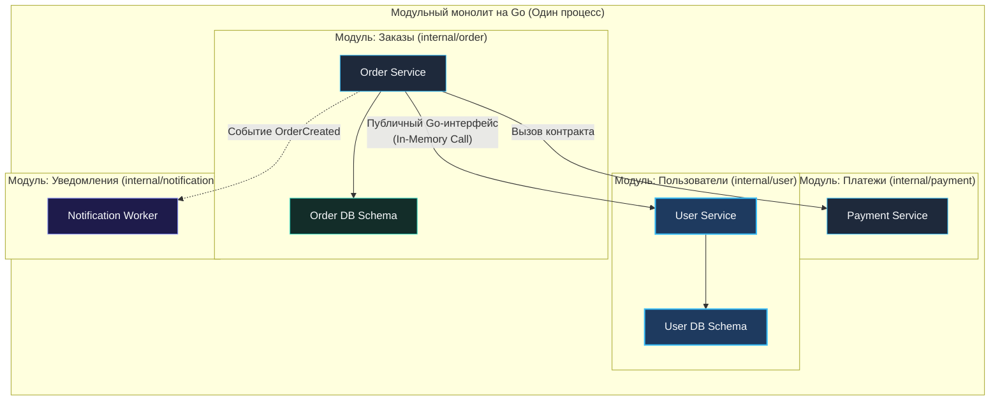
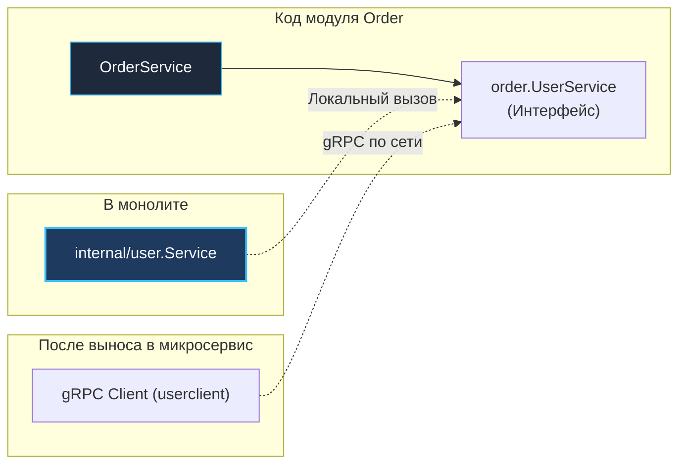

# Модульный монолит: Прагматичный баланс простоты и масштабируемости

> *«Преждевременная декомпозиция на микросервисы — корень многих эксплуатационных бед. Грамотно спроектированный модульный монолит обеспечивает четкость границ без необходимости платить налог распределенных систем».*    
> — Свободная интерпретация классического принципа Bell Labs

После подробного анализа двух полярных крайностей — бесструктурного монолита и распределенного мира микросервисов — перед системным архитектором встает закономерный вопрос: существует ли разумный промежуточный путь? 

Можно ли сохранить предельную простоту локальной разработки, мгновенные вызовы функций в стеке, ACID-транзакции в одной базе данных и деплой одним бинарным файлом, но при этом заложить строгую дисциплину, модульность и готовность к будущему масштабированию?

Ответ — **Модульный монолит (Modular Monolith)**.

В этой завершающей главе первого блока мы детально исследуем архитектуру модульного монолита, разберем конкретные шаблоны его построения средствами языка Go (`internal`, интерфейсы на стороне потребителя, внутрипроцессная шина событий) и обоснуем, почему для 90% новых проектов этот стиль является идеальной инженерной стратегией на первые годы развития.

---

### Что такое модульный монолит

**Модульный монолит** — это архитектурный стиль, при котором вся система компилируется в единый исполняемый бинарный файл и развертывается как один процесс операционной системы, однако внутренняя структура кодовой базы строго разделена на независимые, слабосвязанные доменные модули с жестко очерченными границами.

Каждый модуль инкапсулирует собственный бизнес-контекст (прямой аналог концепции Bounded Context из [[12. Domain Driven Design. Bounded Context и Aggregate]]) и общается с остальными частями системы исключительно через явные публичные контракты (Go-интерфейсы и DTO), не имея прямого доступа к внутренним типам или чужим таблицам базы данных.



Ключевое отличие от «бесструктурного монолита» — **принудительное соблюдение границ**. В классическом монолите разработчику легко «срезать угол», вызвав чужую SQL-функцию или импортировав внутренний пакет соседа. В модульном монолите подобные вольности жестко пресекаются на уровне компилятора Go и статических анализаторов.

---

### Построение модульного монолита в Go

Минималистичный дизайн языка Go предоставляет превосходный инструментарий для реализации модульного монолита без тяжелых сторонних фреймворков.

#### 1. Организация пакетов и защита через `internal`

Ключевой механизм изоляции — директива компилятора `internal`. Любой пакет, размещенный внутри директории с именем `internal/`, не может быть импортирован кодом, находящимся вне родительского каталога:

```
project/
├── cmd/
│   └── app/
│       └── main.go           # Точка сборки и связывания зависимостей
├── internal/
│   ├── order/                # Доменный модуль заказов
│   │   ├── handler.go        # HTTP handlers (доступны только main)
│   │   ├── service.go        # Чистая бизнес-логика
│   │   ├── repository.go     # Доступ к собственной схеме БД
│   │   └── model.go          # Внутренние структуры домена
│   ├── user/                 # Доменный модуль пользователей
│   │   ├── handler.go
│   │   ├── service.go
│   │   ├── repository.go
│   │   └── model.go
│   └── payment/              # Доменный модуль платежей
│       └── ...
├── pkg/                      # Общий платформенный код (Utilities)
│   ├── events/               # Внутрипроцессная событийная шина
│   ├── logger/
│   └── db/
└── go.mod
```

#### 2. Явные интерфейсы и Dependency Injection

Фундаментальный принцип инверсии зависимостей (DIP): **каждый модуль объявляет интерфейсы необходимых ему внешних зависимостей внутри собственного пакета**, не импортируя конкретные типы соседних модулей:

```go
// internal/order/service.go
package order

import "context"

type UserInfo struct {
	ID    string
	Email string
}

// UserService - интерфейс, сформулированный с точки зрения модуля заказов.
// Он объявлен в пакете order, а не в пакете user!
type UserService interface {
	GetUserForOrder(ctx context.Context, userID string) (*UserInfo, error)
}

type Repository interface{}
type PaymentService interface{}

type Service struct {
	userSvc UserService
	repo    Repository
	payment PaymentService
}

func NewService(userSvc UserService, repo Repository, payment PaymentService) *Service {
	return &Service{
		userSvc: userSvc,
		repo:    repo,
		payment: payment,
	}
}
```

Пакет `user` реализует метод с соответствующей сигнатурой, но пакет `order` не имеет ни малейшего представления о существовании каталога `internal/user`. Связывание всех модулей происходит исключительно в центральной точке входа — `cmd/app/main.go`:

```go
// cmd/app/main.go
package main

import (
	"database/sql"
	"myapp/internal/order"
	"myapp/internal/payment"
	"myapp/internal/user"
)

func main() {
	db := connectDB()

	userRepo := user.NewRepository(db)
	userSvc := user.NewService(userRepo)

	paymentSvc := payment.NewService()

	orderRepo := order.NewRepository(db)
	// userSvc автоматически и неявно удовлетворяет интерфейсу order.UserService!
	orderSvc := order.NewService(userSvc, orderRepo, paymentSvc)

	_ = orderSvc
	// Запуск HTTP-сервера с регистрацией роутов из модулей...
}

func connectDB() *sql.DB { return &sql.DB{} }
```

#### 3. Внутрипроцессная коммуникация через события

Для асинхронного уведомления модулей о произошедших фактах используется легковесная событийная шина на каналах Go:

```go
// pkg/events/bus.go
package events

import (
	"context"
	"sync"
)

type Event interface {
	Name() string
}

type Bus struct {
	mu   sync.RWMutex
	subs map[string][]chan Event
}

func NewBus() *Bus {
	return &Bus{subs: make(map[string][]chan Event)}
}

func (b *Bus) Subscribe(eventName string, ch chan Event) {
	b.mu.Lock()
	defer b.mu.Unlock()
	b.subs[eventName] = append(b.subs[eventName], ch)
}

func (b *Bus) Publish(ctx context.Context, event Event) {
	b.mu.RLock()
	defer b.mu.RUnlock()
	for _, ch := range b.subs[event.Name()] {
		select {
		case ch <- event:
		case <-ctx.Done():
			return
		default:
			// Non-blocking: не блокируем отправителя, если буфер подписчика заполнен
		}
	}
}
```

Модуль заказов публикует факт создания заказа, а модуль уведомлений реагирует на него, сохраняя абсолютную независимость:

```go
// internal/order/events.go
package order

type OrderCreatedEvent struct {
	OrderID string
}

func (e *OrderCreatedEvent) Name() string { return "OrderCreated" }
```

```go
// internal/notification/service.go
package notification

import (
	"context"
	"myapp/pkg/events"
)

type Service struct {
	eventBus *events.Bus
}

func (s *Service) Start(ctx context.Context) {
	ch := make(chan events.Event, 100)
	s.eventBus.Subscribe("OrderCreated", ch)
	go func() {
		for {
			select {
			case ev := <-ch:
				s.sendEmail(ev)
			case <-ctx.Done():
				return
			}
		}
	}()
}

func (s *Service) sendEmail(ev events.Event) {}
```

#### 4. Единая база данных, разделённая на схемы или префиксы таблиц

Модульный монолит работает с одной физической инсталляцией PostgreSQL, но сохраняет логическую инкапсуляцию данных:
- **Раздельные схемы PostgreSQL:** `orders.orders`, `users.users`. Каждый модуль подключается с собственными правами доступа, исключающими чтение чужих таблиц.
- **Префиксы таблиц:** `order_*`, `user_*` — упрощенная альтернатива для небольших проектов.

> [!warning] Ловушка / Gotcha: Соблазн междоменного JOIN
> Прямые вызовы SQL `JOIN` между таблицами разных модулей (`orders` и `users`) моментально разрушают архитектурные границы! Если разработчик выполняет междоменный `JOIN`, логика модулей намертво сплавляется в базе данных.  
> Вместо `JOIN` используйте:
> 1. Запрос к публичному API соседнего модуля.
> 2. Асинхронную денормализацию данных через события (проекции для чтения).

---

### Преимущества модульного монолита

#### Простота деплоя и эксплуатации
Один исполняемый бинарный файл, единый процесс, один конфигурационный файл. Никаких распределенных дедлоков, сложных Service Mesh и многочасовых согласований релизов.

#### Низкая задержка и высокая производительность
Все вызовы между модулями осуществляются через процессорный стек в пределах единого адресного пространства (наносекунды!). Нулевые накладные расходы на сеть, TCP-рукопожатия и сериализацию.

#### Сильная консистентность данных
В критических финансовых операциях внутри одного модуля по-прежнему доступны классические ACID-транзакции СУБД. При необходимости межмодульного взаимодействия применяется модель Eventual Consistency на основе событийной шины.

#### Эволюционность и готовность к разделению

Благодаря интерфейсным контрактам модульный монолит обладает свойством **эволюционной готовности к распилу**:



```go
// Было в main.go (локальный монолитный вызов):
userSvc := user.NewService(userRepo)

// Стало (после выноса модуля user в отдельный микросервис):
// gRPC-клиент реализует тот же самый интерфейс order.UserService!
userSvc := userclient.NewGRPCClient(conn)
```

В коде модуля `order` не меняется ни единой строчки!

> [!tip] Собеседование: Плавная миграция на микросервисы
> **Вопрос:** Как бы вы подошли к постепенному переходу от модульного монолита к микросервисам?  
> 
> **Ответ:** Я применю проверенный паттерн **Strangler Fig (Душитель)**:
> 1. Выберу модуль, обладающий максимальной независимостью по данным и требующий автономного масштабирования (например, модуль биллинга или каталога).
> 2. Создам для него независимый Go-репозиторий и подниму как отдельный микросервис с собственной базой данных.
> 3. В кодовой базе монолита заменю локальную реализацию интерфейса на gRPC-клиент (`userclient.NewGRPCClient(conn)`), полностью сохранив исходный контракт.
> 4. Перенаправлю трафик на уровне API Gateway. Шаг за шагом система эволюционирует в микросервисы без остановки бизнеса.

---

### Ограничения модульного монолита

#### Масштабирование только вместе
Монолит масштабируется исключительно как единое целое: при нехватке памяти для одного модуля приходится реплицировать весь процесс. Однако в 90% проектов вертикальный запас серверов перекрывает эту проблему.

#### Единая кодовая база для большой команды
При штате более 20–30 разработчиков координация в одном монорепозитории требует строгой дисциплины владельцев кода через файл `CODEOWNERS`.

#### Отсутствие технологической свободы
Все модули монолита разрабатываются на языке Go. Однако учитывая скорость и универсальность Go, для серверной разработки это скорее преимущество, снижающее фрагментацию стека.

---

### Сравнение архитектурных стилей

| Характеристика | Бесструктурный монолит | Модульный монолит | Микросервисы |
|---|---|---|---|
| **Связность компонентов** | Высокая (хаотичные импорты) | **Низкая (жесткие интерфейсы)** | Предельно низкая (сетевая изоляция) |
| **Задержка вызовов** | Наносекунды (стек) | **Наносекунды (стек)** | Миллисекунды (сеть) |
| **Транзакции данных** | Глобальный ACID | **ACID внутри модуля / Eventual** | Распределенные саги (Saga / 2PC) |
| **Деплой и артефакт** | 1 бинарник | **1 бинарник** | Десятки независимых контейнеров |
| **Сложность инфраструктуры** | Минимальная | **Минимальная** | Очень высокая (K8s, Mesh, Jaeger) |
| **Скорость разработки (MVP)** | Высокая на старте, падает | **Стабильно высокая годами** | Низкая на старте (накладные расходы) |
| **Готовность к распилу** | Практически невозможен | **Тривиальна (через интерфейсы)** | Исходно разделены |

---

### Когда выбирать модульный монолит

- **Новые проекты и стартапы:** Достижение Product-Market Fit и скорость итераций важнее гипотетической микросервисной автономии.
- **Команды до 20–30 инженеров:** Идеальный баланс координации и скорости поставки фич.
- **Сложные развивающиеся предметные области:** Модульный монолит позволяет уточнять доменные границы (Bounded Contexts) без боли перекраивания сетевых API.
- **Высокие требования к задержкам и простоте:** Нежелание раздувать облачные счета на DevOps-инфраструктуру.

> [!info] Под капотом: Mechanical Sympathy модульного монолита
> С точки зрения рантайма Go, модульный монолит максимально эффективен: одна куча, один GC, общий пул горутин. Нет накладных расходов на сериализацию и сетевые вызовы между «сервисами». Планировщик Go эффективно распределяет нагрузку всех модулей по ядрам CPU. Это позволяет достичь впечатляющей производительности на скромном железе.

---

### Итог

Модульный монолит — это не временный суррогат, а **золотой стандарт прагматичной архитектуры бэкенда**. Он обеспечивает высочайшую дисциплину кодовой базы и гарантирует бесшовный эволюционный переход к микросервисам ровно в тот момент, когда это действительно потребуется бизнесу.

Язык Go с его защитой пакетов через `internal`, неявными интерфейсами и молниеносной компиляцией является лучшим инструментом в индустрии для построения модульных монолитов.

Мы завершили фундаментальный первый блок: от физики системных требований и компромиссов масштабирования до выбора глобального архитектурного стиля. 

В следующем блоке мы перейдем к внутреннему проектированию сервисов, исследованию эволюции архитектурных стилей и паттернам Enterprise-разработки: [[11. Service Oriented Architecture и эволюция архитектур]].
