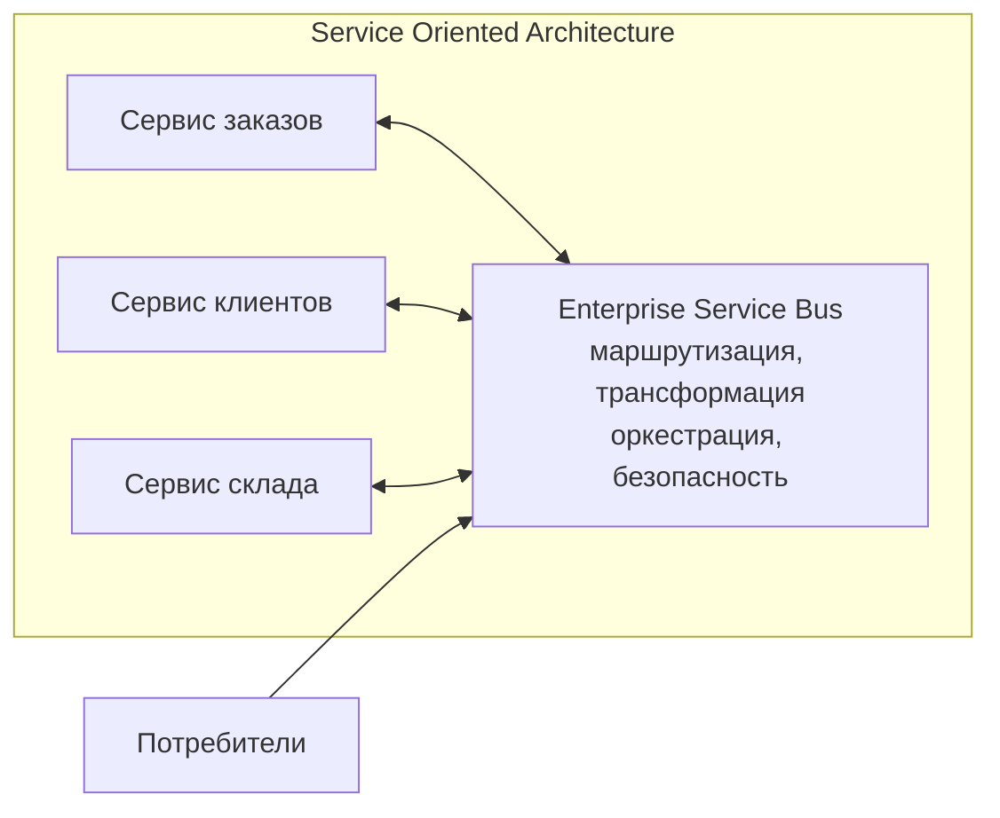
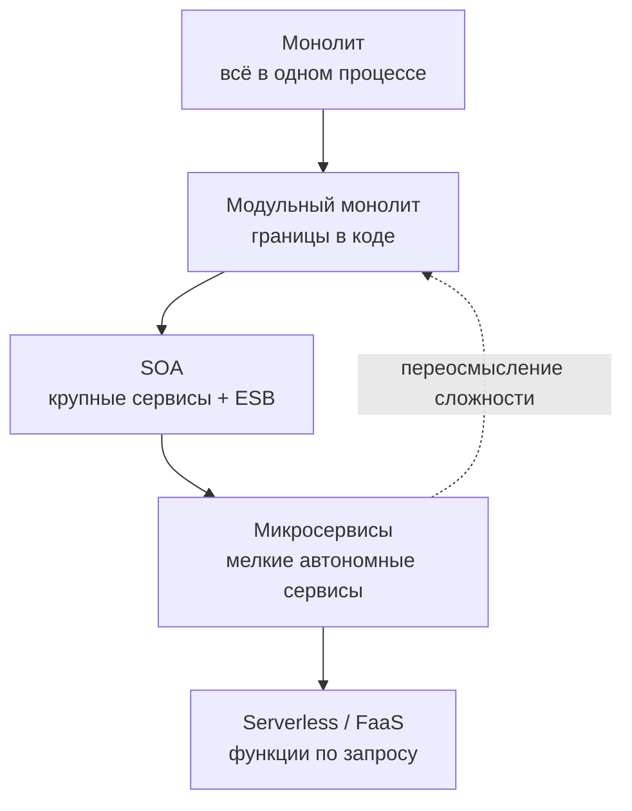

Прежде чем микросервисы стали индустриальным мейнстримом, мир корпоративного бэкенда прошёл через масштабную и поучительную эпоху **Service Oriented Architecture (SOA)**. Понимание SOA принципиально важно не только ради исторического кругозора: именно здесь кроются корни как величайших архитектурных находок распределённых систем, так и самых болезненных граблей, на которые по сей день наступают команды при переходе на микросервисы.

Как любил повторять Кен Томпсон, «нельзя исправить то, устройство чего ты не понимаешь». В этой главе мы проследим эволюцию архитектурных парадигм — от монолитов через расцвет и кризис SOA к микросервисам и современным модульным монолитам, формулируя бескомпромиссные инженерные выводы для Go-разработчика.

---

### Что такое SOA

**Service Oriented Architecture (SOA)** — архитектурный стиль, зародившийся в конце 1990-х и стандартизированный в начале 2000-х годов консорциумами вроде OASIS и W3C. Он предполагал построение масштабируемых корпоративных платформ из слабосвязанных, повторно используемых сервисов, взаимодействующих через строгие машиночитаемые протоколы (преимущественно SOAP, WSDL и XML Schema).

SOA возникла как отчаянная попытка спастись от хаоса так называемого «зоопарка корпоративных систем». В банках, страховых гигантах и телекомах параллельно трудились десятки разрозненных приложений (от мейнфреймов IBM на COBOL до серверов баз данных и систем на C++), где одни и те же сущности (клиент, транзакция, счёт) реализовывались заново сотни раз.

```
       Традиционный корпоративный хаос (Point-to-Point Spaghetti)
      [Mainframe] <=======> [CRM Oracle] <=======> [Billing C++]
           ^  \                 /     \                /  ^
           |   \_______________/_______\______________/__ |
           |                  /         \                 |
           v                 v           v                v
      [Web Portal] <=====> [Warehouse] <=====> [Reporting SAP]
             Связность: O(N²) интеграций, хрупкость при любом обновлении!
```

Ключевые принципы SOA:
- **Сервис-ориентированность**: фундаментальные бизнес-способности предприятия оформляются как автономные сервисы с формализованными контрактами.
- **Слабая связанность**: сервисы не зависят от внутренней реализации, операционной системы и стека технологий друг друга.
- **Повторное использование**: каждый сервис проектируется с расчётом на то, что его API будут потреблять десятки различных корпоративных клиентов.
- **Стандартизированный протокол**: унифицированный стек спецификаций (SOAP, WSDL, UDDI, XML Schema, WS-Security).
- **Enterprise Service Bus (ESB)** — центральная шина предприятия, через которую маршрутизируются и трансформируются все межсервисные вызовы.



---

### Enterprise Service Bus: сердце и ахиллесова пята SOA

**Enterprise Service Bus (ESB)** задумывался архитекторами как волшебный швейцарский нож корпоративной интеграции — интеллектуальный посредник, соединяющий несовместимые технологии без изменения самих сервисов.

На ESB возлагались титанические задачи:
- **Маршрутизация сообщений**: поиск целевого сервиса по содержимому пакета (Content-Based Routing).
- **Трансформация данных**: конвертация XML-диалектов, сопоставление схем (XSLT-трансформации, XML ↔ JSON).
- **Оркестрация бизнес-процессов**: выполнение сложных сценариев (BPEL — Business Process Execution Language), когда для проводки платежа шина последовательно опрашивает пять сервисов.
- **Управление нефункциональными требованиями**: единая точка для шифрования, аудита, авторизации, транзакций и мониторинга.

#### В чём заключалась фатальная ловушка?
На бумаге концепция выглядела безупречно. Однако на практике ESB быстро превратился в **гигантский, неповоротливый централизованный супермонолит**. 

Представьте центральный почтамт, сотрудники которого обязаны не просто пересылать конверты, а вскрывать каждое входящее письмо, переводить его с латыни на старофранцузский, заверять у трёх нотариусов, собирать ответы от пяти адресатов и склеивать их в новый свиток. 

Вся критическая бизнес-логика интеграции утекала из прикладного кода сервисов в недра проприетарной шины. В результате:
1. **Единая точка отказа (SPOF)**: падение кластера ESB полностью парализовало жизнедеятельность компании.
2. **Очередь в команду интеграции**: чтобы добавить одно поле в контракт сервиса, разработчикам требовалось ждать неделями, пока инженеры шины перенастроят XSLT-шаблоны и маршруты в ESB.
3. **Катастрофические накладные расходы**: бесконечный парсинг мегабайтных XML-деревьев на лету прожигал ядра процессоров.

> [!info] Под капотом
> Классические ESB строились на базе Java-контейнеров (Apache Camel, Mule ESB, IBM WebSphere, TIBCO, Oracle Service Bus). Пересылка каждого сообщения через стек XML/SOAP требовала многократной сериализации, парсинга DOM-дерева в памяти и валидации по XML Schema. Это порождало колоссальные накладные расходы по CPU и аллокациям памяти, заставляя серверы задыхаться в паузах сборки мусора (Stop-The-World GC).
> 
> В философии Go аналогов тяжеловесных ESB просто нет. Инженеры Go исповедуют канонический Unix-подход: сетевой транспорт обязан быть предельно прозрачным и быстрым (gRPC/Protobuf, NATS, Kafka), а логика обработки и валидации должна жить на концах соединения — в скомпилированном бинарнике сервиса («умные конечные точки, глупые каналы»).

---

### SOA vs Микросервисы: в чём разница

Когда в 2010-х годах заговорили о микросервисах, многие ветераны индустрии скептически хмыкнули: «Мы делали это десять лет назад под вывеской SOA!». Однако микросервисы не были простым ребрендингом; они стали диалектическим отрицанием ошибок SOA. Недаром Мартин Фаулер и Адриан Кокрофт назвали микросервисы «SOA, сделанной правильно».

| Аспект | SOA (2000-е) | Микросервисы (современный подход) |
|---|---|---|
| **Размер сервиса** | Крупные, охватывающие целые бизнес-домены (например, «Управление клиентами всего банка») | Мелкие, сфокусированные на одном Bounded Context |
| **Протокол** | SOAP/XML, WSDL, тяжеловесные RPC со сложными спецификациями | Легковесные REST/JSON, gRPC/Protobuf, бинарные потоки сообщений |
| **Интеграционная шина** | Тяжёлый ESB, инкапсулирующий логику маршрутизации и трансформации | Легковесный message bus или прямые вызовы точка-точка |
| **Владение данными** | Общая корпоративная модель данных (Canonical Data Model) и общая СУБД | Каждый сервис владеет своей изолированной БД (Database-per-Service) |
| **Развёртывание** | Монолитное, на общих Application Server'ах (WebLogic, WebSphere) | Полностью независимое: контейнеры Docker, Kubernetes, Linux cgroups v2 |
| **Управление** | Централизованный реестр сервисов (UDDI, корпоративный каталог) | Децентрализованный Service Discovery (Consul, etcd, DNS, K8s CoreDNS) |
| **Философия** | Повторное использование любой ценой (Reuse over Autonomy) | Автономность и скорость поставки ценности командами |

Мартин Фаулер сформулировал фундаментальный девиз микросервисной революции: **«Умные конечные точки и глупые каналы» (Smart endpoints and dumb pipes)**. Шина должна лишь передавать байты с максимальной скоростью, не пытаясь вникать в их бизнес-смысл.

---

### Эволюция архитектур: от монолита к микросервисам и обратно

Эволюция программных систем не движется по прямой линии. Она напоминает колебания маятника между централизацией и децентрализацией, где каждый новый виток спирали учитывает опыт предыдущих катастроф:



1. **Монолит** — естественная отправная точка любого программного проекта. Он обеспечивает наивысшую скорость прототипирования и локальную целостность транзакций. Однако с ростом штата инженеров монолит неизбежно начинает буксовать в координационном аду.
2. **SOA** — первая масштабная попытка enterprise-индустрии разделить монолит на управляемые части и достичь повторного использования. Избыточная централизация вокруг ESB и дороговизна инструментов сделали этот стиль привилегией богатых корпораций.
3. **Микросервисы** — ответ Кремниевой долины на неповоротливость SOA, помноженный на революцию облачной инфраструктуры и Linux-контейнеров. Архитектура сделала ставку на независимость релизных циклов и децентрализацию данных.
4. **Модульный монолит** — закономерная реакция индустрии на чудовищную операционную сложность микросервисов («налог на сеть», distributed tracing, eventual consistency). Это возврат к единому исполняемому процессу, но со строжайшей дисциплиной инкапсуляции и доменных границ в самом коде.
5. **Serverless / FaaS** — экстремальная форма декомпозиции, где единицей развёртывания и тарификации становится отдельная функция, вызываемая по событию.

---

### Уроки SOA для современного Go-разработчика

Хотя классический стек WS-* и SOAP сегодня воспринимается как технологический антиквариат, концептуальные грабли SOA по-прежнему подстерегают каждого проектировщика бэкенда. Выделим четыре фундаментальных урока, которые обязан усвоить каждый Go-инженер:

#### 1. Опасность «канонической модели данных»

Архитекторы SOA свято верили в возможность создания **Canonical Data Model** — единого всеобъемлющего XML-словаря сущностей всей компании. Если в банке существовало понятие `Customer`, оно должно было содержать все возможные поля: от паспортных данных и налогового номера до кредитного рейтинга и любимого цвета галстука.

К чему это приводило на практике? Любое добавление поля в контракт сервиса кредитования требовало пересогласования общекорпоративной схемы, каскадной пересборки десятков смежных сервисов и синхронного деплоя. 

Современный Go-инженер помнит заповедь: **«Каждый сервис/модуль владеет своей моделью данных»**. В разных контекстах одна и та же реальная сущность моделируется совершенно разными типами:

```go
package order

// internal/order/model.go - внутренняя приватная модель домена.
// Пакет инкапсулирует бизнес-правила и защищает инварианты.
type Order struct {
    ID     string
    userID string // приватное поле, не экспортируется за пределы пакета
    items  []Item
}

// pkg/orderapi/dto.go - публичный контракт (DTO) для внешних клиентов.
// Он намеренно отделен от внутренней доменной структуры:
// мы можем менять внутренности Order, не ломая клиентов нашего API.
type OrderResponse struct {
    ID    string `json:"id"`
    Items []Item `json:"items"`
}
```

В Go инкапсуляция на уровне пакетов (`internal/`) делает эту изоляцию естественной и поддерживаемой компилятором на этапе сборки.

#### 2. Избегайте «умного канала»

Если брокер сообщений или прокси-слой начинает проверять баланс пользователя, валидировать права доступа к строкам в БД или трансформировать схемы документов — вы немедленно строите медленный, труднотестируемый и монолитный ESB.

В Go-мире мы исповедуем строгое правило: **«Умные конечные точки, глупые каналы»**:
- Вся валидация, логика обработки и обработка краевых случаев сосредоточены внутри Go-сервиса.
- Брокеры сообщений (NATS, Apache Kafka, RabbitMQ) используются исключительно как высокоскоростные шины передачи сырых байтов без внедрения бизнес-скриптов.
- Для синхронного межсервисного взаимодействия применяются прямые вызовы gRPC/HTTP с прозрачными, типобезопасными скомпилированными клиентами.

#### 3. Контракты важнее протоколов

SOA ошибочно возвела конкретный транспортный формат (XML/SOAP) в абсолют. Микросервисы доказали, что жизнеспособность системы определяется не протоколом, а **строгостью и стабильностью контракта**.

Сегодня золотым стандартом для Go-микросервисов является schema-first подход:
- **gRPC / Protocol Buffers (`.proto`)**: компактный бинарный формат с прямой кодогенерацией в структуры Go и интерфейсы клиентов/серверов.
- **OpenAPI 3.0 (`swagger`)**: документированные REST-контракты с генерацией серверного кода с помощью `oapi-codegen`.

Компилятор Go и сгенерированные заглушки превращают проверку совместимости контракта в элементарную проверку типов во время компиляции, устраняя необходимость в громоздких runtime-валидаторах.

#### 4. Осторожность с повторным использованием

Стремление к абсолютному повторному использованию (DRY, доведённый до абсурда) породило в эпоху SOA печально известные «общие сервисы утилит» и «разделяемые базы данных». Если изменение одной функции форматирования адреса требует согласования с 30 командами — вы создали архитектурный затор.

В культуре Go и микросервисов действует более прагматичный подход: **«Повторное использование через копирование или разделяемые библиотеки, а не через общие сервисы»**. 

Как гласит знаменитая пословица Роба Пайка:
> *«A little copying is better than a little dependency» (Немного копирования лучше, чем небольшая зависимость).*

Если двум модулям требуется похожая логика сериализации или валидации, предпочтительнее вынести её в стабильную внутреннюю библиотеку (`pkg/`) либо даже допустить небольшое дублирование кода, сохранив полную независимость команд при деплое.

---

### Mechanical Sympathy: SOA с точки зрения Go

Давайте посмотрим на архитектурное наследие сквозь призму вычислительного железа (Mechanical Sympathy). Если бы идеалы SOA реализовывались на современном Go-стеке, фундаментальная картина кардинально изменилась бы:

```
            Сравнение вычислительного профиля
 
 [Классический Enterprise SOA (Java/XML)]
  Request -> [TLS 1.2] -> [Thread per Conn] -> [XML DOM Tree Heap Parser] 
          -> [Reflective Serializer] -> [ESB Message Queue]
  Память: ~500 МБ - 2 ГБ на инстанс, Stop-the-world GC, промахи L1/L2 кэша.

 [Современный Go микросервис / модуль]
  Request -> [TLS 1.3 / kTLS] -> [Netpoller epoll] -> [Goroutine (stack 2KB)]
          -> [Protobuf Zero-Copy Unmarshal] -> [Zero-Allocation Dispatch]
  Память: ~15-30 МБ на инстанс, GC < 1 мс, непрерывные участки памяти (CPU Cache-friendly).
```

- **Легковесные сервисы вместо Application Server'ов**: Приложения Go компилируются в единый статически слинкованный бинарник без внешних runtime-зависимостей. Никаких гигабайтных JVM, серверов приложений и сотен XML-дескрипторов развёртывания.
- **Минимальное потребление памяти**: Базовый сервис на Go потребляет десятки мегабайт оперативной памяти вместо сотен мегабайт или гигабайт, что снижает TCO (Total Cost of Ownership) облачной инфраструктуры на порядок.
- **Горутины и netpoller**: Вместо тяжеловесных потоков операционной системы (где 10 000 подключений съедают 10 ГБ стековой памяти), рантайм Go мультиплексирует миллионы сетевых дескрипторов через системные вызовы `epoll` / `kqueue` в компактные стеки горутин размером от 2 КБ.
- **Контексты и таймауты**: Пакет `context.Context` в стандартной библиотеке Go делает управление жизненным циклом распределённого вызова (дедлайны, отмена, трассировка) первоклассным гражданином языка, предотвращая утечки ресурсов при каскадных сбоях.

Однако закон сохранения архитектурной сложности неумолим: централизованный ESB порождает архитектурную ловушку вне зависимости от используемого языка программирования.

---

### Эволюция интеграции: от ESB к Service Mesh

Спираль истории сделала удивительный виток: в эпоху Kubernetes потребность в централизованном управлении межсервисным трафиком вернулась под новым флагом — **Service Mesh** (Istio, Linkerd, Cilium Service Mesh).

Но между классическим ESB и современным Service Mesh пролегает непреодолимая концептуальная граница:

```
 [ESB (SOA)]:
  Сервис А ----(SOAP)----> [ ESB: Бизнес-роутинг, XSLT, Аудит, Транзакции ] ----(SOAP)----> Сервис Б
                            ↑ Логика приложения внутри шины!
 
 [Service Mesh (Kubernetes)]:
  [Сервис А] (бизнес-код)                 [Сервис Б] (бизнес-код)
       ↓ (localhost)                            ↑ (localhost)
  [Envoy Sidecar] ---------(mTLS, gRPC)--------> [Envoy Sidecar]
       (Сетевая инфраструктура: трассировка, ретраи, circuit breaker, метрики)
```

- **ESB** вмешивался в прикладной уровень (Application Layer) и брал на себя трансформацию бизнес-данных и оркестрацию сценариев.
- **Service Mesh** действует исключительно на уровне сетевой инфраструктуры (L4/L7 проксирование через sidecar-контейнеры Envoy или eBPF). Он решает инфраструктурные задачи: взаимная аутентификация через **mTLS**, распределённая трассировка, автоматические повторы (**retry**), размыкание цепи (**circuit breaking**) и сбор метрик. Бизнес-логика остаётся священной собственностью самого сервиса.

Более того, для подавляющего большинства сервисов на Go широкие возможности стандартного транспорта `grpc-go` (`google.golang.org/grpc`) (клиентская балансировка round-robin, интерцепторы, встроенный health checking) позволяют обходиться вовсе без оверхеда на sidecar-прокси.

---

> [!tip] Собеседование
> **Вопрос:** В чём принципиальное отличие SOA от микросервисной архитектуры, и почему SOA часто называют «великой идеей с провальной реализацией»?
> **Ответ:**
> 1. **Размер и границы**: SOA оперировала крупными сервисами, часто охватывавшими целые функциональные департаменты предприятия; микросервисы дробят систему на изолированные Bounded Contexts.
> 2. **Интеграция**: SOA полагалась на «умный» и централизованный ESB с тяжеловесной бизнес-логикой маршрутизации и трансформации XML; микросервисы исповедуют девиз «умные конечные точки, глупые каналы» (gRPC, NATS, Kafka).
> 3. **Данные**: SOA наивно стремилась к единой общекорпоративной модели данных (Canonical Data Model) и часто оставляла под сервисами общую БД; микросервисы строго изолируют хранилища по принципу Database-per-Service.
> 4. **Организационный контекст**: SOA внедрялась централизованно «сверху вниз», игнорируя организационную структуру команд; микросервисы органично реализуют Закон Конвея, где автономный сервис разрабатывается и деплоится одной независимой кросс-функциональной командой (Two-Pizza Team).
> SOA не была ошибочной в своей основе — она подарила индустрии идею сервис-ориентированности, но технологии тех лет (тяжёлый стек Java EE, XML/SOAP, монолитные ESB) не обладали механической гибкостью современных контейнеров и скомпилированных языков вроде Go.

---

### Итог

Глубокое понимание SOA и эволюции архитектур защищает инженера от повторения классических ошибок прошлых поколений. Большинство современных «лучших практик» микросервисов — контрактное программирование, слабая связанность, оркестрация API — были выкованы именно в горниле SOA. В то же время популярные архитектурные антипаттерны современности (распределённый монолит, общекорпоративная база данных, превращение Kafka в аналог ESB с кастомными плагинами маршрутизации) — это точное воспроизведение старых тупиков.

Как Go-разработчик, используйте уроки истории: делайте сервисы автономными, держите каналы связи глупыми и быстрыми, а границы доменов защищайте строгими типами компилятора.

Теперь, вооружившись пониманием эволюции архитектурных стилей, мы переходим к методологии, которая помогает безошибочно проводить границы между сервисами и модулями — **Domain-Driven Design**. В следующей главе мы разберём фундаментальные концепции DDD: [[12. Domain Driven Design. Bounded Context и Aggregate]].
