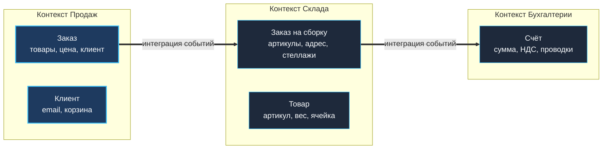

После знакомства с макроархитектурными стилями мы неизбежно упираемся в фундаментальный инженерный вопрос: **по каким линиям разрезать систему на модули или микросервисы?** 

В предыдущих главах мы убедились, что и распределённый монолит, и скопление микроскопических «наносервисов» одинаково губительны для проекта. Корнем обеих катастроф почти всегда является волюнтаристское проведение границ: когда систему делят по случайным признакам (например, «слой контроллеров», «слой баз данных» или «сервис отправки писем») вместо естественных границ реального бизнеса.

Методология **Domain-Driven Design (DDD)**, сформулированная Эриком Эвансом в 2003 году, даёт строгий математический и понятийный аппарат для решения этой задачи. В этой главе мы сосредоточимся на двух краеугольных камнях DDD: **Bounded Context (Ограниченный контекст)** и **Aggregate (Агрегат)**. Мы разберём их без академической схоластики, с позиций практикующего Go-инженера: как эти концепции формируют структуру пакетов, раскладку структур в памяти, транзакционную изоляцию в СУБД и предотвращают гонки данных в многопоточной среде.

---

### DDD как ответ на сложность предметной области

Главный источник энтропии в долгоживущем промышленном ПО — это не выбор базы данных и не протокол сериализации, а постоянное усложнение самой **предметной области (домена)**. Когда программисты начинают мыслить исключительно таблицами реляционной СУБД или JSON-схемами HTTP-эндпоинтов, прикладной код мгновенно вырождается в так называемую «анемичную модель» — набор пассивных структур данных, размазанных по сотням разрозненных процедур.

DDD предлагает принципиально иной вектор мышления:
1. **Единый язык (Ubiquitous Language)**: разработчики и эксперты бизнеса говорят на одном строго определённом диалекте. Если в бизнесе говорят «сформировать накладную», в Go-коде обязан появиться метод `GenerateWaybill()`, а не абстрактный `SetStatus(4)`.
2. **Фокус на доменной модели**: бизнес-правила и инварианты инкапсулируются в самодостаточных типах данных, полностью очищенных от внешних зависимостей (SQL, HTTP, gRPC).
3. **Отказ от фреймворков-монстров**: для Go-разработчика DDD вовсе не означает нагромождения сотен абстрактных классов. Идиоматический Go с его лаконичными структурами, структурной типизацией интерфейсов и строгой пакетной изоляцией является идеальным инструментом для воплощения тактических паттернов DDD.

---

### Bounded Context: лингвистические и функциональные границы

**Bounded Context (Ограниченный контекст)** — это явная понятийная граница, внутри которой модель предметной области имеет строгое, единое и абсолютно непротиворечивое значение.

Ключевой фактор здесь — **контекст человеческого языка**. В реальной жизни одно и то же слово означает кардинально разные вещи в зависимости от того, в каком кабинете компании его произносят:

**Пример: Жизнь термина «Заказ» (Order)**
- В контексте **Продаж (Sales)** заказ — это коммерческая сделка: корзина товаров, скидочный купон, сумма к оплате, статус холдирования денег на карте.
- В контексте **Склада (Fulfillment)** заказ — это физическая инструкция по комплектации: габариты коробки, вес упаковки, маршрут комплектовщика по стеллажам и штрихкоды артикулов (SKU).
- В контексте **Бухгалтерии (Accounting)** заказ — это финансовый документ строгой отчётности: налоговые ставки, проводки по дебету/кредиту, закрывающие акты и счёт-фактура.



Попытка слить эти требования в одну титаническую структуру `Order` с полусотней полей порождает бесформенного монстра (God Object). Программист склада будет случайно затирать скидочные коэффициенты продажников, а бухгалтерский аудит упадёт из-за того, что курьер обновил статус доставки. DDD предписывает: **разделите модели на разные Bounded Contexts**.

#### Bounded Context и Go-пакеты

В экосистеме Go наиболее естественным выражением Bounded Context является **пакет (package)** или изолированная группа пакетов под деревом `internal/`. Каждый пакет получает суверенное пространство имён, где термины свободны от чужеродных префиксов:

```
ecommerce/
├── sales/
│   ├── order.go          // type Order struct { Items []Item; Total Price }
│   └── customer.go
├── fulfillment/
│   ├── order.go          // type Order struct { SKUs []string; Address string }
│   └── inventory.go
├── accounting/
│   ├── invoice.go        // type Invoice struct { OrderID string; NetAmount Money }
│   └── ledger.go
└── shared/
    └── money.go          // type Money struct { Amount int64; Currency string }
```

Обратите внимание на красоту идиоматического Go: имя типа `Order` повторяется в разных подпакетах, но никакого конфликта идентификаторов не возникает! При импорте контекст виден предельно наглядно: `sales.Order` никогда не спутается с `fulfillment.Order`.

> [!warning] Ловушка / Gotcha
> **Совместное использование моделей между контекстами** — классический архитектурный антипаттерн. 
> Никогда не пытайтесь создать пакет `shared.Order` и использовать его одновременно на складе, в биллинге и на витрине. Это моментально свяжет несовместимые жизненные циклы жестким узлом. При пересечении границ контекстов данные **всегда** должны мапиться в явные контракты (DTO или доменные события).

---

### Aggregate: гарант консистентности

Если Bounded Context определяет внешние **лингвистические** границы, то **Aggregate (Агрегат)** задаёт внутренние **транзакционные** границы целостности данных.

**Агрегат** — это кластер тесно связанных доменных объектов (Entities и Value Objects), который внешняя система обязана воспринимать и изменять как неделимый атомарный монолит.

Агрегат держится на трёх незыблемых правилах:
1. **Корень агрегата (Aggregate Root)**: главная сущность кластера. Внешний мир не имеет права напрямую обращаться к внутренним объектам агрегата; любая мутация проходит исключительно через публичные методы корня агрегата.
2. **Инварианты**: фундаментальные бизнес-правила, которые ни при каких обстоятельствах не могут быть нарушены. Корень агрегата лично гарантирует, что любое изменение оставляет агрегат в валидном состоянии.
3. **Глобальная идентичность**: только Aggregate Root обладает глобальным уникальным идентификатором (UUID, снежинка Snowflake или первичный ключ СУБД). Внутренние сущности идентифицируются лишь локально в контексте своего корня.

#### Анатомия агрегата на Go

Рассмотрим агрегат `Order` в контексте продаж. В него входят сам заказ и позиции заказа (`OrderLine`).
Бизнес-инвариант гласит: *«Сумма заказа TotalAmount обязана в точности равняться сумме стоимости всех позиций. Изменять состав подтверждённого заказа запрещено. Количество единиц товара всегда строго положительно»*.

```go
// sales/order.go
package sales

import (
    "errors"
    "fmt"
)

var (
    ErrInvalidQuantity   = errors.New("quantity must be positive")
    ErrOrderAlreadyFixed = errors.New("cannot modify confirmed order")
)

type OrderID string

type OrderStatus int

const (
    StatusDraft OrderStatus = iota
    StatusConfirmed
    StatusCancelled
)

// Money - Value Object: иммутабельный тип, равенство определяется по значениям полей.
type Money struct {
    Amount   int64  // в копейках/центах во избежание погрешностей float
    Currency string
}

func (m Money) Add(o Money) Money {
    if m.Currency != o.Currency {
        panic("currency mismatch in monetary operation")
    }
    return Money{Amount: m.Amount + o.Amount, Currency: m.Currency}
}

func (m Money) Multiply(qty int) Money {
    return Money{Amount: m.Amount * int64(qty), Currency: m.Currency}
}

// Order - Корень агрегата (Aggregate Root).
type Order struct {
    ID          OrderID
    CustomerID  string
    Lines       []OrderLine // Сущности внутри агрегата
    TotalAmount Money
    Status      OrderStatus
}

// OrderLine - Внутренняя сущность агрегата, не имеет самостоятельной глобальной ценности.
type OrderLine struct {
    ProductID string
    Quantity  int
    UnitPrice Money
}

// AddLine - Метод корня агрегата: ЕДИНСТВЕННЫЙ законный способ добавить товар.
func (o *Order) AddLine(productID string, qty int, price Money) error {
    if o.Status != StatusDraft {
        return ErrOrderAlreadyFixed
    }
    if qty <= 0 {
        return ErrInvalidQuantity
    }

    // Проверяем, есть ли уже такой товар в позициях:
    for i := range o.Lines {
        if o.Lines[i].ProductID == productID {
            o.Lines[i].Quantity += qty
            o.recalculateTotal()
            return nil
        }
    }

    // Добавляем новую позицию
    o.Lines = append(o.Lines, OrderLine{
        ProductID: productID,
        Quantity:  qty,
        UnitPrice: price,
    })
    o.recalculateTotal()
    return nil
}

// recalculateTotal - приватный инвариантный пересчет.
func (o *Order) recalculateTotal() {
    total := Money{Amount: 0, Currency: "RUB"}
    for _, line := range o.Lines {
        total = total.Add(line.UnitPrice.Multiply(line.Quantity))
    }
    o.TotalAmount = total
}
```

Почему эта схема надёжна?
- Сторонний код лишен возможности напрямую записать произвольное число в `TotalAmount`.
- Нельзя положить отрицательное количество позиций.
- Агрегат выступает строгим конечным автоматом (FSM), где переход в статус `StatusConfirmed` блокирует дальнейшие мутации.

> [!info] Под капотом
> Агрегат в DDD — это не пассивный контейнер для сериализации данных, а формальный конечный автомат. 
> Транзакционная граница агрегата означает непреложное правило: **все изменения внутри агрегата обязаны персиститься в базу данных в рамках единой неделимой ACID-транзакции**. Если сохранился заголовок `Order`, но сбойнул `OrderLine`, транзакция целиком откатывается назад. В то же время изменение двух разных агрегатов в одной ACID-транзакции в DDD считается дурным тоном — междоменная консистентность должна быть гарантирована в конечном счёте (Eventual Consistency).

---

### Реализация репозитория для агрегата

Второй фундаментальный постулат: **Репозитории создаются только для корней агрегатов**.
Не существует репозиториев для `OrderLine`, отдельных строк таблицы или вложенных узлов!

```go
// sales/repository.go
package sales

import "context"

type OrderRepository interface {
    Save(ctx context.Context, order *Order) error
    GetByID(ctx context.Context, id OrderID) (*Order, error)
    // Нет методов для сохранения отдельных OrderLine!
}
```

Репозиторий берет на себя всю грязную работу взаимодействия со слоем хранения. При сохранении он раскладывает агрегат по реляционным таблицам или упаковывает в JSONB или отдельную таблицу с `ON DELETE CASCADE`, а при чтении — воссоздает **весь агрегат целиком**, восстанавливая все его инварианты:

```go
// internal/postgres/order_repo.go
package postgres

import (
    "context"
    "database/sql"
    "ecommerce/sales"
)

type OrderRepo struct {
    db *sql.DB
}

func (r *OrderRepo) Save(ctx context.Context, order *sales.Order) error {
    tx, err := r.db.BeginTx(ctx, nil)
    if err != nil {
        return err
    }
    defer tx.Rollback()

    // 1. Сохраняем заголовок Order
    _, err = tx.ExecContext(ctx, `
        INSERT INTO orders (id, customer_id, total_amount, currency, status) 
        VALUES ($1, $2, $3, $4, $5)
        ON CONFLICT (id) DO UPDATE SET 
            total_amount = EXCLUDED.total_amount,
            status = EXCLUDED.status`,
        order.ID, order.CustomerID, order.TotalAmount.Amount, order.TotalAmount.Currency, order.Status)
    if err != nil {
        return err
    }

    // 2. Атомарно обновляем строки позиций (упрощенная перезапись)
    _, err = tx.ExecContext(ctx, `DELETE FROM order_lines WHERE order_id = $1`, order.ID)
    if err != nil {
        return err
    }

    // 3. Вставляем актуальный срез позиций
    for _, line := range order.Lines {
        _, err = tx.ExecContext(ctx, `
            INSERT INTO order_lines (order_id, product_id, qty, price, currency) 
            VALUES ($1, $2, $3, $4, $5)`,
            order.ID, line.ProductID, line.Quantity, line.UnitPrice.Amount, line.UnitPrice.Currency)
        if err != nil {
            return err
        }
    }

    return tx.Commit()
}
```

---

### Mechanical Sympathy: агрегаты, транзакции и конкурентность

В высоконагруженном Go-бэкенде веб-сервер обслуживает сотни одновременных запросов в параллельных горутинах. Представьте, что клиент с двух мобильных устройств одновременно нажал кнопку «Добавить товар в корзину»:

```
 Горутина А: Загружает Order (Lines: 1) -> AddLine(товар X) -> Lines: 2, Total: 200
 Горутина Б: Загружает Order (Lines: 1) -> AddLine(товар Y) -> Lines: 2, Total: 150
 
 При стандартном уровне изоляции READ COMMITTED последняя транзакция молча перетрёт первую!
 Происходит классическая аномалия «Потерянного обновления» (Lost Update).
```

В распределённых и конкурентных системах эту проблему решают тремя способами:

1. **Оптимистическая блокировка (Optimistic Locking)**:  
   В структуру агрегата добавляется поле версии `Version int`. Запись в базу происходит строго по условию `WHERE id = $id AND version = $old_version (условие вида `WHERE version = old_version`)`. Если параллельная горутина успела обновить строку раньше, количество затронутых строк (`RowsAffected`) вернёт 0. В этом случае Go-сервис возвращает ошибку `ErrConcurrentModification` и предлагает повторить операцию.
2. **Пессимистическая блокировка (Pessimistic Locking)**:  
   При чтении агрегата транзакция выполняет SQL-запрос вида `SELECT ... FOR UPDATE`. База данных удерживает эксклюзивную блокировку строк до завершения транзакции. Этот подход защищает от гонок, но при высокой нагрузке выстраивает горутины в очередь и грозит взаимоблокировками (deadlocks).
3. **Идемпотентные операции**:  
   Если бизнес-логика допускает коммутативность (например, простое увеличение счётчика просмотров), можно обойтись без полной блокировки агрегата через атомарные инкременты на уровне базы данных.

```go
type Order struct {
    ID      sales.OrderID
    Version int // Счётчик версий для оптимистической изоляции
    // ...
}

func (r *OrderRepo) Update(ctx context.Context, order *sales.Order) error {
    result, err := r.db.ExecContext(ctx, `
        UPDATE orders 
        SET total_amount = $1, status = $2, version = version + 1
        WHERE id = $3 AND version = $4`,
        order.TotalAmount.Amount, order.Status, order.ID, order.Version)
    if err != nil {
        return err
    }
    
    rowsAffected, err := result.RowsAffected()
    if err != nil {
        return err
    }
    if rowsAffected == 0 {
        return ErrConcurrentModification
    }
    
    // Обновить позиции...
    return nil
}
```

---

### Агрегаты и ссылки на другие агрегаты

Одно из строжайших правил DDD гласит: **Один агрегат имеет право ссылаться на корень другого агрегата ТОЛЬКО по его идентификатору, но никогда не по прямому указателю в памяти!**

```go
// Антипаттерн: прямая ссылка на чужой агрегат по указателю
type Order struct {
    Customer *Customer // ОШИБКА: Customer - отдельный самостоятельный агрегат!
}

// Идиоматичный подход: ссылка исключительно по идентификатору
type Order struct {
    CustomerID string // ПРАВИЛЬНО: слабая связанность по ID
}
```

Почему прямые ссылки опасны?
- **Размывание транзакционных границ**: если у вас есть указатель `*Customer`, у разработчика возникает непреодолимое искушение изменить баланс клиента внутри метода заказа `order.Customer.Debit(...)`. В результате одна транзакция неявно мутирует два агрегата.
- **Аллокации и кэширование**: загрузка заказа не должна тянуть за собой из БД половину связного графа всей компании (клиента, его историю платежей, паспортные данные и список адресов).
- **Разделение на микросервисы**: если сервисы `Sales` и `CRM` завтра разъедутся по разным серверам, ссылка по ID продолжит работать без изменения схемы, а прямой указатель `*Customer` мгновенно сломается.

Если операция требует валидации данных из другого агрегата (например, проверить, не заблокирован ли клиент), эта координация возлагается на **доменный сервис (Domain Service)** или прикладной слой, но не на сам агрегат.

---

### Связь с CQRS и Event Sourcing

Агрегаты идеально гармонируют с архитектурами, разделяющими чтение и запись (**CQRS**, см. [[23. CQRS. Разделение чтения и записи]]), и хранением событий (**Event Sourcing**, см. [[24. Event Sourcing. Хранение событий вместо состояния]]).

В классическом Event Sourcing состояние агрегата вовсе не хранится в виде плоской таблицы БД. Вместо этого при вызове каждого метода (`AddLine()`, `Cancel()`) агрегат порождает факты прошлого — **доменные события** (`OrderCreated`, `OrderLineAdded`, `OrderCancelled`). При загрузке агрегат «проигрывает» цепочку событий с момента создания, восстанавливая текущее актуальное состояние.

---

### DDD в Go: подводные камни

При внедрении DDD на языке Go разработчики часто совершают типичные ошибки:

1. **Утечка внутренних срезов через экспортированные поля**:  
   Если поле `Lines []OrderLine` публично, внешний код может выполнить `order.Lines = append(...)` в обход инвариантов методов корня агрегата (`AddLine`, `RemoveLine`). В строгом коде делайте срез приватным (`lines []OrderLine`) либо возвращайте его защитную копию.
2. **Мьютексы внутри структур агрегатов**:  
   Никогда не встраивайте `sync.Mutex` в структуры доменных моделей. Агрегат — это чистая бизнес-логика. Вся конкурентность должна управляться транзакциями на уровне репозитория и СУБД, а не блокировкой горутин в памяти одного инстанса (ведь за балансировщиком у вас будет работать десять параллельных реплик сервиса!).
3. **Преждевременное усложнение (DDD ради DDD)**:  
   Если ваш сервис представляет собой простой CRUD (добавление и чтение записей из базы без сложных бизнес-правил и переходов состояний), агрегаты и репозитории превратятся в бессмысленный бюрократический балласт. Применяйте DDD там, где сложность домена действительно окупает архитектурные затраты.

---

> [!tip] Собеседование
> **Вопрос:** Как правильно спроектировать операцию «Отменить заказ», если товары уже зарезервированы на складе, а контекст Склада — это полностью независимый Bounded Context со своей БД?
> **Ответ:** 
> Попытка выполнить эту операцию в одной распределённой транзакции (2PC) приведет к хрупкости и просадке производительности. 
> В идеологии DDD и микросервисов применяется принцип конечной согласованности (Eventual Consistency):
> 1. В контексте Продаж агрегат `Order` вызывает доменный метод `Cancel()`, который проверяет инварианты, меняет статус заказа на `StatusCancelled` и публикует доменное событие `OrderCancelled`.
> 2. Событие отправляется через брокер сообщений (паттерн Transactional Outbox).
> 3. Контекст Склада (Fulfillment), подписанный на это событие, получает его и в рамках *собственной локальной транзакции* снимает бронь с ячеек хранения.
> Границы контекстов остаются нерушимыми, а сервисы — автономными.

---

### Итог

- **Bounded Context** задаёт лингвистические и смысловые границы модели. В Go он естественным образом изолируется на уровне пакетов и модулей с использованием механизма `internal/`.
- **Aggregate** определяет границу транзакционной целостности данных. Все операции мутации проходят строго через Aggregate Root, гарантируя соблюдение бизнес-инвариантов.
- Внешние агрегаты связываются исключительно по идентификаторам, сохраняя слабую связанность.
- Архитектура Go не требует тяжеловесных Java-подобных фреймворков: чистые структуры, композиция и интерфейсы дают максимальную скорость работы и абсолютную выразительность.

Определив границы контекстов и транзакционные агрегаты, мы подошли к следующему фундаментальному вопросу: как выстроить код внутри самого сервиса так, чтобы чистая доменная логика не зависела от деталей фреймворков, баз данных и сетевых протоколов? 

В следующей главе мы разберём классический паттерн чистой изоляции: [[13. Hexagonal Architecture. Ports and Adapters]].
