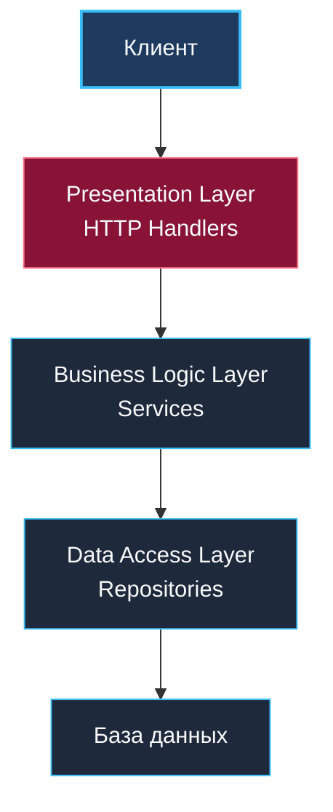

После погружения в строгие и многослойные каноны Clean Architecture и Hexagonal Architecture у инженера может возникнуть ложное ощущение, будто классическая «трёхслойка» — это архаичный пережиток прошлого, недостойный пера опытного бэкендера. 

Однако реальность такова: подавляющее большинство успешных мировых систем начинали свой жизненный путь именно с трёхслойной структуры. Более того, понимание её механических ограничений — это единственный способ осознанно, а не слепо по веянию моды, выбирать более сложные архитектурные стили.

Как любил замечать Брайан Керниган:
> *«Каждый может написать сложную программу. Искусство в том, чтобы написать простую систему, решающую задачу без лишних абстракций».*

В этой главе мы беспристрастно исследуем классическую трёхслойную архитектуру (**Layered Architecture**), её воплощение в идиоматическом Go, границы её применимости, неизбежные структурные ловушки и механику эволюционного перехода к инвертированным архитектурам.

---

### Структура трехслойной архитектуры

Классическая трёхслойная архитектура разделяет приложение по горизонтали на три изолированных функциональных эшелона, где каждый вышестоящий уровень вызывает нижележащий:

1. **Presentation Layer (Слой представления / доставки)**:  
   Отвечает за протоколы взаимодействия с внешним миром: веб-браузерами, мобильными клиентами или операционной системой. В Go-сервисах это HTTP-хэндлеры (`net/http`, Gin, Fiber), серверные обработчики gRPC или консольные команды CLI. Задача слоя — принять сетевой пакет, распарсить параметры, передать управление в бизнес-слой и упаковать результат в HTTP/gRPC ответ.
2. **Business Logic Layer (Слой бизнес-логики / сервисов)**:  
   Ядро прикладных вычислений и алгоритмов. Здесь осуществляются проверки прав, вычисление скидок, транзакционная валидация и бизнес-правила. В Go этот слой традиционно представлен пакетами `service` или `usecase`.
3. **Data Access Layer (Слой доступа к данным / репозиториев)**:  
   Отвечает за физическое взаимодействие с накопителями данных: реляционными базами данных (PostgreSQL, MySQL), распределёнными кэшами (Redis) или внешними интеграционными API. В коде на Go этот слой живёт в пакетах `repository`, `dao` или `storage`.



---

### Реализация в Go: типичная структура

В традиционных Go-проектах трёхслойная организация кода принимает интуитивную и компактную форму:

```
project/
├── cmd/
│   └── main.go
├── internal/
│   ├── handler/       # Presentation Layer: сетевой транспорт
│   │   ├── order.go
│   │   └── user.go
│   ├── service/       # Business Logic Layer: бизнес-логика
│   │   ├── order.go
│   │   └── user.go
│   ├── repository/    # Data Access Layer: SQL и хранение
│   │   ├── order_repo.go
│   │   └── user_repo.go
│   └── model/         # Общие структуры данных (Entities / DTO)
│       ├── order.go
│       └── user.go
└── go.mod
```

Посмотрим, как выглядит прохождение запроса сверху вниз через все три слоя.

#### 1. Слой обработчиков (Presentation)
Обработчик распаковывает тело входящего JSON-запроса и вызывает сервис:

```go
// internal/handler/order.go
package handler

import (
    "encoding/json"
    "net/http"
    "project/internal/service"
)

type CreateOrderRequest struct {
    UserID string              `json:"user_id"`
    Items  []service.ItemInput `json:"items"`
}

type OrderHandler struct {
    orderService *service.OrderService
}

func NewOrderHandler(svc *service.OrderService) *OrderHandler {
    return &OrderHandler{orderService: svc}
}

func (h *OrderHandler) Create(w http.ResponseWriter, r *http.Request) {
    var req CreateOrderRequest
    if err := json.NewDecoder(r.Body).Decode(&req); err != nil {
        http.Error(w, err.Error(), http.StatusBadRequest)
        return
    }
    
    order, err := h.orderService.CreateOrder(r.Context(), req.UserID, req.Items)
    if err != nil {
        http.Error(w, err.Error(), http.StatusInternalServerError)
        return
    }

    w.Header().Set("Content-Type", "application/json")
    _ = json.NewEncoder(w).Encode(order)
}
```

#### 2. Слой бизнес-логики (Service)
Сервис содержит цепочку прикладных вычислений и напрямую передаёт готовую сущность в репозиторий:

```go
// internal/service/order.go
package service

import (
    "context"
    "errors"
    "project/internal/model"
    "project/internal/repository"
)

type ItemInput struct {
    ProductID string
    Quantity  int
    Price     int64
}

type OrderService struct {
    orderRepo *repository.OrderRepository
}

func NewOrderService(repo *repository.OrderRepository) *OrderService {
    return &OrderService{orderRepo: repo}
}

func (s *OrderService) CreateOrder(ctx context.Context, userID string, items []ItemInput) (*model.Order, error) {
    order := &model.Order{
        ID:     generateID(),
        UserID: userID,
        Items:  convertItems(items),
        Status: model.StatusNew,
    }
    
    // Бизнес-логика: доменная проверка и калькуляция суммы
    if err := s.validateOrder(order); err != nil {
        return nil, err
    }
    order.TotalAmount = s.calculateTotal(order.Items)
    
    // Прямое сохранение через конкретный репозиторий
    if err := s.orderRepo.Save(ctx, order); err != nil {
        return nil, err
    }
    return order, nil
}

func (s *OrderService) validateOrder(order *model.Order) error {
    if len(order.Items) == 0 {
        return errors.New("order must contain at least one item")
    }
    return nil
}

func (s *OrderService) calculateTotal(items []model.OrderItem) int64 {
    var total int64
    for _, it := range items {
        total += it.Price * int64(it.Quantity)
    }
    return total
}

func generateID() string { return "ord-12345" }
func convertItems(inputs []ItemInput) []model.OrderItem {
    res := make([]model.OrderItem, len(inputs))
    for i, in := range inputs {
        res[i] = model.OrderItem{ProductID: in.ProductID, Quantity: in.Quantity, Price: in.Price}
    }
    return res
}
```

#### 3. Слой доступа к данным (Repository)
Репозиторий взаимодействует с драйвером реляционной базы данных:

```go
// internal/repository/order_repo.go
package repository

import (
    "context"
    "database/sql"
    "project/internal/model"
)

type OrderRepository struct {
    db *sql.DB
}

func NewOrderRepository(db *sql.DB) *OrderRepository {
    return &OrderRepository{db: db}
}

func (r *OrderRepository) Save(ctx context.Context, order *model.Order) error {
    _, err := r.db.ExecContext(ctx, 
        "INSERT INTO orders (id, user_id, total_amount, status) VALUES ($1, $2, $3, $4)",
        order.ID, order.UserID, order.TotalAmount, order.Status)
    return err
}
```

---

### Направление зависимостей: корень проблем

Внимательно взгляните на стрелки вызовов и импортов в исходном коде выше. Ключевая анатомическая черта классической трёхслойки — **жесткое нисходящее направление зависимостей**:

```
 handler ──(import)──> service ──(import)──> repository ──(import)──> database/sql
    │                     │                       │
    └─────────────────────┴───────────────────────┴──(import)──> model
```

На первых порах это кажется интуитивным и кристально ясным. Однако по мере роста проекта эта нисходящая лестница неизбежно превращается в капкан:

1. **Бизнес-логика намертво привязана к деталям хранения**:  
   Пакет `service` напрямую импортирует конкретный тип `*repository.OrderRepository`, а репозиторий привязан к `database/sql` и PostgreSQL. Попытка переключиться на документоориентированную базу (MongoDB), перейти на драйвер `pgx` с бинарным протоколом или написать легковесный in-memory фейк для тестов потребует глубокой хирургической операции на всём сервисном слое.
2. **Мучительное модульное тестирование**:  
   Поскольку `OrderService` держит прямой указатель `*repository.OrderRepository`, вы лишены возможности подставить мок в юнит-тесте без костылей. Вам приходится либо поднимать реальный контейнер PostgreSQL (превращая быстрые юнит-тесты в медленные интеграционные прогоны), либо менять типы полей на лету.
3. **Божественная модель данных (God Model)**:  
   Пакет `model.Order` становится общим котлом. В одну структуру сваливаются теги HTTP-сериализации (`json:"..."`), теги маппинга базы данных (`db:"..."`), валидационные аннотации и методы домена. В результате изменение схемы таблицы в базе данных может случайно сломать публичный JSON API сервиса.
4. **Хрупкость границ при масштабировании**:  
   При разрастании проекта разработчики начинают совершать «короткие замыкания»: например, вызывать репозиторий напрямую из хэндлера в обход сервиса («зачем писать сервис ради одного SELECT?»), что быстро превращает систему в неконтролируемый клубок спагетти.

> [!warning] Ловушка / Gotcha
> В языке Go трёхслойка с общим пакетом `model` часто приводит к фатальным циклическим импортам (import cycle not allowed). 
> Стоит бизнес-методу в `model` попытаться вызвать вспомогательную функцию из `service`, как компилятор немедленно обрушивает сборку: `service -> model -> service`. Это не баг компилятора — это строгое физическое предупреждение рантайма о том, что архитектурные зависимости в кодовой базе запутались.

---

### Когда трехслойка всё ещё хороша

Несмотря на архитектурные компромиссы, классическая трёхслойная архитектура — это не ошибка, а практичный инструмент. Для целого класса инженерных задач она остаётся лучшим выбором по соотношению затрат и пользы:

- **Простые CRUD-сервисы**: когда 90% операций сводятся к сохранению и чтению плоских записей из базы данных без сложных доменных инвариантов.
- **Прототипы и MVP (Minimum Viable Product)**: когда критически важно проверить гипотезу за две недели, а не полировать слои абстракций ради идеальной чистоты.
- **Внутренние утилиты и административные панели**: сервисы с ограниченной аудиторией и коротким горизонтом жизни.
- **Стартапы на ранней стадии**: когда требования бизнеса меняются трижды в неделю, избыточная изоляция портов и адаптеров лишь снижает скорость манёвра команды.

В этих сценариях трёхслойка выигрывает за счёт минимального количества файлов, отсутствия промежуточных DTO-мапперов и предельно низкого порога входа для любого джуниор-разработчика.

---

### Переход к более чистым архитектурам

Когда проект перерастает рамки простого CRUD, а симптомы жесткой связанности начинают тормозить релизные циклы, трёхслойка легко и органично рефакторится в гексагональную архитектуру ([[13. Hexagonal Architecture. Ports and Adapters]]).

Секрет этого превращения заключается в **инверсии зависимостей (Dependency Inversion)**. Мы не переписываем проект с нуля — мы лишь переносим границу контракта:

```go
// До рефакторинга: service зависит от конкретного типа репозитория
type OrderService struct {
    repo *repository.OrderRepository // Жесткая привязка к реализации!
}

// После рефакторинга: service определяет потребительский интерфейс (порт)
type OrderRepository interface {
    Save(ctx context.Context, order *Order) error
}

type OrderService struct {
    repo OrderRepository // Абстракция: service свободен от инфраструктуры!
}
```

В одно мгновение:
- Слой сервиса становится чистым **ядром**, владеющим интерфейсами.
- Слой репозитория превращается в **вторичный адаптер**, реализующий эти интерфейсы.
- Слой хэндлеров становится **первичным адаптером**.

---

### Mechanical Sympathy: трехслойка и производительность Go

С точки зрения кремния и рантайма Go классическая трёхслойка демонстрирует превосходную механическую эффективность:
- **Прямые вызовы функций**:  
  Поскольку сервис вызывает конкретный метод `(*OrderRepository).Save()`, здесь нет косвенной адресации через интерфейсную таблицу `itab`. Компилятор Go может применить агрессивный **inlining** (встраивание кода функции в место вызова), полностью устраняя накладные расходы на вызов стекового кадра.
- **Нулевые затраты на конвертацию данных**:  
  Поскольку одна и та же структура `model.Order` передаётся сквозь все три слоя по указателю, данные не копируются в памяти, что снижает нагрузку на CPU-кэш и аллокатор.
- **Обратная сторона медали**:  
  Единая структура в памяти провоцирует гонки данных (data races), если разные слои или параллельные горутины начинают одновременно модифицировать её поля.

---

### Сравнение с чистыми архитектурами

| Критерий | Трехслойная архитектура | Clean / Hexagonal Architecture |
|---|---|---|
| **Направление зависимостей** | Сверху вниз (Presentation → Service → Repository) | Снаружи внутрь (Адаптеры → Use Cases → Entities) |
| **Зависимость бизнес-логики от БД** | Прямая (импорт конкретного типа репозитория) | Инвертированная (через интерфейс в ядре) |
| **Тестирование бизнес-логики** | Требует поднятия БД или сложных ухищрений | Мгновенно тестируется с in-memory заглушками |
| **Замена хранилища** | Требует каскадного изменения пакета `service` | Требует лишь написания нового изолированного адаптера |
| **Порог входа в кодовую базу** | Минимальный (понятно любому начинающему инженеру) | Средний / высокий (требует глубокого понимания DIP и DDD) |
| **Объем шаблонного кода** | Минимальный (одна общая модель на всю систему) | Выше (интерфейсы, DTO, явные мапперы слоёв) |

---

> [!tip] Собеседование
> **Вопрос:** В вашем проекте используется трёхслойная архитектура. По каким конкретным инженерным симптомам вы определите, что кодовая база исчерпала свой ресурс и проект пора переводить на Clean Architecture?
> **Ожидаемый ответ:**
> 1. **Замедление CI/CD и тестов**: юнит-тесты бизнес-логики превратились в интеграционные и требуют поднятия тестовой БД (PostgreSQL), что увеличивает время прогона пайплайна с миллисекунд до десятков минут.
> 2. **Риск регрессии при смене инфраструктуры**: любая попытка добавить второй источник данных (Redis-кэш, Kafka, ClickHouse) заставляет переписывать бизнес-сервисы.
> 3. **Разрастание структуры моделей**: типы в `model` обросли десятками несовместимых тегов сериализации, а изменение одной колонки в БД случайно ломает публичный API.
> 4. **Конфликты слияния в Git**: из-за концентрации логики в единых пакетах инженеры параллельных задач постоянно конфликтуют в одних и тех же файлах репозиториев и моделей.
> 5. **Размывание ответственности (Leakage)**: бизнес-правила начинают бесконтрольно просачиваться в SQL-запросы или HTTP-хэндлеры.

---

### Итог

Классическая трёхслойная архитектура — это надёжная рабочая лошадка бэкенд-разработки. Она даёт превосходный старт для небольших сервисов и прототипов, сохраняя код простым и компактным. Однако зрелый архитектор всегда держит руку на пульсе: как только сложность домена начинает задыхаться в тисках прямых зависимостей, трёхслойку следует своевременно перевести на рельсы инверсии зависимостей.

Теперь, исследовав внутреннюю архитектуру классов и слоёв, мы должны сделать следующий фундаментальный шаг — разобраться, как принято физически организовывать файлы и каталоги в реальном Go-репозитории: [[16. Standard Go Project Layout и его ограничения]].
