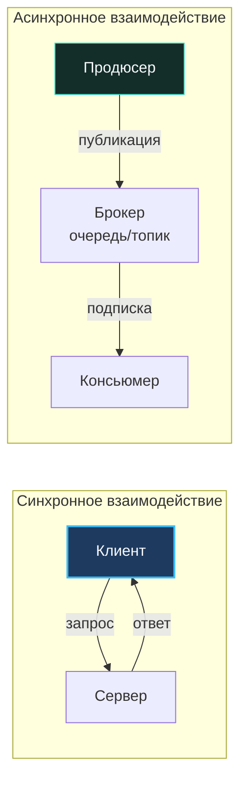

Когда программная система перерастает границы одного процесса операционной системы и распределяется по десяткам сетевых узлов, перед инженером встаёт ключевой вопрос системного проектирования: **как именно сервисы должны общаться между собой?**

В мире распределённых систем существует два фундаментальных стиля коммуникации: **синхронный (Request-Response)** и **асинхронный (Message-Driven / Event-Driven)**. 

Выбор между ними — это не просто выбор между HTTP и брокером сообщений Kafka. Это фундаментальный архитектурный компромисс, определяющий временную связанность (temporal coupling), каскадные задержки (latency tail), поведение системы при пиковых нагрузках, потребление памяти планировщиком Go и устойчивость к аппаратным отказам.

Как любил повторять Кен Томпсон:
> *«Нельзя спроектировать надежную распределенную систему, делая вид, что сеть надежна, а задержки равны нулю».*

В этой главе мы глубоко исследуем оба подхода сквозь призму рантайма Go и сетевого стека Linux. Мы разберём, что происходит с горутинами при блокирующем вводе-выводе, как пулы воркеров спасают планировщик от перегрузки, когда оправдан гибридный шаблон «синхронный фасад поверх асинхронного ядра» и как гарантировать чистый graceful shutdown.

---

### Определения

Для строгости инженерного анализа дадим точные определения двум парадигмам:

**1. Синхронное взаимодействие (Request-Response)**:  
Клиент инициирует сетевое соединение, отправляет пакет данных серверу и **блокирует дальнейшее исполнение своего контекста** в ожидании ответа.  
*Типичные протоколы:* HTTP/1.1, HTTP/2 (REST), gRPC/Protobuf, GraphQL.  
*В Go:* Клиент вызывает `client.Do(req)` и удерживает открытый TCP-сокет, дожидаясь заголовков и чтения `resp.Body`.

**2. Асинхронное взаимодействие (Message-Driven / Event-Driven)**:  
Отправитель (продюсер) публикует сообщение (событие или команду) в промежуточный буфер — брокер сообщений или распределённый лог событий — после чего немедленно продолжает свою работу, не дожидаясь ответа от конечного получателя. Получатель (консьюмер) вычитывает сообщение и обрабатывает его автономно в собственном темпе.  
*Типичные системы:* Apache Kafka, RabbitMQ, NATS, облачные очереди (AWS SQS, Google Cloud Pub/Sub).  
*В Go:* Долгоживущие горутины-консьюмеры вычитывают потоки сообщений через каналы или пулы воркеров.



---

### Синхронное взаимодействие: плюсы, минусы и контекст Go

#### Преимущества

- **Простота и линейность ментальной модели**:  
  Синхронный RPC-вызов воспринимается мозгом программиста как обычный вызов локальной функции. Вы передали аргументы, подождали результат и обработали ошибку. Код читается сверху вниз без разрыва контекста.
- **Мгновенная обратная связь (Immediate Feedback)**:  
  Клиент сразу узнаёт статус транзакции: принята ли оплата, создан ли пользователь, валиден ли пароль. Это позволяет немедленно вернуть пользователю результат в UI.
- **Локальная согласованность данных**:  
  В пределах одного синхронного шага проще гарантировать консистентность (Read-Your-Own-Writes) без необходимости ждать, пока событие обойдёт все реплики.
- **Богатейший стандартизированный инструментарий**:  
  В экосистеме Go пакеты `net/http` и `grpc-go` обладают первоклассной поддержкой middleware, контекстных таймаутов (`context.WithTimeout`), сквозной распределённой трассировки (OpenTelemetry) и метрик Prometheus.

#### Недостатки и вызовы

- **Временная связанность (Temporal Coupling)**:  
  Обе стороны обязаны быть живы, доступны и отвечать одновременно. Если Сервис Б упал или заблокирован сборщиком мусора, вызывающий Сервис А немедленно получает ошибку. Каскадные сбои в длинных синхронных цепочках — классическая смерть микросервисных архитектур.
- **Суммирование задержек и хвостовая латентность**:  
  Каждый сетевой прыжок добавляет сетевой RTT (Round Trip Time) и время обработки. Если запрос пользователя проходит через цепочку `A → B → C → D`, общая латентность равна сумме задержек всех четырёх звеньев! Один медленный узел разрушает общесистемный SLO ([[5. Latency, Throughput, Availability и Trade-offs]]).
- **Деградация при пиковых нагрузках**:  
  При внезапном всплеске трафика медленный бэкенд начинает удерживать открытые TCP-соединения. У клиентов накапливаются горутины, исчерпываются файловые дескрипторы Linux (`ulimit -n`) и раздуваются пулы сетевых соединений.
- **Иллюзия надёжности**:  
  Если клиент отправил HTTP POST запрос на списание денег, но из-за сбоя сети не получил ответ (таймаут), деньги могли списаться! Повторная отправка запроса без строгой идемпотентности приведёт к двойному списанию ([[27. Idempotency и exactly once семантика]]).

> [!info] Под капотом
> Как синхронный I/O отрабатывает внутри рантайма Go?
> Когда горутина вызывает чтение из сокета (`client.Do(req)`), системный вызов `read` возвращает ошибку `EAGAIN` (сокет в неблокирующем режиме). Рантайм Go регистрирует файловый дескриптор в системном селекторе `epoll` / `kqueue` через механизм **netpoller** и переводит горутину в состояние ожидания `_Gwaiting`.
> Поток операционной системы (M) не блокируется — планировщик Go немедленно открепляет его (hand-off) и переключает на выполнение других готовых горутин. Это невероятно эффективно, но закон сохранения ресурсов неумолим: каждая заблокированная горутина удерживает свой стек (минимум 2 КБ) и внутренние структуры рантайма. Если 50 000 горутин повиснут в ожидании зависшего внешнего сервиса, процесс Go мгновенно съест сотни мегабайт памяти, а планировщик начнет тратить полезные такты CPU на постоянный опрос netpoller.

---

### Асинхронное взаимодействие: плюсы, минусы и Go-специфика

#### Преимущества

- **Слабая временная связанность (Temporal Decoupling)**:  
  Продюсеру абсолютно безразлично, запущен ли сервис-получатель прямо сейчас. Сообщение надёжно оседает на диске в брокере сообщений. Консьюмер может быть перезапущен, обновлен или лежать на плановом техобслуживании — когда он поднимется, он вычитает все накопившиеся события. Система деградирует мягко, не падая целиком.
- **Естественное сглаживание пиков (Load Leveling / Shock Absorber)**:  
  В периоды экстремального наплыва пользователей (Чёрная пятница, распродажи) веб-серверы могут публиковать 100 000 событий в секунду в Kafka. Брокер выступает гигантским амортизирующим резервуаром. Консьюмеры продолжают вычитывать данные с комфортной для базы данных скоростью (например, 10 000 сообщений в секунду), не рискуя уронить базу в OOM.
- **Колоссальная пропускная способность (Throughput)**:  
  Асинхронная запись в буфер брокера выполняется за доли миллисекунды. Более того, сообщения можно пачковать (batching), сжимая их алгоритмами LZ4 или ZSTD и отправляя тысячи записей в одном сетевом системном вызове `sendfile`.
- **Изоляция и автономия команд**:  
  Команда сервиса заказов публикует событие `OrderCreatedEvent` по строгой схеме (Protobuf, Avro). Команды аналитики, уведомлений и склада подписываются на топик самостоятельно, не отвлекая команду заказов просьбами сделать новый API-эндпоинт.

#### Недостатки и вызовы

- **Сложность ментальной модели и отладки**:  
  Линейный ход мыслей «сделал вызов — получил ответ» разрушается. Запрос превращается в цепочку блуждающих событий. Чтобы понять, почему клиенту не начислились бонусы, инженеру приходится расследовать логи через топики, очереди и Dead Letter Queue (DLQ) с помощью распределённых трейсов OpenTelemetry.
- **Конечная согласованность (Eventual Consistency)**:  
  Данные становятся консистентными не мгновенно, а спустя десятки или сотни миллисекунд. Пользователь может создать заказ, обновить страницу и... не увидеть его, потому что консьюмер реплики чтения ещё не успел применить событие.
- **Инфраструктурный налог**:  
  В архитектуре появляется сложнейший кластер (Apache Kafka, RabbitMQ, NATS Cluster), требующий глубоких знаний по настройке репликации, кворума, ZooKeeper/KRaft, партиционирования и мониторинга дискового I/O.
- **Гарантии доставки и дубликаты**:  
  В распределённых сетях неизбежны сбои подтверждений (ACK). Брокеры работают с семантиками *at-most-once*, *at-least-once* или сложной *exactly-once*. В реальном продакшене консьюмеры на Go обязаны быть готовы к приёму дубликатов сообщений и реализовывать строгую идемпотентность.

---

### Mechanical Sympathy: влияние на планировщик Go и системные ресурсы

В Go-мире асинхронные консьюмеры часто пишут наивно, запуская горутину на каждое входящее сообщение:

```go
// Антипаттерн для highload: неконтролируемое порождение горутин
func startConsumer(ctx context.Context, handler func(msg *kafka.Message)) {
    for {
        select {
        case <-ctx.Done():
            return
        default:
            msg, err := consumer.ReadMessage(ctx)
            if err != nil {
                log.Error("read error", err)
                continue
            }
            // ОПАСНО: при внезапном лаге консьюмера и притоке сообщений
            // этот цикл породит миллионы горутин за секунды, что вызовет OOM-киллер!
            go handler(msg)
        }
    }
}
```

В высоконагруженных сервисах с библиотеками `sarama` (Shopify) или `confluent-kafka-go` опытный Go-инженер всегда применяет паттерн **Worker Pool** с фиксированным числом горутин. Это гарантирует предсказуемое потребление памяти и защищает рантайм:

```go
type Message struct {
    Topic     string
    Partition int32
    Offset    int64
    Key       []byte
    Value     []byte
}

// workerPool создает фиксированное число воркеров, читающих из одного канала
func workerPool(msgs <-chan *Message, concurrency int, handler func(*Message)) {
    for i := 0; i < concurrency; i++ {
        go func() {
            for msg := range msgs {
                handler(msg)
            }
        }()
    }
}
```

Благодаря этому планировщик Go работает в щадящем режиме: фиксированное количество горутин постоянно находится в горячем L1/L2 кэше ядер процессора, а буферизированный канал Go сглаживает микроскачки нагрузки.

---

### Сравнительный анализ

| Критерий | Синхронное (HTTP / gRPC) | Асинхронное (Kafka / RabbitMQ / NATS) |
|---|---|---|
| **Связанность** | Жесткая временная: отправитель ждёт ответа здесь и сейчас | Слабая: отправитель публикует и забывает |
| **Задержка (Latency)** | Минимальная (единицы миллисекунд) для изолированного вызова | Выше: проход через диск брокера, очередь и консьюмер |
| **Пропускная способность** | Ограничена пулами TCP-соединений и памятью серверов | Экстремальная: батчинг на диске, миллионы RPS |
| **Доступность** | Требует одновременной доступности обоих участников | Допускает полную временную недоступность консьюмера |
| **Обработка ошибок** | Явная и немедленная (HTTP 4xx/5xx, gRPC status codes) | Асинхронная: повторы (Retries), Dead Letter Queue (DLQ) |
| **Go-реализация** | Нативная `net/http`, `grpc-go` (прозрачно для кода) | Клиенты брокеров (`sarama`, NATS), пулы воркеров |
| **Надёжность доставки** | Нет встроенной персистентности; нужен ручной retry | Гарантированная персистентность (запись в commit log) |

---

### Когда что выбирать

**Синхронное взаимодействие предпочтительно:**
- Запросы на чтение данных, результат которых критически необходим пользователю прямо сейчас (получение профиля, баланса, результатов поиска).
- Короткие цепочки межсервисных вызовов с жесткими дедлайнами по latency.
- Интеграции с внешними сторонними API, требующими прямого подтверждения (например, 3-D Secure верификация карты в банке).
- Взаимодействие микросервисов внутри единого Bounded Context, где задержки сети внутри одной стойки дата-центра составляют микросекунды.

**Асинхронное взаимодействие предпочтительно:**
- Длительные или ресурсоёмкие операции: генерация тяжелых PDF-отчетов, экспорт данных, перекодирование видеофайлов, отправка email и SMS.
- Системы с ярко выраженными всплесками трафика для сглаживания нагрузки (Load Leveling).
- Потоковая телеметрия, логирование, сбор кликстрима, метрики IoT.
- Гарантированная доставка бизнес-событий в распределённых архитектурах: **Event-Driven Architecture** ([[21. Event Driven Architecture]]), **CQRS** ([[23. CQRS. Разделение чтения и записи]]) и распределённые саги **Saga** ([[26. Saga Pattern. Оркестрация и хореография]]).

---

### Гибридные подходы: синхронное API поверх асинхронного ядра

В современных архитектурах эти стили редко существуют изолированно. Классический промышленный паттерн — **синхронный фасад поверх асинхронного ядра**:

```
 [Мобильное приложение] ──(HTTP POST /orders)──> [API Gateway / Handler]
                                                        │
                      ┌─────────────────────────────────┘
                      ▼
         [Публикация OrderCreatedEvent в Kafka]
                      │
                      ▼
          [HTTP 202 Accepted] (Location: /orders/123-abc)
```

Клиент отправляет команду на создание ресурса. Сервис проводит первичную быструю валидацию, генерирует идентификатор, публикует событие в брокер и **немедленно возвращает HTTP-ответ `202 Accepted`** со ссылкой в заголовке `Location`:

```go
package http

import (
    "encoding/json"
    "net/http"

    "github.com/google/uuid"
)

type CreateOrderRequest struct {
    UserID string `json:"user_id"`
    Amount int64  `json:"amount"`
}

type OrderCreatedEvent struct {
    ID     string `json:"id"`
    UserID string `json:"user_id"`
    Amount int64  `json:"amount"`
}

type EventBus interface {
    Publish(ctx context.Context, event any) error
}

type OrderHandler struct {
    eventBus EventBus
}

func (h *OrderHandler) Create(w http.ResponseWriter, r *http.Request) {
    var req CreateOrderRequest
    if err := json.NewDecoder(r.Body).Decode(&req); err != nil {
        http.Error(w, err.Error(), http.StatusBadRequest)
        return
    }

    orderID := uuid.New().String()
    event := OrderCreatedEvent{
        ID:     orderID,
        UserID: req.UserID,
        Amount: req.Amount,
    }

    // Публикуем событие в брокер и немедленно освобождаем клиента
    if err := h.eventBus.Publish(r.Context(), event); err != nil {
        http.Error(w, "failed to publish event", http.StatusInternalServerError)
        return
    }

    w.Header().Set("Location", "/orders/"+orderID)
    w.WriteHeader(http.StatusAccepted)
    _ = json.NewEncoder(w).Encode(map[string]string{
        "id":     orderID,
        "status": "pending",
    })
}
```

Клиент получает ответ за 5 миллисекунд, после чего либо опрашивает статус заказа через polling эндпоинта `/orders/{id}`, либо слушает уведомление о завершении через WebSocket или Server-Sent Events (SSE).

> [!warning] Ловушка / Gotcha
> При остановке сервиса (сигнал ядра `SIGTERM`) многие забывают корректно завершить работу брокера. 
> Для HTTP-сервера вызывают стандартный метод `Shutdown()` (например, `srv.Shutdown(ctx)`). Но если соединение с брокером сообщений просто оборвать или завершить процесс через `os.Exit(0)`, сообщения, находящиеся в локальном буфере памяти Go-драйвера, будут безвозвратно потеряны! 
> Всегда регистрируйте graceful shutdown: закрывайте продюсеры через метод `Close()` и дожидайтесь от консьюмеров фиксации смещений (commit offset) перед выходом.

---

### Влияние на тестирование

- **Синхронные сервисы** тестируются предельно комфортно: встроенный пакет `net/http/httptest` предоставляет инструмент `httptest.Server`, позволяющий поднимать легковесный локальный веб-сервер прямо в адресном пространстве тестового процесса.
- **Асинхронные обработчики** требуют поднятия локального брокера (через `testcontainers-go` с реальным образом Kafka/RabbitMQ) либо использования in-memory очередей. 
  Поскольку асинхронный процесс завершается спустя неопределённое время, тесты не могут синхронно проверить базу. Для этого в Go используют ассерты с периодическим ожиданием — например, функцию `assert.Eventually` из библиотеки `testify`.

---

> [!tip] Собеседование
> **Вопрос:** В проектируемой системе есть Сервис заказов (Order Service) и Сервис email-уведомлений (Notification Service). Как вы организуете их общение — синхронно по HTTP/gRPC или асинхронно через брокер сообщений? Аргументируйте решение с позиций Go-разработчика.
> **Ответ:** 
> Я выберу **асинхронное взаимодействие через брокер сообщений** (например, Apache Kafka или RabbitMQ).
> 1. **Временная развязка**: Отправка email во внешний SMTP-сервер занимает от 500 мс до нескольких секунд. Заставлять клиента ждать завершения отправки письма в синхронном HTTP-запросе недопустимо.
> 2. **Устойчивость к отказам**: Если SMTP-шлюз или сервис уведомлений временно недоступен, заказ всё равно будет успешно создан, а событие сохранится в брокере. Когда уведомления оживут, они вычитают события без потерь. В синхронном варианте пришлось бы городить сложную систему повторов с риском потерять заказ.
> 3. **Сглаживание пиков (Load Leveling)**: Во время массовых распродаж брокер примет лавину событий, а сервис уведомлений будет обрабатывать их стабильным потоком, не перегружая почтовые шлюзы.
> 4. **Механика Go**: В сервисе уведомлений мы запустим пул горутин (`workerPool`) фиксированного размера, который будет эффективно утилизировать ядра процессора без всплесков аллокаций.

---

### Итог

Синхронность и асинхронность — это фундаментальный дуализм распределённых систем:
- **Синхронность** дарит кристальную простоту кода и немедленный результат, расплачиваясь хрупкостью временной связанности и риском каскадных лавин.
- **Асинхронность** обеспечивает монументальную отказоустойчивость и неограниченную пропускную способность, требуя взамен готовности к конечной согласованности (Eventual Consistency) и сложной инфраструктуре.

В следующей главе мы спустимся на уровень конкретных транспортных технологий и проведем бескомпромиссную дуэль сетевых протоколов: [[20. RPC vs REST vs Messaging]].
