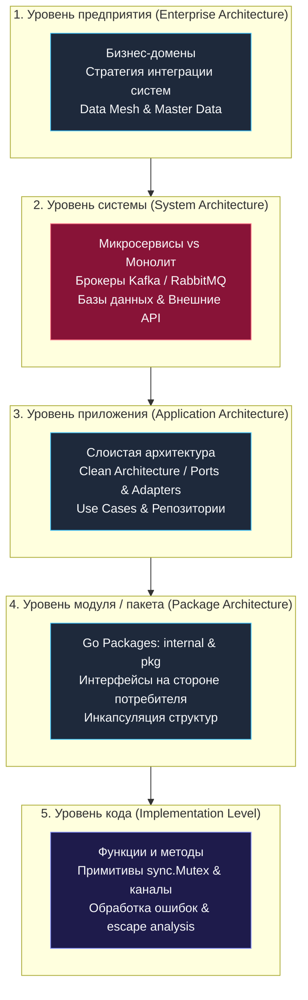
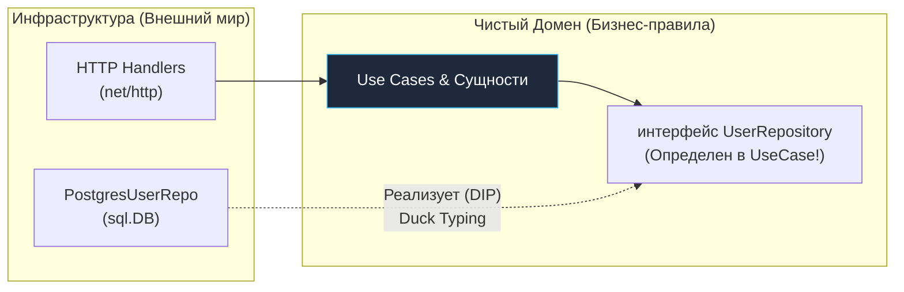
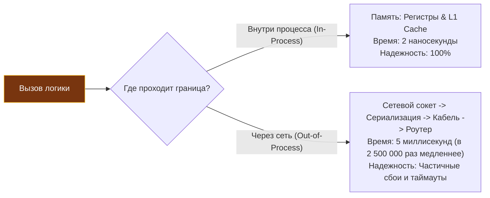

# Что такое архитектура: Уровни абстракции и границы системы

> *«Управление сложностью — вот суть программирования. Чтобы обуздать сложность в масштабе системы, необходимо проводить четкие границы и строго соблюдать явные контракты между модулями».*    
> — Брайан Керниган

Когда начинающий разработчик слышит слово «архитектура», его воображение часто рисует красочные презентационные схемы в Miro: аккуратные прямоугольники микросервисов, ветвящиеся стрелочки брокера RabbitMQ и парящее облако Kubernetes.

Все это — важные элементы промышленной инфраструктуры. Но настоящая программная архитектура начинается задолго до того, как контейнеры отправятся в кластер. Она рождается в тот момент, когда вы решаете, как разделить систему на независимые пакеты, какие интерфейсы сделать публичными контрактами, а какие детали реализации скрыть от внешнего мира, и как организовать внедрение зависимостей, чтобы код не превратился в монолитный клубок спагетти.

Цель этой главы — дать четкое инженерное определение архитектуры, разобрать ее пятиуровневую структуру и показать, почему проведение незыблемых границ и контрактов является фундаментальным условием выживания любой масштабируемой системы на Go.

---

### Определение архитектуры

В классическом труде Ленни Басса, Пола Клементса и Рика Казмана *«Software Architecture in Practice»* дается строгое академическое определение:

> **Архитектура программной системы** — это совокупность структур, необходимых для рассуждений о системе. Эти структуры включают программные элементы, отношения между ними и свойства обоих.

Если перевести эту академическую формулировку на язык практикующего бэкенд-инженера, архитектура отвечает на четыре ключевых вопроса:
1. Из каких **компонентов** (пакетов, библиотек, сервисов) состоит система?
2. Как эти компоненты **взаимодействуют** друг с другом и с внешним миром (протоколы, контракты, сериализация)?
3. Какие **принципы и ограничения** управляют их проектированием и эволюцией во времени?
4. Какие **нефункциональные характеристики** (задержка, пропускная способность, отказоустойчивость, безопасность) система способна гарантировать под нагрузкой?

> [!info] Под капотом: Архитектура как управляемое знание
> Архитектура — это не застывший чертеж и не гранитная статуя. Это живое, эволюционирующее знание.  
> В хорошо спроектированной системе любые изменения локализованы и предсказуемы: доработка одного домена не требует переделки соседних модулей. В плохой системе даже тривиальное изменение поля структуры в базе данных вызывает каскадный обвал компиляции по всему репозиторию — ту самую кодовую базу, к которой страшно прикоснуться в пятницу вечером.

---

### Уровни абстракции в архитектуре

Архитектура не монолитна: она проявляется на разных масштабах масштабирования. Зрелый инженер обязан уметь мгновенно переключать оптику — от транзисторов и инструкций процессора до глобальных межсервисных топологий.



1. **Уровень предприятия (Enterprise Architecture)** — масштаб взаимодействия различных платформ, департаментов и команд. Здесь принимаются фундаментальные стандарты: выбор единых протоколов авторизации (SSO/OAuth2), форматы метаданных, сквозная безопасность и парадигма Data Mesh.
2. **Уровень системы (System Architecture)** — фокус System Design интервью. Топология отдельных сервисов, баз данных, брокеров очередей и топологии сетевых связей. Например: выбор между синхронным REST/gRPC или асинхронным Event-Driven обменом через Kafka ([[19. Синхронное vs асинхронное взаимодействие сервисов]], [[20. RPC vs REST vs Messaging]]).
3. **Уровень приложения (Application Architecture)** — внутренняя анатомия конкретного исполняемого сервиса. Здесь властвуют Clean Architecture ([[14. Clean Architecture и Dependency Rule]]), Hexagonal Architecture ([[13. Hexagonal Architecture. Ports and Adapters]]) и классическая слоистая трехзвенка ([[15. Layered Architecture. Классическая трехслойка]]). На этом уровне Go-инженер распределяет код по директориям `cmd`, `internal` и `pkg` ([[16. Standard Go Project Layout и его ограничения]]).
4. **Уровень модуля / пакета** — дизайн конкретного пакета Go. В языке Go этот уровень критически важен из-за компиляторных правил и неявного удовлетворения интерфейсов (Structural Subtyping). Здесь закладываются границы инкапсуляции и публичный экспортируемый API пакета.
5. **Уровень кода** — микроуровень: реализация отдельной функции, выбор конкурентного примитива (`sync.Mutex` или небуферизованный канал), обработка ошибок и избежание утечек горутин.

> [!tip] Собеседование: Уровни абстракции в диалоге
> **Вопрос:** Опишите, на каких уровнях абстракции вы принимали архитектурные решения в последнем проекте.  
> **Ожидаемый ответ:** Кандидат уровня Senior+ демонстрирует свободное владение всей пирамидой абстракций: от выбора протокола взаимодействия между сервисами (уровень системы) до внутренней структуры модулей с инверсией зависимостей через интерфейсы (уровень приложения) и оптимизации аллокаций в горячих циклах (уровень кода).

---

### Границы системы

Главная задача архитектора — **проводить границы**. Архитектор непрерывно очерчивает невидимые демаркационные линии, разделяя сущности:
- Что находится внутри ответственности сервиса, а что делегируется внешним системам?
- Какие типы данных принадлежат чистому бизнес-домену, а какие являются деталями инфраструктурных драйверов?
- Какие изменения изолированы внутри одного пакета `internal`, а какие ломают внешний контракт?



Границы материализуются через строгие **контракты**:
- **HTTP / REST эндпоинт** (URL, JSON Schema, RFC 7807) — граница между клиентом и сервером.
- **Protobuf-спецификация** — строгая бинарная граница между gRPC-микросервисами.
- **Интерфейс Go** — граница между логикой предметной области и деталями хранилища.
- **Топик Kafka** со схемой событий — граница между генератором событий (Producer) и подписчиком (Consumer).

#### Почему границы важны в Go?

Язык Go намеренно спроектирован с минималистичным набором выразительных средств, но они идеально заточены под проведение чистых границ:

1. **Неявные интерфейсы (Duck Typing).**  
   В отличие от C# (`: IInterface`) или Java (`implements`), компилятор Go проверяет соответствие типов неявно. Это позволяет объявлять интерфейс **в пакете-потребителе**, а не в пакете-реализации. В этом кроется секрет принципа инверсии зависимостей (**Dependency Inversion Principle, DIP**):

```go
// Пакет usecase (бизнес-логика) объявляет, ЧТО ему требуется
package usecase

import "context"

type User struct {
	ID   string
	Name string
}

// Интерфейс объявляется там, где он используется!
type UserRepository interface {
	FindByID(ctx context.Context, id string) (*User, error)
	Save(ctx context.Context, user *User) error
}

type UserUseCase struct {
	repo UserRepository
}

func NewUserUseCase(repo UserRepository) *UserUseCase {
	return &UserUseCase{repo: repo}
}
```

```go
// Пакет postgres (инфраструктура) реализует КАК это устроено
package postgres

import (
	"context"
	"database/sql"
	"myapp/internal/usecase"
)

type UserRepo struct {
	db *sql.DB
}

func NewUserRepo(db *sql.DB) *UserRepo {
	return &UserRepo{db: db}
}

// Метод совпадает по сигнатуре, явного упоминания usecase.UserRepository нет!
func (r *UserRepo) FindByID(ctx context.Context, id string) (*usecase.User, error) {
	// SQL реализация выборки из PostgreSQL
	return &usecase.User{}, nil
}

func (r *UserRepo) Save(ctx context.Context, user *usecase.User) error {
	// SQL реализация сохранения
	return nil
}
```

2. **Защита через `internal`.**  
   Каталог с именем `internal` на уровне компилятора Go запрещает импорт содержащихся в нем пакетов любым внешним модулям. Это железобетонный барьер против несанкционированного связывания кода.

3. **Сквозной контекст `context.Context`.**  
   Проброс `ctx` через все слои — это стандартный способ очертить границы дедлайнов, таймаутов и трассировки между асинхронными компонентами.

---

### Mechanical Sympathy на уровне архитектуры

При проведении границ между компонентами инженер обязан помнить о физических ограничениях аппаратуры:

- **Сетевой вызов vs вызов функции:**  
  Локальный вызов функции внутри одного процесса на процессоре занимает **~1–3 наносекунды** (при попадании в кэш инструкций L1i). Сетевой RPC-вызов даже внутри одного дата-центра требует от **0.5 до 5 миллисекунд** (в сотни тысяч раз дольше!). Сетевой прыжок включает переключение в ядро Linux, сериализацию, рукопожатие TCP, прохождение коммутаторов и десериализацию.
- **Аллокации и сериализация:**  
  Превращение структур Go в JSON или Protobuf нагружает CPU, выделяет буферы в куче (Heap) и создает давление на Garbage Collector.
- **Накладные расходы горутин:**  
  Горутины дешевы, но не бесплатны. Каждая зависшая в ожидании сетевого ответа горутина удерживает как минимум 2 КБ стека и заставляет планировщик тратить ресурсы на учет ее состояния.



> [!warning] Ловушка / Gotcha: Микросервисная «лапша» (Nano-services)
> Разработчики, переходящие с монолитов, нередко впадают в крайность: начинают дробить единую доменную область на десятки крошечных микросервисов. Каждый сервис выполняет элементарную операцию и шлет сетевой запрос соседу.  
> 
> В монолите цепочка из 5 вызовов выполнялась за 5 микросекунд через вызовы функций в стеке.  
> В микросервисной «лапше» та же операция превращается в 5 последовательных HTTP-запросов с сериализацией JSON, прохождением сетевого стека ядра Linux и задержками планировщика, увеличивая Latency до 150 миллисекунд (рост задержки в десятки тысяч раз!). При этом надежность падает по закону умножения вероятностей.

---

### Границы и эволюция системы

Качественно очерченные границы обеспечивают безболезненную эволюцию архитектуры во времени:

- **Свободная замена хранилищ:**  
  Если база данных укрыта за интерфейсом `UserRepository`, мы можем безболезненно заменить PostgreSQL на MongoDB, Redis или in-memory заглушку для unit-тестов, не изменив ни единой строчки бизнес-логики.
- **Версионирование контрактов:**  
  Четкая граница в виде версионированного API (`/v1/users`, `/v2/users`) позволяет плавно мигрировать клиентов без простоев ([[46. Версионирование сервисов и API]]).
- **Безболезненный распил монолита:**  
  Если монолит изначально строился как модульный с четкими интерфейсными границами, выделение перегруженного модуля в независимый микросервис сводится к замене вызова локальной функции на сетевой клиент, реализующий тот же самый интерфейс.

---

### Итог

Архитектура — это не дань переменчивой моде на новые инструменты, а строгая дисциплина управления системной сложностью. Она опирается на проведение незыблемых границ и формулирование контрактов на всех пяти уровнях абстракции. Язык Go с его неявными интерфейсами, защищенными пакетами `internal` и минимализмом предоставляет безупречные инструменты для воплощения этих принципов в жизнь.

В следующей лекции мы перейдем от философии границ к практической отправной точке любого системного проектирования: [[3. Функциональные и нефункциональные требования]]. Именно они определяют, где именно должны пройти границы и какие инженерные компромиссы будут оправданы.
