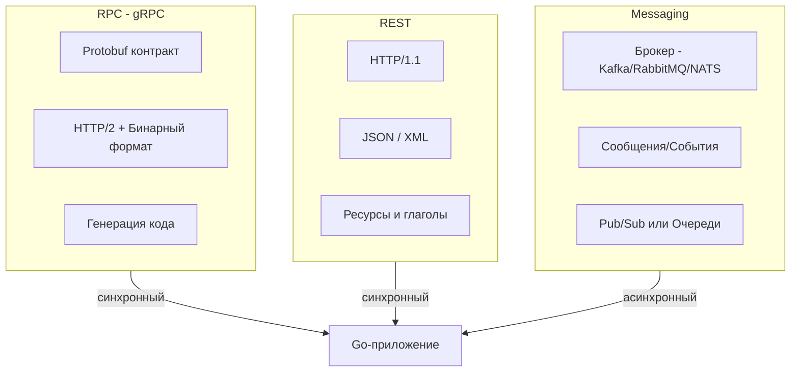

В предыдущей главе мы провели границу между синхронным и асинхронным стилями межсервисного общения. Теперь пришло время спуститься из мира теоретических абстракций на уровень конкретных транспортных технологий и форматов сериализации.

В современном бэкенде на языке Go сложились три фундаментальных технологических столпа взаимодействия:
1. **RPC (Remote Procedure Call)** — во главе с высокоскоростным бинарным стандартом **gRPC**;
2. **REST (Representational State Transfer)** — на базе классического текстового **HTTP/JSON**;
3. **Messaging** — асинхронный обмен через специализированные брокеры сообщений (**Kafka, RabbitMQ, NATS**).

Каждый из этих инструментов спроектирован под специфический вычислительный профиль. Попытка использовать неподходящий транспорт способна свести на нет все усилия архитектора: например, заставить сборщик мусора Go задыхаться от парсинга гигабайтных JSON-деревьев на горячих путях или утопить команду в операционной поддержке брокера там, где хватило бы простого HTTP-запроса.

В этой главе мы сопоставим эти технологии по ключевым инженерным критериям: пропускной способности, латентности, контрактной дисциплине, нагрузке на рантайм Go и удобству тестирования.

---

### Три кита коммуникации



- **RPC (Remote Procedure Call)**: Создаёт элегантную иллюзию того, что вызов функции на удалённом физическом сервере — это обычный локальный вызов в оперативной памяти. В Go-индустрии абсолютным стандартом стал **gRPC** от Google, сочетающий бинарную сериализацию **Protocol Buffers (Protobuf)** и мультиплексированный транспорт **HTTP/2**.
- **REST (Representational State Transfer)**: Архитектурный стиль, оперирующий ресурсами, уникальными URI и стандартными семантическими глаголами протокола HTTP (GET, POST, PUT, DELETE, PATCH). Данные традиционно передаются в текстовом формате JSON.
- **Messaging**: Архитектура слабосвязанного обмена сообщениями через централизованный или распределённый буфер-посредник (брокер). Продюсер и консьюмер не знают о существовании друг друга.

---

### RPC на примере gRPC

Фреймворк **gRPC** проектировался с единственной целью: выжать максимальную производительность из межсервисного сетевого взаимодействия в крупных дата-центрах.

Архитектура gRPC строится вокруг строгой схемы контракта, описываемой в `.proto`-файлах. Официальный компилятор `protoc` генерирует типобезопасные клиентские и серверные структуры и интерфейсы для Go.

#### Преимущества gRPC в Go

- **Железобетонная строгость контракта**:  
  Схема Protobuf исключает недопонимание между командами разработчиков. Типы полей, их обязательность и структуры валидируются на этапе компиляции кода.
- **Превосходная вычислительная эффективность**:  
  Бинарный кодек Protobuf (Varint-кодирование, отсутствие текстовых ключей) делает полезную нагрузку в 3–10 раз компактнее JSON. Транспорт HTTP/2 мультиплексирует сотни одновременных логических запросов внутри **одного постоянного TCP-соединения**, полностью устраняя накладные расходы на постоянный three-way handshake TCP и TLS-сессии.
- **Нативная поддержка потоковой передачи (Streaming)**:  
  В отличие от традиционного REST, в `grpc-go` из коробки доступны 4 режима:
  1. *Unary* (один запрос — один ответ);
  2. *Server Streaming* (сервер шлёт поток событий клиенту);
  3. *Client Streaming* (клиент заливает пачку данных);
  4. *Bidirectional Streaming* (двунаправленный real-time диалог).
- **Зрелая экосистема интерцепторов**:  
  Официальный пакет `google.golang.org/grpc` предоставляет мощный механизм перехватчиков (interceptors), позволяющий в одну строчку внедрить mTLS, авторизацию, OpenTelemetry трассировку и метрики.

```go
// Пример реализации gRPC сервера на Go
package server

import (
    "context"
    pb "myapp/pkg/api/order/v1"
)

type OrderServer struct {
    pb.UnimplementedOrderServiceServer
}

func (s *OrderServer) CreateOrder(ctx context.Context, req *pb.CreateOrderRequest) (*pb.Order, error) {
    // Входные данные req уже строго типизированы и валидированы!
    return &pb.Order{
        Id: "ord-123",
    }, nil
}
```

#### Недостатки и ограничения

- **Трудность ручной отладки**:  
  Сетевой трафик представляет собой непрозрачный бинарный поток байтов. Вы не можете просто выполнить `curl` в консоли — требуются специальные утилиты (`grpcurl`, `grpcui`) или импорт `.proto` схем в Postman.
- **Жёсткая дисциплина версионирования**:  
  Любое изменение схемы требует аккуратности (нельзя менять порядковые номера тегов полей).
- **Недоступность для веб-браузеров**:  
  Браузерные JavaScript API не дают прямого доступа к фреймам HTTP/2 на уровне сокетов, поэтому браузер не может напрямую вызывать gRPC-эндпоинты без посредников вроде gRPC-Web или прокси-трансляторов.

---

### REST (HTTP/JSON)

REST на базе JSON остаётся безоговорочным королём публичных API, фронтенд-интеграций и мобильных клиентов. Язык Go предоставляет для него феноменальную стандартную библиотеку `net/http`.

#### Преимущества REST в Go

- **Абсолютная человекочитаемость**:  
  Сырой JSON-пакет прозрачен. Его легко инспектировать в браузере, дампить в терминале через `curl` и модифицировать на лету.
- **Универсальная кроссплатформенность**:  
  Любой клиент на любом языке программирования (от микроконтроллеров ESP32 до браузеров) умеет выполнять базовые HTTP-запросы без генерации сторонних библиотек.
- **Гибкость версионирования**:  
  Добавление новых полей в JSON не ломает старых клиентов, которые просто проигнорируют неизвестные ключи. Версионирование через URL (`/v1/orders`) или заголовки поддерживается повсеместно.
- **Богатейшая экосистема middleware**:  
  В распоряжении Go-инженера имеются проверенные быстрые роутеры (`chi`, `echo`, `gorilla/mux`) и экосистема генерации спецификаций OpenAPI/Swagger.

#### Недостатки и грабли

- **Раздутый объём данных (Overhead)**:  
  В каждом пакете повторяются строковые имена ключей, кавычки и фигурные скобки. На высоких нагрузках это превращается в терабайты паразитного сетевого трафика.
- **Ограничения HTTP/1.1**:  
  Если сервис работает по HTTP/1.1, браузер вынужден открывать до 6 параллельных TCP-соединений к одному домену, сталкиваясь с блокировкой начала очереди (**Head-of-Line Blocking** на уровне сокетов).
- **Отсутствие компиляторного контракта**:  
  Соответствие схемы проверяется только на уровне документации (OpenAPI). Опечатка в названии поля в DTO не вызовет ошибки компилятора и проявится только в рантайме. Требуется внедрение контрактного тестирования ([[48. Тестирование архитектуры. Contract и Integration testing]]).
- **Тяжеловесная сериализация**:  
  Стандартный пакет `encoding/json` использует рефлексию времени выполнения, порождая сотни аллокаций в куче на каждый запрос. В highload-сервисах инженеры вынуждены переходить на сторонние быстрые кодеки: `goccy/go-json`, `easyjson` (кодогенерация) или `sonic` (JIT-ассемблер от ByteDance).

```go
// Типичный REST-хендлер на Go
func (h *OrderHandler) Create(w http.ResponseWriter, r *http.Request) {
    var req CreateOrderRequest
    if err := json.NewDecoder(r.Body).Decode(&req); err != nil {
        http.Error(w, err.Error(), http.StatusBadRequest)
        return
    }

    order := h.service.Process(req)

    w.Header().Set("Content-Type", "application/json")
    _ = json.NewEncoder(w).Encode(order)
}
```

---

### Messaging (Брокеры сообщений)

**Messaging** кардинально меняет правила игры. Это не вызов процедуры, а публикация автономного факта или команды в распределённую шину данных.

#### Преимущества Messaging в Go

- **Абсолютная временная и пространственная изоляция**:  
  Сервис заказов не знает, сколько консьюмеров слушают его топик. Это идеальная почва для архитектуры, управляемой событиями (**Event-Driven Architecture**, см. [[21. Event Driven Architecture]]).
- **Амортизация пиковых волн нагрузки**:  
  Брокер надёжно складирует входящие сообщения на диск. Консьюмеры обрабатывают их ровным потоком без риска захлебнуться.
- **Персистентность и строгие гарантии**:  
  События реплицируются по кворуму узлов брокера, обеспечивая семантику *at-least-once* или распределённый лог с гарантией сохранения.
- **Горизонтальное масштабирование групп**:  
  В Kafka вы просто добавляете новые поды Go-консьюмеров в Consumer Group, и брокер автоматически перебалансирует партиции между ними.
- **Зрелые клиенты на Go**:  
  Клиенты Apache Kafka (`segmentio/kafka-go`, `confluent-kafka-go`), RabbitMQ (`streadway/amqp`) и NATS (`nats.go`) предоставляют идиоматичные интерфейсы.

#### Недостатки

- **Высокая архитектурная и эксплуатационная сложность**:  
  Кластер брокера требует администрирования, настройки кворума, мониторинга задержек (Consumer Lag) и дисковых массивов SSD.
- **Штраф по задержке**:  
  Запись на диск брокера и последующая вычитка добавляют от 5 до 100 миллисекунд задержки по сравнению с прямым gRPC-вызовом.
- **Конечная согласованность (Eventual Consistency)**:  
  Система подчиняется законам CAP-теоремы ([[30. CAP теорема и реальные компромиссы]]), требуя проектирования идемпотентных обработчиков.

```go
// Пример консьюмера Kafka на Go (segmentio/kafka-go)
package main

import (
    "context"
    "log"
    "github.com/segmentio/kafka-go"
)

func runConsumer(ctx context.Context) {
    r := kafka.NewReader(kafka.ReaderConfig{
        Brokers: []string{"localhost:9092"},
        Topic:   "orders",
        GroupID: "order-processor",
    })
    defer r.Close()

    for {
        m, err := r.ReadMessage(ctx)
        if err != nil {
            log.Println("consumer finished or failed:", err)
            break
        }
        process(m.Value)
        if err := r.CommitMessages(ctx, m); err != nil {
            log.Println("commit error:", err)
        }
    }
}

func process(val []byte) {}
```

> [!info] Под капотом
> Как клиенты брокеров взаимодействуют с рантаймом Go?
> Большинство зрелых библиотек (например, `segmentio/kafka-go`) внутри порождают фоновые горутины под каждую выделенную партицию топика. Они читают сетевой сокет через netpoller, наполняют внутренние кольцевые буферы и сбрасывают смещения (offsets) пачками. Это минимизирует системные вызовы ядра Linux и даёт максимальную пропускную способность.

---

### Сравнительная таблица

| Критерий | gRPC (RPC) | REST (HTTP/JSON) | Messaging (Broker) |
|---|---|---|---|
| **Стиль взаимодействия** | Синхронный (запрос-ответ) | Синхронный (запрос-ответ) | Асинхронный (сообщения/события) |
| **Формат данных** | Protobuf (бинарный, компактный) | JSON (текстовый, избыточный) | Произвольный (JSON, Avro, Protobuf) |
| **Производительность** | Экстремальная (минимум CPU, L1-кэш) | Средняя (оверхед парсинга JSON) | Высокий Throughput, но выше Latency |
| **Контракт** | Жесткий (.proto), кодогенерация | Мягкий (документация OpenAPI) | Схема сообщения (Schema Registry) |
| **Стриминг** | Полноценный (Client/Server/Bidi) | Ограниченный (SSE / WebSockets) | Естественный непрерывный поток |
| **Совместимость** | Требует клиентских SDK / gRPC-Web | Абсолютная (любой HTTP-клиент) | Требует драйвера брокера |
| **Надёжность** | Требует ручных повторов в коде | Требует ручных повторов в коде | Персистентность на диске, DLQ |
| **Отладка** | Требует `grpcurl`, `grpcui` | Тривиальная (`curl`, Postman) | Требует UI брокера (Kafka UI) |
| **Экосистема Go** | `grpc-go`, `protoc-gen-go` | `net/http`, `chi`, `echo` | `segmentio/kafka-go`, `nats.go` |

---

### Выбор в зависимости от сценариев

- **Выбирайте gRPC, если:**  
  Вы проектируете синхронное общение между внутренними микросервисами внутри защищённого периметра, где критически важна минимальная задержка (миллисекунды), полиглотная совместимость и строгий контроль типов при сборке.
- **Выбирайте REST, если:**  
  API предназначен для внешнего мира: веб-браузеров, мобильных приложений или публичных сторонних интеграторов, где первостепенную роль играют простота интеграции, кэширование CDN и человекочитаемость.
- **Выбирайте Messaging, если:**  
  Вам требуется полная временная развязка сервисов, надёжная доставка фоновых задач, сглаживание пиковых нагрузок или построение масштабируемых конвейеров потоковой аналитики.

---

### Комбинирование подходов в Go

В зрелой инженерной архитектуре эти инструменты не конкурируют, а гармонично дополняют друг друга.

Классический паттерн современного бэкенда:
1. **Внешний мир**: Клиент отправляет REST-запрос на шлюз. Шлюз валидирует JSON, публикует команду в Kafka и немедленно возвращает `202 Accepted`.
2. **Внутренний кластер**: Синхронные обращения между критическими микросервисами выполняются по бинарному протоколу gRPC.
3. **Репликация и события**: Асинхронные изменения состояния реплицируются между базами данных через события Kafka в парадигме CQRS ([[23. CQRS. Разделение чтения и записи]]).

Более того, утилита **`grpc-gateway`** позволяет описывать REST-эндпоинты прямо в `.proto`-файлах. Компилятор автоматически генерирует обратный прокси, позволяя одному Go-серверу одновременно отдавать наружу быстрый gRPC для внутренних клиентов и классический JSON REST для веб-приложений!

---

### Mechanical Sympathy: влияние выбора на Go-рантайм

- **gRPC**: Сериализация Protobuf оперирует фиксированными смещениями байтов без тяжелой рефлексии. Мультиплексирование HTTP/2 снижает количество открытых дескрипторов сокетов. В результате аллокатор Go не перегружает кучу, а паузы сборщика мусора (GC Stop-The-World) остаются в субмиллисекундном диапазоне.
- **REST c JSON**: Стандартный пакет `encoding/json` порождает лавину мелких аллокаций. Нагрузка в 50 000 RPS способна заставить рантайм Go тратить до 25% времени CPU исключительно на сборку мусора, вызывая непредсказуемые всплески задержек на перцентилях P99 и P99.9.
- **Messaging**: Драйверы брокеров великолепно батчат трафик, но требуют осознанной настройки пулов горутин и буферов сокетов ядра Linux (`SO_RCVBUF`, `SO_SNDBUF`).

> [!warning] Ловушка / Gotcha
> При обработке входящих HTTP-запросов в Go начинающие инженеры забывают золотое правило управления сетевыми сокетами. 
> При чтении через `json.Decoder(r.Body)` или если тело запроса `r.Body` передаётся в отдельную горутину или читается потоково, необходимо гарантировать его своевременное освобождение: `defer r.Body.Close()`. В противном случае TCP-соединение не сможет быть возвращено в `Keep-Alive` пул рантайма, что вызовет утечку файловых дескрипторов операционной системы (leak of file descriptors).

---

### Влияние на тестирование

- **gRPC**: Легко тестируется с помощью моков, сгенерированных утилитой `gomock`, либо через внутрипроцессный сетевой буфер `bufconn` (пакет `google.golang.org/grpc/test/bufconn`), позволяющий прогонять тесты через реальный сетевой стек gRPC без открытия физических сетевых портов ОС!
- **REST**: Стандартный пакет `net/http/httptest` предоставляет инструменты `httptest.NewRecorder` и `httptest.NewServer`, превращая тестирование веб-слоя в быстрые изолированные прогоны.
- **Messaging**: Требует интеграционного тестирования через `testcontainers-go` с реальным контейнером Kafka/RabbitMQ либо локальным embedded сервером (например, встроенный `nats-server` в библиотеке NATS). Проверка асинхронного результата выполняется через `assert.Eventually`.

---

> [!tip] Собеседование
> **Вопрос:** Вы проектируете платформу из 10 микросервисов. Какими принципами вы будете руководствоваться при выборе между gRPC, REST и Messaging для каждого конкретного стыка?
> **Ответ:** 
> Я применю принцип контекстного разделения:
> 1. **Внутри периметра кластера (Синхронный межсервисный обмен)**: Я выберу **gRPC** с Protobuf. Это обеспечит минимальную сетевую задержку, сжатие трафика HTTP/2, мультиплексирование и защиту контракта во время компиляции.
> 2. **Публичный периметр (Внешний API для Web и Mobile)**: Я выберу **REST** (HTTP/JSON) с детальной OpenAPI-спецификацией. Это гарантирует бесшовную совместимость с любыми браузерами, кэширование на CDN и максимальную скорость онбординга внешних клиентов.
> 3. **Фоновые процессы, уведомления и репликация**: Я выберу **Messaging** (Kafka или NATS). Публикация событий защитит сервисы от сбоев соседей, сгладит пики нагрузки и позволит независимо масштабировать независимые команды.

---

### Итог

RPC, REST и Messaging — это не конкурирующие лагеря, а три взаимодополняющих инструмента высококлассного архитектора:
- **gRPC** даёт максимальную скорость и типобезопасность внутри кластера;
- **REST** обеспечивает открытость и универсальность на внешнем периметре;
- **Messaging** дарит монументальную устойчивость и слабую связанность в распределённых сценариях.

Теперь, глубоко разобравшись в технологиях передачи данных, мы готовы погрузиться в архитектурный стиль, целиком построенный на асинхронных потоках сообщений: [[21. Event Driven Architecture]].
