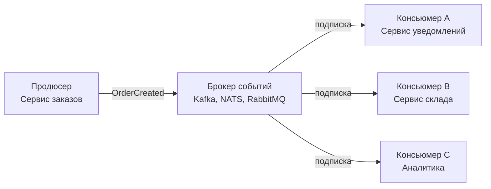

## События как фундамент слабой связанности

В предыдущих главах мы исследовали технологические протоколы связи: gRPC, REST и очереди сообщений. Однако пересылка байтов через сеть — это лишь физический транспорт. Настоящая архитектурная революция в распределённых системах происходит не тогда, когда мы меняем HTTP на сокет TCP, а когда мы совершаем ментальный переворот: **переходим от императивного мышления команд («пойди и сделай это») к декларативному мышлению фактов («это произошло, реагируйте, кто считает нужным»)**.

Именно этот фундаментальный принцип лежит в основе **Event-Driven Architecture (EDA)** — архитектуры, управляемой событиями.

Как любил повторять Брайан Керниган:
> *«Управление сложностью — это умение разделить систему на независимые части, которые ничего не знают о внутренних планах друг друга».*

В этой главе мы препарируем анатомию событий на уровне архитектурного проектирования. Мы разберём, как EDA разрушает жесткую временную связанность микросервисов, как устроены паттерны событий (Notification, ECST, Domain и Integration Events), как организовать потоковую обработку в Go с помощью буферизированных каналов и пулов воркеров, защитить память через `sync.Pool` и построить надёжный конвейер обработки ошибок с Dead Letter Queue (DLQ).

---

### Что такое событие в архитектурном смысле

В системном проектировании **Событие (Event)** — это неизменяемая цифровая запись о физическом факте, который **уже произошёл в прошлом**.

Событие принципиально отличается от команды:
- **Команда (Command)** выражает намерение и повелительное наклонение (`CreateOrder`, `ChargeCard`). Она направлена строго одному конкретному исполнителю и ожидает от него вполне определённого действия. Если исполнитель отказывается, операция прерывается.
- **Событие (Event)** констатирует свершившийся факт в изъявительном наклонении прошедшего времени: «Это случилось, мир изменился». Издателю безразлично, кто и как будет реагировать на этот факт.

Примеры канонических событий:
- `OrderCreated{OrderID: "123", UserID: "456", Total: 99.99}`
- `PaymentCompleted{PaymentID: "789", OrderID: "123"}`
- `InventoryReserved{OrderID: "123", Items: [...]}`

Ключевые анатомические характеристики события:
1. **Иммутабельность (Неизменяемость)**:  
   Событие невозможно отменить, отредактировать или «переиграть». Прошлое неизменно. Если клиент отменил оплаченный заказ, система не удаляет событие `PaymentCompleted`, а генерирует новое компенсирующее событие: `PaymentRefunded`.
2. **Именование строго в прошедшем времени**:  
   Названия типов событий обязаны оканчиваться глаголами совершенного вида в прошедшем времени: `Created`, `Completed`, `Failed`, но ни в коем случае не `Create` или `Complete`. Это ставит ментальный барьер против попыток превратить событие в замаскированную RPC-команду.
3. **Самодостаточность**:  
   Событие содержит либо минимальный ключ агрегата для последующего запроса, либо полный снимок данных, достаточный для автономной обработки получателем без обратных сетевых звонков продюсеру.

---

### Компоненты событийно-ориентированной системы



- **Продюсер (Producer)** — доменный сервис, в недрах которого свершился факт (например, Сервис заказов успешно зафиксировал транзакцию в PostgreSQL). Он сериализует событие и передаёт его брокеру.
- **Брокер (Event Broker)** — высоконадёжная распределённая шина или лог фиксации (Kafka, RabbitMQ, NATS), отвечающий за сохранение, репликацию и маршрутизацию потоков событий к подписчикам.
- **Консьюмер (Consumer)** — автономный сервис-подписчик. Он вычитывает событие и выполняет собственную локальную работу. Продюсер и консьюмеры полностью изолированы друг от друга в пространстве и во времени.

---

### Типы событий

Архитектура системы кардинально зависит от того, сколько информации упаковано в тело события. В индустрии различают четыре базовых паттерна:

1. **Event Notification (Событие-уведомление)**:  
   Событие содержит спартанский минимум: тип события и идентификатор агрегата (`{"event": "OrderCreated", "order_id": "123"}`).  
   *Плюс:* микроскопический размер сообщения в брокере.  
   *Минус:* чтобы узнать состав заказа, каждый консьюмер вынужден идти обратно в Сервис заказов по gRPC/REST. Это порождает паразитный синхронный трафик и сводит на нет изоляцию.
2. **Event-Carried State Transfer (ECST — Перенос состояния через событие)**:  
   Событие несёт в себе полный снимок изменённого состояния сущности (снапшот заказа, список артикулов, адрес доставки, данные клиента).  
   *Плюс:* консьюмеры работают на 100% автономно, кэшируя нужные данные в собственных локальных хранилищах.  
   *Минус:* раздувание размера сообщений и риск рассинхронизации версий схем.
3. **Domain Event (Доменное событие)**:  
   Событие рождается внутри корня агрегата (DDD, см. [[12. Domain Driven Design. Bounded Context и Aggregate]]) и отражает факт изменения бизнес-состояния (например, `OrderLineAdded`). Оно живёт в памяти приложения и используется для связи сущностей внутри одного Bounded Context.
4. **Integration Event (Интеграционное событие)**:  
   Публичный контракт для внешнего мира. Доменное событие очищается от внутренних приватных полей и публикуется в общекластерный брокер для потребления другими сервисами.

---

### Преимущества EDA

- **Абсолютная слабая связанность (Decoupling)**:  
  Продюсер ничего не знает о существовании подписчиков. Завтра отдел маркетинга решит запустить ML-анализ покупательского поведения: инженеры просто поднимут новый сервис и подпишут его на `OrderCreated`. Код сервиса заказов не изменится ни на байт!
- **Независимое масштабирование**:  
  Каждый консьюмер масштабируется строго под свой темп. Если генерация чеков отстаёт, мы просто добавляем 5 подов воркеров чеков.
- **Монументальная отказоустойчивость**:  
  Если сервис склада упал, сервис заказов продолжает принимать заказы клиентов в штатном режиме. События надёжно ждут своего часа на диске Kafka.
- **Полный аудит и история**:  
  Непрерывный поток событий представляет собой идеальный журнал аудита. Сохраняя события, мы можем перемотать время назад и восстановить состояние базы данных на любую секунду в прошлом — это краеугольный камень **Event Sourcing** ([[24. Event Sourcing. Хранение событий вместо состояния]]).

---

### Недостатки и вызовы

- **Конечная согласованность (Eventual Consistency)**:  
  Между публикацией события и его обработкой консьюмером проходит физическое время (от миллисекунд до минут). Архитектура обязана учитывать, что состояние разных частей системы временно несогласованно ([[29. Consistency модели. Strong, Eventual, Causal]]).
- **Нелинейная отладка**:  
  В синхронном монолите стек вызова показывает точную цепочку функций. В EDA цепочка разорвана: событие ушло в брокер, прочитано спустя 5 минут другим сервисом, породило новое событие... Без сквозных Correlation ID и распределённого трейсинга OpenTelemetry ([[40. Distributed Tracing и корреляция запросов]]) найти причину сбоя невозможно.
- **Нарушение порядка и дубликаты**:  
  В распределённых сетях неизбежны повторные доставки пакетов (at-least-once). Консьюмеры обязаны быть строго идемпотентными ([[27. Idempotency и exactly once семантика]]).

---

### Mechanical Sympathy: EDA и Go

Язык Go с его легковесными горутинами и каналами создан для событийно-ориентированных конвейеров.

Рассмотрим каноническую реализацию консьюмера событий на Go:

```go
package consumer

import (
    "context"
    "log"

    "github.com/segmentio/kafka-go"
)

// startConsumer поднимает конвейер: чтение из сокета -> буферизированный канал -> пул воркеров
func startConsumer(ctx context.Context, reader *kafka.Reader, workers int, handler func(msg []byte) error) {
    // Буферизированный канал выступает очередью в оперативной памяти:
    msgs := make(chan kafka.Message, 1000)

    // Запускаем фиксированный пул воркеров
    for i := 0; i < workers; i++ {
        go worker(ctx, msgs, handler)
    }

    // Главный цикл вычитки из Kafka
    for {
        m, err := reader.ReadMessage(ctx)
        if err != nil {
            break
        }
        // При переполнении буфера операция блокируется:
        // создается естественный backpressure на брокер!
        msgs <- m
    }
}

func worker(ctx context.Context, msgs <-chan kafka.Message, handler func([]byte) error) {
    for {
        select {
        case <-ctx.Done():
            return
        case m, ok := <-msgs:
            if !ok {
                return
            }
            if err := handler(m.Value); err != nil {
                log.Printf("handler failed: %v", err)
            }
            // коммит после успешной обработки
        }
    }
}
```

> [!info] Под капотом
> Буферизированный канал Go (`make(chan kafka.Message, 1000)`) действует как микро-очередь в оперативной памяти процесса. 
> Он развязывает быстрый сетевой I/O брокера и тяжелую бизнес-обработку воркеров.
> Если воркеры не справляются (например, база данных замедлилась), буфер заполняется, и операция записи `msgs <- m` блокирует горутину чтения. Сетевой драйвер прекращает вычитывать TCP-сокет, и в сторону брокера возникает естественное противодавление (**Backpressure**).
> 
> Обратите внимание на память: 100 воркеров Go съедают всего ~200 КБ стековой памяти. А чтобы не нагружать Garbage Collector постоянным выделением памяти под миллионы событий, высоконагруженные Go-обработчики используют `sync.Pool` для повторного использования буферов десериализации.

---

### Обработка ошибок и Dead Letter Queue

В асинхронном мире нельзя просто выбросить HTTP 500 клиенту. Если консьюмер падает на повреждённом сообщении («poison pill»), он заблокирует продвижение смещения (offset) всей партиции!

Для решения этой проблемы применяется строгий алгоритм:
1. Попытка обработки события.
2. При сбое — ограниченное число повторов с экспоненциальной задержкой (**Exponential Backoff**, см. [[36. Circuit Breaker, Retry, Timeout и Backoff]]).
3. Если все попытки исчерпаны, сообщение сбрасывается в **Dead Letter Queue (DLQ)** — специальную аварийную очередь для последующего анализа инженерами.
4. Смещение в основном топике фиксируется, и конвейер продолжает работу.

```go
package consumer

import (
    "context"
    "time"
)

type Message struct {
    ID    string
    Value []byte
}

type DLQPublisher interface {
    Publish(ctx context.Context, msg *Message) error
}

const maxRetries = 3

func processWithRetry(ctx context.Context, msg *Message, handler func(*Message) error, dlq DLQPublisher) error {
    var lastErr error
    for i := 0; i < maxRetries; i++ {
        lastErr = handler(msg)
        if lastErr == nil {
            return nil
        }
        if i < maxRetries-1 {
            // Экспоненциальный откат: 100мс, 200мс, 400мс...
            time.Sleep(time.Duration(1<<i) * 100 * time.Millisecond)
        }
    }

    // Исчерпаны попытки: сбрасываем в Dead Letter Queue, спасая партицию от зависания
    return dlq.Publish(ctx, msg)
}
```

---

### Связь с другими архитектурными паттернами

- **CQRS** ([[23. CQRS. Разделение чтения и записи]]): Команда мутирует агрегат и публикует событие. Консьюмеры вычитывают событие и асинхронно обновляют оптимизированные представления для чтения (Read Models).
- **Event Sourcing** ([[24. Event Sourcing. Хранение событий вместо состояния]]): Состояние системы не перезаписывается — оно хранится как упорядоченная последовательность всех исторических событий.
- **Saga** ([[26. Saga Pattern. Оркестрация и хореография]]): Распределённая бизнес-транзакция, реализуемая как цепочка событий и компенсирующих действий.

---

### EDA в Go: выбор брокера

| Брокер | Архитектурная модель | Когда применять в Go-системах |
|---|---|---|
| **NATS / JetStream** | Легковесный Pub/Sub + Streams | Микросекундная латентность, компактные Go-бинарники, IoT, внутренний брокер |
| **Apache Kafka** | Distributed Commit Log | Высокоскоростные стримы, гарантированный порядок внутри партиций, хранение истории |
| **RabbitMQ** | Очереди AMQP с гибкой маршрутизацией | Сложный роутинг по ключам (Exchange), управление очередями задач |
| **Redis Pub/Sub** | In-memory брокер без персистентности | Прототипы, мгновенная рассылка нотификаций, где потеря сообщений не критична |

> [!warning] Ловушка / Gotcha
> Остерегайтесь скрытых утечек горутин при реализации консьюмеров!
> Если цикл чтения запущен в горутине, он обязан слушать сигнал отмены контекста:

```go
func runConsumer(ctx context.Context) {
    for {
        select {
        case <-ctx.Done():
            log.Println("consumer successfully stopped")
            return
        default:
            // чтение и обработка сообщений
        }
    }
}
```
Игнорирование `ctx.Done()` приведёт к тому, что при деплое новые горутины будут плодиться, а старые — вечно висеть на заблокированном сетевом сокете брокера.

---

### Идемпотентность как архитектурное требование

Поскольку сеть ненадежна, брокеры гарантируют доставку *at-least-once*. Это означает: **ваше событие рано или поздно придёт дважды**.

Консьюмер обязан защитить себя от повторного выполнения бизнес-эффектов:
- Использование атомарных вставок в базу данных с проверкой уникальности: `INSERT ... ON CONFLICT DO NOTHING`.
- Хранение таблицы обработанных `event_id` в рамках локальной транзакции БД.
- Контроль версий агрегатов (Optimistic Concurrency Control).

---

### Когда применять EDA

**Оправдано:**
- Система состоит из множества независимых доменов с высокой степенью автономности команд.
- Требуется колоссальная пропускная способность и устойчивость к пиковым нагрузкам.
- Долгие составные бизнес-процессы (оформление заказа, бронирование авиабилетов, проводка платежей).
- Необходимость полного исторического следа для финансового аудита.

**Избыточно:**
- Простые сервисы с линейным CRUD, где синхронный вызов даёт результат мгновенно и без инфраструктурного оверхеда.

---

> [!tip] Собеседование
> **Вопрос:** Вы проектируете маркетплейс. При создании заказа нужно зарезервировать товар на складе, списать деньги со счёта и отправить email. Как правильно реализовать этот процесс с помощью EDA на Go?
> **Ответ:** 
> Я реализую этот процесс через распределённую сагу в стиле хореографии событий:
> 1. **Сервис заказов**: принимает запрос, сохраняет заказ в статусе `Pending` и публикует доменное событие `OrderCreated`.
> 2. **Сервис склада**: подписан на `OrderCreated`. Он резервирует товары в своей БД и публикует событие `InventoryReserved`.
> 3. **Сервис оплаты**: подписан на `InventoryReserved`. Он списывает средства и публикует событие `PaymentCompleted`.
> 4. **Сервис заказов**: получает `PaymentCompleted` и переводит статус заказа в `Confirmed`.
> 5. **Компенсирующий сценарий**: Если на этапе списания денег произошёл сбой (недостаточно средств), публикуется событие `PaymentFailed`. Сервис склада, слушая его, немедленно выполняет компенсацию — снимает резерв с товаров.
> В коде на Go консьюмеры оформляются в виде пулов воркеров с чтением из Kafka и фиксацией коммитов только после успешной транзакции в локальной БД.

---

### Итог

Event-Driven Architecture — это высшая ступень декомпозиции систем. Она превращает систему в живой оркестр: каждый инструмент играет свою партию, реагируя на общую музыкальную тему, не нуждаясь в постоянных указаниях дирижёра. Язык Go с его великолепными каналами, горутинами и механической симпатией к памяти предоставляет лучший фундамент для построения таких систем.

Теперь настало время исследовать конкретные топологии брокеров: чем модель очередей отличается от модели лога и pub/sub? Об этом — в следующей главе: [[22. Pub Sub, Queue, Stream модели]].
