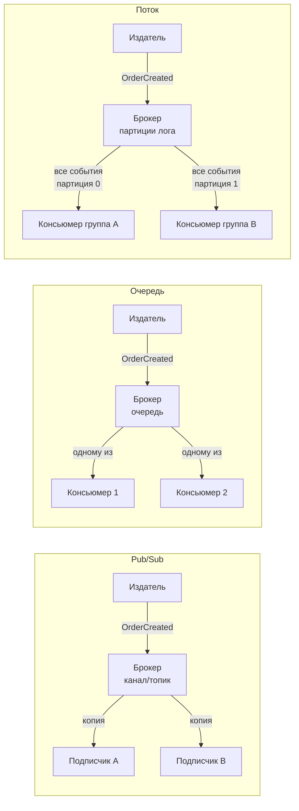

В предыдущей главе мы выяснили, что Event-Driven Architecture совершает революцию в слабой связанности систем. Однако за словом «события» скрываются принципиально разные топологии передачи данных.

Если разработчик считает, что «брокер сообщений — это просто очередь», он рискует заложить под архитектуру мину замедленного действия. Модели **Pub/Sub (Издатель/Подписчик)**, **Queue (Очередь сообщений)** и **Stream (Потоковый распределённый лог)** решают диаметрально противоположные инженерные задачи.

Понимание их внутреннего механического устройства определяет всё: гарантирован ли порядок сообщений, что произойдёт при падении сервера, сможет ли система перемотать время назад для исправления бага и сколько тактов процессора потратит Go-рантайм на обработку входящего сетевого сокета.

В этой главе мы разберём три кита асинхронного транспорта, их реализацию в коде на Go, влияние на аллокатор памяти и сборщик мусора, а также сформулируем чёткие критерии выбора между ними.

---

### Три модели: определения и ключевые отличия



1. **Pub/Sub (Publish/Subscribe — Издатель/Подписчик)**:  
   Модель радиовещания (Broadcast). Издатель отправляет сообщение в именованный канал (subject или topic). Брокер мгновенно копирует это сообщение **абсолютно всем активным подписчикам**. Сообщение не сохраняется на диск: если подписчик отключился или моргнула сеть, он безвозвратно теряет всё, что прозвучало в эфире во время его отсутствия (*at-most-once*).
2. **Queue (Очередь конкурирующих потребителей — Competing Consumers)**:  
   Модель распределения задач (Work Queue). Издатель кладёт сообщение в очередь. Брокер доставляет каждое сообщение **ровно одному воркеру** из пула потребителей. Сообщение надёжно удерживается в очереди до тех пор, пока воркер не пришлёт подтверждение успешной обработки (**Acknowledgment, ACK**). Если воркер падает, брокер возвращает задачу в очередь и перенаправляет её живому соседу (*at-least-once*).
3. **Stream (Поток — Неизменяемый лог фиксации / Commit Log)**:  
   Гибридная архитектура нового поколения. Сообщения не удаляются после вычитки! Они последовательно дописываются в конец неизменяемого дискового файла (Append-Only Log) и хранятся в соответствии с политикой удержания (Retention Policy — например, 7 дней или бесконечно).  
   Десятки независимых сервисов (Consumer Groups) могут параллельно читать один и тот же поток на разной скорости, каждый независимо перемещая свой указатель смещения (**Offset**).

---

### Pub/Sub в Go

Классическим эталоном быстрой Pub/Sub шины является **NATS** (клиент `nats.go`). Это легковесная нервная система с микросекундными задержками.

Внутри одного процесса Go (например, внутри модульного монолита) архитектуру Pub/Sub легко смоделировать с помощью каналов и мьютексов:

```go
package pubsub

import "sync"

type Event struct {
    Type string
    Data any
}

// Broker - легковесный внутрипроцессный Pub/Sub на каналах Go
type Broker struct {
    mu   sync.RWMutex
    subs map[string][]chan Event
}

func NewBroker() *Broker {
    return &Broker{
        subs: make(map[string][]chan Event),
    }
}

func (b *Broker) Subscribe(subject string) <-chan Event {
    ch := make(chan Event, 64) // буферизированный канал защищает от микроблокировок
    b.mu.Lock()
    b.subs[subject] = append(b.subs[subject], ch)
    b.mu.Unlock()
    return ch
}

func (b *Broker) Publish(subject string, ev Event) {
    b.mu.RLock()
    defer b.mu.RUnlock()

    for _, ch := range b.subs[subject] {
        select {
        case ch <- ev:
        default:
            // non-blocking — если подписчик завис, мы сбрасываем сообщение,
            // чтобы медленный клиент не парализовал работу всего издателя!
        }
    }
}
```

> [!warning] Ловушка / Gotcha
> Внутрипроцессный Pub/Sub на каналах Go без достаточного буфера легко теряет сообщения. 
> Конструкция `select` с веткой `default` делает отправку неблокирующей, но налагает строгую семантику **at-most-once**: медленный подписчик с переполненным каналом молча потеряет событие! Если потеря недопустима, необходима очередь с персистентным хранением на диске.

**Где применять Pub/Sub:**
- Мгновенная рассылка уведомлений в реальном времени (WebSockets, серверные уведомления чатов).
- Внутрипроцессная диспетчеризация событий в модульном монолите.
- Высокоскоростная телеметрия, где потеря 0.01% пакетов менее критична, чем задержка.

---

### Queue в Go

Модель очередей создана для распределения вычислительной работы. Её классический промышленный представитель — **RabbitMQ** (библиотека `streadway/amqp`).

Консьюмеры подключаются к очереди, конкурируют за получение сообщений, выполняют бизнес-логику и отправляют подтверждение `msg.Ack(false)`.

```go
package queue

import (
    "context"
    "log"

    "github.com/streadway/amqp"
)

// startWorkers поднимает фиксированный пул конкурирующих потребителей очереди
func startWorkers(ctx context.Context, channel *amqp.Channel, queueName string, workers int, handler func(msg amqp.Delivery)) {
    for i := 0; i < workers; i++ {
        go func(workerID int) {
            // Режим manual ack (autoAck = false)
            deliveries, err := channel.Consume(queueName, "", false, false, false, false, nil)
            if err != nil {
                log.Fatalf("failed to register consumer: %v", err)
            }

            for {
                select {
                case <-ctx.Done():
                    return
                case msg, ok := <-deliveries:
                    if !ok {
                        return
                    }
                    // Выполняем бизнес-логику задачи
                    handler(msg)
                    // Подтверждаем удаление задачи из очереди
                    _ = msg.Ack(false)
                }
            }
        }(i)
    }
}
```

> [!info] Под капотом
> В архитектуре RabbitMQ протокол AMQP использует мультиплексирование: несколько логических каналов (`amqp.Channel`) работают поверх одного физического TCP-соединения. 
> Подтверждение `msg.Ack(false)` отправляет по сети легковесный AMQP-фрейм. Если воркер потребил сообщение, но упал в панику до вызова `Ack`, TCP-соединение разорвётся, и брокер немедленно сделает requeue сообщения другому живому воркеру.

**Где применять Очереди:**
- Асинхронные задачи фоновой обработки (генерация PDF-выписок, отправка SMS, конвертация видео).
- Обработка команд в архитектурах с CQRS.
- Системы, где каждая задача обязана быть выполнена строго одним воркером.

---

### Stream в Go

**Stream** — это архитектурная революция последних 15 лет, эталоном которой стали **Apache Kafka** и современные высокопроизводительные движки вроде **Redpanda**.

Вместо удаления сообщений после обработки стрим сохраняет их на диске в виде непрерывного упорядоченного лога (Commit Log). Поток разбивается на независимые **партиции (Partitions)**, внутри которых гарантируется абсолютный хронологический порядок:

```
 Лог партиции 0 (на диске):
 [Offset 0] -> [Offset 1] -> [Offset 2] -> [Offset 3] -> [Offset 4] (дописываются новые события)
                     ↑                          ↑
          (Консьюмер аналитики)        (Консьюмер биллинга)
```

В Go для взаимодействия с Kafka используют библиотеки `segmentio/kafka-go` или `confluent-kafka-go`:

```go
package stream

import (
    "context"
    "log"

    "github.com/segmentio/kafka-go"
)

// consumePartition читает упорядоченный лог партиции с контролем смещений
func consumePartition(ctx context.Context, reader *kafka.Reader, handler func(msg kafka.Message) error) {
    for {
        msg, err := reader.ReadMessage(ctx)
        if err != nil {
            log.Printf("read stream error: %v", err)
            break
        }

        // Выполняем обработку события
        if err := handler(msg); err != nil {
            log.Printf("processing failed: %v", err)
            // При ошибке мы НЕ коммитим offset!
            // Мы можем повторить обработку или направить в DLQ.
            continue
        }

        // Атомарно фиксируем прогресс чтения
        if err := reader.CommitMessages(ctx, msg); err != nil {
            log.Printf("commit failed: %v", err)
        }
    }
}
```

> [!info] Под капотом
> В Kafka консьюмер-группа (Consumer Group) автоматически распределяет партиции между инстансами Go-приложений. 
> При вызове `ReadMessage()` клиент читает данные из сокета. 
> Для достижения гигантской пропускной способности (сотни тысяч RPS) драйверы используют метод `ReadBatch`. Он вычитывает с диска брокера сразу сотни сообщений в едином буфере памяти ядра Linux через системный вызов `sendfile`, исключая лишнее переключение контекста процессора.

**Где применять Стримы:**
- Системы Event Sourcing ([[24. Event Sourcing. Хранение событий вместо состояния]]), где лог событий является единственным источником правды.
- Потоковая аналитика, телеметрия, сбор кликстрима.
- Сценарии, где нескольким независимым сервисам требуется читать один и тот же исторический поток событий на разной скорости с возможностью перемотки назад (**Replayability**).

---

### Сравнительный анализ

| Характеристика | Pub/Sub | Queue | Stream |
|---|---|---|---|
| **Модель адресации** | Broadcast: всем активным подписчикам | Competing Consumers: ровно одному воркеру | Всем Consumer Groups независимо |
| **Жизненный цикл сообщения** | Удаляется мгновенно после передачи | Удаляется после подтверждения (`Ack`) | Хранится на диске по таймеру (Retention) |
| **Гарантия порядка** | Не гарантирован | Обычно FIFO в очереди | Строго гарантирован внутри партиции |
| **Перечитывание (Replay)** | Невозможно | Невозможно (сообщение стёрто) | Возможно с любого произвольного Offset |
| **Семантика доставки** | At-most-once | At-least-once (с повторами при сбоях) | At-least-once / Exactly-once |
| **Популярные решения в Go** | NATS (`nats.go`), каналы Go | RabbitMQ (`streadway/amqp`), AWS SQS | Apache Kafka, Redpanda (`segmentio/kafka-go`) |
| **Давление на память и GC** | Минимальное: сообщения не оседают | Среднее: буферы воркеров | Высокое при пакетном чтении сотен тысяч записей |

---

### Mechanical Sympathy: Go и модели сообщений

Как выбор модели сказывается на железе и рантайме Go?

1. **Аллокатор памяти и профилирование `pprof`**:  
   - В Pub/Sub сообщения живут в памяти доли миллисекунды и утилизируются в молодом поколении кучи.
   - В Queue сообщение находится в памяти, пока воркер выполняет работу (увеличивая Working Set процесса).
   - В Stream консьюмер вычитывает пакеты (batches) из тысяч сообщений за раз. Это приводит к выделению крупных массивов байтов. Профилирование через `pprof` (heap profile) позволяет выявить утечки и настроить размер внутренних буферов драйвера.
2. **Параллелизм горутин**:  
   - В Queue вы можете масштабировать пул воркеров до 500 горутин, и они будут разбирать одну очередь.
   - В Stream степень параллелизма ограничена **количеством партиций топика**. Две горутины из одной consumer group не могут параллельно читать одну и ту же партицию (иначе нарушится строгий порядок сообщений). Если у вас в топике 10 партиций, 11-й воркер будет простаивать!
3. **Сетевой ввод-вывод**:  
   Все современные клиенты Go используют системный вызов `epoll` через netpoller. Чтение сообщений пачками (`ReadBatch`) резко снижает количество системных вызовов `read()` и прерываний ядра Linux по сравнению с поштучным чтением.

---

### Выбор модели в архитектуре

На практике зрелые распределённые платформы гармонично сочетают все три подхода:

```
 [Внутренний процесс Go] ──(Pub/Sub на каналах)──> Уведомление UI через WebSocket
 [Сервис заказов]        ──(Stream в Kafka)─────> Долговечный лог OrderCreated для аналитики и аудита
 [Фоновый сервис]        ──(Queue в RabbitMQ)───> Задача генерации закрывающего PDF-акта
```

- Нужна максимальная скорость без гарантий и хранения? — **Pub/Sub**.
- Нужно равномерно распределить тяжелые независимые задачи между воркерами? — **Queue**.
- Нужен строгий порядок, история изменений и возможность перемотать время назад? — **Stream**.

---

> [!tip] Собеседование
> **Вопрос:** В чём ключевое архитектурное отличие модели Stream (Kafka) от модели Queue (RabbitMQ), и по каким критериям вы отдадите предпочтение Kafka?
> **Ответ:** 
> 1. **Сохранение и разрушение данных**: В Queue (RabbitMQ) сообщение уничтожается, как только консьюмер присылает `Ack`. В Stream (Kafka) сообщения дописываются в неизменяемый лог на диске и живут согласно retention policy независимо от факта прочтения.
> 2. **Перечитывание (Replayability)**: В Kafka новый сервис может перемотать offset на начало времён и восстановить своё состояние с нуля. В очереди это невозможно.
> 3. **Модель масштабирования**: В RabbitMQ 50 воркеров могут разбирать одну очередь. В Kafka параллелизм строго ограничен числом партиций топика.
> **Мой выбор**: Я выберу **Kafka (Stream)**, если строю Event Sourcing, потоковую аналитику или если одно событие должно независимо вычитываться пятью разными микросервисами на разной скорости. Я выберу **RabbitMQ (Queue)**, если мне требуется сложная маршрутизация по ключам AMQP, очереди с приоритетами или распределение тяжелых одноразовых задач между пулом воркеров.

---

### Итог

Pub/Sub, Queue и Stream — это три фундаментальные топологии асинхронного мира. Понимание их сильных сторон и ограничений позволяет инженеру проектировать системы, которые не теряют данные при отказах оборудования и выдерживают миллионные нагрузки.

Освоив механику потоков и очередей, мы переходим к фундаментальному паттерну распределённых систем, который разделяет чтение и запись данных на уровне архитектуры: [[23. CQRS. Разделение чтения и записи]].
