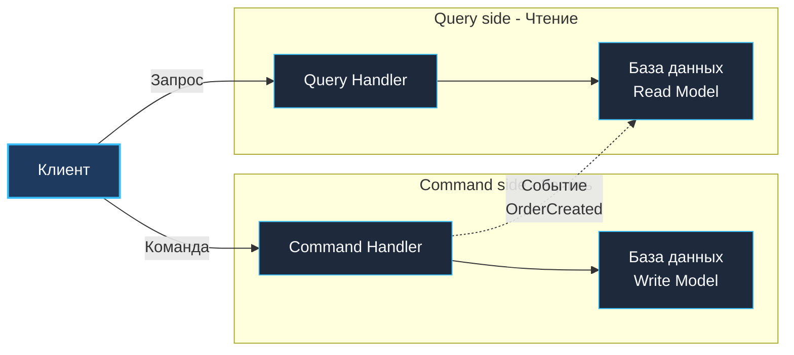

В традиционных CRUD-приложениях (Create, Read, Update, Delete) разработчики почти всегда используют одну и ту же модель данных и для записи, и для чтения. 

На этапе прототипа это кажется верхом простоты: есть таблица `orders`, есть структура `type Order struct`, и один и тот же SQL-запрос обслуживает и создание корзины, и формирование дашборда аналитики.

Однако по мере роста кодовой базы и нагрузки эта идиллия превращается в кошмар оптимизации:
- **Запись** требует максимальной нормализации (3-я нормальная форма), строгих внешних ключей (Foreign Keys) и гранулярных ACID-блокировок для защиты инвариантов.
- **Чтение**, напротив, требует денормализации данных, широких таблиц (плоских View), массивных композитных индексов и объединения десятков таблиц через тяжелые `JOIN`.

Попытка заставить одну структуру данных и одну базу данных обслуживать оба противоположных вектора приводит к патовой ситуации: индексы для чтения критически замедляют запись, а транзакции записи блокируют быстрые пользовательские выборки.

Архитектурный паттерн **Command Query Responsibility Segregation (CQRS — Разделение ответственности за команды и запросы)** предлагает элегантный выход: **полностью физически и логически разделить модели изменения данных и модели отображения данных**.

В этой главе мы исследуем паттерн CQRS в экосистеме Go. Мы разберём, как организовать структуры команд и запросов, как построить асинхронную проекцию через события брокера, как оптимизировать чтение с помощью `sync.Pool` и батчинга `pgx.Batch`, и как управлять конечной согласованностью (Eventual Consistency) в распределённых системах.

---

### Что такое CQRS

Концепция CQRS была сформулирована Грегом Янгом (Greg Young) как развитие принципа **CQS (Command Query Separation)** Бертрана Мейера. 

Классическое правило CQS гласит:
> *«Вопрос не должен менять ответ. Метод, возвращающий значение, не должен иметь побочных эффектов, а метод, мутирующий состояние, не должен возвращать данные».*

CQRS переносит этот принцип с уровня отдельных функций на уровень макроархитектуры всей системы. Система разделяется на две суверенные половины:

1. **Command Side (Модель записи / Write Model)**:  
   Принимает **команды** (намерения мутации: `CreateOrderCommand`, `UpdateProfile`). Проверяет бизнес-инварианты агрегата, сохраняет транзакционные изменения и возвращает клиенту **только статус операции и идентификатор** созданного ресурса (никаких тяжелых доменных структур!).
2. **Query Side (Модель чтения / Read Model)**:  
   Принимает **запросы** (`GetOrderHistory`, `SearchUsers`). Возвращает денормализованные структуры отображения (**DTO / Views**), идеально подогнанные под конкретный интерфейс пользователя (UI) или API мобильного клиента. Здесь нет никакой бизнес-логики и валидации — только максимально быстрая отдача байтов из кэша или оптимизированных таблиц.



---

### Зачем разделять чтение и запись

Посмотрим на конфликт требований сквозь призму системного инжиниринга:

1. **Разные формы данных**:  
   При оформлении заказа доменной модели важны сущности `Order`, `OrderLine` и правила списания скидок. Но когда пользователь открывает страницу истории заказов, ему нужны: имя клиента, статус доставки от курьерской службы, превью первого товара и общее число позиций. В классической БД это требует 5 `JOIN`-ов. В CQRS модель чтения хранит плоский предрассчитанный документ `OrderView`.
2. **Асимметрия нагрузки (Read/Write Ratio)**:  
   В интернет-магазинах, новостных порталах и соцсетях соотношение чтений к записям составляет **100:1 или даже 1000:1**. В единой модели вам приходится масштабировать всё приложение целиком. В CQRS вы можете выделить 2 пода для записи и 50 реплик для чтения!
3. **Борьба за дисковые блокировки**:  
   Длинный аналитический SQL-запрос `SELECT ... SUM(price)` в PostgreSQL захватывает shared-блокировки и вытесняет кэш страниц операционной системы, тормозя быстрые точечные вставки `INSERT INTO orders`.
4. **Оптимизация индексов**:  
   Каждый дополнительный B-Tree индекс ускоряет поиск `SELECT`, но замедляет каждую вставку `INSERT` и обновление `UPDATE`, так как СУБД обязана перестраивать дерево на диске.

---

### Простейшая реализация CQRS на Go

В языке Go разделение ответственности начинается с явного разграничения пакетов и интерфейсов.

#### Сторона записи (Command Side)

Команда — это структура параметров. Обработчик команды проверяет инварианты, сохраняет агрегат в репозиторий записи и генерирует событие:

```go
// core/order/command.go - Command side
package order

import (
    "context"
    "errors"
)

type CreateOrderCommand struct {
    UserID string
    Items  []OrderItem
}

type WriteRepository interface {
    Save(ctx context.Context, order *Order) error
}

type EventBus interface {
    Publish(ctx context.Context, event any) error
}

type CommandHandler struct {
    repo     WriteRepository
    eventBus EventBus
}

func NewCommandHandler(repo WriteRepository, bus EventBus) *CommandHandler {
    return &CommandHandler{repo: repo, eventBus: bus}
}

func (h *CommandHandler) CreateOrder(ctx context.Context, cmd CreateOrderCommand) (string, error) {
    if len(cmd.Items) == 0 {
        return "", errors.New("empty order items")
    }

    // 1. Создаем агрегат и защищаем инварианты
    order := NewOrder(cmd.UserID, cmd.Items)
    
    // 2. Персистим в транзакционную базу данных
    if err := h.repo.Save(ctx, order); err != nil {
        return "", err
    }

    // 3. Публикуем доменное событие для проекторов модели чтения
    _ = h.eventBus.Publish(ctx, OrderCreated{
        OrderID: order.ID, 
        UserID:  cmd.UserID, 
        Items:   cmd.Items,
    })

    // Команда возвращает ТОЛЬКО идентификатор, но не весь агрегат!
    return order.ID, nil
}
```

#### Сторона чтения (Query Side)

Запрос — это параметры фильтрации. Обработчик обращается к оптимизированному хранилищу чтения и возвращает готовую модель представления `OrderView`:

```go
// core/order/query.go - Query side
package order

import "context"

type GetOrderQuery struct {
    OrderID string
}

type OrderView struct {
    OrderID     string      `json:"order_id"`
    UserName    string      `json:"user_name"`
    Status      string      `json:"status"`
    Total       float64     `json:"total"`
    ItemsCount  int         `json:"items_count"`
    LastComment string      `json:"last_comment"`
}

type ReadRepository interface {
    FindByID(ctx context.Context, id string) (*OrderView, error)
}

type QueryHandler struct {
    readRepo ReadRepository
}

func NewQueryHandler(repo ReadRepository) *QueryHandler {
    return &QueryHandler{readRepo: repo}
}

func (h *QueryHandler) GetOrder(ctx context.Context, q GetOrderQuery) (*OrderView, error) {
    // Никаких тяжелых вычислений - просто отдача готового кэша/документа!
    return h.readRepo.FindByID(ctx, q.OrderID)
}
```

---

### Разделение моделей данных

Истинная мощь CQRS проявляется, когда модели чтения и записи разделяются на уровне физических хранилищ:

**1. Write Model (PostgreSQL — строгая 3НФ нормализация):**
```sql
CREATE TABLE orders (
    id UUID PRIMARY KEY,
    user_id UUID NOT NULL,
    status VARCHAR(20) NOT NULL,
    total_amount DECIMAL NOT NULL,
    created_at TIMESTAMPTZ DEFAULT now()
);
```

**2. Read Model (Денормализованная таблица в PostgreSQL, Redis, Elasticsearch или MongoDB):**
```sql
-- Полностью плоская таблица, исключающая любые JOIN-операции при чтении
CREATE TABLE order_views (
    order_id UUID PRIMARY KEY,
    user_name TEXT,
    status TEXT,
    total DECIMAL,
    items_count INT,
    last_comment TEXT
);
```

При чтении запрос `SELECT * FROM order_views WHERE order_id = $1` выполняется за доли миллисекунды, читая единственную непрерывную дисковую страницу.

---

### Синхронизация моделей: синхронная и асинхронная

Как изменения из Write Model попадают в Read Model?

#### 1. Синхронная синхронизация (В рамках одной транзакции)
Команда одновременно обновляет и Write Model, и Read Model в рамках единой ACID-транзакции с помощью `SaveWithTx`:

```go
func (h *CommandHandler) CreateOrder(ctx context.Context, cmd CreateOrderCommand) (string, error) {
    tx, _ := h.db.Begin(ctx)
    defer tx.Rollback(ctx)
    
    order := NewOrder(cmd.UserID, cmd.Items)
    h.writeRepo.SaveWithTx(ctx, tx, order)
    
    // Синхронно пишем в проекцию
    view := NewOrderView(order)
    h.readRepo.SaveWithTx(ctx, tx, view)
    
    return order.ID, tx.Commit(ctx)
}
```
*Плюс:* Немедленная согласованность (Strong Consistency).  
*Минус:* Запись замедляется, оба хранилища обязаны поддерживать единую транзакцию (обычно это одна и та же СУБД).

#### 2. Асинхронная синхронизация через проекторы (Рекомендуемый подход)
Команда сохраняет данные в Write DB и публикует событие в брокер (например, Kafka или NATS JetStream). Специальный компонент — **Проектор (Projector)** — асинхронно вычитывает события и обновляет Read Model:

```go
// Query side: Проектор обновляет модель чтения
type OrderProjector struct {
    readRepo ReadRepository
}

func (p *OrderProjector) OnOrderCreated(ctx context.Context, event OrderCreated) error {
    view := NewOrderView(event)
    return p.readRepo.Upsert(ctx, view)
}
```

> [!warning] Ловушка / Gotcha
> При асинхронной синхронизации система неизбежно входит в режим **Eventual Consistency** ([[29. Consistency модели. Strong, Eventual, Causal]]). 
> Пользователь, нажавший кнопку «Оформить заказ», перенаправляется на экран профиля и... не видит свой заказ в течение 50 миллисекунд, пока событие летит через Kafka в проектор! 
> Эту проблему решают на уровне UX: либо клиентский UI делает оптимистичное добавление заказа в локальный кэш браузера (Optimistic UI), либо опрашивает сервер с коротким интервалом (polling), либо шлюз удерживает чтение до подтверждения проектора.

---

### Mechanical Sympathy: CQRS и Go

Как архитектура CQRS влияет на кремний, ядра процессора и память?

#### 1. Разделение пулов горутин и соединений
Команды и запросы обладают совершенно разным профилем нагрузки. Для Query side мы выделяем массивный пул соединений к репликам чтения через библиотеку **`pgxpool`** (`github.com/jackc/pgx/v5/pgxpool`). Для горячих ключей мы используем in-memory кэширование без блокировок — потокобезопасный `sync.Map` или библиотеки с сегментированной памятью вроде **`bigcache`**, предотвращающие накладные расходы на сборщик мусора.

#### Влияние на GC
В высоконагруженных Query-сервисах при 100 000 RPS постоянное выделение памяти под структуры ответов `OrderView` нагружает аллокатор Go. Применение пула объектов `sync.Pool` позволяет переиспользовать экземпляры структур, исключая лишние походы в кучу:

```go
var viewPool = sync.Pool{
    New: func() any { return &OrderView{} },
}

func (h *QueryHandler) GetOrder(ctx context.Context, q GetOrderQuery) (*OrderView, error) {
    view := viewPool.Get().(*OrderView)
    // Очищаем поля структуры перед повторным использованием
    *view = OrderView{}
    defer viewPool.Put(view)
    
    // Заполняем поля из базы данных без новых аллокаций
    err := h.db.QueryRowContext(ctx, "SELECT ...").Scan(&view.OrderID, &view.UserName, &view.Total)
    return view, err
}
```

#### Системные вызовы и батчинг
Когда проектор слушает поток событий из Kafka, обновление Read DB по одному событию порождает слишком много сетевых системных вызовов к СУБД. В Go с помощью `pgx.Batch` события упаковываются в пачки и отправляются в едином системном вызове `SendBatch`:

```go
func (p *OrderProjector) OnEvents(ctx context.Context, events []OrderCreated) error {
    batch := &pgx.Batch{}
    for _, ev := range events {
        batch.Queue(`
            INSERT INTO order_views (order_id, user_id, status, total) 
            VALUES ($1, $2, $3, $4) 
            ON CONFLICT (order_id) DO UPDATE SET status = EXCLUDED.status`,
            ev.OrderID, ev.UserID, "created", ev.Total)
    }
    br := p.pool.SendBatch(ctx, batch)
    return br.Close()
}
```

---

### Связь с Event Sourcing

Паттерны CQRS и **Event Sourcing** ([[24. Event Sourcing. Хранение событий вместо состояния]]) великолепно дополняют друг друга, но концептуально независимы:
- Можно использовать CQRS с классическими таблицами в PostgreSQL на стороне записи.
- Можно использовать Event Sourcing без разделения моделей чтения.

Однако их синергия идеальна: если Write Model хранит историю событий, то Read Models — это просто вторичные проекции, которые можно в любой момент пересоздать с нуля, проиграв лог событий Kafka заново!

---

### Когда применять CQRS

**Оправдано:**
- Системы со сверхвысоким дисбалансом чтений и записей (каталоги товаров, социальные сети, медиаплатформы).
- Домены, где форма данных при редактировании кардинально отличается от формы отображения.
- Необходимость полнотекстового поиска (Elasticsearch/OpenSearch) наряду со строгой транзакционной БД для платежей.
- Необходимость независимого масштабирования команд разработки: команда витрины пишет свои проекторы, не трогая доменную логику заказов.

**Избыточно:**
- Простые сервисы с типовым CRUD, где затраты на синхронизацию моделей превысят любую выгоду.

> [!info] Под капотом
> CQRS без физического разделения баз данных — это просто архитектурная дисциплина разделения интерфейсов команд и запросов. Но истинный квантовый скачок производительности происходит тогда, когда Write Model и Read Model физически разводятся по разным СУБД (например, PostgreSQL для транзакций и Redis/Elasticsearch для мгновенной отдачи выборок).

---

### Антипаттерны и типичные ошибки

1. **CQRS ради резюме (Overengineering)**: Внедрение разделения моделей в проект, обслуживающий 5 запросов в секунду.
2. **Общая структура для команд и запросов**: Если вы используете один и тот же `struct Order` и в `CommandHandler`, и в `QueryHandler`, вы убили смысл паттерна. Модель чтения обязана быть самостоятельной и оптимизированной под клиента.
3. **Игнорирование лага репликации**: Надежда на то, что «Kafka доставит мгновенно». Если ваш фронтенд падает с ошибкой 404, когда заказ ещё не долетел до проектора — вы сломали пользовательский опыт.

---

### Итог

CQRS — это мощнейшее архитектурное оружие, разрушающее компромисс между нормализацией записи и денормализацией чтения. Вы получаете максимальную скорость вставок на Write Side и мгновенные выборки без `JOIN` на Query Side.

Теперь, разобравшись с разделением моделей, мы готовы подойти к высшей ступени работы с данными — полному отказу от хранения текущего состояния в пользу непрерывного потока фактов: [[24. Event Sourcing. Хранение событий вместо состояния]].
