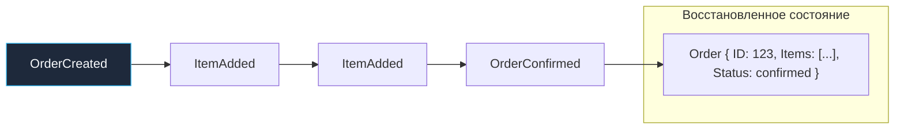

## Событие как источник истины

В классическом программировании мы привыкли воспринимать базу данных как склад текущего состояния: если баланс пользователя изменился с 1000 на 1500 рублей, мы выполняем `UPDATE accounts SET balance = 1500` и безжалостно перезаписываем ячейку памяти на диске. 

Но задумайтесь: как устроена настоящая бухгалтерия, существующая уже более пятисот лет? Ни один бухгалтер в мире не стирает ластиком старую запись в гроссбухе! Вместо этого он вносит новую проводку: «+500 рублей от покупателя». Баланс счёта никогда не является первичным фактом — это вычисляемая сумма всех проводок с момента открытия компании.

Паттерн **Event Sourcing (Событийное порождение / Хранение событий)** переносит эту безупречную финансовую философию в архитектуру цифровых систем. Вместо того чтобы сохранять снимок текущего состояния сущности, мы делаем **единственным источником истины непрерывный, неизменяемый поток событий**, произошедших с объектом во времени.

Как любил замечать Брайан Керниган:
> *«Текущее состояние системы — это всего лишь транзитная точка. Самое ценное — это история того, как система пришла в это состояние».*

В этой главе мы глубоко исследуем Event Sourcing в реалиях промышленного Go. Мы разберём механику метода `Apply`, работу хранилища `Event Store`, технику снятия снапшотов (Snapshots), стратегии эволюции схем (Upcasting) и покажем, как избежать чудовищных аллокаций памяти при гидратации агрегатов из тысяч исторических фактов.

---

### Что такое Event Sourcing

В традиционной архитектуре (CRUD) состояние объекта перезаписывается на месте:

```sql
UPDATE orders SET status = 'confirmed', total = 150 WHERE id = '123';
```
Выполнив этот запрос, мы навсегда уничтожили информацию: какой статус был у заказа минуту назад? Кто именно его подтвердил? Вносились ли скидки? Без тяжелых таблиц аудита эта информация стёрта.

В парадигме **Event Sourcing** мы никогда ничего не обновляем на месте. Любая операция мутации выражается в виде последовательного добавления (Append-Only) неизменяемых событий в лог:

```go
events.Append(
    OrderCreated{ID: "123", UserID: "usr-42"},
    OrderItemAdded{ProductID: "p1", Qty: 2, Price: 50},
    OrderConfirmed{},
)
```

Текущее состояние заказа `Order` в любой момент времени восстанавливается (**Rehydration**) путём последовательного проигрывания всех событий агрегата от начала времён к настоящему моменту:



---

### Ключевые компоненты

1. **Event Store (Хранилище событий)**:  
   Специализированная база данных, оптимизированная исключительно под две операции: быструю дозапись в конец (`Append`) и выборку всех событий агрегата по его идентификатору.  
   Это может быть отдельная таблица в реляционной СУБД (PostgreSQL, MySQL), распределённый стрим (Apache Kafka) или специализированная документоориентированная СУБД вроде **EventStoreDB**.
   
   В PostgreSQL схема таблицы событий оформляется с составным первичным ключом:
   ```sql
   CREATE TABLE events (
       aggregate_id UUID NOT NULL,
       version      INT NOT NULL,
       event_type   TEXT NOT NULL,
       payload      JSONB NOT NULL,
       occurred_at  TIMESTAMPTZ DEFAULT now(),
       PRIMARY KEY (aggregate_id, version)
   );
   ```
2. **Агрегат (Aggregate Root)**:  
   Доменный объект (DDD, см. [[12. Domain Driven Design. Bounded Context и Aggregate]]), инкапсулирующий бизнес-правила. Он восстанавливает своё состояние из истории событий и при вызове методов генерирует новые события.
3. **Событие (Event)**:  
   Неизменяемая структура данных, описывающая завершённое действие. В Go события обычно объединяются интерфейсом:

```go
type Event interface {
    AggregateID() string
    Version() int
}

type OrderCreated struct {
    OrderID string
    UserID  string
    At      time.Time
}

func (e OrderCreated) AggregateID() string { return e.OrderID }
func (e OrderCreated) Version() int       { return 1 }
```

---

### Реализация Event Sourcing в Go

В мире Go мы полностью отказываемся от тяжеловесных ORM. Репозиторий больше не генерирует `SELECT * FROM orders WHERE id = $1`. Он вычитывает срез событий и передаёт их в чистый фабричный конструктор:

```go
package order

import (
    "context"
    "errors"
)

var (
    ErrOrderNotEditable = errors.New("cannot modify order in confirmed status")
)

type EventStore interface {
    LoadEvents(ctx context.Context, id string) ([]Event, error)
    Append(ctx context.Context, id string, expectedVersion int, events []Event) error
}

type OrderRepository struct {
    store EventStore
}

func (r *OrderRepository) Load(ctx context.Context, id string) (*Order, error) {
    events, err := r.store.LoadEvents(ctx, id)
    if err != nil {
        return nil, err
    }

    order := NewBlankOrder()
    for _, ev := range events {
        order.Apply(ev)
        order.Version = ev.Version()
    }
    return order, nil
}
```

#### Анатомия метода Apply

Критически важное архитектурное правило: **Метод `Apply` обязан быть чистой функцией без побочных эффектов!**  
Внутри `Apply` категорически запрещено обращаться к базе данных, вызывать сетевые сокеты или логировать через внешние каналы. Его единственная задача — переложить данные из полей события в поля структуры агрегата.

```go
type OrderStatus int

const (
    StatusDraft OrderStatus = iota
    StatusConfirmed
)

type Order struct {
    ID                string
    UserID            string
    Items             []Item
    Total             Money
    Status            OrderStatus
    Version           int
    uncommittedEvents []Event // Новые события, еще не записанные в Event Store
}

func (o *Order) AddItem(productID string, qty int, price Money) error {
    // 1. Проверка бизнес-инвариантов агрегата:
    if o.Status != StatusDraft {
        return ErrOrderNotEditable
    }

    // 2. Создание факта события:
    event := OrderItemAdded{
        OrderID:   o.ID,
        ProductID: productID,
        Qty:       qty,
        Price:     price,
    }

    // 3. Мутация локального состояния:
    o.Apply(event)

    // 4. Добавление в буфер неотправленных изменений:
    o.uncommittedEvents = append(o.uncommittedEvents, event)
    return nil
}

func (o *Order) Apply(event Event) {
    switch e := event.(type) {
    case OrderCreated:
        o.ID = e.OrderID
        o.UserID = e.UserID
        o.Status = StatusDraft
    case OrderItemAdded:
        o.Items = append(o.Items, Item{
            ProductID: e.ProductID, 
            Qty:       e.Qty, 
            Price:     e.Price,
        })
        o.Total = o.Total.Add(e.Price.Mul(e.Qty))
    case OrderConfirmed:
        o.Status = StatusConfirmed
    }
}
```

#### Атомарное сохранение

Сохранение агрегата сводится к атомарной дозаписи только что сгенерированных событий из среза `uncommittedEvents`:

```go
func (r *OrderRepository) Save(ctx context.Context, order *Order) error {
    if len(order.uncommittedEvents) == 0 {
        return nil
    }

    // Оптимистическая блокировка по версии агрегата:
    err := r.store.Append(ctx, order.ID, order.Version, order.uncommittedEvents)
    if err != nil {
        return err
    }

    // Очищаем буфер зафиксированных событий
    order.uncommittedEvents = nil
    return nil
}
```

---

### Преимущества Event Sourcing

1. **Безупречный математический аудит**:  
   Ни один байт истории не теряется. В любой момент можно ответить на вопрос: «Кто, когда и почему изменил цену товара в корзине?».
2. **Путешествие во времени (Time Travel)**:  
   Вы можете восстановить состояние базы данных на 1 января прошлого года ровно в 14:32:15, просто ограничив вычитку событий временной меткой `occurred_at <= $timestamp`.
3. **Отладка и идеальная воспроизводимость дефектов**:  
   Если в продакшене всплыл трудноуловимый баг, инженеру достаточно экспортировать поток событий агрегата в тестовый стенд. Применив те же самые события к агрегату в юнит-тесте, вы получите 100% воспроизведение ошибки шаг за шагом.
4. **Неограниченная гибкость проекций (Read Models)**:  
   Потребовалось построить сложную аналитическую витрину, о которой никто не думал полгода назад? Вы просто запускаете новый проектор в Kafka или PostgreSQL, который перечитывает историю событий с первого дня и за час формирует идеальную витрину.

---

### Проблемы и вызовы

#### Сложность запросов к текущему состоянию
Поскольку в базе нет таблицы с готовыми заказами, тривиальный запрос «найти все подтверждённые заказы пользователя за март» потребует вычитки миллионов событий всей базы.  
*Решение*: Event Sourcing практически всегда работает в паре с **CQRS** ([[23. CQRS. Разделение чтения и записи]]). Специальные проекторы непрерывно строят денормализованные витрины для быстрого чтения.

#### Версионирование событий (Event Versioning и Upcasting)
Бизнес неизбежно эволюционирует. Поле `Price int` заменяется на структуру `Price Money`, добавляются скидочные коэффициенты. Но исторические события в базе уже записаны в старом формате!

В Go-мире применяются три стратегии:
- **Upcasting**: Специальный адаптер на лету преобразует старые события в новые при чтении из базы данных перед передачей в агрегат:

```go
// Upcast: старый OrderItemAdded -> новый OrderItemAddedV2 с полем Discount
func upcast(raw json.RawMessage, eventType string) (Event, error) {
    switch eventType {
    case "OrderItemAdded":
        var ev OrderItemAdded
        if err := json.Unmarshal(raw, &ev); err != nil {
            return nil, err
        }
        // Преобразуем старую схему в новую версию V2
        return OrderItemAddedV2{
            OrderID:   ev.OrderID,
            ProductID: ev.ProductID,
            Qty:       ev.Qty,
            Price:     ev.Price,
            Discount:  0, // Значение по умолчанию для старых событий
        }, nil
    case "OrderItemAdded_V2":
        var ev OrderItemAddedV2
        if err := json.Unmarshal(raw, &ev); err != nil {
            return nil, err
        }
        return ev, nil
    default:
        return nil, errors.New("unknown event type")
    }
}
```
- **Слабая схема**: Использование гибкого JSON, где новые поля имеют значения по умолчанию.
- **Неизменяемость типов**: Создание новых типов событий вместо мутации старых.

#### Снапшоты (Snapshots)
Если долгоживущий агрегат (например, банковский счёт или складская позиция) накопил 50 000 событий, его загрузка потребует сотен миллисекунд процессорного времени.

*Решение*: Снятие периодических снимков состояния (**Snapshots** — например, каждые 100 событий). Репозиторий загружает последний снапшот, после чего применяет только дельту свежих событий:

```go
func (r *OrderRepository) Load(ctx context.Context, id string) (*Order, error) {
    // 1. Загружаем последний снапшот (если он есть)
    snapshot, version, _ := r.snapshotStore.Load(ctx, id)
    order := NewBlankOrder()
    if snapshot != nil {
        order = snapshot
    }

    // 2. Читаем из лога только события старше сохраненной версии
    events, err := r.store.LoadEventsFrom(ctx, id, version+1)
    if err != nil {
        return nil, err
    }

    for _, ev := range events {
        order.Apply(ev)
        order.Version = ev.Version()
    }
    return order, nil
}
```

#### Защита от гонок и идемпотентность
Две параллельные горутины могут попытаться добавить событие к агрегату одной и той же версии. 
В PostgreSQL это решается составным первичным ключом `(aggregate_id, version)`: вторая транзакция упадёт с ошибкой `unique_violation` (Optimistic Concurrency Control), либо операция оформляется через `INSERT ... ON CONFLICT DO NOTHING`.

---

### Связь с другими паттернами

- **CQRS** ([[23. CQRS. Разделение чтения и записи]]) — практически обязательный спутник Event Sourcing. События из Event Store питают проекторы, строящие специализированные Read Models.
- **Saga** ([[26. Saga Pattern. Оркестрация и хореография]]) — в Event Sourcing завершение команды агрегата публикует событие, которое может инициировать оркестрируемую или хореографическую Сагу для координации распределенного бизнес-процесса.
- **Idempotency** ([[27. Idempotency и exactly once семантика]]) — повторная отправка команды не должна порождать дублирующиеся события. Event Store с уникальным составным ограничением `(aggregate_id, version)` естественным образом решает эту проблему на уровне базы данных.

### Когда применять Event Sourcing

**Идеальные сценарии:**
- **Финансовые системы и учёт**: Биллинг, банковские счета, платежные шлюзы, бухгалтерский учет. Полный аудит изменений здесь обязателен по регуляторным требованиям.
- **Сложные бизнес-процессы с длительным жизненным циклом**: Обработка страховых случаев, логистика заказов, медицинские карты, где критически важно знать, кто, когда и на каком основании изменил состояние агрегата.
- **Аналитика и ретроспективный анализ**: Системы, где бизнес регулярно задает новые вопросы к историческим данным («как вели себя клиенты 6 месяцев назад до смены тарифа?»).
- **Отладка и воспроизводимость дефектов**: Возможность выгрузить последовательность событий из продакшена и пошагово воспроизвести баг на машине разработчика в точности до миллисекунды.

**Когда НЕ применять:**
- **Простые CRUD-приложения**: Доски объявлений, справочники, простые блоги.
- **Отсутствие потребности в истории**: Системы с частой полной заменой данных (актуальные GPS-координаты курьера, телеметрия датчиков температуры, где важен только текущий срез).
- **Высокие требования к моментальной согласованности чтения и записи** без готовности к архитектурной сложности синхронных снапшотов.
- **Неготовность команды** к управлению версионированием схем событий (Upcasting), снапшотированием и Eventual Consistency.

---
### Mechanical Sympathy: Event Sourcing и Go

Давайте взглянем на происходящее глазами оперативной памяти и ядер процессора:

1. **Налог на десериализацию JSON**:  
   Стандартный пакет `encoding/json` при вычитке 5 000 событий вызовет тысячи мелких аллокаций памяти в куче (heap allocations) из-за работы с рефлексией. Для снижения нагрузки на GC инженеры переходят на высокоскоростной кодек **`goccy/go-json`** либо бинарную сериализацию **Protobuf** в колонке типа **`BYTEA`** вместо тяжелого **`JSONB`**.
2. **Однопоточный CPU-bound процесс гидратации**:  
   Проигрывание метода `Apply` по цепочке событий выполняется строго в одной горутине. В ней нет блокировок мьютексов и системных вызовов — это чистый перегон байтов по L1/L2 кэшу процессора. Если структуры компактны и выровнены по границам памяти, гидратация 10 000 событий занимает менее 2–3 миллисекунд!
3. **Бинарные снапшоты**:  
   Сохранение снапшотов агрегата в бинарном формате (Protobuf или `encoding/gob`) позволяет восстанавливать агрегат из памяти за один системный вызов `read`, экономя такты CPU.
4. **Управление пулами**:  
   Использование пулов структур через `sync.Pool` на уровне сериализаторов снижает пиковую нагрузку на рантайм Go при массовой нагрузке.

> [!warning] Ловушка / Gotcha
> Использование типа `JSONB` в PostgreSQL для полезной нагрузки событий — прекрасный и гибкий старт. 
> Однако помните: сканирование сотен тысяч строк JSONB в структуры Go через `json.Unmarshal` порождает гигантскую нагрузку на аллокатор памяти. В системах с миллионами транзакций переходите на бинарный `BYTEA` с компиляторной сериализацией Protobuf — это снизит расход памяти и ускорит гидратацию агрегатов в 5–8 раз.

---

> [!tip] Собеседование
> **Вопрос:** Вы проектируете ядро биллинга банковских карт. Какую модель хранения данных вы выберете: традиционные реляционные таблицы балансов (CRUD) или Event Sourcing? Обоснуйте архитектурное решение.
> **Ответ:** 
> Я выберу **Event Sourcing**:
> 1. **Абсолютный финансовый аудит**: В финансовом ядре перезапись баланса через `UPDATE` недопустима. События `CardCharged`, `FeeApplied`, `TransferReceived` являются юридически значимыми фактами. Event Sourcing делает аудит врождённым свойством архитектуры, а не внешней надстройкой.
> 2. **Компенсирующие проводки вместо правок**: Любые ошибки и отмены операций оформляются как новые компенсирующие события (Reversal / Refund), сохраняя непрерывность балансового уравнения.
> 3. **Разделение с чтением (CQRS)**: Текущие балансы для мобильного приложения будут мгновенно отдаваться из денормализованных витрин в PostgreSQL/Redis, построенных проекторами на основе событий.
> 4. **Оптимистическая блокировка**: Контроль версий агрегата `(account_id, version)` гарантирует защиту от аномалий Lost Update при одновременных списаниях.

---

### Итог

Event Sourcing превращает архитектуру из статичного кладбища текущих значений в живой кинематограф истории вашей компании. Вы больше не гадаете, что произошло со счётом клиента — у вас на руках покадровый фильм каждого изменения.

Связка Event Sourcing и CQRS даёт непревзойдённую гибкость и надёжность. Однако за всё приходится платить: архитектура требует дисциплины версионирования схем, настройки снапшотов и готовности к асинхронным витринам.

Но что делать, если одна бизнес-операция обязана атомарно затронуть сразу несколько независимых сервисов и баз данных? Классический мир призывает на помощь двухфазный коммит. В следующей главе мы разберём его механику и трагические ограничения: [[25. Distributed Transactions. 2PC и проблемы]].
