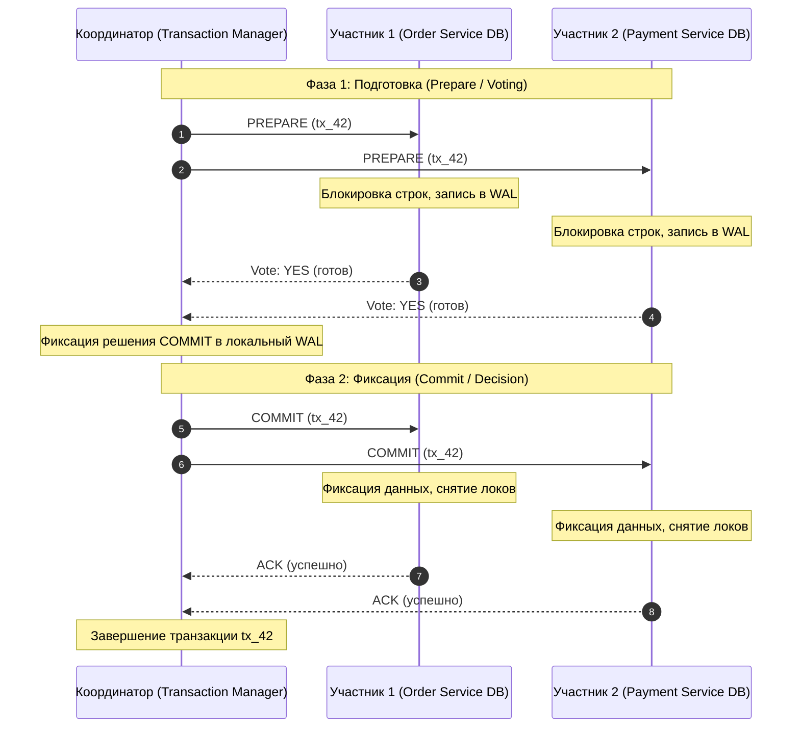

## Почему распределённые транзакции — это трудно

В рамках одного монолитного процесса и изолированной реляционной базы данных понятие транзакции (ACID) давно перешло в разряд решённых инженерных задач. Вы открываете `sql.Tx`, выполняете серию операций `INSERT` или `UPDATE`, вызываете `tx.Commit()`, и движок СУБД берёт всю заботу о свойствах атомарности, согласованности, изоляции и долговечности на себя благодаря журналу опережающей записи (WAL, Write-Ahead Log) и механизму многоверсионности (MVCC).

Но стоит архитектуре шагнуть в мир микросервисов, где каждый сервис суверенно владеет собственной базой данных (Database-per-Service), как надёжный монолитный фундамент мгновенно рассыпается. Бизнес-операция, требующая одновременного списания денег со счёта, резервирования товара на складе и генерации фискального чека, больше не может быть обёрнута в один локальный `BEGIN ... COMMIT`. Сеть ненадежна, пакеты задерживаются, процессы падают в непредсказуемый момент времени. Возникает потребность в **распределённых транзакциях** — алгоритмических протоколах, гарантирующих атомарность операций над узлами, не разделяющими общую память и дисковый накопитель.

В этой главе мы до мельчайших винтиков разберём классический протокол **Two-Phase Commit (2PC)**, вскроем его фундаментальные физические ограничения, исследуем его влияние на рантайм Go и пулы соединений реляционных СУБД, а также выясним, почему индустрия практически единодушно отказалась от него в пользу Саг ([[26. Saga Pattern. Оркестрация и хореография]]) и модели Eventual Consistency.

---

### Что такое распределённая транзакция

**Распределённая транзакция** — это совокупность операций над данными, физически расположенными на различных сетевых узлах (серверах, шардах, независимых базах данных), которая с точки зрения внешнего клиента должна обладать свойством **атомарности**: либо все узлы успешно и согласованно фиксируют свои изменения, либо в случае сбоя хотя бы на одном узле система целиком возвращается в исходное состояние, не оставляя частичных («грязных») результатов.

Классический академический пример — межбанковский перевод:
1. Банк $A$ обязан списать 10 000 рублей со счёта Алисы.
2. Банк $B$ обязан зачислить 10 000 рублей на счёт Боба.

Если после первого шага в дата-центре Банка $A$ экскаватор перерубает оптический кабель, деньги Алисы не должны раствориться в воздухе. Либо обе операции становятся персистентной реальностью, либо ни одна.

В теории распределённых систем для координации такого консенсуса исторически применяется протокол **Two-Phase Commit (2PC)**, формализованный Джимом Греем (Jim Gray) в конце 1970-х годов.

---

### Two-Phase Commit: как он работает

Протокол 2PC разделяет систему на две роли:
1. **Координатор (Coordinator)** — выделенный узел или сервис, руководящий жизненным циклом распределённой транзакции и принимающий вердикты.
2. **Участники (Participants / Cohorts)** — сервисы или узлы баз данных, непосредственно модифицирующие свои локальные таблицы.

Процесс согласования разбит на два строгих раунда сетевого взаимодействия:



#### Фаза 1 — Подготовка (Prepare / Voting)
1. Координатор присваивает распределённой транзакции глобальный уникальный идентификатор `Global Transaction ID (GID)`.
2. Координатор рассылает всем участникам сообщение `Prepare`.
3. Каждый участник открывает локальную транзакцию, выполняет запрошенные изменения (например, резервирует баланс), **захватывает необходимые блокировки строк** в базе данных, сбрасывает изменения в свой локальный Write-Ahead Log (WAL) для гарантии персистентности, но **не выполняет окончательный коммит**.
4. Участник голосует:
   - `Vote: YES` — ресурсы заблокированы, изменения в логе, гарантия успешного коммита составляет 100%, даже если сервер будет перезагружен по питанию.
   - `Vote: NO` — произошла ошибка (недостаточно средств, конфликт уникальности, дедлок). Участник немедленно откатывает свою локальную транзакцию и освобождает блокировки.

#### Фаза 2 — Фиксация (Commit / Decision)
1. **Сценарий успеха:** Если **все** участники без исключения ответили `Vote: YES`, Координатор делает персистентную запись `COMMIT` в свой собственный WAL и отправляет команду `Commit` всем участникам. Получив команду, участники окончательно фиксируют изменения в СУБД, снимают блокировки строк и отвечают подтверждением `ACK`.
2. **Сценарий отказа:** Если **хотя бы один** участник проголосовал `Vote: NO` или не ответил за отведённый таймаут, Координатор записывает `ABORT` в свой лог и рассылает команду `Rollback` всем участникам, ответившим `YES`. Участники откатывают подготовленные изменения и снимают локи.

> [!info] Под капотом
> Почему Координатор обязан писать свои решения в собственный дисковый WAL до отправки сетевых команд?  
> Представьте: Координатор собрал все ответы `YES`, решил делать `COMMIT`, отправил команду Участнику 1, и в этот момент на узле Координатора сгорел блок питания. Участник 1 уже закоммитил данные. Когда Координатор перезагрузится, он обязан прочитать свой лог, обнаружить недоделанный `COMMIT` для `tx_42` и дослать команду Участнику 2. Если бы решения не было в логе, система оказалась бы в разорванном, неконсистентном состоянии.  
> Но именно из-за того, что участник, ответивший `YES`, **обязан** ждать решения Координатора, возникает фатальный дефект 2PC — неопределённое время блокировки.

---

### Фундаментальные проблемы 2PC

В распределённых средах с независимыми микросервисами двухфазный коммит превращается из гаранта надёжности в главный источник системных аварий.

#### 1. Блокирующая природа и недоступность

2PC является **строго блокирующим протоколом**. Взгляните на временной отрезок между отправкой голоса `YES` на Фазе 1 и получением команды `COMMIT/ROLLBACK` на Фазе 2:

```
[Участник: Prepare] ---> Vote: YES ---> [Состояние IN-DOUBT] ---> Получение Commit
                                        ^^^^^^^^^^^^^^^^^^^^
                                     Участник НЕ ИМЕЕТ ПРАВА
                                     ни закоммитить, ни откатить!
```

В состоянии **`in-doubt`** (неопределённости) участник загнан в ловушку:
- Он не может самостоятельно закоммитить данные, так как другой участник мог ответить `NO`, и система требует отката.
- Он не может самостоятельно откатить данные, так как все остальные могли ответить `YES`, и Координатор уже отправил им команду `COMMIT`.

Если Координатор аварийно завершил работу или между ним и участником произошёл сетевой разрыв (Network Partition), участник остаётся в подвешенном состоянии. **Все эксклюзивные блокировки строк в базе данных удерживаются indefinitely.** Ни одна другая транзакция в системе не может прочитать заблокированные строки для записи или модифицировать их. Это прямое, катастрофическое крушение свойства **доступности (Availability)** по теореме CAP ([[30. CAP теорема и реальные компромиссы]]).

#### 2. Единая точка отказа

Координатор выступает классической единой точкой отказа (Single Point of Failure, SPOF). Если узел координатора уничтожен физически без возможности восстановления дискового WAL, администраторам баз данных приходится вручную опрашивать логи всех участников и принимать решение о ручном разблокировании транзакций.

Попытка защитить Координатора путём репликации его лога через алгоритмы распределённого консенсуса (Raft или Multi-Paxos) устраняет потерю узла, но не решает проблему изоляции участника при сетевом разделении сети (Split-Brain).

#### 3. Задержки и производительность

В 2PC латентность транзакции равна сумме сетевых RTT (Round-Trip Time) и времени дисковых `fsync` на всех узлах:
$$	ext{Latency} \ge 2 	imes 	ext{RTT}_{	ext{network}} + 2 	imes 	ext{Time}_{	ext{disk fsync}}$$

Каждая распределённая транзакция требует минимум двух последовательных сетевых раундов:
1. `Prepare` $	o$ `Vote`
2. `Commit` $	o$ `ACK`

В течение всего этого времени ресурсы базы данных (буферы, блокировки строк, дескрипторы транзакций) остаются занятыми. Пропускная способность СУБД падает на порядки. В масштабе современной высоконагруженной Go-системы с десятками тысяч запросов в секунду 2PC превращается в тромб, мгновенно исчерпывающий пулы соединений.

#### 4. Проблема с долгими транзакциями

Если бизнес-транзакция включает в себя шаги, зависящие от человеческого фактора (например, 3D-Secure авторизация платежа в банковском приложении, занимающая от 10 секунд до 2 минут), удерживать физические блокировки строк в PostgreSQL или MySQL категорически невозможно. Пул соединений будет исчерпан за доли секунды, вызвав каскадный отказ всей системы.

---

### Mechanical Sympathy: 2PC и Go

Давайте спустимся на уровень кода и проанализируем, как наивная попытка реализовать координатор 2PC на языке Go сталкивается с жестокой реальностью операционной системы, сетевого стека и рантайма.

#### Координатор транзакций на Go

```go
package main

import (
	"context"
	"errors"
	"fmt"
	"log"
	"sync"
	"time"
)

type Vote int

const (
	VoteUnknown Vote = iota
	VoteYes
	VoteNo
)

type Participant interface {
	ID() string
	Prepare(ctx context.Context, txID string) (Vote, error)
	Commit(ctx context.Context, txID string) error
	Rollback(ctx context.Context, txID string) error
}

type Coordinator struct {
	participants []Participant
	logger       *WALJournal // Персистентный журнал предзаписи на диске
}

func NewCoordinator(participants []Participant, journal *WALJournal) *Coordinator {
	return &Coordinator{
		participants: participants,
		logger:       journal,
	}
}

func (c *Coordinator) ExecuteTransaction(ctx context.Context, txID string) error {
	// 1. Запись намерения в дисковый лог Координатора
	if err := c.logger.Append(txID, "START"); err != nil {
		return fmt.Errorf("failed to write WAL start: %w", err)
	}

	// -------------------------------------------------------------
	// ФАЗА 1: Prepare (Параллельный опрос участников)
	// -------------------------------------------------------------
	type voteResult struct {
		participant Participant
		vote        Vote
		err         error
	}

	votesChan := make(chan voteResult, len(c.participants))
	var wg sync.WaitGroup

	prepareCtx, cancelPrepare := context.WithTimeout(ctx, 3*time.Second)
	defer cancelPrepare()

	for _, p := range c.participants {
		wg.Add(1)
		go func(part Participant) {
			defer wg.Done()
			vote, err := part.Prepare(prepareCtx, txID)
			votesChan <- voteResult{participant: part, vote: vote, err: err}
		}(p)
	}

	wg.Wait()
	close(votesChan)

	allYes := true
	for res := range votesChan {
		if res.err != nil || res.vote != VoteYes {
			allYes = false
			log.Printf("[2PC Coordinator] Участник %s ответил NO или ошибка: %v", res.participant.ID(), res.err)
			break
		}
	}

	// -------------------------------------------------------------
	// ФАЗА 2: Decision & Commit/Rollback
	// -------------------------------------------------------------
	if !allYes {
		// Решение: ABORT
		_ = c.logger.Append(txID, "ABORT")
		c.rollbackAll(context.Background(), txID)
		return errors.New("distributed transaction aborted during prepare phase")
	}

	// Решение: COMMIT (критическая точка невозврата!)
	if err := c.logger.Append(txID, "COMMIT"); err != nil {
		// Сбой записи вердикта: обязаны откатывать
		c.rollbackAll(context.Background(), txID)
		return fmt.Errorf("failed to persist commit decision: %w", err)
	}

	// Рассылка Commit участникам
	var commitErrors []error
	for _, p := range c.participants {
		// Фаза Commit не может быть отменена обычным таймаутом!
		if err := p.Commit(context.Background(), txID); err != nil {
			log.Printf("ALERT: Сбой фиксации коммита на участнике %s: %v", p.ID(), err)
			commitErrors = append(commitErrors, err)
		}
	}

	if len(commitErrors) > 0 {
		// Катастрофическое состояние: частичный коммит (inconsistent state)
		return fmt.Errorf("transaction committed partially; manual recovery required")
	}

	_ = c.logger.Append(txID, "COMPLETED")
	return nil
}

func (c *Coordinator) rollbackAll(ctx context.Context, txID string) {
	for _, p := range c.participants {
		_ = p.Rollback(ctx, txID)
	}
}

type WALJournal struct{}

func (w *WALJournal) Append(txID, state string) error {
	// Синхронная запись на диск с вызовом fsync
	return nil
}
```

> [!warning] Ловушка / Gotcha
> Обратите внимание на строку 104: если на фазе `Commit` один участник успешно закоммитил изменения, а сетевой сокет ко второму участнику разорвался, вы **больше не можете выполнить откат**!  
> Первый сервис уже опубликовал изменения во внешнем мире, баланс списан. Вызов простого `log.Fatal` или возврат ошибки клиенту оставляет распределённую систему в разорванном, рассогласованном состоянии. Без автономного процесса повторов (`retry daemon`) и системы ручной реконсиляции бизнес потеряет деньги.

#### Нагрузка на рантайм Go и системный пул соединений

Что происходит «под капотом» Linux и рантайма Go, когда система выполняет 2 000 таких распределённых транзакций одновременно?

1. **Исчерпание пула `database/sql` (`SetMaxOpenConns`)**:  
   На каждом сервисе-участнике открывается локальная транзакция. Пока координатор опрашивает остальных участников через сеть, соединение из пула базы данных удерживается горутиной. При дефолтном пуле в 50–100 соединений уже 100 одновременных распределённых транзакций с задержкой сети в 200 мс полностью парализуют сервис. Новые входящие HTTP/gRPC запросы зависают в очереди ожидания свободного коннекта к БД.
2. **Накладные расходы памяти на горутины**:  
   Каждая подвисшая в ожидании сеть/диск горутина потребляет минимум 2–4 КБ стека плюс системные структуры планировщика. Десятки тысяч заблокированных горутин увеличивают рабочий набор памяти (RSS) и заставляют Garbage Collector тратить драгоценные такты на сканирование их стеков при проверке барьеров записи.
3. **Блокировки в ядре PostgreSQL (`PREPARE TRANSACTION`)**:  
   PostgreSQL имеет встроенную поддержку 2PC через команды SQL:
   ```sql
   PREPARE TRANSACTION 'tx_42_payment';
   -- Позже:
   COMMIT PREPARED 'tx_42_payment';
   -- Или:
   ROLLBACK PREPARED 'tx_42_payment';
   ```
   Когда выполняется `PREPARE TRANSACTION`, транзакция отвязывается от клиентской сессии и персистентно сохраняется в системном каталоге и на диске в директории `pg_twophase/`.  
   **Опасность:** Подготовленная транзакция удерживает все блокировки строк (`ExclusiveLock`) и блокирует продвижение минимального идентификатора транзакции (`OldestXmin`). Это препятствует работе фонового процесса очистки **VACUUM**. Таблицы базы данных начинают стремительно раздуваться (Table Bloat), а чтение деградирует из-за миллионов неудалённых «мёртвых» строк (dead tuples).

---

### Почему 2PC редко применяется в микросервисах

Современное микросервисное сообщество и индустрия распределённых платформ на Go практически полностью отказались от использования двухфазного коммита между сервисами по фундаментальным архитектурным причинам:

1. **Жёсткое связывание во времени (Temporal Coupling)**:  
   Для успешного выполнения операции все участники транзакции и сеть между ними обязаны быть одновременно доступны в одну и ту же миллисекунду. Если в цепочке из 5 сервисов доступность каждого составляет 99.9%, общая доступность транзакции падает:
   $$A_{	ext{total}} = 0.999^5 pprox 99.5\%$$
   Система становится хрупкой: падение одного вспомогательного сервиса останавливает всю бизнес-цепочку.
2. **Нарушение автономии сервисов (Leaky Abstractions)**:  
   Участники вынуждены отдавать управление своими локальными ресурсами и блокировками внешнему координатору. Это ломает изоляцию границ предметных контекстов (Bounded Contexts).
3. **Проблемы горизонтального масштабирования**:  
   Удерживаемые локи вызывают очереди и конкуренцию на строках базы данных. Время ожидания блокировок растёт экспоненциально при увеличении числа инстансов сервиса.

---

### Альтернативы 2PC

Осознав ограничения 2PC, индустрия выработала прагматичные паттерны, гарантирующие согласованность в конечном счёте (Eventual Consistency) без распределённых блокировок.

```mermaid
flowchart TD
    classDef process  fill:#1e293b,stroke:#38bdf8,stroke-width:1px,color:#f8fafc
    classDef success  fill:#064e3b,stroke:#34d399,stroke-width:1px,color:#f8fafc
    classDef error    fill:#7f1d1d,stroke:#f87171,stroke-width:1px,color:#f8fafc
    classDef warning  fill:#78350f,stroke:#fbbf24,stroke-width:1px,color:#f8fafc
    classDef entry    fill:#1e3a5f,stroke:#38bdf8,stroke-width:2px,color:#f8fafc
    classDef aux      fill:#334155,stroke:#64748b,stroke-width:1px,color:#f8fafc
    classDef system   fill:#312e81,stroke:#a78bfa,stroke-width:1px,color:#f8fafc
    classDef data     fill:#132d29,stroke:#2dd4bf,stroke-width:1px,color:#f8fafc
    classDef network  fill:#881337,stroke:#fb7185,stroke-width:1px,color:#f8fafc
    classDef accent   fill:#1e1b4b,stroke:#818cf8,stroke-width:1px,color:#f8fafc
    subgraph SAGA["Паттерн Saga"]
        S1["Шаг 1: Локальная Tx (Order):::process"] -->|Event: OrderCreated| S2["Шаг 2: Локальная Tx (Payment)"]
        S2 -->|Сбой: NoMoney| C1["Компенсация 1: Отмена заказа"]
    end

    subgraph OUTBOX["Паттерн Outbox"]
        O1["Бизнес-таблица"] -.->|Одна локальная Tx| O2["Таблица outbox"]
        O2 -->|Фоновый Relay| O3["Брокер сообщений (Kafka)"]
    end

    subgraph IDEMPOTENT["Идемпотентный приёмник"]
        I1["Входящее событие"]:::warning --> I2{"Обработано ранее? (Redis/SQL)"}
        I2 -- Да --> I3["Пропуск (No-Op)"]
        I2 -- Нет --> I4["Исполнение логики"]
    end
```



#### 1. Saga (Хореография или Оркестрация)
Вместо одной гигантской распределённой транзакции бизнес-процесс разбивается на цепочку **независимых локальных транзакций**:
- Каждый сервис вносит изменения в свою базу данных и фиксирует локальную транзакцию немедленно.
- После фиксации публикуется доменное событие.
- Следующий сервис слушает событие и запускает свою локальную транзакцию.
- Если на каком-то шаге происходит бизнес-сбой (например, нет денег на карте), запускается обратная цепочка **компенсирующих транзакций** (Compensating Transactions), отменяющих эффект предыдущих шагов (подробно см. [[26. Saga Pattern. Оркестрация и хореография]]).
- **Плюс:** Никаких распределённых локов, время удержания транзакции минимально, максимальная доступность.

#### 2. Outbox Pattern
Решает классическую проблему «двойной записи» (Dual-Write): как гарантированно обновить базу данных и отправить событие в Kafka без 2PC?
- В пределах **одной локальной ACID-транзакции** сервис изменяет бизнес-таблицу (например, `orders`) и вставляет запись о событии в таблицу `outbox`.
- Отдельный фоновый процесс (Debezium CDC или легковесный Go-воркер) вычитывает строки из `outbox` и гарантированно доставляет их в брокер сообщений.
- Никакой магии и никаких распределённых протоколов — только локальный WAL СУБД.

#### 3. Idempotent Receiver (Идемпотентный приёмник)
Поскольку сетевые транспорты обеспечивают гарантию доставки `at-least-once` (как минимум один раз), дубликаты неизбежны. Проектирование обработчиков событий как идемпотентных операций устраняет необходимость в строгой синхронизации: повторное событие просто отбрасывается без побочных эффектов (см. [[27. Idempotency и exactly once семантика]]).

---

### Когда 2PC всё же оправдан

Несмотря на критику в контексте микросервисов, протокол 2PC не умер. Он остаётся фундаментальным строительным блоком в узкоспециализированных нишах:

1. **Распределённые СУБД (NewSQL)**:  
   Движки вроде **CockroachDB**, **Google Spanner** и **YugabyteDB** используют 2PC под капотом для обеспечения межосколочных (cross-shard / cross-range) транзакций. Однако там 2PC комбинируется с алгоритмами консенсуса: каждый участник транзакции — это не отдельный микросервис, а отказоустойчивая Raft/Paxos-группа, синхронизированная по аппаратному времени (TrueTime API или Hybrid Logical Clocks).
2. **Внутренние шардированные кластеры СУБД**:  
   Когда одна логическая база данных шардирована по узлам внутри одного физического дата-центра с ультранизким сетевым пингом ($<0.5$ мс) и надёжным оптоволокном, механизмы PostgreSQL `PREPARE TRANSACTION` обеспечивают надёжную координацию данных.
3. **Стандарт XA и legacy-интеграции**:  
   В корпоративных монолитных системах (Java EE, WebLogic, Tuxedo, Oracle RAC) спецификация **XA** десятилетиями координировала транзакции между базой данных и очередью сообщений (JMS). В экосистеме Go существуют узкоспециализированные порты вроде `go-xa`, но в современных проектах их внедрение считается антипаттерном.

---

> [!tip] Собеседование
> **Вопрос:** Что такое протокол Two-Phase Commit (2PC), в чём заключается его фундаментальный недостаток, и почему его избегают в архитектуре микросервисов?
> 
> **Ответ:**  
> 2PC — это синхронный протокол достижения консенсуса распределённой транзакции, состоящий из двух раундов: фазы голосования (`Prepare`) и фазы фиксации (`Commit`).  
> Его главный фундаментальный недостаток — **блокирующая природа**: участник, ответивший `YES` на первом шаге, переходит в состояние `in-doubt` и не имеет права самостоятельно снять блокировки или завершить транзакцию до ответа координатора.  
> Если координатор выходит из строя или сеть рвётся, ресурсы БД зависают заблокированными на неопределённый срок, что уничтожает доступность (Availability) всей системы. Кроме того, 2PC навязывает колоссальные сетевые задержки (минимум 2 RTT), быстро исчерпывает пулы соединений СУБД и приводит к раздуванию таблиц (Table Bloat в PostgreSQL из-за зависшего `OldestXmin`).  
> В микросервисах вместо 2PC используют паттерн **Saga** на базе локальных транзакций с компенсирующими действиями и гарантию Eventual Consistency.

---

### Итог

Two-Phase Commit — это гениальный математический артефакт своей эпохи, призванный симулировать монолитный ACID в распределённой среде. Однако законы физики неумолимы: попытка удержать иллюзию абсолютной одновременности на ненадежных сетевых кабелях оплачивается блокировками, потерянной доступностью и катастрофическим падением производительности.

Грамотный бэкенд-архитектор не пытается навязать распределённой системе иллюзию единого монолитного времени. Вместо удержания локов мы принимаем асинхронную природу мира и передаём эстафету паттерну Сага.

В следующей главе мы детально изучим обе ипостаси этого паттерна — хореографию и оркестрацию: [[26. Saga Pattern. Оркестрация и хореография]].
