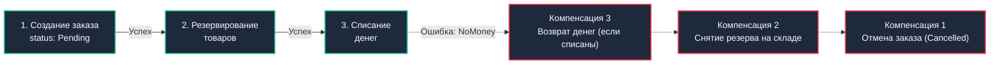
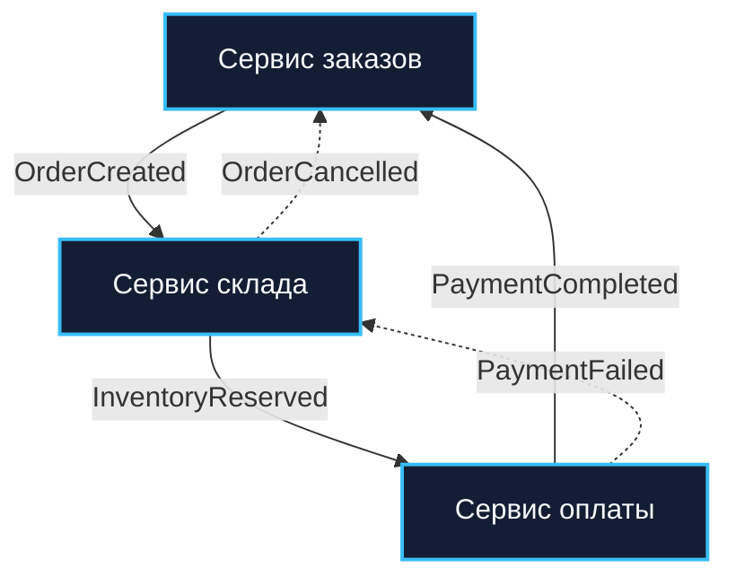

## Saga: распределённые транзакции без блокировок

В предыдущей главе мы убедились, что классический Two-Phase Commit (2PC) в мире независимых микросервисов — это опасная иллюзия. Попытка навязать распределённой системе распределённые блокировки приводит к состоянию `in-doubt`, исчерпанию пулов соединений в PostgreSQL и лавинообразному падению доступности. Современные высоконагруженные системы на Go требуют кардинально иной ментальной модели: модели, которая принимает неизбежность сетевых задержек, не удерживает процессорные ядра и соединения СУБД в заложниках и обеспечивает согласованность в конечном счёте (Eventual Consistency).

Таким фундаментом индустрии стал **паттерн Saga**, впервые описанный Гектором Гарсия-Молиной (Hector Garcia-Molina) и Кеннетом Салемом (Kenneth Salem) ещё в 1987 году для управления долгими транзакциями (Long-Lived Transactions) в мейнфреймах.

**Saga** — это механизм управления распределёнными транзакциями, который разбивает единую глобальную операцию на цепочку независимых **локальных ACID-транзакций**. Каждый шаг выполняется изолированно в границах своего сервиса и немедленно фиксирует изменения в своей базе данных. Если какой-либо шаг бизнес-процесса терпит неудачу, Saga запускает цепочку **компенсирующих транзакций** (Compensating Transactions), которые в обратном порядке ликвидируют последствия ранее зафиксированных шагов.

---

### Как работает Saga

Представьте жизненный сценарий покупки авиабилета с бронированием отеля:
1. Вы бронируете рейс в авиакомпании (деньги списаны, место зарезервировано).
2. Вы пытаетесь забронировать номер в отеле, но свободных номеров нет.

В мире 2PC авиакомпания держала бы блокировку на самолётном кресле и вашем банковском счёте всё время, пока отель проверяет свои свободные номера. В реальной жизни авиакомпания моментально продаёт вам билет, а при отказе отеля запускается **компенсирующее действие** — возврат билета с начислением денег обратно на карту.

В контексте интернет-магазина процесс выглядит следующим образом:
1. **Шаг 1 (Сервис заказов):** Создаёт заказ в статусе `Pending` и фиксирует локальную транзакцию в PostgreSQL.
2. **Шаг 2 (Сервис склада):** Резервирует товарные позиции на складе.
3. **Шаг 3 (Сервис оплаты):** Пытается списать средства с платёжного шлюза.

Если на третьем шаге платёж отклонён банком, система выполняет откат через компенсацию:



#### Проблема отсутствия изоляции (ACID Isolation)

Главная архитектурная плата за отказ от распределённых блокировок — **полная потеря изоляции (буквы I в ACID)**.  
Поскольку локальные транзакции коммитятся немедленно, промежуточные состояния системы становятся видимыми внешнему миру:
- Клиент может увидеть в мобильном приложении статус заказа «Оплачено», хотя через секунду операция отменится из-за сбоя склада.
- Другая горутина может прочитать остатки на складе, которые через мгновение будут возвращены компенсацией.

В теории распределённых систем для борьбы с этой аномалией применяются **семантические блокировки (Semantic Locks)**: сущность помечается статусом ожидания (`order_status = 'PENDING'`), что сигнализирует другим процессам о незавершённой саге и запрещает опасные параллельные операции.

---

### Два стиля координации

Существуют два диаметрально противоположных подхода к управлению сагами: **децентрализованная хореография** и **централизованная оркестрация**.

---

#### Хореография (Choreography)

В хореографии отсутствует единый дирижёр. Сервисы общаются между собой исключительно через публикацию и прослушивание доменных событий в брокере сообщений (Kafka, RabbitMQ, NATS JetStream). Завершив локальную транзакцию, сервис выбрасывает событие в шину. Заинтересованные сервисы реагируют на него, выполняют свои локальные действия и выбрасывают новые события.



##### Реализация хореографии на Go

```go
package choreography

import (
	"context"
	"encoding/json"
	"fmt"
	"log"
)

// Доменные события
type OrderCreated struct {
	OrderID string   `json:"order_id"`
	Items   []string `json:"items"`
	Amount  int64    `json:"amount"`
}

type InventoryReserved struct {
	OrderID string `json:"order_id"`
}

type ReservationFailed struct {
	OrderID string `json:"order_id"`
	Reason  string `json:"reason"`
}

type PaymentCompleted struct {
	OrderID string `json:"order_id"`
}

type PaymentFailed struct {
	OrderID string `json:"order_id"`
	Reason  string `json:"reason"`
}

// EventBus — абстракция брокера сообщений
type EventBus interface {
	Publish(ctx context.Context, topic string, event any) error
}

// Сервис заказов (OrderService)
type OrderService struct {
	eventBus EventBus
}

func (s *OrderService) CreateOrder(ctx context.Context, orderID string, items []string, amount int64) error {
	// 1. Локальная транзакция в SQL
	log.Printf("[OrderService] Создан заказ %s в статусе PENDING", orderID)

	// 2. Публикация события (желательно через Outbox!)
	ev := OrderCreated{OrderID: orderID, Items: items, Amount: amount}
	return s.eventBus.Publish(ctx, "orders.created", ev)
}

// Сервис склада (InventoryService) подписан на "orders.created"
type InventoryService struct {
	eventBus EventBus
}

func (s *InventoryService) OnOrderCreated(ctx context.Context, payload []byte) error {
	var ev OrderCreated
	if err := json.Unmarshal(payload, &ev); err != nil {
		return err
	}

	// Попытка зарезервировать товар на складе
	if err := s.reserveStock(ev.Items); err != nil {
		log.Printf("[InventoryService] Недостаточно товара для заказа %s: %v", ev.OrderID, err)
		return s.eventBus.Publish(ctx, "inventory.failed", ReservationFailed{
			OrderID: ev.OrderID,
			Reason:  err.Error(),
		})
	}

	log.Printf("[InventoryService] Товар успешно зарезервирован для заказа %s", ev.OrderID)
	return s.eventBus.Publish(ctx, "inventory.reserved", InventoryReserved{OrderID: ev.OrderID})
}

func (s *InventoryService) reserveStock(items []string) error {
	// Логика проверки остатков
	return nil
}

// Сервис оплаты (PaymentService) подписан на "inventory.reserved"
type PaymentService struct {
	eventBus EventBus
}

func (s *PaymentService) OnInventoryReserved(ctx context.Context, payload []byte) error {
	var ev InventoryReserved
	if err := json.Unmarshal(payload, &ev); err != nil {
		return err
	}

	// Списание средств
	if err := s.chargeCard(ev.OrderID); err != nil {
		log.Printf("[PaymentService] Сбой списания денег для заказа %s: %v", ev.OrderID, err)
		return s.eventBus.Publish(ctx, "payment.failed", PaymentFailed{
			OrderID: ev.OrderID,
			Reason:  err.Error(),
		})
	}

	log.Printf("[PaymentService] Оплата заказа %s успешно проведена", ev.OrderID)
	return s.eventBus.Publish(ctx, "payment.completed", PaymentCompleted{OrderID: ev.OrderID})
}

func (s *PaymentService) chargeCard(orderID string) error {
	return nil
}
```

**Плюсы хореографии:**
- **Слабая связность**: Сервисы не вызывают друг друга напрямую и не знают о внутренней реализации соседей.
- **Высокая автономность**: Каждый сервис можно разрабатывать, релизить и масштабировать независимо.

**Минусы хореографии:**
- **«Размытая» логика процесса**: Полный граф бизнес-процесса не описан нигде в кодовой базе. Понять, кто и как реагирует на сбой оплаты, можно лишь изучая конфиги подписок десятка репозиториев.
- **Риск циклических зависимостей**: Сервис $A$ слушает сервис $B$, который реагирует на событие сервиса $C$, вызывающее событие в $A$. Возникает бесконечный распределённый шторм сообщений.
- **Сложность тестирования и трассировки**: Требуется обязательное внедрение распределённого трейсинга OpenTelemetry.

---

#### Оркестрация (Orchestration)

В оркестрации появляется выделенный координатор — **Оркестратор Саги (Saga Orchestrator)**. Это сервис (или поток выполнения внутри инициирующего сервиса), который централизованно хранит стейт-машину процесса, последовательно отправляет сервисам-исполнителям **команды** (через gRPC или персональные очереди команд) и ожидает синхронные ответы либо события подтверждения.

```mermaid
flowchart TD
    Orchestrator["Оркестратор Saga<br>(State Machine в PostgreSQL)"]
    
    Orchestrator -->|"1. CreateOrder"| Order["Сервис заказов"]
    Order -->|"OK (order_id)"| Orchestrator
    
    Orchestrator -->|"2. ReserveInventory"| Inventory["Сервис склада"]
    Inventory -->|"OK"| Orchestrator
    
    Orchestrator -->|"3. ChargePayment"| Payment["Сервис оплаты"]
    Payment -->|"FAIL: Insufficient Funds"| Orchestrator
    
    Note over Orchestrator: Старт обратной цепочки компенсаций
    Orchestrator -.->|"4. CancelReservation"| Inventory
    Orchestrator -.->|"5. CancelOrder"| Order

    classDef orch fill:#1e1b4b,stroke:#818cf8,stroke-width:2px,color:#f8fafc;
    classDef svc fill:#131d33,stroke:#38bdf8,stroke-width:2px,color:#f8fafc;
    class Orchestrator orch;
    class Order,Inventory,Payment svc;
```

##### Реализация оркестратора на Go

```go
package orchestration

import (
	"context"
	"fmt"
	"log"

	"github.com/google/uuid"
)

type CreateOrder struct {
	Items  []string
	Amount int64
}

type OrderService interface {
	Create(ctx context.Context, cmd CreateOrder) (string, error)
	Cancel(ctx context.Context, orderID string) error
}

type InventoryService interface {
	Reserve(ctx context.Context, orderID string, items []string) error
	Release(ctx context.Context, orderID string) error
}

type PaymentService interface {
	Charge(ctx context.Context, orderID string, amount int64) error
}

type SagaStore interface {
	Save(ctx context.Context, saga SagaInstance) error
	Update(ctx context.Context, saga SagaInstance) error
}

type SagaInstance struct {
	ID      uuid.UUID
	OrderID string
	Step    string
	Status  string
}

type SagaOrchestrator struct {
	orderSvc     OrderService
	inventorySvc InventoryService
	paymentSvc   PaymentService
	sagaStore    SagaStore
}

func NewSagaOrchestrator(o OrderService, i InventoryService, p PaymentService, store SagaStore) *SagaOrchestrator {
	return &SagaOrchestrator{
		orderSvc:     o,
		inventorySvc: i,
		paymentSvc:   p,
		sagaStore:    store,
	}
}

func (o *SagaOrchestrator) CreateOrderSaga(ctx context.Context, cmd CreateOrder) error {
	saga := SagaInstance{
		ID:     uuid.New(),
		Status: "RUNNING",
	}

	// -------------------------------------------------------------
	// ШАГ 1: Создание заказа
	// -------------------------------------------------------------
	orderID, err := o.orderSvc.Create(ctx, cmd)
	if err != nil {
		return fmt.Errorf("step 1 failed: %w", err)
	}
	saga.OrderID = orderID
	saga.Step = "order_created"
	_ = o.sagaStore.Save(ctx, saga)

	// -------------------------------------------------------------
	// ШАГ 2: Резервирование товаров на складе
	// -------------------------------------------------------------
	err = o.inventorySvc.Reserve(ctx, orderID, cmd.Items)
	if err != nil {
		log.Printf("[Orchestrator] Склад ответил отказом. Компенсируем Шаг 1...")
		saga.Status = "COMPENSATING"
		_ = o.sagaStore.Update(ctx, saga)

		_ = o.orderSvc.Cancel(ctx, orderID) // Компенсация шага 1

		saga.Status = "FAILED"
		_ = o.sagaStore.Update(ctx, saga)
		return fmt.Errorf("inventory reservation failed: %w", err)
	}
	saga.Step = "inventory_reserved"
	_ = o.sagaStore.Update(ctx, saga)

	// -------------------------------------------------------------
	// ШАГ 3: Списание средств
	// -------------------------------------------------------------
	err = o.paymentSvc.Charge(ctx, orderID, cmd.Amount)
	if err != nil {
		log.Printf("[Orchestrator] Оплата отклонена. Запуск каскада компенсаций в обратном порядке...")
		saga.Status = "COMPENSATING"
		_ = o.sagaStore.Update(ctx, saga)

		// Компенсация в строгом обратном порядке:
		_ = o.inventorySvc.Release(ctx, orderID) // Компенсация шага 2
		_ = o.orderSvc.Cancel(ctx, orderID)      // Компенсация шага 1

		saga.Status = "FAILED"
		_ = o.sagaStore.Update(ctx, saga)
		return fmt.Errorf("payment charge failed: %w", err)
	}

	// Успешное завершение
	saga.Step = "completed"
	saga.Status = "SUCCESS"
	_ = o.sagaStore.Update(ctx, saga)
	return nil
}
```

**Плюсы оркестрации:**
- **Единый источник правды**: Вся стейт-машина шагов и компенсаций сосредоточена в одном месте. Код легко читать, инспектировать и покрывать интеграционными тестами.
- **Управление временем и таймаутами**: Оркестратор контролирует SLA каждого шага, перезапускает упавшие вызовы и централизованно отслеживает зависшие процессы.

**Минусы оркестрации:**
- **Риск превращения в God Object**: Опасность перегрузить оркестратор деталями бизнес-логики сервисов («умный оркестратор, глупые исполнители»).
- **Необходимость инфраструктуры состояния**: Требуется высоконадёжное хранилище для персистенции шагов стейт-машины.

---

### Mechanical Sympathy: Saga и Go

Посмотрим на саги с точки зрения потребления аппаратных ресурсов сервера, планировщика Go и операционной системы.

#### 1. Горутины и оркестратор: почему нельзя спать в оперативной памяти

Сага может длиться от 50 миллисекунд до нескольких дней (например, ожидание подтверждения курьерской доставки).  
Ни в коем случае нельзя реализовывать ожидание шагов саги через `time.Sleep` или подвисшие горутины в памяти процесса!

- Если подержать 100 000 горутин в ожидании подтверждения банковского шлюза в течение суток, это заморозит сотни мегабайт памяти в рантайме Go.
- Но главное: **рестарт пода Kubernetes или сбой ноды мгновенно сотрёт все эти горутины вместе со всем состоянием незавершённых саг.**

Настоящий production-grade оркестратор строится как **Stateless Worker**:
1. Каждый шаг сохраняет переход состояния в базу данных (PostgreSQL или Redis) с таймстемпом дедлайна.
2. Горутина завершает выполнение.
3. При наступлении внешнего события (webhook от банка) или срабатывании фонового таймера сервис вычитывает состояние из базы данных и передаёт его свободной горутине из пула.

```go
// Фоновый восстановитель зависших саг при старте сервиса
func (o *SagaOrchestrator) ResumePendingSagas(ctx context.Context) {
	sagas, err := o.sagaStore.FindPending(ctx)
	if err != nil {
		log.Printf("failed to find pending sagas: %v", err)
		return
	}
	for _, saga := range sagas {
		// Запуск восстановления в фоне с изоляцией паник
		go func(s SagaInstance) {
			defer func() {
				if r := recover(); r != nil {
					log.Printf("recovered from panic in resumeSaga: %v", r)
				}
			}()
			o.resumeSaga(ctx, s)
		}(saga)
	}
}

func (o *SagaOrchestrator) resumeSaga(ctx context.Context, saga SagaInstance) {
	// Доигрывание саги с прерванного шага
}
```

#### 2. GC и аллокации в событийной хореографии

В системах с интенсивным потоком событий в брокере (Kafka/NATS) вычитка сотен тысяч событий в секунду и их десериализация из JSON порождает гигантское число временных объектов в Heap.  
- Garbage Collector в Go начинает тратить процессорное время на фазы Mark & Sweep.
- **Оптимизация:** Использование протоколов Protobuf / FlatBuffers вместо JSON, переиспользование структур сообщений через `sync.Pool` и выравнивание структур данных по границам машинных слов (Struct Alignment).

#### 3. Сеть и системные вызовы

Каждый шаг Саги — это сетевой RPC-вызов (`sys_sendto`, `sys_recvfrom`, epoll) либо сетевое сообщение через брокер. Сетевые задержки складываются аддитивно. Чтобы минимизировать latency:
- Независимые прямые шаги саги (например, резервирование товара на складе и выписка электронного чека) можно запускать **параллельно** через `errgroup.Group`.
- Сетевые вызовы обязаны использовать мультиплексирование соединений (HTTP/2 в gRPC) и постоянные TCP Keep-Alive сокеты.

---

### Управление таймаутами и повторными попытками

Распределённая сага не может зависать навечно. Любой шаг обязан быть строго ограничен по времени с помощью механизма `context.WithTimeout` и `context.WithDeadline`.

```go
type StepFunc func(ctx context.Context) error

func (o *SagaOrchestrator) ExecuteStep(ctx context.Context, timeout time.Duration, step StepFunc) error {
	stepCtx, cancel := context.WithTimeout(ctx, timeout)
	defer cancel()

	errChan := make(chan error, 1)
	go func() {
		errChan <- step(stepCtx)
	}()

	select {
	case <-stepCtx.Done():
		return fmt.Errorf("step timed out: %w", stepCtx.Err())
	case err := <-errChan:
		return err
	}
}
```

Если шаг завершился с временной сетевой ошибкой (503 Service Unavailable, таймаут соединения), оркестратор обязан использовать повторные попытки с экспоненциальной задержкой и джиттером (Exponential Backoff with Jitter), чтобы не вызвать лавинообразную перегрузку удалённого сервиса (см. подробный разбор в [[36. Circuit Breaker, Retry, Timeout и Backoff]]).

---

### Идемпотентность и Exactly-Once

В саге сетевой сбой во время вызова компенсирующего действия — обыденная реальность. Если оркестратор отправил команду «Отменить заказ», а сетевой пакет подтверждения потерялся, оркестратор отправит команду повторно.

Отсюда следует жесткое железное правило: **любая компенсирующая и прямая транзакция в Саге обязана быть строго идемпотентной!**

- Повторный вызов `CancelOrder(orderID)` должен возвращать успешный ответ `200 OK`, если заказ уже отменён, а не падать с ошибкой `OrderAlreadyCancelledException`.
- Повторный возврат денег не должен приводить к двойному начислению средств на баланс клиента.
- Подробные архитектурные механизмы реализации идемпотентности через токены и уникальные ограничения в БД детально исследованы в главе [[27. Idempotency и exactly once семантика]].

---

### Хранение состояния Saga

Для персистентного хранения промежуточных состояний шагов саги при оркестрации применяются три проверенных подхода:

1. **Реляционная таблица в PostgreSQL / MySQL**:  
   Таблица `saga_instances` со столбцами `(saga_id, order_id, current_step, status, payload_json, updated_at)`. Простой, надёжный вариант для подавляющего большинства проектов.
2. **Специализированные движки State Machine**:  
   Использование платформ декларативного описания бизнес-процессов (Temporal.io, Cadence, AWS Step Functions).
3. **Event Store**:  
   Хранение истории переходов состояний саги в виде неизменяемой цепочки событий в рамках концепции Event Sourcing (см. [[24. Event Sourcing. Хранение событий вместо состояния]]).

---

### Temporal.io как продвинутая реализация Saga

В современной Go-экосистеме стандартом де-факто для оркестрации сложных долгоживущих саг стал фреймворк **Temporal** (развитие проекта Cadence, созданного инженерами Uber).

В Temporal разработчик пишет координацию распределённых шагов на чистом Go так, словно весь процесс выполняется локально на одном компьютере:

```go
package workflows

import (
	"time"

	"go.temporal.io/sdk/workflow"
)

// CreateOrderWorkflow — детерминированная функция Workflow
func CreateOrderWorkflow(ctx workflow.Context, cmd CreateOrder) (err error) {
	// Настройка политик повторов для Activities (шагов саги)
	ao := workflow.ActivityOptions{
		StartToCloseTimeout: 10 * time.Second,
	}
	ctx = workflow.WithActivityOptions(ctx, ao)

	var orderID string
	// Шаг 1: Создание заказа
	err = workflow.ExecuteActivity(ctx, CreateOrderActivity, cmd).Get(ctx, &orderID)
	if err != nil {
		return err
	}

	// Стек зарегистрированных компенсаций
	var compensations []func(workflow.Context)

	// Регистрируем компенсацию шага 1
	compensations = append(compensations, func(compCtx workflow.Context) {
		_ = workflow.ExecuteActivity(compCtx, CancelOrderActivity, orderID).Get(compCtx, nil)
	})

	defer func() {
		if err != nil {
			// Выполняем накопленные компенсации в отключенном контексте
			disconnectedCtx, _ := workflow.NewDisconnectedContext(ctx)
			for i := len(compensations) - 1; i >= 0; i-- {
				compensations[i](disconnectedCtx)
			}
		}
	}()

	// Шаг 2: Резервирование товара
	err = workflow.ExecuteActivity(ctx, ReserveInventoryActivity, orderID).Get(ctx, nil)
	if err != nil {
		return err // сработает defer и запустит отмену заказа
	}

	// Регистрируем компенсацию шага 2
	compensations = append(compensations, func(compCtx workflow.Context) {
		_ = workflow.ExecuteActivity(compCtx, ReleaseInventoryActivity, orderID).Get(compCtx, nil)
	})

	// Шаг 3: Списание средств
	err = workflow.ExecuteActivity(ctx, ChargePaymentActivity, orderID, cmd.Amount).Get(ctx, nil)
	if err != nil {
		return err // сработает defer и отменит склад + заказ
	}

	return nil
}
```

Temporal берёт на себя всю тяжелейшую инженерную рутину: сохранение журнала событий (Event History Replay), автоматический перезапуск упавших воркеров с сохранением стека переменных, распределённые таймеры на дни и недели и гарантированную доставку сигналов.

---

### Сравнение хореографии и оркестрации

| Архитектурный аспект | Хореография (Choreography) | Оркестрация (Orchestration) |
|---|---|---|
| **Степень связности (Coupling)** | Экстремально низкая; сервисы знают только о событиях шины | Средняя; оркестратор вызывает сервисы через команды gRPC/очереди |
| **Видимость бизнес-процесса** | Размыта по подпискам десятков сервисов; тяжело визуализировать | Сконцентрирована в одном кодовом файле / стейт-машине |
| **Сложность отладки** | Высокая; требует обязательного сквозного трейсинга OpenTelemetry | Низкая; стейт процесса и история шагов доступны в одном логе/UI |
| **Автономия команд разработки** | Высокая; команды модифицируют свои обработчики событий изолированно | Требует согласования контрактов команд с владельцем оркестратора |
| **Единая точка отказа** | Отсутствует (децентрализованный брокер Kafka/NATS) | Потенциальный SPOF (требуется персистентное хранилище и кластеризация) |
| **Эволюция бизнес-логики** | Затруднена при частых сменах шагов цепочки | Проста; шаги меняются редактированием кода оркестратора |
| **Применение в Go** | Фоновые consumer-воркеры брокеров сообщений | Temporal Go SDK, стейт-машины на PostgreSQL/Redis |

---

### Антипаттерны

1. **Слишком длинные Saga (Mega-Sagas)**:  
   Включение 15–20 шагов в единую сагу приводит к комбинаторному взрыву вероятности сбоев. Если на 18-м шаге происходит отказ, система тратит гигантские ресурсы на каскадный откат 17 предыдущих операций. Дробите макропроцессы на изолированные короткие подсаги с промежуточными асинхронными подтверждениями.
2. **Неполные или несимметричные компенсации**:  
   Компенсирующее действие обязано полностью нивелировать эффект прямого действия. Если прямой шаг отправил SMS клиенту «Ваш заказ оформлен», компенсирующий шаг обязан отправить «Заказ отменен из-за отсутствия оплаты», а не молча стирать запись из базы данных.
3. **Отсутствие идемпотентности**:  
   Повторное исполнение компенсации не должно приводить к дублированию побочных эффектов.
4. **Игнорирование таймаутов**:  
   Отсутствие жестких сроков выполнения шагов превращает Сагу в «вечно висящий зомби-процесс», блокирующий зарезервированные складские остатки.

---

> [!tip] Собеседование
> **Вопрос:** Какой стиль Saga вы выберете для корпоративной системы с 20 микросервисами, где регламенты и шаги бизнес-процессов меняются каждые две недели? Обоснуйте архитектурный выбор.
> 
> **Ответ:**  
> В таких условиях однозначно следует выбрать **оркестрацию** (оптимально — на базе Temporal.io):  
> 1. **Централизация изменчивой логики**: При наличии 20 сервисов хореография превращается в «архитектурное спагетти» событий. Изменение шага процесса потребует правок, тестирования и одновременного релиза сразу 4–5 независимых микросервисов. В оркестрации меняется лишь код одного Workflow в сервисе-координаторе.
> 2. **Наглядность и мониторинг**: Бизнес-аналитики и поддержка могут в реальном времени видеть, на каком шаге завис заказ конкретного клиента, изучая UI Temporal или таблицу стейт-машины.
> 3. **Готовые гарантии**: Temporal автоматически решает задачи персистенции, ретраев с Backoff, дедлайнов и восстановления после крешей нод, освобождая команду от написания самописных велосипедов.  
> Хореографию целесообразно использовать только для простых, стабильных цепочек из 2–3 шагов, не подверженных регулярным бизнес-изменениям.

---

### Итог

Паттерн Saga — это зрелый, прагматичный ответ индустрии на физические ограничения сетей и законы распределённых систем. Принимая отсутствие абсолютной изоляции ради доступности и масштабируемости, Сага позволяет безопасно координировать сложнейшие цепочки бизнес-операций.

Выбор между легковесной событийной хореографией и мощной централизованной оркестрацией зависит от динамики развития процессов в вашей компании. Но какой бы стиль вы ни избрали, устойчивость распределённой транзакции стоит на двух незыблемых китах: тайм-аутах и идемпотентности.

В следующей главе мы разберём механизмы обеспечения идемпотентности и тонкости реализации семантики «exactly-once»: [[27. Idempotency и exactly once семантика]].
