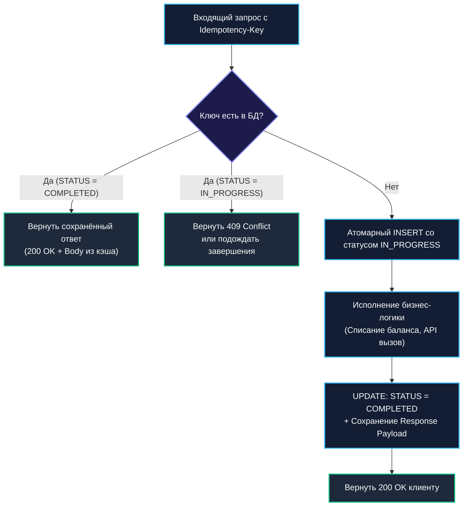

## Определение и важность

В реальном мире сетей и распределённых систем абсолютной надёжности не существует. Сетевой кабель может быть повреждён, Wi-Fi соединение смартфона может оборваться ровно в тот момент, когда сервер уже списал деньги, но ещё не успел отправить клиенту HTTP-ответ `200 OK`. Получив сетевой таймаут (`i/o timeout`), клиентский браузер, мобильное приложение или вышестоящий сервис неизбежно выполнит повторную попытку (retry).

Если сервер спроектирован наивно, повторный запрос приведёт к повторному списанию баланса. Чтобы этого не произошло, распределённая система обязана обладать свойством **идемпотентности**.

В математике унарная операция называется идемпотентной, если её повторное применение к результату не меняет значения:
$$f(f(x)) = f(x)$$

В архитектуре распределённых систем:  
**Идемпотентная операция** — это операция, которую можно безопасно выполнить один, два или тысячу раз с одними и теми же входными параметрами, при этом конечное состояние системы и возвращаемый клиенту результат будут строго идентичны первому успешному выполнению.

Физическая аналогия предельно проста: кнопка вызова лифта на этаже. Вы можете нажать её один раз, а можете нервно нажимать двадцать раз подряд — лифт всё равно получит один сигнал и приедет на ваш этаж ровно один раз. Напротив, автомат с газировкой, принимающий монеты без токена сессии, неидемпотентен: каждый бросок монеты изменяет баланс в прорези автомата.

В архитектуре современных Go-сервисов идемпотентность является базовым инженерным фундаментом для:
- **Обработчиков HTTP/gRPC**: защита от клиентских ретраев при сбоях сети и таймаутах.
- **Консьюмеров очередей и брокеров (Kafka, RabbitMQ, NATS)**: защита от дубликатов при семантике доставки `at-least-once`.
- **Оркестраторов распределённых транзакций (Saga)**: гарантированное безопасное повторение шагов и компенсаций ([[26. Saga Pattern. Оркестрация и хореография]]).
- **Хранилищ событий (Event Store)**: предотвращение дублирования записей в цепочке событий ([[24. Event Sourcing. Хранение событий вместо состояния]]).

---

### Exactly-Once семантика

В индустрии распределённых вычислений много спорят о так называемой гарантии **Exactly-Once Processing** (обработка ровно один раз).

По законам физики и теории распределённых систем (доказанной в парадоксе двух генералов), **невозможно гарантировать доставку сообщения по ненадежной сети ровно один раз** без риска потери сообщения. Поэтому, когда инженеры говорят об Exactly-Once, они имеют в виду **эффективную семантику exactly-once (Effective Exactly-Once)**: транспортная сеть доставляет сообщение как минимум один раз (`at-least-once`), но принимающая сторона (обработчик в Go) обладает свойством **идемпотентности**, нейтрализующим дубликаты.

| Семантика доставки | Описание и гарантии | Поведение при сбое сети | Пример в Go / Инфраструктуре |
|---|---|---|---|
| **At-most-once** (не более одного раза) | Сообщение отправляется без подтверждения. Возможна потеря данных, но дубликаты исключены. | При сбое сообщение теряется навсегда. | Запись в небуферизированный канал `channel <- msg` (без буфера, non-blocking), UDP-датаграммы, метрики StatsD. |
| **At-least-once** (как минимум один раз) | Отправитель ждёт подтверждения (ACK). При таймауте сообщение отправляется повторно. Потери исключены, но дубликаты неизбежны. | При сбое ACK сообщение доставляется повторно. | RabbitMQ (`autoAck=false`), Kafka (`acks=all`), HTTP-клиент с политикой `Retry`. |
| **Exactly-once** (эффективно ровно один раз) | Эффект от обработки сообщения применяется строго один раз, независимо от числа повторов. | Дубликаты сообщений отбрасываются или возвращают закешированный результат. | Идемпотентный consumer в связке с Kafka Transactional API и таблицей дедупликации в PostgreSQL. |

---

### Реализация идемпотентности в Go

Идемпотентность — это не бесплатная абстракция. Она всегда требует сохранения дополнительного состояния и строгой атомарности. В практике Go-разработки выделяют четыре фундаментальных паттерна.



---

#### 1. Идемпотентный ключ (Idempotency Key)

Стандартом де-факто для платёжных и финансовых API (впервые популяризированным Stripe) является заголовок запроса `Idempotency-Key` (обычно UUID v4).

Клиент генерирует уникальный ключ перед отправкой команды. Сервер сохраняет этот ключ и связывает его с результатом выполнения операции.

##### Защита от состояния гонки (Concurrent Race)
Самая частая ошибка джуниор-разработчиков: сначала сделать `SELECT` по ключу, затем выполнить бизнес-логику, а затем сделать `INSERT`. Если клиент случайно отправит два параллельных запроса одновременно (Double Click в браузере), обе горутины сделают `SELECT`, не найдут ключ, и дважды спишут деньги!

Правильный паттерн требует **атомарной резервации ключа через уникальный индекс СУБД**:

```sql
CREATE TABLE idempotency_keys (
    key VARCHAR(255) PRIMARY KEY,
    status VARCHAR(32) NOT NULL, -- 'IN_PROGRESS', 'COMPLETED', 'FAILED'
    response_code INT,
    response_body JSONB,
    created_at TIMESTAMP WITH TIME ZONE DEFAULT NOW(),
    locked_until TIMESTAMP WITH TIME ZONE NOT NULL
);
```

##### Реализация обработчика на Go

```go
package idempotency

import (
	"context"
	"database/sql"
	"encoding/json"
	"errors"
	"fmt"
	"net/http"
	"time"
)

var (
	ErrKeyInProgress = errors.New("operation already in progress")
	ErrDuplicateKey  = errors.New("duplicate idempotency key")
)

type IdempotencyRecord struct {
	Status       string
	ResponseCode int
	ResponseBody []byte
}

type PaymentHandler struct {
	db *sql.DB
}

func (h *PaymentHandler) Charge(w http.ResponseWriter, r *http.Request) {
	key := r.Header.Get("Idempotency-Key")
	if key == "" {
		http.Error(w, "header 'Idempotency-Key' is required", http.StatusBadRequest)
		return
	}

	ctx := r.Context()

	// Шаг 1: Атомарная попытка захвата ключа со статусом IN_PROGRESS
	// Используем блокировку на 10 секунд на случай падения ноды
	lockedUntil := time.Now().Add(10 * time.Second)
	query := `
		INSERT INTO idempotency_keys (key, status, locked_until)
		VALUES ($1, 'IN_PROGRESS', $2)
		ON CONFLICT (key) DO NOTHING
	`
	res, err := h.db.ExecContext(ctx, query, key, lockedUntil)
	if err != nil {
		http.Error(w, "internal db error", http.StatusInternalServerError)
		return
	}

	rowsAffected, _ := res.RowsAffected()
	if rowsAffected == 0 {
		// Ключ уже существует! Проверяем его статус
		var rec IdempotencyRecord
		err := h.db.QueryRowContext(ctx, 
			`SELECT status, response_code, response_body FROM idempotency_keys WHERE key = $1`, 
			key,
		).Scan(&rec.Status, &rec.ResponseCode, &rec.ResponseBody)

		if err != nil {
			http.Error(w, "failed to fetch key", http.StatusInternalServerError)
			return
		}

		if rec.Status == "IN_PROGRESS" {
			// Параллельный запрос ещё выполняется!
			w.Header().Set("Retry-After", "2")
			http.Error(w, "concurrent request in progress", http.StatusConflict) // 409 Conflict
			return
		}

		// Запрос уже был успешно обработан ранее: возвращаем закешированный результат
		w.Header().Set("Content-Type", "application/json")
		w.Header().Set("Idempotent-Replayed", "true")
		w.WriteHeader(rec.ResponseCode)
		w.Write(rec.ResponseBody)
		return
	}

	// Шаг 2: Выполнение реальной бизнес-логики (списание средств)
	paymentResult, err := h.executeBusinessLogic(ctx, r)
	if err != nil {
		// Помечаем ключ как FAILED или удаляем его, разрешая повтор
		_, _ = h.db.ExecContext(ctx, `UPDATE idempotency_keys SET status = 'FAILED' WHERE key = $1`, key)
		http.Error(w, err.Error(), http.StatusInternalServerError)
		return
	}

	// Шаг 3: Сохранение результата и перевод статуса в COMPLETED
	bodyBytes, _ := json.Marshal(paymentResult)
	updateQuery := `
		UPDATE idempotency_keys 
		SET status = 'COMPLETED', response_code = $2, response_body = $3
		WHERE key = $1
	`
	_, _ = h.db.ExecContext(ctx, updateQuery, key, http.StatusOK, bodyBytes)

	w.Header().Set("Content-Type", "application/json")
	w.WriteHeader(http.StatusOK)
	w.Write(bodyBytes)
}

func (h *PaymentHandler) executeBusinessLogic(ctx context.Context, r *http.Request) (any, error) {
	// Имитация вызова процессинга
	return map[string]string{"status": "charged", "tx_id": "tx_999"}, nil
}
```

> [!info] Под капотом
> Идемпотентный ключ обязан сохраняться в той же базе данных, где фиксируются бизнес-данные. В PostgreSQL это реализуется через `INSERT INTO idempotency_keys ... ON CONFLICT DO NOTHING` в пределах одной локальной транзакции с бизнес-операцией. Если вы попытаетесь вынести ключ в Redis, то столкнётесь с проблемой двойной записи (Dual-Write): сбой между коммитом в Redis и коммитом в PostgreSQL приведёт к рассогласованию!

---

#### 2. Уникальные ограничения базы данных

Если сущность предметной области естественным образом содержит естественный или суррогатный уникальный ключ (например, `OrderID` или `invoice_number`), идемпотентность достигается на уровне констрейнтов реляционной СУБД:

```go
type Order struct {
	ID        string
	AccountID string
	Amount    int64
}

func (s *OrderService) Create(ctx context.Context, order *Order) error {
	query := `INSERT INTO orders (id, account_id, amount) VALUES ($1, $2, $3)`
	_, err := s.db.ExecContext(ctx, query, order.ID, order.AccountID, order.Amount)
	if err != nil {
		// Проверяем ошибку уникальности драйвера СУБД (например, pq.Error или pgx.PgError с кодом 23505)
		if isUniqueViolation(err) {
			// Заказ уже создан! Запрос идемпотентен: перечитываем и возвращаем существующий
			return s.repo.GetByID(ctx, order.ID)
		}
		return err
	}
	return nil
}

func isUniqueViolation(err error) bool {
	// Проверка кода ошибки СУБД
	return false
}
```

---

#### 3. Версионирование и оптимистическая блокировка

В системах с архитектурой Event Sourcing ([[24. Event Sourcing. Хранение событий вместо состояния]]) идемпотентность агрегата достигается через составной первичный ключ `(aggregate_id, version)`:

```go
// Event Store
func (es *EventStore) Append(ctx context.Context, aggID string, version int, events []Event) error {
	_, err := es.db.ExecContext(ctx, 
		`INSERT INTO events (aggregate_id, version, payload) 
		 VALUES ($1, $2, $3) 
		 ON CONFLICT (aggregate_id, version) DO NOTHING`,
		aggID, version, events[0].Data)
	return err
}
```

Если одно и то же событие публикуется или обрабатывается дважды, база данных молча проигнорирует дубликат благодаря `ON CONFLICT DO NOTHING`.

---

#### 4. Дедупликация в брокерах сообщений

Современные распределённые брокеры сообщений (в первую очередь Apache Kafka) имеют встроенные механизмы дедупликации:

1. **Idempotent Producer**:
   При включении флага `enable.idempotence=true` продюсер Kafka получает от кластера уникальный идентификатор `Producer ID (PID)`. Каждому отправляемому сообщению продюсер присваивает монотонно возрастающий номер `Sequence Number`. Брокер Kafka сохраняет последний номер последовательности для каждого PID на каждой партиции и отбрасывает сообщения с номерами, меньшими или равными уже записанному.
2. **Transactional API**:
   Позволяет объединить чтение сообщений из входного топика, запись в выходной топик и коммит оффсета потребителя в единую неделимую транзакцию (координируемую специальным системным топиком `__transaction_state`).

В Go надежный контур всегда комбинирует дедупликацию брокера с идемпотентной бизнес-обработкой в коде консьюмера, так как гарантии брокера защищают лишь транспортный канал, но не спасают от ошибок внутри пользовательского сервиса.

---

### Mechanical Sympathy: идемпотентность и рантайм Go

Давайте проанализируем стоимость идемпотентности с точки зрения аппаратных ресурсов:

1. **Дисковый и сетевой налог на состояние**:  
   Каждый идемпотентный ключ — это дополнительный сетевой опрос и запись в таблицу БД. При 50 000 RPS хранилище идемпотентности генерирует гигантский поток `INSERT/UPDATE`. Чтобы база не деградировала:
   - Таблица `idempotency_keys` должна периодически очищаться фоновым воркером (например, удалять ключи старше 24 часов) или использовать партиционирование по дням (`PARTITION BY RANGE (created_at)`), чтобы удаление старых данных выполнялось мгновенно через `DROP TABLE partition_old`.
2. **Аллокации и Garbage Collector**:  
   Хранение ответов `response_body` в виде JSON-байтов требует сериализации и десериализации. В высоконагруженных шлюзах аллокатор Go тратит память в куче на срезы байтов.  
   **Оптимизация:** Использование пулов буферов через `sync.Pool` для временных сериализационных буферов позволяет удерживать аллокации около нуля.
3. **Конкурентность горутин и мьютексы**:  
   Ни в коем случае нельзя пытаться защитить идемпотентность распределённого сервиса через локальный `sync.Mutex` в оперативной памяти Go! Локальный мьютекс защищает только один инстанс. В кластере Kubernetes запросы балансируются по десяткам подов. Истинным арбитром консенсуса может выступать только централизованное хранилище с атомарными примитивами (`ON CONFLICT` в SQL или `SET NX` в Redis).

---

### Exactly-Once в Kafka на Go

В Go работа с транзакционным API Kafka реализуется с помощью библиотек `segmentio/kafka-go` или официального `confluent-kafka-go`.

#### Идемпотентный продюсер

```go
// Пример инициализации с segmentio/kafka-go
producer := kafka.NewWriter(kafka.WriterConfig{
	Brokers:      []string{"kafka-node-1:9092", "kafka-node-2:9092"},
	Topic:        "orders",
	Balancer:     &kafka.LeastBytes{},
	BatchTimeout: 10 * time.Millisecond,
	Idempotent:   true, // Включает PID и порядковые номера (Exactly-once на уровне продюсера)
})
defer producer.Close()
```

#### Транзакционный консьюмер

При чтении транзакционных топиков консьюмер обязан игнорировать сообщения, относящиеся к прерванным (aborted) транзакциям, используя уровень изоляции `ReadCommitted`:

```go
// Чтение только закоммиченных сообщений
reader := kafka.NewReader(kafka.ReaderConfig{
	Brokers:        []string{"kafka-node-1:9092"},
	Topic:          "orders",
	GroupID:        "order-processor-group",
	IsolationLevel: kafka.ReadCommitted, // Фильтрует незакоммиченные и откатанные транзакции
})
defer reader.Close()

for {
	msg, err := reader.ReadMessage(ctx)
	if err != nil {
		log.Printf("error reading message: %v", err)
		break
	}

	// Идемпотентная обработка в БД
	if err := processOrderAtomically(ctx, msg.Value); err != nil {
		log.Printf("processing failed: %v", err)
	}
}
```

> [!warning] Ловушка / Gotcha
> Транзакционный режим в Kafka (`Transactional API`) навязывает ощутимые накладные расходы на латентность. Брокер координирует транзакции через контрольные маркеры коммита (`Commit Markers`) и служебный топик `__transaction_state`.  
> В высоконагруженных системах с миллионным RPS транзакции Kafka включают только там, где цена дубликата катастрофична (финансовый биллинг). В остальных случаях используют стандартный `at-least-once` транспорт в сочетании с легковесной дедупликацией в локальной базе данных консьюмера.

---

### Связь с другими паттернами

Идемпотентность — это связующий клей распределённой архитектуры:

- **Saga** ([[26. Saga Pattern. Оркестрация и хореография]]):  
  Любая компенсирующая транзакция в Саге обязана быть строго идемпотентной. Если компенсация «Вернуть товар на склад» будет вызвана трижды из-за сбоев сети, складской остаток не должен увеличиться на три единицы вместо одной.
- **Transactional Outbox**:  
  Гарантирует доставку событий в брокер как минимум один раз (`at-least-once`). Но поскольку при рестартах воркера Outbox возможны повторные публикации сообщений, получатели обязаны быть идемпотентными.
- **Circuit Breaker и Retry** ([[36. Circuit Breaker, Retry, Timeout и Backoff]]):  
  Ретраи без идемпотентности — это верный способ разрушить собственную базу данных дублирующими записями.
- **CQRS** ([[23. CQRS. Разделение чтения и записи]]):  
  Проекторы, вычитывающие события для построения Read-моделей в Elasticsearch или PostgreSQL, обязаны быть идемпотентными: повторное проигрывание события не должно ломать витрину чтения.

---

### Идемпотентность и UX

Надёжная идемпотентность начинается в интерфейсе пользователя (UX):

1. **Генерация ключа на клиенте**:  
   `Idempotency-Key` должен генерироваться фронтендом (браузером или мобильным приложением) в момент нажатия кнопки «Оплатить», а не создаваться на API Gateway. Если шлюз упал до обработки, повторный запрос клиента с тем же ключом придёт на другой шлюз и будет корректно распознан.
2. **Блокировка кнопки в UI**:  
   Визуальное отключение кнопки (disable state) после клика устраняет 90% случайных человеческих дабл-кликов, но не защищает от программных ретраев сетевого клиента. Программная защита на бэкенде обязательна всегда.
3. **Информативные HTTP-коды**:  
   Если запрос уже обрабатывается, отдавайте `409 Conflict` или `425 Too Early` с заголовком `Retry-After`. Если операция уже завершена, отдавайте `200 OK` с сохранённым ответом и специальным заголовком `Idempotent-Replayed: true`. Это сильно облегчает диагностику инцидентов в логах.

---

> [!tip] Собеседование
> **Вопрос:** Как правильно спроектировать идемпотентный REST API на Go для обработки платежей с защитой от состояния гонки?
> 
> **Ответ:**  
> Архитектура строится на следующих принципах:
> 1. Клиент обязан передавать заголовок `Idempotency-Key` (UUID v4), сгенерированный на фронтенде.
> 2. В реляционной СУБД создаётся таблица ключей идемпотентности с уникальным первичным ключом.
> 3. **Атомарная резервация**: Обработчик выполняет `INSERT INTO idempotency_keys (key, status) VALUES ($1, 'IN_PROGRESS') ON CONFLICT (key) DO NOTHING`.
> 4. Если вставка не добавила строк (ключ уже занят): проверяем статус. Если `IN_PROGRESS` — возвращаем `409 Conflict` (запрос уже обрабатывается другой горутиной). Если `COMPLETED` — возвращаем сохранённый в базе результат с заголовком `Idempotent-Replayed: true`.
> 5. Если ключ успешно захвачен: выполняем операцию списания в платёжном шлюзе.
> 6. Обновляем статус ключа на `COMPLETED` и сохраняем тело ответа.  
> Такой подход гарантирует абсолютную устойчивость к параллельным дублирующим запросам (Double Click) без распределённых блокировок в памяти.

---

### Итог

Идемпотентность — это фундаментальный мост между иллюзией абсолютной надёжности и суровой реальностью распределённых сетей. Никакие брокеры сообщений и облачные платформы не спасут систему от дубликатов, если код сервисов не готов к повторному исполнению команд.

Владение паттерном `Idempotency-Key`, понимание механики `ON CONFLICT` в SQL и дисциплина идемпотентных консьюмеров превращают хрупкий микросервисный зоопарк в несокрушимую распределённую систему.

Теперь, когда мы освоили согласованность, транзакции и надёжность доставки, настало время взглянуть на производительность: как ускорить сервисы в десятки раз с помощью кэширования, не наступив на грабли инвалидации? Разбираемся в следующей главе: [[28. Кэширование. Cache Aside, Write Through, Write Back]].
