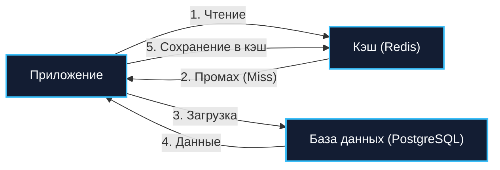

## Кэширование: от кремния до распределённых кластеров

> *"There are only two hard things in Computer Science: cache invalidation and naming things."*  
> — Фил Карлтон (Phil Karlton)

В арсенале бэкенд-инженера кэширование — это самый мощный и соблазнительный инструмент. Одним добавлением слоя кэша можно срезать сетевую задержку с 50 миллисекунд до 50 микросекунд, разгрузить реляционную СУБД от тысяч однотипных запросов `SELECT` и превратить задыхающийся сервис в образец высокой производительности.

Однако за эту магическую скорость приходится платить архитектурную цену. Кэш — это неизбежная репликация состояния. В тот самый момент, когда одна и та же информация начинает существовать в двух местах (в авторитетной базе данных и во временном кэше), система сталкивается с фундаментальной дилеммой согласованности: что произойдёт, если запись в основном хранилище изменилась, а кэш об этом ещё не знает?

В этой главе мы подробно исследуем четыре базовых паттерна кэширования, детально разберём их реализацию на Go, погрузимся в механику влияния локального кэша на сборщик мусора (GC) и рантайм, а также вооружимся инженерными паттернами защиты от классических катастроф: Cache Stampede, Cache Penetration и Cache Avalanche.

---

### Четыре паттерна кэширования

Кэш может располагаться на разных физических уровнях архитектуры:
- **Локальный in-memory кэш** непосредственно в адресном пространстве процесса Go (чтение за наносекунды, нулевые сетевые издержки, но данные изолированы внутри одного инстанса).
- **Внешний распределённый кэш** вроде Redis, Dragonfly или Memcached (доступен всем репликам сервиса, латентность порядка сотен микросекунд или единиц миллисекунд).

Вне зависимости от физической топологии, взаимодействие приложения, кэша и базы данных подчиняется одной из четырёх канонических стратегий.

```mermaid
flowchart TD
    subgraph CA["1. Cache-Aside"]
        A1["Приложение"] -->|1. Get| C1["Кэш"]
        C1 -.->|Miss| A1
        A1 -->|2. Query| D1["База данных"]
        A1 -->|3. Set| C1
    end

    subgraph RT["2. Read-Through"]
        A2["Приложение"] -->|1. Get| C2["Кэш / Прокси"]
        C2 -->|2. Загрузка при Miss| D2["База данных"]
        C2 -->|3. Data| A2
    end

    subgraph WT["3. Write-Through"]
        A3["Приложение"] -->|1. Write| C3["Кэш"]
        C3 -->|2. Синхронный Write| D3["База данных"]
    end

    subgraph WB["4. Write-Behind (Write-Back)"]
        A4["Приложение"] -->|1. Write| C4["Кэш"]
        C4 -.->|2. Асинхронный Batch Write| D4["База данных"]
    end

    classDef box fill:#131d33,stroke:#38bdf8,stroke-width:2px,color:#f8fafc;
    class A1,C1,D1,A2,C2,D2,A3,C3,D3,A4,C4,D4 box;
```



---

#### Cache-Aside (Look-Aside, Lazy Loading)

**Cache-Aside** — это наиболее распространённая и универсальная стратегия в микросервисной архитектуре.  
Здесь приложение выступает главным координатором:
1. При чтении сервис сначала запрашивает ключ в кэше.
2. При попадании (`Cache Hit`) данные немедленно отдаются клиенту.
3. При промахе (`Cache Miss`) сервис обращается в базу данных, читает свежие строки, сохраняет их в кэш с заданным временем жизни (TTL) и возвращает клиенту.
4. При обновлении данных сервис выполняет `UPDATE` в базе данных и **инвалидирует (удаляет)** ключ из кэша.



**Преимущества:**
- **Устойчивость к сбоям кэша**: Если Redis выходит из строя, сервис продолжает обслуживать клиентов, обращаясь напрямую в базу данных (с повышенной латентностью).
- **Экономное использование памяти**: В кэш попадают исключительно те сущности, к которым реально обращаются клиенты («ленивая загрузка»). Холодные архивные записи не забивают RAM.
- **Простота модели данных**: Модели в кэше могут отличаться от таблиц в реляционной СУБД (например, уже сериализованный готовый JSON-ответ).

**Недостатки:**
- **Штраф первого запроса (Cold Start)**: Первый клиент всегда платит двойную цену задержки: сетевой промах в кэш плюс тяжелый `SELECT` в СУБД плюс сетевой `SET` в кэш.
- **Риск рассинхронизации данных**: Если обновление базы данных завершилось успешно, а команда удаления ключа из кэша потерялась из-за сетевого сбоя, клиенты будут читать устаревшие данные вплоть до истечения TTL.

##### Реализация Cache-Aside в Go:

```go
package cacheaside

import (
	"context"
	"database/sql"
	"encoding/json"
	"errors"
	"fmt"
	"time"

	"github.com/redis/go-redis/v9"
)

type User struct {
	ID    string `json:"id"`
	Name  string `json:"name"`
	Email string `json:"email"`
}

type UserService struct {
	db    *sql.DB
	cache *redis.Client
}

func NewUserService(db *sql.DB, cache *redis.Client) *UserService {
	return &UserService{db: db, cache: cache}
}

func (s *UserService) GetUser(ctx context.Context, id string) (*User, error) {
	cacheKey := "user:" + id

	// 1. Проверяем кэш
	val, err := s.cache.Get(ctx, cacheKey).Bytes()
	if err == nil {
		var user User
		if err := json.Unmarshal(val, &user); err == nil {
			return &user, nil // Успешный Hit
		}
	} else if !errors.Is(err, redis.Nil) {
		// Ошибка Redis (сеть/таймаут) — не должна ронять сервис! Логируем и идём в БД.
		// Fallback к основному источнику правды
	}

	// 2. Промах кэша: загружаем из БД
	user, err := s.loadFromDB(ctx, id)
	if err != nil {
		return nil, err
	}

	// 3. Сохраняем в кэш (асинхронно или с коротким таймаутом)
	go func() {
		// Используем независимый контекст с таймаутом, чтобы отмена родительского ctx не оборвала запись
		setCtx, cancel := context.WithTimeout(context.Background(), 500*time.Millisecond)
		defer cancel()

		data, marshalErr := json.Marshal(user)
		if marshalErr == nil {
			_ = s.cache.Set(setCtx, cacheKey, data, 5*time.Minute).Err()
		}
	}()

	return user, nil
}

func (s *UserService) UpdateUser(ctx context.Context, user *User) error {
	tx, err := s.db.BeginTx(ctx, nil)
	if err != nil {
		return err
	}
	defer tx.Rollback()

	if err := s.updateInDB(ctx, tx, user); err != nil {
		return err
	}

	if err := tx.Commit(); err != nil {
		return err
	}

	// Инвалидация кэша ПОСЛЕ успешной фиксации транзакции в СУБД
	cacheKey := "user:" + user.ID
	_ = s.cache.Del(ctx, cacheKey).Err()

	return nil
}

func (s *UserService) loadFromDB(ctx context.Context, id string) (*User, error) {
	// Имитация SQL-запроса
	return &User{ID: id, Name: "Brian Kernighan", Email: "bwk@bell-labs.com"}, nil
}

func (s *UserService) updateInDB(ctx context.Context, tx *sql.Tx, user *User) error {
	return nil
}
```

> [!warning] Ловушка / Gotcha
> Инвалидация кэша *после* коммита транзакции не является атомарной. Если база данных закоммитила изменения, а сервис упал по OOM до вызова `cache.Del()`, в кэше навсегда (до истечения TTL) останутся устаревшие данные.  
> Если же удалить кэш *до* коммита транзакции, возникает ещё более коварная гонка: параллельный читатель обнаружит промах кэша, вычитает из базы данных ещё не закоммиченное старое значение и снова запишет его в кэш!  
> В высоконадёжных архитектурах инвалидацию кэша выносят в транзакционный журнал (CDC через Debezium или `LISTEN/NOTIFY` в PostgreSQL), гарантируя удаление ключа только после реального коммита WAL.

---

#### Read-Through

В паттерне **Read-Through** приложение обращается исключительно к интерфейсу кэша. Само приложение вообще не знает о существовании базы данных для операций чтения. При возникновении промаха кэширующий плагин или специализированная библиотека автоматически обращается к хранилищу данных, наполняет кэш и возвращает результат приложению.


**Преимущества:**
- **Чистота клиентского кода**: Код бизнес-логики чист от инфраструктурных проверок; для приложения это всегда прозрачный вызов `cache.Get()`.
- **Единая точка логирования и метрик**: Метрики Hit Ratio и промахов централизованы в единой обёртке.

**Недостатки:**
- **Меньшая гибкость**: Трудно кастомизировать стратегию загрузки для специфических сценариев.

В Go такой паттерн идиоматично реализуется через generic-обёртку с фабричной функцией загрузки (`loader func`):

```go
type LoaderFunc[T any] func(ctx context.Context, key string) (*T, error)

type ReadThroughCache[T any] struct {
	client *redis.Client
	loader LoaderFunc[T]
	ttl    time.Duration
}

func NewReadThroughCache[T any](client *redis.Client, loader LoaderFunc[T], ttl time.Duration) *ReadThroughCache[T] {
	return &ReadThroughCache[T]{
		client: client,
		loader: loader,
		ttl:    ttl,
	}
}

func (c *ReadThroughCache[T]) Get(ctx context.Context, key string) (*T, error) {
	val, err := c.client.Get(ctx, key).Bytes()
	if err == nil {
		var entity T
		if err := json.Unmarshal(val, &entity); err == nil {
			return &entity, nil
		}
	} else if !errors.Is(err, redis.Nil) {
		return nil, fmt.Errorf("cache backend failure: %w", err)
	}

	// Промах кэша: прозрачный вызов загрузчика
	entity, err := c.loader(ctx, key)
	if err != nil {
		return nil, fmt.Errorf("loader failed: %w", err)
	}

	// Сохранение в кэш
	if data, err := json.Marshal(entity); err == nil {
		_ = c.client.Set(ctx, key, data, c.ttl).Err()
	}

	return entity, nil
}
```

---

#### Write-Through

В паттерне **Write-Through** запись данных также полностью делегируется слою кэша. Приложение отправляет команду записи в кэш, а кэш **синхронно** выполняет запись в реляционную базу данных и только после успешного ответа СУБД подтверждает операцию приложению.


**Преимущества:**
- **Гарантия свежести**: Кэш никогда не содержит устаревших данных при условии, что все операции записи идут строго через него.
- **Отсутствие холодного старта при записи**: Новые или обновлённые сущности сразу готовы к быстрому чтению.

**Недостатки:**
- **Высокая задержка на запись**: Приложению приходится ждать завершения двух сетевых операций: запись в кэш плюс запись на диск в СУБД.
- **Загрязнение кэша (Cache Churn)**: Если сущность записывается один раз, а читается редко или никогда, она неэффективно расходует дорогую оперативную память.

---

#### Write-Behind (Write-Back)

Паттерн **Write-Behind** (также известный как Write-Back) — это полная противоположность Write-Through. Приложение производит запись в кэш, кэш моментально подтверждает сохранение клиенту, а сброс данных в постоянную базу данных происходит **асинхронно** — с задержкой, пакетами (batching) в фоновом потоке.


**Преимущества:**
- **Экстремальная производительность записи**: Задержка операции записи составляет считанные микросекунды (память RAM).
- **Сглаживание пиковых нагрузок (Traffic Smoothing)**: Тысячи мелких операций `UPDATE` над одной и той же записью (например, счётчик просмотров видео или лайков) могут быть схлопнуты в памяти кэша и записаны в СУБД одним суммарным SQL-запросом.

**Недостатки:**
- **Риск потери данных (Data Loss)**: Если сервер кэша аварийно перезагрузится по питанию до того, как грязные страницы (dirty pages) будут сброшены в постоянную базу данных, обновления будут безвозвратно утеряны.
- **Слабая согласованность (Eventual Consistency)**: База данных отстаёт от реального состояния в кэше.

##### Реализация Write-Behind в Go:

```go
package writebehind

import (
	"context"
	"database/sql"
	"log"
	"sync"
	"time"

	"github.com/redis/go-redis/v9"
)

type writeOp struct {
	key   string
	value any
}

type WriteBehindCache struct {
	client *redis.Client
	db     *sql.DB
	writes chan writeOp
	wg     sync.WaitGroup
}

func NewWriteBehindCache(client *redis.Client, db *sql.DB, bufferSize int) *WriteBehindCache {
	return &WriteBehindCache{
		client: client,
		db:     db,
		writes: make(chan writeOp, bufferSize),
	}
}

func (c *WriteBehindCache) Write(ctx context.Context, key string, val any) error {
	// 1. Быстрая запись в Redis
	if err := c.client.Set(ctx, key, val, 24*time.Hour).Err(); err != nil {
		return err
	}

	// 2. Отправка в буфер асинхронного сброса
	select {
	case c.writes <- writeOp{key: key, value: val}:
		return nil
	default:
		// Буфер переполнен: защита от утечки памяти
		log.Printf("ALERT: Write-Behind буфер переполнен для ключа %s!", key)
		return nil
	}
}

func (c *WriteBehindCache) Start(ctx context.Context) {
	c.wg.Add(1)
	go func() {
		defer c.wg.Done()
		batch := make([]writeOp, 0, 100)
		ticker := time.NewTicker(500 * time.Millisecond)
		defer ticker.Stop()

		for {
			select {
			case op := <-c.writes:
				batch = append(batch, op)
				if len(batch) >= 100 {
					c.flush(batch)
					batch = batch[:0]
				}
			case <-ticker.C:
				if len(batch) > 0 {
					c.flush(batch)
					batch = batch[:0]
				}
			case <-ctx.Done():
				// Graceful shutdown: сбрасываем остаток перед выходом
				if len(batch) > 0 {
					c.flush(batch)
				}
				return
			}
		}
	}()
}

func (c *WriteBehindCache) flush(batch []writeOp) {
	// Пакетная вставка в реляционную СУБД через транзакцию
	log.Printf("[Write-Behind] Сброс пачки из %d записей в постоянную СУБД...", len(batch))
}
```

---

### Mechanical Sympathy: влияние кэша на Go-рантайм

Любое решение о введении кэша обязано учитывать архитектуру среды исполнения Go, поведение Garbage Collector и устройство подсистемы ввода-вывода Linux.

#### Локальный кэш vs Внешний кэш

| Критерий | Локальный in-memory кэш (Go Process) | Внешний кэш (Redis / DragonFly) |
|---|---|---|
| **Латентность доступа** | **10–100 наносекунд** (прямой доступ к оперативной памяти L1/L2/L3) | **0.2–2 миллисекунды** (сетевой стек, TCP/IP, сериализация) |
| **Сетевой оверхед** | **0 байт**, системные вызовы отсутствуют | Системные вызовы `sendto`/`recvfrom`, контекст-свитчи ядра |
| **Влияние на GC Go** | Высокое (если хранятся миллионы указателей в куче) | **Нулевое** (данные находятся в отдельном процессе) |
| **Когерентность** | Отсутствует: каждый под Kubernetes хранит собственную версию | Полная: все реплики читают один источник правды |
| **Поведение при рестарте** | Кэш сбрасывается в ноль (Cold Start) | Сохраняется (данные живут в отдельном поде/кластере) |

#### Налог на Garbage Collector: ловушка указателей

Стандартный in-memory кэш на базе `sync.Map` или `map + sync.RWMutex` со структурами `map[string]*User` скрывает в себе смертельную ловушку для высоконагруженных сервисов. Для повторного использования временных буферов и объектов без лишней нагрузки на аллокатор применяется `sync.Pool`.  
Сборщик мусора Go использует алгоритм трёхцветной маркировки (Tri-color Mark and Sweep). Во время фазы разметки рантайм обязан **обойти каждый указатель в куче (heap)**, чтобы определить, жив объект или нет.

Если вы положите в `map[string]*User` 5 000 000 объектов, GC будет сканировать миллионы указателей каждые несколько секунд. Фаза Stop-The-World (STW) и время работы марк-воркеров (`gcMarkWorker`) резко возрастут, пожирая до 25–30% процессорной мощности CPU!

> [!info] Под капотом
> Чтобы исключить влияние локального кэша на сборщик мусора, специализированные библиотеки (`bigcache`, `fastcache`, `ristretto`) обходят GC с помощью гениального инженерного трюка:  
> В компиляторе Go карты вида `map[int]int` или `map[uint64]uint32`, в ключах и значениях которых **нет указателей**, помечаются специальным флагом, и **GC вообще не сканирует их содержимое!**  
> Например, `bigcache` выделяет гигантские циклические массивы байтов `[]byte` и хранит в хэш-таблице только 64-битные числовые смещения. В результате даже 50 гигабайт кэша в оперативной памяти процесса Go не добавляют ни единой микросекунды к паузам сборщика мусора!

#### Сетевой стек и Netpoller в Redis

Каждая команда к Redis — это системный вызов `write/read` (или `sendto`/`recvfrom`) к сетевому сокету. Сетевой поллер Go (`netpoller`) паркует горутину на время ожидания ответа сокета через `epoll_wait` в Linux. Хотя горутины в ожидании очень дешевы, при 100 000 RPS сетевые накладные расходы на системные вызовы ядра становятся доминирующими.  
**Решение:** Использование конвейеризации (Redis Pipelining) для отправки пачек команд за один сетевой системный вызов и пулов соединений (`github.com/redis/go-redis/v9` управляет ими под капотом).

---

### Инвалидация и её грабли

Существует четыре базовых механизма инвалидации кэшированных записей:

1. **TTL (Time To Live)**:  
   Каждой записи присваивается жёсткое время жизни (например, 5 минут). По истечении времени Redis или локальный таймер вытесняет запись. Это самый простой и надежный подход, но он гарантирует лишь согласованность в конечном счёте (Eventual Consistency).
2. **Явная инвалидация при записи**:  
   При любом изменении сущности сервис принудительно удаляет соответствующий ключ (`cache.Del`). Требует жесточайшей дисциплины: если разработчик добавил новый фоновый воркер или скрипт миграции, забыв про вызов `cache.Del`, пользователи увидят вечные устаревшие данные.
3. **Ключи на основе версий (Versioned Keys)**:  
   Ключ формируется с использованием монотонного счетчика версии: `user:42:v1`. При обновлении профиля пользователя версия в метаданных инкрементируется до `v2`. Запросы начинают автоматически читать ключ `user:42:v2`. Старый ключ `user:42:v1` тихо умирает по TTL без необходимости его немедленного поиска и удаления.
4. **Обновление вместо удаления (Eager Update)**:  
   При `UPDATE` сущности новое состояние сразу перезаписывается в кэш. Это устраняет холодный старт, но порождает риск гонок при параллельных записях.

---

### Проблема Thundering Herd (Stampede)

**Cache Stampede** (или эффект стада бизонов / лавина промахов) возникает в момент, когда истекает TTL очень популярного («горячего») ключа (например, курс валют или карточка товара на главной странице маркетплейса).

В одну миллисекунду сотни входящих горутин получают `Cache Miss` и одновременно направляют одинаковый тяжелый SQL-запрос в базу данных. База данных захлёбывается в лавине одинаковых запросов, время ответа деградирует, а сервер падает в каскадный отказ.

```mermaid
flowchart TD
    Reqs["1000 параллельных горутин"] -->|"Cache Miss (ключ истек)"| Single["singleflight.Group"]
    Single -->|"Ровно 1 запрос!"| DB["База данных (PostgreSQL)"]
    DB -->|"1 ответ"| Single
    Single -->|"Раздача результата всем 1000 горутинам"| Reqs

    classDef proc fill:#131d33,stroke:#38bdf8,stroke-width:2px,color:#f8fafc;
    class Def fill:#1e1b4b,stroke:#818cf8,stroke-width:2px,color:#f8fafc;
    class Reqs,DB proc;
    class Single Def;
```

#### Защита через `golang.org/x/sync/singleflight`

В стандартной экосистеме Go существует идеальный инструмент для решения этой проблемы на уровне процесса — пакет `singleflight`:

```go
package stampede

import (
	"context"
	"fmt"
	"time"

	"golang.org/x/sync/singleflight"
)

type UserProfile struct {
	ID   string
	Data string
}

type SafeCacheService struct {
	flightGroup singleflight.Group
}

func (s *SafeCacheService) GetUserProfile(ctx context.Context, userID string) (*UserProfile, error) {
	cacheKey := "user:profile:" + userID

	// 1. Попытка чтения из кэша (пропущена для краткости)

	// 2. Защита через singleflight: если 500 горутин одновременно вызовут Do с одним ключом,
	// реальная функция-загрузчик выполнится строго ОДИН раз.
	val, err, shared := s.flightGroup.Do(cacheKey, func() (any, error) {
		// Тяжелый запрос в базу данных
		return s.loadFromDB(ctx, userID)
	})

	if err != nil {
		return nil, err
	}

	if shared {
		// Результат был разделен между несколькими ожидающими горутинами
	}

	return val.(*UserProfile), nil
}

func (s *SafeCacheService) loadFromDB(ctx context.Context, id string) (*UserProfile, error) {
	time.Sleep(100 * time.Millisecond) // Имитация тяжелого SQL
	return &UserProfile{ID: id, Data: "Kernighan Bio"}, nil
}
```

#### Вероятностная досрочная регенерация (Алгоритм XFetch)

В распределённых системах с сотнями инстансов `singleflight` защищает только локальный процесс. Для распределённого мьютекса между подами применяется внешний механизм (например, команда `SETNX` в Redis с TTL). Для распределённого кэша применяется вероятностный алгоритм **XFetch** (разработанный исследователями Стэнфорда).  
Суть алгоритма: клиент, читая запись незадолго до истечения её TTL, с некоторой вероятностью берёт на себя задачу фоновой регенерации кэша до того, как ключ реально протухнет:
$$	ext{Time} - (eta 	imes \delta 	imes \ln(	ext{rand}())) > 	ext{Expiry}$$
где $\delta$ — время, затраченное на прошлую загрузку из БД, а $eta > 0$ — коэффициент агрессивности. В результате ключ в кэше обновляется бесшовно, и промахов вообще не происходит.

---

### Выбор паттерна в архитектуре

- **Cache-Aside** — выбор по умолчанию для 90% задач. Идеален для систем с высокой долей чтения (Read-Heavy), где холодный старт не критичен, а данные должны быть согласованы в конечном счёте.
- **Read-Through** — идеален для построения унифицированных SDK и библиотек доступа к данным внутри крупных компаний, изолируя команды от деталей хранилищ.
- **Write-Through** — применяется там, где потеря записанных данных абсолютно недопустима, а читатели требуют мгновенного доступа к свежезаписанным данным (например, финансовые реестры).
- **Write-Behind** — безальтернативный выбор для экстремально высоких нагрузок на запись (счётчики просмотров, агрегация телеметрии, лайки, логирование действий), где потеря последних 500 миллисекунд данных при глобальной аварии не является фатальной для бизнеса.

Сравнение со свойствами согласованности ([[29. Consistency модели. Strong, Eventual, Causal]]) и теоремой CAP ([[30. CAP теорема и реальные компромиссы]]): введение любого кэша — это всегда осознанный компромисс: отказ от строгой линеаризуемости (Strong Consistency) ради пропускной способности и субмиллисекундного времени отклика.

---

### Кэширование и устойчивость к отказам

Кэш — это **не авторитетный источник правды**.  
Если кластер Redis перегружен, потерял сетевую связность или перезагружается, приложение Go не имеет права падать с паникой или возвращать пользователю `500 Internal Server Error`.

1. **Graceful Degradation (Плавная деградация)**:  
   Любой сбой кэширующего слоя обязан быть изолирован. Ошибка логируется, и запрос прозрачно направляется в базу данных.
2. **Защита от перегрузки базы (Circuit Breaker на кэш)**:  
   Если кэш полностью отказал, перенаправление 100 000 RPS напрямую в базу данных немедленно убьёт и саму базу данных. В таких условиях на шлюзе кэша должен срабатывать **Circuit Breaker** ([[36. Circuit Breaker, Retry, Timeout и Backoff]]), сбрасывающий часть второстепенного трафика или отдающий клиентам заглушки (stale data).

```go
func (s *UserService) GetUserResilient(ctx context.Context, id string) (*User, error) {
	// Попытка взять из кэша с коротким таймаутом
	cacheCtx, cancel := context.WithTimeout(ctx, 30*time.Millisecond)
	defer cancel()

	user, err := s.getFromCache(cacheCtx, id)
	if err == nil {
		return user, nil
	}

	if !errors.Is(err, redis.Nil) {
		// Кэш сбоит или таймаутит: логируем инцидент
		log.Printf("WARN: cache unavailable for user %s, falling back to db: %v", id, err)
	}

	// Откат к реляционной базе данных
	return s.loadFromDB(ctx, id)
}

func (s *UserService) getFromCache(ctx context.Context, id string) (*User, error) {
	return nil, redis.Nil
}
```

---

> [!tip] Собеседование
> **Вопрос:** Как бы вы спроектировали архитектуру кэширования для сервиса каталога товаров с нагрузкой 100 000 RPS и жёстким требованием к времени ответа P99 < 15 мс?
> 
> **Ответ:**  
> Я выберу **многоуровневое кэширование (Multi-Level Caching)**:
> 1. **L1 (In-Memory процесс Go)**: Локальный кэш на базе библиотеки без GC-оверхеда (`bigcache` или `ristretto`) с TTL 3–5 секунд. Это позволит отсекать до 80% горячих запросов прямо в оперативной памяти процесса с латентностью < 1 микросекунды без сетевых системных вызовов.
> 2. **L2 (Распределённый Redis Cluster)**: Централизованный слой для синхронизации данных между подами Kubernetes с TTL 15 минут. Стратегия — **Cache-Aside**.
> 3. **Защита от Cache Stampede**: Использование `singleflight.Group` в коде сервиса, чтобы при промахе L1 и L2 в базу данных отправлялся строго один запрос на один товар.
> 4. **Инвалидация**: При изменении цены или остатков сервис заказов публикует событие в Kafka/Redis Pub/Sub. Потребители на всех подах мгновенно удаляют ключ из локального L1-кэша, а в L2 ключ инвалидируется через `DEL`.
> 5. **Отказоустойчивость**: Ограничение таймаута к Redis в 20 мс с плавным фоллбэком в базу данных под защитой Circuit Breaker и Rate Limiter.

---

### Итог

Кэширование — это искусство управления компромиссами между скоростью света в кремнии и энтропией распределённых данных. Выбор между Cache-Aside, Read-Through, Write-Through и Write-Behind определяется не модой, а конкретными требованиями к допустимости потери данных и профилем нагрузки (чтение или запись).

Инженер, пишущий на Go, обязан помнить об устройстве машины: не забивать кучу миллионами указателей, помнить о стоимости системных вызовов сетевого сокета и защищать свою систему от «стада бизонов» через `singleflight`.

В следующей главе мы поднимемся на фундаментальный уровень распределённых систем и разберём спектр моделей согласованности: [[29. Consistency модели. Strong, Eventual, Causal]].
