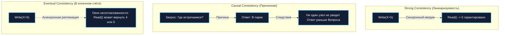
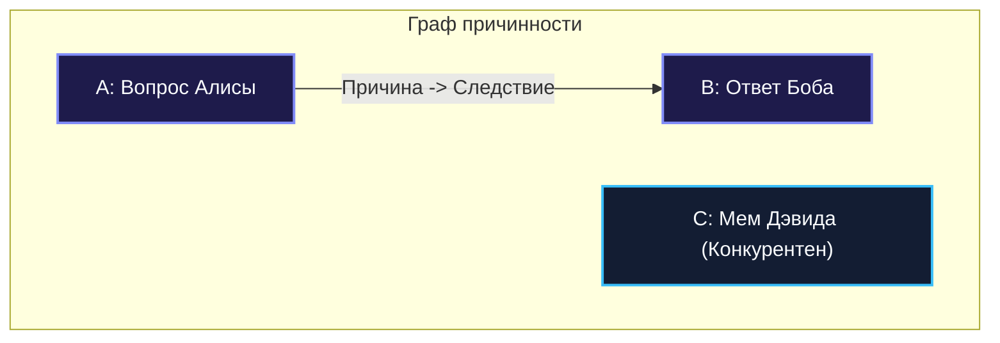

## Модели согласованности: Strong, Eventual, Causal

В классическом монолитном приложении с единой реляционной базой данных понятие «актуальности данных» кажется интуитивно очевидным. Вы выполнили оператор `UPDATE`, получили подтверждение коммита, и любая последующая инструкция `SELECT` гарантированно возвращает новое значение. В рамках одной операционной системы и одного кристалла кремния законы физики позволяют процессору поддерживать строгую иллюзию единого глобального времени с помощью аппаратных протоколов когерентности кэшей (MESI/MOESI) и барьеров памяти.

Но стоит данным пересечь границу физического сервера и распределиться по узлам компьютерной сети, как эта иллюзия рассыпается в прах. Скорость распространения сигнала в оптоволокне ограничена скоростью света ($pprox 200\,000$ км/с), сетевые пакеты задерживаются буферами маршрутизаторов, а независимые процессоры обладают собственными кварцевыми генераторами, неизбежно страдающими от дрейфа физического времени (Clock Drift).

Если два пользователя в разных уголках планеты одновременно обращаются к распределённой системе, что именно они должны увидеть? Ответ на этот вопрос даёт **модель согласованности (Consistency Model)** — формальный контракт между распределённой системой и прикладным кодом, определяющий правила, по которым результаты операций записи становятся видимыми для последующих операций чтения.

В этой главе мы разберём три фундаментальные модели согласованности: **Strong (Сильную)**, **Eventual (В конечном счёте)** и **Causal (Причинную)**, исследуем их математические основания, влияние на рантайм Go и алгоритмы разрешения конфликтов.

---

### Что такое консистентность в распределённых системах

В индустрии программной инженерии термин **консистентность (Consistency)** часто страдает от путаницы, поскольку используется сразу в двух фундаментальных контекстах:

1. **Консистентность в ACID (буква C)**:  
   Относится к бизнес-правилам и инвариантам реляционной СУБД. Например: «баланс счета не может быть отрицательным» или «внешний ключ обязан указывать на существующую строку». Если транзакция нарушает инвариант, она откатывается.
2. **Консистентность в распределённых системах (и в теореме CAP)**:  
   Определяет **порядок и своевременность видимости данных** между распределёнными репликами. Если узел $A$ принял запись нового значения переменной $X = 5$, через какое время и при каких условиях узел $B$ обязан вернуть читателю именно 5, а не устаревшее значение $X = 4$?



---

### Strong Consistency (Сильная согласованность)

**Определение:** Система обладает **сильной согласованностью (Strong Consistency)**, если после того, как операция записи успешно подтверждена клиенту, любая последующая операция чтения (с абсолютно любого узла распределённого кластера) гарантированно возвращает либо это новое записанное значение, либо результат ещё более поздней записи.

Система ведёт себя так, словно физически существует **ровно одна неделимая копия данных**, к которой все узлы обращаются по очереди.

Наиболее строгой математической формой сильной согласованности является **линеаризуемость (Linearizability)**, сформулированная Морисом Херлихи (Maurice Herlihy) и Джанет Винг (Jeannette Wing) в 1990 году:
- Каждая операция чтения или записи обладает точкой линеаризации — мгновенным событием между её началом (`invoke`) и завершением (`response`).
- Все операции упорядочены вдоль глобальной оси реального физического времени.

#### Как достигается сильная согласованность

1. **Кворумная репликация ($R + W > N$)**:  
   В кластере из $N$ узлов запись подтверждается только после сохранения на $W$ узлах, а чтение опрашивает $R$ узлов. Если $R + W > N$, множества узлов чтения и записи гарантированно пересекаются хотя бы на одном узле, несущем самую свежую версию данных.
2. **Алгоритмы распределённого консенсуса (Raft, Multi-Paxos)**:  
   Все операции записи проходят через единого лидера (например, популярная библиотека `hashicorp/raft` на Go позволяет легко встроить консенсусный кластер прямо в ваше приложение), фиксируются в реплицированном журнале (Replicated WAL) и применяются к локальным стейт-машинам только после одобрения большинством узлов (кворумом $\lfloor N/2 
floor + 1$).
3. **Распределённые транзакции и блокировки**:  
   Использование двухфазного коммита (2PC) и распределённых замков для предотвращения параллельных модификаций.

#### Влияние на архитектуру и Go-сервисы

- **Штраф к задержке (Latency Penalty)**: Каждая запись обязана ждать ответа от большинства удалённых узлов по сети. Время отклика включает сетевой RTT и время сброса журнала на диск (`fsync`).
- **Снижение доступности (Availability Tradeoff)**: Если в результате сетевого разделения (Network Partition) группа узлов теряет связь с кворумом, она **обязана отклонять запросы на запись**, защищая систему от рассинхронизации (Split-Brain).
- **Поведение в рантайме Go**: Горутины, выполняющие синхронные вызовы к кворуму, блокируются в ожидании сетевого ввода-вывода (I/O Wait).

##### Пример строго консистентного чтения на Go (etcd clientv3):

```go
package consistency

import (
	"context"
	"fmt"
	"time"

	clientv3 "go.etcd.io/etcd/client/v3"
)

// StrongGet читает ключ с гарантией линеаризуемости через кворумный консенсус Raft
func StrongGet(ctx context.Context, client *clientv3.Client, key string) (string, error) {
	reqCtx, cancel := context.WithTimeout(ctx, 2*time.Second)
	defer cancel()

	// Опция WithSerializable() отключает кворумное чтение ради скорости (Eventual),
	// тогда как чтение по умолчанию в etcd обеспечивает строгую линеаризуемость через Leader Lease/ReadIndex.
	resp, err := client.Get(reqCtx, key)
	if err != nil {
		return "", fmt.Errorf("failed to get linearizable key: %w", err)
	}

	if len(resp.Kvs) == 0 {
		return "", nil
	}

	// Значение гарантированно актуально для кворума
	return string(resp.Kvs[0].Value), nil
}
```

---

### Eventual Consistency (Согласованность в конечном счёте)

**Определение:** Если в систему перестают поступать новые операции записи, то по прошествии некоторого времени все реплики кластера гарантированно сойдутся (converge) к единому идентичному состоянию, и последующие чтения вернут последнее записанное значение.

В промежутке между моментом подтверждения записи и моментом её доставки на все узлы существует **окно несогласованности (Inconsistency Window)**. В течение этого окна разные клиенты, читающие данные с разных реплик, могут одновременно наблюдать противоречивые состояния системы.

Это основа парадигмы **BASE** (Basically Available, Soft state, Eventually consistent), разработанной как антипод строгого ACID.


#### Примеры из реальной практики:
- **DNS (Domain Name System)**: Изменение IP-адреса для домена распространяется по кешам мировых DNS-резолверов от нескольких минут до 72 часов.
- **Amazon DynamoDB / Apache Cassandra**: Позволяют клиенту гибко настраивать уровень консистентности для каждого запроса (`ConsistencyLevel: ONE, QUORUM, ALL`). Запись с уровнем `ONE` подтверждается мгновенно после сохранения на одной ноде.
- **Кэширование (Cache-Aside)**: Приложение читает данные из кэша Redis, который обновляется по TTL или асинхронно после коммита в PostgreSQL ([[28. Кэширование. Cache Aside, Write Through, Write Back]]).

#### Влияние на архитектуру Go-сервиса:
- **Субмиллисекундная латентность**: Запись фиксируется локально, не блокируя горутину ожиданием удалённых узлов.
- **Максимальная пропускная способность**: Масштабирование чтения добавлением сотен асинхронных реплик.
- **Конфликты конкурентных записей**: Необходимость внедрения механизмов автоматического слияния:
  - **LWW (Last-Write-Wins)**: Побеждает запись с наибольшим таймстемпом физических часов (опасно из-за рассинхронизации NTP!).
  - **CRDT (Conflict-free Replicated Data Types)**: Специализированные математические структуры данных (PN-счётчики, OR-Set), гарантирующие математическую сходимость без блокировок.

##### Пример асинхронной репликации с рассинхронизацией на Go:

```go
package consistency

import (
	"context"

	"github.com/redis/go-redis/v9"
)

type Service struct {
	master  *redis.Client // Узел для записи
	replica *redis.Client // Read-only реплика
}

// Пишем в основной узел, не ждём репликации
func (s *Service) Write(ctx context.Context, key string, val []byte) error {
	_, err := s.master.Set(ctx, key, val, 0).Result()
	return err
}

// Читаем с любого реплика
func (s *Service) Read(ctx context.Context, key string) ([]byte, error) {
	// reader может вернуть устаревшее значение, если репликация не завершена
	return s.replica.Get(ctx, key).Bytes()
}
```

---

### Causal Consistency (Причинная согласованность)

**Определение:** Операции, связанные **причинно-следственной зависимостью (Causal Dependency)**, обязаны быть видны абсолютно всем узлам распределённой системы в одном и том же строгом хронологическом порядке.  
Операции, которые причинно не связаны между собой (**конкурентные операции**), могут наблюдаться разными узлами в произвольном порядке.

Причинная согласованность занимает идеальное положение в спектре компромиссов: она **строже Eventual Consistency**, исключая алогичные для человека парадоксы, но **слабее Strong Consistency**, позволяя системе сохранять стопроцентную доступность (Availability) даже при полном разрыве сети!

#### Физическая модель причинности

Представьте групповой чат коллег:
1. Алиса отправляет сообщение: «*Кто дежурит на этих выходных?*» (Событие $A$).
2. Боб читает вопрос Алисы и отвечает: «*Я отдежурю, всё в порядке!*» (Событие $B$).

Событие $B$ причинно зависит от $A$ ($A 	o B$). В причинно-согласованной системе никакой наблюдатель Чарли ни при каких обстоятельствах не может увидеть ответ Боба раньше вопроса Алисы. Это исключает парадокс «ответа из будущего».

Однако, если в это же время в другом канале Дэвид опубликовал мем с котиком (Событие $C$), события $A$ и $C$ конкурентны ($A \parallel C$). Не имеет значения, увидит ли Чарли мем до вопроса Алисы или после него.



#### Математический аппарат: Векторные часы (Vector Clocks)

Для отслеживания причинности распределённые узлы не полагаются на ненадежные физические часы. Вместо этого используется концепция логических часов Лесли Лэмпорта и **векторных часов (Vector Clocks)**.

Каждый узел $i$ в кластере из $N$ серверов хранит целочисленный вектор $V[1..N]$.
1. Перед генерацией локального события узел инкрементирует собственный счётчик: $V_i[i] = V_i[i] + 1$.
2. Каждое исходящее сетевое сообщение снабжается копией вектора $V_i$.
3. Получив сообщение с вектором $V_{msg}$, принимающий узел обновляет свои часы:
   $$orall k: V_{local}[k] = \max(V_{local}[k], V_{msg}[k])$$

Событие $A$ с часами $V_A$ предшествовало событию $B$ с часами $V_B$ ($A 	o B$) тогда и только тогда, когда:
$$orall k, V_A[k] \le V_B[k] \quad 	ext{и} \quad \exists k, V_A[k] < V_B[k]$$

Если ни $V_A \le V_B$, ни $V_B \le V_A$ не выполняется — события признаются строго **конкурентными (Concurrent)**, требуя слияния.

##### Реализация причинного контекста в Go

```go
package causality

import (
	"context"
	"fmt"
	"net/http"
	"strconv"
	"strings"
	"sync"
)

type contextKey string

const clockKey contextKey = "causal-clock"

type VectorClock struct {
	mu     sync.RWMutex
	values map[string]uint64
}

func NewVectorClock() *VectorClock {
	return &VectorClock{values: make(map[string]uint64)}
}

func (vc *VectorClock) Increment(nodeID string) {
	vc.mu.Lock()
	defer vc.mu.Unlock()
	vc.values[nodeID]++
}

func (vc *VectorClock) Clone() map[string]uint64 {
	vc.mu.RLock()
	defer vc.mu.RUnlock()
	cp := make(map[string]uint64, len(vc.values))
	for k, v := range vc.values {
		cp[k] = v
	}
	return cp
}

func (vc *VectorClock) String() string {
	vc.mu.RLock()
	defer vc.mu.RUnlock()
	var parts []string
	for k, v := range vc.values {
		parts = append(parts, fmt.Sprintf("%s:%d", k, v))
	}
	return strings.Join(parts, ",")
}

func ParseVectorClock(raw string) *VectorClock {
	vc := NewVectorClock()
	if raw == "" {
		return vc
	}
	pairs := strings.Split(raw, ",")
	for _, p := range pairs {
		kv := strings.Split(p, ":")
		if len(kv) == 2 {
			val, _ := strconv.ParseUint(kv[1], 10, 64)
			vc.values[kv[0]] = val
		}
	}
	return vc
}

// CausalityMiddleware распаковывает причинные метаданные из входящего HTTP-запроса
func CausalityMiddleware(next http.Handler) http.Handler {
	return http.HandlerFunc(func(w http.ResponseWriter, r *http.Request) {
		rawClock := r.Header.Get("X-Causality-Clock")
		clock := ParseVectorClock(rawClock)

		// Внедряем векторные часы в контекст горутины
		ctx := context.WithValue(r.Context(), clockKey, clock)
		next.ServeHTTP(w, r.WithContext(ctx))
	})
}

type CausalStore interface {
	WriteWithClock(ctx context.Context, key string, val []byte, clock *VectorClock) error
}

type CausalService struct {
	nodeID string
	db     CausalStore
}

func (s *CausalService) Update(ctx context.Context, key string, value []byte) error {
	clock, ok := ctx.Value(clockKey).(*VectorClock)
	if !ok {
		clock = NewVectorClock()
	}

	// Инкрементируем логические часы текущего узла
	clock.Increment(s.nodeID)

	// Сохраняем данные вместе с причинным вектором
	return s.db.WriteWithClock(ctx, key, value, clock)
}
```

---

### Mechanical Sympathy: влияние на рантайм Go

Давайте проанализируем, как каждая модель нагружает память, планировщик и процессорные ядра:

1. **Strong Consistency**:
   - Каждая синхронная запись подвешивает горутину на время сетевого обмена с кворумом. Планировщик Go открепляет горутину от потока операционной системы (`M`) и паркует её в `netpoller`.
   - Однако стек горутины (от 2 до 8 КБ) и дескрипторы сокетов остаются активными. Сетевые вызовы (`net.Dial`, системные вызовы `syscall.Write` и `recvfrom`) требуют постоянного переключения контекста между пользовательским пространством и ядром Linux. При 50 000 параллельных запросов в секунду это замораживает до 400 МБ оперативной памяти и нагружает GC сканированием стеков.
   - **Решение:** Ограничивать конкурентность через семафоры и пулы воркеров.
2. **Eventual Consistency**:
   - Горутины завершаются за микросекунды, мгновенно возвращая память в стек.
   - Плата переносится на фоновые горутины репликации и CPU-нагрузку по разрешению конфликтов (Conflict Resolution).
3. **Causal Consistency**:
   - Накладные расходы на сериализацию: Векторные часы передаются в заголовках каждого RPC-запроса. Если в кластере 200 узлов, сериализация карты `map[string]uint64` в строку генерирует сотни байт аллокаций на каждый запрос!
   - **Решение:** Использовать компактные бинарные массивы фиксированной длины `[N]uint32` вместо динамических карт `map` для полного устранения оверхеда на GC.

---

### Связь с другими архитектурными концепциями

- **CAP теорема** ([[30. CAP теорема и реальные компромиссы]]): Strong Consistency формирует системы класса **CP** (Consistency + Partition Tolerance). Eventual Consistency лежит в основе систем класса **AP** (Availability + Partition Tolerance). Causal Consistency демонстрирует, что система может быть причинно-согласованной, оставаясь при этом абсолютно доступной (AP).
- **PACELC теорема**: Расширение теоремы CAP, утверждающее: *если разделения сети нет ($E$), какой компромисс выбирает система — между Latency ($L$) и Consistency ($C$)?* Strong выбирает $C$ (жертвуя латентностью), Eventual выбирает $L$.
- **Кэширование** ([[28. Кэширование. Cache Aside, Write Through, Write Back]]): Паттерн Cache-Aside по своей природе eventual-согласован. Write-Through стремится к strong.
- **Saga** ([[26. Saga Pattern. Оркестрация и хореография]]): Распределённые саги осознанно жертвуют строгой изоляцией и глобальной согласованностью ради высокой доступности локальных ACID-транзакций.
- **CQRS** ([[23. CQRS. Разделение чтения и записи]]): Читающая модель (Read Model) почти всегда отстаёт от записывающей модели (Write Model), подчиняясь модели Eventual Consistency.

---

> [!tip] Собеседование
> **Вопрос:** Вы проектируете глобальный интернет-магазин (аналог Amazon). Какие модели согласованности вы выберете для: 1) Каталога товаров и цен; 2) Корзины покупателя; 3) Финансового процессинга списания средств? Обоснуйте выбор.
> 
> **Ответ:**  
> 1. **Каталог товаров и цен: Eventual Consistency**.  
>    Для каталога критически важна ультранизкая латентность чтения (P99 < 10 мс) и максимальная доступность по всему миру. Если пользователь в Сиднее увидит обновлённую цену на кроссовки на 3 секунды позже, чем пользователь в Лондоне, бизнес не пострадает. Данные кэшируются через CDN и Redis.
> 2. **Корзина покупателя: Causal Consistency (с CRDT)**.  
>    Корзина должна открываться даже в метро при прерывистом интернете. Добавление и удаление товаров должны подчиняться причинно-следственной связи: нельзя удалить товар до того, как он был добавлен. Конкурентные добавления с разных устройств (ноутбук и телефон) безопасно объединяются с помощью CRDT (Observed-Remove Set).
> 3. **Финансовый процессинг: Strong Consistency (Линеаризуемость)**.  
>    Списание денежного баланса с карты или банковского счёта не терпит расхождений во времени. Здесь недопустимы аномалии повторного списания или овердрафта из-за гонок репликации. Запись выполняется через строгий кворумный консенсус (Raft/2PC) в рамках локализованного финансового ядра.

---

### Итог

Модели согласованности — это не абстрактная университетская теория, а жесткий инженерный инструмент управления компромиссами. 

- **Strong Consistency** даёт кристальную простоту рассуждений о коде, но связывает систему по рукам и ногам задержками сети и риском недоступности.
- **Eventual Consistency** дарует потрясающую скорость и горизонтальную масштабируемость, но возлагает на плечи разработчика тяжёлое бремя разрешения конфликтов.
- **Causal Consistency** находит элегантный баланс для распределённых коммуникаций, сохраняя логику человеческих причинно-следственных связей без удержания локов.

В следующей главе мы с математической точностью докажем, почему идеальной системы без компромиссов создать невозможно в принципе: встречайте [[30. CAP теорема и реальные компромиссы]].
