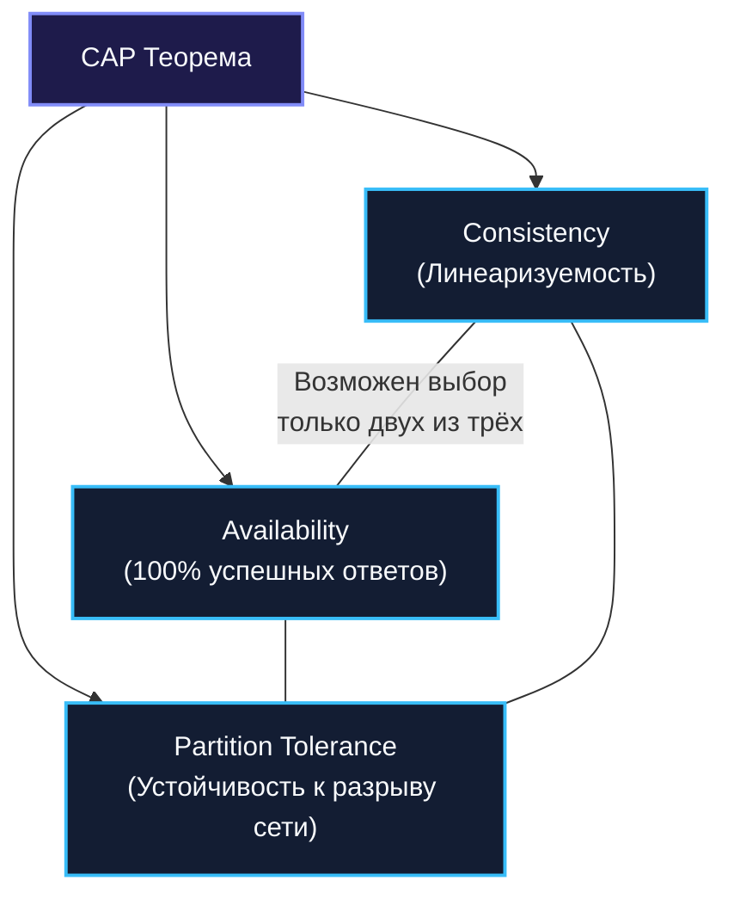
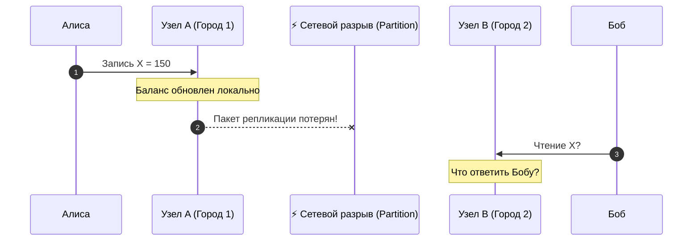
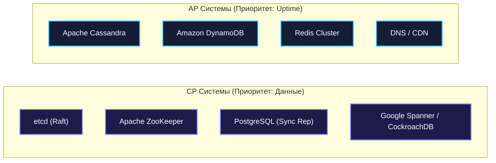

## CAP теорема и реальные компромиссы

В предыдущей главе мы убедились, что в распределённых системах спектр моделей согласованности простирается от строгой линеаризуемости до гибкой сходимости в конечном счёте. Каждая модель представляет собой взвешенный компромисс между корректностью данных и временем отклика.

Однако все эти компромиссы упираются в фундаментальный закон природы, сформулированный профессором Эриком Брюэром (Eric Brewer) в 2000 году и строго математически доказанный Сетом Гилбертом и Нэнси Линч (Seth Gilbert, Nancy Lynch, MIT) в 2002 году — **теорему CAP**.

Для инженера, проектирующего бэкенд на языке Go, CAP-теорема — это не просто теоретический курьёз, а строгий свод законов термодинамики распределённого мира. Подобно тому как физик не пытается построить вечный двигатель, бэкенд-архитектор не пытается создать распределённую систему, одновременно обладающую абсолютной согласованностью и стопроцентной доступностью при обрыве сетевых кабелей.

---

### Что утверждает CAP-теорема

Теорема CAP рассматривает распределённую систему, состоящую из множества независимых узлов, взаимодействующих по асинхронной ненадежной сети, и формулирует три свойства:

1. **Consistency (Согласованность / Линеаризуемость)**:  
   Каждая операция чтения возвращает результат самой последней завершённой операции записи либо ошибку. Для внешнего наблюдателя система выглядит как единая неделимая копия данных, изменяющаяся мгновенно.
2. **Availability (Доступность)**:  
   Каждый запрос от клиента к любому работающему (non-failing) узлу системы обязан завершаться **успешным, осмысленным ответом** (без возврата ошибки `500 Internal Server Error`, исключений тайм-аута или бесконечной блокировки).
3. **Partition Tolerance (Устойчивость к сетевому разделению)**:  
   Система продолжает функционировать, даже если произвольное количество сетевых пакетов задерживается, теряется или сетевой граф распадается на изолированные сегменты (Partitions).



**Формулировка теоремы:**  
В асинхронной распределённой системе при возникновении сетевого разделения (**Partition**) невозможно одновременно гарантировать полную доступность (**Availability**) и строгую согласованность (**Consistency**).  
Инженер обязан выбрать **ровно одно из двух**: либо **CP**, либо **AP**.

---

### Почему невозможно иметь все три одновременно

Чтобы понять непреложность теоремы, проведём наглядный физический мысленный эксперимент.

Представьте два банковских отделения в разных городах: Офис $A$ и Офис $B$. Между ними проложен телеграфный кабель, по которому передаются обновления балансов клиентов.
- На счету Алисы лежит $100.
- Внезапно гроза обрывает телеграфный провод между городами (возникает **сетевое разделение $P$**). Связь между узлом $A$ и узлом $B$ полностью потеряна.
- В эту же минуту Алиса заходит в Офис $A$ и вносит на счёт ещё $50 (баланс в Офисе $A$ становится $150). Узел $A$ не может передать это обновление на узел $B$ через оборванный провод.
- Через 10 секунд Боб заходит в Офис $B$ и просит выдать выписку по счету Алисы.



Перед оператором Офиса $B$ встаёт жёсткая дилемма:

1. **Выбрать Согласованность (CP)**:  
   Оператор говорит: *«Телеграфная линия повреждена. Я не могу связаться с Офисом $A$ и не знаю, совершались ли там операции. В выдаче выписки отказано»*.  
   Система осталась **Consistent** (не выдала ложь), но пожертвовала **Availability** (клиент ушёл ни с чем).
2. **Выбрать Доступность (AP)**:  
   Оператор говорит: *«По нашим утренним данным, баланс составляет $100, вот ваша выписка»*.  
   Система осталась **Available** (клиент получил ответ), но пожертвовала **Consistency** (выписка содержит устаревшие, ложные данные).

Никакой алгоритм, никакой суперкомпьютер и никакой искусственный интеллект не способны обойти это ограничение, потому что **информация не может передаваться быстрее света через отсутствующий физический проводник**.

> [!info] Под капотом
> Гилберт и Линч математически доказали: пока задержка сетевого сообщения не ограничена жёсткой константой (асинхронная сеть), невозможно отличить упавший узел от узла, связь с которым задерживается маршрутизатором.  
> «Сетевое разделение» — это не обязательно полное перерезание кабеля. Это может быть потеря 5% пакетов, перегрузка буферов сетевой карты (tail drops), деградация BGP-маршрутизации или «серые сбои» (gray failures), когда трафик проходит асимметрично в одну сторону.

---

### CP vs AP: реальные системы

В реальном мире распределённые базы данных и хранилища проектируются с явным уклоном в одну из парадигм.



#### CP-системы (Consistency + Partition Tolerance)
При сетевом разрыве узлы, оказавшиеся в меньшинстве (без кворума), **отказываются обслуживать запросы на запись**, защищая систему от рассинхронизации:
- **etcd**: Координатор кластера Kubernetes. Основан на консенсусе Raft. Если узел потерял связь с кворумом, он не принимает записи и возвращает ошибку.
- **ZooKeeper**: Применяет протокол Zab. При разрыве кворума переходит в режим ожидания перевыборов.
- **PostgreSQL с синхронной репликацией**: Если реплика недоступна, мастер блокирует транзакцию, не давая коммитить данные без подтверждения.

#### AP-системы (Availability + Partition Tolerance)
Каждый узел продолжает обслуживать запросы на чтение и запись, используя локальные копии данных, допуская временное расхождение:
- **Apache Cassandra / ScyllaDB**: Архитектура без единого лидера (Leaderless). Узлы принимают записи локально и реплицируют их асинхронно по протоколу Gossip.
- **Amazon DynamoDB**: По умолчанию ориентирована на доступность с моделью Eventual Consistency.
- **Redis Cluster**: Допускает асинхронную репликацию на слейвы, продолжая отвечать даже при временной изоляции мастера.
- **DNS**: Общемировая система разрешения доменных имён. Доступность 100%, но распространение изменений занимает часы.

---

### Go и CAP: как выбор влияет на код

При проектировании микросервисов на Go архитектурный выбор между CP и AP проявляется непосредственно в обработчиках ошибок и стратегиях работы с контекстом `context.Context`.

#### 1. Реализация CP-подхода в Go-сервисе

Если бизнес-требования диктуют CP (например, блокировка ресурса или списание инвентаря), при недоступности консенсуса сервис **обязан возвращать клиенту явную ошибку**:

```go
package cap

import (
	"context"
	"fmt"
	"time"

	clientv3 "go.etcd.io/etcd/client/v3"
)

type CPConfigService struct {
	etcdClient *clientv3.Client
}

func (s *CPConfigService) GetConfig(ctx context.Context, key string) ([]byte, error) {
	// Жесткий таймаут для предотвращения бесконечного зависания горутины
	ctx, cancel := context.WithTimeout(ctx, 2*time.Second)
	defer cancel()

	// По умолчанию в etcd чтение линеаризуемо (кворумное CP-чтение)
	resp, err := s.etcdClient.Get(ctx, key)
	if err != nil {
		// Важно: при потере кворума etcd возвращает ошибку.
		// В CP-системе мы обязаны вернуть ошибку вызывающей стороне!
		return nil, fmt.Errorf("config cluster partition or quorum lost: %w", err)
	}

	if len(resp.Kvs) == 0 {
		return nil, fmt.Errorf("key not found: %s", key)
	}

	return resp.Kvs[0].Value, nil
}
```

#### 2. Реализация AP-подхода с плавной деградацией (Fallback)

Если сервис проектируется как AP (каталог товаров, лента новостей), код при отказе основного источника правды возвращает закешированные или устаревшие данные:

```go
package cap

import (
	"context"
	"fmt"
	"log"

	"github.com/redis/go-redis/v9"
)

type APProfileService struct {
	primaryDB *redis.Client // Основное хранилище
	localMem  map[string]*Profile
}

type Profile struct {
	ID   string
	Bio  string
	Stale bool
}

func (s *APProfileService) GetProfile(ctx context.Context, id string) (*Profile, error) {
	// 1. Попытка запроса к основному хранилищу
	val, err := s.primaryDB.Get(ctx, "profile:"+id).Result()
	if err == nil {
		return &Profile{ID: id, Bio: val, Stale: false}, nil
	}

	// 2. В случае сетевого сбоя или таймаута: отдаём устаревшие данные (Fallback)
	if cached, ok := s.localMem[id]; ok {
		log.Printf("WARN: основная база недоступна; отдаем устаревшие данные для профиля %s", id)
		cached.Stale = true
		return cached, nil // Доступность сохранена ценой согласованности!
	}

	return nil, fmt.Errorf("profile completely unavailable: %w", err)
}
```

> [!warning] Ловушка / Gotcha: Миф о существовании «CA»-систем
> В популярной литературе часто рисуют треугольник CAP и утверждают, что можно выбрать комбинацию «Consistency + Availability», отказавшись от Partition Tolerance (**CA**).  
> **Это опаснейшее заблуждение!**  
> В распределённой системе, работающей поверх реальных сетей, отказаться от Partition Tolerance невозможно физически: оптоволокно рвётся, коммутаторы зависают, сетевые карты сбоят. Система не может «запретить сети разделяться».  
> Так называемая «CA-система» — это обычный **монолит с одной базой данных на одном физическом сервере**. Но как только у вас появляется хотя бы два сервера, соединённых кабелем, вы **вынуждены быть P-устойчивыми**, и ваш реальный выбор лежит строго между **CP** и **AP**.

---

### PACELC: расширение CAP

Теорема CAP описывает поведение системы в экстремальный момент — во время аварии и сетевого разрыва ($P$). Но в 99.9% времени сеть в дата-центрах исправна! Означает ли это, что в штатном режиме компромиссы исчезают?

В 2012 году профессор Даниэль Абади (Daniel Abadi, Yale University) доказал, что компромисс существует всегда, и сформулировал теорему **PACELC**:

$$	ext{If } \mathbf{P} 	ext{ (Partition)} \implies 	ext{choose } [\mathbf{A} \lor \mathbf{C}], \quad \mathbf{E} 	ext{lse} \implies 	ext{choose } [\mathbf{L} \lor \mathbf{C}]$$

- Если есть **P**artition: выбираем между **A**vailability и **C**onsistency.
- **E**lse (в штатном режиме): выбираем между **L**atency (временем отклика) и **C**onsistency (строгой свежестью).

Даже когда оптоволокно исправно, синхронная запись в кворум из трёх узлов требует сетевого ожидания (RTT). Если вы хотите, чтобы `P99 Latency` было менее 1 миллисекунды, вы обязаны отказаться от синхронной репликации в пользу асинхронной, выбрав $L$ ценой $C$.

- **PC/EC**: etcd, Spanner, CockroachDB (жертвуют доступностью в аварии и латентностью в штатном режиме ради строгой согласованности).
- **PA/EL**: DynamoDB, Cassandra, Couchbase (жертвуют консистентностью и в аварии, и в штатном режиме ради ультранизкой задержки и 100% аптайма).

---

### Mechanical Sympathy: CAP и Go-рантайм

Как выбор архитектуры CP vs AP отражается на поведении компилятора, рантайма и планировщика Go?

1. **CP-системы и налог на планировщик Go**:  
   В CP-системах горутины висят на сетевых I/O-вызовах в ожидании подтверждения от кворума нод. Сетевой поллер (`netpoller`) Go паркует горутины в неблокирующем системном вызове `epoll_wait`. Хотя поток ОС не блокируется, дескрипторы сокетов и буферы стека (~2–8 КБ на горутину) остаются занятыми. При возникновении сетевой задержки (Network Jitter) количество зависших горутин может лавинообразно вырасти с 1 000 до 100 000, приводя к исчерпанию RAM и резкому росту времени сканирования стеков сборщиком мусора (GC Stop-The-World).  
   **Обязательное правило:** Все CP-вызовы в Go обязаны иметь жесткий `context.WithTimeout`!
2. **AP-системы и налог на CPU**:  
   В AP-системах горутины завершаются за микросекунды, отдавая локальные данные. Однако плата переносится на центральный процессор: алгоритмы дедупликации, слияния версий в CRDT (LWW-Element-Set) и разрешение конфликтов требуют интенсивных вычислений и частых аллокаций памяти при сравнении метаданных.

---

### Реальные компромиссы на System Design интервью

На собеседованиях уровня Senior / Staff Architect интервьюер проверяет не знание аббревиатуры CAP, а умение декомпозировать бизнес-требования на правильные компромиссы.

#### Пример 1: Проектирование платёжного шлюза
- **Бизнес-риск**: Двойное списание баланса или овердрафт ведут к прямым финансовым и регуляторным потерям.
- **Архитектурный вердикт**: **CP**.  
  При сетевом разделении кластера сервис лучше вернёт клиенту ошибку «*Банковский сервис временно недоступен, повторите попытку через минуту*», чем проведёт несогласованную транзакцию. В коде на Go: распределённый консенсус через Raft/2PC, изоляция транзакций `SERIALIZABLE` в PostgreSQL.

#### Пример 2: Проектирование ленты новостей или счётчика лайков
- **Бизнес-риск**: Если пользователь не увидит новый пост друга в ту же секунду — ничего страшного не произойдёт. Но если приложение покажет пустой экран с ошибкой `500`, пользователь уйдёт к конкурентам.
- **Архитектурный вердикт**: **AP**.  
  Данные кэшируются на всех уровнях, реплицируются асинхронно, чтение выполняется с локальных реплик.

---

### Связь с другими архитектурными паттернами

- **Кэширование** ([[28. Кэширование. Cache Aside, Write Through, Write Back]]): Добавление кэша (Cache-Aside) немедленно сдвигает архитектуру в сторону AP/EL, отдавая приоритет скорости чтения ценой устаревания данных.
- **Saga** ([[26. Saga Pattern. Оркестрация и хореография]]): Отказ от 2PC в пользу компенсирующих транзакций — это классический переход от хрупкой CP-модели к высокодоступной AP-модели на базе Eventual Consistency.
- **Event Sourcing** ([[24. Event Sourcing. Хранение событий вместо состояния]]): Может быть настроен как CP (аппенд в строгий кворумный журнал PostgreSQL) или как AP (публикация в Kafka с последующей фоновой обработкой).
- **CQRS** ([[23. CQRS. Разделение чтения и записи]]): Идеально балансирует CAP: командная модель (Write) проектируется как CP, а витрины чтения (Read Models) масштабируются как AP.

---

### Не «2 из 3», а управляемый компромисс

В современной практике распределённые хранилища больше не являются бинарно «черными» или «белыми». Они предоставляют **динамически настраиваемые уровни согласованности**:
- **Cassandra**: уровни `CONSISTENCY ONE` (AP), `CONSISTENCY QUORUM` (баланс) и `CONSISTENCY ALL` (CP).
- **DynamoDB**: вызов `GetItem` с параметром `ConsistentRead: true` (CP) или со стандартным eventual consistency чтением без этого флага (AP).
- **etcd**: выбор между чтением `Serializable` (быстрое чтение с локальной ноды, AP) и `Linearizable` (кворумное чтение через Raft, CP).


В современной практике распределённые хранилища больше не являются бинарно «черными» или «белыми». Они предоставляют **динамически настраиваемые уровни согласованности**:

```go
package main

import (
	"context"

	"github.com/gocql/gocql"
)

func QueryCassandraWithTunableConsistency(session *gocql.Session, query string) {
	// Сценарий AP: читаем с одной локальной ноды с минимальной задержкой
	fastQuery := session.Query(query).Consistency(gocql.One)
	_ = fastQuery.Exec()

	// Сценарий CP: читаем с кворума узлов для гарантии строгой свежести
	strictQuery := session.Query(query).Consistency(gocql.Quorum)
	_ = strictQuery.Exec()
}
```

В Go-клиентах для Cassandra (`gocql`), DynamoDB (`aws-sdk-go-v2`) и etcd разработчик может выбирать уровень строгости индивидуально для каждой бизнес-операции: критичные операции выполнять через `QUORUM`, а второстепенные — через `ONE`.

---

> [!tip] Собеседование
> **Вопрос:** Докажите на конкретном примере, почему в распределённой системе невозможно одновременно гарантировать Consistency и Availability при наличии Partition? Приведите примеры поведения CP и AP систем из продакшена.
> 
> **Ответ:**  
> Представим систему из двух узлов $A$ и $B$. Между ними произошёл обрыв сети (Partition).  
> Клиент выполняет запись $X=10$ на узел $A$. Из-за разрыва сети узел $A$ не может доставить обновление на узел $B$.  
> В этот же момент второй клиент выполняет чтение переменной $X$ с узла $B$.  
> - Если узел $B$ ответит на запрос и вернёт старое значение $X=9$, система остаётся доступной, но **нарушает согласованность** (вернулись некорректные данные). Это поведение **AP** (например, Cassandra с `ConsistencyLevel: ONE`).
> - Если узел $B$ откажет в обслуживании или заблокирует запрос до восстановления связи, система сохраняет согласованность, но **нарушает доступность** (клиент получил ошибку). Это поведение **CP** (например, etcd возвращает ошибку `etcdserver: request timed out` при потере кворума).  
> Третьего исхода в физической реальности не существует.

---

### Итог

Теорема CAP — это компас архитектора в бурном океане распределённых систем. Она учит нас главному: идеальной архитектуры без компромиссов не бывает. Каждый раз, проектируя сетевое взаимодействие сервисов, вы делаете осознанный выбор между надежностью данных и непрерывностью их отдачи.

Но что делать, если объём данных превышает емкость одного дискового накопителя, а поток запросов сжигает любой мощный сервер? Мы переходим к фундаментальным механизмам масштабирования: шардированию и партиционированию.

Разбираемся в следующей главе: [[31. Partitioning и Sharding]].
