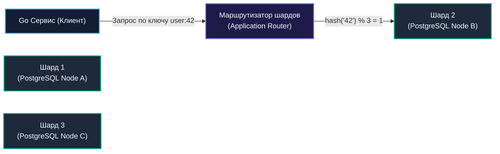
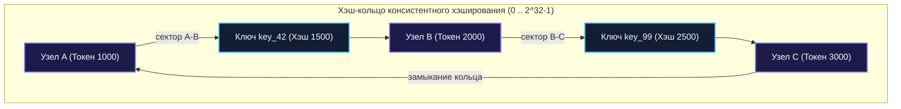

## Партиционирование и шардирование: масштабирование данных

В жизни любого успешного проекта наступает неизбежный день, когда реляционная база данных упирается в физический потолок одного сервера. Таблица заказов или финансовых транзакций разрастается до десятков терабайт, B-tree индексы перестают помещаться в оперативную память (RAM), нагрузка на диск (IOPS) достигает предела пропускной способности шины NVMe, а процессорные ядра захлёбываются в тысячах параллельных запросов `SELECT` и `UPDATE`.

Вертикальное масштабирование (покупка всё более дорогих серверов с терабайтами памяти) имеет жесткий финансовый и физический предел. Единственный фундаментальный путь дальнейшего роста — **горизонтальное разделение данных по нескольким физическим машинам**.

Эту задачу решают две ключевые техники: **партиционирование** и **шардирование**. В этой главе мы досконально разберём их архитектурные различия, математические стратегии маршрутизации ключей (от хэширования до консистентного кольца Каргера), исследуем реализацию шардирования на Go с точки зрения сетевого ввода-вывода и рантайма, а также разберём паттерны выживания при кросс-шардовых запросах и ребалансировке.

---

### Партиционирование vs Шардирование

В инженерном сленге эти понятия нередко путают, однако между ними пролегает чёткая архитектурная граница:

1. **Партиционирование (Partitioning)** — это **логическое разделение** крупной таблицы на физические сегменты (партиции) **в рамках одного экземпляра СУБД**.  
   Для прикладного кода на Go база данных выглядит монолитной: приложение выполняет обычный SQL-запрос `SELECT * FROM orders WHERE created_at = $1`, а оптимизатор СУБД сам исключает ненужные разделы (механизм Partition Pruning) и читает только нужный файл на диске. Классический пример — `PARTITION BY RANGE (created_at)` в PostgreSQL.
2. **Шардирование (Sharding)** — это **физическое распределение** данных между несколькими независимыми экземплярами СУБД (шардами), каждый из которых запущен на отдельном физическом сервере или виртуальной машине со своим CPU, RAM и диском.  
   Шарды не знают о существовании друг друга. Приложение Go (или специализированный распределённый прокси-слой вроде Vitess или Citus) обязано самостоятельно вычислять, на какой конкретный шард направить сетевое соединение.

Обе техники направлены на горизонтальное масштабирование данных ([[6. Вертикальное и горизонтальное масштабирование]]), но требуют принципиально разного уровня вовлечённости прикладного кода.



---

### Стратегии шардирования

Выбор ключа шардирования (Sharding Key) и математической функции отображения ключа на номер шарда — это самое ответственное архитектурное решение. Неудачный выбор приведёт к образованию «горячих точек» (Hotspots), когда один узел перегружен на 100%, а остальные простаивают.

---

#### 1. Шардирование по диапазону ключей

Данные распределяются по непрерывным диапазонам значений ключа. Например:
- Шард 1: `ID` от 1 до 1 000 000;
- Шард 2: `ID` от 1 000 001 до 2 000 000;
- Шард 3: `ID` от 2 000 001 до 3 000 000.
Аналогично для дат: Шард Январь, Шард Февраль и т.д.

**Плюсы:**
- **Простота реализации**: Маршрутизатор хранит простую таблицу соответствия диапазонов.
- **Эффективные диапазонные запросы**: Запрос `WHERE id BETWEEN 500 AND 1000` направляется строго на один узел.

**Минусы:**
- **Катастрофический дисбаланс нагрузки (Hotspots)**: В системах с монотонно возрастающими ID (автоинкремент или timestamp) **100% новых операций записи приходятся на самый последний шард**. Предыдущие шарды превращаются в архив, а последний задыхается от нагрузки.
- **Тяжёлая ручная ребалансировка**: При заполнении диапазона требуется нарезать новые таблицы и перенастраивать границы.

---

#### 2. Хэш-шардирование

Значение ключа шардирования пропускается через детерминированную хэш-функцию, а целевой узел вычисляется через операцию взятия остатка от деления (по модулю числа шардов $N$):
$$	ext{Shard Index} = 	ext{hash}(	ext{key}) \pmod N$$

В качестве хэш-функции используются быстрые некриптографические алгоритмы: `crc32`, `murmur3`, `fnv` или `xxhash`.

**Плюсы:**
- **Идеально равномерное распределение**: Хэш псевдослучайно и равномерно размазывает записи по всем узлам кластера, предотвращая возникновение горячих шардов.
- **Детерминизм и скорость**: Индекс шарда вычисляется за десятки наносекунд в оперативной памяти без сетевых запросов к метаданным.

**Минусы:**
- **Невозможность диапазонных запросов**: Соседние записи `id=1` и `id=2` окажутся на совершенно разных серверах. Любой `SELECT WHERE id BETWEEN 1 AND 100` превращается в тяжелейший опрос всех шардов.
- **Коллапс при изменении числа шардов**: Если у вас было 4 шарда, а вы добавили 5-й, формула $	ext{hash}(	ext{key}) \pmod 5$ изменит целевой узел почти для **80% всех существующих ключей**! Требуется тотальная миграция всех терабайт данных.

---

#### 3. Консистентное хэширование

Для решения проблемы масштабирования кластеров Дэвид Каргер (David Karger) в 1997 году предложил концепцию **консистентного хэширования (Consistent Hashing)**.

Математическое пространство значений хэш-функции проецируется на замкнутое логическое кольцо (от $0$ до $2^{32}-1$). На этом кольце размещаются как сами физические узлы (шарды), так и ключи данных. Ключ приписывается первому узлу, встречающемуся на кольце при движении по часовой стрелке.



**Главное математическое свойство:**  
При добавлении нового $N+1$-го узла в кольцо перемещается лишь небольшая доля ключей:
$$	ext{Rebalanced Keys} pprox rac{K}{N+1}$$
где $K$ — общее количество ключей, а $N$ — число узлов. Остальные $N$ узлов продолжают работать со своими данными без изменений!

Для предотвращения неравномерного разбиения кольца каждый физический сервер представляют в виде десятков или сотен **виртуальных узлов (vnodes)**, равномерно перемешанных по всему периметру.

---

### Реализация в Go: маршрутизация на уровне приложения

В архитектуре Go-сервиса маршрутизатор шардов представляет собой компактную структуру, управляющую пулом соединений `*sql.DB` к каждому независимому серверу базы данных.

```go
package sharding

import (
	"context"
	"database/sql"
	"fmt"
	"hash/crc32"
	"sync"
)

type ShardRouter struct {
	shards []*sql.DB
	hash   func(key string) uint32
}

func NewShardRouter(shards []*sql.DB) *ShardRouter {
	return &ShardRouter{
		shards: shards,
		hash: func(key string) uint32 {
			// IEEE таблица CRC32 — аппаратное ускорение на CPU (инструкция CRC32 в x86 SSE4.2)
			return crc32.ChecksumIEEE([]byte(key))
		},
	}
}

// GetShard детерминированно возвращает пул базы данных для заданного ключа
func (r *ShardRouter) GetShard(key string) *sql.DB {
	h := r.hash(key)
	idx := int(h) % len(r.shards)
	return r.shards[idx]
}

type User struct {
	ID   string
	Name string
}

type Service struct {
	router *ShardRouter
}

func (s *Service) GetUser(ctx context.Context, userID string) (*User, error) {
	// Маршрутизация запроса на конкретный шард
	db := s.router.GetShard(userID)

	var u User
	err := db.QueryRowContext(ctx, "SELECT id, name FROM users WHERE id = $1", userID).Scan(&u.ID, &u.Name)
	if err != nil {
		return nil, fmt.Errorf("failed to query user on shard: %w", err)
	}

	return &u, nil
}
```

> [!info] Под капотом
> При хэш-шардировании критически важно выбирать функцию хэширования, которая не производит аллокаций в Heap и выполняется за минимальное число тактов CPU. Пакеты `hash/crc32` и `hash/fnv` из стандартной библиотеки Go работают на уровне срезов байтов без лишнего давления на сборщик мусора. Использование криптографических хэшей (`crypto/sha256`, `md5`) — классический антипаттерн: они в 15–20 раз медленнее и сжигают такты процессора на ровном месте.

---

### Проблемы шардирования и их решение в Go

Разбиение единой СУБД на независимые шарды влечёт за собой сложнейшие алгоритмические вызовы.

---

#### 1. Кросс-шардовые запросы (Scatter-Gather)

Что делать, если клиенту нужен поиск не по первичному ключу шардирования, а по вторичному признаку (например, `SELECT * FROM users WHERE name = 'Ivan'`)?

Сервер не знает, на каком шарде живёт пользователь Иван. Приложению приходится применять паттерн **Scatter-Gather (Рассылка-Сборка)**: запрос параллельно отправляется на **все** шарды, а горутины агрегируют результаты.

```go
package sharding

import (
	"context"
	"database/sql"
	"sync"
)

func (s *Service) SearchUsersByName(ctx context.Context, name string) ([]*User, error) {
	var wg sync.WaitGroup
	resultsChan := make(chan *User, 100)
	errCh := make(chan error, len(s.router.shards))

	// Scatter: веерный запуск горутин по всем шардам
	for _, db := range s.router.shards {
		wg.Add(1)
		go func(targetDB *sql.DB) {
			defer wg.Done()

			rows, err := targetDB.QueryContext(ctx, "SELECT id, name FROM users WHERE name = $1", name)
			if err != nil {
				errCh <- err
				return
			}
			defer rows.Close()

			for rows.Next() {
				var u User
				if err := rows.Scan(&u.ID, &u.Name); err == nil {
					resultsChan <- &u
				}
			}
		}(db)
	}

	// Фоновый сборщик завершения горутин
	go func() {
		wg.Wait()
		close(resultsChan)
		close(errCh)
	}()

	// Gather: агрегация результатов в единый срез
	var users []*User
	for u := range resultsChan {
		users = append(users, u)
	}

	if len(errCh) > 0 {
		return users, <-errCh
	}

	return users, nil
}
```

> [!warning] Ловушка / Gotcha: Сетевой шторм при кросс-шардовых запросах
> Выполнение запроса Scatter-Gather по 64 шардам одновременно задействует 64 сетевых соединения из пулов `*sql.DB`.  
> Если 1 000 клиентов одновременно вызовут такой поиск, система попытается открыть 64 000 параллельных сокетов! Пулы соединений базы данных мгновенно исчерпаются, планировщик захлебнётся в переключении горутин, а латентность P99 вырастет до секунд.  
> **Решение:** Никогда не выполняйте Scatter-Gather без ограничения параллелизма (ограничивайте веер через семафор `golang.org/x/sync/semaphore`) и выносите вторичные индексы в специализированные поисковые движки (Elasticsearch, Meilisearch) или глобальные индексные таблицы.

---

#### 2. Обеспечение глобальной уникальности

В шардированной системе классический `BIGSERIAL` или `AUTO_INCREMENT` бесполезен: каждый шард начнёт нумерацию с 1, и у вас мгновенно появятся дублирующиеся ID.

Индустрия выработала три основных решения:

1. **UUID v4 / UUID v7**:  
   128-битные идентификаторы. UUID v4 генерируется полностью случайно, что приводит к фрагментации дисковых B-tree индексов в PostgreSQL. Современный стандарт **UUID v7** решает эту проблему: первые 48 бит содержат Unix-таймстемп в миллисекундах, обеспечивая естественную монотонную сортировку.
2. **Алгоритм Twitter Snowflake**:  
   64-битный целочисленный ID, идеально подходящий для индексов `BIGINT`. Кодирует время, ID машины/шарда и локальную последовательность:

```
+--------------------------------------------------------------------------+
| 1 бит | 41 бит: timestamp (мс) | 10 бит: machine ID | 12 бит: sequence   |
+--------------------------------------------------------------------------+
```

##### Реализация генератора Snowflake на Go с атомиками:

```go
package snowflake

import (
	"os"
	"sync/atomic"
	"time"
)

var (
	counter   uint64
	machineID = uint64(os.Getpid()) % 32 // 5 бит на номер ноды (0..31)
)

func GenerateID() uint64 {
	// 41 бит: миллисекунды от кастомной эпохи
	ts := uint64(time.Now().UnixMilli()) << 23
	// 12 бит: порядковый номер операции
	seq := atomic.AddUint64(&counter, 1) & 0x7FFFF
	// Компоновка в 64-битное число
	return ts | (machineID << 18) | seq
}
```

3. **Централизованный сервис ID (Ticket Server)**:  
   Отдельная база данных (например, таблица в MySQL с автоинкрементом), выдающая диапазоны ID пачками по 10 000 номеров. Риск: единая точка отказа (SPOF).

---

#### 3. Ребалансировка (Rebalancing)

Когда шарды заполняются, кластер требует добавления новых серверов. Перенос данных «на лету» без остановки продакшена — одна из сложнейших задач распределённых систем:

1. **Этап 1: Двойная запись (Dual-Write)**. Приложение начинает писать новые данные одновременно в старый и новый шард.
2. **Этап 2: Фоновый бэкфилл (Backfill)**. Фоновый воркер порциями вычитывает исторические данные из старого шарда и переносит их на новый, пропуская уже обновлённые записи.
3. **Этап 3: Сверка (Reconciliation / Audit)**. Сравнение контрольных сумм данных.
4. **Этап 4: Переключение чтения**. Приложение начинает читать с нового шарда.
5. **Этап 5: Отключение старого шарда**.

---

### Mechanical Sympathy: влияние шардирования на рантайм Go

1. **Многократное раздувание пулов соединений (`database/sql`)**:  
   В монолите вы настраиваете `db.SetMaxOpenConns(50)`. В шардированной системе из 20 шардов каждый инстанс Go держит 20 независимых пулов! Если под Kubernetes откроет по 20 коннектов к каждому шарду, это $20 	imes 20 = 400$ открытых TCP-сокетов на один под. При 50 подах это 20 000 соединений к базам данных.  
   **Оптимизация:** Тщательный расчёт `MaxOpenConns` и вынос соединений в пулеры транзакций (PgBouncer, Odyssey).
2. **Нагрузка на сборщик мусора при мерджинге (Scatter-Gather)**:  
   Объединение срезов `[]*User` из 20 горутин требует аллокации единого результирующего среза. Выделение памяти под тысячи объектов в куче нагружает GC. Использование пулов `sync.Pool` для временных байтовых буферов и предвыделение капасити `make([]*User, 0, expectedCount)` кардинально снижает паузы сборщика мусора.
3. **Разрушение кэш-локальности процессора**:  
   В монолите связанные данные (`orders` и `order_items`) лежат в смежных блоках диска и попадают в общий кэш страниц ОС. В шардированной системе они могут оказаться на разных серверах, разрушая кэш-локальность. Всегда выбирайте ключ шардирования так, чтобы **связанные сущности жили на одном шарде** (Co-location).

---

### Связь с другими архитектурными концепциями

- **CAP теорема** ([[30. CAP теорема и реальные компромиссы]]): Разнесение данных по шардам увеличивает вероятность частичных сетевых разрывов. Если один шард изолирован, архитектура решает: ответить клиенту ошибкой (CP) или отдать неполный результат с пометкой `partial: true` (AP).
- **Репликация** ([[32. Репликация. Leader Follower и Multi Leader]]): Шардирование решает проблему объема и масштабирования записи, но не обеспечивает отказоустойчивость. На практике каждый отдельный шард представляет собой отказоустойчивую репликационную группу (Master-Replica или Raft-кластер).
- **Кэширование** ([[28. Кэширование. Cache Aside, Write Through, Write Back]]): Слой Redis, выставленный перед шардированной СУБД, маскирует задержки дорогих кросс-шардовых операций.

---

### Шардирование на уровне инфраструктуры

В современных облачных архитектурах инженеры всё реже пишут самописные маршрутизаторы шардов на Go, отдавая предпочтение готовым инфраструктурным решениям:

- **Citus Data (PostgreSQL)**: Расширение ядра PostgreSQL, превращающее его в распределённую СУБД с узлом-координатором и воркерами.
- **Vitess**: Высокопроизводительный прокси-слой для шардирования MySQL (созданный в YouTube для обслуживания петабайтных баз).
- **CockroachDB / YugabyteDB**: Распределённые СУБД нового поколения (NewSQL), реализующие автоматическое шардирование на непрерывные диапазоны (Ranges / Tablets) с консенсусом Raft на аппаратном уровне.

Для Go-приложения работа с такой базой выглядит как стандартное подключение через `pgxpool.Connect` или `database/sql` к единой точке входа:

```go
package infrastructure

import (
	"context"

	"github.com/jackc/pgx/v5/pgxpool"
)

func ConnectToDistributedDB(ctx context.Context) (*pgxpool.Pool, error) {
	// Подключение к Citus через стандартный pgx
	conn, err := pgxpool.New(ctx, "postgres://citus-coordinator:5432/db")
	if err != nil {
		return nil, err
	}
	// Все запросы прозрачно шардируются координатором
	return conn, nil
}
```

---

### Антипаттерны

1. **Преждевременное шардирование**:  
   Шардирование базы данных объемом 15 гигабайт и нагрузкой 200 RPS — это создание колоссальной инженерной сложности без малейшей пользы. Вертикальное масштабирование одного сервера и грамотные индексы решают 95% задач.
2. **Несогласованность схем на разных шардах**:  
   Применение миграций `golang-migrate` или `goose` должно быть строго автоматизировано и атомарно раскатываться по всем шардам одновременно.
3. **Игнорирование мониторинга дисбаланса**:  
   Отсутствие алертов на перекос распределения размера таблиц и CPU по шардам неизбежно приведёт к падению самого нагруженного узла.

---

> [!tip] Собеседование
> **Вопрос:** Таблица истории финансовых транзакций растёт на 1.5 ТБ в месяц, чтение выполняется преимущественно по `account_id` и диапазону дат. Как спроектировать схему шардирования и хранения в Go-микросервисе?
> 
> **Ответ:**  
> Я выберу комбинированный подход: **Шардирование + Партиционирование**:
> 1. **Ключ шардирования: `account_id` с консистентным хэшированием**.  
>    Все транзакции одного пользователя гарантированно попадают на один физический шард. Это устраняет необходимость в дорогом кросс-шардовом Scatter-Gather для 99% клиентских запросов выписки.
> 2. **Локальное партиционирование внутри каждого шарда: `PARTITION BY RANGE (created_at)` по месяцам**.  
>    Запросы с фильтром по дате мгновенно отсекают ненужные партиции (Partition Pruning). Старые архивные партиции можно легко сбрасывать в дешевое хранилище (S3/Cold Storage) через `DROP/DETACH PARTITION`.
> 3. **Генерация ID**: Алгоритм **Snowflake** (или UUID v7), упорядоченный по времени, для исключения коллизий первичных ключей между серверами.
> 4. **Маршрутизация**: Использование проверенной библиотеки `hashring` в Go с пулом соединений к каждому шарду под контролем семафоров.

---

### Итог

Шардирование — это архитектурный рубеж, отделяющий локальные серверы от истинных распределённых систем масштаба Big Data. Оно снимает оковы с объема дисков и памяти, но навязывает суровые правила игры: отказ от распределённых JOIN, проектирование Scatter-Gather запросов и контроль уникальности ID.

Грамотный архитектор на Go строит шардирование так, чтобы прикладной код был защищен от сетевых штормов, а связанные сущности жили на одних узлах.

Но разделение данных само по себе не защищает от сгорания жесткого диска или падения стойки дата-центра. Чтобы данные не погибли, их необходимо дублировать. В следующей главе мы разберём механизмы репликации: [[32. Репликация. Leader Follower и Multi Leader]].
