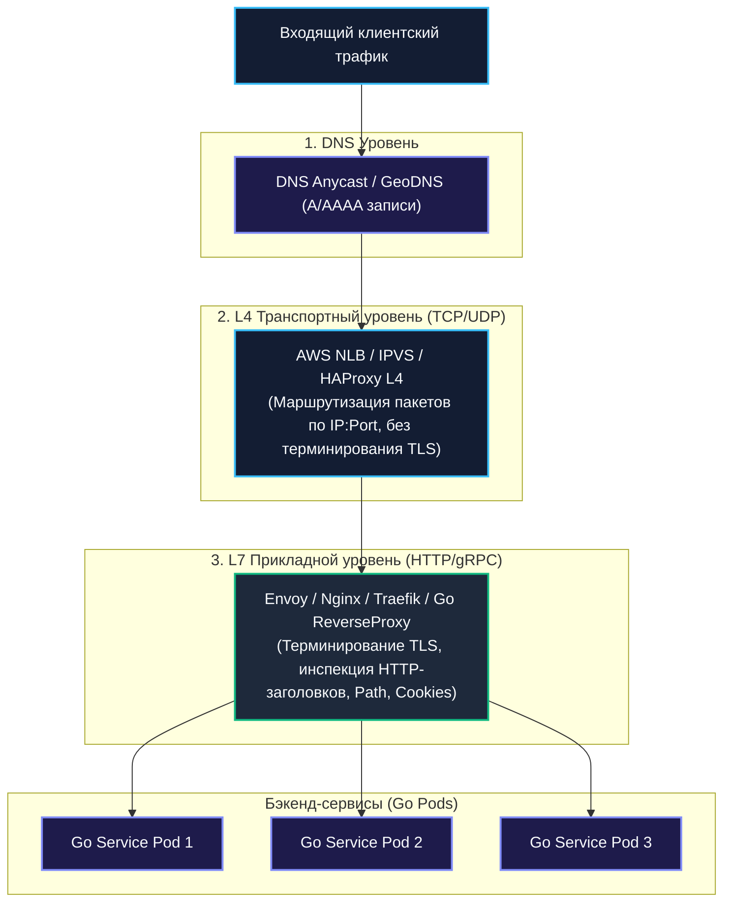
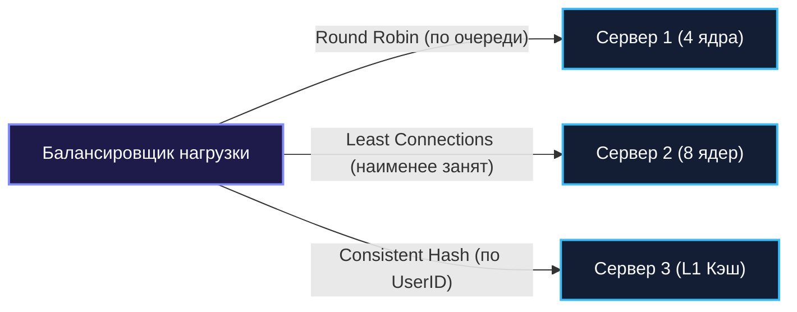

## Балансировка нагрузки на уровне архитектуры

В проектировании высоконагруженных систем масштабирование сервисов и репликация баз данных — это лишь половина пути. Вы можете развернуть пятьдесят реплик Go-микросервиса в кластере Kubernetes и поднять десяток read-реплик PostgreSQL, но вся эта распределённая мощь останется бесполезной, если входящий поток клиентского трафика будет неуправляемо врезаться в один случайный сервер.

**Балансировка нагрузки (Load Balancing)** — это центральный нерв распределённой архитектуры. Это диспетчер, который непрерывно решает две ключевые задачи:
1. **Равномерное и справедливое распределение вычислительной работы** между пулом доступных узлов для минимизации среднего времени отклика (Latency) и предотвращения образования «горячих точек» (Hotspots).
2. **Отказоустойчивость и маршрутизация в обход аварий**: непрерывный мониторинг жизнеспособности бэкендов (Health Checking) и моментальное исключение упавших или деградировавших инстансов из пула обслуживания без простоя для конечных пользователей.

В этой главе мы подробно исследуем уровни балансировки L4 и L7, разберём математику алгоритмов от Round Robin до Power of Two Choices (P2C), реализуем высокопроизводительный lock-free прокси на Go с пулами буферов и поймём, почему клиентская балансировка в gRPC перевернула микросервисную архитектуру.

---

### Уровни балансировки нагрузки

В сетевой модели OSI решения о маршрутизации трафика принимаются на разных уровнях абстракции, и каждый уровень диктует свои фундаментальные компромиссы между задержкой, ресурсоёмкостью и гибкостью.



#### Уровень 4 — транспортный (TCP/UDP):
- **Принцип работы**: Маршрутизация пакетов на основе 4-кортежа (Source IP, Source Port, Destination IP, Destination Port). Балансировщик не разбирает протокол прикладного уровня, не парсит HTTP-заголовки и не расшифровывает TLS.
- **Производительность**: Экстремально высокая. Задержка измеряется микросекундами, так как пакеты передаются ядром Linux через eBPF/XDP или IPVS без копирования байтов в пользовательское пространство (Zero-Copy).
- **Примеры**: **AWS NLB**, **HAProxy** (режим TCP), **IPVS** в ядре Linux, аппаратные F5 BIG-IP.
- В Go на этом уровне можно использовать библиотеки вроде `netlink` для управления виртуальными IP (VIP) и таблицами маршрутизации, но на практике L4-балансировку всегда отдают готовым инфраструктурным решениям.

#### Уровень 7 — прикладной (HTTP/gRPC):
- **Принцип работы**: Балансировщик выступает полноценным обратным прокси (Reverse Proxy). Он полностью терминирует входящее TCP-соединение, выполняет TLS-хэндшейк, парсит HTTP/1.1, HTTP/2 или gRPC-фреймы и принимает интеллектуальное решение о маршрутизации на основе URL-пути (`/api/v1/orders`), HTTP-метода, заголовков авторизации или Cookies.
- **Возможности**: Sticky Sessions (сессионная привязка к серверу), канареечные релизы (Canary Deployments, отправка 5% трафика на новую версию), A/B-тестирование, терминирование TLS с централизованным обновлением сертификатов, сжатие Gzip/Brotli.
- **Примеры**: **Envoy Proxy**, **Nginx**, **Traefik**, а также стандартный библиотечный `net/http/httputil.ReverseProxy` в Go.
- **Плата**: Дополнительная задержка (от 1 до 5 мс) на терминирование TCP/TLS и парсинг байтов в пользовательском пространстве.

#### DNS-балансировка:
- Клиент запрашивает IP-адрес домена `api.company.com` и получает от DNS-сервера список из нескольких IP-адресов (DNS Round-Robin).
- **Плюс**: Нулевые накладные расходы на инфраструктуру проксирования; клиент подключается к серверу напрямую.
- **Минус**: Полная невозможность мгновенного вывода упавшего сервера из строя. Браузеры, ОС и провайдерские резолверы кэшируют DNS-записи по TTL (Time-To-Live). При падении сервера часть пользователей будет получать сетевые ошибки в течение десятков минут.
- В Go для разрешения адресов используется системный резолвер (`net.Resolver`), где TTL управляет частотой фоновых обновлений.

---

### Алгоритмы балансировки

Выбор алгоритма определяет, как именно трафик распределяется между живыми узлами пула.

1. **Round Robin (Циклический перебор)**:  
   Запросы по очереди направляются на каждый сервер по кольцу ($1 	o 2 	o 3 	o 1$).  
   *Слабость:* Идеален только при условии, что все запросы абсолютно одинаковы по трудоёмкости, а все серверы обладают идентичным CPU. Если один запрос требует сложной аналитики на 10 секунд, а девять других завершаются за 1 мс, сервер с тяжелым запросом быстро перегрузится.
2. **Least Connections (Минимум соединений)**:  
   Новый запрос направляется на узел, который в данный момент удерживает наименьшее число открытых активных TCP/HTTP соединений. Прекрасно выравнивает нагрузку при длительных операциях (WebSocket, загрузка файлов, gRPC-стримы).
3. **Weighted Round Robin / Least Connections (Взвешенные алгоритмы)**:  
   Серверам присваиваются числовые веса пропорционально их мощности (например, сервер с 64 ядрами получает вес 4, а сервер с 16 ядрами — вес 1).
4. **Consistent Hashing (Консистентное хэширование)**:  
   Запрос хэшируется по ключу (например, `User-ID` или `IP`). Запросы одного пользователя всегда приходят на один и тот же под. Это критично для локального in-memory кэширования и Stateful-сессий, минимизируя сброс кэшей при масштабировании.
5. **Power of Two Choices (P2C / Алгоритм двух случайных выборов)**:  
   Вместо сложного глобального поиска минимально загруженного узла среди 500 серверов (что требует централизованного мьютекса) алгоритм выбирает **два случайных сервера** из пула и направляет запрос тому из двух, у которого меньше активных соединений.  
   *Математическое чудо (Michael Mitzenmacher, 1996):* P2C полностью устраняет узкое горлышко централизованного учета и защищает от эффекта «стада бизонов» (Herd Effect), обеспечивая распределение, практически неотличимое от идеального Least Connections!



---

### Балансировка в Go-сервисах

В экосистеме Go балансировка реализуется в двух фундаментальных ипостасях: на стороне сервера (Reverse Proxy) и на стороне клиента (Client-Side Balancing).

---

#### Серверная балансировка с Reverse Proxy

Стандартный пакет `net/http/httputil` предоставляет готовый промышленный компонент `ReverseProxy`. Для реализации балансировщика пула бэкендов в Go на 100 000 RPS нельзя использовать наивный `sync.Mutex` — он превратится в точку дикой блокировки ядер CPU. Мы применяем атомарный счетчик:

```go
package loadbalancer

import (
	"context"
	"net/http"
	"net/http/httputil"
	"net/url"
	"sync/atomic"
	"time"
)

type Backend struct {
	URL          *url.URL
	Alive        atomic.Bool
	ReverseProxy *httputil.ReverseProxy
}

type AtomicLoadBalancer struct {
	backends []*Backend
	counter  uint64
}

func NewAtomicLoadBalancer(targets []string) (*AtomicLoadBalancer, error) {
	var backends []*Backend

	// Настройка оптимизированного HTTP-транспорта с пулом TCP-коннектов
	transport := &http.Transport{
		MaxIdleConns:        1000,
		MaxIdleConnsPerHost: 200,
		IdleConnTimeout:     90 * time.Second,
	}

	for _, target := range targets {
		u, err := url.Parse(target)
		if err != nil {
			return nil, err
		}

		rp := httputil.NewSingleHostReverseProxy(u)
		rp.Transport = transport

		b := &Backend{
			URL:          u,
			ReverseProxy: rp,
		}
		b.Alive.Store(true)
		backends = append(backends, b)
	}

	return &AtomicLoadBalancer{backends: backends}, nil
}

func (lb *AtomicLoadBalancer) nextIndex() int {
	// Lock-free вычисление следующего индекса по Round-Robin
	return int(atomic.AddUint64(&lb.counter, 1) % uint64(len(lb.backends)))
}

func (lb *AtomicLoadBalancer) ServeHTTP(w http.ResponseWriter, r *http.Request) {
	// Поиск живого бэкенда с ограничением числа попыток
	attempts := len(lb.backends)
	for i := 0; i < attempts; i++ {
		idx := lb.nextIndex()
		backend := lb.backends[idx]

		if backend.Alive.Load() {
			backend.ReverseProxy.ServeHTTP(w, r)
			return
		}
	}

	// Если все бэкенды мертвы — возвращаем 503
	http.Error(w, "All backend services unavailable", http.StatusServiceUnavailable)
}
```

---

#### Клиентская балансировка в gRPC

В протоколе gRPC (работающем поверх HTTP/2) все вызовы между двумя сервисами мультиплексируются **внутри одного постоянного TCP-соединения**.

> [!warning] Ловушка / Gotcha: gRPC и L4-балансировщики
> Если поставить перед пулом gRPC-сервисов балансировщик уровня L4 (AWS NLB или обычный TCP Reverse Proxy), то клиентский сервис установит ровно один TCP-сокет к балансировщику. Балансировщик перенаправит этот TCP-сокет на один конкретный инстанс бэкенда.  
> В результате **все миллионы последующих gRPC-запросов пойдут на этот единственный узел**, а остальные 49 серверов будут простаивать с нулевой нагрузкой!  
> **Вывод:** Для gRPC необходим либо L7-прокси (Envoy), разбирающий HTTP/2 фреймы, либо **клиентская балансировка (Client-Side Balancing)**.

В Go клиентская балансировка gRPC встроена в ядро фреймворка:

```go
package grpcclient

import (
	"context"
	"log"

	"google.golang.org/grpc"
	"google.golang.org/grpc/credentials/insecure"
)

func ConnectWithClientBalancing(ctx context.Context) (*grpc.ClientConn, error) {
	// Сервисный конфиг задаёт политику балансировки round_robin
	serviceConfig := `{"loadBalancingConfig": [{"round_robin":{}}]}`

	// Префикс dns:/// заставляет gRPC-резолвер опрашивать все A-записи домена
	conn, err := grpc.DialContext(ctx,
		"dns:///myservice-headless.default.svc.cluster.local:8080",
		grpc.WithTransportCredentials(insecure.NewCredentials()),
		grpc.WithDefaultServiceConfig(serviceConfig),
	)
	if err != nil {
		return nil, err
	}

	log.Println("gRPC клиент успешно инициализирован с клиентским Round-Robin")
	return conn, nil
}
```

Для тонкого управления узлами подключается `clientconn` с кастомным интерфейсом `balancer.Builder`, интегрирующимся с Service Discovery (etcd/Consul).

---

### Client-Side vs Server-Side Discovery

С архитектурной точки зрения балансировка неразрывно связана с обнаружением сервисов (**Service Discovery**, см. детальный разбор в [[34. Service Discovery. Client side и Server side]]):

| Критерий | Server-Side Balancing (Reverse Proxy) | Client-Side Balancing (gRPC / Smart Client) |
|---|---|---|
| **Топология сети** | Клиент $	o$ Балансировщик (L7/L4) $	o$ Бэкенд | Клиент $	o$ Бэкенд напрямую |
| **Сетевые хопы** | **2 хопа** (лишняя сетевая задержка $0.5–2$ мс) | **1 хоп** (минимально возможная латентность) |
| **Точка отказа** | Балансировщик — потенциальный SPOF и узкое горлышко | Отсутствует единая точка отказа |
| **Сложность клиента** | Клиент предельно глуп: шлёт запросы на один IP | Клиент должен иметь библиотеки резолвинга и пинга |
| **Языковая нейтральность** | 100% универсально (любой язык и curl) | Требует качественных SDK для каждого языка в компании |

---

### Mechanical Sympathy: влияние на рантайм Go

Создание высокопроизводительного обратного прокси на Go требует глубокого понимания механических издержек рантайма:

1. **Горутины и налог на планировщик**:  
   При использовании `httputil.ReverseProxy` входящий HTTP-запрос обслуживается горутиной $G_1$, которая открывает исходящий запрос к бэкенду. Если целевой бэкенд замедлился из-за деградации базы данных, тысячи горутин зависают в ожидании сетевого ответа.  
   Память процесса стремительно расходуется под стеки горутин. Чтобы предотвратить катастрофу, в `http.Transport` **обязательно настраиваются тайм-ауты**:
   - `ResponseHeaderTimeout`: максимальное время ожидания первых байтов заголовков от бэкенда.
   - `IdleConnTimeout`: время удержания неактивных сокетов в пуле.
2. **Аллокации и пулы буферов (`BufferPool`)**:  
   По умолчанию `ReverseProxy` при перекладывании байтов тела ответа (`io.Copy`) выделяет временный буфер размером 32 КБ на каждый запрос.  
   При 20 000 RPS аллокатор Go тратит гигантские ресурсы на выделение и утилизацию $20\,000 	imes 32	ext{ КБ} pprox 640	ext{ МБ}$ оперативной памяти в секунду! Сборщик мусора (GC) немедленно начинает душить процессор.  
   **Оптимизация:** Назначить кастомный `BufferPool` на базе `sync.Pool` для переиспользования байтовых срезов:
   ```go
   type BytePool struct {
       pool sync.Pool
   }
   func (b *BytePool) Get() []byte { return b.pool.Get().([]byte) }
   func (b *BytePool) Put(bytes []byte) { b.pool.Put(bytes) }
   // Привязка: rp.BufferPool = &BytePool{pool: sync.Pool{New: func() any { return make([]byte, 32*1024) }}}
   ```
   Для задач L4-проксирования без разбора HTTP используется интерфейс `http.Hijacker`, отдающий сырой TCP-сокет напрямую для проброса трафика.
3. **Netpoller и размер пула сокетов**:  
   При сотнях бэкендов параметр `MaxIdleConnsPerHost` по умолчанию равен всего 2! Это приводит к тому, что при всплеске нагрузки соединения не переиспользуются, а непрерывно закрываются и открываются заново, забивая таблицу сокетов Linux состоянием `TIME_WAIT`. Увеличивайте `MaxIdleConnsPerHost` минимум до 100–200.

---

### Health Checks и исключение узлов

Балансировщик обязан выявлять деградацию бэкендов до того, как они уронят пользовательский трафик:

1. **Активные проверки (Active Health Checks)**:  
   Балансировщик с заданной периодичностью (например, раз в 2 секунды) отправляет HTTP `GET /healthz` на каждый узел пула. Если узел трижды вернул `5xx` или таймаут, он помечается мёртвым (`Alive.Store(false)`).
2. **Пассивные проверки (Outlier Detection / Circuit Breaking)**:  
   Балансировщик анализирует реальный трафик пользователей. Если 5 запросов подряд к серверу завершились сетевой ошибкой или кодом `502 Bad Gateway`, балансировщик временно исключает этот сервер из ротации (Ejection) на 30 секунд. В Go для этого применяются библиотеки вроде `gobreaker` ([[36. Circuit Breaker, Retry, Timeout и Backoff]]).

Минималистичный endpoint проверки здоровья в Go:

```go
http.HandleFunc("/health", func(w http.ResponseWriter, r *http.Request) {
	// Проверка доступности критических ресурсов: ping к СУБД и Redis
	w.WriteHeader(http.StatusOK)
	w.Write([]byte("OK"))
})
```

---

### Балансировка и observability

Балансировщик нагрузки — это идеальное стратегическое место для съёма метрик здоровья всей платформы:
- **Золотые сигналы (Golden Signals)**: RPS входящих запросов, распределение кодов ошибок (2xx, 4xx, 5xx) и перцентили латентности (P50, P95, P99).
- **Сквозная трассировка (Distributed Tracing)**: Балансировщик генерирует или пробрасывает заголовки контекста трассировки (`traceparent`, `X-Request-ID`), связывая входной клик пользователя с логами всех микросервисов (см. [[39. Observability в архитектуре. Metrics, Logs, Traces]] и [[40. Distributed Tracing и корреляция запросов]]).

---

### Антипаттерны и частые ошибки

1. **Сессионная липкость (Sticky Sessions) без железной необходимости**:  
   Привязка пользователя к конкретному серверу по cookie убивает саму идею масштабирования: если «липкий» сервер перегрузился или упал при деплое, привязанные пользователи теряют сессию. Все современные сервисы обязаны быть строго **Stateless** ([[7. Stateless vs Stateful сервисы]]), храня сессии в Redis.
2. **Отсутствие тайм-аутов и Backpressure**:  
   Если балансировщик бесконечно копит запросы в памяти при отказе бэкендов, он сам падает по OOM. Балансировщик обязан ограничивать длину очереди и немедленно отвечать `503 Service Unavailable`, защищая себя от захлёбывания.
3. **Игнорирование весов при разном железе**:  
   Использование обычного Round Robin в гетерогенном кластере (где половина нод имеет 4 ядра, а другая половина — 32 ядра) неминуемо убьёт слабые узлы.

---

> [!tip] Собеседование
> **Вопрос:** Почему при внедрении gRPC-микросервисов в Kubernetes стандартный Kubernetes Service (ClusterIP) работает крайне неэффективно, и как правильно организовать балансировку нагрузки gRPC на Go?
> 
> **Ответ:**  
> 1. **Причина проблемы**: Стандартный `ClusterIP Service` в Kubernetes работает на уровне **L4 (iptables/IPVS)**. Он балансирует **TCP-соединения**, а не отдельные запросы. Протокол HTTP/2 в gRPC мультиплексирует сотни одновременных RPC-вызовов через **один постоянный TCP-сокет**. В результате все gRPC-запросы с клиентского пода навсегда «прилипают» к одному единственному поду бэкенда, создавая катастрофический дисбаланс.
> 2. **Правильное архитектурное решение**:
>    - **Вариант А: Клиентская балансировка (Client-Side)**. В Kubernetes создаётся **Headless Service** (`clusterIP: None`). В коде клиента Go используется префикс `dns:///service-name:port` со встроенной политикой `round_robin`. Клиент сам резолвит IP-адреса всех подов через CoreDNS и равномерно распределяет HTTP/2 потоки между ними без единого лишнего прокси.
>    - **Вариант Б: L7 Прокси / Service Mesh**. Внедрение **Envoy Proxy** или Istio/Linkerd, которые на уровне L7 демультиплексируют HTTP/2 фреймы и балансируют каждый отдельный RPC-вызов.

---

### Итог

Балансировка нагрузки — это фундамент, превращающий разрозненную россыпь серверов в сплочённый, монолитный по своей надежности кластер. Понимание разницы между L4 и L7, умение настроить lock-free алгоритмы распределения в Go и знание специфики мультиплексирования gRPC защищают систему от каскадных отказов и обеспечивают плавный отклик даже под миллионным RPS.

Но чтобы балансировщик или клиент знали, на какие конкретно IP-адреса отправлять трафик в динамическом облаке, где поды рождаются и умирают каждую секунду, необходима система регистрации и обнаружения сервисов.

В следующей главе мы разберём механизмы её работы: [[34. Service Discovery. Client side и Server side]].
