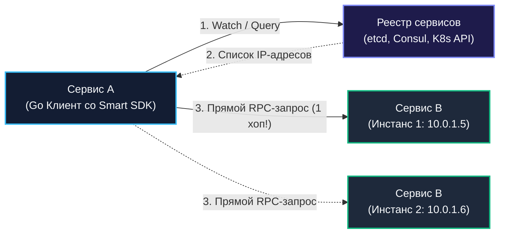
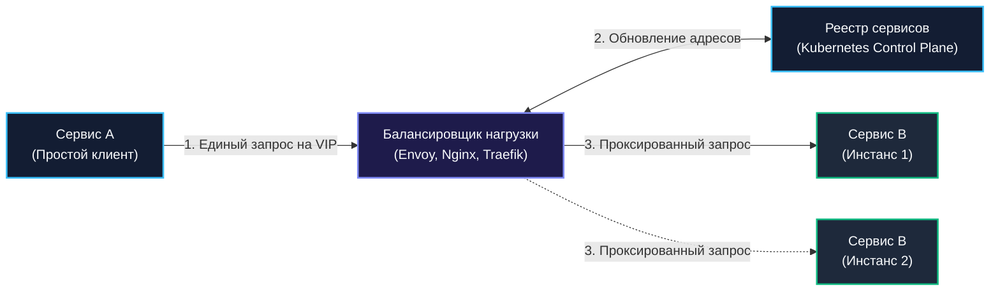

## Service Discovery: Client-side и Server-side модели

В эпоху классических монолитных систем топология сети была статичной и предсказуемой: адрес сервера реляционной базы данных или вспомогательного демона прописывался в конфигурационном файле `config.yaml` в виде неизменного IP-адреса и порта. Серверы жили годами, перезагружались по расписанию и обладали постоянными сетевыми интерфейсами.

Но стоило архитектуре шагнуть в мир контейнеров, Kubernetes, динамического автомасштабирования (Horizontal Pod Autoscaler) и спотовых виртуальных машин в облаке, как иллюзия статичности растаяла. В современном микросервисном кластере инстансы сервисов рождаются, масштабируются при всплеске нагрузки, перемещаются между физическими нодами и умирают каждую минуту. Назначенный поду динамический IP-адрес живёт лишь до первого перезапуска контейнера.

В таких условиях жестко зашитые IP-адреса превращаются в рецепт гарантированного отказа. Системе необходим динамический механизм регистрации и обнаружения узлов — **Service Discovery**. Без него балансировщик нагрузки остаётся слепым, а микросервисы теряют способность взаимодействовать друг с другом.

В этой главе мы подробно исследуем архитектурные модели **Client-Side** и **Server-Side Discovery**, вскроем их сетевую физику и влияние на рантайм Go, изучим протокол gRPC resolver, а также разберём устройство реестров на базе etcd, Consul и Kubernetes EndpointSlices.

---

### Зачем нужен Service Discovery

Архитектурный шаблон Service Discovery решает три фундаментальные задачи распределённой среды:

1. **Динамическая регистрация и дерегистрация (Service Registry)**:  
   В момент запуска новый инстанс сервиса сообщает реестру: *«Я сервис заказов `orders-svc`, мой адрес `10.244.3.45:8080`, я готов принимать трафик»*. При штатном завершении работы (`Graceful Shutdown`) сервис снимает себя с регистрации.
2. **Мониторинг жизнеспособности (Liveness & Health Checking)**:  
   Реестр непрерывно проверяет пульс зарегистрированных узлов. Если узел перестаёт присылать подтверждение жизни (Heartbeat) или сбоит на проверке здоровья, он немедленно удаляется из списков маршрутизации.
3. **Обнаружение и разрешение адресов (Resolution)**:  
   Потребители сервиса (клиенты или балансировщики) запрашивают у реестра актуальный список здоровых эндпоинтов, не заботясь о том, на каких физических машинах они запущены.

---

### Модели Service Discovery

Существуют две принципиально разные архитектурные парадигмы обнаружения сервисов: децентрализованная клиентская (**Client-Side**) и централизованная серверная (**Server-Side**).

---

#### Client-Side Discovery

В модели **Client-Side Discovery** клиентский микросервис берёт всю интеллектуальную работу на себя. Он напрямую опрашивает реестр сервисов (Service Registry), кэширует список активных IP-адресов в локальной памяти, самостоятельно применяет алгоритм балансировки нагрузки (Round-Robin, P2C) и отправляет RPC-запрос **напрямую на выбранный узел бэкенда**.



**Преимущества:**
- **Минимально возможная задержка (1 сетевой хоп)**: Запрос летит от клиента к бэкенду напрямую, минуя промежуточные прокси-серверы.
- **Отсутствие единой точки отказа (SPOF)**: Выход из строя отдельного балансировщика невозможен, так как балансировщика просто нет. Сам реестр обычно представляет собой отказоустойчивый Raft-кластер (etcd/Consul).
- **Свобода выбора алгоритмов**: Клиент может применять специализированные алгоритмы балансировки (например, направлять запрос в ту же зону доступности AWS Availability Zone для экономии межзонального трафика).

**Недостатки:**
- **Усложнение кодовой базы клиентов (Fat Client)**: Каждый сервис обязан тащить в себе библиотеки работы с реестром, логику пингов, фильтрации и балансировки.
- **Связывание с технологическим стеком**: Связывает клиента с конкретным реестром и его SDK (например, `consul-api`). Если в компании используются микросервисы на разных языках, придётся поддерживать клиентские библиотеки под каждый стек.

---

#### Server-Side Discovery

В модели **Server-Side Discovery** клиентский сервис предельно упрощён. Он не знает ни о каком реестре сервисов и отправляет запросы на единственный стабильный виртуальный адрес (VIP) или DNS-имя балансировщика нагрузки (например, Ingress-контроллера, Envoy или AWS ALB). Балансировщик сам непрерывно синхронизируется с реестром и перенаправляет входящий запрос на конкретный инстанс бэкенда.



**Преимущества:**
- **Абсолютная простота клиента**: Код на Go выполняет стандартный `http.Get("http://orders-service/...")` или обращается к доменному имени. Никаких сторонних библиотек.
- **Централизация политик**: Балансировщик берёт на себя аутентификацию (mTLS), централизованное логирование, распределённый трейсинг, Rate Limiting и терминирование сертификатов.
- **Идеально для внешних клиентов**: Внешние мобильные приложения и фронтенд-браузеры физически не могут иметь прямого доступа к реестру etcd во внутренней сети.

**Недостатки:**
- **Штраф к задержке (+1 сетевой хоп)**: Запрос проходит через промежуточный узел прокси, добавляя накладные расходы на сокеты и контекст-свитчи ОС ($0.5–3$ мс).
- **Балансировщик — потенциальное узкое горлышко**: Требует масштабирования и резервирования самого слоя прокси.

---

### Реализация в Go

Благодаря развитой экосистеме, в Go обе модели обнаружения реализуются естественно и лаконично.

---

#### Client-Side Discovery с gRPC

В фреймворке gRPC встроен мощный механизм client-side discovery через интерфейс `resolver.Resolver` (и фабрику `resolver.Builder`). Библиотека резолвера подписывается на изменения в реестре и передаёт обновлённый список адресов (`resolver.Address`) внутреннему балансировщику gRPC.

Пример подключения gRPC-клиента с использованием Consul:

```go
package discovery

import (
	"context"
	"log"

	"google.golang.org/grpc"
	"google.golang.org/grpc/credentials/insecure"
	_ "github.com/mbobakov/grpc-consul-resolver" // Автоматическая регистрация схемы "consul://"
)

func InitConsulGRPCClient(ctx context.Context) (*grpc.ClientConn, error) {
	// Подключение через URI схемы consul
	// Резолвер опрашивает Consul по адресу consul-server:8500 и находит здоровые поды сервиса
	target := "consul://consul-server:8500/payment-service?healthy=true"

	serviceConfig := `{"loadBalancingConfig": [{"round_robin":{}}]}`

	conn, err := grpc.DialContext(
		ctx,
		target,
		grpc.WithTransportCredentials(insecure.NewCredentials()),
		grpc.WithDefaultServiceConfig(serviceConfig),
	)
	if err != nil {
		return nil, err
	}

	log.Println("gRPC клиент успешно подключен с динамическим Client-Side Discovery")
	return conn, nil
}
```

Клиент периодически получает обновления от Consul через long-polling. При падении инстанса gRPC мгновенно перенаправляет новые RPC-вызовы на живые узлы.

---

#### Server-Side Discovery с Envoy и xDS

В архитектуре **Service Mesh** (Istio, Linkerd) на каждом поде рядом с контейнером Go разворачивается вспомогательный sidecar-прокси **Envoy**.

Envoy подключается к управляющему серверу (Control Plane, например, Istiod) по протоколу **xDS** (Endpoint Discovery Service, EDS). Как только в кластере запускается новый под, Istiod по gRPC-стриму отправляет в Envoy дельту изменений. Приложению Go достаточно отправить запрос на `localhost:15001`, а Envoy прозрачно выполнит маршрутизацию.

---

#### Прямое использование etcd

Если ваш сервис использует собственный протокол или HTTP, etcd предоставляет готовые примитивы регистрации с механизмом аренды (**Lease**):

```go
package etcd_discovery

import (
	"context"
	"fmt"
	"log"
	"time"

	clientv3 "go.etcd.io/etcd/client/v3"
)

type ServiceRegistrar struct {
	client *clientv3.Client
}

func NewServiceRegistrar(client *clientv3.Client) *ServiceRegistrar {
	return &ServiceRegistrar{client: client}
}

// RegisterService регистрирует узел с TTL и автоматически продлевает аренду
func (r *ServiceRegistrar) RegisterService(ctx context.Context, serviceName, instanceID, addr string, ttlSeconds int64) error {
	// 1. Создаем аренду (Lease)
	lease, err := r.client.Grant(ctx, ttlSeconds)
	if err != nil {
		return fmt.Errorf("failed to grant lease: %w", err)
	}

	// 2. Записываем эндпоинт с привязкой к аренде
	key := fmt.Sprintf("/services/%s/%s", serviceName, instanceID)
	_, err = r.client.Put(ctx, key, addr, clientv3.WithLease(lease.ID))
	if err != nil {
		return fmt.Errorf("failed to put key: %w", err)
	}

	// 3. Запускаем автоматическое фоновое продление аренды (Heartbeat)
	keepAliveChan, err := r.client.KeepAlive(ctx, lease.ID)
	if err != nil {
		return fmt.Errorf("failed to keep alive lease: %w", err)
	}

	// Фоновый наблюдатель за здоровьем аренды
	go func() {
		for {
			select {
			case ka, ok := <-keepAliveChan:
				if !ok {
					log.Printf("ALERT: etcd keep-alive канал закрыт для %s!", instanceID)
					return
				}
				_ = ka // Успешное продление аренды
			case <-ctx.Done():
				// При завершении сервиса — отзываем аренду, удаляя ключ немедленно
				_, _ = r.client.Revoke(context.Background(), lease.ID)
				return
			}
		}
	}()

	return nil
}
```

> [!warning] Ловушка / Gotcha: Ложное удаление из etcd при паузах GC
> При использовании аренды (Lease) в etcd узел автоматически удаляется из реестра, если аренда не была продлена за время TTL.  
> Если сервис испытывает дикие паузы Garbage Collector (Stop-The-World) или горутина продления аренды блокируется на тяжелом системном мьютексе, аренда протухает. etcd удаляет узел из реестра, и узел **перестаёт получать трафик**, хотя процесс Go физически жив и продолжает работать!  
> **Правило:** Продлевайте аренду только в изолированной горутине без тяжелых блокировок и выставляйте TTL аренды с запасом минимум в 3–5 циклов пинга (например, пинг каждую секунду, TTL = 5 секунд).

---

### Mechanical Sympathy: Service Discovery и рантайм Go

1. **Сетевые сокеты и Long Polling**:  
   При клиентском обнаружении горутина клиента удерживает открытый TCP-сокет к реестру (etcd/Consul) через `Watch API`. В протоколе etcd v3 используется один мультиплексированный HTTP/2 gRPC-стрим. Горутина паркуется сетевым поллером Go (`netpoller`) в ожидании входящих событий дельты. Память стека (~2 КБ) удерживается, но такты процессора в ожидании равны нулю.
2. **DNS-запросы и системный резолвер**:  
   В Kubernetes часто используют headless-сервисы (`clusterIP: None`). В этом случае DNS-запрос к `myservice.default.svc.cluster.local` возвращает сразу массив A-записей со всеми IP-адресами подов.  
   Стандартный пакет `net.Resolver` в Go по умолчанию использует чистую реализацию на Go (Pure Go Resolver), выполняя системные вызовы ядра (`getaddrinfo` при cgo или прямые UDP-пакеты в CoreDNS). Кэширование результатов в локальном in-memory кэше (`sync.Map`) с учётом TTL кардинально снижает нагрузку.  
   **Опасность:** Если клиент выполняет `net.LookupIP` на каждый HTTP-запрос, CoreDNS упадет под лавиной сетевых пакетов. Адреса обязаны кэшироваться в памяти Go на время TTL записи!
3. **Аллокации при получении списков узлов**:  
   В крупных кластерах с тысячами подов ответ реестра со списком адресов может весить сотни килобайт JSON. Десериализация такого массива порождает тысячи временных объектов в Heap.  
   В Kubernetes для устранения этой проблемы перешли с гигантских объектов `Endpoints` на компактные **`EndpointSlices`** (до 100 эндпоинтов на срез), что кардинально снизило нагрузку на память и сеть. В самом Go-сервисе переиспользование структур десериализации через `sync.Pool` устраняет налог на сборщик мусора.

> [!info] Под капотом
> Стандартный `net.Resolver` в Go кэширует DNS-ответы в пределах одного сетевого раунда, но не заменяет полноценный in-memory кэш уровня приложения. Для высоконагруженных систем рекомендуется использовать локальный кэш адресов с защитой от одновременных промахов через `singleflight` ([[28. Кэширование. Cache Aside, Write Through, Write Back]]).

---

### Health Checks и исключение узлов

Реестр обязан мгновенно исключать деградировавшие узлы:

1. **Пассивный мониторинг**:  
   gRPC-клиент при возникновении сетевой ошибки переводит соединение с конкретным узлом (`SubConn`) в статус `TRANSIENT_FAILURE` и мгновенно перестаёт направлять на него RPC-вызовы, запуская экспоненциальный бэкофф повторного переподключения.
2. **Активные Health Checks**:  
   Фоновый воркер опрашивает стандартный HTTP-эндпоинт:
   ```go
   http.HandleFunc("/health", func(w http.ResponseWriter, r *http.Request) {
       w.WriteHeader(http.StatusOK)
       w.Write([]byte("OK"))
   })
   ```
   В высоконадёжных средах реализуется протокол **gRPC Health Checking Protocol**, позволяющий проверять жизнеспособность каждого отдельного gRPC-сервиса внутри процесса.

---

### Связь с архитектурой и CAP

Реестр сервисов — это сам по себе распределённое хранилище, подчиняющееся теореме CAP ([[30. CAP теорема и реальные компромиссы]]):

- **etcd (Raft) — строгая CP-система**: При сетевом разделении кластера etcd узлы в меньшинстве откажутся регистрировать новые поды, защищая кластер от расщепления мозга (Split-Brain). Kubernetes выбрал etcd именно за бескомпромиссную целостность метаданных.
- **Consul** по умолчанию также ориентирован на CP (консенсус Raft), но поддерживает чтение в режиме stale для снижения задержки.
- **DNS-based Discovery (CoreDNS) — AP-система**: Доступна всегда, но из-за кэширования DNS-записи могут отставать от реального состояния кластера на секунды.

---

### Сравнение Client-Side и Server-Side

| Архитектурный критерий | Client-Side Discovery | Server-Side Discovery |
|---|---|---|
| **Сложность клиентского кода** | Высокая (необходим специализированный SDK) | **Предельно низкая** (стандартный HTTP-клиент) |
| **Сетевая латентность** | **Минимальная** (1 сетевой хоп) | Выше (2 сетевых хопа через прокси) |
| **Единая точка отказа** | Отсутствует (прямая связь) | Прокси-слой требует кластеризации |
| **Гибкость балансировки** | Максимальная (P2C, локальность зон) | Ограничена настройками центрального прокси |
| **Применение в экосистеме Go** | gRPC resolver, `grpc-go`, `go-micro`, `go-zero`/`kratos` | Envoy, Nginx, `httputil.ReverseProxy`, Kubernetes Service, Ingress |

---

> [!tip] Собеседование
> **Вопрос:** В каких сценариях вы выберете Client-Side Discovery вместо Server-Side в высоконагруженном Go-проекте? Обоснуйте архитектурный выбор.
> 
> **Ответ:**  
> Я выберу **Client-Side Discovery** в следующих случаях:
> 1. **Внутреннее межсервисное взаимодействие с экстремальным RPS (Service-to-Service)**: При миллионном потоке вызовов между микросервисами пропуск трафика через центральный балансировщик создаёт колоссальные расходы на инфраструктуру прокси и добавляет лишние миллисекунды задержки. Внутренние сервисы на `grpc-go` с резолвером к etcd/Consul полностью устраняют лишний хоп и точку отказа.
> 2. **Тонкое управление трафиком (Zone Awareness)**: Клиент может отдавать приоритет бэкендам, находящимся в том же дата-центре (Availability Zone), минимизируя сетевой пинг и финансовые затраты на cross-zone трафик в AWS/GCP.
> 
> Напротив, **Server-Side Discovery** я оставлю для **внешнего периметра (Edge / API Gateway)**, где разнородные внешние клиенты (веб, мобильные приложения) нуждаются в единой точке входа с терминацией TLS, авторизацией и защитой от DDoS.

---

### Итог

Service Discovery — это фундамент, вдохнувший жизнь в динамические облачные среды. Понимание различий между клиентским и серверным подходами позволяет архитектору точно сбалансировать систему: получить субмиллисекундную скорость прямого взаимодействия внутри кластера через gRPC и сохранить простоту внешнего контура через шлюзы.

Теперь, когда сервисы умеют динамически находить друг друга, встаёт задача организации внешнего периметра: как безопасно впустить миллионы клиентских мобильных устройств в наш микросервисный мир?

Об этом читайте в следующей главе: [[35. API Gateway и BFF]].
