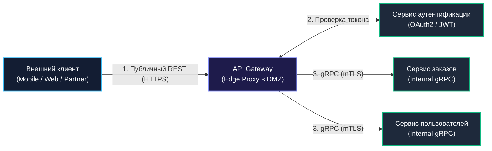
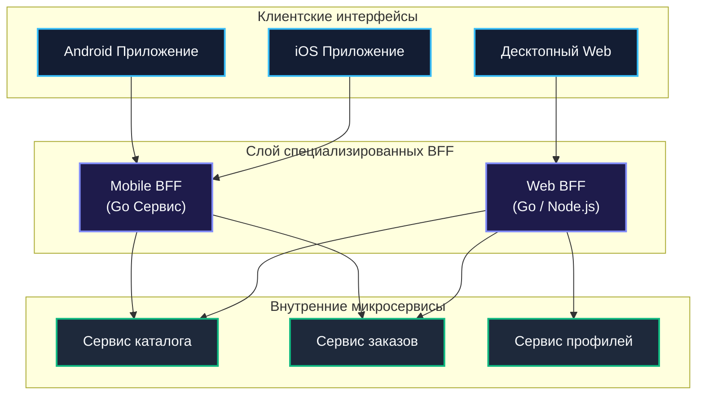

## Единая точка входа и специализированные бэкенды

В микросервисной архитектуре внутренняя экосистема компании может насчитывать сотни независимых сервисов, развёрнутых в изолированных приватных подсетях Kubernetes. Они общаются по бинарному протоколу gRPC, используют взаимную аутентификацию mTLS, динамически регистрируются в etcd и балансируются по алгоритму Power of Two Choices.

Однако внешний мир устроен совершенно иначе. Снаружи к вашей системе обращаются миллионы недоверенных клиентских устройств: мобильные телефоны на iOS и Android с нестабильным 4G/5G интернетом, веб-браузеры, требующие заголовков CORS и cookies, сторонние партнёрские интеграции и умные устройства (IoT). 

Выставлять внутренние микросервисы напрямую в публичный интернет — самоубийство с точки зрения безопасности, производительности и удобства:
- Клиентскому смартфону пришлось бы открывать десятки параллельных TCP-соединений к разным сервисам ради рендеринга одного экрана, высаживая аккумулятор и исчерпывая лимиты радиомодема.
- Любое внутреннее изменение контрактов или разделение одного микросервиса на два немедленно ломало бы миллионы уже установленных мобильных приложений.

Решением этой фундаментальной проблемы выступают два комплементарных архитектурных паттерна: **API Gateway** и **Backend for Frontend (BFF)**. В этой главе мы досконально разберём устройство каждого из них, покажем реализацию параллельной агрегации данных на Go с использованием `errgroup`, проанализируем влияние трансляции протоколов на аллокации памяти и GC, а также выделим строгие критерии выбора между общим шлюзом и специализированными BFF.

---

### API Gateway: единый парадный вход

**API Gateway (Шлюз API)** — это высокопроизводительный обратный прокси-сервер (Reverse Proxy), развёрнутый на границе защищённого периметра (Edge), который принимает все входящие публичные запросы, маршрутизирует их к целевым внутренним микросервисам и возвращает агрегированный ответ клиенту.

Шлюз изолирует внутреннюю топологию от внешнего мира и концентрирует в себе всю сквозную нефункциональную ответственность (**Cross-Cutting Concerns**):



#### Ключевые обязанности API Gateway:

1. **Маршрутизация (Routing)**: Сопоставление публичных путей с внутренними сервисами:
   - `GET /api/v1/orders/*` $	o$ `orders-service:8080`
   - `GET /api/v1/users/*` $	o$ `users-service:8080`
2. **Аутентификация и авторизация**: Валидация криптографических подписей JWT-токенов, взаимодействие с OAuth2/OIDC провайдерами и инъекция проверенного `X-User-ID` во внутренние заголовки.
3. **Rate Limiting и защита периметра**: Защита от DDoS-атак, предотвращение перегрузки бэкендов по алгоритмам Token Bucket или Leaky Bucket.
4. **Агрегация ответов (API Composition)**: Выполнение нескольких внутренних RPC-запросов и сборка единого JSON-документа для клиента за один сетевой раунд.
5. **Трансформация протоколов (Protocol Translation)**: Преобразование входящего публичного HTTP/JSON в высокоскоростной внутренний gRPC/Protobuf.
6. **Наблюдаемость (Observability)**: Логирование, трассировка (инъекция `traceparent`), сбор метрик RPS, кодов ответов и перцентилей задержки на внешнем контуре.

---

### Backend for Frontend: специализированный шлюз

Хотя классический API Gateway прекрасно справляется со сквозными задачами, при росте разнообразия клиентских платформ он неизбежно сталкивается с проблемой **«универсального интерфейса»**:
- Мобильному приложению на слабом смартфоне нужен минималистичный JSON размером 2 КБ, содержащий только имя пользователя и аватарку, чтобы сэкономить заряд батареи.
- Десктопному веб-приложению на мониторе 4K требуется развёрнутый дашборд с десятками таблиц и сотнями полей.
- Партнёрскому публичному API требуется строгая неизменяемость схемы, XML-выгрузки и особые правила авторизации по API-ключам.

Попытка заставить один централизованный API Gateway угодить всем клиентам превращает его в гигантский, хрупкий монолит (Bottleneck), за изменения в котором воюют пять разных команд.

Паттерн **Backend for Frontend (BFF)**, популяризированный Сэмом Ньюменом (Sam Newman) и инженерами SoundCloud, предлагает элегантное решение: **для каждого конкретного пользовательского интерфейса создаётся собственный, изолированный бэкенд-шлюз**.



#### Ключевые преимущества BFF:
- **Владение командой интерфейса**: `Mobile BFF` разрабатывается и релижится той же мобильной командой, которая пишет приложение на Swift и Kotlin.
- **Агрегация и фильтрация специфично под UI**: BFF вытягивает полные данные из внутренних микросервисов, вырезает ненужные поля и компонует идеальный ответ под конкретный экран.
- **Управление клиентскими сессиями**: Обход браузерных ограничений (CORS, HttpOnly Cookies) в Web BFF и работа с Refresh Tokens в Mobile BFF.

---

### Сравнение и выбор

| Архитектурный аспект | API Gateway | Backend for Frontend (BFF) |
|---|---|---|
| **Количество инстансов** | Один централизованный шлюз на всю систему | Несколько шлюзов (по одному на тип клиента: Web, Mobile, IoT) |
| **Команда-владелец** | Инфраструктурная платформа / Core Backend | Продуктовая команда конкретного фронтенда |
| **Характер логики** | Инфраструктурная (TLS, Auth, Rate Limiting, CORS) | Продуктово-адаптационная (UI Composition, фильтрация) |
| **Риск раздувания** | Высокий (становится организационным узким местом) | Низкий (изолирован потребностями одного интерфейса) |
| **Степень оптимизации** | Обобщённая для всех | Предельно глубокая под конкретную платформу |

**Золотой стандарт индустрии:** Комбинация обоих подходов! На внешнем периметре стоит легковесный инфраструктурный шлюз (Envoy / Ingress), терминирующий TLS и защищающий от DDoS, а за ним трафик маршрутизируется в специализированные Web BFF и Mobile BFF на Go.

---

### Реализация в Go

Благодаря непревзойдённой производительности при параллельном вводе-выводе язык Go является абсолютным фаворитом для написания BFF и шлюзов агрегации.

---

#### Простейший API Gateway на `net/http`

Базовый шлюз маршрутизации в Go строится поверх стандартного компонента `httputil.ReverseProxy` из пакета `net/http/httputil`:

```go
package gateway

import (
	"net/http"
	"net/http/httputil"
	"net/url"
)

type Gateway struct {
	routes map[string]*url.URL
	client *http.Client
}

func NewGateway(routes map[string]*url.URL, client *http.Client) *Gateway {
	return &Gateway{routes: routes, client: client}
}

func (g *Gateway) ServeHTTP(w http.ResponseWriter, r *http.Request) {
	target, ok := g.routes[r.URL.Path]
	if !ok {
		http.NotFound(w, r)
		return
	}

	proxy := httputil.NewSingleHostReverseProxy(target)
	proxy.Transport = g.client.Transport // переиспользуем пул соединений
	proxy.ServeHTTP(w, r)
}
```

Для production-окружения цепочка дополняется middleware аутентификации, rate limiting и circuit breaker ([[36. Circuit Breaker, Retry, Timeout и Backoff]]).

---

#### Высокопроизводительный BFF с веерной агрегацией (Scatter-Gather)

Главная задача BFF — собрать данные с нескольких внутренних gRPC-микросервисов параллельно, чтобы общее время ответа определялось не суммой задержек ($\sum T_i$), а временем самого медленного сервиса ($\max T_i$).

Для этого в Go применяется пакет `golang.org/x/sync/errgroup`:

```go
package bff

import (
	"context"
	"fmt"
	"time"

	"golang.org/x/sync/errgroup"
	"google.golang.org/grpc"
)

type User struct {
	ID   string `json:"id"`
	Name string `json:"name"`
}

type Order struct {
	ID     string `json:"id"`
	Amount int64  `json:"amount"`
}

type DashboardResponse struct {
	User   *User    `json:"user"`
	Orders []*Order `json:"orders"`
}

type OrderServiceClient interface {
	GetRecentOrders(ctx context.Context, userID string) ([]*Order, error)
}

type UserServiceClient interface {
	GetUser(ctx context.Context, userID string) (*User, error)
}

type WebBFF struct {
	ordersClient OrderServiceClient
	usersClient  UserServiceClient
}

func (b *WebBFF) GetDashboard(ctx context.Context, userID string) (*DashboardResponse, error) {
	// Жесткий SLA на сборку дашборда: не более 300 мс
	aggregateCtx, cancel := context.WithTimeout(ctx, 300*time.Millisecond)
	defer cancel()

	var (
		orders []*Order
		user   *User
	)

	// errgroup связывает горутины и автоматически отменяет контекст при первой ошибке
	g, gCtx := errgroup.WithContext(aggregateCtx)

	// Ветка 1: Параллельный запрос к сервису заказов
	g.Go(func() error {
		var err error
		orders, err = b.ordersClient.GetRecentOrders(gCtx, userID)
		if err != nil {
			return fmt.Errorf("orders service failed: %w", err)
		}
		return nil
	})

	// Ветка 2: Параллельный запрос к сервису пользователей
	g.Go(func() error {
		var err error
		user, err = b.usersClient.GetUser(gCtx, userID)
		if err != nil {
			return fmt.Errorf("users service failed: %w", err)
		}
		return nil
	})

	// Ожидание завершения всех параллельных вызовов
	if err := g.Wait(); err != nil {
		return nil, err
	}

	return &DashboardResponse{
		User:   user,
		Orders: orders,
	}, nil
}
```

> [!warning] Ловушка / Gotcha: Отсутствие глобального таймаута агрегации
> Самая частая ошибка при написании BFF на Go — запуск параллельных горутин с родительским `r.Context()` без явного дедлайна через `context.WithTimeout`.  
> Если внутренний сервис заказов зависнет в блокировке базы данных на 30 секунд, горутина в BFF останется висеть, удерживая память стека, дескрипторы сокетов и HTTP-соединение с клиентом. Под нагрузкой в 5 000 RPS шлюз мгновенно исчерпает лимиты операционной системы и упадёт по OOM.

---

### Mechanical Sympathy: влияние Gateway и BFF на рантайм Go

1. **Трансляция протоколов и налог на GC**:  
   Когда Gateway принимает входящий публичный JSON и конвертирует его в Protobuf для отправки во внутренний gRPC-сервис, процессор выполняет тяжелейшую работу.  
   Стандартный пакет `encoding/json` использует рефлексию (`reflect`), выделяя сотни мелких объектов в Heap на каждый запрос.  
   **Оптимизация:** Переход на быстрые генераторы сериализаторов без рефлексии (`goccy/go-json` или `easyjson`) снижает нагрузку на CPU в 3–5 раз и удерживает паузы сборщика мусора в пределах микросекунд.
2. **Пулы TCP-соединений (`http.Transport`)**:  
   При перекладывании байтов тела запроса и ответа через `io.Copy` аллоцируются временные буферы. При проксировании трафика критически важно правильно сконфигурировать исходящий транспорт, чтобы предотвратить непрерывный `TCP Handshake` на каждый входящий запрос:
   ```go
   transport := &http.Transport{
       MaxIdleConns:        1000,
       MaxIdleConnsPerHost: 100,
       IdleConnTimeout:     90 * time.Second,
       DisableCompression:  false,
   }
   ```
3. **Netpoller и дескрипторы сокетов**:  
   Шлюз держит соединения с двумя мирами: входящие медленные клиенты (WAN сокеты) и быстрые внутренние сервисы (LAN сокеты). Сетевой поллер Go (`netpoller`) мультиплексирует десятки тысяч сокетов в неблокирующем режиме `epoll`. Однако лимит открытых файлов в Linux (`ulimit -n`) должен быть заблаговременно увеличен минимум до 65 536.
4. **Контроль параллелизма агрегации**:  
   Если один запрос к BFF порождает веер из 15 параллельных gRPC-запросов, то 1 000 RPS создадут 15 000 одновременно работающих горутин. Ограничивайте максимальный параллелизм агрегации через семафоры (`golang.org/x/sync/semaphore`), чтобы не вызывать скачков потребления памяти.

---

### Готовые решения на Go и не только

При выборе инструментов архитектурная команда оценивает границу между готовыми бинарными прокси и написанием собственного кода:

1. **Lura (ранее KrakenD)**:  
   Сверхбыстрый API Gateway на чистом Go, способный обрабатывать свыше 50 000 RPS на одном ядре. Поддерживает декларативную конфигурацию маршрутов, агрегацию нескольких бэкендов в один JSON, валидацию JWT и подключение кастомных Go-плагинов.
2. **Easegress**:  
   Cloud-native шлюз на Go от MegaEase, оптимизированный под сложные пайплайны обработки трафика и оркестрацию.
3. **Service Mesh (Envoy / Istio Ingress)**:  
   Инфраструктурный стандарт на C++ для L7-маршрутизации, mTLS и канареечных деплоев на уровне кластера Kubernetes.
4. **Кастомный BFF на Go (Gin / Chi / Fiber)**:  
   Наиболее популярный выбор для продуктовых BFF: максимальная гибкость в адаптации данных под требования конкретного мобильного или веб-интерфейса.

---

### Антипаттерны

1. **Gateway как «Распределённый монолит» (God Gateway)**:  
   Внедрение сложной доменной бизнес-логики (например, расчёт скидок корзины) непосредственно в код шлюза. Шлюз превращается в хрупкого монстра, который блокирует релизы всех продуктовых команд. Шлюз обязан оставаться тонким маршрутизатором и транслятором!
2. **Игнорирование таймаутов на каждом шаге**:  
   Отсутствие жестких сроков выполнения для каждого агрегируемого источника ведёт к каскадному коллапсу шлюза при замедлении хотя бы одной зависимой системы.
3. **Единый универсальный Gateway для всех команд и клиентов**:  
   Попытка объединить публичный B2B-шлюз, мобильный трафик и веб-админку в одном сервисе замедляет эволюцию платформы и увеличивает радиус поражения при авариях.

---

### Связь с другими концепциями

- **Rate Limiting** ([[38. Rate Limiting и защита системы]]): Защита внутреннего периметра от перегрузок и злоупотреблений реализуется в первую очередь на уровне Gateway.
- **Circuit Breaker** ([[36. Circuit Breaker, Retry, Timeout и Backoff]]): Предотвращает зависание горутин шлюза при деградации внутренних микросервисов.
- **Service Discovery** ([[34. Service Discovery. Client side и Server side]]) и **Load Balancing** ([[33. Load Balancing на уровне архитектуры]]): Обеспечивают обнаружение живых бэкендов и распределение запросов за спиной шлюза.
- **Observability** ([[39. Observability в архитектуре. Metrics, Logs, Traces]]): Шлюз является отправной точкой для генерации распределённого трейса (`traceparent`) и сбора золотых сигналов мониторинга.

---

> [!tip] Собеседование
> **Вопрос:** В каких случаях вы предпочтёте архитектуру Backend for Frontend (BFF) единому централизованному API Gateway? Приведите пример из реального продакшена.
> 
> **Ответ:**  
> Я выберу паттерн **BFF**, когда в системе присутствуют разнородные клиенты с принципиально несовместимыми требованиями к данным и жизненному циклу релизов:
> 1. **Пример: Маркетплейс (Web + Mobile App + B2B API)**:
>    - **Mobile App**: работает в условиях дорогого и нестабильного сотового интернета. Мобильный BFF агрегирует 5 внутренних микросервисов в один плоский компактный JSON, минимизируя трафик и исключая лишние поля. Релизы мобильного приложения происходят раз в две недели через App Store.
>    - **Десктопный Web**: работает по быстрому оптоволокну, отображает сложные интерактивные фильтры и аналитические графики. Web BFF поддерживает авторизацию через HttpOnly Cookies и отдает тяжелые страницы. Релизы происходят по 10 раз в день через CI/CD.
>    - **B2B API**: требует неизменяемости версий (v1, v2) и строгой авторизации по статическим API-ключам.
> 2. **Организационная независимость**: BFF устраняет межкомандные блокировки: команда мобильной разработки сама владеет своим `Mobile BFF` на Go и меняет формат ответов без согласования с инфраструктурной командой общего шлюза.  
> Единый API Gateway я оставлю как внешний L7-прокси (Envoy) для сквозных задач (WAF, DDoS защита, терминирование TLS).

---

### Итог

API Gateway и Backend for Frontend — это архитектурные стражи, отделяющие дикий и непредсказуемый внешний интернет от стерильного мира внутренней микросервисной платформы. Они превращают хаос множества микросервисов в стройный, понятный и безопасный интерфейс для конечных пользователей.

Однако открытие единого шлюза несёт в себе колоссальную ответственность: при отказе зависимого бэкенда шлюз не должен падать сам и утягивать за собой всю платформу.

О том, как защитить шлюзы и микросервисы от каскадных аварий с помощью тайм-аутов, повторов и автоматических предохранителей, читайте в следующей главе: [[36. Circuit Breaker, Retry, Timeout и Backoff]].
