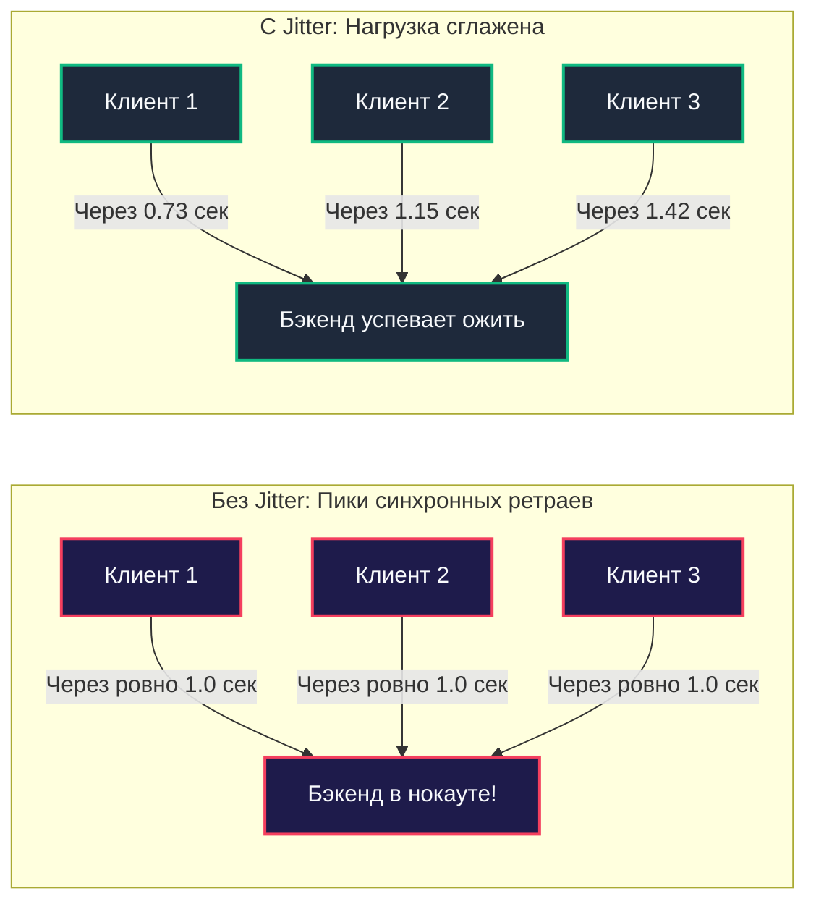
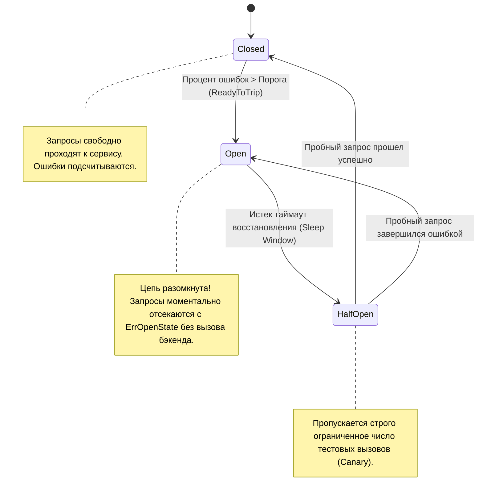

## Паттерны устойчивости: Circuit Breaker, Retry, Timeout и Backoff

> *"Anything that can go wrong will go wrong."*  
> — Закон Мёрфи

В распределённых микросервисных системах сбои — это не чрезвычайное происшествие, а естественная, повседневная реальность. Сетевой кабель в стойке дата-центра теряет 2% пакетов, сторонний платёжный шлюз начинает отвечать за 4 секунды вместо 50 миллисекунд, а инстанс базы данных зависает на 500 миллисекунд из-за масштабной паузы сборщика мусора.

Если ваш Go-сервис спроектирован наивно и считает удалённую сеть надёжной, один-единственный замедлившийся второстепенный сервис (например, сервис рекомендаций аватарок) за считанные секунды вызовет **каскадный отказ (Cascading Failure)** всей платформы. Горутины зависнут в ожидании ответа, пулы HTTP-коннектов исчерпаются, память процесса забьётся непереданными буферами, и главный шлюз упадёт, сделав недоступными даже жизненно важные платежи.

Чтобы строить несокрушимые системы, бэкенд-инженер обязан опираться на четыре столпа архитектурной устойчивости: **Timeout**, **Retry**, **Backoff** и **Circuit Breaker**. В этой главе мы разберём физику работы каждого примитива, покажем их высоконагруженную реализацию на Go и объединим их в монолитный оборонительный рубеж.

---

### Timeout: не ждать бесконечно

**Timeout (Дедлайн)** — это фундаментальное правило гигиены распределённых систем: ни одна сетевая операция не имеет права ожидать ответа бесконечно долго.

Если удалённый сервис перестал отвечать, горутина в Go, заблокированная на чтении из сетевого сокета, без таймаута останется висеть в рантайме навсегда. Каждая такая «горутина-зомби» держит в памяти свой стек (~2–8 КБ), структуру сокета и файловый дескриптор в ядре Linux. При нагрузке в 1 000 RPS сервис исчерпает все доступные системные ресурсы менее чем за две минуты.

В современном Go управление временем жизни сетевых операций строится исключительно вокруг интерфейса `context.Context`:

```go
package resilience

import (
	"context"
	"errors"
	"fmt"
	"net/http"
	"time"
)

func CallExternalAPI(ctx context.Context, httpClient *http.Client, url string) ([]byte, error) {
	// Устанавливаем жесткий дедлайн на выполнение запроса
	reqCtx, cancel := context.WithTimeout(ctx, 2*time.Second)
	defer cancel() // Защита от утечки таймера в рантайме

	req, err := http.NewRequestWithContext(reqCtx, http.MethodGet, url, nil)
	if err != nil {
		return nil, err
	}

	resp, err := httpClient.Do(req)
	if err != nil {
		// Проверяем, был ли сбой вызван истечением таймаута
		if errors.Is(err, context.DeadlineExceeded) || errors.Is(reqCtx.Err(), context.DeadlineExceeded) {
			return nil, fmt.Errorf("remote call timed out: %w", err)
		}
		return nil, fmt.Errorf("network call failed: %w", err)
	}
	defer resp.Body.Close()

	return nil, nil
}
```

#### Правила хорошего тона при работе с таймаутами:

1. **Запрет на `http.DefaultClient`**:  
   Стандартный глобальный клиент `http.DefaultClient` в Go **не имеет таймаута по умолчанию (`Timeout: 0`)**. Любое использование `http.Get()` в продакшене — это мина замедленного действия. Всегда объявляйте явно сконфигурированный экземпляр:
   ```go
   var httpClient = &http.Client{
       Timeout: 10 * time.Second,
   }
   ```
2. **Каскадные таймауты (Deadline Budgeting)**:  
   Таймауты обязаны уменьшаться по мере продвижения вглубь графа вызовов. Если пользовательский шлюз обещает клиенту ответить за 200 мс (согласно SLO, см. [[4. SLA, SLO, SLI и как они влияют на дизайн]]), то таймаут внутреннего вызова к базе данных не может превышать 120 мс, оставляя 80 мс на сериализацию и сетевые накладные расходы.

---

### Retry: повторить при ошибке

Не каждый сбой является фатальным. В распределённых сетях подавляющее большинство ошибок носит **транзиентный (кратковременный) характер**: кратковременный сетевой флап, секундная перезагрузка пода Kubernetes или смена лидера в etcd/Raft кластере.

Паттерн **Retry (Повторная попытка)** позволяет преодолеть кратковременный сбой автоматически, не возвращая ошибку пользователю.

#### Железные правила Retry:
- **Повторять только идемпотентные операции**:  
  Никогда нельзя автоматически повторять операцию списания денег или создания заказа без уникального ключа идемпотентности (`Idempotency-Key`)! Если запрос упал по сетевому таймауту, сервер мог успеть списать средства до обрыва сокета. Повтор неидемпотентного запроса спишет деньги дважды (подробно см. [[27. Idempotency и exactly once семантика]]).
- **Не повторять клиентские ошибки (4xx)**:  
  Ошибки `400 Bad Request`, `401 Unauthorized` или `404 Not Found` детерминированы: повтор запроса гарантированно вернёт ту же ошибку, впустую сжигая процессорные такты.
- **Ограничивать число попыток**:  
  Обычно достаточно 2–3 попыток.

---

### Backoff: умная пауза между попытками

Если сервис упал под лавиной нагрузки, а 1 000 клиентов немедленно начнут слать повторные запросы в ту же миллисекунду, они окончательно добьют упавший узел. Это явление называется **Retry-штормом (Retry Storm)**.

Паттерн **Backoff** задаёт алгоритм нарастания пауз между попытками:
1. **Constant Backoff**: Одинаковая пауза (например, 100 мс). Плохо защищает систему.
2. **Linear Backoff**: Задержка растёт линейно ($100	ext{ мс}, 200	ext{ мс}, 300	ext{ мс}$).
3. **Exponential Backoff**: пауза удваивается после каждой попытки (`100ms, 200ms, 400ms...`). Стандарт де-факто.
4. **Exponential Backoff with Jitter (Экспоненциальный откат со случайным шумом)**:  
   К паузе добавляется случайная составляющая (джиттер):
   $$T = 	ext{rand}(0, \min(	ext{MaxInterval}, 	ext{BaseInterval} 	imes 2^i))$$
   Джиттер размазывает моменты повторов сотен клиентов по временной оси, предотвращая синхронные пики сетевого шторма.



В экосистеме Go стандартом реализации является библиотека `github.com/cenkalti/backoff/v4`:

```go
package resilience

import (
	"context"
	"time"

	"github.com/cenkalti/backoff/v4"
)

func ExecuteWithBackoff(ctx context.Context, operation func() error) error {
	b := backoff.NewExponentialBackOff()
	b.InitialInterval = 100 * time.Millisecond
	b.MaxElapsedTime = 5 * time.Second

	return backoff.Retry(operation, backoff.WithContext(b, ctx))
}
```

> [!warning] Ловушка / Gotcha: Утечка таймеров при наивном `time.After`
> Часто разработчики пишут откат вручную: `select { case <-time.After(duration): }`.  
> В циклах с частыми повторами `time.After` выделяет объект таймера, который в рантайме Go до версии 1.23 не мог быть собран сборщиком мусора до полного истечения времени, даже если родительский контекст был давно отменён! Это порождало утечки памяти.  
> Используйте `time.NewTimer`, сбрасывайте его через `timer.Reset()` или доверяйте промышленным библиотекам вроде `cenkalti/backoff`.

---

### Circuit Breaker: предотвращение лавины

Если зависимый downstream-сервис отключился физически (сгорел дата-центр или упал кластер СУБД), никакой Retry и Backoff не помогут. Продолжение отправки запросов будет лишь бессмысленно расходовать соединения и заставлять пользователей смотреть на крутящийся спиннер.

**Circuit Breaker (Автоматический выключатель)** — это предохранитель, защищающий систему от расходования ресурсов на заведомо мёртвые сервисы.

Паттерн описывается конечной стейт-машиной из трёх состояний:



1. **Closed (Замкнут)**:  
   Штатный режим. Все запросы свободно идут в downstream. Автомат ведёт скользящую статистику успехов и сбоев. Если процент ошибок превышает установленный порог, выключатель «срабатывает» и переходит в состояние **Open**.
2. **Open (Разомкнут)**:  
   Цепь разорвана. Вызовы к сервису **не выполняются физически**. Запрос моментально возвращает ошибку (`ErrOpenState`) или fallback-заглушку. Сервер-источник экономит ресурсы, а упавший сервис получает время на спокойную перезагрузку без внешнего давления.
3. **Half-Open (Полуразомкнут)**:  
   По истечении времени сна (Sleep Window, например, 10 секунд) выключатель приоткрывается и пропускает один или несколько пробных (canary) запросов. Если пробный вызов успешен — система восстановилась, автомат возвращается в **Closed**. Если снова сбой — цепь немедленно возвращается в **Open**.

#### Реализация на Go с использованием `sony/gobreaker`

В промышленной разработке стандартом де-факто является библиотека `github.com/sony/gobreaker`:

```go
package resilience

import (
	"context"
	"fmt"
	"time"

	"github.com/sony/gobreaker"
)

type ProtectedClient struct {
	cb *gobreaker.CircuitBreaker
}

func NewProtectedClient() *ProtectedClient {
	settings := gobreaker.Settings{
		Name:        "inventory-service",
		MaxRequests: 1,                // Сколько запросов пропускать в состоянии Half-Open
		Interval:    60 * time.Second, // Окно очистки счетчиков в состоянии Closed
		Timeout:     10 * time.Second, // Длительность состояния Open перед переходом в Half-Open
		ReadyToTrip: func(counts gobreaker.Counts) bool {
			// Размыкаем цепь, если сделано не менее 5 запросов и доля отказов превысила 60%
			failureRatio := float64(counts.TotalFailures) / float64(counts.Requests)
			return counts.Requests >= 5 && failureRatio >= 0.6
		},
		OnStateChange: func(name string, from gobreaker.State, to gobreaker.State) {
			fmt.Printf("[CircuitBreaker] %s изменил состояние: %s -> %s
", name, from, to)
		},
	}

	return &ProtectedClient{
		cb: gobreaker.NewCircuitBreaker(settings),
	}
}

func (c *ProtectedClient) ExecuteCall(ctx context.Context, action func() (any, error)) (any, error) {
	// Execute оборачивает сетевой вызов в стейт-машину
	result, err := c.cb.Execute(func() (any, error) {
		return action()
	})

	if err != nil {
		if errors.Is(err, gobreaker.ErrOpenState) {
			// Цепь разомкнута: бэкенд мёртв! Отдаём закешированный результат (Fallback)
			return c.fallback(ctx), nil
		}
		return nil, err
	}

	return result, nil
}

func (c *ProtectedClient) fallback(ctx context.Context) any {
	return map[string]string{"status": "degraded", "data": "cached_inventory"}
}
```

> [!info] Под капотом
> Библиотека `sony/gobreaker` практически бесплатна с точки зрения накладных расходов: все счётчики запросов и ошибок инкрементируются через атомарные инструкции процессора (`sync/atomic`). Проверка состояния автомата занимает считанные наносекунды и не производит аллокаций памяти в куче.

---

### Mechanical Sympathy: нагрузка на рантайм Go

1. **Таймеры и планировщик Go**:  
   Каждый вызов `context.WithTimeout` создаёт таймер в планировщике Go. Начиная с Go 1.23, внутренняя структура таймеров рантайма была радикально переработана (удалены глобальные блокировки таймерных очередей на каждом логическом процессоре `P`), что позволило сервисам обрабатывать миллионы дедлайнов в секунду без деградации CPU.
2. **Аллокации и Garbage Collector**:  
   При агрессивных повторах (Retry) каждый новый сетевой вызов сериализует заголовки и тело запроса заново. Чтобы минимизировать аллокации в циклах повторов:
   - Переиспользуйте байтовые буферы через `sync.Pool`.
   - Не создавайте новый экземпляр `http.Request` на каждой итерации — мутируйте только контекст через `req.WithContext(attemptCtx)`.
3. **Netpoller и пулы соединений**:  
   При размыкании Circuit Breaker (`Open State`) входящий поток запросов мгновенно отсекается на уровне оперативной памяти Go, не доходя до сокетов. Это моментально разгружает сетевой поллер ядра Linux (`epoll`), предотвращая переполнение очередей соединений.

---

### Интеграция четырёх механизмов

В боевом продакшене все четыре механизма объединяются в единый слаженный эшелон обороны:

```go
package resilience

import (
	"context"
	"fmt"
	"net/http"
	"time"

	"github.com/cenkalti/backoff/v4"
	"github.com/sony/gobreaker"
)

func CallWithResilience(
	ctx context.Context,
	cb *gobreaker.CircuitBreaker,
	client *http.Client,
	url string,
) (*http.Response, error) {
	// 1. Уровень 1: Circuit Breaker защищает от устойчивых отказов
	result, err := cb.Execute(func() (any, error) {
		var resp *http.Response

		// 2. Уровень 2: Экспоненциальный Backoff с Jitter
		expBackoff := backoff.NewExponentialBackOff()
		expBackoff.InitialInterval = 50 * time.Millisecond
		expBackoff.MaxElapsedTime = 2 * time.Second // Общий лимит времени на все попытки

		retryErr := backoff.Retry(func() error {
			// 3. Уровень 3: Жесткий Timeout на одну конкретную попытку
			attemptCtx, cancel := context.WithTimeout(ctx, 400*time.Millisecond)
			defer cancel()

			req, _ := http.NewRequestWithContext(attemptCtx, http.MethodGet, url, nil)
			r, e := client.Do(req)
			if e != nil {
				// 4. Уровень 4: Анализ типа ошибки (повторяем только временные сбои)
				return e
			}

			if r.StatusCode >= 500 {
				r.Body.Close()
				return fmt.Errorf("server 5xx error: %d", r.StatusCode)
			}

			resp = r
			return nil
		}, backoff.WithContext(expBackoff, ctx))

		return resp, retryErr
	})

	if err != nil {
		return nil, err
	}

	return result.(*http.Response), nil
}
```

**Строгая иерархия ответственности:**  
1. **Timeout** пресекает зависание отдельной попытки.  
2. **Backoff** размазывает задержки повторов во времени.  
3. **Retry** преодолевает кратковременный сетевой чих.  
4. **Circuit Breaker** пресекает повторы, если сервис умер системно, переводя трафик на fallback.

---

### Связь с другими архитектурными паттернами

- **Idempotency** ([[27. Idempotency и exactly once семантика]]): Идемпотентность — необходимое предварительное условие для безопасного включения Retry. Без идемпотентности ретраи запрещены!
- **Bulkhead** ([[37. Bulkhead и изоляция отказов]]): Circuit Breaker отсекает сбои во времени, а Bulkhead изолирует ресурсы (пулы горутин и соединений) в пространстве памяти.
- **Rate Limiting** ([[38. Rate Limiting и защита системы]]): Rate Limiter защищает систему от перегрузки со стороны клиентов снаружи, а Circuit Breaker защищает от сбоев зависимостей внутри.
- **Saga** ([[26. Saga Pattern. Оркестрация и хореография]]): Шаги распределённой саги и их компенсации оборачиваются в Retry и Circuit Breaker для устойчивого завершения процессов.

---

### Антипаттерны

1. **Бесконечный Retry**:  
   Цикл повтора без жесткого ограничения числа попыток или общего времени жизни контекста `ctx.Done()`. Зависшая горутина никогда не освободит память.
2. **Повторение неидемпотентных или клиентских ошибок**:  
   Ретрай на ошибку валидации `422 Unprocessable Entity` или повторная отправка формы оплаты картой.
3. **Слишком короткий Timeout**:  
   Выставление таймаута в 20 мс при нормальном P99 бэкенда в 25 мс. 100% запросов начнут отваливаться по таймауту, вызывая ложное размыкание Circuit Breaker.
4. **Единый общий Circuit Breaker на весь сервис**:  
   Один инстанс автомата на вызовы к десяти разным микросервисам. Сбой каталога аватарок заблокирует вызовы к сервису платежей! На каждый внешний сервис настраивается персональный изолированный Circuit Breaker.

---

> [!tip] Собеседование
> **Вопрос:** Зачем нужен Circuit Breaker, если в нашей системе уже настроен Retry с Exponential Backoff?
> 
> **Ответ:**  
> Паттерны решают противоположные задачи при разных классах отказов:
> 1. **Retry с Backoff** эффективен исключительно при **кратковременных, транзиентных сбоях** (потеря одиночного сетевого пакета, перезапуск пода за 200 мс). Он пытается достучаться до сервиса.
> 2. **Circuit Breaker** защищает систему при **устойчивых системных авариях** (база данных downstream-сервиса упала, диск переполнен, сервис лежит уже 5 минут).  
> Если в такой ситуации продолжать выполнять Retry, тысячи клиентских запросов будут забивать пулы соединений, ждать таймаутов и добивать упавший сервис новыми повторами. Circuit Breaker моментально отсекает вызовы в состоянии Open ($O(1)$ без сетевых запросов), защищает ресурсы вызывающего сервиса и даёт упавшему бэкенду восстановиться.

---

### Итог

Устойчивость распределённой системы не возникает сама по себе — она методично закладывается в архитектуру. Связка Timeout, Retry, Exponential Backoff с джиттером и Circuit Breaker — это канонический оборонительный комплекс современного Go-разработчика. Он гарантирует, что локальная авария в одном микросервисе будет локализована и не превратится в пожар, уничтожающий всю компанию.

Однако, помимо временной защиты вызовов, важно физически изолировать ресурсы (пулы горутин, сокеты, память), чтобы сбой одного компонента не лишил ресурсов соседние.

О том, как работает морской принцип непотопляемости в программировании, читайте в следующей главе: [[37. Bulkhead и изоляция отказов]].
