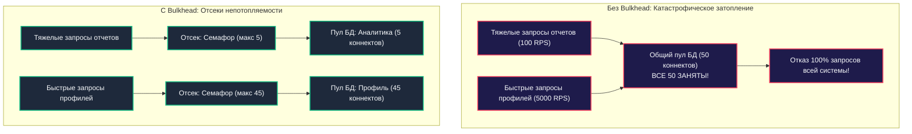

## Bulkhead: изоляция отказов и отсеки непотопляемости

В классической морской инженерии непотопляемость корабля обеспечивается водонепроницаемыми переборками — **корабельными переборками (Bulkheads)**. Корпус судна делится стальными переборками на независимые герметичные отсеки. Если айсберг или торпеда пробивает обшивку носового трюма, вода заполняет только один изолированный отсек. Переборки выдерживают гидростатическое давление, двигатели в корме продолжают работать, а корабль остаётся на плаву.

В распределённых программных системах действует ровно тот же закон физики.

Представьте популярный интернет-сервис, написанный на Go. На одном HTTP-сервере сосуществуют два эндпоинта:
1. `GET /profile` — критически важный, ультрабыстрый вызов (латентность 5 мс, нагрузка 5 000 RPS).
2. `POST /reports/export-pdf` — тяжелейшая генерация годового аналитического отчёта (латентность 15 секунд, сложный SQL с агрегацией и рендеринг документа).

Если архитектура построена наивно, оба эндпоинта делят между собой **единый общий пул соединений к базе данных (`MaxOpenConns: 50`)** и единое процессорное пространство. Стоит ста пользователям одновременно нажать кнопку «Сгенерировать отчёт», как все 50 соединений с СУБД окажутся заняты многосекундными SQL-запросами. В эту же секунду обычные пользователи заходят в профиль — и обнаруживают, что сервис полностью мёртв! Быстрый вызов встал в бесконечную очередь за свободным сокетом, горутины накопились, и система утонула.

**Bulkhead (Отсеки непотопляемости)** — это паттерн архитектурной изоляции ресурсов, гарантирующий, что исчерпание пулов соединений, процессорных ядер, памяти или горутин одним второстепенным компонентом физически не сможет затронуть остальные части системы.

---

### Что такое Bulkhead

В архитектуре программного обеспечения паттерн **Bulkhead** реализуется через строгое квотирование и физическое разделение ресурсов между различными типами операций, арендаторами (Tenants) или внешними зависимостями.



Существует два фундаментальных уровня изоляции:
1. **Изоляция по ресурсам (Resource Isolation)**: Выделение персональных, независимых квот:
   - Отдельные пулы горутин и семафоры конкурентности.
   - Независимые пулы соединений к базам данных (Connection Pools).
   - Ограничение оперативной памяти и ядер CPU на уровне контейнеров (cgroups v2).
2. **Изоляция по времени (Time Isolation / Fail-Fast)**: Если в отсеке закончились свободные слоты, входящий запрос не встаёт в бесконечную очередь ожидания, а мгновенно отбрасывается с кодом `503 Service Unavailable` или `429 Too Many Requests`, создавая мгновенный Backpressure.

---

### Реализация Bulkhead в Go

Язык Go с его легковесными горутинами, буферизированными каналами и семафорами предоставляет безупречные, нативные строительные блоки для возведения переборок.

---

#### Семафор как ограничитель конкурентности

Наиболее производительный и идиоматичный способ ограничить число одновременных горутин для тяжелой операции — использование буферизированного канала в качестве **семафора подсчёта**:

```go
package bulkhead

import (
	"context"
	"net/http"
	"time"
)

type ReportingService struct {
	// Семафор на буферизированном канале: максимум 10 одновременных тяжелых генераций
	heavySem chan struct{}
}

func NewReportingService() *ReportingService {
	return &ReportingService{
		heavySem: make(chan struct{}, 10),
	}
}

func (s *ReportingService) HandleHeavyRequest(w http.ResponseWriter, r *http.Request) {
	ctx := r.Context()

	// Попытка захвата слота в отсеке непотопляемости
	select {
	case s.heavySem <- struct{}{}:
		// Слот успешно захвачен! Обязательно освобождаем его в defer
		defer func() { <-s.heavySem }()
		
		s.generateReport(ctx, w)

	default:
		// Fail-Fast: Все 10 слотов заняты! Отсек полон.
		// Мгновенный ответ 503 без блокировки горутины и ожидания
		w.Header().Set("Retry-After", "5")
		http.Error(w, "too many heavy requests; please retry later", http.StatusServiceUnavailable)
		return
	}
}

func (s *ReportingService) generateReport(ctx context.Context, w http.ResponseWriter) {
	// Симуляция тяжелой 5-секундной генерации PDF
	time.Sleep(2 * time.Second)
	w.WriteHeader(http.StatusOK)
	w.Write([]byte("PDF Report Generated"))
}
```

> [!info] Под капотом
> Буферизированный канал в рантайме Go представлен структурой `hchan`. Запись в незаполненный канал (`ch <- struct{}{}`) и чтение из него (`<-ch`) выполняются без участия ядра ОС, за считанные такты процессора под защитой внутреннего spinlock/mutex рантайма.  
> Пустая структура `struct{}` имеет нулевой размер (`unsafe.Sizeof(struct{}{}) == 0`), поэтому буфер канала на 50 слотов не аллоцирует полезной памяти в куче и полностью прозрачен для Garbage Collector!

---

#### Изолированные пулы соединений

Вторая критическая брешь — базы данных. Если сервис выполняет аналитические выборки и оперативные финансовые транзакции, их пулы соединений обязаны быть физически разделены:

```go
package bulkhead

import (
	"context"
	"database/sql"
	"fmt"

	"github.com/jackc/pgx/v5/pgxpool"
)

type Repositories struct {
	AnalyticsDB *sql.DB // отдельный пул
	MainDB      *sql.DB // отдельный пул
}

type ResilientStorage struct {
	mainPool      *pgxpool.Pool // Отсек для оперативного OLTP трафика
	analyticsPool *pgxpool.Pool // Отсек для тяжелых отчетов
}

func NewResilientStorage(ctx context.Context, connString string) (*ResilientStorage, error) {
	// 1. Отсек оперативных транзакций: 30 быстрых соединений
	mainCfg, err := pgxpool.ParseConfig(connString)
	if err != nil {
		return nil, err
	}
	mainCfg.MaxConns = 30
	mainPool, err := pgxpool.NewWithConfig(ctx, mainCfg)
	if err != nil {
		return nil, fmt.Errorf("failed to create main pool: %w", err)
	}

	// 2. Отсек аналитики: жесткий лимит в 5 соединений
	// Даже если аналитика зависнет, она сожжет максимум 5 коннектов, оставив 30 коннектов живыми!
	analyticsCfg, err := pgxpool.ParseConfig(connString)
	if err != nil {
		mainPool.Close()
		return nil, err
	}
	analyticsCfg.MaxConns = 5
	// Библиотеки вроде pgxpool и go-redis позволяют создавать несколько независимых пулов с разными лимитами
	analyticsPool, err := pgxpool.NewWithConfig(ctx, analyticsCfg)
	if err != nil {
		mainPool.Close()
		return nil, fmt.Errorf("failed to create analytics pool: %w", err)
	}

	return &ResilientStorage{
		mainPool:      mainPool,
		analyticsPool: analyticsPool,
	}, nil
}
```

---

#### Worker Pool с разделением по типам задач

Если сервис обрабатывает асинхронные сообщения из очереди (RabbitMQ, Kafka), один спамящий топик не должен парализовать обработку других очередей.

Паттерн Bulkhead диктует создание **независимых пулов воркеров (Worker Pools)**:

```go
package bulkhead

import (
	"context"
	"log"
)

type Task struct {
	ID      string
	Payload []byte
}

func StartWorkerPool(ctx context.Context, tasks <-chan Task, concurrency int, handler func(Task) error) {
	for i := 0; i < concurrency; i++ {
		go func(workerID int) {
			for {
				select {
				case <-ctx.Done():
					return
				case task, ok := <-tasks:
					if !ok {
						return
					}
					if err := handler(task); err != nil {
						log.Printf("[Worker %d] Task error: %v", workerID, err)
					}
				}
			}
		}(i)
	}
}
```

Вместо одного глобального пула на 100 горутин вы создаёте:
- Пул для критических платежей: `ordersChan` $	o$ 40 воркеров.
- Пул для отправки маркетинговых push-уведомлений: `notificationsChan` $	o$ 5 воркеров.
Если маркетинговый шлюз начнёт зависать, очередь для топика `events` заполнится, но обработка платежей в соседнем отсеке продолжит лететь на максимальной скорости.

---

### Mechanical Sympathy: влияние на рантайм Go

1. **Защита от взрывного роста горутин (Goroutine Explosion)**:  
   Главный системный ресурс, который спасает Bulkhead — это память процесса и такты планировщика Go.  
   Без семафора каждый входящий HTTP-запрос порождает новую горутину `go handle()`. При замедлении базы данных количество одновременно существующих горутин мгновенно подскакивает с 500 до 50 000.  
   Хотя стек одной горутины стартует всего с 2 КБ, 50 000 горутин — это уже более 100 МБ чистой памяти, плюс гигантская нагрузка на планировщик (`runtime.sched`), которому приходится опрашивать тысячи очередей `runq`. Bulkhead с семафором на 50 слотов жестко фиксирует потолок, гарантируя стабильное потребление RAM.
2. **Лимиты дескрипторов файлов ОС (`ulimit -n`)**:  
   Каждое открытое TCP-соединение к базе данных или удалённому сервису — это файловый дескриптор в ядре Linux. Изолируя пулы соединений (`MaxConns`), Bulkhead предотвращает исчерпание системного лимита файловых дескрипторов, защищая операционную систему от паники `too many open files`.
3. **Кэш-локальность и контекст-свитчи**:  
   Ограничение конкурентности удерживает количество одновременно активных потоков в пределах доступных физических ядер CPU, предотвращая деградацию кэшей L1/L2 из-за непрерывного вытеснения рабочих данных.

---

### Связь с другими паттернами устойчивости

Bulkhead — это не одиночный инструмент, а часть глубоко эшелонированной обороны:

- **Circuit Breaker** ([[36. Circuit Breaker, Retry, Timeout и Backoff]]): Предохранитель отсекает сбои во времени (если сервис упал, вызовы не идут). Bulkhead изолирует ресурсы в пространстве (даже если вызовы идут, они не могут занять больше 10% памяти и соединений).
- **Rate Limiting** ([[38. Rate Limiting и защита системы]]): Ограничивает частоту входящих запросов от внешних пользователей на границе периметра. Bulkhead защищает внутренние ресурсы от диспропорций внутри самого сервиса.
- **Backpressure** ([[43. Backpressure и контроль нагрузки]]): Bulkhead является главным механизмом генерации противодавления: моментальный возврат `503` заставляет клиентов снизить темп отправки команд.

---

### Bulkhead на уровне архитектуры

Концепция переборок масштабируется от одной функции в Go до уровня глобальной инфраструктуры:

1. **Изоляция на уровне контейнеров (Kubernetes Pods)**:  
   Никогда не объединяйте тяжелые фоновые воркеры отчётов и легковесные API-обработчики в один Docker-образ! Разворачивайте их в независимые `Deployment` с собственными квотами CPU/RAM (`resources.limits`).
2. **Сегментация баз данных**:  
   Вынесение аналитических тяжелых витрин на выделенные Read-реплики PostgreSQL.
3. **Разделение шлюзов (BFF)**:  
   Отдельный шлюз для мобильных клиентов и отдельный для веб-клиентов ([[35. API Gateway и BFF]]).

---

### Антипаттерны

1. **Слишком микроскопическая нарезка пулов (Micro-Bulkhead)**:  
   Попытка создать отдельный пул соединений или семафор под каждый из 150 HTTP-эндпоинтов сервиса. Это приводит к фрагментации ресурсов: соединения простаивают, а полезная нагрузка не может их использовать. Группируйте операции по крупным классам (OLTP vs Batch, Critical vs Background).
2. **Отсутствие лимитов по умолчанию**:  
   Наличие одного глобального бесконечного пула — прямая дорога к каскадной аварии при первом же сбое.
3. **Игнорирование Fail-Fast ответа**:  
   Если в отсеке закончились слоты, запрос обязан отсекаться немедленно (`default:` в select). Попытка сделать `select { case sem <- struct{}{}: }` без тайм-аута снова приведёт к зависанию горутины в бесконечной очереди.

---

> [!tip] Собеседование
> **Вопрос:** В микросервисе на Go периодические фоновые выгрузки Excel-отчётов приводят к деградации основного пользовательского API оформления заказов. Как решить эту проблему с помощью паттерна Bulkhead?
> 
> **Ответ:**  
> Решение строится в трёх плоскостях:
> 1. **Семафор конкурентности в коде Go**: Обернуть эндпоинт отчётов в буферизированный канал `chan struct{}` емкостью 5 слотов с мгновенным отсечением через `select + default` (возврат HTTP 503). Это защитит пул горутин сервиса.
> 2. **Изоляция пулов СУБД**: Разделить соединения `pgxpool`. Для заказов выделить пул на 40 коннектов, для отчётов — отдельный пул на 5 коннектов. Даже при пике отчётов база данных не сможет заблокировать обработку заказов.
> 3. **Инфраструктурный Bulkhead**: В идеале вынести генерацию отчётов в отдельный асинхронный микросервис-воркер, читающий задания из Kafka, полностью изолировав его в отдельном поде Kubernetes с собственными cgroups-лимитами.

---

### Итог

Паттерн Bulkhead — это воплощение инженерного реализма. Принимая как данность, что отдельные модули системы будут сбоить, тормозить и подвергаться аномальным перегрузкам, мы возводим между ними герметичные переборки. 

Семафоры на каналах Go, выделенные пулы соединений и независимые воркеры превращают хрупкую конструкцию в непотопляемый корабль, способный продолжать выполнять критические функции даже при затоплении второстепенных отсеков.

Но как защитить саму систему от недобросовестных пользователей, бесконечных циклов внешних скриптов и агрессивных парсеров?

В следующей главе мы разберём финальный оборонительный рубеж: [[38. Rate Limiting и защита системы]].
