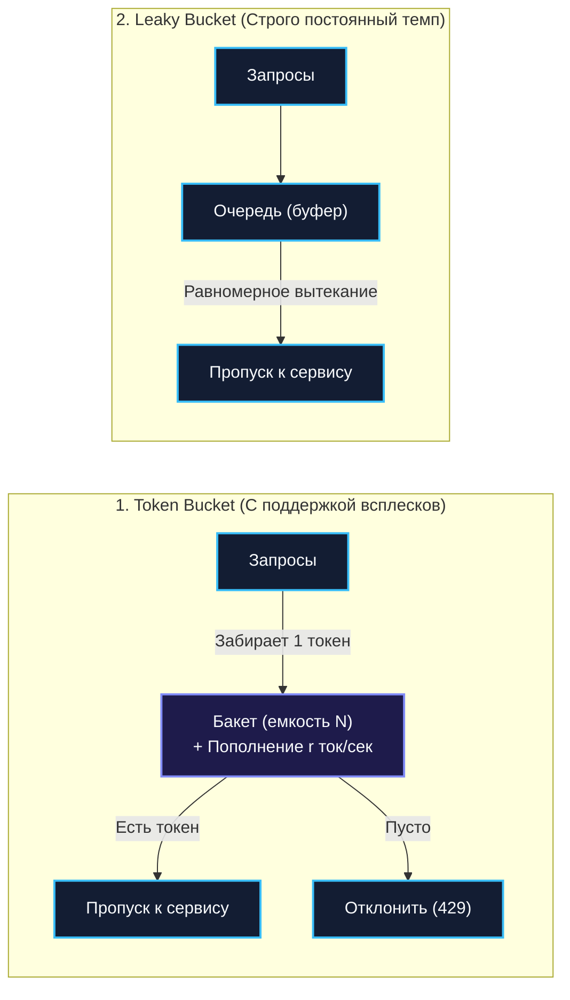
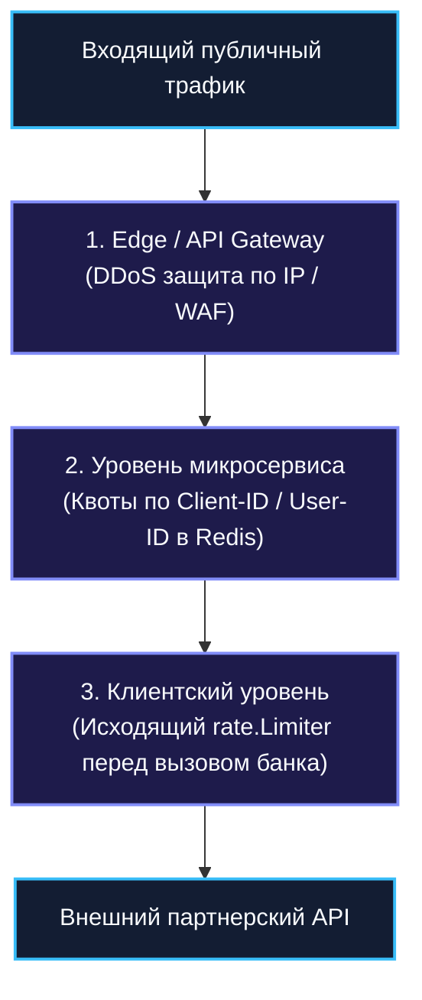

## Rate Limiting и защита системы

Рассмотренные ранее защитные механизмы — Timeout, Retry, Circuit Breaker и Bulkhead — виртуозно спасают распределённую систему от медленных зависимостей, сбоев сети и исчерпания внутренних пулов соединений. Однако существует класс угроз, не связанный с поломкой оборудования или багами в коде: **лавинообразный поток входящих запросов**, превышающий физическую пропускную способность всей платформы.

Это может быть злонамеренная распределённая DDoS-атака, агрессивный парсер цен конкурентов, зациклившийся скрипт неопытного партнёра или внезапный легитимный наплыв сотен тысяч пользователей во время «Чёрной пятницы» (Flash Crowd).

Если на вход сервиса, рассчитанного на 5 000 RPS, обрушится 100 000 RPS, никакой Bulkhead не спасёт систему: разрешённые семафоры будут мгновенно заняты, сетевые буферы ядра Linux переполнятся, а планировщик Go утонет в бесконечной обработке прерываний. Системе необходим механизм строгого контроля **темпа входящего трафика**.

**Rate Limiting (Ограничение частоты запросов)** — это первая линия обороны распределённой архитектуры, регулирующая частоту входящих или исходящих операций во времени (RPS, RPM) и безжалостно отсекающая избыточный трафик на самом внешнем рубеже, защищая внутренние компоненты от перегрузки.

---

### Зачем нужен Rate Limiting

В промышленной архитектуре Rate Limiting решает четыре ключевые бизнес-задачи:

1. **Защита от DDoS и спам-флуда**:  
   Ограничение количества запросов с одного IP-адреса, подсети или клиентского токена предотвращает выкачивание ресурсов злоумышленниками.
2. **Честное распределение ресурсов (Fair Use в Multi-Tenant средах)**:  
   В SaaS-платформах один сверхактивный корпоративный клиент не должен монополизировать CPU и диск, оставляя остальных клиентов без обслуживания («проблема шумного соседа», Noisy Neighbor).
3. **Соблюдение контрактных SLA и SLO**:  
   Если сторонний провайдер (например, шлюз SMS или банк) тарифицирует вызовы или жестко банит за превышение 100 RPS, вызывающий сервис обязан самостоятельно сдерживать свой исходящий темп ([[4. SLA, SLO, SLI и как они влияют на дизайн]]).
4. **Предотвращение каскадных перегрузок**:  
   Отсечение избыточных запросов до того, как они попадут в очередь СУБД, предотвращает накопление задержек, лавину повторов и фатальный отказ сервиса.

---

### Основные алгоритмы

Индустрия выработала четыре канонических алгоритма ограничения частоты.



---

#### Token Bucket

**Token Bucket (Ведро с токенами)** — самый гибкий, популярный и математически выверенный алгоритм в бэкенд-разработке.

- В логическое «ведро» вместимостью $b$ (Burst) с постоянной скоростью $r$ токенов в секунду непрерывно капают токены.
- Ведро не может переполниться: если токенов уже $b$, лишние просто испаряются.
- Каждый входящий запрос обязан забрать из ведра ровно один токен.
- Если токен есть — запрос немедленно пропускается к обработчику.
- Если ведро пусто — запрос отсекается с HTTP-статусом `429 Too Many Requests`.

**Главное достоинство:** Token Bucket идеально сглаживает пики, разрешая **кратковременные всплески (bursts)** вплоть до емкости ведра $b$, при этом строго гарантируя долговременную среднюю скорость на уровне $r$ RPS.

---

#### Leaky Bucket

**Leaky Bucket (Протекающее ведро)** представляет собой очередь фиксированного размера.
- Запросы поступают в ведро с любой случайной скоростью.
- Из отверстия на дне ведра запросы «вытекают» и передаются на обработку с **абсолютно постоянной, строго заданной скоростью**.
- Если ведро переполняется, новые входящие запросы переливаются через край и отбрасываются.

**Главное отличие от Token Bucket:** Leaky Bucket полностью уничтожает всплески, навязывая жесткий, фиксированный темп обработки. Идеален для систем, где downstream-сервис не переносит ни малейших флуктуаций трафика.

---

#### Fixed Window

**Fixed Window (Фиксированное окно)** делит временную шкалу на равные интервалы (например, ровно с 12:00 до 12:01, с 12:01 до 12:02). На каждом интервале работает счетчик запросов. По истечении минуты счетчик сбрасывается в ноль.

**Фатальный недостаток («Эффект границы окна» / Boundary Spike):**  
Представьте лимит 100 запросов в минуту. Клиент отправляет 100 запросов в 12:00:59, а затем следующие 100 запросов в 12:01:01. Оба пакета уложились в свои минутные окна, но **за 2 секунды система приняла 200 запросов!** Пиковая нагрузка удвоилась, что может пробить защиту бэкенда.

---

#### Sliding Window

**Sliding Window (Скользящее окно)** устраняет дефект границы, учитывая пропорциональный вклад предыдущего окна:
$$	ext{Count} = 	ext{Count}_{	ext{current}} + 	ext{Count}_{	ext{prev}} 	imes (1 - 	ext{TimeInCurrentWindow})$$

Если прошла треть текущей минуты, вес предыдущей минуты принимается за $2/3$. Это даёт плавное, реалистичное ограничение без резких граничных скачков.

---

### Реализация в Go

Экосистема Go предоставляет великолепные инструменты как для локального, так и для распределённого Rate Limiting.

---

#### `golang.org/x/time/rate` — Token Bucket

Стандартная полубиблиотека Go содержит образцовую, lock-free реализацию алгоритма Token Bucket:

```go
package ratelimit

import (
	"net/http"
	"time"

	"golang.org/x/time/rate"
)

// Инициализация: 100 RPS в среднем, максимальный мгновенный всплеск (burst) до 200 запросов
var globalLimiter = rate.NewLimiter(rate.Limit(100), 200)

func TokenBucketMiddleware(next http.Handler) http.Handler {
	return http.HandlerFunc(func(w http.ResponseWriter, r *http.Request) {
		// Allow() мгновенно проверяет наличие токена (не блокирует горутину!)
		if !globalLimiter.Allow() {
			// Информируем клиента о превышении квоты согласно стандартам RFC
			w.Header().Set("Retry-After", "1")
			w.Header().Set("X-RateLimit-Limit", "100")
			http.Error(w, "rate limit exceeded", http.StatusTooManyRequests)
			return
		}

		next.ServeHTTP(w, r)
	})
}
```

##### Метод `Reserve()` для сглаживания очередей
Если входящий запрос не нужно сразу отбрасывать, а допустимо задержать на несколько миллисекунд для сглаживания трафика, используется метод `Reserve()`:

```go
func HandleWithSmoothing(w http.ResponseWriter, r *http.Request) {
	reservation := globalLimiter.Reserve()
	if !reservation.OK() {
		http.Error(w, "rate limit exceeded", http.StatusTooManyRequests)
		return
	}

	// Засыпаем ровно на то время, пока ведро не восполнит токен
	time.Sleep(reservation.Delay())
	// Продолжаем выполнение запроса...
}
```

---

#### Распределённый Rate Limiting через Redis

В горизонтально масштабированном кластере Kubernetes запущены десятки независимых подов сервиса. Локальный `rate.NewLimiter` изолирован внутри одного пода: если выставить лимит 100 RPS, а в кластере работает 10 подов, суммарный пропущенный трафик составит $10 	imes 100 = 1 000$ RPS!

Для согласованного глобального ограничения используется распределённое хранилище **Redis**:

```go
package ratelimit

import (
	"context"
	"fmt"
	"time"

	"github.com/redis/go-redis/v9"
)

// Атомарный Lua-скрипт скользящего окна / Fixed Window
var rateLimitLua = redis.NewScript(`
	local key = KEYS[1]
	local limit = tonumber(ARGV[1])
	local window = tonumber(ARGV[2])

	local current = redis.call("INCR", key)
	if current == 1 then
		redis.call("EXPIRE", key, window)
	end

	if current > limit then
		return 0
	else
		return 1
	end
`)

func IsAllowedDistributed(ctx context.Context, rdb *redis.Client, clientID string, limit int, windowSec int) (bool, error) {
	key := fmt.Sprintf("ratelimit:%s:%d", clientID, time.Now().Unix()/int64(windowSec))

	// Исполнение Lua-скрипта атомарно на стороне Redis Engine
	res, err := rateLimitLua.Run(ctx, rdb, []string{key}, limit, windowSec).Int()
	if err != nil {
		return false, err
	}

	return res == 1, nil
}
```

Для скользящего лога (Sliding Window Log) в Redis традиционно используют сортированные множества (`ZSET`), где в качестве score выступает Unix-время запроса в миллисекундах (`ZADD`, `ZREMRANGEBYSCORE`, `ZCARD`). Для высоконагруженного промышленного применения стандартом является библиотека **`github.com/go-redis/redis_rate/v10`**, реализующая алгоритм **GCRA (Generic Cell Rate Algorithm)** на базе встроенных Lua-скриптов в Redis с микросекундной точностью.

---

#### Middleware для популярных роутеров

Написание middleware для `chi`, `gin` или `echo` требует единой дисциплины оформления HTTP-заголовков:

```go
package ratelimit

import (
	"net/http"

	"golang.org/x/time/rate"
)

func RateLimitMiddleware(limiter *rate.Limiter) func(http.Handler) http.Handler {
	return func(next http.Handler) http.Handler {
		return http.HandlerFunc(func(w http.ResponseWriter, r *http.Request) {
			if !limiter.Allow() {
				w.Header().Set("Retry-After", "1")
				w.Header().Set("X-RateLimit-Limit", "100")
				http.Error(w, "too many requests", http.StatusTooManyRequests)
				return
			}
			next.ServeHTTP(w, r)
		})
	}
}
```

> [!warning] Ловушка / Gotcha: Иллюзия локальных лимитеров в облаке
> Помните: локальный лимитер в коде Go защищает **только один конкретный инстанс** от локального перегрева.  
> Если цель — защитить общую базу данных или внешний API шлюз от суммарного трафика всех 50 подов, локальный лимитер бесполезен! Вы обязаны применять либо распределённый счетчик в Redis, либо выносить Rate Limiting на внешний API Gateway ([[35. API Gateway и BFF]]).

---

### Mechanical Sympathy: влияние Rate Limiting на рантайм Go

1. **Локальный Token Bucket (`golang.org/x/time/rate`)**:
   - Внутреннее состояние лимитера обновляется математически: при вызове `Allow()` рантайм не запускает фоновый тикер, а вычисляет разницу времени $\Delta t = 	ext{now} - 	ext{lastUpdate}$ и прибавляет $\Delta t 	imes r$ токенов.
   - Метод `Allow()` работает без блокировок системных потоков ОС и **не производит ни одной аллокации памяти в куче (Zero Allocations)** на горячем пути!
2. **Распределённый Rate Limiting с Redis**:
   - Каждый входящий запрос требует сетевого сетевого взаимодействия с Redis через TCP-сокет ($0.3–1.5$ мс).  
   - Для снижения латентности в высоконагруженных шлюзах применяют гибридный подход: локальный кэш на 100 мс в связке с асинхронным сбросом счетчиков в Redis через пайплайны (`rdb.Pipeline()`), что снижает число сетевых системных вызовов в 10 раз.

---

### Уровни Rate Limiting в архитектуре

Надёжная архитектура строит эшелонированный рубеж обороны:



1. **На уровне API Gateway / Ingress**:  
   Отсекает примитивный флуд, неавторизованные сканеры уязвимостей и DDoS по IP-адресам на самом внешнем периметре, не пропуская мусорные пакеты во внутреннюю сеть.
2. **На уровне отдельного сервиса**:  
   Реализует продуктовые квоты (например, Free тариф: 60 запросов в минуту; Pro тариф: 1 000 запросов в минуту) на основе расшифрованного `client_id` или JWT.
3. **На уровне клиента (Client-Side Outbound Limiting)**:  
   Микросервис Go сам сдерживает частоту своих вызовов к внешнему платёжному шлюзу с помощью `rate.Limiter`, предотвращая блокировку учетной записи со стороны банка.

---

### Связь с другими паттернами

- **Circuit Breaker** ([[36. Circuit Breaker, Retry, Timeout и Backoff]]): Реагирует на уже возникшие ошибки в downstream-сервисах. Rate Limiting предотвращает перегрузку, которая гарантированно вызвала бы эти ошибки.
- **Bulkhead** ([[37. Bulkhead и изоляция отказов]]): Изолирует ресурсы (пулы коннектов и горутин) внутри сервиса. Rate Limiting ограничивает темп, с которым внешние клиенты расходуют эти ресурсы.
- **Backpressure** ([[43. Backpressure и контроль нагрузки]]): Ответ `429 Too Many Requests` с заголовком `Retry-After` — это канонический протокольный механизм передачи противодавления клиенту.

---

### Антипаттерны и типичные ошибки

1. **Жёсткий лимит без права на всплеск (No Burst)**:  
   Использование алгоритма без поддержки всплесков приводит к тому, что обычный пользователь, случайно обновивший страницу дважды, получает ошибку `429`. Всегда настраивайте емкость всплеска (`burst`) в 2–3 раза выше базового RPS.
2. **Молчаливый отброс без HTTP-заголовков**:  
   Возврат пустой ошибки `429` без заголовка `Retry-After: 5` провоцирует клиента на агрессивные немедленные повторы (Retry Storm), усугубляя аварию.
3. **Отсутствие мониторинга срабатываний**:  
   Если в метриках Prometheus нет счетчика `rate_limit_rejected_total`, вы никогда не узнаете, кого вы отсекаете: реальных хакеров или легитимных клиентов из-за заниженных квот.
4. **Глобальный мьютекс на клиентах**:  
   Попытка синхронизировать счетчики между серверами через тяжелые распределенные блокировки вместо атомарных операций в Redis.

---

> [!tip] Собеседование
> **Вопрос:** Как правильно спроектировать распределённую систему Rate Limiting для публичного API с различными тарифными планами (Free, Business, Enterprise)?
> 
> **Ответ:**  
> Архитектура строится на следующих принципах:
> 1. **Хранилище счетчиков**: Высокодоступный кластер Redis с алгоритмом **Generic Cell Rate Algorithm (GCRA)** или Token Bucket на базе атомарных Lua-скриптов.
> 2. **Ключ ограничения**: Формируется на уровне API Gateway как комбинация идентификатора клиента и эндпоинта: `client_id:endpoint` (или в Redis: `ratelimit:{client_id}:{endpoint_group}`).
> 3. **Иерархия квот**: Лимиты загружаются из базы данных или кэша конфигураций (например: Free = 10 RPS / burst 20; Enterprise = 500 RPS / burst 1000).
> 4. **Информативность ответов**: При каждом запросе возвращаются заголовки стандарта IETF:
>    - `X-RateLimit-Limit`: максимальная квота;
>    - `X-RateLimit-Remaining`: оставшееся количество токенов в текущем окне;
>    - `X-RateLimit-Reset`: время в секундах до восполнения квоты;
>    - При превышении — статус `429 Too Many Requests` с заголовком `Retry-After`.
> 5. **Отказоустойчивость (Fail-Open vs Fail-Closed)**: Если кластер Redis временно недоступен, шлюз переходит в режим **Fail-Open** (пропускает запросы, логируя алерт), чтобы падение кэша не остановило работу бизнеса.

---

### Итог

Rate Limiting — это непреодолимый щит, защищающий архитектуру от безумия внешнего сетевого мира. Сочетание локальных Token Bucket для защиты отдельных процессов и распределённых скользящих окон на Redis для защиты платформы гарантирует, что система останется стабильной и предсказуемой под любым шквалом трафика.

Вместе с Timeout, Retry, Circuit Breaker и Bulkhead мы завершили построение несокрушимого эшелона отказоустойчивости и надежности данных.

Но как понять, что происходит внутри этого сложнейшего распределённого механизма в каждую долю секунды? Настало время включить свет в темноте распределённых систем.

Встречайте Блок 5 и его первую главу: [[39. Observability в архитектуре. Metrics, Logs, Traces]].
