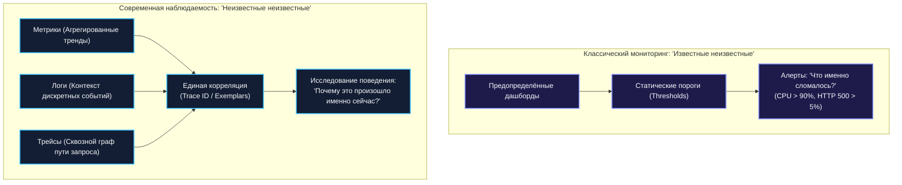
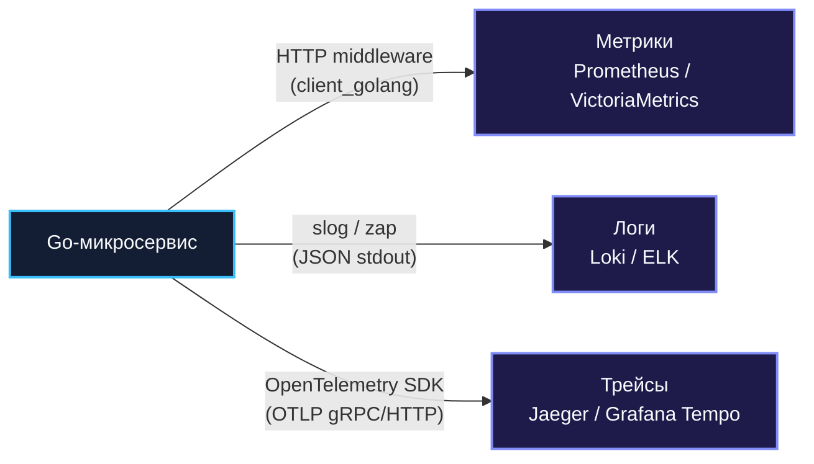
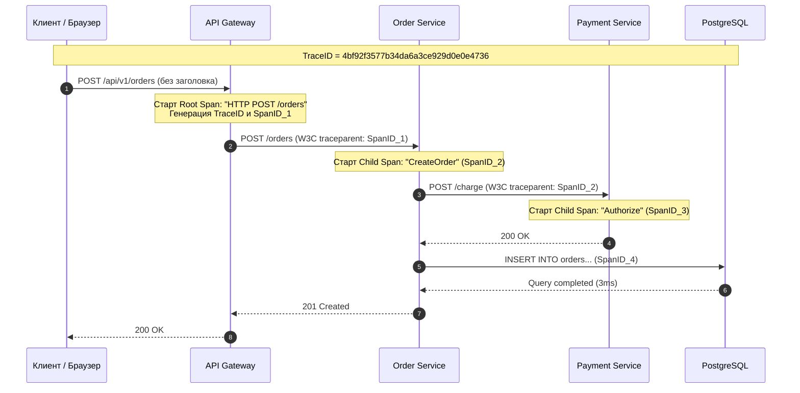
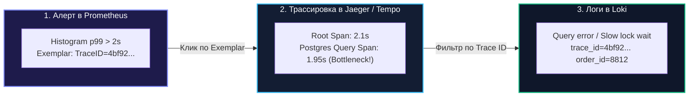
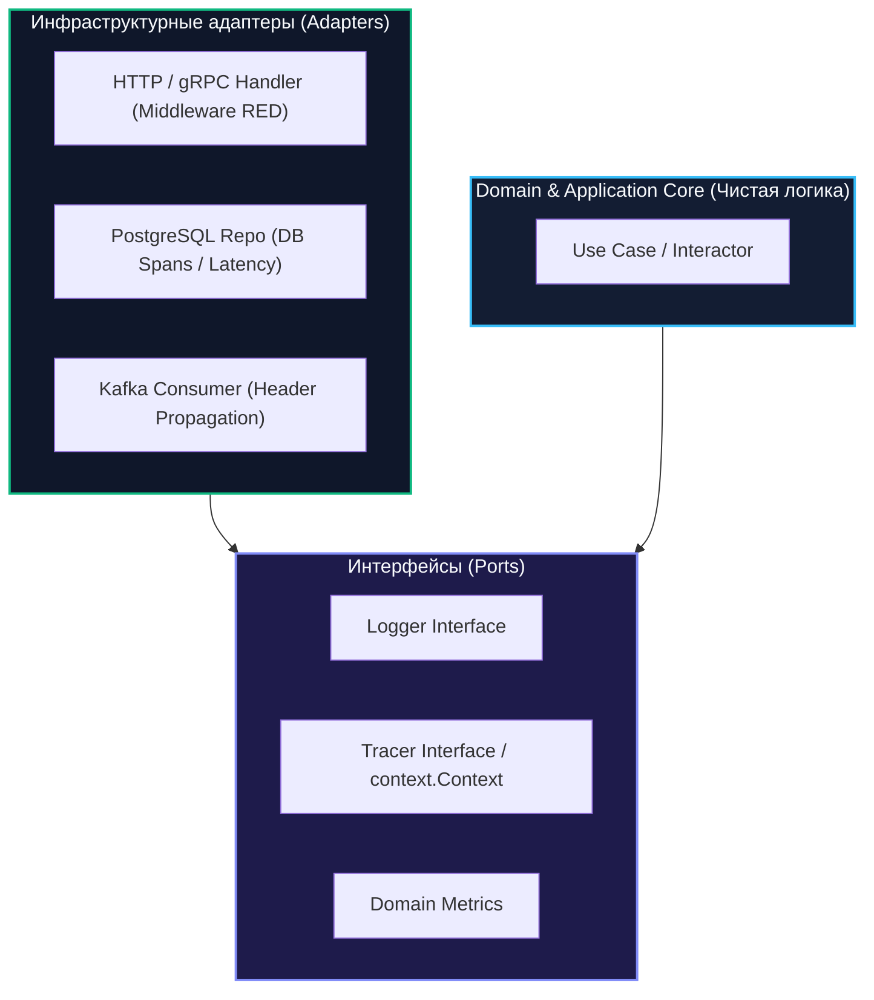

## Три столпа наблюдаемости

> *"To understand a system, you must be able to observe its state from its external outputs without tearing it apart."*  
> — Рудольф Калман, создатель теории линейных систем

Защитные механизмы распределённой архитектуры — Rate Limiting, Circuit Breaker, Timeout и Bulkhead — делают сервис удивительно стойким к ударам стихии. Они предотвращают каскадные обрушения и гасят сетевые штормы. Однако устойчивость вовсе не означает вечное отсутствие сбоев. В реальной жизни распределённая система непрерывно находится в состоянии частичной деградации: на одном из узлов подскочила задержка дискового ввода-вывода, сеть между дата-центрами начала терять 1.5% пакетов, сторонний платёжный шлюз стал отвечать кодом `504 Gateway Timeout`, а конкретный VIP-пользователь упирается в необъяснимую ошибку.

Если система представляет собой «чёрный ящик», инженеры дежурной смены обречены на судорожное гадание на кофейной гуще, лихорадочный перезапуск случайных подов и бесплодные споры в инцидент-чатах. 

Чтобы управлять сложной системой, её необходимо сделать **наблюдаемой (Observable)**. В этой лекции мы разберём фундаментальную триаду наблюдаемости — **метрики, логи и распределённые трейсы**, раскроем их архитектурное взаимодействие, реализуем идиоматичную инструментацию в рантайме Go (с учётом `log/slog` и OpenTelemetry) и измерим скрытую цену, которую наше «механическое сочувствие» платит за каждый снятый показатель.

---

### Observability vs Monitoring: два уровня понимания

В инженерном обиходе термины «мониторинг» и «наблюдаемость» часто путают, однако между ними пролегает глубокая концептуальная граница:



1. **Мониторинг (Monitoring)** отвечает на вопрос: *«Работает ли система в соответствии с нашими ожиданиями и что конкретно сломалось?»*  
   Он следит за предопределёнными симптомами («занято 92% памяти на узле DB-03», «число 500-х ответов превысило 2%»). Это пассивное наблюдение за заранее известными точками отказа.
2. **Наблюдаемость (Observability)** отвечает на вопрос: *«Почему система ведёт себя именно так в нештатной ситуации?»*  
   Это свойство внутренней архитектуры системы, позволяющее инженеру сформулировать *любой произвольный вопрос* о внутреннем состоянии сервисов на основе анализа выходных потоков телеметрии без необходимости деплоить новый код или расставлять отладочные принты.

В современной высоконагруженной архитектуре наблюдаемость опирается на три столпа:
- **Метрики (Metrics):** числовые временные ряды. Отвечают на вопросы: *«Сколько? Как быстро? Каков тренд?»*. Идеальны для обнаружения аномалий и детекции инцидентов.
- **Логи (Logs):** структурированные текстовые записи о дискретных событиях. Отвечают на вопрос: *«Что именно произошло в конкретной точке исполнения?»*.
- **Трейсы (Traces):** направленные ациклические графы пути одного запроса сквозь десятки микросервисов. Отвечают на вопрос: *«Где именно возникла задержка и на каком звене оборвалась цепочка?»*.



---

### Метрики: числа, раскрывающие тренды

Метрики представляют собой числовые временные ряды: пары `(timestamp, float64)`, снабжённые именами и набором строковых меток (labels/tags). Главное достоинство метрик — **предельная компактность и вычислительная дешевизна**: агрегация сотен тысяч запросов в секунду сводится к элементарным сложениям чисел в оперативной памяти процесса.

В экосистеме Go непререкаемым стандартом де-факто стал стек **Prometheus** и официальная библиотека `github.com/prometheus/client_golang/prometheus`.

В Prometheus существует 4 базовых типа метрик:
1. **Counter (Счётчик):** монотонно возрастающее число (сбрасывается только при перезапуске сервиса). Примеры: общее число запросов `http_requests_total`, число отправленных байт.
2. **Gauge (Датчик):** число, которое может произвольно расти и падать. Примеры: текущее количество активных горутин, занятая оперативная память, размер пула коннектов к БД.
3. **Histogram (Гистограмма):** квантование значений по настраиваемым корзинам (`buckets`). Позволяет вычислять процентили ($p50, p95, p99$) на стороне хранилища. Примеры: время обработки запросов, размер полезной нагрузки.
4. **Summary (Сводка):** рассчитывает скользящие квантили прямо в рантайме сервиса. Из-за высокой цены расчёта в Go-коде и невозможности агрегации между несколькими подами применяется редко.

#### RED-паттерн: Rate, Errors, Duration

Для сетевых сервисов и HTTP/gRPC API золотым стандартом является **RED-паттерн** (сформулированный Томом Уилки):

- **Rate (Частота):** количество входящих запросов в секунду (RPS).
- **Errors (Ошибки):** количество запросов, завершившихся неудачей (HTTP 5xx, gRPC коды ошибок).
- **Duration (Длительность):** распределение времени ответа сервиса (гистограмма латентности).

Ниже приведена промышленная реализация RED-инструментации в виде HTTP-middleware на чистом Go:

```go
package telemetry

import (
	"net/http"
	"strconv"
	"time"

	"github.com/prometheus/client_golang/prometheus"
	"github.com/prometheus/client_golang/prometheus/promhttp"
)

var (
	// Rate & Errors: счётчик входящих запросов с разбиением по кодам ответа
	httpRequestsTotal = prometheus.NewCounterVec(
		prometheus.CounterOpts{
			Namespace: "app",
			Subsystem: "http",
			Name:      "requests_total",
			Help:      "Total number of processed HTTP requests.",
		},
		[]string{"method", "path", "status"},
	)

	// Duration: гистограмма времени ответа с логарифмическими корзинами (в секундах)
	httpRequestDuration = prometheus.NewHistogramVec(
		prometheus.HistogramOpts{
			Namespace: "app",
			Subsystem: "http",
			Name:      "request_duration_seconds",
			Help:      "HTTP request latency distributions in seconds.",
			Buckets:   prometheus.DefBuckets, // от 5мс до 10с
		},
		[]string{"method", "path"},
	)
)

func init() {
	prometheus.MustRegister(httpRequestsTotal)
	prometheus.MustRegister(httpRequestDuration)
}

// responseWriter перехватывает HTTP-код ответа для фиксации в метриках
type responseWriter struct {
	http.ResponseWriter
	statusCode int
}

func (rw *responseWriter) WriteHeader(code int) {
	rw.statusCode = code
	rw.ResponseWriter.WriteHeader(code)
}

// MetricsMiddleware оборачивает любой стандартный http.Handler
func MetricsMiddleware(next http.Handler) http.Handler {
	return http.HandlerFunc(func(w http.ResponseWriter, r *http.Request) {
		start := time.Now()
		rw := &responseWriter{ResponseWriter: w, statusCode: http.StatusOK}

		next.ServeHTTP(rw, r)

		duration := time.Since(start).Seconds()

		// Записываем RED-показатели
		httpRequestsTotal.WithLabelValues(r.Method, r.URL.Path, strconv.Itoa(rw.statusCode)).Inc()
		httpRequestDuration.WithLabelValues(r.Method, r.URL.Path).Observe(duration)
	})
}
```

#### USE-паттерн: Utilisation, Saturation, Errors

Если RED-паттерн описывает состояние сервиса с точки зрения внешнего пользователя, то **USE-паттерн** (сформулированный Бренданом Греггом) описывает состояние внутренних аппаратных и системных ресурсов (процессор, память, сокеты, пулы горутин):

- **Utilisation (Утилизация):** процент времени или объёма, в течение которого ресурс был занят полезной работой (например, 70% CPU).
- **Saturation (Насыщение):** объём отложенной работы, скопившейся в очереди из-за перегрузки ресурса (например, длина runqueue планировщика Go, очередь задач в канале).
- **Errors (Ошибки):** количество аппаратных или системных сбоев (например, TCP retransmits, сброшенные сетевые пакеты).

Для непрерывного сбора метрик рантайма Go библиотека Prometheus предоставляет встроенный коллектор:

```go
// Регистрация детальных метрик рантайма Go (память, GC, горутины, аллокации)
prometheus.MustRegister(prometheus.NewGoCollector())
```

#### Экспорт метрик

В модели Prometheus принята pull-архитектура: агент сбора периодически (раз в 5–15 секунд) выполняет HTTP GET-запрос к выделенному техническому порту сервиса:

```go
// Отдельный внутренний мультиплексор для метрик и healthcheck-проверок
func RegisterMetricsEndpoint(mux *http.ServeMux) {
	mux.Handle("/metrics", promhttp.Handler())
}
```

---

### Логи: контекст и детали

Если метрики сигнализируют о том, что пожар начался, то логи позволяют локализовать брошенную спичку. Лог — это подробная текстовая запись о дискретном событии в жизни приложения.

Начиная с версии **Go 1.21**, в стандартную библиотеку языка вошёл пакет **`log/slog`**, закрепивший фундаментальный стандарт: логирование в промышленном бэкенде обязано быть **структурированным** и выводиться в формате **JSON**. До появления `slog` индустриальным стандартом служили сторонние библиотеки `uber-go/zap` (`go.uber.org/zap`) и `github.com/rs/zerolog`.

Каждая запись лога обязана представлять собой валидный JSON-объект, содержащий обязательные контекстные поля: временную метку с наносекундами, уровень логирования (`DEBUG`, `INFO`, `WARN`, `ERROR`), имя сервиса, идентификаторы сквозной трассировки (`trace_id`, `span_id`) и произвольные атрибуты операции:

```go
package main

import (
	"context"
	"log/slog"
	"os"
	"time"
)

type Order struct {
	ID     string
	UserID string
	Amount int64
}

func initLogger() *slog.Logger {
	// JSON-хендлер для машиночитаемого централизованного сбора (Loki, Elasticsearch)
	opts := &slog.HandlerOptions{
		Level:     slog.LevelInfo,
		AddSource: true, // добавляет файл и номер строки
	}
	handler := slog.NewJSONHandler(os.Stdout, opts)
	return slog.New(handler)
}

func ProcessOrder(ctx context.Context, logger *slog.Logger, order Order) {
	start := time.Now()

	// Бизнес-логика выполнения заказа...
	duration := time.Since(start)

	// Структурированная запись: строгая типизация ключей и значений
	logger.InfoContext(ctx, "order created successfully",
		slog.String("order_id", order.ID),
		slog.String("user_id", order.UserID),
		slog.Int64("amount_cents", order.Amount),
		slog.Int64("duration_ms", duration.Milliseconds()),
	)
}
```

> [!warning] Ловушка / Gotcha: Смертоносный `log.Printf` и неструктурированный мусор
> Никогда не используйте стандартный `log.Printf` или `fmt.Println` в production-коде. Неструктурированная текстовая каша (`"2026/09/14 User 123 failed to buy order 456"`) превращает поиск причин аварии в кошмар: её невозможно профильтровать по полям, агрегировать в Grafana Loki или Elasticsearch и сопоставить с трассировкой. Кроме того, стандартный пакет `log` захватывает глобальный мьютекс на каждый вывод в поток, создавая катастрофическое узкое горлышко при параллельной работе сотен горутин.

---

### Распределённая трассировка: путь запроса

В микросервисной среде единичный клик пользователя в мобильном приложении запускает разветвлённую цепную реакцию: вызов API Gateway каскадно расходится по сервисам аутентификации, каталога, корзины, платёжного шлюза, кэша Redis и баз данных. 

Когда сервис возвращает ошибку `504 Gateway Timeout` или латентность подскакивает до 4 секунд, ни метрики, ни разрозненные логи отдельных сервисов не способны показать, на каком именно плече сетевого пути возник затор. Эту задачу решает **распределённая трассировка (Distributed Tracing)**.

Индустриальным стандартом трассировки и телеметрии является проект CNCF **OpenTelemetry (OTel)**.

Трассировка оперирует тремя фундаментальными концепциями:
1. **Trace (Трейс):** полное дерево операций, порождённых одним внешним запросом. Трейс идентифицируется глобально уникальным 128-битным `TraceID`.
2. **Span (Спан):** неделимый отрезок работы внутри одного сервиса (например, выполнение SQL-запроса, вызов gRPC-метода или обработка HTTP-хендлера). Спан имеет имя, время старта и завершения, статус, атрибуты (теги) и идентификатор родителя `ParentSpanID`.
3. **Context Propagation (Проброс контекста):** протокольный механизм передачи идентификаторов трассировки сквозь сетевые границы. Стандартом W3C Trace Context определены HTTP-заголовки `traceparent` и `tracestate`.



В Go передача контекста трассировки естественным и идиоматичным образом ложится на стандартный интерфейс `context.Context`. Библиотека `go.opentelemetry.io` предоставляет готовые middleware и транспорты для сетевых вызовов:

```go
package main

import (
	"context"
	"net/http"

	"go.opentelemetry.io/contrib/instrumentation/net/http/otelhttp"
	"go.opentelemetry.io/otel"
	"go.opentelemetry.io/otel/attribute"
	"go.opentelemetry.io/otel/trace"
)

// Инструментация входящего HTTP-сервера
func SetupHTTPServer(mux *http.ServeMux) http.Handler {
	// otelhttp автоматически извлекает W3C traceparent из входящих заголовков
	return otelhttp.NewHandler(mux, "order-service")
}

// Инструментация исходящего HTTP-клиента
func NewInstrumentedClient() *http.Client {
	// otelhttp.NewTransport автоматически инжектирует traceparent в исходящие HTTP-заголовки
	return &http.Client{
		Transport: otelhttp.NewTransport(http.DefaultTransport),
	}
}

// Создание ручных спанов для критических участков бизнес-логики
func ProcessPayment(ctx context.Context, orderID string, amount int64) error {
	tracer := otel.Tracer("payment-processor")

	// Начинаем спан операции
	ctx, span := tracer.Start(ctx, "ProcessPayment",
		trace.WithAttributes(
			attribute.String("order.id", orderID),
			attribute.Int64("payment.amount", amount),
		),
	)
	defer span.End()

	// Выполнение логики...
	return nil
}
```

---

### Корреляция через единый идентификатор

Настоящая сила Observability раскрывается не тогда, когда метрики, логи и трейсы существуют по отдельности в разных вкладках браузера, а тогда, когда они **бесшовно связаны между собой единой нитью корреляции**:



Для достижения такой бесшовности HTTP-хендлер извлекает актуальный `TraceID` из контекста OpenTelemetry и автоматически обогащает им логгер `slog`:

```go
package middleware

import (
	"context"
	"log/slog"
	"net/http"

	"go.opentelemetry.io/otel/trace"
)

type contextKey string

const LoggerContextKey contextKey = "ctx_logger"

// LoggingMiddleware связывает логи с OpenTelemetry TraceID
func LoggingMiddleware(baseLogger *slog.Logger) func(http.Handler) http.Handler {
	return func(next http.Handler) http.Handler {
		return http.HandlerFunc(func(w http.ResponseWriter, r *http.Request) {
			ctx := r.Context()
			spanContext := trace.SpanContextFromContext(ctx)

			logger := baseLogger
			if spanContext.IsValid() {
				// Внедряем trace_id и span_id в контекстный логгер
				logger = logger.With(
					slog.String("trace_id", spanContext.TraceID().String()),
					slog.String("span_id", spanContext.SpanID().String()),
				)
			}

			// Пробрасываем обогащённый логгер в контекст запроса
			reqWithLogger := r.WithContext(context.WithValue(ctx, LoggerContextKey, logger))
			next.ServeHTTP(w, reqWithLogger)
		})
	}
}

// FromContext извлекает контекстный логгер
func FromContext(ctx context.Context) *slog.Logger {
	if logger, ok := ctx.Value(LoggerContextKey).(*slog.Logger); ok {
		return logger
	}
	return slog.Default()
}
```

А благодаря механизму **Prometheus Exemplars** инспектор метрик прямо на графике латентности видит точку конкретного медленного запроса, кликнув на которую переходит непосредственно в интерфейс Jaeger к трейсу этого запроса!

---

### Mechanical Sympathy: цена observability

Сбор данных никогда не бывает бесплатным. Профессиональный архитектор обязан трезво оценивать влияние каждого инструмента на наносекунды процессора, аллокации памяти и сетевой ввод-вывод.

#### 1. Метрики: Опасность взрыва кардинальности (Cardinality Explosion)
- Вызов `Counter.Inc()` или `Histogram.Observe()` под капотом использует атомарные инструкции процессора (`LOCK XADD` на x86-64) и хэш-таблицы лейблов с `RWMutex`. Это занимает доли наносекунд.
- Однако добавление в метрику динамических лейблов с высокой кардинальностью (например, `user_id`, `order_id` или сырого URL с уникальными query-параметрами) приводит к созданию новой структуры `time.Series` в куче Go на каждое уникальное значение! Это вызывает взрывной рост памяти (Out of Memory) и перегрузку сборщика мусора GC.
- **Правило:** Лейблы метрик должны быть строго ограничены конечным множеством значений (HTTP-методы, статусы, имена ручек).

#### 2. Логи: Блокировка системных вызовов и аллокации
- Каждый вызов `slog.InfoContext` или форматирование лога — это аллокация строк, сериализация JSON и системный вызов ядра Linux `write(2)` в файловый дескриптор `stdout` (fd 1).
- Если сервис генерирует 10 000 логов в секунду, горутины встают в очередь на блокировку pipe-буфера stdout ядра Linux.
- **Решение:** Использование буферизированных неблокирующих писателей с фиксированными кольцевыми буферами, сэмплирование логов информационного уровня (`zapcore.NewSampler`) и использование структурированных атрибутов `slog.Attr` без лишних аллокаций интерфейсов.

#### 3. Трейсы: Нагрузка на сеть и сэмплирование
- Создание спана требует аллокации структур в куче и сериализации метаданных. При 100 000 RPS попытка записать 100% трейсов создаст сетевой трафик телеметрии, превышающий полезную нагрузку приложения.
- **Решение: Head-based сэмплирование.** Трассируется только репрезентативная часть трафика (например, 1–5% случайных запросов, но 100% запросов с ошибками):

```go
import (
	sdktrace "go.opentelemetry.io/otel/sdk/trace"
)

// Сэмплирование 10% запросов: дочерние спаны наследуют решение родителя
sampler := sdktrace.ParentBased(
	sdktrace.TraceIDRatioBased(0.10),
)
```

> [!info] Под капотом: Асинхронный экспорт через BatchSpanProcessor
> В рантайме OpenTelemetry спаны не отправляются по сети синхронно в момент вызова `span.End()`. Вместо этого спан мгновенно помещается в неблокирующий кольцевой буфер в оперативной памяти. Отдельная фоновая горутина (`BatchSpanProcessor`) периодически или по заполнению буфера вычитывает пачку спанов и отправляет их в OTel Collector по протоколу OTLP (gRPC/Protobuf). Это полностью изолирует горячий путь обработки бизнес-запроса от задержек сетевого стека коллектора.

---

### Observability в архитектуре

Наблюдаемость — это не библиотека, которую подключают перед релизом в файле `main.go`. Это фундаментальный сквозной аспект чистой архитектуры ([[14. Clean Architecture и Dependency Rule]]):



1. **Контекст как главная артерия:** Каждый метод в интерфейсах бизнес-логики и репозиториев первым аргументом принимает `ctx context.Context`. Прерывание цепочки контекста убивает распределённую трассировку.
2. **Адаптеры на границах:** Входные адаптеры (HTTP/gRPC) извлекают контекст трассировки из сетевых заголовков и фиксируют RED-метрики. Выходные адаптеры (клиенты баз данных, брокеров сообщений) инжектируют контекст в исходящие заголовки и логируют ошибки с детализацией SQL-запросов.
3. **Бизнес-метрики:** Доменные сервисы инкрементируют продуктовые метрики (например, `orders_completed_total`, `payment_processing_amount_rubles`), не привязываясь к конкретному формату экспорта.

---

### Связь с другими темами

- **Распределённая трассировка:** Глубокий разбор контекстной пропагации, спанов и корреляции запросов представлен в лекции [[40. Distributed Tracing и корреляция запросов]].
- **Метрики и соглашения об уровне сервиса:** Сбор SLI и расчёт Error Budget детально рассмотрены в лекции [[4. SLA, SLO, SLI и как они влияют на дизайн]].
- **Защитные барьеры:** Данные метрик насыщения (USE) служат основой для динамического управления лимитами в [[38. Rate Limiting и защита системы]] и [[43. Backpressure и контроль нагрузки]].

---

### Антипаттерны и типичные ошибки

1. **High Cardinality Hell:**  
   Передача идентификаторов пользователей (`user_id`), хэшей или временных меток в качестве label в Prometheus. Приводит к мгновенному падению сервера метрик по OOM.
2. **Логирование чувствительных данных (PII/Secrets):**  
   Запись паролей, номеров кредитных карт или токенов авторизации в логи. Нарушает GDPR/PCI-DSS и создает критическую уязвимость безопасности.
3. **Отсутствие корреляции:**  
   Метрики собираются отдельно, логи пишутся без `trace_id`, а трейсы не настроены. При возникновении аварии инженеры тратят часы на ручное сопоставление времени логов с разных машин.
4. **Синхронный экспорт телеметрии:**  
   Попытка отправлять спаны трейсов или логи синхронно в сторонний HTTP API прямо в обработчике клиентского запроса. Любое сетевое замедление системы сбора моментально парализует все бизнес-сервисы.

---

> [!tip] Собеседование
> **Вопрос:** Как вы организуете стек Observability в новом высоконагруженном Go-микросервисе с нуля?
> 
> **Ответ:**  
> Архитектура телеметрии строится по принципу трех взаимосвязанных слоев:
> 1. **Метрики (RED + USE):**
>    - Входящие запросы оборачиваются в HTTP/gRPC middleware с фиксацией RED-показателей (`requests_total` по методам и статусам, `request_duration_seconds` с логарифмическими бакетами от 5мс до 10с).
>    - Подключается `prometheus.NewGoCollector()` для мониторинга рантайма Go (GC, память, горутины).
>    - Экспорт метрик организуется через отдельный технический порт `/metrics` (`promhttp.Handler()`), закрытый от внешнего мира.
> 2. **Логи (Structured JSON):**
>    - Используется стандартный пакет `log/slog` с `JSONHandler`, пишущий в `stdout`.
>    - Middleware извлекает текущий `TraceID` из `context.Context` и внедряет его в контекстный логгер: `logger = logger.With("trace_id", traceID)`.
> 3. **Трассировка (OpenTelemetry):**
>    - Настраивается OpenTelemetry Go SDK с OTLP-экспортёром в Jaeger/Tempo.
>    - Для HTTP/gRPC используется стандартная инструментация `otelhttp` и `otelgrpc` для автоматической W3C-пропагации контекста.
>    - Настраивается Head-based сэмплирование (например, 5–10% обычных запросов, 100% ошибок) через `sdktrace.ParentBased`.
>    - Спаны сбрасываются асинхронно через фоновый `BatchSpanProcessor`.

---

### Итог

Observability — это не роскошь и не факультативная надстройка, а единственный способ сохранить контроль над сложной распределённой системой. Метрики выступают в роли радара, предупреждающего об опасных тенденциях; логи предоставляют подробный отчёт бортового самописца о каждом конкретном инциденте; а распределённые трейсы освещают непрерывный сквозной путь транзакции сквозь лабиринт сотен сетевых узлов.

Связав эту триаду воедино через сквозные `TraceID`, мы получаем систему, способную отвечать на любые непредвиденные вопросы в моменты кризиса.

В следующей лекции мы детально погрузимся в механику самого сложного и мощного из этих компонентов: [[40. Distributed Tracing и корреляция запросов]].
