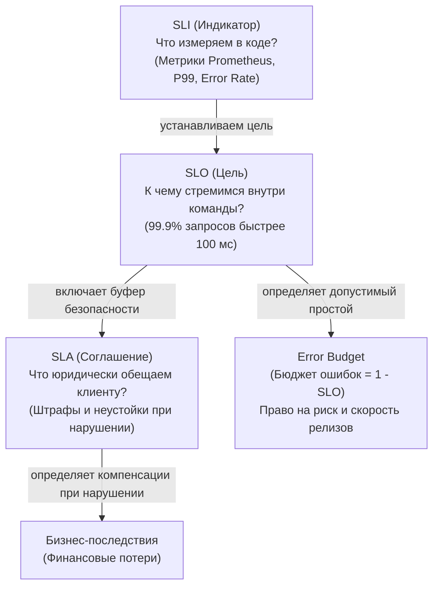
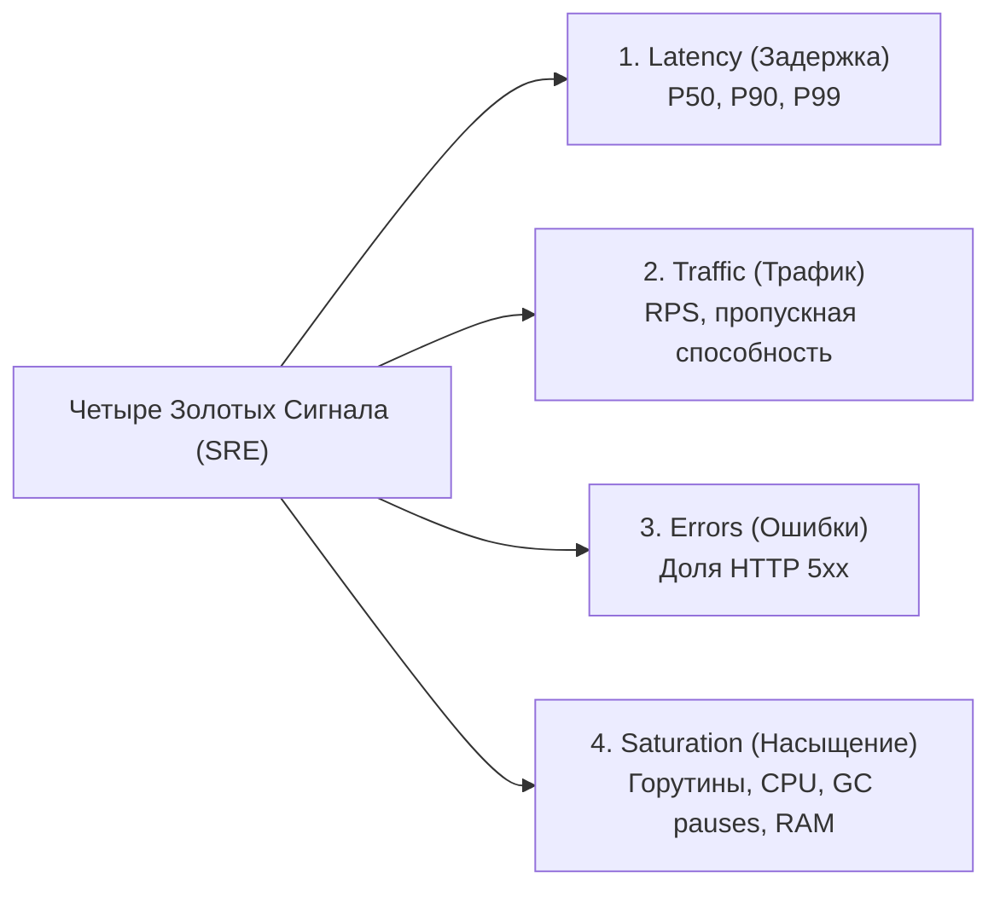
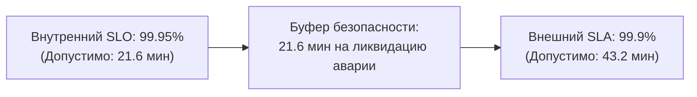

# SLA, SLO, SLI: Управление надежностью и влияние на дизайн систем

> *"If you cannot measure it, you cannot improve it. And if you cannot define when your system fails, you cannot design it to succeed."*  
> — Свободная интерпретация классического принципа Bell Labs

В предыдущей главе мы разделили требования к программной системе на функциональные («что делает код») и нефункциональные («каковы качественные атрибуты его работы»). Теперь пришло время перейти от общих пожеланий к строгой математике надежности.

Каждый инженер слышал фразы: *«Наш сервис должен работать быстро»* или *«Система обязана быть максимально надежной»*. Для системного архитектора подобные формулировки лишены смысла. Насколько быстро? Для скольких процентов пользователей? Сколько минут простоя в месяц допустимо, прежде чем бизнес начнет терять миллионы?

**SLI, SLO и SLA** — три фундаментальных инструмента Site Reliability Engineering (SRE), с помощью которых бизнес, продуктовые менеджеры и инженеры заключают негласный контракт. Для разработчика на Go уровня Senior+ понимание этих концепций критично: они определяют бюджет на таймауты сетевых вызовов, лимиты пулов горутин, выбор стратегий ретраев и даже конфигурацию аллокатора памяти рантайма.

---

### Определения: SLI, SLO, SLA

Эти три понятия выстраиваются в четкую вертикальную иерархию — от низкоуровневых счетчиков ядра до юридических соглашений с клиентами:

| Аббревиатура | Расшифровка | Суть | Пример |
|---|---|---|---|
| **SLI** | Service Level Indicator | Конкретная числовая метрика, характеризующая аспект работы сервиса. **Измеряем.** | P99 latency = 45ms, error rate = 0.05% |
| **SLO** | Service Level Objective | Целевое значение SLI за определённый период. **Целимся.** | P99 latency ≤ 100ms за 28 дней |
| **SLA** | Service Level Agreement | Юридически обязывающий договор с клиентом, включающий SLO и компенсации при нарушении. **Обещаем.** | Доступность 99.9% ежемесячно, иначе штраф 10% от оплаты |



> [!info] Под капотом: Точки фиксации
> SLI — это сырые данные, которые ваш Go-сервис экспортирует в виде метрик (Prometheus, Datadog). SLO — это конфигурация алертов и дашбордов. SLA — это строчка в контракте.  
> Внутренние микросервисы компании оперируют только SLI и SLO; SLA возникает тогда, когда сервис выходит на внешний рынок или обслуживает внешних платящих контрагентов.

---

### SLI для Go-сервиса: четыре золотых сигнала

В методологии Google SRE выделяют **Four Golden Signals** — четыре ключевых индикатора, исчерпывающе описывающих здоровье любого сетевого сервиса:



#### 1. Latency (Задержка)

Время обработки запроса. Для веб-сервиса на Go это время от получения HTTP-запроса до отправки ответа клиенту.

**Как измерять в Go:**  
Middleware, замеряющий длительность с помощью `time.Since()` и экспортирующий гистограмму в Prometheus:

```go
package middleware

import (
	"net/http"
	"time"

	"github.com/prometheus/client_golang/prometheus"
	"github.com/prometheus/client_golang/prometheus/promauto"
)

var httpRequestDuration = promauto.NewHistogramVec(
	prometheus.HistogramOpts{
		Name:    "http_request_duration_seconds",
		Help:    "Длительность обработки HTTP запросов",
		Buckets: []float64{0.005, 0.01, 0.025, 0.05, 0.1, 0.25, 0.5, 1, 2.5},
	},
	[]string{"method", "path"},
)

func MetricsMiddleware(next http.Handler) http.Handler {
	return http.HandlerFunc(func(w http.ResponseWriter, r *http.Request) {
		start := time.Now()
		defer func() {
			duration := time.Since(start).Seconds()
			httpRequestDuration.WithLabelValues(r.Method, r.URL.Path).Observe(duration)
		}()
		next.ServeHTTP(w, r)
	})
}
```

> [!warning] Ловушка / Gotcha: Усреднение логарифмическое vs линейное
> Никогда не используйте среднее арифметическое (Average) для оценки задержек! Среднее скрывает критические аномалии. Если 99 пользователей получили ответ за 10 мс, а один прождал 10 секунд, среднее покажет благополучные ~109 мс, хотя один клиент столкнулся с полным зависанием.  
> Всегда ориентируйтесь на процентили: **P50** (медиана), **P90**, **P99** и **P99.9**. В Prometheus гистограмма с корзинами (Buckets) позволяет вычислять процентили с помощью квантилей: `функции `histogram_quantile()` (например, `histogram_quantile(0.99, rate(http_request_duration_seconds_bucket[5m]))`)`.

#### 2. Traffic (Трафик)

Количество входящих запросов к сервису. Измеряется в RPS (Requests Per Second) или RPM.

**Как измерять:**  
Счетчик (Counter), инкрементируемый в том же Middleware:

```go
var httpRequestsTotal = promauto.NewCounterVec(
	prometheus.CounterOpts{
		Name: "http_requests_total",
		Help: "Общее число входящих запросов",
	},
	[]string{"method", "path"},
)

// Внутри обработчика:
httpRequestsTotal.WithLabelValues(r.Method, r.URL.Path).Inc()
```

#### 3. Errors (Ошибки)

Доля запросов, завершившихся сбоем. Критически важно разделять клиентские ошибки (`4xx`, например `400 Bad Request` или `404 Not Found`) и системные сбои бэкенда (`5xx`). В расчете SLO сервиса учитываются исключительно ошибки `5xx`.

**Как измерять:**  
Условный инкремент счетчика ошибок при `statusCode >= 500`:

```go
var httpRequestErrors = promauto.NewCounterVec(
	prometheus.CounterOpts{
		Name: "http_request_errors_total",
		Help: "Количество ошибок сервера 5xx",
	},
	[]string{"method", "path"},
)

// При фиксации статуса ошибки:
if statusCode >= 500 {
	httpRequestErrors.WithLabelValues(r.Method, r.URL.Path).Inc()
}
```

#### 4. Saturation (Насыщение)

Степень загруженности системных ресурсов. Для Go-сервиса ключевыми показателями насыщения служат:
- Количество активных горутин (`runtime.NumGoroutine()`).
- Утилизация ядер процессора относительно `GOMAXPROCS`.
- Частота и длительность фаз сборки мусора (GC Pause Duration).
- Заполненность внутренних очередей и буферизованных каналов.

**Как измерять:**  
Экспорт runtime-метрик через `prometheus.NewGoCollector()` или сбор детальных кастомных метрик из структуры `runtime.MemStats`:

```go
// Регистрация стандартных метрик Go runtime
prometheus.MustRegister(prometheus.NewGoCollector())
```

---

### SLO и Error Budget

**SLO** — это целевой уровень надежности, выраженный через SLI.  
*Пример:* «99.9% запросов к эндпоинту `/api/order` за скользящее окно в 30 дней должны завершаться со статусом `200 OK` и выполняться быстрее 200 мс».

Из значения SLO напрямую рассчитывается **Error Budget (Бюджет ошибок)**:

$$\text{Error Budget} = 1 - \text{SLO}$$

Если внутренний SLO по доступности равен **99.9%**, то допустимый объем сбоев за 30-дневный период составляет:
$$(100\% - 99.9\%) \times 30 \times 24 \times 60 \approx 43.2 \text{ минуты}$$

Бюджет ошибок — это законное право инженерной команды идти на оправданный риск:
- Выкатывать сложные архитектурные релизы.
- Проводить канареечные развертывания и A/B-тесты.
- Экспериментировать с новыми версиями компилятора Go.

Пока бюджет ошибок не исчерпан, команда может сохранять высокую скорость разработки (Feature Velocity). Но если произошла серия инцидентов и бюджет сгорел до нуля, релизы нового функционала автоматически замораживаются: все силы команды переключаются на укрепление отказоустойчивости и устранение корневых причин сбоев.

```mermaid
gantt
    title Сгорание Бюджета Ошибок (Error Budget Burn Rate)
    dateFormat X
    axisFormat %d день
    
    section Бюджет доступности
    Нормальная работа (Burn Rate 1x) :active, b1, 0, 15
    Инцидент в ЦОД: сгорает 60% бюджета :crit, b2, 15, 17
    Заморозка релизов & Стабилизация :milestone, b3, 17, 30
```

> [!tip] Собеседование: Зачем нужен Error Budget?
> **Вопрос:** Зачем нужен Error Budget и как он влияет на процесс разработки?  
> **Ответ:** Error Budget переводит надежность из абстрактного лозунга в конкретный измеримый ресурс. Он устраняет извечный конфликт между разработкой (которая хочет катить фичи как можно быстрее) и эксплуатацией/SRE (которая хочет стабильности). Error Budget дает формальное право на контролируемый риск и служит беспристрастным критерием для временной остановки релизов при его исчерпании.

---

### Как SLO и Error Budget влияют на архитектурный дизайн

SLO — это не просто цветные графики в Grafana. Они диктуют выбор конкретных технических решений в кодовой базе.

#### Таймауты и дедлайны

Если совокупный SLO по latency для эндпоинта равен 200 мс, то все вызовы к базам данных и микросервисам должны иметь жесткие квоты времени, укладывающиеся в этот лимит. В Go это реализуется через `context.WithTimeout`:

```go
package service

import (
	"context"
	"errors"
	"time"
)

var ErrTemporaryUnavailable = errors.New("сервис временно недоступен")

type StockClient interface {
	CheckAvailability(ctx context.Context, items []string) (bool, error)
}

type OrderService struct {
	stockClient StockClient
}

func (s *OrderService) CreateOrder(ctx context.Context, req []string) error {
	// Если SLO сервиса 200ms, выделяем жесткий лимит 50ms на проверку наличия
	stockCtx, cancel := context.WithTimeout(ctx, 50*time.Millisecond)
	defer cancel()

	_, err := s.stockClient.CheckAvailability(stockCtx, req)
	if err != nil {
		if errors.Is(err, context.DeadlineExceeded) {
			// Таймаут превышен: аккуратно отдаем ошибку без блокировки потока
			return ErrTemporaryUnavailable
		}
		return err
	}
	return nil
}
```

> [!warning] Ловушка / Gotcha: DefaultClient без таймаута
> В стандартной библиотеке Go стандартный клиент `http.DefaultClient` **вообще не имеет таймаута**! Если удаленный сервер зависнет на установлении соединения или передаче тела, горутина зависнет навечно.  
> В боевом коде всегда создавайте собственный экземпляр `http.Client` с явным значением `Timeout` или передавайте контекст в каждый вызов:
> 
> ```go
> var httpClient = &http.Client{
>     Timeout: 10 * time.Second,
> }
> ```

#### Ретраи и Circuit Breaker

При временной недоступности зависимого сервиса бездумные ретраи (Retries) способны мгновенно испепелить весь бюджет ошибок и устроить лавинообразный отказ всей системы (Thundering Herd). Архитектура обязана предусматривать:
- **Exponential backoff** со случайным смещением (**jitter**).
- Строгое ограничение числа попыток.
- **Circuit Breaker** (предохранитель), размыкающий цепь при превышении порогового процента сбоев (подробнее в [[36. Circuit Breaker, Retry, Timeout и Backoff]]).

#### Репликация и Multi-Region

Если для системы выставлен SLO доступности **99.99%** («четыре девятки»), допустимое время простоя составляет всего **~52 минуты в год**. Достичь такого показателя в рамках одного дата-центра физически невозможно: любая авария на магистральной оптоволоконной линии или плановые работы энергетиков сожгут годовой бюджет. 

Следовательно, архитектура обязана стать:
- Географически распределенной (Multi-Region).
- **Stateless** на уровне прикладных сервисов Go ([[7. Stateless vs Stateful сервисы]]), чтобы трафик можно было мгновенно переключить на резервный регион.
- Опирающейся на репликацию данных с учетом компромиссов CAP-теоремы ([[30. CAP теорема и реальные компромиссы]]).

#### Управление горутинами и пулами соединений

Бесконтрольный запуск горутин или открытие тысяч одновременных сокетов к базе данных приводит к быстрому исчерпанию ресурсов (Saturation) и деградации Latency.

Ограничение параллелизма через буферизованный канал-семафор:

```go
package limit

import "context"

// Ограничение количества одновременных тяжелых операций числом 100
var sem = make(chan struct{}, 100)

func HeavyOperation(ctx context.Context) error {
	select {
	case sem <- struct{}{}:
		defer func() { <-sem }()
		// Выполнение полезной работы
		return nil
	case <-ctx.Done():
		return ctx.Err()
	}
}
```

Тонкая настройка пула соединений к PostgreSQL через пакет `database/sql`:

```go
db.SetMaxOpenConns(25)
db.SetMaxIdleConns(10)
db.SetConnMaxLifetime(5 * time.Minute)
```

---

### Mechanical Sympathy: GC и хвостовые задержки

Для сервисов на Go с жесткими требованиями к хвостовой задержке (**P99 < 50ms**) критическое значение приобретает поведение сборщика мусора.

Хотя паузы Stop-The-World в рантайме Go составляют доли миллисекунды, при интенсивном темпе аллокаций фазы маркировки (GC Mark Phase) запускаются слишком часто. Если горутина попадает на фазу GC Assist (когда рантайм привлекает пользовательскую горутину к помощи в разметке памяти), время ее выполнения скачкообразно возрастает, что мгновенно пробивает границу P99.

**Инженерный комплекс мер:**
1. **Снижение аллокаций:** переиспользование временных объектов через `sync.Pool`.
2. **Профилирование памяти:** регулярный запуск `go tool pprof -alloc_space`.
3. **Тюнинг GC:** настройка параметров `GOGC` и мягкого лимита `GOMEMLIMIT` (Go 1.19+).
4. **Предпочтение Value-типов:** размещение данных на стеке без выхода в кучу (Escape Analysis).

```go
package buffer

import (
	"net/http"
	"sync"
)

type Response struct {
	Data []byte
}

// Пул переиспользуемых структур для горячего пути
var responsePool = sync.Pool{
	New: func() interface{} { 
		return &Response{Data: make([]byte, 0, 1024)} 
	},
}

func HandlerOptimized(w http.ResponseWriter, r *http.Request) {
	resp := responsePool.Get().(*Response)
	defer responsePool.Put(resp)
	resp.Data = resp.Data[:0] // Сброс длины среза без повторной аллокации памяти
	
	w.WriteHeader(http.StatusOK)
}
```

---

### Практический пример: расчет бюджета ошибок для Go-сервиса

Спроектируем контур надежности для микросервиса обработки платежей.

**SLI:**
- Availability: доля ответов `2xx/3xx` к общему числу запросов.
- P99 Latency: 99-й процентиль времени формирования ответа.

**SLO:**
- Availability $\ge$ 99.95% за скользящее окно 30 дней.
- P99 Latency $\le$ 100 мс за те же 30 дней.

**Расчет бюджета ошибок:**
- Месячный интервал: $30 \times 24 \times 60 = 43\,200$ минут.
- Допустимое время деградации: $0.05\% \times 43\,200 = \mathbf{21.6 \text{ минуты}}$ в месяц.

**Архитектурные последствия:**
- Неаккуратный деплой, вызывающий 2-минутный разрыв соединений, съедает 10% месячного бюджета.
- Инцидент с падением пода на 5 минут сжигает сразу 23% бюджета.
- Следовательно, сервис **обязан** поддерживать:
  1. Корректный **Graceful Shutdown** с перехватом `SIGTERM`.
  2. Настроенные **Readiness и Liveness probes** в манифестах Kubernetes.
  3. Стратегию развертывания **Rolling Update** с параметрами `maxUnavailable: 0` и `maxSurge: 1`.

---

### SLA: когда метрики становятся деньгами

**SLA (Service Level Agreement)** — это уже юридический и финансовый документ между поставщиком и клиентом. 

Классическая формулировка:
> *«Платформа гарантирует доступность сервиса на уровне 99.9% ежемесячно. В случае превышения суммарного времени простоя более 43.2 минут в месяц, заказчику предоставляется компенсация в размере 10% от ежемесячной абонентской платы за каждый последующий час недоступности».*

Фундаментальное правило системного проектирования: **внутренний SLO обязан быть жестче внешнего SLA**.



> [!tip] Собеседование: Зачем занижать SLA относительно SLO?
> **Вопрос:** Почему внутренний SLO команды всегда строже внешнего SLA перед клиентом?  
> **Ответ:** Это формирует **инженерный буфер безопасности (Safety Buffer)**. Если команда ориентируется на SLO 99.95%, а клиенту обещано 99.9%, у дежурных инженеров есть 21.6 минуты на локализацию аварии и откат релиза до того, как вступят в силу юридические штрафы и финансовые санкции.

---

### Итог

1. **SLI** — объективные числовые измерения работы системы (Latency, Traffic, Errors, Saturation), собираемые через Prometheus middleware.
2. **SLO** — амбициозная внутренняя цель надежности, порождающая **Error Budget** (инженерное право на риск и эксперименты).
3. **SLA** — юридический договор с клиентом, нарушение которого ведет к штрафам.
4. SLO напрямую диктуют архитектуру: таймауты сетевых контекстов (`context.WithTimeout`), паттерны отказоустойчивости (Circuit Breaker), размеры пулов горутин и стратегии развертывания в Kubernetes.
5. Для систем на Go контроль хвостовых задержек P99 неразрывно связан с тюнингом Garbage Collector (`GOMEMLIMIT`) и переиспользованием памяти (`sync.Pool`).

Освоив метрики надежности, мы готовы перейти к фундаментальным законам распределенных вычислений: компромиссам между задержкой, пропускной способностью и доступностью. В следующей лекции: [[5. Latency, Throughput, Availability и Trade-offs]].
