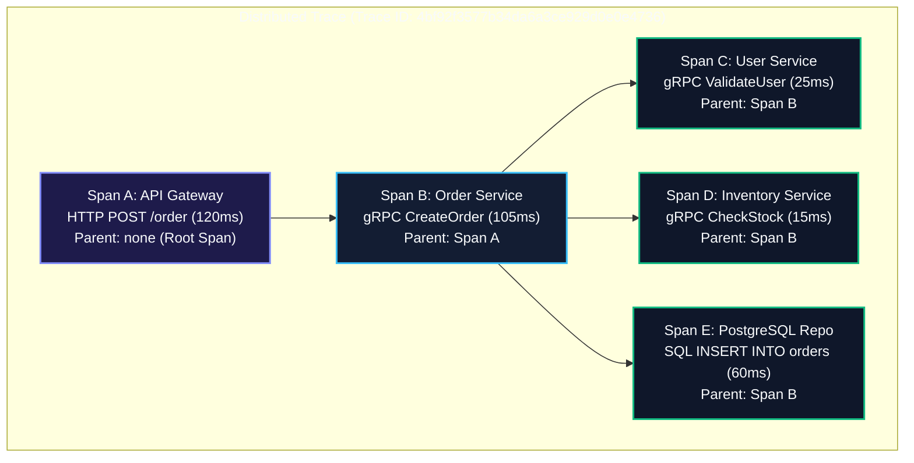
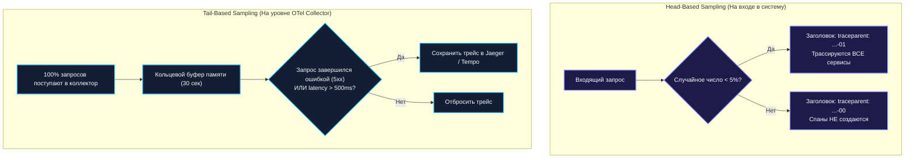

## Распределённая трассировка под микроскопом

> *"The most effective debugging tool is still careful thought, coupled with judiciously placed print statements — but when your system spans a hundred machines across the continent, you need a way for those prints to find each other."*  
> — Брайан Керниган

Представьте почтовую службу, доставляющую заказное международное отправление. Если посылка теряется или задерживается на две недели, отправителю мало пользы от сводной статистики: «в сентябре 98% писем доставлены вовремя». Ему не поможет и ворох разрозненных журналов пятидесяти почтовых отделений разных стран. Всё, что ему нужно — это **трек-номер (Tracking Number)**, наклеенный на конверт в момент отправки. Просканировав этот единый номер, почтовая система выстраивает хронологическую ленту пути: когда письмо покинуло терминал в Нью-Йорке, через какой транзитный хаб в Амстердаме проследовало, сколько часов пролежало на таможне и в какой конкретно момент курьер нажал кнопку дверного звонка.

В распределённых микросервисных системах роль такого универсального трек-номера выполняет **распределённая трассировка (Distributed Tracing)**.

Когда высокоуровневые метрики сообщают, что задержка $p99$ внезапно выросла с 80 до 650 мс, а процент ошибок поднялся до 2.5%, они лишь констатируют факт катастрофы ([[39. Observability в архитектуре. Metrics, Logs, Traces]]). Логи отдельных сервисов тонут в тысячах строк, фиксируя лишь локальные микрозадержки. Где именно запрос провёл лишние полсекунды? В ожидании мьютекса в Go-рантайме, в медленном SQL-запросе с Full Table Scan или на этапе TLS-хендшейка к внешнему платёжному шлюзу?

В этой лекции мы разберём внутреннюю анатомию трейсов и спанов, стандарты передачи контекста сквозь сетевой стек (W3C Trace Context), реализуем промышленную инструментацию на базе OpenTelemetry в Go, построим корреляцию с `log/slog` и детально исследуем механику сэмплирования, защищающую наши сервера от перегрузки самой телеметрией.

---

### Trace, Span и контекст

Архитектурно распределённая трассировка представляет собой **направленный ациклический граф (DAG)**, вершинами которого являются логические операции, а рёбрами — причинно-следственные связи между ними:



В терминах стандарта OpenTelemetry эта модель состоит из следующих ключевых сущностей:

1. **Trace (Трейс):** Полная история прохождения одного внешнего запроса сквозь всю экосистему сервисов. Трейс идентифицируется глобально уникальным 128-битным числом — **`Trace ID`** (в hex-формате: 32 символа).
2. **Span (Спан):** Атомарный кирпичик трейса. Это именованный непрерывный отрезок времени, представляющий одну логическую операцию (обработку HTTP-запроса, выполнение транзакции в БД, вызов внешнего RPC-метода или обработку сообщения из очереди Kafka).
3. **Span Context (Контекст спана):** Минимальный набор метаданных, необходимый для идентификации спана в распределённой сети:
   - **`Trace ID`:** Общий для всех спанов в рамках одной цепочки вызовов.
   - **`Span ID`:** Уникальный 64-битный идентификатор текущего спана (16 hex-символов).
   - **`Parent Span ID`:** Идентификатор родительского спана, породившего текущую операцию (у корневого Root Span он пуст).
   - **`Trace Flags`:** 8-битная битовая маска, определяющая параметры трейсинга (младший бит `01` указывает, что трейс сэмплирован — `Sampled`).
4. **Атрибуты (Attributes) и События (Events):**
   - **Attributes:** Типизированные пары «ключ-значение», описывающие операцию (`http.method = "POST"`, `db.system = "postgresql"`, `order.id = "ord-9921"`).
   - **Events:** Временные отметки (аннотации) внутри спана с сообщением и временным штампом, фиксирующие моментальные вехи (например, `"cache_miss"`, `"serialization_start"`).
5. **Status (Статус):** Результат выполнения (`Unset`, `Ok`, `Error`). При возникновении паники или возврате ошибки спан помечается статусом ошибки с записью стектрейса через `span.RecordError(err)`.

Визуально в интерфейсах систем визуализации (Jaeger, Grafana Tempo) трейс представляется в виде каскадной диаграммы Ганта (Waterfall view), где мгновенно виден критический путь (Critical Path) запроса:

```mermaid
gantt
    title Каскадное исполнение трейса (Waterfall View)
    dateFormat X
    axisFormat %s мс

    section Gateway
    HTTP POST /orders (Span A)       :active, a1, 0, 120
    
    section Order Service
    gRPC CreateOrder (Span B)        :crit, b1, 10, 115
    
    section Downstream
    ValidateUser (Span C)            :c1, 15, 40
    CheckStock (Span D)              :d1, 42, 57
    SQL INSERT orders (Span E)       :crit, e1, 60, 110
```



---

### Как контекст путешествует между сервисами

Чтобы распределённая трассировка работала, `Trace ID` и `Span ID` должны бесшовно передаваться через границы процессов, сетевых сокетов и протоколов. Этот процесс называется **контекстной пропагацией (Context Propagation)**.

Исторически существовал зоопарк несовместимых проприетарных форматов: B3 (разработанный Twitter для Zipkin), Jaeger Native (`uber-trace-id`), AWS X-Ray, Datadog. В современной архитектуре стандартом де-юре и де-факто стал открытый стандарт консорциума **W3C Trace Context**, поддерживаемый всеми облачными провайдерами и рантаймами.

#### Спецификация W3C Trace Context

Стандарт определяет два ключевых HTTP-заголовка:

1. **`traceparent`** (обязательный заголовок):  
   Имеет строго фиксированный формат из 4 полей, разделённых дефисом:
   ```
   traceparent: 00-4bf92f3577b34da6a3ce929d0e0e4736-00f067aa0ba902b7-01
                ^^ ^^^^^^^^^^^^^^^^^^^^^^^^^^^^^^^^ ^^^^^^^^^^^^^^^^ ^^
              версия            Trace ID                 Parent Span ID  флаги
   ```
   - **Версия (Version):** `00` (текущая версия стандарта).
   - **Trace ID:** 32 hex-символа (16 байт).
   - **Parent Span ID:** 16 hex-символов (8 байт), представляющий ID вызывающего спана.
   - **Trace Flags:** 2 hex-символа (1 байт). Флаг `01` означает, что вызывающая сторона приняла решение сохранить этот трейс (`sampled`).

2. **`tracestate`** (опциональный заголовок):  
   Список пар «вендор-состояние» (`rojo=123,congo=456`), позволяющий пробрасывать специфичные метаданные различных систем трассировки сквозь гетерогенные прокси без потери контекста.

3. **W3C Baggage (`baggage`):**  
   Механизм сквозной передачи произвольных бизнес-метрик сквозь всю цепочку вызовов (например, `user_tier=enterprise,region=eu-central`). В отличие от атрибутов спана, которые остаются локальными, элементы Baggage автоматически сериализуются в HTTP-заголовки и доезжают до самого последнего сервиса в цепочке.

В рантайме Go за сериализацию и парсинг заголовков отвечает абстракция `propagation.TextMapPropagator`:

```go
package tracing

import (
	"context"
	"net/http"

	"go.opentelemetry.io/otel"
	"go.opentelemetry.io/otel/propagation"
)

// Инжектирование контекста трассировки в исходящий HTTP-запрос
func InjectTraceContext(ctx context.Context, req *http.Request) {
	otel.GetTextMapPropagator().Inject(ctx, propagation.HeaderCarrier(req.Header))
}

// Извлечение контекста трассировки из входящего HTTP-запроса
func ExtractTraceContext(r *http.Request) context.Context {
	return otel.GetTextMapPropagator().Extract(r.Context(), propagation.HeaderCarrier(r.Header))
}
```

> [!info] Под капотом: W3C vs Zipkin B3
> W3C Trace Context работает на уровне прикладного протокола. Исторический формат B3 (созданный в Zipkin) использовал раздельные заголовки: `X-B3-TraceId`, `X-B3-SpanId`, `X-B3-Sampled` или единый объединённый заголовок `b3`. OpenTelemetry SDK из коробки поддерживает создание композитных пропогаторов (`propagation.NewCompositeTextMapPropagator`), способных одновременно понимать и W3C, и B3, что позволяет плавно мигрировать легаси-инфраструктуру на современный стандарт.

---

### Инструментация Go-сервиса с OpenTelemetry

OpenTelemetry (OTel) предоставляет четкое разделение между **API** (стабильные интерфейсы для расстановки спанов без привязки к вендорам) и **SDK** (конкретная реализация, управляющая аллокациями, батчингом, сэмплированием и сетевым экспортом).

#### 1. Инициализация TracerProvider и OTLP-экспортёра

Входная точка инициализации трассировки настраивается в `main.go` и обеспечивает корректный graceful shutdown при остановке сервиса:

```go
package main

import (
	"context"
	"fmt"
	"log"
	"net/http"
	"time"

	"go.opentelemetry.io/contrib/instrumentation/net/http/otelhttp"
	"go.opentelemetry.io/otel"
	"go.opentelemetry.io/otel/exporters/otlp/otlptrace/otlptracegrpc"
	"go.opentelemetry.io/otel/propagation"
	"go.opentelemetry.io/otel/sdk/resource"
	sdktrace "go.opentelemetry.io/otel/sdk/trace"
	semconv "go.opentelemetry.io/otel/semconv/v1.24.0"
)

func initTracer(ctx context.Context, serviceName string) (*sdktrace.TracerProvider, error) {
	// Создаем OTLP-экспортер, отправляющий трейсы по gRPC в Jaeger / OpenTelemetry Collector
	exporter, err := otlptracegrpc.New(ctx,
		otlptracegrpc.WithEndpoint("jaeger:4317"),
		otlptracegrpc.WithInsecure(),
	)
	if err != nil {
		return nil, fmt.Errorf("failed to create OTLP trace exporter: %w", err)
	}

	// Описываем наш сервис в соответствии со спецификацией Semantic Conventions
	res, err := resource.New(ctx,
		resource.WithAttributes(
			semconv.ServiceNameKey.String(serviceName),
			semconv.ServiceVersionKey.String("1.0.0"),
			semconv.DeploymentEnvironmentKey.String("production"),
		),
	)
	if err != nil {
		return nil, fmt.Errorf("failed to create resource: %w", err)
	}

	// Настраиваем TracerProvider: фоновый батчер + сэмплер
	tp := sdktrace.NewTracerProvider(
		sdktrace.WithBatcher(exporter,
			sdktrace.WithBatchTimeout(5*time.Second),
			sdktrace.WithMaxExportBatchSize(512),
		),
		sdktrace.WithResource(res),
		sdktrace.WithSampler(sdktrace.AlwaysSample()), // Для dev/staging; в prod настраивается Head-based сэмплер!
	)

	// Регистрируем глобальный провайдер и стандартные W3C пропогаторы
	otel.SetTracerProvider(tp)
	otel.SetTextMapPropagator(propagation.NewCompositeTextMapPropagator(
		propagation.TraceContext{}, // W3C traceparent
		propagation.Baggage{},      // W3C baggage
	))

	return tp, nil
}
```

#### 2. Инструментация HTTP-сервера и роутера

Библиотека `go.opentelemetry.io/contrib/instrumentation/net/http/otelhttp` предоставляет готовую middleware-обертку для стандартного мультиплексора или любого совместимого HTTP-роутера:

```go
func main() {
	ctx, cancel := context.WithTimeout(context.Background(), 10*time.Second)
	defer cancel()

	tp, err := initTracer(ctx, "order-service")
	if err != nil {
		log.Fatalf("Init tracer failed: %v", err)
	}
	defer func() {
		// Обязательный сброс оставшихся в буфере спанов при завершении работы процесса
		if err := tp.Shutdown(context.Background()); err != nil {
			log.Printf("Error shutting down tracer: %v", err)
		}
	}()

	mux := http.NewServeMux()
	mux.HandleFunc("/order", CreateOrderHandler)

	// otelhttp оборачивает весь мультиплексор:
	// 1. Автоматически извлекает W3C заголовки из r.Header
	// 2. Создает Root или Child Span с именем операции "server"
	// 3. Фиксирует статус ответа и длительность
	instrumentedHandler := otelhttp.NewHandler(mux, "order-service")

	log.Println("Server listening on :8080...")
	http.ListenAndServe(":8080", instrumentedHandler)
}
```

#### 3. Создание спанов в прикладной бизнес-логике

Внутри хендлера разработчик может создавать дочерние спаны для детализации ресурсоемких операций:

```go
package main

import (
	"context"
	"net/http"

	"go.opentelemetry.io/otel"
	"go.opentelemetry.io/otel/attribute"
	"go.opentelemetry.io/otel/codes"
	"go.opentelemetry.io/otel/trace"
)

type Order struct {
	ID     string
	Amount int64
}

func CreateOrderHandler(w http.ResponseWriter, r *http.Request) {
	// Контекст запроса уже обогащен родительским спаном от otelhttp
	ctx := r.Context()
	tracer := otel.Tracer("order-service")

	order := Order{ID: "ord-1029", Amount: 5000}

	// Создаём дочерний спан для сохранения заказа в базу данных
	ctx, span := tracer.Start(ctx, "SaveOrderToDB",
		trace.WithSpanKind(trace.SpanKindInternal),
	)
	defer span.End()

	if err := saveOrder(ctx, order); err != nil {
		// Фиксация ошибки в спане
		span.SetStatus(codes.Error, "failed to persist order")
		span.RecordError(err)
		http.Error(w, "internal error", http.StatusInternalServerError)
		return
	}

	// Обогащаем спан семантическими бизнес-атрибутами
	span.SetAttributes(
		attribute.String("order.id", order.ID),
		attribute.Int64("order.amount", order.Amount),
	)

	w.WriteHeader(http.StatusCreated)
}

func saveOrder(ctx context.Context, order Order) error {
	// Симуляция обращения к базе данных с передачей контекста
	return nil
}
```

#### 4. Инструментация gRPC сервисов

Для gRPC-взаимодействия OpenTelemetry предоставляет перехватчики и хендлеры: `otelgrpc.NewServerHandler()` для сервера и `otelgrpc.NewClientConn()` (или современный `otelgrpc.NewClientHandler()`) для клиента через пакет `go.opentelemetry.io/contrib/instrumentation/google.golang.org/grpc/otelgrpc`:

```go
import (
	"google.golang.org/grpc"
	"go.opentelemetry.io/contrib/instrumentation/google.golang.org/grpc/otelgrpc"
)

// Инструментация gRPC-сервера
func StartGRPCServer() *grpc.Server {
	// В современных версиях OTel рекомендуется otelgrpc.NewServerHandler(),
	// но интерцепторы остаются повсеместно распространенным стандартом
	s := grpc.NewServer(
		grpc.StatsHandler(otelgrpc.NewServerHandler()),
		grpc.UnaryInterceptor(otelgrpc.UnaryServerInterceptor()),
	)
	return s
}

// Инструментация клиентского gRPC-соединения
func DialOrderService(target string) (*grpc.ClientConn, error) {
	return grpc.Dial(target,
		grpc.WithInsecure(),
		grpc.WithStatsHandler(otelgrpc.NewClientHandler()),
		grpc.WithUnaryInterceptor(otelgrpc.UnaryClientInterceptor()),
	)
}
```

---

### Корреляция логов и трейсов

Изолированный трейс показывает форму графа и задержки, но не объясняет внутренних причин сбоя. Изолированный лог содержит подробное сообщение об ошибке, но не дает представления о том, какой пользователь инициировал транзакцию.

Связывание логов и трейсов через **единый `Trace ID`** замыкает контур наблюдаемости. Для этого в Go создается middleware, который извлекает активный спан из контекста и внедряет идентификаторы трассировки в контекстный логгер `log/slog`:

```go
package middleware

import (
	"context"
	"log/slog"
	"net/http"

	"go.opentelemetry.io/otel/trace"
)

type contextKey string

const loggerKey contextKey = "slog_logger"

// LoggingMiddleware связывает активный трейс OpenTelemetry со структурированным логгером slog
func LoggingMiddleware(baseLogger *slog.Logger) func(http.Handler) http.Handler {
	return func(next http.Handler) http.Handler {
		return http.HandlerFunc(func(w http.ResponseWriter, r *http.Request) {
			span := trace.SpanFromContext(r.Context())
			logger := baseLogger

			// Если запрос трассируется, добавляем TraceID и SpanID во все последующие логи
			if span.IsRecording() {
				traceID := span.SpanContext().TraceID().String()
				spanID := span.SpanContext().SpanID().String()
				logger = logger.With(
					slog.String("trace_id", traceID),
					slog.String("span_id", spanID),
				)
			}

			// Кладём логгер в контекст запроса
			ctx := context.WithValue(r.Context(), loggerKey, logger)
			next.ServeHTTP(w, r.WithContext(ctx))
		})
	}
}

// FromContext извлекает настроенный логгер из контекста
func FromContext(ctx context.Context) *slog.Logger {
	if logger, ok := ctx.Value(loggerKey).(*slog.Logger); ok {
		return logger
	}
	return slog.Default()
}
```

Теперь каждый вызов `slog.InfoContext(ctx, ...)` автоматически включает `trace_id` и `span_id`. Это позволяет дежурному инженеру в интерфейсе Grafana перейти от одного лога с ошибкой прямо в окно визуализации графа трейса всего за один клик мыши!

---

### Mechanical Sympathy: влияние трейсинга на рантайм Go

Трассировка — самый тяжелый из всех столпов Observability. Если метрика инкрементирует 64-битное число в памяти, а лог форматирует одну строку, то спан — это сложный составной объект с временными метками, коллекциями атрибутов, синхронизацией и сетевым вводом-выводом.

#### 1. Анатомия аллокаций в куче (Heap Allocations)
- Каждый вызов `tracer.Start(ctx, ...)` создает новую структуру `sdktrace.span`, выделяет срез под атрибуты `attribute.KeyValue` и оборачивает `context.Context` новым интерфейсным узлом `valueCtx`.
- Если сервис обрабатывает 50 000 RPS и на каждый запрос генерирует по 10 спанов, рантайм Go вынужден выделять и очищать **500 000 объектов в секунду**!
- Это резко увеличивает частоту срабатывания сборщика мусора (GC Stop-The-World фазы и фоновая маркировка CPU), приводя к непредсказуемым выбросам хвостовой латентности ($p99$).

#### 2. Фоновый экспорт через BatchSpanProcessor
- OpenTelemetry SDK предотвращает блокировку сетевых хендлеров с помощью фонового батчера (`BatchSpanProcessor`).
- При вызове `span.End()` спан отправляется в неблокирующий кольцевой буфер в памяти (Go-канал с ограниченной емкостью).
- Отдельная системная горутина накапливает спаны в пачки (`MaxExportBatchSize = 512`) и выполняет gRPC-вызов по протоколу OTLP. Если сеть до коллектора деградирует, буфер переполняется, и спаны молча отбрасываются (с инкрементом системного счетчика `dropped_spans_total`), не замедляя клиентский трафик.

#### 3. Стратегии сэмплирования (Head-based vs Tail-based)

Сэмплирование — фундаментальный архитектурный рычаг, позволяющий срезать 90–99% нагрузки от телеметрии без потери видимости критических проблем:



1. **Head-Based Sampling (Сэмплирование в точке входа):**  
   Решение о трассировке принимается на самом первом шлюзе (API Gateway) по детерминированному алгоритму (например, хеширование `TraceID` по модулю).  
   Если флаг установлен, дочерние сервисы уважают его через правило `ParentBased`:
   ```go
   // Конфигурация: 5% трафика трассируется, дочерние сервисы следуют за родителем
   sampler := sdktrace.ParentBased(
       sdktrace.TraceIDRatioBased(0.05),
   )
   ```
   *Плюс:* Нулевые накладные расходы на отброшенные 95% запросов.  
   *Минус:* Редкая критическая ошибка или всплеск задержки, случившийся в неотсэмплированном запросе, будет безвозвратно потерян.

2. **Tail-Based Sampling (Сэмплирование по результату):**  
   Все сервисы трассируют 100% трафика, но спаны отправляются на локальный агент **OpenTelemetry Collector**. Коллектор собирает все спаны одного трейса в буфере в течение 10–30 секунд и принимает решение: если в цепочке был хотя бы один HTTP 500, спан со статусом `Error` или общее время превысило $p99$, трейс сохраняется в долгосрочное хранилище (Jaeger/Tempo). Все рядовые быстрые запросы отбрасываются.  
   *Плюс:* 100% гарантия фиксации всех багов и аномалий.  
   *Минус:* Требует выделения существенной памяти под буферы OpenTelemetry Collector.

> [!warning] Ловушка / Gotcha: Самоубийственный AlwaysSample() в Production
> Использование `sdktrace.AlwaysSample()` в высоконагруженных сервисах — одна из самых частых причин тяжелых аварий. Попытка записать 100% спанов при нагрузке в десятки тысяч RPS генерирует десятки гигабайт сетевого трафика в секунду, перегружает CPU рантайма аллокациями и забивает дисковые массивы Jaeger/ClickHouse. В продакшене AlwaysSample допустим только для изолированных сервисов с единичными запросами в минуту.

---

### Типичные архитектурные проблемы и их решения

1. **Обрыв цепочки контекста (Broken Context Chain):**  
   Самая распространенная ошибка в Go — создание нового фонового контекста `context.Background()` или запуск горутины без проброса контекста:
   ```go
   // КАТАСТРОФА: обрыв цепочки трейсинга!
   go func() {
       sendEmail(context.Background(), order) // Создаст изолированный новый трейс!
   }()

   // ПРАВИЛЬНО: проброс или отделение с сохранением метаданных
   go func(ctx context.Context) {
       // Если горутина должна жить дольше HTTP-запроса, используем context.WithoutCancel (Go 1.21+)
       asyncCtx := context.WithoutCancel(ctx)
       sendEmail(asyncCtx, order)
   }(r.Context())
   ```
   Аналогично, если исходящий HTTP-клиент создан без `otelhttp.NewTransport(http.DefaultTransport)`, W3C-заголовки не попадут в сокет, и downstream-сервис начнет новый Root Span.

2. **Гранулярный спам (Too Many Fine-Grained Spans):**  
   Оборачивание каждой элементарной функции (`fmt.Sprintf`, парсинг строки, проверка условия) в отдельный спан. Это создает визуальный мусор в UI и колоссальный оверхед по памяти.  
   **Правило архитектора:** Спаны создаются на **границах компонентов** (сетевые вызовы, шина сообщений, дисковые операции) и вокруг **крупных логических этапов** бизнес-процесса.

3. **Утечка спанов при паниках и таймаутах:**  
   Если в методе забыт `defer span.End()`, спан никогда не будет закрыт и отправлен в коллектор. Всегда вызывайте `defer span.End()` сразу после вызова `tracer.Start()`. При этом важно убедиться, что экспортёр успевает отправить данные до завершения процесса (graceful shutdown с вызовом `tp.Shutdown()` / `tp.Shutdown(ctx)`).

---

### Связь с архитектурой и паттернами

- **API Gateway и BFF** ([[35. API Gateway и BFF]]): Служат естественной точкой входа (Root Span) для всех клиентских обращений, генерируют W3C `traceparent` и реализуют политику Head-based сэмплирования.
- **Clean Architecture** ([[14. Clean Architecture и Dependency Rule]]): `context.Context` пронизывает все слои системы от контроллеров до доменных сущностей и репозиториев, не нарушая инверсию зависимостей.
- **SLA, SLO и SLI** ([[4. SLA, SLO, SLI и как они влияют на дизайн]]): Распределённые трейсы предоставляют математически точные данные для аудита нарушений соглашений об уровне доступности и декомпозиции задержек по сервисам.

---

### Антипаттерны распределённой трассировки

1. **Хранение секретов и PII в атрибутах спанов:**  
   Передача номеров кредитных карт, паролей пользователей или сессионных JWT в `span.SetAttributes()`. Трейсы индексируются и доступны сотням инженеров на дашбордах, что превращает такую телеметрию в критическую уязвимость.
2. **Перегрузка Baggage тяжелыми объектами:**  
   Использование W3C Baggage для передачи крупных JSON-структур или бинарных данных. Заголовки `baggage` путешествуют во всех исходящих HTTP-запросах, раздувая сетевые заголовки и рискуя превысить лимит веб-серверов на размер HTTP-хидера (обычно 8 КБ).
3. **Отсутствие Graceful Shutdown провайдера:**  
   Завершение приложения по `os.Exit(0)` без вызова `tp.Shutdown(ctx)`. Последние спаны, находящиеся в кольцевом буфере памяти, гарантированно теряются, скрывая причины инцидента, вызвавшие падение сервиса.

---

> [!tip] Собеседование
> **Вопрос:** В вашем кластере развернуто 80 микросервисов с суммарной нагрузкой 200 000 RPS. Как спроектировать систему распределённой трассировки так, чтобы гарантированно сохранять 100% всех аварийных запросов и запросов с превышением $p99$ latency, не разорив компанию на дисковых хранилищах?
> 
> **Ответ:**  
> Решение строится на **гибридной двухуровневой схеме сэмплирования (Head + Tail-based)**:
> 1. **Первый эшелон (API Gateway / Ingress):**
>    - Применяем мягкое Head-based сэмплирование с вероятностью 1–5% для рядового успешного трафика, чтобы обеспечить репрезентативную картину распределения перцентилей задержки в штатном режиме.
> 2. **Агентский слой (OpenTelemetry Collector в режиме DaemonSet):**
>    - На каждом вычислительном узле разворачивается локальный OTel Collector. Все сервисы узла сбрасывают спаны в локальный коллектор по UDP или локальному Unix-сокету (что исключает межсетевой оверхед).
> 3. **Второй эшелон (Tail-Based Sampling Processor):**
>    - Централизованный пул коллекторов использует процессор `tail_sampling`. Спаны буферизуются в кольцевом пуле оперативной памяти в течение скользящего окна (например, 20 секунд), пока запрос проходит весь граф сервисов.
>    - Применяется набор решающих правил (Sampling Policies):
>      - **Error Policy:** Если статус спана равен `Error` или HTTP-статус $\ge 500$ $\to$ сохранить трейс целиком (100%).
>      - **Latency Policy:** Если суммарное время трейса превышает порог $p99$ (например, $> 350$ мс) $\to$ сохранить трейс целиком (100%).
>      - **Probabilistic Policy:** Из оставшихся штатных запросов сохранять только 1% для базовой статистики.
>    - Все остальные успешные и быстрые трейсы отбрасываются прямо из оперативной памяти коллектора, не доходя до долгосрочного хранилища (ClickHouse, Tempo, Jaeger). Это сокращает расходы на хранение данных на 95% при 100% покрытии всех инцидентов.

---

### Итог

Распределённая трассировка превращает слепой туман микросервисной архитектуры в кристально прозрачную карту. Стандарт W3C Trace Context обеспечивает универсальный язык передачи контекста сквозь любые платформы и языки, а OpenTelemetry в Go даёт элегантные абстракции для связывания контекста с сетевым стеком и структурированными логами `log/slog`.

Осознанное управление сэмплированием и бережное отношение к аллокациям памяти в рантайме гарантируют, что система наблюдения останется легкой, быстрой и надежной опорой для инженеров в моменты самых серьезных испытаний.

Теперь, когда мы научились контролировать надежность и наблюдать за жизненным циклом запросов, мы переходим к обработке непрерывных потоков информации. В следующей лекции: [[41. Data Pipeline и потоковая обработка]].
