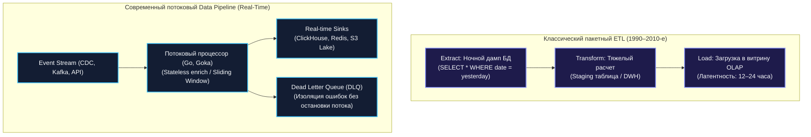
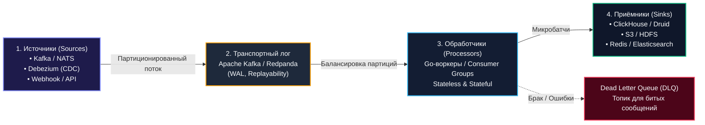
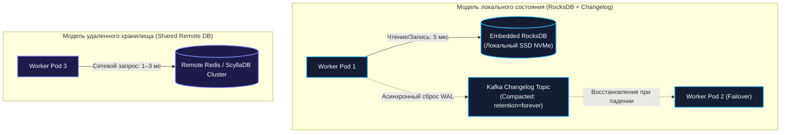

## Data Pipeline и потоковая обработка

> *"The essence of computing is the transformation of data from one representation to another — and doing so with the least friction, the highest reliability, and the clearest purpose."*  
> — Брайан Керниган

В современной распределённой архитектуре данные никогда не пребывают в статическом покое. Они непрерывно зарождаются в виде кликов в мобильных приложениях, транзакций по банковским картам, геолокационных меток курьеров и сигналов с миллионов датчиков интернета вещей. Хранить эти данные мёртвым грузом в реляционных базах бессмысленно: их ценность стремительно падает с каждой секундой. Бизнесу требуется мгновенная реакция — антифрод-скоринг за 50 миллисекунд, динамическое ценообразование, персонализированные рекомендации и мониторинг сбоев в реальном времени.

Чтобы необработанная цифровая «сырая нефть» превратилась в ценный продукт (аналитику, витрины данных, алерты и обучающие выборки нейросетей), необходим **Data Pipeline (конвейер данных)**. Это фундамент потоковой архитектуры, объединяющий сбор, гарантированную транспортировку, очистку, обогащение и доставку информации от тысяч разнородных источников к конечным потребителям.

В этой лекции мы разберём анатомию современных конвейеров данных, проведём грань между классическим пакетным ETL и потоковым процессингом ([[42. Batch vs Stream processing]]), исследуем реализацию конвейеров на Go с использованием брокера Kafka ([[22. Pub Sub, Queue, Stream модели]]) и разберём паттерны надежности: управление локальным состоянием, обработку бракованных сообщений через Dead Letter Queue (DLQ) и семантику Exactly-Once.

---

### Pipeline против ETL: эволюция парадигмы

В инженерной среде термины «ETL» и «Data Pipeline» нередко используют как синонимы, однако между ними существует фундаментальный водораздел:



1. **Классический ETL (Extract, Transform, Load):**  
   Исторически возник в эпоху централизованных хранилищ данных (DWH). Это дискретный пакетный процесс, запускаемый раз в сутки (ночью по Cron). Он выгружает гигабайты данных из операционных СУБД, трансформирует их на тяжелых серверах и загружает в аналитические таблицы. Латентность данных исчисляется сутками.
2. **Современный Data Pipeline:**  
   Это сквозная непрерывная магистраль. Данные перемещаются мелкими порциями или единичными событиями (Event-Driven) с задержкой от десятков миллисекунд до пары секунд. Пайплайн может объединять как real-time стриминг, так и микробатчинг, поставляя данные одновременно в оперативные кэши, поисковые индексы, системы оповещения и долговременные озера данных (Data Lakes).

---

### Основные компоненты Data Pipeline

Любой промышленный конвейер данных, независимо от используемых технологий, состоит из четырех ключевых архитектурных слоев:



#### 1. Источники (Sources)
Данные вливаются в конвейер из трех основных каналов:
- **Change Data Capture (CDC):** Специализированные коннекторы (Debezium, Kafka Connect), непрерывно читающие Write-Ahead Log (WAL) основных реляционных баз (PostgreSQL replication stream, MySQL binlog) и транслирующие каждое изменение строк в события `Insert`, `Update`, `Delete`.
- **Брокеры и шины сообщений:** Потоки событий от микросервисов (`OrderCreated`, `PaymentAuthorized`) через Kafka, NATS JetStream или RabbitMQ.
- **Внешние API и Webhooks:** Прием телеметрии, HTTP-колбэков от платежных систем или регулярный опрос (polling) партнерских API.

#### 2. Транспортный слой (Transport Log)
Основой высоконагруженного конвейера служит распределённый персистентный лог фиксации (Commit Log), стандартом которого является **Apache Kafka**.  
Главные свойства транспортного слоя:
- **Персистентность на диске:** Сообщения не удаляются после прочтения, а сохраняются в течение заданного retention-периода (дни, недели).
- **Возможность перечитки (Replayability):** При обновлении алгоритма или устранении бага потребители могут сбросить смещение (offset) назад и повторно переработать всю историю событий.
- **Горизонтальное масштабирование:** Топики делятся на партиции, что обеспечивает строгий порядок сообщений внутри одного ключа и параллельное чтение пулом воркеров.

#### 3. Обработчики (Processors)
Вычислительное ядро конвейера, где данные очищаются, приводятся к канонической схеме, валидируются и агрегируются. В архитектуре Go обработчики реализуются как микросервисы в составе единой **Consumer Group**.

#### 4. Приёмники (Sinks)
Конечные пункты назначения обработанных данных:
- **Колоночные аналитические СУБД:** ClickHouse, Apache Druid — для молниеносных аналитических выборок по миллиардам записей.
- **Хранилища объектов (Data Lakes):** Amazon S3, MinIO, HDFS — для холодного долговременного хранения в форматах Parquet/ORC.
- **Оперативные кэши:** Redis — для моментальной отдачи свежих счетчиков пользовательским интерфейсам.
- **Поисковые индексы:** Elasticsearch, OpenSearch — для полнотекстового поиска и логов.

---

### Типы обработки данных в потоке

В зависимости от сохранения контекста между сообщениями обработка делится на два фундаментальных класса:

| Тип обработки | Характеристика | Примеры операций | Сложность в Go |
|---|---|---|---|
| **Stateless (Без состояния)** | Каждое событие обрабатывается строго изолированно; результат зависит только от текущего сообщения. | **Filter:** отсев событий ботов.<br>**Map/Transform:** конвертация валюты, смена формата JSON $\to$ Protobuf.<br>**Enrichment:** поход в локальный кэш Redis за именем пользователя (`OrderCreated` $\to$ `OrderEnriched`). | Минимальная: идеальный параллелизм горутин без синхронизации. |
| **Stateful (С состоянием)** | Результат обработки зависит от накопленной истории предыдущих событий. | **Aggregation:** подсчет выручки за скользящее 10-минутное окно.<br>**Join:** соединение клика по рекламе с фактом покупки.<br>**CEP (Complex Event Processing):** фиксация трех неудачных попыток ввода PIN-кода за 60 секунд. | Высокая: требует персистентного локального состояния (RocksDB) и репликации ченджлога. |

---

### Потоковая обработка в Go

Язык Go не содержит встроенного тяжелого стримингового фреймворка (подобного Apache Flink или Spark Streaming), однако его конкурентная модель (горутины, каналы и планировщик рантайма) идеально приспособлена для построения высокопроизводительных микропайплайнов.

#### 1. Легковесный конвейер на каналах (In-Memory Channels)

Для локальной обработки внутри одного процесса конвейер организуется в виде цепочки стадий, связанных буферизированными каналами:

```go
package pipeline

import (
	"context"
	"log/slog"
)

type RawEvent struct {
	ID      string
	Payload []byte
}

type EnrichedEvent struct {
	ID       string
	Enriched bool
	Data     string
}

// RunPipeline связывает чтение, трансформацию и передачу в канал-приемник
func RunPipeline(ctx context.Context, logger *slog.Logger, input <-chan RawEvent, output chan<- EnrichedEvent) {
	for {
		select {
		case <-ctx.Done():
			logger.Info("pipeline worker context canceled, shutting down")
			return

		case raw, ok := <-input:
			if !ok {
				logger.Info("input stream closed, terminating pipeline")
				return
			}

			enriched, err := enrich(ctx, raw)
			if err != nil {
				logger.Error("enrichment failed", "event_id", raw.ID, "error", err)
				continue
			}

			select {
			case output <- enriched:
			case <-ctx.Done():
				return
			}
		}
	}
}

func enrich(ctx context.Context, raw RawEvent) (EnrichedEvent, error) {
	// Бизнес-логика валидации и трансформации
	return EnrichedEvent{
		ID:       raw.ID,
		Enriched: true,
		Data:     string(raw.Payload),
	}, nil
}
```

*Достоинства:* Невероятная скорость (передача указателя через канал занимает единицы наносекунд) и отсутствие внешних зависимостей.  
*Недостатки:* Отсутствие персистентности (при падении процесса события в каналах теряются) и невозможность масштабирования за пределы одного сервера.

#### 2. Распределённый Stateful-процессинг с Goka

Для распределенной stateful-обработки в экосистеме Go разработана библиотека **`goka`** (`github.com/lovoo/goka`). Это реализация концепции Kafka Streams API для языка Go. Goka берет на себя управление локальным состоянием во встроенной RocksDB, координирует партиции и автоматически синхронизирует состояние через внутренние changelog-топики Kafka:

```go
package main

import (
	"context"
	"encoding/json"
	"log"

	"github.com/lovoo/goka"
	"github.com/lovoo/goka/codec"
)

type Order struct {
	UserID   string `json:"user_id"`
	Quantity int    `json:"quantity"`
}

type OrderCodec struct{}

func (c *OrderCodec) Encode(value interface{}) ([]byte, error) {
	return json.Marshal(value)
}

func (c *OrderCodec) Decode(data []byte) (interface{}, error) {
	var m Order
	return &m, json.Unmarshal(data, &m)
}

func main() {
	// Описание топологии процессора Goka:
	// Считываем топик "orders", обновляем локальный счетчик покупок пользователя,
	// сохраняем в RocksDB и реплицируем результат в выходной топик "order-counts".
	group := goka.DefineGroup("order-aggregator",
		goka.Input(goka.Stream("orders"), new(OrderCodec), func(ctx goka.Context, msg interface{}) {
			order := msg.(*Order)
			
			// Извлечение текущего состояния агрегата по ключу (UserID)
			count := ctx.Value()
			var currentCount int
			if count != nil {
				currentCount = count.(int)
			}
			
			// Новое агрегированное значение
			newCount := currentCount + order.Quantity
			
			// Атомарное обновление локального состояния (RocksDB + Kafka Changelog)
			ctx.SetValue(newCount)
			
			// Эмиссия обновленного состояния в выходной поток
			ctx.Emit(goka.Stream("order-counts"), ctx.Key(), newCount)
		}),
		goka.Persist(new(codec.Int64)),
		goka.Output(goka.Stream("order-counts"), new(codec.Int64)),
	)

	// Запуск процессора
	processor, err := goka.NewProcessor([]string{"kafka:9092"}, group)
	if err != nil {
		log.Fatalf("error creating processor: %v", err)
	}
	if err := processor.Run(context.Background()); err != nil {
		log.Fatalf("error running processor: %v", err)
	}
}
```

Для задач маршрутизации, маппинга и бессерверной потоковой сборки без написания кода на Go все чаще применяется **Benthos** (недавно переименованный в **Redpanda Connect**) — сверхпроизводительный декларативный стриминговый шлюз, написанный целиком на Go.

---

### Управление состоянием (State Management)

В распределённой среде сбои серверов — штатная ситуация. Если воркер накапливал сумму покупок за последние 30 минут исключительно в оперативной памяти (Go `map` под мьютексом), любой рестарт пода уничтожит эти вычисления.

В архитектуре Data Pipeline применяются две стратегии хранения состояния:



1. **Embedded Storage + Kafka Changelog (Модель Flink / Goka / Kafka Streams):**  
   Каждый инстанс сервиса держит встроенную в процесс базу данных (RocksDB, Pebble) на быстром локальном NVMe SSD. Обработка летит со скоростью памяти ($<10$ микросекунд на чтение/запись). Все изменения состояния параллельно сбрасываются в служебный топик Kafka с включенной компакцией (Log Compaction).  
   Если инстанс падает, другой узел получает партицию и быстро прогревает локальную RocksDB, перечитывая компактный ченджлог из Kafka.
2. **Внешнее хранилище (External Redis / Cassandra):**  
   Состояние хранится во внешнем распределенном кластере.  
   *Плюс:* Воркеры остаются полностью Stateless, Kubernetes-поды можно безболезненно перезапускать каждую минуту.  
   *Минус:* Каждый шаг обработки упирается в сетевой Round-Trip Time (RTT) до Redis ($0.5–2$ мс), что в сотни раз снижает пиковую пропускную способность конвейера.

> [!warning] Ловушка / Gotcha: Иллюзия надежности памяти процесса
> Хранение накопленных агрегатов в обычной Go-мапе `sync.Map` без репликации — гарантия потери данных. Перебалансировка (Rebalance) консьюмер-группы в Kafka происходит регулярно (при деплое новой версии, падении пода или сетевом лаге). При ребалансировке партиция отбирается у одного пода и передается другому. Без внешнего хранилища или ченджлога весь накопленный контекст испаряется.

---

### Обработка ошибок и Dead Letter Queue (DLQ)

В пакетной обработке ошибка в одной строке обычно приводит к падению всей задачи (Job Failure). В потоковом конвейере с миллионами сообщений в секунду **пайплайн не имеет права останавливаться** из-за единственного некорректного сообщения («отравленной таблетки» — Poison Pill).

Для изоляции таких сбоев применяется паттерн **Dead Letter Queue (DLQ)**:

```mermaid
flowchart TD
    In["Входящее сообщение из Kafka"] --> Process{"Обработка в Go"}
    
    Process -->|Успех| Commit["Commit Offset в Kafka"]
    
    Process -->|Временный сбой<br>(Network Timeout, 503)| Retry{"Retry Loop<br>(Exponential Backoff)"}
    Retry -->|Попытки < Max| Process
    Retry -->|Лимит исчерпан| DLQ["Publish в Dead Letter Queue<br>(dlq-orders-topic)"]
    
    Process -->|Фатальный сбой<br>(Corrupted JSON, Schema Invalid)| DLQ
    
    DLQ --> Alert["Алерт дежурному инженеру"]
    DLQ --> Commit

    classDef ok fill:#0f172a,stroke:#10b981,stroke-width:2px,color:#f8fafc;
    classDef retry fill:#1e293b,stroke:#f59e0b,stroke-width:2px,color:#f8fafc;
    classDef err fill:#4c0519,stroke:#f43f5e,stroke-width:2px,color:#f8fafc;
    class In,Process,Commit ok;
    class Retry retry;
    class DLQ,Alert err;
```

Если ошибка носит временный характер (сетевой таймаут к БД), воркер выполняет повтор с экспоненциальной задержкой (Exponential Backoff). Если ошибка неустранима (битый JSON, нарушение схемы) или исчерпан лимит повторов, сообщение вместе с метаданными ошибки и стектрейсом отправляется в отдельный топик DLQ (`orders-dlq`). После этого воркер коммитит оффсет и продолжает обработку основного потока!

Реализация устойчивого процессора в Go:

```go
package worker

import (
	"context"
	"errors"
	"fmt"
	"math"
	"time"

	"github.com/segmentio/kafka-go"
)

type DLQProducer interface {
	Publish(ctx context.Context, msg kafka.Message) error
}

const maxRetries = 3

func ProcessWithRetry(ctx context.Context, dlqProducer DLQProducer, msg kafka.Message) error {
	for i := 0; i < maxRetries; i++ {
		err := processBusinessLogic(ctx, msg)
		if err == nil {
			return nil // Успешная обработка
		}

		if !isRetryable(err) {
			// Невосстановимая ошибка: немедленная изоляция в DLQ
			return dlqProducer.Publish(ctx, msg)
		}

		// Экспоненциальный откат перед следующей попыткой
		sleepDuration := time.Duration(math.Pow(2, float64(i))) * 100 * time.Millisecond
		select {
		case <-time.After(sleepDuration):
		case <-ctx.Done():
			return ctx.Err()
		}
	}

	// Попытки исчерпаны: отправляем в карантин DLQ
	return dlqProducer.Publish(ctx, msg)
}

func isRetryable(err error) bool {
	// Проверка на временные сетевые ошибки или таймауты
	return !errors.Is(err, ErrInvalidSchema)
}

var ErrInvalidSchema = errors.New("invalid message schema")

func processBusinessLogic(ctx context.Context, msg kafka.Message) error {
	// Бизнес-логика...
	return nil
}
```

---

### Exactly-once семантика в пайплайнах

Гарантия **Exactly-Once Semantics (EOS)** в потоковой обработке означает, что каждое входящее сообщение отразится на конечном состоянии системы ровно один раз, даже при падении воркеров или брокеров в момент записи ([[27. Idempotency и exactly once семантика]]).

В связке Go + Kafka сквозной Exactly-Once достигается за счет **транзакционного API Kafka**:
1. **Идемпотентный продюсер (Idempotent Producer):** Брокер присваивает каждому продюсеру уникальный `Producer ID` (PID) и отслеживает порядковые номера сообщений (`Sequence Number`), отсекая дубликаты при повторной сетевой отправке.
2. **Изоляция чтения:** Потребители downstream-сервисов настраиваются с уровнем изоляции `read_committed`, полностью игнорируя сообщения незавершённых или отменённых (aborted) транзакций.
3. **Транзакционный коммит смещений:** Запись трансформированных событий в выходной топик и коммит прочитанного оффсета во входящем топике объединяются в **единую двухфазную транзакцию Kafka** (`SendOffsetsToTxn`). Либо обе операции фиксируются атомарно, либо ни одна.

Библиотеки `goka` и официальные клиенты на базе `confluent-kafka-go` (librdkafka) предоставляют полную поддержку транзакционного API Kafka.

---

### Mechanical Sympathy: влияние на рантайм Go

Потоковые конвейеры данных перерабатывают сотни тысяч сообщений в секунду на одно ядро процессора. Архитектурные решения в Go-коде напрямую влияют на наносекунды задержки и нагрузку на ядро Linux:

#### 1. Горутины и конкурентное разделение партиций
- В Kafka элементарной единицей параллелизма является **партиция**. Не имеет смысла запускать 100 горутин на чтение топика из 8 партиций: 92 горутины будут простаивать, так как брокер закрепляет одну партицию строго за одним потребителем внутри Consumer Group.
- Идеальный паттерн: ровно одна горутина-reader на каждую выделенную партицию, которая может передавать тяжелую CPU-обработку в локальный воркер-пул горутин через буферизированный канал (при условии сохранения порядка сообщений по ключу).

#### 2. Борьба с аллокациями памяти (GC Pressure)
- Десериализация сотен тысяч сообщений из формата JSON (`json.Unmarshal`) порождает миллионы короткоживущих объектов в куче Go, вызывая деградацию латентности из-за постоянных пауз сборщика мусора GC.
- **Оптимизация:** Переход на бинарные форматы **Protobuf** или **Avro**, использование кодогенераторов с нулевыми аллокациями (`easyjson`, `fastjson`) и переиспользование структур сообщений через пул оперативной памяти **`sync.Pool`**.

#### 3. Сетевой стек ядра Linux и Zero-Copy
- При передаче сообщений из сокета в сокет или на диск высокопроизводительные продюсеры и брокеры используют системные вызовы ядра **`sendfile(2)`** и **`writev(2)`** (Vectored I/O). Это позволяет данным перемещаться между страницами page cache ядра Linux и сетевой картой без копирования байтов в адресное пространство пользовательского процесса.
- В Go сетевой поллер (`netpoller`) на базе `epoll(7)` берет на себя мультиплексирование неблокирующих сокетов тысяч консьюмеров, снимая нагрузку с контекстных переключений потоков ОС.

---

### Связь с другими архитектурными концепциями

- **Event-Driven Architecture** ([[21. Event Driven Architecture]]): Data Pipeline служит физической транспортно-вычислительной основой для реализации EDA.
- **CQRS** ([[23. CQRS. Разделение чтения и записи]]): Конвейер данных принимает события из пишущей модели (Write Model) и асинхронно обновляет денормализованные витрины чтения (Read Model) в ClickHouse или Elasticsearch.
- **Event Sourcing** ([[24. Event Sourcing. Хранение событий вместо состояния]]): Data Pipeline читает журнал неперегружаемых доменных событий и непрерывно строит актуальные материализованные проекции.
- **Backpressure** ([[43. Backpressure и контроль нагрузки]]): Если приемник Sink начинает тормозить (например, ClickHouse перегружен вставками), consumer замедляет частоту вызовов `poll()`. Непрочитанные сообщения накапливаются на дисках Kafka, предотвращая исчерпание памяти воркеров.

---

### Антипаттерны и архитектурные ошибки

1. **Единый монолитный «швейцарский нож»:**  
   Попытка объединить парсинг CDC, валидацию, обогащение из базы, тяжелые джойны и запись в 5 разных хранилищ внутри одного гигантского сервиса. Любой сбой или замедление одного шага парализует весь пайплайн. Разделяйте пайплайн на независимые этапы через промежуточные топики Kafka.
2. **Игнорирование Dead Letter Queue:**  
   Попытка «проглатывать» ошибки парсинга или бесконечно повторять их в цикле без ограничения. В первом случае бизнес теряет критические транзакции, во втором — конвейер намертво заклинивает на одном битом сообщении (Head-of-Line Blocking).
3. **Хранение состояния исключительно в оперативной памяти:**  
   Использование встроенных структур без репликации ченджлога приводит к потере исторических агрегатов при каждой перебалансировке или перезапуске ноды в Kubernetes.
4. **Построение пайплайнов на базе реляционных очередей (`SELECT FOR UPDATE`):**  
   Использование PostgreSQL в качестве брокера потоковых данных с нагрузкой в десятки тысяч сообщений в секунду приводит к раздуванию таблиц (Table Bloat), постоянной блокировке страниц и деградации производительности всей базы данных.

---

> [!tip] Собеседование
> **Вопрос:** В вашу систему поступает поток транзакций от интернет-магазинов со скоростью 50 000 сообщений в секунду. Бизнесу требуется непрерывный расчет скользящей суммы выручки за последние 5 минут по каждой категории товаров в реальном времени. Как вы спроектируете этот конвейер данных на Go?
> 
> **Ответ:**  
> Архитектура строится на следующих компонентах:
> 1. **Транспорт:** Топик Kafka `orders` с партиционированием по ключу `category_id` (не менее 32–64 партиций). Это гарантирует, что все заказы одной категории всегда попадают в одну и ту же партицию.
> 2. **Stateful-процессор на Go:**
>    - Разворачивается микросервис на Go в составе Consumer Group с использованием библиотеки **`goka`**. Число реплик процессора масштабируется под количество партиций.
>    - Воркер читает свою партицию и накапливает 5-минутное скользящее окно во встроенной локальной **RocksDB** (хранилище ключ-значение на NVMe-диске).
>    - Состояние защищается от падений узлов через автоматический ченджлог в Kafka (`order-category-state`).
> 3. **Приемники (Sinks):**
>    - Каждые 5 секунд воркер эмиттит текущий срез выручки в выходной топик Kafka `category-revenue-5min`.
>    - Микросервис-sink читает этот топик и сбрасывает данные в **Redis** (для моментальной отдачи дашбордам аналитиков) и пачками по 10 000 записей в **ClickHouse** (для долговременного хранения истории).
> 4. **Отказоустойчивость:** Невалидные сообщения изолируются в топик `orders-dlq`, а при падении любого контейнера соседний воркер подхватывает партицию и за 2–3 секунды восстанавливает состояние из ченджлога.

---

### Итог

Data Pipeline — это живая кровеносная система распределённой архитектуры, непрерывно перекачивающая цифровые потоки от источников к потребителям. Язык Go, сочетающий простоту многопоточности, минимальный оверхед на системные вызовы и превосходную производительность работы с сетевыми сокетами, идеально подходит для создания сверхбыстрых конвейеров любого масштаба.

Однако высокая пропускная способность требует инженерной дисциплины: строгой изоляции ошибок через DLQ, сохранения состояния в компактных ченджлогах и бережного отношения к аллокациям памяти.

В следующей лекции мы детально сравним две доминирующие парадигмы вычислений: [[42. Batch vs Stream processing]].
