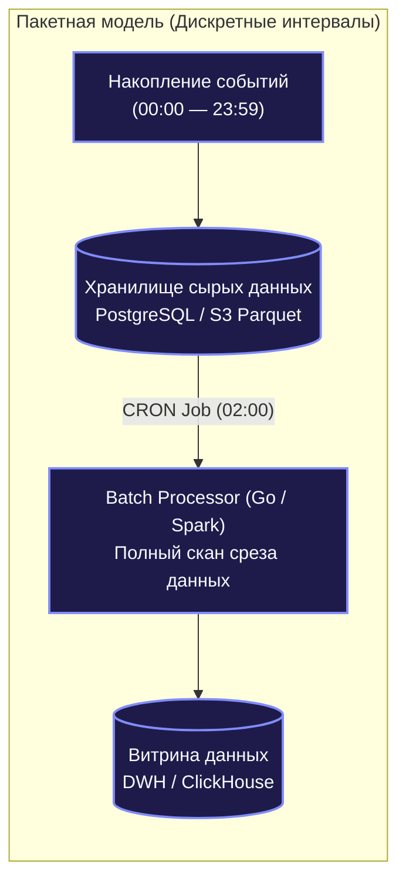
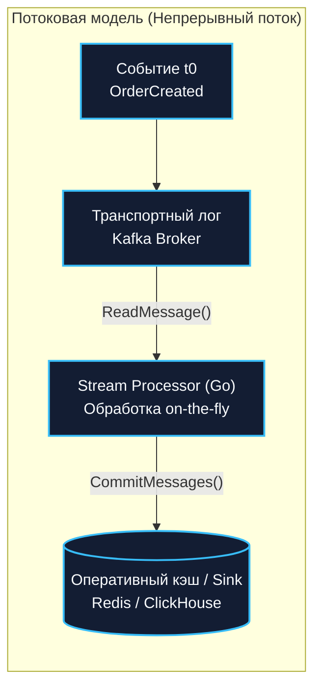
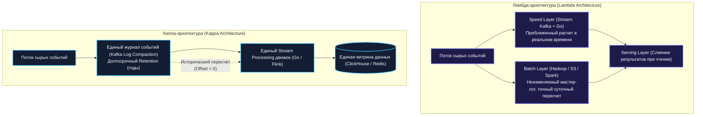

## Пакетная vs потоковая обработка данных: Batch vs Stream

> *«Пакетная обработка подобна товарному поезду: она перевозит колоссальный груз с поразительной эффективностью, но приходится ждать, пока вагоны заполнятся и наступит время отправления по расписанию. Потоковая же обработка — это акведук: вода течет непрерывно, капля за каплей, наполняя вашу чашу в то самое мгновение, когда забил родник».*    
> — Брайан Керниган

В компьютерных системах данные обрабатываются двумя фундаментально различными путями: **пакетно (batch)** и **потоково (stream)**. Выбор между ними — это не просто выбор конкретной библиотеки в коде, а стратегический архитектурный компромисс. Он предопределяет допустимую задержку (latency), пиковую пропускную способность (throughput), стоимость серверного железа, требования к отказоустойчивости и даже когнитивную нагрузку на команду инженеров.

В предыдущей лекции мы спроектировали кровеносную систему конвейера данных ([[41. Data Pipeline и потоковая обработка]]). Теперь настало время заглянуть внутрь вычислительного мотора: когда оправдана неспешная обработка гигантских массивов по расписанию, когда необходима реакция за миллисекунды на каждый входящий байт, и как эти две концепции гармонично соединяются в архитектурах Lambda и Kappa.

---

### Что такое Batch Processing

**Пакетная обработка (Batch Processing)** оперирует конечными, заранее накопленными порциями данных фиксированного объема (батчами, пакетами). Пайплайн запускается периодически — по расписанию через CRON, системный планировщик или по событию накопления определенного объема (например, каждые 100 МБ или раз в сутки в 02:00 ночи).

В процессе работы батч-процессор монопольно вычитывает статичный срез данных из дискового хранилища (базы данных, объектного хранилища S3 или распределенной файловой системы), выполняет ресурсоемкие вычисления (сортировки, группировки, построение отчетов) и сохраняет агрегаты в аналитические витрины.



В языке Go простейший batch-процессинг реализуется в виде фоновых утилит или демонов, работающих с реляционными базами данных:

```go
package batch

import (
	"context"
	"database/sql"
	"fmt"
	"time"
)

// RunDailyAggregation выполняет суточный расчет заказов пользователей
func RunDailyAggregation(ctx context.Context, db *sql.DB) error {
	start := time.Now().Add(-24 * time.Hour)

	// Читаем изолированный статический пакет данных за прошедшие сутки
	rows, err := db.QueryContext(ctx,
		"SELECT user_id, COUNT(*) FROM orders WHERE created_at >= $1 GROUP BY user_id", start)
	if err != nil {
		return fmt.Errorf("failed to query batch: %w", err)
	}
	defer rows.Close()

	for rows.Next() {
		var userID string
		var count int
		if err := rows.Scan(&userID, &count); err != nil {
			return fmt.Errorf("failed to scan row: %w", err)
		}

		// Сохраняем агрегированные показатели в аналитическую БД
		if err := saveDailyUserStat(ctx, db, userID, count); err != nil {
			return fmt.Errorf("failed to persist aggregate for user %s: %w", userID, err)
		}
	}

	return rows.Err()
}

func saveDailyUserStat(ctx context.Context, db *sql.DB, userID string, count int) error {
	// Сохранение агрегата
	return nil
}
```

---

### Что такое Stream Processing

**Потоковая обработка (Stream Processing)** имеет дело с принципиально бесконечным, непрерывным потоком событий (Unbounded Data Stream). Данные обрабатываются поштучно по мере их физического возникновения в реальном мире либо микропорциями с субсекундной задержкой.

Потоковый процессор никогда не засыпает: он непрерывно слушает сокет брокера сообщений, немедленно реагирует на каждое событие и выдает обновленные результаты в течение десятков или сотен миллисекунд.



В Go потоковый обработчик традиционно оформляется как бесконечный цикл чтения из топика брокера сообщений (например, `github.com/segmentio/kafka-go`):

```go
package stream

import (
	"context"
	"log/slog"

	"github.com/segmentio/kafka-go"
)

// RunStreamProcessor непрерывно вычитывает и обрабатывает события в реальном времени
func RunStreamProcessor(ctx context.Context, logger *slog.Logger, consumer *kafka.Reader, handler func(msg kafka.Message) error) {
	for {
		// Блокирующее чтение очередного поступившего сообщения
		msg, err := consumer.ReadMessage(ctx)
		if err != nil {
			if ctx.Err() != nil {
				logger.Info("stream processor context cancelled, shutting down")
				return
			}
			logger.Error("failed to read stream message", "error", err)
			break
		}

		// Немедленная обработка на лету
		if err := handler(msg); err != nil {
			logger.Error("processing failed", "error", err, "offset", msg.Offset)
			// Логика изоляции ошибки или отправка в DLQ
		}

		// Фиксация прочитанного смещения
		if err := consumer.CommitMessages(ctx, msg); err != nil {
			logger.Error("failed to commit offset", "error", err)
		}
	}
}
```

---

### Ключевые отличия: фундаментальное сравнение

Выбор между Batch и Stream опирается на кардинально разные физические характеристики обработки:

| Критерий | Batch (Пакетная обработка) | Stream (Потоковая обработка) |
|---|---|---|
| **Задержка (Latency)** | Высокая: минуты, часы, сутки (зависит от периодичности расписания). | Ультранизкая: миллисекунды, секунды (near real-time). |
| **Окно данных (Data Scope)** | Фиксированное и замкнутое: весь накопленный массив данных доступен целиком в один момент времени. | Скользящее и бесконечное: обработка текущего события или скользящего окна ($T - 5$ минут). |
| **Пропускная способность** | Максимальная: оптимизирована под массовые последовательные I/O операции и векторные вычисления. | Ограничена накладными расходами на обработку отдельных сетевых сообщений on-the-fly. |
| **Управление состоянием** | Обычно stateless для самого процесса: всё состояние находится в базе данных в виде таблиц. | Часто stateful: требует хранения оконных агрегатов и сессий во встроенных БД (RocksDB). |
| **Сложность отказоустойчивости** | Низкая: при сбое джоба перезапускается с начала или с последней точки фиксации (чекпоинта). | Высокая: требует строгого контроля порядка сообщений, дедупликации и семантики Exactly-Once. |
| **Примеры реализации в Go** | Фоновые CRON-воркеры, консольные CLI-утилиты, ETL конвейеры. | Долгоживущие Kafka-консьюмеры, каналы, микросервисы на `goka`. |

---

### Batch в Go: паттерны и инструменты

При реализации пакетной обработки большого массива данных на Go ключевой задачей становится эффективная утилизация всех ядер процессора без исчерпания памяти и блокировки сетевых соединений.

#### Паттерн Worker Pool с диспетчеризацией батча

Когда из базы или внешнего хранилища извлечен массив записей (батч), его обработка распределяется между фиксированным количеством конкурирующих горутин:

```go
package batch

import (
	"context"
	"log/slog"
	"sync"
)

type Item struct {
	ID    string
	Data  []byte
	Value float64
}

// ProcessBatch параллельно обрабатывает элементы среза фиксированным пулом горутин
func ProcessBatch(ctx context.Context, logger *slog.Logger, items []Item, workers int, handler func(Item) error) error {
	var wg sync.WaitGroup
	itemsCh := make(chan Item, len(items))

	// Заполняем очередь батча элементами
	for _, item := range items {
		itemsCh <- item
	}
	close(itemsCh)

	// Запускаем фиксированный пул горутин-обработчиков
	for i := 0; i < workers; i++ {
		wg.Add(1)
		go func() {
			defer wg.Done()
			for item := range itemsCh {
				select {
				case <-ctx.Done():
					return
				default:
				}

				if err := handler(item); err != nil {
					logger.Error("batch item failed", "item_id", item.ID, "error", err)
				}
			}
		}()
	}

	wg.Wait()
	return ctx.Err()
}
```

#### Использование внешних распределенных систем

Хотя Go великолепен для написания микросервисов, легковесных cron-задач и высокопроизводительных утилит, выкачивающих гигабайты из S3/GCS и загружающих их пачками в ClickHouse, для петабайтных распределенных batch-вычислений (map-reduce по петабайтам логов) индустриальным стандартом остаются специализированные движки: Apache Spark, Apache Flink или облачные сервисы вроде AWS Batch и GCP Dataflow. Go часто выступает в роли координатора или поставщика данных для этих гигантов.

---

### Stream в Go: горутины, каналы и библиотеки

Потоковая обработка внутри процесса Go опирается на три фундаментальных примитива языка:
1. **Горутины (Goroutines):** Легковесные потоки рантайма, непрерывно исполняющие логику трансформации.
2. **Каналы (Channels):** Потокобезопасные неблокирующие очереди передачи сообщений между стадиями конвейера с естественной поддержкой противодавления.
3. **Контексты (`context.Context`):** Дисциплина управления жизненным циклом, таймаутами и остановкой конвейера при выключении приложения (Graceful Shutdown).

```go
package stream

import (
	"context"
)

type Order struct {
	ID     string
	Amount float64
}

type EnrichedOrder struct {
	Order
	Discounted float64
}

// StreamPipeline организует потоковую передачу данных через каналы Go
func StreamPipeline(ctx context.Context, input <-chan Order, output chan<- EnrichedOrder) {
	for {
		select {
		case <-ctx.Done():
			return
		case order, ok := <-input:
			if !ok {
				return
			}

			enriched, err := enrich(order)
			if err != nil {
				continue
			}

			select {
			case output <- enriched:
			case <-ctx.Done():
				return
			}
		}
	}
}

func enrich(o Order) (EnrichedOrder, error) {
	return EnrichedOrder{
		Order:      o,
		Discounted: o.Amount * 0.9,
	}, nil
}
```

Для промышленной распределенной потоковой обработки в Go стандартом являются клиенты Kafka (`segmentio/kafka-go`, официальный `confluent-kafka-go` на базе `librdkafka`) и библиотека **`goka`**, предоставляющая stateful-абстракции поверх Kafka и RocksDB.

---

### Mechanical Sympathy: влияние на рантайм Go

Понимание того, как вычислительная модель нагружает процессор и подсистему памяти рантайма Go, позволяет избегать коварных скрытых ловушек:

```mermaid
flowchart TD
    subgraph BatchSympathy["Профиль Batch-нагрузки (Пилообразный)"]
        B_Load["Запуск по Cron"] --> B_Alloc["Массивное выделение памяти в куче<br>(Миллионы строк $\to$ OOM риск)"]
        B_Alloc --> B_CPU["100% утилизация всех ядер CPU"]
        B_CPU --> B_GC["Тяжелые волны сборки мусора (GC Spike)"]
        B_GC --> B_Idle["Окончание джоба: Полный покой (0% CPU)"]
    end

    subgraph StreamSympathy["Профиль Stream-нагрузки (Ровный и плоский)"]
        S_Run["Постоянная работа 24/7"] --> S_Heap["Опасность скрытых микроаллокаций<br>(json.Unmarshal в цикле)"]
        S_Heap --> S_Pool["sync.Pool для буферов и структур"]
        S_Pool --> S_Stable["Стабильное потребление памяти<br>и предсказуемый GC"]
    end

    classDef bp fill:#1e1b4b,stroke:#818cf8,stroke-width:2px,color:#f8fafc;
    classDef sp fill:#131d33,stroke:#38bdf8,stroke-width:2px,color:#f8fafc;
    class B_Load,B_Alloc,B_CPU,B_GC,B_Idle bp;
    class S_Run,S_Heap,S_Pool,S_Stable sp;
```



#### 1. Batch: Пилообразный профиль и риск OOM
- Во время исполнения batch-процессор стремительно загружает память гигантскими срезами структур (`[]Item`). Если объем выборки из базы случайно вырастет в 5 раз, процесс мгновенно упадет по Out-of-Memory (OOM-Killed ядром Linux).
- **Совет:** Пакетные задачи обязаны обрабатывать данные строго фиксированными страницами (Chunking / Paging) с помощью курсоров базы данных (`WHERE id > last_id LIMIT 10000`), а не вычитывать всю таблицу одним вызовом `db.Query()`.
- Между запусками джоба нагрузка падает до нуля, что позволяет операционной системе высвобождать страницы памяти.

#### 2. Stream: Долгоживущие структуры и аллокации в горячем цикле
- В потоковом режиме горутины живут днями и неделями. Любая микроаллокация внутри тела цикла (например, парсинг JSON-строки или создание контекста) при 100 000 RPS превращается в непрерывный поток сотен мегабайт мусора в секунду.
- Это вызывает постоянные микропаузы сборщика мусора GC и деградацию хвостовой задержки ($p99$).
- **Решение:** Повторное использование структур через **`sync.Pool`**, отказ от отражения (`reflect`) и переход на бинарные форматы (Protobuf, FlatBuffers).

> [!info] Под капотом: Дисциплина горутин в потоковом цикле
> Главный антипаттерн потоковой обработки в Go — запуск неконтролируемой горутины `go handleMessage(msg)` на каждое входящее сообщение. При резком наплыве трафика (Spike) миллион созданных горутин моментально исчерпает стек рантайма (по 2 КБ на горутину = 2 ГБ только на стеки!) и перегрузит планировщик `Go runtime scheduler`. В промышленной архитектуре всегда используется **фиксированный пул горутин (Worker Pool)** с ограниченным буферизированным каналом передачи задач.

---

### Лямбда- и Kappa-архитектуры: мосты между двумя мирами

В крупных корпоративных системах неизбежно возникает дилемма: бизнесу нужны аналитические отчеты с нулевой погрешностью (что дает Batch), но при этом операционные дашборды должны обновляться каждую секунду (что дает Stream).

Для решения этой задачи были сформулированы две архитектурные парадигмы:



#### 1. Лямбда-архитектура (Lambda Architecture)
Разработана Натаном Марцем. Система разделяется на два параллельных пути:
- **Speed Layer (Горячий путь):** Потоковый движок считает данные в реальном времени, мирясь с возможными дубликатами и погрешностями.
- **Batch Layer (Холодный путь):** Раз в сутки пакетный движок перемалывает полный неизменяемый архив данных, гарантируя абсолютную математическую точность.
- **Serving Layer:** При выполнении запроса витрина объединяет результаты из обоих слоев.  
*Главный минус Лямбды:* Необходимость писать и поддерживать **две разные кодовые базы** (например, логику на Go для стрима и логику на Spark/Scala для батча) и синхронизировать их логику при любых бизнес-изменениях.

#### 2. Каппа-архитектура (Kappa Architecture)
Сформулирована Джеем Крепсом (соавтором Kafka). Каппа предлагает полностью упразднить пакетный слой и **обрабатывать абсолютно все данные исключительно как поток**:
- Все события вечно хранятся в распределенном журнале сообщений (Kafka с включенной компакцией топиков или tiered storage).
- Обработку выполняет **один-единственный потоковый сервис** на Go или Flink.
- Если нужно пересчитать исторические данные за прошлый год с новым алгоритмом, инженеры не запускают отдельный Spark-джоб: они просто поднимают новую версию Go-потребителя со смещением `Offset = 0` и читают исторический лог на максимальной скорости дисков. После догона потока старая версия сервиса гасится.

---

### Когда что выбирать: практическая матрица

Архитектурный выбор между Batch и Stream определяется характером бизнес-требований:

#### Выбирайте Batch, если:
- Данные поступают крупными дискретными блоками (банковские реестры в конце рабочего дня, сверка выписок).
- Допустима задержка в часы или сутки без ущерба для бизнеса (расчет бонусов сотрудников, ежемесячные счета).
- Требуется глубокий анализ и полнотекстовая переиндексация всей исторической базы данных целиком.
- Вычисления требуют сложных многопроходных алгоритмов (сложные графовые оптимизации, обучение тяжелых моделей).

#### Выбирайте Stream, если:
- Задержка реакции напрямую влияет на доход или безопасность (антифрод-системы, мониторинг атак, алертинг дежурных инженеров).
- Бизнес-процесс движим событиями (Event-Driven Architecture: подтверждение заказа $\to$ отправка пуш-уведомления).
- Данные представляют собой непрерывный поток метрик, логов или телеметрии.

---

### Антипаттерны и типичные ошибки

1. **Попытка решать низколатентные задачи батчами («Микробатчинг курильщика»):**  
   Запуск CRON-скрипта каждую минуту (`* * * * *`) для проверки новых записей в таблице. Это создает постоянную паразитную нагрузку на реляционную базу и дает задержку до 60 секунд. Вместо этого используйте CDC (Debezium) и потоковую передачу событий.
2. **Игнорирование идемпотентности в Stream:**  
   Потоковые брокеры обеспечивают доставку At-Least-Once. При сетевом сбое сообщение будет доставлено повторно. Если потоковый процессор не защищен идемпотентным ключом ([[27. Idempotency и exactly once семантика]]), баланс клиента спишется дважды.
3. **Отсутствие метрик отставания (Consumer Lag):**  
   Если в потоковом процессоре не настроен мониторинг лага потребителя в Kafka, вы узнаете о том, что сервис захлебнулся и отстал на миллион сообщений, только от разъяренных пользователей.
4. **Слепая вера в «абсолютную простоту» Kappa-архитектуры:**  
   Хранение терабайтов сырых событий в Kafka требует дорогого дискового пространства и сложного управления топиками. В реальных Enterprise-системах часто приживается прагматичный гибрид: Kafka для оперативного окна в 7–30 дней, и сброс архива в дешевое объектное хранилище S3 в формате Parquet для неторопливого пакетного анализа.

---

> [!tip] Собеседование
> **Вопрос:** Вам поручено спроектировать аналитическую платформу для крупного маркетплейса. Маркетологам требуются онлайн-дашборды текущих продаж с задержкой не более 3–5 секунд, а финансовому отделу — абсолютно точные отчеты по закрытию месяца с учетом всех возвратов и корректировок. Как вы распределите зоны ответственности между Batch и Stream?
> 
> **Ответ:**  
> Я применю прагматичный гибридный подход, разделив ответственность:
> 1. **Потоковый контур (Stream Layer для маркетологов):**  
>    - События платежей и заказов через Kafka попадают в легкий Go-процессор.  
>    - Процессор выполняет скользящую оконную агрегацию и сбрасывает счетчики в **Redis** и колоночный **ClickHouse**.  
>    - Это обеспечивает моментальное отображение динамики продаж на дашбордах с задержкой в 1–2 секунды. Допускается минимальная кратковременная погрешность при ретраях.
> 2. **Пакетный контур (Batch Layer для бухгалтерии и финансов):**  
>    - Все факты финансовых транзакций являются источником правды и фиксируются в реляционной СУБД с транзакционной гарантией ACID.  
>    - В конце расчетного периода запускается пакетная задача (Go CLI или Spark джоб), которая читает подтвержденные бухгалтерские проводки, применяет сложные правила налоговых вычетов, учитывает отложенные возвраты (Refunds) и формирует не подлежащие изменению финансовые отчеты.  
> 
> Таким образом, Stream обеспечивает реактивность и оперативное управление бизнесом, а Batch гарантирует финансовую точность и аудит.

---

### Итог

Пакетная и потоковая обработка — это не враждующие лагеря, а две взаимодополняющие грани архитектурного мышления. Batch дарит максимальную вычислительную эффективность и безупречную точность на больших массивах накопленных данных. Stream обеспечивает моментальную реакцию на каждое изменение внешнего мира, стирая границу между событием и реакцией системы.

Язык Go с его непревзойденной поддержкой многопоточности, компактными горутинами и развитой экосистемой брокеров сообщений позволяет инженеру с одинаковой легкостью создавать как компактные пакетные утилиты, так и масштабируемые распределенные потоковые сервисы.

Однако в реальном мире скорость поступления данных в потоковый конвейер нередко превышает физические возможности серверов по их обработке. В следующей лекции мы детально разберем фундаментальный механизм, спасающий распределенные системы от удушья и катастрофического переполнения буферов: [[43. Backpressure и контроль нагрузки]].
