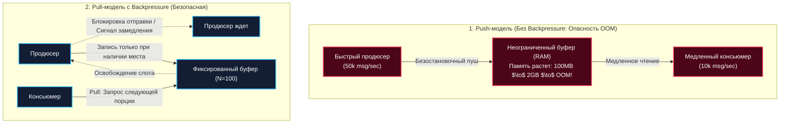
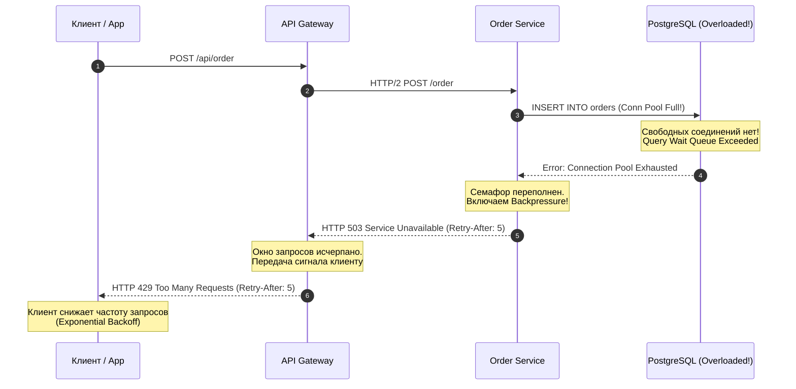
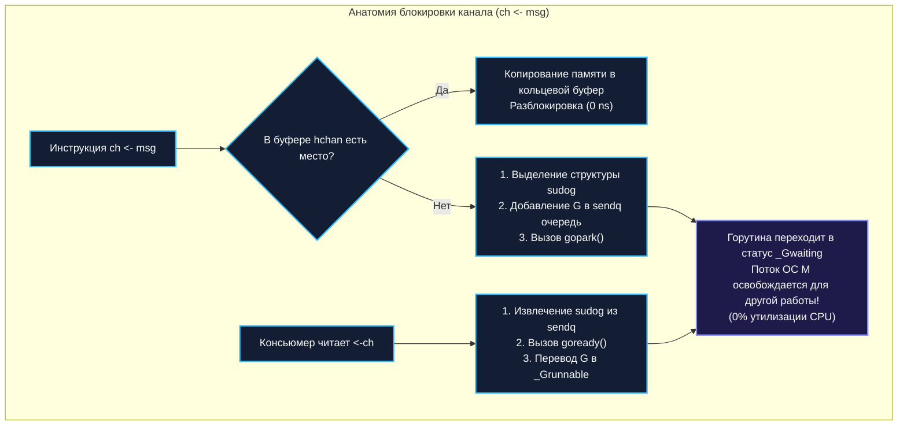

## Backpressure и контроль нагрузки

> *"If you push water into a pipe faster than the tap can discharge it, you will either blow out the joints or burst the pipe. A well-designed system doesn't hope for the best; it pushes back."*  
> — Брайан Керниган

В распределённых системах и потоковых конвейерах данных скорость производства информации почти никогда не совпадает со скоростью её потребления. Всплеск пользовательской активности, маркетинговая рассылка, ночной запуск пакетного импорта или кратковременная просадка дискового ввода-вывода в базе данных мгновенно создают дисбаланс: продюсеры генерируют 50 000 сообщений в секунду, в то время как консьюмеры способны переварить не более 10 000.

Если система наивно пытается вместить в себя весь избыточный трафик без обратной связи, наступает катастрофа: очереди в оперативной памяти разрастаются до гигабайтов, сборщик мусора GC начинает лихорадочно сканировать миллионы брошенных объектов, исчерпывается память (OOM-Kill ядра Linux), и сервис падает, увлекая за собой соседние звенья архитектуры.

Чтобы защитить систему от физического разрушения, необходим **Backpressure (противодавление / обратное давление)**. Это фундаментальный механизм обратной связи, с помощью которого перегруженный потребитель сообщает источнику: *«Я захлёбываюсь, притормози подачу данных!»*.

В этой лекции мы разберём физику обратного давления, исследуем, как Go реализует Backpressure прямо в рантайме языка с помощью каналов и планировщика `G-M-P`, изучим каскадное распространение противодавления в микросервисных сетях по HTTP/2 и gRPC, а также выстроим гармоничную связку Backpressure с паттернами Rate Limiting ([[38. Rate Limiting и защита системы]]) и Bulkhead ([[37. Bulkhead и изоляция отказов]]).

---

### Что такое Backpressure: Push против Pull

Концептуально передача данных между двумя компонентами строится по одной из двух моделей:



1. **Push-модель (Без контроля нагрузки):**  
   Продюсер отправляет данные с максимальной скоростью, на которую способен. Если консьюмер не успевает, сообщения оседают в очередях. Рано или поздно память переполняется, и система гибнет.
2. **Pull-модель (С естественным Backpressure):**  
   Потребитель сам запрашивает данные по мере освобождения своих вычислительных ресурсов. Если консьюмер занят обработкой сложной транзакции, он просто не берет новую задачу. Источник вынужден замедлиться или приостановить генерацию.

В отличие от жесткого Rate Limiting, который безжалостно отбрасывает лишние запросы со статусом `429 Too Many Requests`, **Backpressure стремится сохранить данные целиком**, динамически регулируя темп передачи по всей цепочке.

Этот механизм критически важен для распределённых систем, построенных на асинхронной коммуникации ([[21. Event Driven Architecture]]), потоковой обработке ([[41. Data Pipeline и потоковая обработка]]) и при каскадных вызовах микросервисов.


---

### Backpressure в Go: каналы и горутины

Язык Go уникален тем, что механизм Backpressure встроен в самую основу его рантайма — в **буферизированные и небуферизированные каналы (`chan`)**.

1. **Небуферизированный канал (`make(chan Message)`):**  
   Обеспечивает предельную синхронизацию (Rendezvous): горутина-продюсер намертво блокируется на инструкции `ch <- msg` до тех пор, пока горутина-консьюмер не выполнит чтение `<-ch`. Это абсолютный Backpressure: емкость буфера равна нулю, скорость продюсера жестко привязана к скорости потребителя.
2. **Буферизированный канал (`make(chan Message, 100)`):**  
   Сглаживает кратковременные всплески (Burst). Продюсер свободно отправляет сообщения, пока в кольцевом буфере есть свободные слоты. Как только буфер заполняется до отказа, следующая попытка отправки блокирует горутину-продюсера, создавая естественное механическое противодавление:

```go
package main

import (
	"fmt"
	"time"
)

type Message struct {
	ID   int
	Data string
}

func main() {
	// Фиксированный буфер: строго 100 элементов!
	ch := make(chan Message, 100)

	messages := make([]Message, 500)
	for i := range messages {
		messages[i] = Message{ID: i}
	}

	// Продюсер
	go func() {
		for _, msg := range messages {
			// Блокируется рантаймом Go, если в канале уже находится 100 сообщений!
			ch <- msg
		}
		close(ch)
	}()

	// Консьюмер
	for msg := range ch {
		// Темп обработки этого метода диктует скорость работы продюсера
		process(msg)
	}
}

func process(m Message) {
	time.Sleep(10 * time.Millisecond) // Имитация работы
}
```

Такая модель реализует pull-based backpressure: потребитель вытягивает данные в своём темпе, а продюсер автоматически подстраивается.

---

### Семафор для ограничения конкурентности

В ситуациях, когда требуется ограничить не глубину очереди, а максимальное число одновременно исполняемых операций (например, число параллельных тяжелых SQL-запросов к СУБД или обращений к внешнему API), применяется паттерн **Семафор на базе канала**:

```go
package server

import (
	"net/http"
)

const maxConcurrency = 50

// Буферизированный канал пустых структур struct{} занимает ровно 0 байт на элемент
var sem = make(chan struct{}, maxConcurrency)

func handleRequest(w http.ResponseWriter, r *http.Request) {
	select {
	case sem <- struct{}{}: // Захватываем свободный слот семафора
		defer func() { <-sem }() // Гарантированно освобождаем слот при выходе
		process(r)

	case <-r.Context().Done():
		// Клиент оборвал соединение или истек таймаут ожидания
		http.Error(w, "request canceled or timed out", http.StatusGatewayTimeout)

	default:
		// Семафор переполнен: мгновенный сброс нагрузки с кодом 503
		w.Header().Set("Retry-After", "5")
		http.Error(w, "too many requests", http.StatusServiceUnavailable)
	}
}

func process(r *http.Request) {}
```

Здесь при заполнении семафора запросы не зависают в бесконечном ожидании, а немедленно отклоняются с HTTP-кодом `503 Service Unavailable` и заголовком `Retry-After: 5`, отправляя четкий сигнал противодавления клиенту.

---

### Backpressure в распределённых системах

В микросервисной среде локального Backpressure внутри одного пода недостаточно. Если база данных задохнулась, сигнал противодавления должен по цепочке пройти через все промежуточные сервисы вплоть до мобильного приложения:



В распределённых протоколах Backpressure реализуется на трех уровнях:

1. **HTTP/2 и gRPC Flow Control:**  
   Стек HTTP/2 и gRPC поддерживает аппаратное управление потоком на транспортном уровне с помощью кадров `WINDOW_UPDATE`. Получатель объявляет размер приемного окна в байтах. Если вызывающий сервис шлет данные быстрее, чем вызываемый их вычитывает, размер окна падает до нуля, и ядро ОС отправителя перестает передавать TCP-пакеты в сокет.
2. **HTTP-сигналы прикладного уровня:**  
   - Код **`429 Too Many Requests`**: Превышен лимит запросов конкретного клиента.
   - Код **`503 Service Unavailable`** с заголовком **`Retry-After: N`**: Сервер временно перегружен, клиенту предписывается повторить попытку через $N$ секунд.
3. **Брокеры сообщений (Kafka / RabbitMQ):**  
   В Kafka consumer полностью контролирует скорость чтения через интервал между вызовами `Poll()`. Пока консьюмер не обработает пачку и не закоммитит offset, брокер физически не пришлет новых данных. Непрочитанные сообщения безопасно ожидают на дисках Kafka.

---

### Интеграция с Rate Limiting и Bulkhead

Backpressure, Rate Limiting и Bulkhead ([[37. Bulkhead и изоляция отказов]]) — это три взаимодополняющих эшелона обороны:

| Паттерн | Где применяется | Что делает при перегрузке | Судьба данных |
|---|---|---|---|
| **Rate Limiting** ([[38. Rate Limiting и защита системы]]) | На внешнем периметре (API Gateway / Ingress). | Жестко отсекает запросы недобросовестных клиентов по лимиту RPS. | Запрос отбрасывается (`429`). |
| **Bulkhead** ([[37. Bulkhead и изоляция отказов]]) | Внутри сервиса на пулах ресурсов. | Изолирует горутины и пулы соединений между разными бизнес-задачами. | Сбой в одном пуле не трогает другие. |
| **Backpressure** | Сквозная магистраль (от DB к Consumer и Gateway). | Динамически притормаживает отправителей, синхронизируя темп. | **Данные сохраняются** и обрабатываются с задержкой. |

---

### Mechanical Sympathy: влияние на рантайм Go

Чтобы эффективно управлять противодавлением в Go, важно понимать, как устроена блокировка каналов на уровне ассемблера и планировщика:



1. **Кооперативная парковка горутин (`gopark`):**  
   Когда горутина-продюсер упирается в заполненный буфер канала `hchan`, она **не входит в активный холостой цикл (busy-spin)** и не сжигает такты CPU. Рантайм Go выделяет структуру `sudog`, ставит горутину в очередь ожидания `sendq` и вызывает `gopark()`. Планировщик открепляет заснувшую горутину от потока операционной системы ($M$) и моментально отдает этот поток другим полезным горутинам. Потребление CPU спящей горутиной равно абсолютному нулю!
2. **Память и сборщик мусора GC:**  
   Буферизированный канал хранит элементы в непрерывном массиве в куче. Если создать канал на $1\,000\,000$ тяжелых структур, он мгновенно съест сотни мегабайт памяти. Сборщик мусора вынужден сканировать все указатели внутри буфера при каждом цикле маркировки.  
   **Правило:** Размеры буферов каналов в Go должны быть умеренными (десятки, максимум сотни элементов). Канал предназначен для передачи сигналов и координации, а не для хранения архивных баз данных!
3. **Отсутствие системных вызовов:**  
   Блокировка на канале происходит полностью внутри пространства пользователя (User Space) без вызовов ядра Linux (`futex`, `mutex`). Системные вызовы ядра задействуются только тогда, когда противодавление доходит до сетевых сокетов TCP.

> [!info] Под капотом: Передача владения указателем
> В Go при передаче указателя через небуферизированный канал рантайм способен выполнить оптимизацию прямого копирования из стека горутины-отправителя в стек горутины-получателя без промежуточного выхода в оперативную память кучи (Zero Allocations).

---

### Практические рецепты для Go

#### 1. Ограничение очереди с таймаутом ожидания
Если буфер переполнен, продюсер ждет освобождения слота лишь ограниченное время, после чего сбрасывает сообщение и инкрементирует метрику сбоя:

```go
package worker

import (
	"errors"
	"time"

	"github.com/prometheus/client_golang/prometheus"
)

var (
	ErrBufferFull = errors.New("processing buffer is full")
	
	backpressureDropped = prometheus.NewCounter(prometheus.CounterOpts{
		Name: "worker_backpressure_dropped_total",
		Help: "Total number of tasks dropped due to backpressure timeout.",
	})
)

func PushWithTimeout(ch chan<- Task, task Task, timeout time.Duration) error {
	select {
	case ch <- task:
		return nil // Успешно помещено в очередь
	case <-time.After(timeout):
		// Превышено время ожидания: отбрасываем задачу и фиксируем аварию
		backpressureDropped.Inc()
		return ErrBufferFull
	}
}
```

#### 2. Адаптивный буфер и переиспользование памяти (`sync.Pool`)
Для снижения аллокаций и давления на GC при передаче тяжелых сообщений через каналы используется пул памяти `sync.Pool`, позволяющий переиспользовать структуры задач вместо их непрерывного выделения в куче:

#### 3. Защита через контекст с дедлайном
Любая операция записи в канал обязана слушать `ctx.Done()`, чтобы отмена клиентского запроса или таймаут HTTP-хендлера моментально разблокировали продюсера:

```go
func Enqueue(ctx context.Context, ch chan<- Task, task Task) error {
	select {
	case ch <- task:
		return nil
	case <-ctx.Done():
		return ctx.Err()
	}
}
```

#### 3. Мониторинг наполненности очередей в Prometheus
Для наблюдения за состоянием каналов на дашбордах Grafana используется метрика `prometheus.NewGaugeFunc`:

```go
func RegisterQueueMetrics(ch <-chan Task) {
	prometheus.MustRegister(prometheus.NewGaugeFunc(
		prometheus.GaugeOpts{
			Namespace: "app",
			Subsystem: "pipeline",
			Name:      "channel_length",
			Help:      "Current number of elements waiting in channel buffer.",
		},
		func() float64 {
			return float64(len(ch))
		},
	))
}
```

---

### Антипаттерны и типичные ошибки

1. **Неограниченные буферы (Unbounded Channels):**  
   Попытка реализовать «бесконечный канал» через расширяемый слайс (`slice = append(slice, msg)`). При аварии консьюмера слайс сожрет всю оперативную память ноды за пару минут, приведя к аварийному завершению процесса ядром Linux.
2. **Игнорирование сигналов от downstream:**  
   Если внешний сервис или база данных возвращает ошибки `429` или `503`, а ваш код упорно продолжает долбить их новыми вызовами с той же частотой, вы усугубляете каскадную перегрузку.
3. **Бесконечная блокировка без таймаутов:**  
   Запись в небуферизированный канал без `select` и `context.Context`. Если читатель упал или завис, пишущая горутина навечно зависнет в памяти (Goroutine Leak).
4. **Повторные попытки (Retry) без экспоненциальной задержки:**  
   При возникновении сигнала перегрузки немедленные ретраи без джиттера и backoff вызывают катастрофический **Retry Storm** ([[36. Circuit Breaker, Retry, Timeout и Backoff]]).

---

> [!warning] Ловушка / Gotcha: Смертоносный time.After() в горячем цикле select
> Будьте предельно осторожны с вызовом `time.After(duration)` внутри цикла `select`. Каждый вызов `time.After()` аллоцирует новый таймер в рантайме Go, который **не может быть собран GC до тех пор, пока не истечет указанное время**! При миллионе сообщений в секунду создание таймеров на каждую итерацию приводит к колоссальной утечке памяти. В высоконагруженных циклах используйте переиспользуемый таймер `time.NewTimer()` с явным вызовом `Stop()` и сбросом `Reset()`.

---

> [!tip] Собеседование
> **Вопрос:** Как правильно реализовать сквозной механизм Backpressure в цепочке из трех Go-микросервисов (Gateway $\to$ Order Service $\to$ Payment Service), взаимодействующих по протоколам HTTP/REST?
> 
> **Ответ:**  
> Архитектура сквозного противодавления строится на следующих принципах:
> 1. **Внутреннее ограничение ресурсов (Payment Service):**  
>    - Входящие запросы к платежному шлюзу ограничиваются семафором на буферизированном канале (`sem = make(chan struct{}, 100)`).  
>    - Если все 100 слотов заняты, сервис немедленно возвращает HTTP-ответ `503 Service Unavailable` с заголовком `Retry-After: 3`.
> 2. **Трансляция противодавления (Order Service):**  
>    - Получив статус `503` от Payment Service, Order Service прекращает немедленные попытки отправки.  
>    - Локальный семафор Order Service начинает заполняться, так как операции ждут. При заполнении своего лимита Order Service в свою очередь возвращает `503` или `429` вышестоящему шлюзу.
> 3. **Входной рубеж (API Gateway):**  
>    - Gateway перехватывает сигнал перегрузки и возвращает клиенту `429 Too Many Requests` с рекомендацией по задержке.  
>    - Мобильное приложение или веб-клиент применяет экспоненциальный откат (Exponential Backoff с джиттером) и снижает частоту обращений.
> 
> В результате перегрузка базы данных на самом нижнем уровне трансформируется в организованное замедление входящего клиентского трафика без падений серверов и потери данных.

---

### Итог

Backpressure — это не признак слабости системы, а высшее проявление инженерной зрелости. Умение вовремя сказать «достаточно» и передать сигнал торможения вверх по течению спасает архитектуру от разрушительных цунами перегрузки. 

Благодаря идиоматичным каналам, легковесным горутинам и умному планировщику, язык Go предоставляет идеальный инструментарий для реализации надежного обратного давления прямо «из коробки».

Обеспечив несокрушимую надежность, наблюдаемость и контроль нагрузки, мы готовы перейти к важнейшему аспекту построения современных платформ: защите от вредоносных атак и проектированию моделей угроз. 

В следующей лекции: [[44. Безопасность архитектуры. Threat modeling]].
