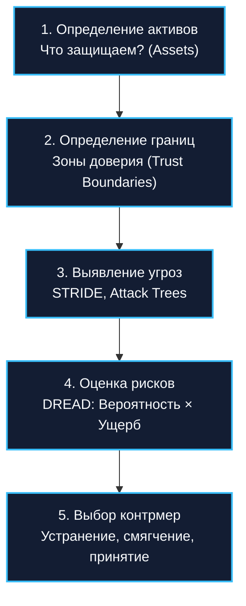
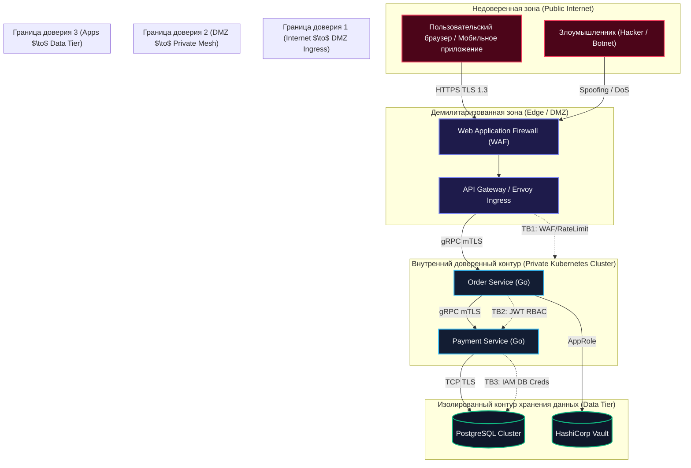

## Зачем архитектору думать как злоумышленник: Безопасность архитектуры и Threat Modeling

> *"The first rule of security is that you cannot protect what you do not understand. The second rule is that an attacker does not care about your elegant design patterns; they care only about where your assumptions fail."*  
> — Брайан Керниган

Все рассмотренные нами ранее механизмы устойчивости — Rate Limiting, Bulkhead, Timeout и Circuit Breaker — проектируются для защиты от перегрузок, сетевых задержек и аппаратных сбоев. Они исходят из неявной предпосылки: клиенты системы легитимны, хотя иногда и чрезмерно активны. Однако в реальном сетевом мире за пределами защищенного контура действуют совершенно иные законы.

Злоумышленник не играет по правилам. Он не пытается честно распределять запросы и не уважает ваши лимиты. Он целенаправленно ищет архитектурные слепые зоны, логические несостыковки в контрактах, утечки метаданных в публичных интерфейсах и огрехи в конфигурациях, чтобы украсть пользовательские данные, скомпрометировать финансовые счета или превратить ваши сервера в узлы ботнета.

Попытка «навесить безопасность» в самом конце разработки — перед релизом в прод — подобна попытке сделать средневековый замок неприступным, наклеив обои на картонные стены. Безопасность обязана закладываться на этапе чертежей.

Инженерная методология превентивного анализа рисков называется **моделированием угроз (Threat Modeling)**. В этой лекции мы разберем процесс выявления уязвимостей на ранних стадиях, освоим отраслевые фреймворки STRIDE и DREAD, исследуем специфические векторы атак на рантайм Go (от ловушек `net/http/pprof` до криптографических накладных расходов в Linux), и научимся выстраивать рубежи обороны в Clean Architecture ([[14. Clean Architecture и Dependency Rule]]).

---

### Что такое Threat Modeling

**Threat Modeling (моделирование угроз)** — это структурированный, повторяемый инженерный процесс декомпозиции архитектуры с целью выявления потенциальных векторов атак, оценки вероятности рисков и внедрения превентивных контрмер задолго до написания первой строчки production-кода.

Процесс моделирования угроз дает ответы на четыре фундаментальных вопроса:
1. **Что мы защищаем? (Assets / Активы):** Персональные данные (PII), номера кредитных карт, закрытые ключи подписи токенов, коммерческая тайна, вычислительные мощности серверов.
2. **Кто может атаковать? (Threat Actors / Субъекты угроз):** Внешние анонимные хакеры, автоматизированные сканеры уязвимостей, конкуренты, недобросовестные инсайдеры или скомпрометированные сторонние SaaS-сервисы.
3. **Как они могут атаковать? (Threats & Vectors / Векторы атак):** Подделка сессионных токенов, SQL/Command инъекции, перехват трафика в открытых сетях, исчерпание пула соединений через атаки типа Slowloris.
4. **Что мы с этим делаем? (Mitigations / Контрмеры):** Внедрение взаимного mTLS, строгая валидация схем, ограничение прав доступа (RBAC), маскирование логов и регулярный аудит.



Стоимость исправления архитектурной уязвимости (например, отсутствия разделения прав на уровне доменных моделей) на этапе проектирования равна нескольким часам обсуждения у маркерной доски. Исправление той же уязвимости после утечки базы данных в публичный доступ обходится в миллионы долларов штрафов и разрушенную репутацию бизнеса.

---

### Диаграмма потоков данных (DFD) и границы доверия

Основой для анализа угроз служит **Data Flow Diagram (DFD)**, на которой явно обозначены **границы доверия (Trust Boundaries)**. Граница доверия — это периметр, разделяющий компоненты с разным уровнем привилегий:



---

### Методологии моделирования угроз

В индустрии программной инженерии выработаны строгие таксономии классификации атак.

#### STRIDE

Фреймворк, разработанный в Microsoft, делит все угрозы на шесть ортогональных категорий:

| Категория STRIDE | Описание угрозы | Нарушаемое свойство | Пример в Go-бэкенде | Контрмера архитектора |
|---|---|---|---|---|
| **S**poofing | **Подмена личности:** выдача себя за другого пользователя или сервис. | Аутентификация (Authentication) | Использование чужого JWT; отсутствие валидации поля `issuer` или алгоритма `alg: "none"`. | Проверка криптографической подписи JWT; взаимная аутентификация микросервисов через **mTLS**. |
| **T**ampering | **Фальсификация данных:** несанкционированная модификация информации в канале связи или памяти. | Целостность (Integrity) | Перехват и изменение суммы заказа в теле HTTP-запроса на пути между клиентом и сервером. | Сквозное шифрование TLS 1.3; проверка целостности полезной нагрузки через HMAC-SHA256 подписи. |
| **R**epudiation | **Отказ от авторства:** невозможность доказать факт совершения операции конкретным субъектом. | Неотказуемость (Non-repudiation) | Пользователь перевел деньги и заявляет: «Это не я, логи сервиса не содержат подтверждений». | Неизменяемый аудит-лог (Audit Trail) с цифровыми подписями; корреляция с `trace_id` и сессией. |
| **I**nformation Disclosure | **Утечка информации:** раскрытие конфиденциальных данных лицам без прав доступа. | Конфиденциальность (Confidentiality) | Вывод паролей от БД в логах; публично открытый HTTP-эндпоинт профилирования `/debug/pprof`. | Маскирование чувствительных данных; изоляция системных эндпоинтов на отдельном закрытом порту. |
| **D**enial of Service | **Отказ в обслуживании:** исчерпание системных ресурсов и блокировка легитимных клиентов. | Доступность (Availability) | Медленная атака типа Slowloris, удерживающая сокеты открытыми и исчерпывающая горутины в Go. | Жесткие таймауты (`ReadHeaderTimeout`, `IdleTimeout`); Rate Limiting ([[38. Rate Limiting и защита системы]]). |
| **E**levation of Privilege | **Повышение привилегий:** получение пользователем прав администратора без авторизации. | Авторизация (Authorization) | Вызов ручки `/api/admin/users/delete` рядовым пользователем без проверки ролей в контексте. | Декларативный RBAC/ABAC контроль; проверка разрешений во внутреннем слое Use Case. |

#### DREAD: количественная оценка риска

Для приоритезации задач в инженерном бэклоге используется скоринг DREAD. Каждому параметру присваивается оценка от 1 до 10:
- **D**amage (Потенциальный ущерб): Насколько критичны последствия успешной атаки?
- **R**eproducibility (Воспроизводимость): Легко ли повторить атаку?
- **E**xploitability (Эксплуатируемость): Требуются ли хакеру глубокие знания или достаточно готового скрипта?
- **A**ffected Users (Количество затронутых пользователей): Сколько клиентов пострадает?
- **D**iscoverability (Обнаруживаемость): Насколько легко обнаружить эту уязвимость?

$$	ext{Risk Score} = \frac{D + R + E + A + D}{5}$$

Угрозы с рейтингом $\ge 8$ обязаны блокировать релиз до полного устранения.

#### Attack Trees (Деревья атак)

Иерархическая древовидная модель, где корнем служит цель злоумышленника (например, «Получить несанкционированный доступ к таблице транзакций»), а ветвями — цепочки действий («Скомпрометировать ключ сервисного аккаунта Kubernetes» ИЛИ «Внедрить SQL-инъекцию в поисковый эндпоинт»).

---

### Процесс Threat Modeling'а на практике

Чтобы Threat Modeling не превращался в бюрократическую имитацию бурной деятельности, следуйте пятишаговому инженерному регламенту:

1. **Очертите границы (Define Scope):** Выберите конкретный микросервис, новую бизнес-фичу или критический поток данных. Не пытайтесь за один присест проанализировать платформу из 50 сервисов целиком.
2. **Постройте DFD-схему:** Визуализируйте путь данных от клиента через шлюзы, роутеры, сервисные слои, внешние интеграции и базы данных с указанием границ доверия.
3. **Прогоните каждый узел через матрицу STRIDE:** Для каждого потока и хранилища задайте контрольные вопросы: возможен ли здесь Spoofing? Где валидируется целостность?
4. **Оцените риски по шкале DREAD:** Отделите теоретические страхи от реальных катастрофических векторов.
5. **Зафиксируйте контрмеры в коде и архитектуре:** Превратите выводы моделирования в конкретные задачи в Jira/GitHub Issues, добавьте тесты на безопасность и закрепите правила на Code Review.

---

### Специфика безопасности в экосистеме Go

Язык Go славится своей безопасностью по сравнению с C/C++: в нем нет ручного управления памятью (`free/malloc`), адресной арифметики (если не используется `unsafe`) и уязвимостей типа Buffer Overflow. Однако у Go есть свои уникальные архитектурные подводные камни.

#### 1. Смертоносный `net/http/pprof` на публичном роутере
Стандартный профайлер Go подключается простым импортом:
```go
import _ "net/http/pprof"
```
При этом хендлеры профилирования **автоматически регистрируются на стандартном `http.DefaultServeMux`**!  
Если разработчик запускает публичный сервер через `http.ListenAndServe(":8080", nil)`, любой пользователь интернета получает беспрепятственный доступ к эндпоинтам:
- `/debug/pprof/heap` — снимок всей кучи памяти процесса (включая незашифрованные строки, токены, пароли).
- `/debug/pprof/goroutine` — просмотр всех стектрейсов и выполняемого кода.
- `/debug/pprof/profile?seconds=30` — заморозка процессорного времени на сбор профиля, приводящая к DoS!

**Правило:** Никогда не используйте `http.DefaultServeMux` в проде. Всегда создавайте изолированный `http.NewServeMux()`, а отладочные эндпоинты выносите на отдельный внутренний порт (например, `localhost:9090` или Unix Domain Socket), недоступный из внешнего мира.

#### 2. Неперехваченные паники и исчерпание горутин (DoS)
- В Go аварийная паника (`panic`), случившаяся внутри порожденной горутины `go worker()`, если она не обернута в `recover()`, **моментально завершает весь процесс операционной системы**, роняя сервис у всех клиентов сразу.
- Атака типа **Slowloris**: злоумышленник открывает 50 000 HTTP-соединений и шлет по 1 байту каждые 10 секунд. Если у HTTP-сервера Go не настроены параметры `ReadHeaderTimeout` и `IdleTimeout`, горутины зависнут в ожидании данных, истощив оперативную память ноды.

#### 3. Состояния гонки (Race Conditions) и Time-of-Check to Time-of-Use (TOCTOU)
Конкурентный доступ к общим переменным без мьютексов (`sync.RWMutex`) или атомиков (`sync/atomic`) нарушает модель памяти Go (Memory Model). В ряде случаев гонка за балансом пользователя позволяет списать одну и ту же сумму дважды при одновременной отправке двух параллельных запросов.

---

### Mechanical Sympathy: вычислительная цена безопасности

Безопасность не бывает бесплатной. Каждое криптографическое преобразование, дополнительный TLS-хендшейк и шаг валидации сжигают такты процессора и увеличивают задержку:

1. **TLS 1.3 и криптографические расширения CPU:**
   - В Go реализация `crypto/tls` весьма эффективна, но на 100k RPS эти микросекунды складываются. Полный TLS-хендшейк требует асимметричной криптографии (ECDH / X25519) и добавляет от 1 до 3 мс на новое сетевое соединение.
   - Симметричное потоковое шифрование (AES-GCM, ChaCha20-Poly1305) на современных процессорах x86-64 и ARM64 аппаратно ускоряется специальными инструкциями процессора (**AES-NI**, ARMv8 Crypto Extensions). Это снижает нагрузку на CPU до сотен наносекунд на килобайт данных.
2. **Алгоритмы подписи JWT: RSA против эллиптических кривых:**
   - Классический алгоритм `RS256` (RSA 2048/4096 бит) требует тяжелой модульной арифметики больших чисел. Валидация подписи RSA может занимать **до $500–1\,500$ микросекунд** процессорного времени на каждое обращение!
   - Переход на эллиптические кривые — **`ES256` (ECDSA P-256)** или **`Ed25519`** — снижает время валидации до **$20–50$ микросекунд** (в 30 раз быстрее при сопоставимой или превосходящей криптостойкости!).
3. **Аллокации при глубокой валидации структур:**
   - Использование библиотек валидации входных DTO через рефлексию (`reflect`) создает аллокации строк и срезов ошибок в куче. Для снижения нагрузки используйте библиотеки вроде `go-playground/validator`, которые оптимизированы под разумный компромисс между скоростью и памятью, а также предварительную компиляцию регулярных выражений (`regexp.MustCompile`).

> [!info] Под капотом: Источники энтропии и getrandom(2) в Linux
> Стандартная библиотека Go содержит криптографически стойкий генератор псевдослучайных чисел `crypto/rand`. На платформе Linux он вызывает системный вызов ядра `getrandom(2)`. До инициализации пула энтропии ядра Linux (CSPRNG) этот вызов может заблокировать стартующий процесс Go-сервиса на несколько секунд. В современных ядрах Linux 5.6+ и Go 1.22+ используется неблокирующий fast-path, однако архитектор обязан знать о системной зависимости криптографии от энтропии ОС.

---

### Маскирование чувствительных данных (PII Redaction)

Один из главных векторов утечки информации (Information Disclosure) — случайный сброс персональных данных и секретов в структурированные логи:

```go
package security

import (
	"strings"
)

// MaskEmail скрывает имя пользователя в адресе электронной почты
func MaskEmail(email string) string {
	parts := strings.Split(email, "@")
	if len(parts) != 2 {
		return "***"
	}
	name := parts[0]
	domain := parts[1]

	visibleLength := min(3, len(name))
	return name[:visibleLength] + "***@" + domain
}

// MaskCard скрывает номер банковской карты, оставляя последние 4 цифры
func MaskCard(pan string) string {
	if len(pan) < 10 {
		return "****"
	}
	return pan[:4] + " **** **** " + pan[len(pan)-4:]
}
```

> [!warning] Ловушка / Gotcha: Логирование r.Header и сырого тела запроса
> Категорически запрещено логировать объект `r.Header` целиком на уровне `INFO` или `DEBUG`! Заголовки `Authorization: Bearer <JWT>`, `Cookie` и API-ключи моментально улетают в централизованные хранилища (Elasticsearch, Loki), к которым имеют доступ десятки разработчиков, тестировщиков и стажеров. Утечка сессионного токена администратора из логов нивелирует любые криптографические барьеры.

---

### Интеграция в жизненный цикл разработки и CI/CD

Моделирование угроз обязано подкрепляться автоматизированным инструментарием проверки кода на этапе сборки:

1. **`gosec`:** Специализированный статический анализатор кода безопасности для Go, выявляющий использование небезопасных пакетов, инъекции в SQL/командную строку, жестко зашитые пароли и опасный `unsafe`.
2. **`govulncheck`:** Официальный сканер уязвимостей от команды Google Go. Анализирует граф вызовов бинарника и отслеживает известные CVE в сторонних зависимостях.
3. **`golangci-lint`:** Линтер со встроенными правилами безопасности (`errcheck`, `gosec`, `noctx`).

---

### Связь с другими архитектурными концепциями

- **Zero Trust** ([[45. Zero Trust и сетевые границы]]): Прямое логическое развитие Threat Modeling — отказ от понятия «безопасного внутреннего периметра».
- **Observability** ([[39. Observability в архитектуре. Metrics, Logs, Traces]]): Аудит-логи и алерты безопасности позволяют фиксировать факты попыток взлома в реальном времени.
- **Rate Limiting** ([[38. Rate Limiting и защита системы]]) и **Bulkhead** ([[37. Bulkhead и изоляция отказов]]): Служат физическими барьерами против атак типа Denial of Service (DoS).
- **Clean Architecture** ([[14. Clean Architecture и Dependency Rule]]): Изоляция бизнес-правил в слое Use Cases позволяет реализовать независимый слой авторизации без привязки к транспортным адаптерам.

---

### Антипаттерны моделирования угроз

1. **«Мы никому не нужны, мы просто внутренний сервис»:**  
   Более 60% взломов инфраструктуры происходят через компрометацию неприметных внутренних утилит, у которых не было аутентификации, потому что они находились «за VPN». Помните: отсутствие Rate Limiting на эндпоинте `/login` приведёт к брутфорсу паролей независимо от известности или размера компании.
2. **Threat Modeling для галочки (Paper Security):**  
   Проведение формального совещания и создание документа, который складывается на полку и никогда не пересматривается.
3. **Игнорирование цепочки поставок (Supply Chain Attacks):**  
   Концентрация только на своем коде при бесконтрольном подключении сотен сторонних зависимостей из GitHub без фиксации контрольных сумм в `go.sum` и проверки через `govulncheck`.

---

> [!tip] Собеседование
> **Вопрос:** Как вы проведете моделирование угроз (Threat Modeling) для нового критического микросервиса процессинга платежей на Go, взаимодействующего со сторонним шлюзом Stripe?
> 
> **Ответ:**  
> Я организую процесс по пяти фундаментальным шагам:
> 1. **Построение DFD с границами доверия:**
>    - Клиент $\to$ (Граница 1: Internet) $\to$ API Gateway $\to$ (Граница 2: DMZ) $\to$ Payment Service $\to$ (Граница 3: External API) $\to$ Stripe API / PostgreSQL.
> 2. **Анализ узлов по матрице STRIDE:**
>    - **Spoofing (Подмена):** Вызывающий сервис выдает себя за Gateway. *Контрмера:* Аутентификация через взаимный mTLS внутри сервис-меша и валидация JWT с проверкой `issuer` и подписи `ES256`.
>    - **Tampering (Фальсификация):** Модификация суммы списания в сетевом потоке. *Контрмера:* Сквозное шифрование TLS 1.3, строгая типизация Protobuf/gRPC, проверка цифровой подписи запроса.
>    - **Repudiation (Отказ):** Пользователь оспаривает факт списания. *Контрмера:* Запись неизменяемого финансового аудит-лога в отдельную таблицу PostgreSQL с временными штампами и `trace_id`.
>    - **Information Disclosure (Утечка):** Утечка номеров карт и секретного токена Stripe API. *Контрмера:* Секреты подгружаются из HashiCorp Vault в оперативную память; номера карт маскируются; логирование заголовков отключено.
>    - **Denial of Service (DoS):** Медленные запросы исчерпывают горутины. *Контрмера:* Жесткие HTTP-таймауты (`ReadHeaderTimeout: 2s`, `IdleTimeout: 10s`), Rate Limiter на входе, семафор конкурентности на пуле горутин.
>    - **Elevation of Privilege (Эскалация):** Обычный аккаунт инициирует ручной возврат средств. *Контрмера:* RBAC проверка роли `FinanceAdmin` во внутреннем слое Use Case.
> 3. **Go-специфика:** Закрытие `pprof` на отдельный loopback-порт, обработка паник через defer/recover в воркерах, проверка зависимостей через `govulncheck`.
> 4. **Итог:** Задачи на контрмеры фиксируются в бэклоге до начала активной фазы написания кода.

---

### Итог

Моделирование угроз — это профессиональное инженерное искусство видеть систему глазами недоброжелателя. Осознанное понимание зон доверия, применение методологии STRIDE и знание архитектурной специфики рантайма Go превращают безопасность из абстрактного страха в строгий, измеримый и управляемый процесс.

Однако в распределенном облачном мире само понятие защищенного периметра стремительно уходит в прошлое. Ни один сервер во внутренней сети больше не должен считаться доверенным по умолчанию.

В следующей лекции мы детально разберем парадигму нулевого доверия: [[45. Zero Trust и сетевые границы]].
