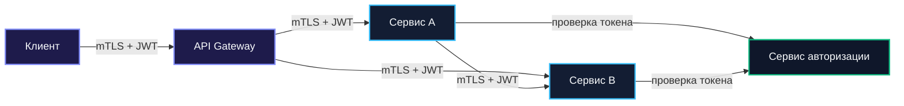
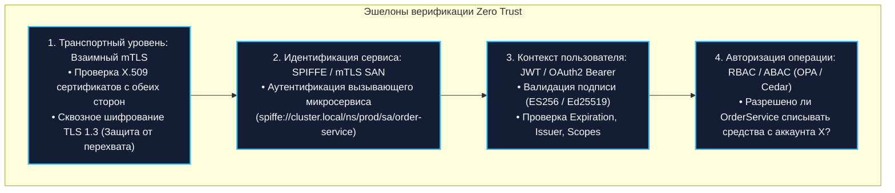
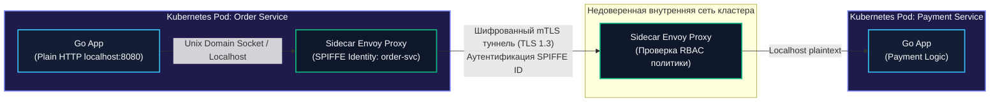

## Zero Trust и сетевые границы: Архитектура нулевого доверия

> *«Классическая модель безопасности „замок и ров“ предполагает, что всякий за стенами — враг, а каждый внутри — верный друг. В современных облаках ров пересох, подъемный мост сломан, и полагаться на защиту периметра попросту смертельно».*    
> — Брайан Керниган

В предыдущей лекции, моделируя угрозы по методологии STRIDE, мы столкнулись с суровой реальностью распределённых систем ([[44. Безопасность архитектуры. Threat modeling]]). Классическая парадигма безопасности «Защищенный периметр» (Castle-and-Moat), делившая мир на «опасный интернет снаружи» и «доверенную локальную сеть внутри корпоративного VPN», безнадежно мертва.

Современные изощренные атаки — целевой фишинг, взлом учетных записей разработчиков, уязвимости в зависимостях открытого кода (Supply Chain Attacks) и действия недобросовестных инсайдеров — без труда преодолевают внешние брандмауэры. Оказавшись внутри корпоративной сети или Kubernetes-кластера, злоумышленник сталкивается с полной беззащитностью: микросервисы общаются между собой по открытому незашифрованному HTTP без проверки прав, базы данных принимают соединения от любых IP-адресов подсети, а один скомпрометированный тестовый под позволяет осуществить беспрепятственное боковое перемещение (Lateral Movement) по всей инфраструктуре.

Архитектурным ответом на эту реальность стала парадигма **Zero Trust (Нулевое доверие)**. Это строгая модель, в которой доверие не предоставляется по умолчанию никому и никогда: ни внешним пользователям, ни внутренним сервисам, ни системным демонам.

В этой лекции мы разберём ключевые принципы Zero Trust, научимся реализовывать взаимную криптографическую аутентификацию (mTLS) и валидацию токенов на чистом Go, исследуем роль Service Mesh и SPIFFE ID, и измерим накладные расходы на процессор и задержку сети.

---

### Три принципа Zero Trust

Модель Zero Trust (сформулированная Forrester и стандартизированная NIST SP 800-207) базируется на трех фундаментальных постулатах:

1. **Never trust, always verify (Никогда не доверяй, всегда проверяй):**  
   Каждый запрос — независимо от того, пришел ли он из открытого интернета, из соседнего контейнера в том же поде или от локального процесса — обязан проходить строгую аутентификацию и авторизацию. Локальный IP-адрес источника `10.x.x.x` не дает никаких привилегий.
2. **Assume breach (Исходи из неизбежности взлома):**  
   Архитектура проектируется так, будто один или несколько узлов в вашей сети уже прямо сейчас захвачены хакером. Задача архитектора — жестко сегментировать систему и минимизировать радиус поражения (Blast Radius), предотвращая боковое распространение атаки.
3. **Least privilege (Принцип наименьших привилегий):**  
   Каждый сервис, горутина и пользователь получают доступ только к тем строго ограниченным операциям и данным, которые жизненно необходимы для выполнения их непосредственной функции (Just-In-Time и Just-Enough доступ), и ни байтом больше.



---

### Zero Trust в микросервисной архитектуре на Go

Переход от периметра к Zero Trust требует соблюдения трех эшелонов верификации на каждом межсервисном вызове:



1. **Взаимный TLS (Mutual TLS, mTLS):**  
   Не только сервер подтверждает свою подлинность клиенту, но и клиент обязан предъявить доверенный сертификат X.509 серверу. Неавторизованный процесс не сможет даже завершить сетевое TCP-рукопожатие.
2. **Аутентификация на уровне приложения:**  
   Каждый RPC-запрос несет криптографически подписанный токен (JWT), подтверждающий контекст пользователя, инициировавшего операцию.
3. **Авторизация на каждом шаге (Step-by-Step Authorization):**  
   Валидности токена недостаточно. Принимающий сервис обязан убедиться, что субъекту разрешено выполнить именно этот HTTP-метод над конкретной сущностью.

---

### Реализация mTLS в Go

Стандартная библиотека Go предоставляет эталонную поддержку mTLS в пакете `crypto/tls`. Сервер и клиент настраиваются на обоюдную валидацию сертификатов через корневой удостоверяющий центр (Certificate Authority, CA):

#### 1. Сервер с требованием клиентского сертификата

```go
package security

import (
	"crypto/tls"
	"crypto/x509"
	"fmt"
	"net/http"
	"os"
)

// NewTLSServer создает защищенный HTTP-сервер с обязательной проверкой сертификата клиента
func NewTLSServer(certFile, keyFile, caCertFile string) (*http.Server, error) {
	// 1. Читаем сертификат удостоверяющего центра (CA)
	caCert, err := os.ReadFile(caCertFile)
	if err != nil {
		return nil, fmt.Errorf("failed to read CA certificate: %w", err)
	}

	caCertPool := x509.NewCertPool()
	if !caCertPool.AppendCertsFromPEM(caCert) {
		return nil, fmt.Errorf("failed to parse CA certificate into pool")
	}

	// 2. Настраиваем TLS-конфигурацию сервера
	tlsConfig := &tls.Config{
		// Требуем от клиента сертификат и верифицируем его через caCertPool
		ClientAuth: tls.RequireAndVerifyClientCert,
		ClientCAs:  caCertPool,
		MinVersion: tls.VersionTLS13, // Используем исключительно современный безопасный TLS 1.3
	}

	return &http.Server{
		Addr:      ":8443",
		TLSConfig: tlsConfig,
	}, nil
}
```

#### 2. Клиент, предъявляющий свой сертификат

```go
import (
	"crypto/tls"
	"crypto/x509"
	"fmt"
	"net/http"
	"os"
	"time"
)

// NewTLSClient создает HTTP-клиент, подписывающий свои запросы клиентским сертификатом
func NewTLSClient(certFile, keyFile, caCertFile string) (*http.Client, error) {
	// Загружаем пару клиентского сертификата и приватного ключа
	cert, err := tls.LoadX509KeyPair(certFile, keyFile)
	if err != nil {
		return nil, fmt.Errorf("failed to load client keypair: %w", err)
	}

	caCert, err := os.ReadFile(caCertFile)
	if err != nil {
		return nil, fmt.Errorf("failed to read CA cert: %w", err)
	}

	caCertPool := x509.NewCertPool()
	if !caCertPool.AppendCertsFromPEM(caCert) {
		return nil, fmt.Errorf("failed to append CA cert")
	}

	tlsConfig := &tls.Config{
		Certificates: []tls.Certificate{cert},
		RootCAs:      caCertPool,
		MinVersion:   tls.VersionTLS13,
	}

	return &http.Client{
		Transport: &http.Transport{
			TLSClientConfig:     tlsConfig,
			MaxIdleConns:        100,
			MaxIdleConnsPerHost: 20,
			IdleConnTimeout:     90 * time.Second,
		},
		Timeout: 10 * time.Second,
	}, nil
}
```

---

### Service Mesh как реализация Zero Trust

Ручное управление сертификатами X.509 в распределенном кластере на сотни сервисов (генерация пар ключей, безопасная доставка на поды, еженедельная ротация) превращается в тяжелейшую эксплуатационную рутину.

В современных облачных средах реализацию Zero Trust делегируют **Service Mesh (Istio, Linkerd)**:



1. **Sidecar-прокси (Envoy):** Рядом с каждым Go-контейнером поднимается прозрачный sidecar-прокси.
2. **Идентификация через SPIFFE:** Сервису присваивается криптографический идентификатор в формате URI:  
   `spiffe://cluster.local/ns/prod/sa/order-service`, прописанный в расширении SAN (Subject Alternative Name) временного сертификата.
3. **Автоматическая ротация:** Контроллер Service Mesh (Istiod) каждые несколько часов автоматически обновляет ключи и сертификаты в памяти Envoy через API Secret Discovery Service (SDS) без перезапуска сервисов.
4. **Освобождение приложения:** Приложение Go общается со своим локальным sidecar по `localhost` по чистому HTTP, а всю тяжесть взаимного шифрования и валидации mTLS берет на себя Envoy.

---

### JWT и авторизация на уровне приложения

Хотя mTLS на уровне Service Mesh гарантирует подлинность вызывающего сервиса, он ничего не знает о **конечном пользователе**. Поэтому каждый запрос сквозным образом сопровождает токен авторизации (JWT / OAuth2 Bearer Token). В Go это реализуется middleware, которое работает с `context.Context`.

Принимающий сервис обязан проверить подпись токена, срок действия (`exp`), издателя (`iss`) и права доступа (`scopes` / `roles`):

```go
package middleware

import (
	"context"
	"crypto/ecdsa"
	"fmt"
	"net/http"
	"strings"

	"github.com/golang-jwt/jwt/v5"
)

type contextKey string

const claimsKey contextKey = "user_claims"

// AuthMiddleware проверяет валидность входящего JWT токена
func AuthMiddleware(publicKey *ecdsa.PublicKey) func(http.Handler) http.Handler {
	return func(next http.Handler) http.Handler {
		return http.HandlerFunc(func(w http.ResponseWriter, r *http.Request) {
			authHeader := r.Header.Get("Authorization")
			if authHeader == "" || !strings.HasPrefix(authHeader, "Bearer ") {
				http.Error(w, "missing or malformed authorization header", http.StatusUnauthorized)
				return
			}

			tokenStr := strings.TrimPrefix(authHeader, "Bearer ")

			// Парсим и валидируем токен
			token, err := jwt.Parse(tokenStr, func(t *jwt.Token) (interface{}, error) {
				// КРИТИЧНО: Явная проверка метода подписи для предотвращения атак с подменой алгоритма
				if _, ok := t.Method.(*jwt.SigningMethodECDSA); !ok {
					return nil, fmt.Errorf("unexpected signing method: %v", t.Header["alg"])
				}
				return publicKey, nil
			})

			if err != nil || !token.Valid {
				http.Error(w, "invalid or expired token", http.StatusUnauthorized)
				return
			}

			// Извлекаем claims и внедряем в контекст запроса
			claims, ok := token.Claims.(jwt.MapClaims)
			if !ok {
				http.Error(w, "invalid token claims", http.StatusUnauthorized)
				return
			}

			ctx := context.WithValue(r.Context(), claimsKey, claims)
			next.ServeHTTP(w, r.WithContext(ctx))
		})
	}
}
```

> [!warning] Ловушка / Gotcha: Катастрофа с алгоритмом alg: none
> Прием JWT без жесткой валидации заголовка алгоритма — одна из самых позорных уязвимостей в истории веб-безопасности. Хакер отправляет токен с заголовком `{"alg": "none"}` и удаляет подпись. Библиотеки, не проверяющие ожидаемый алгоритм, считают такой токен валидным и предоставляют злоумышленнику права суперадминистратора! Всегда проверяйте `token.Method.Alg()` на соответствие ожидаемому алгоритму. В современной библиотеке `golang-jwt/jwt/v5` используйте `jwt.ParseWithClaims` с явным перечислением разрешенных методов (`jwt.WithValidMethods([]string{"ES256"})`).

---

### Mechanical Sympathy: цена Zero Trust

Внедрение модели нулевого доверия неизбежно отражается на вычислительных ресурсах серверов и задержке клиентских вызовов:

#### 1. Рукопожатие TLS (Handshake Overhead)
- Полный handshake в протоколе TLS 1.3 требует одного кругового сетевого обращения (1-RTT) и обмена асимметричными ключами по протоколу Диффи-Хеллмана на эллиптических кривых (ECDH / Curve25519). На это уходит от $1$ до $3$ миллисекунд процессорного времени.
- **Оптимизация: Переиспользование соединений (Connection Pooling).** Настройка `http.Transport` с параметрами `MaxIdleConnsPerHost: 50` позволяет выполнять тысячи запросов внутри однажды прогретого TLS-туннеля.
- **Session Resumption (TLS Tickets):** Позволяет повторно подключающимся клиентам восстанавливать сессию за 0-RTT без повторного вычисления асимметричных ключей.

#### 2. Симметричное шифрование и инструкции AES-NI
- После завершения хендшейка трафик шифруется алгоритмами **AES-GCM** или **ChaCha20-Poly1305**.
- Современные процессоры Intel и AMD поддерживают набор процессорных инструкций **AES-NI**, выполняющий шифрование на уровне аппаратных блоков CPU. В рантайме Go ассемблерные вставки стандартной библиотеки задействуют эти инструкции напрямую, снижая накладные расходы на шифрование до десятков наносекунд.

#### 3. Стоимость валидации JWT
- Валидация подписи JWT на базе эллиптических кривых (`ES256`, `Ed25519`) требует порядка $30–50$ микросекунд CPU. Ed25519 в Go реализован через `crypto/ed25519` и является отличным выбором по соотношению скорость/безопасность.
- Для сравнения: устаревший алгоритм `RS256` (RSA 2048) может тратить до $1\,500$ микросекунд на проверку подписи, создавая колоссальную паразитную нагрузку на ядра процессора при высоких RPS.

> [!info] Под капотом: Налог на Service Mesh в Kubernetes
> При использовании Service Mesh трафик между подами перехватывается правилами `iptables` ядра Linux и дважды проходит через сетевой стек `localhost` (приложение $\to$ sidecar на источнике, затем sidecar $\to$ приложение на приемнике). Это добавляет от $0.5$ до $1.5$ миллисекунд к хвостовой задержке ($p99$) каждого межсервисного вызова. В современных инсталляциях для устранения этого оверхеда используют технологию **eBPF (Cilium)**, которая перенаправляет пакеты напрямую между сокетами в пространстве ядра в обход сетевого стека TCP/IP.

---

### Zero Trust и архитектура системы

Принципы нулевого доверия пронизывают все слои распределённой платформы:

- **API Gateway и BFF** ([[35. API Gateway и BFF]]): Выполняет первичную TLS-терминацию внешнего трафика, отсекает нелегитимные запросы, производит обмен сессионных кук на внутренние JWT-токены, но **не является единственным рубежом обороны**.
- **Service Discovery** ([[34. Service Discovery. Client side и Server side]]): Интегрируется с реестрами удостоверений. Каждый разрезолвленный адрес сопровождается криптографическим идентификатором (SPIFFE ID).
- **Observability** ([[39. Observability в архитектуре. Metrics, Logs, Traces]]): Резкий всплеск ошибок `401 Unauthorized` или `403 Forbidden` в метриках Prometheus служит моментальным триггером для алертов информационной безопасности.
- **Threat Modeling** ([[44. Безопасность архитектуры. Threat modeling]]): Служит теоретическим фундаментом для определения границ доверия и обоснования внедрения mTLS.
- **Data Pipeline** ([[41. Data Pipeline и потоковая обработка]]): Требует обязательного шифрования транзитных данных (TLS в Kafka) и строгой аутентификации каждого консьюмера через SASL/SCRAM или mTLS-сертификаты.

---

### Антипаттерны и ошибки реализации Zero Trust

1. **«Мы находимся внутри Kubernetes, нам mTLS не нужен»:**  
   Классическая ошибка периметрального мышления. Взлом одного неприметного пода или компрометация `ServiceAccount` токена моментально открывает хакеру доступ ко всем внутренним базам и сервисам кластера.
2. **Использование `InsecureSkipVerify: true`:**  
   Включение флага `tls.Config{InsecureSkipVerify: true}` в коде Go отключает проверку подлинности сертификата сервера. Соединение остается зашифрованным, но становится беззащитным перед атаками типа Man-in-the-Middle (MitM).
3. **Бессрочные токены (No Expiration):**  
   Выпуск JWT с бесконечным сроком жизни (`exp = nil`). Если такой токен утечет через логи или скриншот, злоумышленник сохранит доступ к системе навсегда. Используйте короткоживущие Access-токены (10–15 минут) в связке с механизмом ротации Refresh-токенов.
4. **Хранение секретов в репозитории кода или переменных окружения Pod'а:**  
   Секреты должны динамически запрашиваться из специализированных хранилищ (HashiCorp Vault, AWS Secrets Manager) или монтироваться в память процесса через CSI Secret Store Driver.
5. **Игнорирование сетевых политик (Network Policies):**  
   Полагаться только на mTLS и забывать про ограничения на уровне L4. Сетевые политики Kubernetes обязаны блокировать любые неразрешенные TCP-соединения между подами на уровне ядра Linux.

---

> [!tip] Собеседование
> **Вопрос:** В чём принципиальная разница между классической безопасностью на базе периметра и парадигмой Zero Trust? Как бы вы поэтапно внедрили Zero Trust в развивающуюся микросервисную инфраструктуру на Go?
> 
> **Ответ:**  
> Классическая безопасность исходит из доверия к сетевому положению: всё, что внутри локальной сети за файрволом, считается доверенным. Zero Trust отвергает доверие по сетевому признаку и требует постоянной проверки каждого запроса.
> 
> Поэтапный план внедрения:
> 1. **Шифрование и аутентификация транспорта (mTLS):**  
>    Внедрение Service Mesh (Istio/Linkerd) для автоматической выдачи X.509 сертификатов с SPIFFE ID и включения прозрачного взаимного mTLS (TLS 1.3) между всеми подами кластера без изменения кода сервисов.
> 2. **Аутентификация на прикладном уровне:**  
>    Внедрение в Go-сервисы стандартного HTTP/gRPC middleware, проверяющего цифровые подписи входящих JWT (`ES256`) через `golang-jwt/jwt/v5` с контролем `iss`, `exp` и `scopes`.
> 3. **Дисциплина секретов:**  
>    Отказ от статичных паролей в конфигурационных YAML-файлах в пользу динамических кратковременных токенов из HashiCorp Vault.
> 4. **Сетевая сегментация (L4):**  
>    Применение строгих Kubernetes `NetworkPolicy`, блокирующих любой межпространственный сетевой трафик по умолчанию (Default Deny All).
> 5. **Наблюдаемость и аудит:**  
>    Сбор метрик отказов авторизации (401/403) в Prometheus и настройка алертов на аномальные всплески активности.

---

### Итог

Zero Trust — это не отдельный программный продукт, который можно купить и установить, а целостная инженерная культура. Отказ от наивного предположения о безопасности «внутренней сети» делает архитектуру удивительно устойчивой к самым сложным современным угрозам.

В языке Go сочетание производительного пакета `crypto/tls`, аппаратного ускорения AES-NI и элегантных middleware позволяет выстроить непробиваемые рубежи обороны без катастрофической деградации сетевой производительности.

Но мало защитить систему — необходимо уметь развивать её во времени, не ломая обратную совместимость с миллионами работающих клиентов. В следующей лекции мы разберём искусство эволюции интерфейсов: [[46. Версионирование сервисов и API]].
