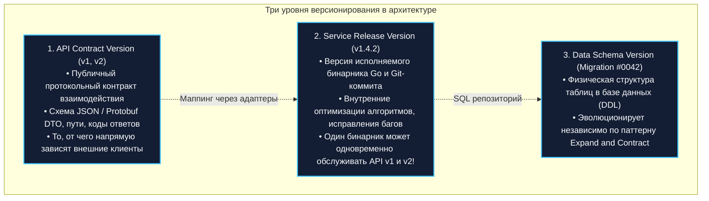
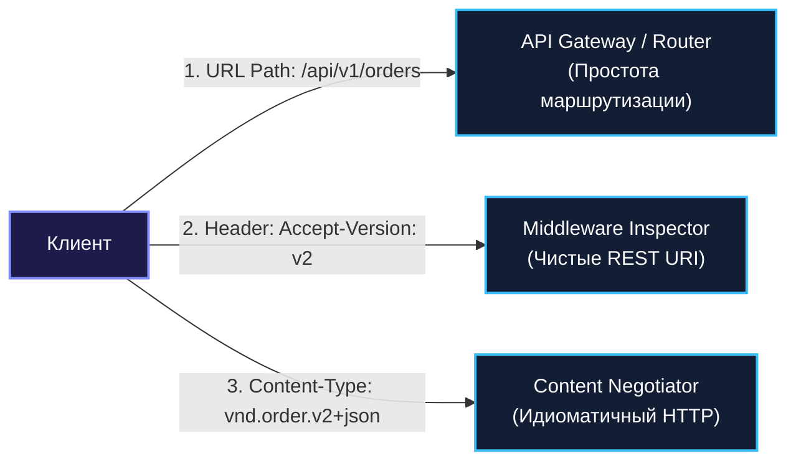
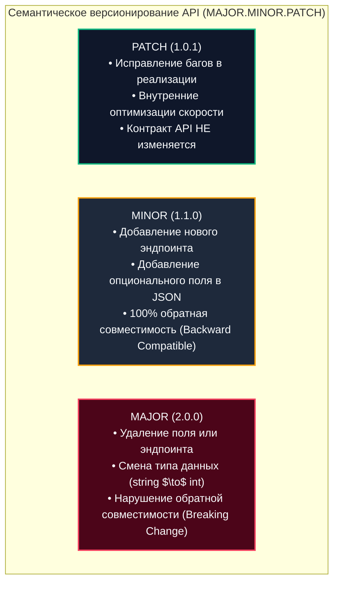
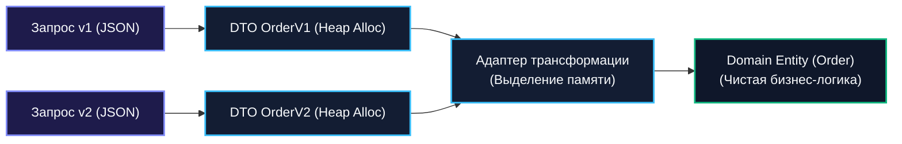
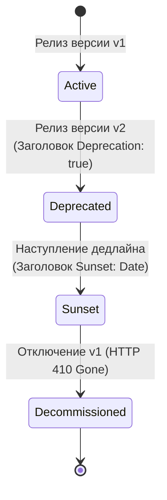

## Почему версионирование — это архитектурная необходимость

> *"You cannot change an interface once it has been published to the world. You can only define a new one and gently escort the old one to the grave."*  
> — Брайан Керниган

Микросервисная архитектура обещает командам независимость и высокую скорость релизов ([[9. Микросервисы. Преимущества, недостатки и мифы]]). Однако за эту свободу приходится платить: каждый микросервис превращается в самостоятельного публичного поставщика контрактов для десятков других систем, мобильных клиентов и сторонних партнеров.

Любая наивная попытка «быстро поправить код» — переименовать поле в JSON-ответе, изменить тип идентификатора с целочисленного на UUID или добавить обязательный параметр в заголовок — оборачивается катастрофой. В один миг падают клиентские приложения, заклинивает обработчики очередей и вспыхивают инциденты во взаимосвязанных системах. Без жесткой архитектурной дисциплины версионирования система неизбежно деградирует в худшую форму программной инженерии — **«распределённый монолит»**, где любое изменение требует мучительного синхронного деплоя всех участников в один и тот же час.

**Версионирование сервисов и API** — это искусство непрерывной и контролируемой эволюции архитектуры. В этой лекции мы разберем стратегии версионирования сетевых контрактов (URL, Headers, Vendor Content-Type), исследуем правила обратной совместимости в JSON и Protobuf, научимся управлять жизненным циклом устаревания (Deprecation & Sunset) по стандарту RFC 8594 и измерим скрытую цену, которую рантайм Go платит за маппинг структур между разными версиями.

---

### Что именно мы версионируем

В распределённой системе термин «версия» объединяет три совершенно разные сущности, путаница между которыми порождает тяжелые архитектурные ошибки:



1. **Версия контракта API (API Version):** Внешний фасад сервиса (`/api/v1/orders`). Она фиксирует синтаксис и семантику запросов. Именно её видят клиенты.
2. **Версия сервиса (Service Release Version):** Версия кода и развернутого артефакта (`v1.2.3`). Внутреннее устройство сервиса может полностью переписаться, но пока API-контракт сохранен, клиенты даже не заметят обновления.
3. **Версия схемы данных (Data Version):** Структура таблиц в PostgreSQL или MongoDB. Она эволюционирует по собственным законам нулевого простоя ([[47. Миграции архитектуры без downtime]]).

---

### Стратегии версионирования API

В веб-архитектуре существует три канонических подхода к передаче версии API в сетевом протоколе:



#### 1. Версионирование через URL (Path-based)

Самый практичный, визуально прозрачный и повсеместно принятый способ:
```http
GET /api/v1/orders/42
GET /api/v2/orders/42
```

**Плюсы:**
- Предельная наглядность: версию видно невооруженным глазом в логах, в браузере и в консоли `curl`.
- Естественная поддержка балансировщиками (Nginx, Envoy, AWS ALB): запросы к `/api/v1/*` можно маршрутизировать на легаси-кластер, а `/api/v2/*` — на новый.

**Минусы:**
- Теоретическое нарушение канонов REST: URL идентифицирует физический ресурс (`orders/42`), а не версию протокола его представления.
- Удваивает количество маршрутов в мультиплексоре роутера.

Реализация в Go с использованием стандартного `http.ServeMux` (начиная с Go 1.22 с поддержкой методов в путях):

```go
package main

import (
	"net/http"

	v1 "myproject/api/v1"
	v2 "myproject/api/v2"
)

func RegisterRoutes(mux *http.ServeMux) {
	// Изолированные обработчики для разных версий контракта
	mux.Handle("GET /api/v1/orders", v1.OrderHandler{})
	mux.Handle("GET /api/v2/orders", v2.OrderHandler{})
}
```

#### 2. Версионирование через заголовок (Header-based)

Клиент отправляет заголовок `Accept-Version: v2` или кастомный `X-API-Version: 2024-01-01`:

```http
GET /api/orders/42 HTTP/1.1
Accept-Version: v2
```

**Плюсы:**
- URL ресурса остается неизменным и концептуально чистым.
- Возможность тонкого A/B тестирования и плавной миграции версий без смены эндпоинтов на клиентах.

**Минусы:**
- Затруднена ручная отладка (требуется явная подстановка заголовков в Postman/curl).
- Опасность кэширования: промежуточные HTTP-прокси обязаны учитывать заголовок `Vary: Accept-Version`, иначе клиент версии `v1` может получить закэшированный ответ версии `v2`.

В Go маршрутизация по заголовку реализуется через middleware-диспетчер:

```go
package middleware

import (
	"net/http"
)

// VersionMiddleware распределяет запрос по обработчикам на основе HTTP-заголовка
func VersionMiddleware(handlers map[string]http.Handler) http.Handler {
	return http.HandlerFunc(func(w http.ResponseWriter, r *http.Request) {
		version := r.Header.Get("Accept-Version")
		if version == "" {
			version = "v1" // Версия по умолчанию для старых клиентов
		}

		handler, ok := handlers[version]
		if !ok {
			http.Error(w, "unsupported API version", http.StatusBadRequest)
			return
		}

		// Уведомляем кэширующие прокси о зависимости ответа от заголовка
		w.Header().Add("Vary", "Accept-Version")
		handler.ServeHTTP(w, r)
	})
}
```

#### 3. Content-Type версионирование (Content Negotiation)

Клиент указывает версию формата представления в стандартном заголовке `Accept` или `Content-Type` через кастомный Vendor Media Type:
```http
GET /api/orders/42 HTTP/1.1
Accept: application/vnd.myapp.order.v2+json
```

**Плюсы:**
- Наиболее академически корректный подход в архитектуре REST (HATEOAS).
- Позволяет независимо версионировать формат входных данных и формат возвращаемого ответа.

**Минусы:**
- Крайняя сложность поддержки сторонними библиотеками, автогенераторами Swagger/OpenAPI и интеграционными клиентами.

---

### SemVer для API: правила семантического версионирования

Стандарт **Semantic Versioning (SemVer 2.0.0)** определяет формат номера версии `MAJOR.MINOR.PATCH`:



В контексте публичных контрактов действует золотое правило: **новые версии API создаются ТОЛЬКО при изменении числа `MAJOR`** (`/api/v1` $\to$ `/api/v2`). Изменения `MINOR` и `PATCH` никогда не должны ломать старых клиентов и выкатываются в рамках текущей версии!

> [!info] Под капотом: Закон Хайрума и скрытые Breaking Changes
> Знаменитый **Закон Хайрума (Hyrum's Law)** гласит: *«При достаточном количестве пользователей API не имеет значения, что именно вы обещали в контракте: абсолютно любое наблюдаемое поведение вашей системы станет зависимостью для кого-то из клиентов»*.  
> Изменение порядка полей в JSON, изменение регистра заголовков ответа или изменение формулировки текста ошибки формально не меняет схему, но может сломать клиентские парсеры. Настоящий архитектор помнит: семантическое изменение (например, если метод `CreateOrder` раньше мгновенно списывал деньги, а теперь только блокирует холдом) — это критический **MAJOR Breaking Change**, даже если Protobuf-схема осталась неизменной байт-в-байт!

---

### Обратная совместимость: правила проектирования

Чтобы не сводить с ума разработчиков мобильных приложений выпуском новых версий API каждую неделю, архитектура обязана следовать строгим принципам обратной совместимости:

1. **Не удаляйте поля** — помечайте как `@Deprecated`, но продолжайте возвращать (возможно, с нулевыми значениями).
2. **Новые поля делайте опциональными** — клиент, не знающий о поле, должен корректно работать без него.
3. **Не меняйте тип существующих полей** — `string` → `int` ломает парсинг.
4. **Не меняйте семантику существующих полей** — `price` в копейках → `price` в рублях.
5. **Добавление новых эндпоинтов обратно совместимо** — старые продолжают работать.

В Go обратная совместимость структур достигается через тэги `json:",omitempty"` и осторожное добавление полей:

```go
package dto

// OrderV1 — первоначальная версия контракта
type OrderV1 struct {
	ID    string `json:"id"`
	Total int    `json:"total"`
}

// OrderV2 — обратно совместимое расширение контракта
type OrderV2 struct {
	ID       string `json:"id"`
	Total    int    `json:"total"`
	Currency string `json:"currency,omitempty"` // Новое опциональное поле!
}
```

---

### Версионирование gRPC и Protobuf

Протокол Protocol Buffers (proto3) был изначально спроектирован инженерами Google для обеспечения идеальной эволюции контрактов без поломок:

```protobuf
syntax = "proto3";

// Версионирование на уровне пакета Protobuf
package order.v1;
// или package order.v2;

service OrderService {
  rpc CreateOrder(CreateOrderRequest) returns (CreateOrderResponse);
}

message CreateOrderRequest {
  // Номера полей (1, 2, 3) формируют бинарный тег в проволочном формате
  string user_id = 1;

  // ЗАПРЕЩЕНО удалять поля вслепую!
  // Удаленные теги ОБЯЗАНЫ резервироваться, чтобы никто случайно не переиспользовал их
  reserved 2, 3;
  reserved "total_amount", "tax_rate";

  repeated Item items = 4;
}
```

#### Стратегии версионирования gRPC:
- **Разные пакеты Protobuf** (`order.v1.OrderService`, `order.v2.OrderService`) — полный аналог URL-версионирования. Требует отдельных gRPC-эндпоинтов.
- **В рамках одного сервиса** с добавлением новых методов: `CreateOrderV2()`. Старый метод `CreateOrder()` продолжает работать без изменений.
- **Совместимость на уровне Protobuf:** используйте зарезервированные номера полей для удалённых, никогда не меняйте номера существующих полей.

#### Правила эволюции Protobuf:
1. **Никогда не меняйте числовые теги (Field Numbers):** В бинарном формате Protobuf имена полей отбрасываются; в проволочном представлении передаются только тег и тип (Wire Type). Изменение номера `string user_id = 1` на `string user_id = 2` разрушит бинарный парсинг.
2. **Резервируйте удаленные поля (`reserved`):** Если поле больше не нужно, зарезервируйте его номер и имя (`reserved 2, 3;`). Это защитит будущих разработчиков от случайного переиспользования старого тега.
3. **Неизвестные поля (Unknown Fields):** Если старый Go-сервис получает пакет со новыми полями от нового клиента, он не падает с ошибкой: рантайм Go сохраняет неизвестные поля в буфере `unknownFields` и пересылает их дальше без потерь.

---

### Механическая симпатия: цена версионирования

Поддержка нескольких версий API накладывает отпечаток на потребление памяти и такты процессора:



1. **Аллокации при многократном маппинге структур:**  
   В чистой гексагональной архитектуре ([[13. Hexagonal Architecture. Ports and Adapters]]) контроллер десериализует входной DTO `OrderV1`, затем маппит его в доменную сущность `Domain.Order`, а на выходе преобразует результат в DTO ответа. Каждое такое преобразование — это выделение новых структур в куче. При 100 000 RPS это вызывает повышенную активность сборщика мусора GC.  
   **Оптимизация:** Избегайте рефлексивных библиотек маппинга. Пишите строгие функции конвертации вручную либо генерируйте их утилитами генерации кода (`copier`, `jinzhu/copier` создают оверхед; ручные функции вида `toDomain()` работают с наносекундной скоростью без лишних аллокаций).
2. **Маршрутизация в памяти:**  
   Проверка версии в middleware на каждом запросе — это доступ к карте (`map[string]handler` или `map[string]http.Handler`) и поиск строки. Стоимость ничтожна (десятки наносекунд), если не аллоцировать новые строки.

---

### Деплой без даунтайма и флаги версий

Версионирование контрактов позволяет проводить обновления production-систем без остановки обслуживания пользователей ([[47. Миграции архитектуры без downtime]]):

1. **Канареечные релизы (Canary Releases):**  
   Новая версия API разворачивается на 2% подов. На них направляется тестовый процент внутреннего трафика, а метрики ошибок и задержек сравниваются со старой версией.
2. **Динамические Feature Flags:**  
   Новая логика поставляется в продакшен «спящей» и активируется постепенно по ID клиента:

```go
package service

import (
	"context"

	"myproject/pkg/feature"
)

type Service struct{}

func (s *Service) CreateOrder(ctx context.Context, req CreateOrderRequest) (*Order, error) {
	// Проверка фиче-флага на основе контекста пользователя
	if feature.IsEnabled(ctx, "new-pricing-engine") {
		return s.createOrderV2(ctx, req)
	}
	return s.createOrderV1(ctx, req)
}

func (s *Service) createOrderV1(ctx context.Context, req CreateOrderRequest) (*Order, error) {
	return nil, nil
}

func (s *Service) createOrderV2(ctx context.Context, req CreateOrderRequest) (*Order, error) {
	return nil, nil
}
```

---

### Жизненный цикл API: Deprecation и Sunset (RFC 8594)

Поддерживать старые версии вечно невозможно: это ведет к экспоненциальному накоплению технического долга. Процесс вывода версии из эксплуатации строится по стандартам IETF RFC 8594:



При обращении к устаревшей версии `v1` сервер продолжает обслуживать запрос, но обязательно возвращает HTTP-заголовки:
- **`Deprecation: true`** (или дата объявления устаревания).
- **`Sunset: Wed, 11 Nov 2026 00:00:00 GMT`** (точная дата окончательного отключения).
- **`Link: </api/v2/orders>; rel="successor-version"`** (ссылка на новую версию контракта).

---

### Антипаттерны версионирования

1. **Версия в имени репозитория или сервиса:**  
   Создание сервисов `order-service-v1` и `order-service-v2` с дублированием репозиториев кода. Это приводит к расхождению бизнес-логики и превращает исправление критических багов в двойную работу. Версионируется контракт API, а не сам сервис.
2. **Бесконечная поддержка легаси (Hoarding Legacy):**  
   Поддержка 8 версий API пятилетней давности из-за боязни потревожить клиентов. Если клиент не обновился за год при наличии уведомлений Sunset — пора отключать старый протокол со статусом `410 Gone`.
3. **Слишком много MAJOR-версий:**  
   Если вы выпускаете `v3` через месяц после `v2`, значит, вы не продумали дизайн. Проектируйте API так, чтобы прожить на одной MAJOR-версии минимум год. Слишком частые мажорные релизы свидетельствуют о незрелости архитектурного проектирования и ошибочно выбранных доменных границах.
4. **Версионирование только для внешних потребителей:**  
   Считать, что «внутри компании все свои, поэтому межсервисный контракт можно менять без предупреждения». В распределённых командах с сотнями инженеров это гарантирует постоянные падения тестовых и боевых сред.

---

> [!tip] Собеседование
> **Вопрос:** Ваш микросервис предоставляет публичный REST API для 15 внешних партнеров и 10 внутренних команд. Возникла бизнес-необходимость переименовать поле `user_id` в `customer_id` и изменить его тип со строки на число `int64`. Как вы спланируете и проведете эту миграцию с нулевым временем простоя?
> 
> **Ответ:**  
> Это критическое нарушение обратной совместимости (Breaking Change), требующее выпуска новой MAJOR-версии API:
> 1. **Создание контракта v2:**  
>    В коде Go создается новый эндпоинт `/api/v2/orders` со структурой `OrderV2Request`, где присутствует `customer_id: int64`. Эндпоинт `/api/v1/orders` продолжает работать без изменений.
> 2. **Общий доменный слой:**  
>    Оба HTTP-контроллера (v1 и v2) маппят входящие запросы в единую внутреннюю доменную сущность, где поле хранится в новом формате (для v1 выполняется безопасный парсинг `strconv.ParseInt`).
> 3. **Объявление Deprecation:**  
>    В ответы эндпоинта `v1` добавляются стандартные заголовки `Deprecation: true`, `Sunset` (со сроком вывода из эксплуатации через 6 месяцев) и `Link` на документацию `v2`.
> 4. **Коммуникация и мониторинг:**  
>    Партнерам рассылается уведомление. В дашборде Grafana настраивается метрика количества вызовов `http_requests_total{version="v1"}`.
> 5. **Деактивация (Sunsetting):**  
>    По истечении срока Sunset и падении трафика v1 до нуля старый роут отключается и возвращает статус `410 Gone`.

---

### Итог

Версионирование API — это фундамент предсказуемости и доверия в распределённых системах. Оно позволяет архитектуре эволюционировать во времени, исключая хаос и синхронные деплои.

Дисциплинированное применение SemVer, бережное отношение к обратной совместимости структур в Go и Protobuf, а также следование стандартам Deprecation и Sunset превращают обновление систем в спокойный, предсказуемый и безопасный инженерный процесс.

В следующей лекции мы углубимся в самый сложный и ответственный рубеж эволюции платформы — проведение миграций баз данных с нулевым временем простоя: [[47. Миграции архитектуры без downtime]].
