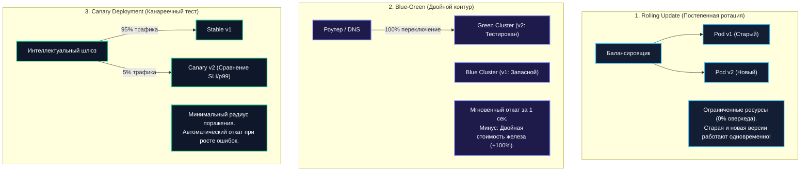
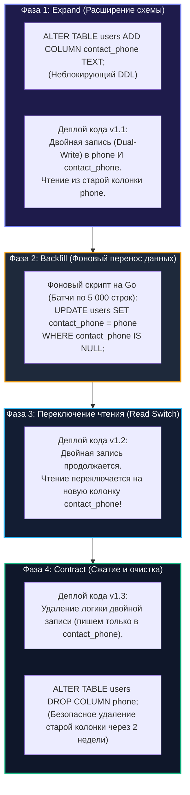

## Непрерывность как архитектурное требование: Миграции архитектуры без downtime

> *"Changing a software architecture in production is like replacing the jet engines on an airliner at thirty thousand feet: passengers should enjoy their coffee without noticing a single flicker of the cabin lights."*  
> — Брайан Керниган

В предыдущей лекции мы научились безопасно версионировать сетевые контракты и интерфейсы ([[46. Версионирование сервисов и API]]). Но как воплотить эти контракты в жизнь на работающих серверах? Как обновить исполняемый бинарник сервиса под нагрузкой в 50 000 RPS или кардинально перестроить реляционную таблицу объемом в 500 миллионов строк, не вызвав ни одной ошибки `502 Bad Gateway` и не потеряв ни единой клиентской транзакции?

В эпоху жестких требований к доступности ([[4. SLA, SLO, SLI и как они влияют на дизайн]]) понятие «технического окна обслуживания» (Maintenance Window) в ночь с субботы на воскресенье окончательно ушло в историю. Пользователи глобальных платформ совершают платежи, смотрят видео и оформляют заказы 24 часа в сутки 7 дней в неделю из всех часовых поясов Земли. Любая плановая остановка базы данных даже на 5 минут — это прямой удар по бизнесу, потеря выручки и мгновенное исчерпание Error Budget.

**Zero-Downtime миграция** — это вершина архитектурного мастерства, комплексная дисциплина безопасного обновления программного кода, схем баз данных и сетевой инфраструктуры в режиме реального времени.

В этой лекции мы детально разберем стратегии развертывания (Rolling Update, Blue-Green, Canary), исследуем механику корректной остановки процессов (Graceful Shutdown) в Go и тонкости взаимодействия с ядром Linux, пошагово освоим паттерн параллельной эволюции данных **Expand and Contract**, а также научимся защищать продакшен с помощью динамических Feature Flags.

---

### Стратегии развёртывания без простоя

Прежде чем модифицировать данные, необходимо обеспечить бесшовную замену исполняемого кода на рабочих нодах кластера. В современной облачной инфраструктуре доминируют три базовые стратегии:



#### 1. Rolling Update (Постепенное обновление)
Оркестратор (Kubernetes) поднимает один новый под версии `v2`. Как только readiness-проба подтверждает готовность пода, балансировщик начинает слать на него трафик, а один из старых подов `v1` плавно выводится из эксплуатации. Процесс повторяется, пока все поды не обновятся.
- **Главное правило:** Версии `v1` и `v2` **обязаны быть 100% обратно совместимы**! На протяжении 5–15 минут развертывания запросы клиентов равномерно попадают как на старый, так и на новый код.

#### 2. Blue-Green Deployment (Сине-зеленый деплой)
Рядом с боевым кластером (Blue) разворачивается полностью идентичный независимый кластер с новой версией (Green). Инженеры прогоняют синтетические smoke-тесты на Green. Если всё чисто, сетевой маршрутизатор или Ingress переключает 100% клиентского трафика на Green за доли секунды.  
- *Плюс:* Моментальный откат (Rollback) — достаточно вернуть сетевой роут обратно на Blue.  
- *Минус:* Требует двойного объема серверных мощностей (+100% к стоимости инфраструктуры).

#### 3. Canary Deployment (Канареечный релиз)
Новая версия получает мизерную долю реального пользовательского трафика (1–5%). Системы телеметрии (Prometheus / Grafana) непрерывно сравнивают показатели канарейки со стабильной версией: задержку $p99$, процент ошибок 5xx, утилизацию памяти и CPU. Если аномалий нет, доля трафика ступенчато наращивается (5% $\to$ 25% $\to$ 50% $\to$ 100%). При малейшем сбое канарейка автоматически изолируется.

---

### Безопасная остановка: Graceful Shutdown в Go

При любом сценарии выкатки старые процессы должны гаситься деликатно: не сбрасывать активные клиентские соединения и завершать текущие транзакции в базах данных.

В стандартной библиотеке Go за корректную остановку отвечает метод **`http.Server.Shutdown()`**:

```go
package main

import (
	"context"
	"log"
	"net/http"
	"os"
	"os/signal"
	"syscall"
	"time"
)

func main() {
	srv := &http.Server{
		Addr:              ":8080",
		ReadHeaderTimeout: 5 * time.Second,
		IdleTimeout:       60 * time.Second,
	}

	// Запуск сервера в отдельной горутине
	go func() {
		if err := srv.ListenAndServe(); err != nil && err != http.ErrServerClosed {
			log.Fatalf("listen failed: %v", err)
		}
	}()

	// Ожидание системных сигналов завершения от ОС / Kubernetes
	gracefulShutdown(srv)
}

func gracefulShutdown(srv *http.Server) {
	stop := make(chan os.Signal, 1)
	// Перехватываем сигналы SIGTERM (от Kubernetes) и SIGINT (Ctrl+C в терминале)
	signal.Notify(stop, syscall.SIGTERM, syscall.SIGINT)
	<-stop

	log.Println("shutting down gracefully, waiting for active requests...")

	// Устанавливаем жесткий дедлайн на ожидание завершения активных соединений
	ctx, cancel := context.WithTimeout(context.Background(), 30*time.Second)
	defer cancel()

	// Shutdown() закрывает сокет для новых запросов, но ожидает завершения активных горутин
	if err := srv.Shutdown(ctx); err != nil {
		log.Printf("forced shutdown after timeout: %v", err)
	} else {
		log.Println("server cleanly stopped without dropping requests")
	}
}
```

Для RPC-сервисов на базе gRPC полным аналогом является метод **`s.GracefulStop()`**:

```go
s := grpc.NewServer()
// Регистрация сервисов...

go func() {
    <-stop
    // GracefulStop прекращает прием новых RPC и ждет завершения активных вызовов
    s.GracefulStop()
}()
```

> [!info] Под капотом: Внутренности Shutdown() и ловушка Kubernetes Ingress
> При вызове `srv.Shutdown()` рантайм Go вызывает системный вызов `Close()` на сетевом слушателе `net.Listener`, прекращая прием новых TCP SYN пакетов. Затем сервер в цикле проверяет внутренний счетчик активных соединений `srv.activeConn`. Когда счетчик обнуляется, функция разблокируется.  
> **Опасная ловушка:** В Kubernetes при получении `SIGTERM` процесс пода начинает гаситься, но сетевые правила `iptables` на нодах кластера обновляются асинхронно с задержкой в 1–3 секунды! Если Go-сервер закроет слушатель мгновенно, входящие запросы клиентов, летящие через старые правила, ударятся в закрытый сокет и получат `TCP Connection Refused (RST)`.  
> **Решение:** Добавление в манифест Kubernetes контейнера хука `preStop: exec: command: ["/bin/sleep", "3"]`. Сервер ждет 3 секунды, позволяя балансировщику убрать IP пода из маршрутов, и только затем вызывает `srv.Shutdown()`.

---

### Миграция схемы базы данных без простоя: Expand and Contract

Если замена бинарников кода в Kubernetes отлажена, то миграция схем реляционных баз данных под нагрузкой — это зона наивысшего риска.  
Выполнение блокирующей DDL-команды вида `ALTER TABLE ... LOCK` или `ALTER TABLE users RENAME COLUMN phone TO contact_phone;` захватывает монопольную блокировку **`AccessExclusiveLock`** (в PostgreSQL). Она блокирует любые чтения и записи на всё время операции. В таблице на миллионы строк это парализует работу платформы на минуты.

Индустриальным стандартом решения этой задачи является паттерн **Expand and Contract (Расширение и Сжатие)**, также известный как Parallel Run:



#### Пошаговый разбор на примере переименования поля

Представьте, что требуется переименовать колонку `phone` в `contact_phone` в таблице с 50 миллионами пользователей.

##### Шаг 1: Expand (Расширение)
В базу добавляется новая колонка **без ограничений NOT NULL и без тяжелых дефолтов**, что в современных СУБД выполняется мгновенно:
```sql
-- Шаг 1: добавляем новую колонку (не блокирует)
ALTER TABLE users ADD COLUMN contact_phone TEXT;
```

В продакшен выкатывается сервис с логикой **двойной записи (Dual-Write)**:
```go
package repository

import (
	"context"
	"database/sql"
)

type UserRepo struct {
	db *sql.DB
}

// UpdatePhone пишет одновременно в старую и новую колонки
func (r *UserRepo) UpdatePhone(ctx context.Context, userID string, phone string) error {
	_, err := r.db.ExecContext(ctx,
		"UPDATE users SET phone = $1, contact_phone = $1 WHERE id = $2",
		phone, userID)
	return err
}
```
Новые записи и обновления заполняют обе колонки. Чтение пока идет из старой колонки `phone`.

##### Шаг 2: Фоновый перенос исторических данных (Backfill)
Пока сервис работает в штатном режиме, отдельная фоновая утилита на Go порциями (батчами по 1 000–5 000 записей с паузами в 50 мс) догоняет исторические записи:
```sql
-- Шаг 2: фоновый перенос (выполняется пакетами)
UPDATE users SET contact_phone = phone WHERE contact_phone IS NULL;
```

##### Шаг 3: Переключение чтения (Read Switch)
Когда все строки скопированы, деплоится версия сервиса, которая переключает чтение на новую колонку `contact_phone`. Если обнаружится скрытый баг, чтение можно моментально переключить обратно, так как двойная запись продолжала поддерживать старую колонку в актуальном состоянии!

##### Шаг 4: Contract (Сжатие)
Через 2–4 недели стабильной работы (после полного релизного цикла) из Go-кода удаляется логика двойной записи, а старая колонка удаляется из базы:
```sql
-- Шаг 3: через месяц, когда только новое поле используется
-- Удаляем двойную запись из кода, затем:
-- ALTER TABLE users DROP COLUMN phone;
```

> [!warning] Ловушка / Gotcha: Блокировки DDL и утилиты online-миграций
> В PostgreSQL добавление колонки с вычисляемым выражением `DEFAULT` до версии 11 вызывало полную перезапись всей таблицы на диске с жесткой блокировкой! Даже в современных версиях операция создания индекса `CREATE INDEX` блокирует запись.  
> **Правило:** В PostgreSQL всегда используйте `CREATE INDEX CONCURRENTLY`. Для MySQL/MariaDB при сложных изменениях таблиц применяйте проверенные специализированные утилиты онлайн-миграции схемы: **`gh-ost`** (от GitHub) или **`pt-online-schema-change`** (от Percona), которые создают теневую копию таблицы и реплицируют изменения через бинарный лог без блокировки пишущих потоков.

---

### Feature Flags и точечное включение

Миграция логики не обязана быть жестко привязана к моменту перезапуска пода в Kubernetes. Использование **динамических Feature Flags (фиче-флагов)** позволяет отделить процесс деплоя кода от процесса релиза функциональности:

```go
package service

import (
	"context"
)

type FeatureClient interface {
	IsEnabled(ctx context.Context, flagName string) bool
}

type OrderService struct {
	features FeatureClient
}

type Order struct {
	ID    string
	Total float64
}

func (s *OrderService) ProcessOrder(ctx context.Context, order *Order) error {
	// Проверка фиче-флага на лету без перезапуска бинарника
	if s.features.IsEnabled(ctx, "new-pricing-engine") {
		return s.processWithNewPricing(ctx, order)
	}
	return s.processWithOldPricing(ctx, order)
}

func (s *OrderService) processWithNewPricing(ctx context.Context, order *Order) error {
	return nil
}

func (s *OrderService) processWithOldPricing(ctx context.Context, order *Order) error {
	return nil
}
```

В экосистеме Go фиче-флаги реализуются через локальные кэшированные конфигурации, централизованный Redis или промышленные системы управления фичами (LaunchDarkly, Unleash, Flagsmith). Это позволяет включить новый функционал для 1% бета-тестеров, проверить метрики и в случае аномалий выключить его за доли секунды без аварийных откатов релизов.

---

### Mechanical Sympathy: цена zero-downtime

Обеспечение непрерывности бизнеса неизбежно создает дополнительную нагрузку на системные ресурсы:

1. **Накладные расходы на двойную запись (Dual-Write Penalty):**  
   В фазе Expand каждый HTTP-запрос выполняет два SQL-запроса или один расширенный `UPDATE`, затрагивающий вдвое больше дисковых страниц WAL и B-деревьев индексов.  
   Это увеличивает длительность удержания соединений из пула `sql.DB`. Если в штатном режиме сервис держал 20 коннектов, на этапе миграции лимит пула (`SetMaxOpenConns`) необходимо превентивно поднять в 1.5–2 раза, чтобы горутины не встали в очередь ожидания.
2. **Память и сосуществование двух моделей данных:**  
   При Rolling Update на протяжении 10 минут в памяти одновременно функционируют старые и новые структуры. Если они используют разные форматы сериализации кэша в Redis, память кэша может временно удвоиться.
3. **Фоновые миграции и деградация I/O:**  
   Массивный фоновый `UPDATE users` создает колоссальную нагрузку на дисковую подсистему СУБД (Disk IOPS) и генерирует гигабайты Write-Ahead Log (WAL). Неконтролируемый фоновый скрипт способен вытеснить горячие данные из буферного пула PostgreSQL (Buffer Cache Miss), замедлив живых пользователей в 10 раз. Фоновые скрипты обязаны соблюдать жесткий throttling с паузами между батчами.

---

### Инфраструктурные миграции

Переезд сервисов между дата-центрами, миграция из приватного облака в публичное или обновление версии ядра Kubernetes строятся на сетевых принципах нулевого простоя:

- **DNS-переключение с упреждающим снижением TTL:** За 3 дня до миграции TTL доменного имени снижается с 86400 (сутки) до 60 секунд. При переключении трафика клиенты моментально перенаправляются на новые IP-адреса.
- **Асинхронная двусторонняя репликация баз данных:** Перед сменой трафика настраивается репликация между старым и новым кластерами СУБД, гарантирующая идентичность состояния данных на момент переключения.

---

### Антипаттерны и архитектурные ошибки

1. **Бесконечное зависание в Graceful Shutdown:**  
   Если в коде забыт таймаут контекста (`context.WithTimeout` или `context.WithDeadline`), зависшая горутина, бесконечно ожидающая ответа от мертвого внешнего сервиса, заблокирует выключение пода навсегда, пока Kubernetes не прибьет его жестким `SIGKILL` через 30 секунд.
2. **Гигантская транзакция на всю таблицу:**  
   Попытка накатить миграцию на 100 миллионов строк одной командой `ALTER TABLE`. Это приведет к многочасовой блокировке и переполнению журнала транзакций.
3. **Преждевременное удаление старых компонентов:**  
   Удаление старой колонки или устаревшего API-эндпоинта сразу после деплоя нового кода. Всегда оставляйте временной лаг минимум в один релизный цикл для возможности безопасного отката без потери данных.
4. **Синхронный запуск миграций при старте приложения:**  
   Вызов `migrate.Up()` прямо в функции `main()` каждого пода. Если одновременно стартуют 50 подов сервиса, они начнут параллельно бороться за эксклюзивную блокировку таблицы миграций СУБД, вызывая Deadlock. Миграции должны запускаться строго централизованно через разовые задачи **Kubernetes Job** перед стартом самого деплоймента.

---

> [!tip] Собеседование
> **Вопрос:** В вашей реляционной базе данных PostgreSQL есть таблица `users` на 80 миллионов строк с текстовой колонкой `address TEXT`. Бизнес требует разбить этот адрес на три отдельных структурированных поля: `city`, `street`, `zip`. Как провести эту миграцию в высоконагруженном сервисе с нулевым временем простоя (Zero Downtime)?
> 
> **Ответ:**  
> Я применю четырехфазный паттерн **Expand and Contract**:
> 1. **Фаза 1 (Expand):**  
>    - Выполняем неблокирующий DDL: `ALTER TABLE users ADD COLUMN city TEXT, ADD COLUMN street TEXT, ADD COLUMN zip TEXT;` без дефолтов.
>    - Деплоим новую версию Go-сервиса с двойной записью (Dual-Write): при обновлении адреса сервис парсит строку и записывает данные одновременно в `address` и в три новых поля. Чтение пока выполняется из старого `address`.
> 2. **Фаза 2 (Backfill):**  
>    - Запускаем фоновый Go-воркер, который порциями по 2 000 строк по первичному ключу (`WHERE id > last_id ORDER BY id LIMIT 2000`) вычитывает старые адреса, парсит их и обновляет новые колонки. Между батчами выдерживается пауза 50 мс, чтобы не просаживать дисковый ввод-вывод СУБД.
> 3. **Фаза 3 (Read Switch):**  
>    - После завершения миграции 100% строк деплоим версию кода, переключающую чтение на поля `city`, `street`, `zip`. Двойная запись продолжается для возможности мгновенного отката.
> 4. **Фаза 4 (Contract):**  
>    - Выждав 2 недели, деплоим версию без логики двойной записи (пишем только в новые поля).  
>    - Удаляем старую колонку: `ALTER TABLE users DROP COLUMN address;`.  
> 
> Миграция завершена с нулевым простоем и нулевой потерей данных.

---

### Итог

Zero-downtime миграции — это высший пилотаж архитектурного мастерства, превращающий обновление систем из нервной лотереи в предсказуемый и надежный инженерный процесс. 

Рантайм языка Go предоставляет идеальные низкоуровневые инструменты: `Shutdown`, `GracefulStop`, контексты с дедлайнами. Однако истинная надежность достигается на стыке кода и данных благодаря паттерну Expand and Contract, фиче-флагам и строгому контролю за системными блокировками.

Но как быть уверенным, что сложнейшая цепочка микросервисов, версий и миграций сохраняет целостность на каждом шаге? В следующей лекции мы погрузимся в мир тестирования архитектурных контрактов: [[48. Тестирование архитектуры. Contract и Integration testing]].
