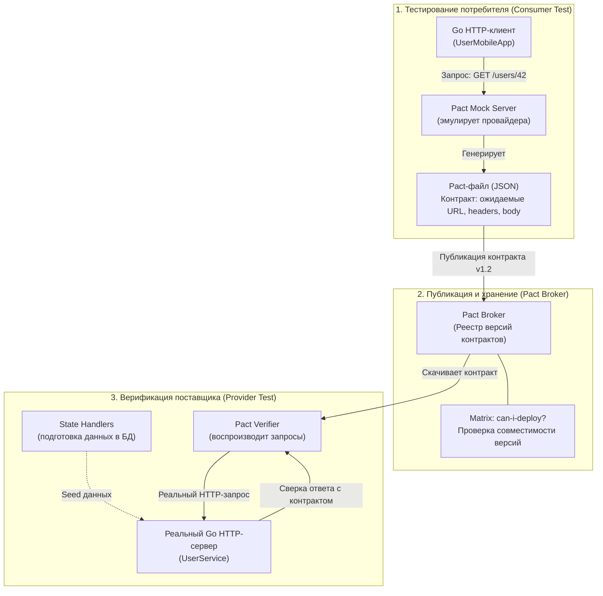
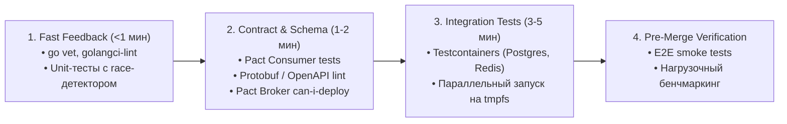

## Почему модульных тестов недостаточно

> *"Testing can show the presence of errors, but not their absence."*  
> — Эдсгер Дейкстра

В мире изолированных функций и чистых алгоритмов модульные тесты (unit tests) — это надежный фундамент пирамиды качества. Они исполняются за миллисекунды, проверяют граничные условия и гарантируют, что конкретный цикл или алгоритмическая ветка работают строго по спецификации.

Однако в реальной распределенной системе модульный тест с моками — это испытание авиационного двигателя, подвешенного на стенде в вакууме. Турбина крутится идеально, датчики показывают расчетные обороты, но этот тест ничего не говорит о том, выдержит ли крепление крыла набегающий поток воздуха при взлете или не оторвется ли хвостовое оперение от турбулентности. 

Когда монолит распадается на десятки микросервисов ([[9. Микросервисы. Преимущества, недостатки и мифы]]), подавляющее большинство критических сбоев происходит не внутри отдельных функций, а **в швах между системами**:
- Сервис-потребитель ожидает, что поле `user_id` имеет тип `string`, а поставщик в новом релизе вернул `int64`.
- Разработчик обновил сериализатор Protobuf или JSON, наивно полагая, что удаленное поле никто не читает ([[46. Версионирование сервисов и API]]).
- Репозиторий идеально проходит тесты на базе моков `sqlmock`, но в продакшене падает с `Deadlock` или нарушением внешнего ключа, потому что мок не эмулирует изоляцию транзакций `PostgreSQL`.
- Консьюмер Kafka не успевает подтвердить оффсет и уходит в бесконечный цикл `Rebalance`, о чем юнит-тесты даже не догадываются.

Для обеспечения бескомпромиссной надежности архитектуры Senior Go-инженер опирается на два ключевых инструмента: **контрактное тестирование (Contract Testing)** и **интеграционное тестирование (Integration Testing)**. Вместе с практиками миграций без простоя ([[47. Миграции архитектуры без downtime]]) они создают надежную защитную броню для распределенной системы.

---

### Контрактное тестирование

Попытка решить проблему интеграции сквозными End-to-End (E2E) тестами — типичная архитектурная ловушка. Чтобы запустить E2E-тест заказа товара, вам потребуется одновременно поднять сервис пользователей, сервис каталога, сервис корзины, биллинг, склад, Kafka, Redis и Postgres. Такие тестовые стенды невероятно дороги в поддержке, запускаются десятки минут, постоянно флакуют (flaky tests) из-за сетевых задержек и не способны точно указать, кто именно виновен в сбое.

**Контрактное тестирование** элегантно разрешает эту дилемму, разделяя проверку взаимодействия на две независимые половины.



**Контракт** — это формальное, машиночитаемое соглашение между Потребителем (Consumer) и Поставщиком (Provider) о формате, заголовках, статусах и семантике обмена сообщениями. Контрактное тестирование проверяет, что обе стороны строго соблюдают этот протокол, не требуя их одновременного присутствия в рантайме.

#### Pact: стандарт контрактного тестирования

Наиболее зрелым и признанным стандартом в индустрии является экосистема **Pact**. Методология Pact строится на концепции **Consumer-Driven Contracts (контракты, управляемые потребителем)**:

1. **Consumer (клиент):** Определяет, какие именно поля ему нужны. Если сервер возвращает JSON из 50 полей, но мобильному приложению нужны только `id` и `name`, в контракт попадают только эти два поля. Это предотвращает ложные тревоги: сервер может безопасно удалять неиспользуемые поля, зная, что ни один клиент от них не зависит.
2. **Pact-файл:** Результат выполнения тестов на стороне клиента — JSON-документ, содержащий перечень взаимодействий (interactions).
3. **Provider (сервер):** Считывает pact-файл и запускает серию реальных запросов к собственным обработчикам, проверяя, что возвращаемые структуры соответствуют ожиданиям клиента.

#### Контрактное тестирование в Go с Pact

Библиотека `pact-foundation/pact-go` предоставляет идиоматичный DSL для создания и проверки контрактов.

##### Шаг 1: Тест потребителя (Consumer)

Клиент формулирует свои ожидания и проверяет собственный код парсинга ответов с помощью встроенного мок-сервера:

```go
package client_test

import (
	"context"
	"fmt"
	"net/http"
	"testing"

	"github.com/pact-foundation/pact-go/dsl"
	"github.com/stretchr/testify/require"
)

func TestConsumer_GetUser(t *testing.T) {
	// 1. Инициализируем мок-сервер Pact
	pact := dsl.Pact{
		Consumer: "UserMobileApp",
		Provider: "UserService",
	}
	defer pact.Teardown()

	// 2. Декларируем ожидаемое взаимодействие (Interaction)
	pact.AddInteraction().
		Given("User 42 exists").
		UponReceiving("A request for user 42").
		WithRequest(dsl.Request{
			Method: "GET",
			Path:   dsl.String("/users/42"),
			Headers: dsl.MapMatcher{
				"Accept": dsl.String("application/json"),
			},
		}).
		WillRespondWith(dsl.Response{
			Status: http.StatusOK,
			Headers: dsl.MapMatcher{
				"Content-Type": dsl.String("application/json; charset=utf-8"),
			},
			Body: map[string]interface{}{
				"id":   dsl.String("42"),
				"name": dsl.String("Alice"),
			},
		})

	// 3. Запускаем тест нашего реального клиента против Pact Mock Server
	err := pact.Verify(func() error {
		client := NewUserClient(fmt.Sprintf("http://localhost:%d", pact.Server.Port))
		user, err := client.GetUser(context.Background(), "42")
		if err != nil {
			return fmt.Errorf("client failed to fetch user: %w", err)
		}

		if user.ID != "42" || user.Name != "Alice" {
			return fmt.Errorf("unexpected user payload: %+v", user)
		}
		return nil
	})
	require.NoError(t, err)

	// Тест автоматически сохраняет pact-файл в каталог ./pacts
}
```

##### Шаг 2: Тест поставщика (Provider)

На стороне провайдера мы берем сгенерированный JSON-контракт и натравливаем его на реальный обработчик Go-сервиса:

```go
package provider_test

import (
	"fmt"
	"net/http/httptest"
	"testing"

	"github.com/pact-foundation/pact-go/dsl"
	"github.com/stretchr/testify/require"
)

func TestProvider_UserService(t *testing.T) {
	// Поднимаем боевой HTTP-сервер провайдера на случайном порту
	router := SetupServerRoutes()
	ts := httptest.NewServer(router)
	defer ts.Close()

	pact := &dsl.Pact{
		Provider: "UserService",
	}

	// Запускаем верификацию контрактов
	_, err := pact.VerifyProvider(t, dsl.VerifyRequest{
		ProviderBaseURL: ts.URL,
		PactURLs:        []string{"./pacts/UserMobileApp-UserService.json"},
		// State handlers: подготавливаем состояние системы под предусловия контракта
		StateHandlers: dsl.StateHandlers{
			"User 42 exists": func() error {
				return seedUser("42", "Alice")
			},
		},
	})
	require.NoError(t, err)
}
```

Метод `pact.VerifyProvider` парсит pact-файл, последовательно вызывает нужный `StateHandlers` для наполнения базы тестовыми данными, отправляет настоящий HTTP-запрос в `httptest.NewServer` и сверяет статус, заголовки и схему тела ответа.

> [!info] Под капотом: Внутреннее устройство VerifyProvider
> Библиотека `pact-go` под капотом разворачивает нативное ядро Pact (написанное на Rust/Ruby) в качестве фонового процесса. При вызове `VerifyProvider` рантайм Go обращается к запущенному серверу `httptest.NewServer`. Это гарантирует, что запрос проходит через **весь реальный стек приложения**: middleware аутентификации, логирования, парсинг заголовков, демаршалинг JSON, валидацию и бизнес-логику. В отличие от юнит-тестов с моками интерфейсов, здесь проверяется физическая совместимость сетевого формата данных.

#### Контракты и версионирование

Контрактное тестирование закрывает главный пробел версионирования API ([[46. Версионирование сервисов и API]]).  
В реальных компаниях центральным звеном инфраструктуры становится **Pact Broker** — сервис-реестр контрактов.

1. При сборке ветки потребителя CI запускает тест и пушит сгенерированный контракт в Pact Broker, тегируя его хэшем коммита.
2. CI поставщика опрашивает брокер и проверяет, поддерживают ли текущие обработчики все активные контракты существующих клиентов.
3. Утилита `pact-broker can-i-deploy` встраивается в пайплайн развертывания:
   ```bash
   pact-broker can-i-deploy      --pacticipant UserService      --version $GIT_COMMIT      --to-environment production
   ```
   Если новая версия сервиса ломает хотя бы одного активного клиента в продакшене, релиз блокируется на уровне CI/CD до старта деплоя.

---

### Интеграционное тестирование

Контрактное тестирование гарантирует согласованность протоколов между сервисами. Но как проверить, что сам сервис корректно общается со своим постоянным хранилищем или очередью?

Многие разработчики годами живут с ложной уверенностью, заменяя базу данных интерфейсными моками (`mock_repo.go`) или in-memory СУБД вроде SQLite. В продакшене эта иллюзия разбивается о суровую реальность:
- SQLite не поддерживает транзакционные уровни изоляции `Repeatable Read` или `Serializable` так, как это делает PostgreSQL.
- Мок не знает, как работает синтаксис `ON CONFLICT DO UPDATE` или частичные индексы.
- Мок не вызовет панику при нарушении Foreign Key Constraint, если в моке это поведение не запрограммировано вручную.

**Интеграционное тестирование** обязано проверять работу адаптеров с **настоящими бинарниками СУБД и брокеров**, развернутыми в изолированном окружении.

#### Testcontainers: реальные зависимости в Go

Библиотека `testcontainers-go` произвела революцию в тестировании бэкенда. Она позволяет декларативно поднимать временные Docker-контейнеры с PostgreSQL, Redis, Kafka или ClickHouse прямо из кода Go-тестов, контролируя их жизненный цикл.

```go
package repository_test

import (
	"context"
	"database/sql"
	"testing"
	"time"

	_ "github.com/lib/pq"
	"github.com/stretchr/testify/require"
	"github.com/testcontainers/testcontainers-go"
	"github.com/testcontainers/testcontainers-go/modules/postgres"
	"github.com/testcontainers/testcontainers-go/wait"
)

func TestOrderRepository_Integration(t *testing.T) {
	ctx := context.Background()

	// 1. Декларативно поднимаем изолированный контейнер PostgreSQL 16
	pgContainer, err := postgres.RunContainer(ctx,
		testcontainers.WithImage("postgres:16-alpine"),
		postgres.WithDatabase("testdb"),
		postgres.WithUsername("test"),
		postgres.WithPassword("secret"),
		testcontainers.WithWaitStrategy(
			wait.ForLog("database system is ready to accept connections").
				WithOccurrence(2).
				WithStartupTimeout(10*time.Second),
		),
	)
	require.NoError(t, err)
	defer func() {
		// Обязательно уничтожаем контейнер после выполнения теста
		require.NoError(t, pgContainer.Terminate(ctx))
	}()

	// 2. Получаем динамический DSN с проброшенным портом хоста
	dsn, err := pgContainer.ConnectionString(ctx, "sslmode=disable")
	require.NoError(t, err)

	db, err := sql.Open("postgres", dsn)
	require.NoError(t, err)
	defer db.Close()

	// 3. Накатываем актуальные DDL-миграции
	migrateDB(t, db)

	// 4. Выполняем боевой сценарий репозитория
	repo := NewOrderRepository(db)
	order := &Order{
		ID:        "order-999",
		UserID:    "user-42",
		Amount:    1500,
		Status:    "new",
		CreatedAt: time.Now().UTC().Truncate(time.Millisecond),
	}

	// Проверяем операцию создания
	err = repo.Save(ctx, order)
	require.NoError(t, err)

	// Проверяем реальное чтение из PostgreSQL
	loaded, err := repo.GetByID(ctx, "order-999")
	require.NoError(t, err)
	require.Equal(t, order.ID, loaded.ID)
	require.Equal(t, order.Status, loaded.Status)
	require.Equal(t, order.Amount, loaded.Amount)
}
```

> [!warning] Ловушка / Gotcha: Время выполнения и оверхед контейнеров
> Интеграционные тесты с `testcontainers-go` по своей природе медленнее легковесных юнит-тестов. Подъем контейнера Docker, инициализация базы данных PostgreSQL и накат миграций занимают от 2 до 8 секунд. Если запускать новый контейнер на каждый тест-кейс из 500 тестов, билд CI растянется на 40 минут.  
> 
> **Как оптимизировать:**
> 1. **Переиспользование контейнеров:** Флаг `testcontainers.Reuse()` позволяет использовать один и тот же запущенный контейнер между разными тестовыми пакетами.
> 2. **Транзакционный откат:** Оберните тело каждого теста в транзакцию `tx, _ := db.Begin()`, а в `defer tx.Rollback()` откатывайте изменения. Это сохранит базу чистой без перезапуска контейнера.
> 3. **RAM-диск (tmpfs):** Монтируйте директорию данных СУБД (`/var/lib/postgresql/data`) в виртуальную память через `tmpfs`. Отсутствие физических обращений к диску ускоряет работу PostgreSQL в контейнере в 5–10 раз.

#### Интеграционные тесты для брокеров сообщений

При тестировании очередей и шин событий (Kafka, RabbitMQ) важно проверять не только парсинг сообщений, но и семантику подтверждений (ACK/NACK), партиционирование и обработку паник консьюмера.

Библиотека `testcontainers-go/kafka` поднимает полноценный кластер Kafka (или легковесный Redpanda / Kafka KRaft) за считанные секунды:

```go
func TestKafkaProducerConsumer_Integration(t *testing.T) {
	ctx := context.Background()
	kafkaContainer, err := kafka.RunContainer(ctx,
		testcontainers.WithImage("confluentinc/cp-kafka:7.5.0"),
	)
	require.NoError(t, err)
	defer kafkaContainer.Terminate(ctx)

	brokers, err := kafkaContainer.Brokers(ctx)
	require.NoError(t, err)

	// Инициализируем продюсер и консьюмер с реальным брокером...
}
```

Если же требуется изолированно протестировать исключительно логику декодирования и сериализации протоколов, используются in-memory эмуляторы вроде `sarama/mocks` или драйвер `franz-go` со встроенным мок-брокером:

```go
func TestOrderCreatedEvent(t *testing.T) {
	// Проверяем, что структура событий Protobuf строго соблюдает бинарную совместимость
	event := &OrderCreated{
		OrderID: "123",
		Total:   4500,
	}
	
	data, err := proto.Marshal(event)
	require.NoError(t, err)

	var decoded OrderCreated
	err = proto.Unmarshal(data, &decoded)
	require.NoError(t, err)
	require.Equal(t, event.OrderID, decoded.OrderID)
	require.Equal(t, event.Total, decoded.Total)
}
```

---

### Mechanical Sympathy: цена тестов в CI/CD

Инженерное искусство требует осознания физической цены вычислений. Запуск интеграционных тестов в облачном CI (GitHub Actions, GitLab CI) стоит денег и времени разработчиков.

Таблица сравнительного анализа уровней тестирования:

| Тип теста | Исполнитель | Скорость | Зависимости | Что проверяет |
|---|---|---|---|---|
| **Unit Test** | `go test ./...` | < 1 мс | Нет (моки в памяти) | Логику отдельных чистых функций и веток алгоритмов |
| **Contract Test (Consumer)** | `pact-go` | 50–200 мс | Локальный mock-сервер | Формат исходящих запросов и корректность парсинга ответов |
| **Contract Test (Provider)** | `pact-go` | 200–500 мс | Локальный `httptest.NewServer` | Соответствие реальных ответов API ожиданиям клиентов |
| **Integration Test (DB)** | `testcontainers-go` | 2–5 с | Docker Engine, PostgreSQL | Корректность SQL-запросов, транзакций, блокировок, индексов |
| **End-to-End (E2E)** | Cypress / K6 | 1–10 мин | Вся инфраструктура (Kubernetes) | Сквозные бизнес-сценарии пользователей |

#### Оптимальная архитектура CI-пайплайна

Чтобы разработчики не ждали результатов часами, организуйте пайплайн по принципу «быстрого отказа» (Fail Fast):



1. **Stage 1 (секунды):** Линтинг (`golangci-lint`) и чистые юнит-тесты с флагом `-race`. Если упал юнит-тест, пайплайн прерывается немедленно.
2. **Stage 2 (1–2 минуты):** Контрактные тесты клиента и поставщика. Проверка версионной совместимости через `pact-broker can-i-deploy`.
3. **Stage 3 (3–5 минут):** Интеграционные тесты репозиториев и адаптеров с переиспользуемыми контейнерами `testcontainers.Reuse()`.
4. **Stage 4 (на этапе мёржд-реквеста):** Полномасштабные сквозные тесты критических путей.

---

### Тестирование архитектурных границ

Контрактные и интеграционные тесты служат главным механизмом защиты архитектурных стилей, которые мы изучали ранее:

- **Hexagonal Architecture (Порты и Адаптеры)** ([[13. Hexagonal Architecture. Ports and Adapters]]):  
  Тесты поставщика в Pact проверяют, что HTTP-адаптер точно соответствует спецификации порта. Интеграционные тесты с Testcontainers проверяют вторичные (driven) адаптеры базы данных. Бизнес-логика (ядро домена) остается на 100% покрыта сверхбыстрыми юнит-тестами без единого внешнего импорта.
- **Clean Architecture** ([[14. Clean Architecture и Dependency Rule]]):  
  Тестирование use case осуществляется через чистые интерфейсы, а интеграционные тесты гарантируют, что внешние слои данных строго соблюдают контракты внутренних сущностей.
- **Event-Driven Architecture** ([[21. Event Driven Architecture]]):  
  Схемы событий (Protobuf, Avro) выступают нерушимым контрактом. Тесты сериализации гарантируют обратную совместимость сообщений в брокере.
- **CQRS** ([[23. CQRS. Разделение чтения и записи]]):  
  Модель записи (Command) тестируется на целостность транзакций через Testcontainers, а модель чтения (Query) верифицируется контрактными тестами на соответствие проекций ожиданиям UI.

---

### Антипаттерны и архитектурные ошибки

1. **E2E-тесты как замена контрактным:**  
   Попытка тестировать стыковку 20 микросервисов исключительно через запуск Selenium/Playwright в общем тестовом контуре. В результате 80% падений вызваны нестабильностью тестового стенда, а время прогона исчисляется часами.
2. **Использование продакшен-дампов в тестах:**  
   Импорт сотен гигабайт реальной базы данных для прогона локальных тестов. Это приводит к утечкам персональных данных (PII), огромному оверхеду по диску и невоспроизводимым тестам. Интеграционные тесты должны работать строго на синтетических, минимально необходимых фикстурах (`seed data`).
3. **Игнорирование контрактных тестов для внутренних сервисов:**  
   Заблуждение: *«Сервис А и Сервис Б пишутся одной командой, мы просто договоримся в чате»*. Через месяц разработчик сервиса А меняет имя поля, и сервис Б падает на проде в пятницу вечером. Внутренние API требуют такой же строгой контрактной дисциплины, как и публичные.
4. **Бесконечный спавн контейнеров в цикле:**  
   Запуск `postgres.RunContainer` внутри каждого подтеста `t.Run()`. Docker демону не хватает файловых дескрипторов и портов, а машина разработчика зависает от нехватки оперативной памяти.

---

> [!tip] Собеседование: Контракты против Интеграции
> **Вопрос:** В чем принципиальная разница между контрактным и интеграционным тестированием? Как бы вы организовали пирамиду тестирования для платформы из 40 Go-микросервисов?  
> **Ответ:**  
> - **Интеграционное тестирование** проверяет совместную работу компонентов с их реальной физической средой (Go-сервис + реальный PostgreSQL/Kafka). Оно валидирует правильность SQL-запросов, транзакции, индексы и низкоуровневые сетевые драйверы.
> - **Контрактное тестирование** проверяет логическую совместимость протоколов обмена между независимыми сервисами (Consumer и Provider) без одновременного запуска обоих сервисов.
> 
> **В системе из 40 микросервисов:**
> 1. Всю сложную бизнес-логику домена мы покрываем быстрыми юнит-тестами (80% объема тестов).
> 2. Взаимодействие каждого сервиса со своей локальной СУБД тестируем через `testcontainers-go`, используя переиспользуемые контейнеры и транзакции.
> 3. Межсервисные вызовы (HTTP/gRPC) покрываем Consumer-Driven контрактами через **Pact** и проверяем матрицу совместимости на этапе CI с помощью `pact-broker can-i-deploy`.
> 4. E2E-тесты сводим к минимуму (3–5 критических бизнес-путей: авторизация, оформление заказа, оплата) для финального смоук-тестирования релизного кандидата.

---

### Итог

Тестирование архитектуры — это искусство нахождения баланса между скоростью обратной связи и уверенностью в стабильности продакшена.  
- Юнит-тесты проверяют правильность алгоритмов в изоляции.  
- Контрактные тесты фиксируют нерушимость межсервисных протоколов и позволяют безопасно обновлять микросервисы независимо друг от друга.  
- Интеграционные тесты с Testcontainers гарантируют механическое соответствие кода реальным базам данных и очередям.

Однако даже безупречно протестированная система в продакшене столкнется с падением серверов, разрывами оптических кабелей и зависанием дисков. В следующей лекции мы разберем методологию проверки отказоустойчивости в боевых условиях: [[49. Chaos Engineering]].
