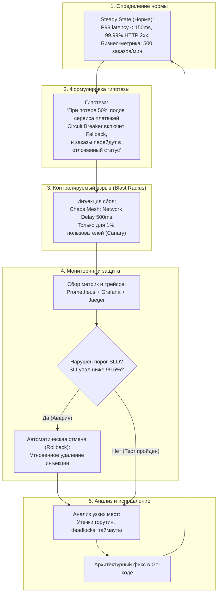
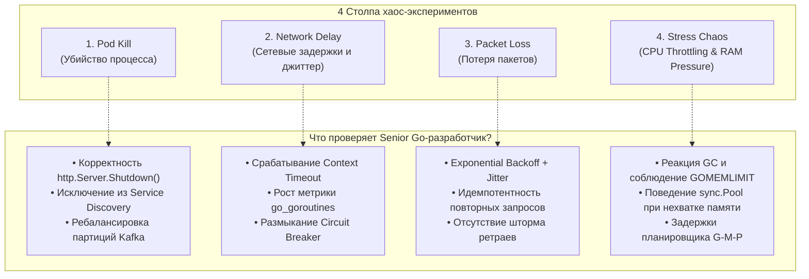

## Почему тестов недостаточно

> *«Сбои происходят постоянно, отказывает абсолютно всё».*    
> — Вернер Фогельс, CTO Amazon

Модульные тесты проверяют корректность алгоритмических функций в изоляции. Интеграционные тесты с Testcontainers подтверждают совместимость с реальной базой данных в стерильной лабораторной колбе. Контрактные тесты фиксируют схему обмена сообщениями.

Но ни один из этих уровней тестирования не способен ответить на главный вопрос надежности: **выдержит ли распределенная архитектура физический хаос реального продакшена?**

В боевой среде законы физики беспощадны:
- Оптический кабель под Франкфуртом повреждается экскаватором, порождая задержку в 350 миллисекунд и 12% потери сетевых пакетов.
- Один из пятидесяти серверов в Kubernetes внезапно испытывает `Kernel Panic` или жесткую деградацию контроллера NVMe-диска, зависая на операциях записи.
- Провайдер авторизации начинает отвечать кодами `HTTP 504 Gateway Timeout`.
- Всплеск трафика в «Черную пятницу» вызывает перегрузку ЦПУ, заставляя планировщик Linux беспощадно троттлить контейнеры по квотам cgroups (`cpu.cfs_quota_us`).

В таких условиях классические ошибки разработчиков — отсутствие таймаутов, наивные ретраи без джиттера, надежда на «вечную жизнь» узлов — вызывают цепную реакцию и приводят к полному краху инфраструктуры (Cascading Failure).

**Chaos Engineering (Инженерия хаоса)** — это систематическая инженерная дисциплина проведения контролируемых экспериментов над системой для проверки её способности сохранять устойчивое состояние (Steady State) в условиях внезапных отказов. Это не бессистемное разрушение продакшена, а эмпирическая вакцинация: мы намеренно вводим ослабленный вирус сбоя в контролируемую часть системы, чтобы обнаружить слабые места до того, как они приведут к катастрофе.

Для Senior Go-архитектора инженерия хаоса служит окончательным полигоном для валидации защитных паттернов: таймаутов и автоматических выключателей ([[36. Circuit Breaker, Retry, Timeout и Backoff]]), переборок отсеков ([[37. Bulkhead и изоляция отказов]]), ограничителей нагрузки ([[38. Rate Limiting и защита системы]]) и протоколов плавной остановки ([[47. Миграции архитектуры без downtime]]).

---

### Принципы Chaos Engineering

Научный метод лежит в основе любого хаос-эксперимента. Практика Netflix и ведущих технологических компаний сформировала четыре базовых принципа:



1. **Формулируйте проверяемую гипотезу:**  
   Эксперимент никогда не начинается со слов: *«Давайте прибьем сервер и посмотрим на салют»*. Гипотеза всегда связывает воздействие и ожидаемый отклик системы: *«Если сеть между Gateway и сервисом корзины замедлится на 1 секунду, Gateway сбросит соединения по таймауту 300 мс, а число активных горутин на поде не превысит 2 000»*.
2. **Минимизируйте взрывной радиус (Blast Radius):**  
   Любое тестирование отказов несет риск. Начинайте эксперимент с одного экземпляра пода в dev- или staging-контуре. Затем переходите в canary-окружение с 1% реального трафика. Только подтвердив устойчивость на малом масштабе, можно расширять эксперимент до целой зоны доступности (Availability Zone).
3. **Автоматизируйте аварийную остановку (Kill Switch):**  
   Если в ходе эксперимента реальные пользователи начинают получать ошибки выше заданного лимита SLO ([[4. SLA, SLO, SLI и как они влияют на дизайн]]), инъекция сбоя обязана прекратиться мгновенно в автоматическом режиме без участия человека.
4. **Проводите эксперименты в продакшене:**  
   Стейджинг никогда не отражает боевые реалии. В нем нет реальных объемов данных в кэшах, нет распределенного трафика тысяч мобильных операторов, нет накопленной фрагментации памяти и фоновой активности сборщика мусора. Подлинная устойчивость проверяется только под живым трафиком.

---

### Инструменты для Go-инфраструктуры

В экосистеме облачных микросервисов и Kubernetes де-факто сформировались мощные платформы для оркестрации отказов:

- **Chaos Mesh:** Лидирующий Cloud Native проект (CNCF), разработанный создателями TiDB. Реализует инъекции через CRD (Custom Resource Definitions) и низкоуровневые механизмы Linux ядра (eBPF, tc, iptables, cgroups). Позволяет эмулировать сетевые потери, задержки, сбои файловой системы (I/O chaos), троттлинг ЦПУ и падение подов.
- **LitmusChaos:** Еще один популярный CNCF-фреймворк с упором на GitOps-пайплайны и библиотеку готовых хаос-сценариев.
- **Gremlin:** Зрелая коммерческая enterprise-платформа с удобными дэшбордами и встроенными защитными механизмами экстренной остановки.

Пример декларативного манифеста `Chaos Mesh` для внедрения задержки сети 200 мс с джиттером в 50 мс для подов сервиса заказов:

```yaml
apiVersion: chaos-mesh.org/v1alpha1
kind: NetworkChaos
metadata:
  name: order-service-network-delay
  namespace: production
spec:
  action: delay
  mode: one                 # Затрагивает ровно один случайный под
  selector:
    namespaces:
      - production
    labels:
      app: order-service
  delay:
    latency: "200ms"        # Базовая сетевая задержка
    jitter: "50ms"          # Случайные колебания от 150 до 250 мс
    correlation: "50"       # Корреляция с предыдущим пакетом
  duration: "5m"            # Время действия эксперимента (автоостановка)
```

Под капотом Chaos Mesh подключается к сетевому пространству имен контейнера (`network namespace`) и конфигурирует планировщик сетевого трафика Linux ядра (`tc` — traffic control) с помощью алгоритма `netem` (network emulator). Для Go-приложения это выглядит как абсолютно реальная физическая деградация сети на интерфейсе `eth0`.

---

### Ручные эксперименты на уровне Go-кода

Не каждая команда может сразу развернуть операторы хаоса в Kubernetes. Зачастую наиболее точечные и эффективные эксперименты проводятся прямо на уровне Go-кода сервиса.

#### Искусственная задержка через Middleware

Внедрение задержки через HTTP-заголовки позволяет эмулировать сбои изолированно для конкретного запроса (например, от тестового раннера), не затрагивая обычных пользователей:

```go
package middleware

import (
	"net/http"
	"os"
	"time"
)

// ChaosMiddleware внедряет управляемую деградацию по запросу клиента
func ChaosMiddleware(next http.Handler) http.Handler {
	// Включаем middleware только в dev/staging или при наличии флага
	chaosEnabled := os.Getenv("ENABLE_CHAOS_MIDDLEWARE") == "true"

	return http.HandlerFunc(func(w http.ResponseWriter, r *http.Request) {
		if chaosEnabled {
			// 1. Проверяем заголовок искусственной задержки
			if delayHeader := r.Header.Get("X-Chaos-Delay"); delayHeader != "" {
				if d, err := time.ParseDuration(delayHeader); err == nil {
					// Имитируем медленный downstream сервис
					time.Sleep(d)
				}
			}
		}
		next.ServeHTTP(w, r)
	})
}
```

#### Искусственная ошибка (Chaos Monkey внутри сервиса)

Случайные сбои позволяют верифицировать логику ретраев и Circuit Breaker на стороне вызывающих клиентов:

```go
package chaos

import (
	"math/rand/v2"
	"net/http"
	"os"
	"strconv"
)

func InjectFailure(w http.ResponseWriter) bool {
	rateStr := os.Getenv("CHAOS_ERROR_RATE") // Например, "0.1" (10% ошибок)
	if rateStr == "" {
		return false
	}

	rate, err := strconv.ParseFloat(rateStr, 64)
	if err != nil || rate <= 0.0 {
		return false
	}

	// Go 1.22+ math/rand/v2 для быстрого и безопасного генератора
	if rand.Float64() < rate {
		http.Error(w, "chaos monkey: synthetic upstream outage", http.StatusInternalServerError)
		return true
	}

	return false
}
```

---

### Типичные эксперименты

Инженерная практика выделила четыре классических сценария хаос-тестирования для Go-микросервисов.



#### Убийство пода (Pod Kill)

Самый частый сценарий в реальной облачной среде: спотовый сервер (AWS Spot / GCP Preemptible) выключается за 30 секунд, или Kubernetes переносит под на другой рабочий узел.

**Что проверяем в Go:**
- **Graceful Shutdown (`http.Server.Shutdown()`):** Успевает ли сервис обработать активные HTTP/gRPC запросы до завершения процесса?
- **Service Discovery ([[34. Service Discovery. Client side и Server side]]):** Успевает ли балансировщик ([[33. Load Balancing на уровне архитектуры]]) убрать IP-адрес умершего пода из списка доступных до того, как клиенты получат ошибку `connection refused`?
- **Брокеры сообщений (Kafka / RabbitMQ):** Корректно ли консьюмер коммитит оффсеты и освобождает партиции при получении сигнала `SIGTERM`, предотвращая дубликаты сообщений?

#### Сетевые задержки (Network Delay)

Вместо привычных 2 мс ответ от внешнего сервиса начинает идти 800 мс или 2 секунды.

**Что проверяем в Go:**
- Установлены ли жесткие таймауты на вызовах (`context.WithTimeout`)?
- Не начинают ли вызывающие клиенты накапливать горутины, исчерпывая лимиты оперативной памяти?
- Размыкает ли Circuit Breaker цепь ([[36. Circuit Breaker, Retry, Timeout и Backoff]]), предотвращая блокировку пула входящих соединений?

> [!info] Под капотом: Поведение планировщика Go при сетевых задержках
> Когда горутина совершает сетевой I/O запрос, системный вызов `read()` или `write()` переводит сокет в неблокирующий режим. Рантайм Go регистрирует дескриптор в сетевом селекторе (`netpoller` на базе `epoll` в Linux) и переводит саму горутину в состояние `_Gwaiting`. Поток операционной системы (M) при этом освобождается и берет на исполнение другую горутину.  
> 
> Однако горутина в ожидании продолжает удерживать свой стек (от 2 КБ до нескольких мегабайт) и все объекты в куче, на которые ссылаются её локальные переменные! Если на сервис поступает 5 000 RPS, а задержка downstream выросла с 10 мс до 1 секунды, в памяти одновременно повиснут 5 000 горутин. Это приведет к мгновенному скачку потребления памяти на десятки и сотни мегабайт, что легко отследить через утилиту `pprof` и встроенную метрику Prometheus `go_goroutines`.

#### Потеря пакетов (Packet Loss)

Эмуляция от 5% до 20% потери пакетов между микросервисами или дата-центрами.

**Что проверяем в Go:**
- Срабатывает ли механизм Exponential Backoff с обязательным случайным джиттером (Full Jitter), чтобы не вызвать лавинообразный резонанс ретраев.
- Соблюдается ли строгая идемпотентность ([[27. Idempotency и exactly once семантика]]), если запрос дошел до сервера, выполнил операцию списания денег, но подтверждающий ответ потерялся в сети.
- Не исчерпываются ли доступные эфемерные порты в ОС (`TIME_WAIT`) из-за лавины повторных TCP-соединений.

#### Нагрузка на CPU и память (Stress Chaos)

Эмуляция жесткого ограничения процессора (например, выделение контейнеру только 20% одного ядра) или искусственной аллокации сотен мегабайт в куче.

**Что проверяем в Go:**
- Как ведет себя сборщик мусора Go под давлением памяти: соблюдается ли мягкий лимит памяти `GOMEMLIMIT` ([[24. Garbage Collection в Go]]), или контейнер выбивается демоном Linux `OOM Killer`?
- Не вымываются ли критические данные из кэша переиспользования `sync.Pool`, который очищается сборщиком мусора при каждом цикле GC.
- Как планировщик Go (G-M-P) справляется с задержками: не начинают ли HTTP-хэндлеры зависать на очереди выполнения (`runqueue latency`)?

---

### Mechanical Sympathy: Chaos Engineering и Go-рантайм

Инженерия хаоса обнажает скрытые механизмы рантайма Go, которые невозможно выявить в обычных синтетических тестах:

1. **Паузы сборщика мусора (GC Pauses):**  
   В нормальном режиме паузы GC в Go составляют доли миллисекунды. Но когда в условиях хаос-теста тысячи зависших горутин удерживают миллионы указателей в графе объектов кучи, фаза разметки (Mark Phase) начинает отнимать до 25% процессорного времени (GC Pacer). Хаос-тест моментально покажет деградацию P99 latency из-за конкурентной работы GC.
2. **Утечка горутин (Goroutine Leaks):**  
   Классическая ошибка: запуск горутины для чтения из небуферизованного канала без `select` с `ctx.Done()`. Если удаленный сервер не ответил, горутина зависает в памяти навечно. Мониторинг метрики `go_goroutines` во время 30-минутного хаос-теста демонстрирует характерный пилообразный или монотонно растущий график, сигнализирующий об утечке.
3. **Исчерпание файловых дескрипторов:**  
   По умолчанию лимит открытых файлов в Linux равен 1024 (`ulimit -n`). При падении сервиса клиенты с агрессивными ретраями без переиспользования соединений (`DisableKeepAlives: true`) создают сотни новых сокетов в секунду. Хаос-тест быстро выявляет падение приложения с ошибкой `socket: too many open files`.

---

### Интеграция в культуру и CI/CD

Инженерия хаоса приносит максимальную пользу, когда становится регулярным ритуалом, а не разовым стрессом:

- **Game Days (Дни хаоса):**  
   Команда инженеров собирается раз в квартал. Дежурный архитектор скрытно активирует хаос-сценарий (например, «отказ главного инстанса PostgreSQL»), а команда наблюдает за мониторингом, проверяет корректность переключения на реплику (Failover), отрабатывает действия дежурных и находит слабые места в документации и архитектуре.
- **Chaos в CI/CD (Continuous Verification):**  
   В стейджинг-окружении после прохождения интеграционных тестов автоматически запускается короткий хаос-тест (Chaos Mesh). Если P99 latency сервиса превышает допустимый порог или сервис генерирует ошибки HTTP 5xx, деплой нового релиза в продакшен автоматически блокируется.

---

### Связь с другими архитектурными концепциями

Chaos Engineering является лакмусовой бумажкой для всей экосистемы архитектурных паттернов:

- **Circuit Breaker, Retry, Timeout** ([[36. Circuit Breaker, Retry, Timeout и Backoff]]): Главный рубеж обороны. Хаос-эксперимент прямо проверяет их конфигурацию.
- **Bulkhead** ([[37. Bulkhead и изоляция отказов]]): Сбой одного изолированного пула горутин не должен вызывать истощение ресурсов соседних критических функций.
- **Rate Limiting** ([[38. Rate Limiting и защита системы]]): Защищает downstream-сервисы от шторма повторных запросов, возникающего при сетевых сбоях.
- **Observability** ([[39. Observability в архитектуре. Metrics, Logs, Traces]]): Без сквозных трейсов и метрик хаос бесполезен: вы не сможете понять, какая именно цепочка вызовов привела к отказу.
- **SLA/SLO** ([[4. SLA, SLO, SLI и как они влияют на дизайн]]): Бюджет ошибок (Error Budget) определяет, сколько хаос-экспериментов мы имеем право провести в продакшене без риска для бизнес-соглашений.

---

### Антипаттерны и ошибки

1. **Хаос без Observability:**  
   Запуск экспериментов вслепую. Если вы не собираете метрики `go_goroutines`, задержки запросов и распределенные трейсы, вы просто ломаете систему, не получая никаких инженерных данных.
2. **Чрезмерный взрывной радиус на старте:**  
   Попытка первого же эксперимента через выключение целого дата-центра или главного кластера БД. Это приводит к реальным многомиллионным убыткам и дискредитации методологии в глазах бизнеса.
3. **Эксперименты без автоматического аварийного выключателя:**  
   Если эксперимент пошел не по плану, а дежурный инженер судорожно ищет команду для остановки в консоли, пользователи успеют разочароваться в сервисе. Скрипт эксперимента обязан автоматически прерываться при первом нарушении SLI.
4. **Проведение учений без оповещения команды:**  
   Внезапные ночные отключения серверов без предупреждения дежурной смены приводят лишь к выгоранию людей. Инженерия хаоса нацелена на обучение и улучшение системы, а не на проверку стрессоустойчивости дежурных инженеров.

---

> [!tip] Собеседование: Внедрение Chaos Engineering с нуля
> **Вопрос:** Как вы обоснуете бизнесу необходимость Chaos Engineering и как пошагово внедрите его в продакшен-кластер Go-микросервисов?  
> **Ответ:**  
> 1. **Обоснование:** Сбои неизбежны. Вопрос не в том, упадет ли сервис, а в том, произойдет ли это днем под контролем инженеров или в 3 часа ночи во время пиковых продаж с катастрофическим простоем. Хаос-тестирование — это управляемая инвестиция в непрерывность бизнеса.
> 2. **Шаг 1 (Фундамент):** Убеждаемся, что внедрен сквозной мониторинг: P99 latency, rate ошибок, метрики рантайма Go (`go_goroutines`, `go_gc_duration_seconds`) и распределенный трейсинг (OpenTelemetry).
> 3. **Шаг 2 (Стейджинг и Game Day):** Разворачиваем Chaos Mesh в тестовом контуре. Формулируем первую простую гипотезу: «Убийство одного пода сервиса авторизации не приводит к ошибкам на Gateway». Проводим первый командный Game Day.
> 4. **Шаг 3 (Продакшен с минимальным радиусом):** Переносим эксперимент в продакшен, ограничив радиус действия канареечным подом (1% трафика) и настроив автоматический Kill Switch по триггеру алерта в Prometheus.
> 5. **Шаг 4 (Культура):** Анализируем результаты, устраняем найденные дефекты (добавляем таймауты, настраиваем Circuit Breaker) и включаем регулярные проверки в пайплайн непрерывной поставки.

---

### Итог

Инженерия хаоса переводит обеспечение надежности из области теоретических предположений в точную экспериментальную науку.  
- Она проверяет не изолированные строки кода, а живое взаимодействие десятков распределенных узлов в условиях агрессивной физической реальности.  
- Она дисциплинирует разработчиков, заставляя всегда указывать контекстные таймауты, проектировать идемпотентные обработчики и учитывать механику сборщика мусора и планировщика Go.

Устойчивая архитектура готова к любым сетевым бурям. Но в реальном бизнесе надежность всегда сбалансирована с экономикой. В следующей лекции мы детально разберем, как проектировать высоконагруженные системы с учетом финансовой эффективности: [[50. Cost optimization в архитектуре]].
