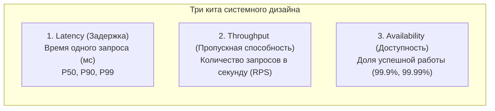
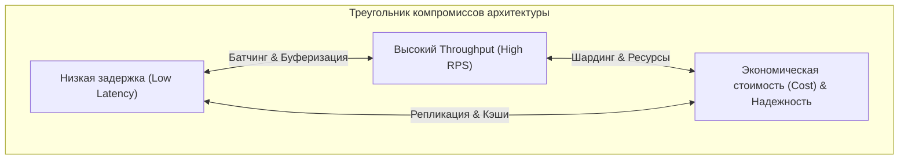

# Фундаментальные компромиссы: Latency, Throughput и Availability

> *"In computing, there are no solutions, only trade-offs. You cannot have maximum speed, infinite capacity, and absolute reliability on a finite budget."*  
> — Свободная интерпретация классического принципа Bell Labs

В предыдущих главах мы научились формализовать нефункциональные требования и измерять надежность сервисов через метрики SLI и целевые уровни SLO. Теперь мы переходим к изучению трех фундаментальных координат, вокруг которых разворачивается любой архитектурный спор и System Design: **Latency (Задержка)**, **Throughput (Пропускная способность)** и **Availability (Доступность)**.

Для бэкенд-разработчика на Go понимание этих метрик и законов их взаимодействия — это не просто абстрактная математика из университетских учебников. Они определяют, сколько ядер процессора выделить поду в Kubernetes, какой размер буфера задать каналу, как сконфигурировать пул соединений к PostgreSQL и в какой момент горутина должна уступить управление планировщику.

---

### Определения в контексте Go-бэкенда



#### Latency (Задержка)

**Latency** — время, необходимое для сквозной обработки одного запроса от момента его поступления в сокет до момента отправки финального байта ответа. Измеряется в миллисекундах и микросекундах.

В высоконагруженном HTTP-сервере на Go задержка складывается из цепочки физических фаз:
1. Вычитывание входящих байтов из сетевого сокета (системный вызов `read()`).
2. Декодирование полезной нагрузки из формата JSON или Protobuf в структуры Go.
3. Выполнение бизнес-логики в памяти процесса.
4. Синхронные обращения к внешним зависимостям (сетевые RPC, запросы к базе данных).
5. Сериализация ответа и запись в сокет (системный вызов `write()`).
6. Невидимое время ожидания в системных очередях: ожидание освобождения мьютекса, простой горутины в локальной очереди планировщика рантайма или ожидание соединения в пуле базы данных.

> [!info] Под капотом: Из чего складываются наносекунды
> С точки зрения кремния и ядра Linux, latency — это сумма:
> - Тактов CPU, затраченных на выполнение машинных инструкций вашего алгоритма.
> - Времени простоя конвейера при промахах мимо процессорных кэшей L1/L2/L3 (cache misses).
> - Переключений контекста между пространством пользователя и ядром ОС (Ring 3 ↔ Ring 0).
> - Сетевых задержек физического распространения сигнала (RTT между сервисами и дата-центрами).
> - Ожидания в очередях синхронизации (Mutex Contention, каналы, свободные дескрипторы сокетов).

#### Throughput (Пропускная способность)

**Throughput** — суммарный объем полезной работы, которую система способна выполнить за единицу времени. Традиционно выражается в **RPS** (Requests Per Second) или транзакциях в секунду (TPS).

Пропускная способность определяется:
- Степенью параллелизма системы (числом одновременно обслуживаемых запросов).
- Средним временем обработки одного запроса (Latency).
- Физическими лимитами аппаратуры: тактовой частотой CPU, пропускной способностью шины RAM, сетевыми адаптерами и емкостью пулов БД.

Для сервисов на Go модель **Goroutine-per-Connection** обеспечивает феноменальную пропускную способность: легковесные горутины позволяют одновременно держать открытыми сотни тысяч сетевых сокетов на скромном сервере, не создавая тяжелых потоков ядра ОС.

#### Availability (Доступность)

**Availability** — вероятность того, что система в любой произвольный момент времени работоспособна и способна корректно обслужить входящий запрос. Измеряется в процентах доступности («девятках»): 99.9%, 99.99%.

В распределенной архитектуре доступность Go-сервиса зависит от:
- Внутренней стабильности кода (отсутствие необработанных паник, утечек памяти и зависших горутин).
- Живучести внешних зависимостей (баз данных, кэшей, брокеров сообщений).
- Инфраструктурной топологии (балансировщики нагрузки, зоны доступности, оркестрация).

> [!tip] Собеседование: Latency vs Response Time
> **Вопрос:** В чём принципиальная разница между терминами Latency и Response Time?  
> **Ответ:** **Latency (Задержка сервиса)** — это чистое время нахождения запроса внутри вашей системы (от сокета сервиса до формирования ответа). **Response Time (Время отклика)** — это полное время с точки зрения конечного пользователя в браузере или мобильном приложении, которое включает сетевой раундтрип через публичный интернет (Network RTT), задержки на CDN, DNS-резолвинг и время рендеринга в UI.

---

### Закон Литтла и его применение

Фундаментальная взаимосвязь между конкурентностью, пропускной способностью и временем обработки строго описывается классической теоремой теории массового обслуживания — **Законом Литтла (Little's Law)**:

$$L = \lambda \times W$$

Где:
- **$L$** — среднее количество запросов, одновременно находящихся в системе (Concurrency / In-flight requests).
- **$\lambda$** — средняя интенсивность поступления входящих запросов (Throughput в RPS).
- **$W$** — среднее время пребывания запроса в системе (Latency в секундах).


**Практический расчет:**  
Если ваш Go-сервис обрабатывает один запрос в среднем за 100 миллисекунд ($W = 0.1$ сек), а бизнес требует поддерживать пропускную способность в 1000 RPS ($\lambda = 1000$), то в любой случайный момент времени внутри вашего процесса должно одновременно находиться:

$$L = 1000 \times 0.1 = \mathbf{100 \text{ параллельных запросов}}$$
(то есть `L = 1000 * 0.1 = 100`)

Это означает, что внутренние пулы горутин, открытые сокеты к базе данных и буферы должны быть рассчитаны минимум на 100 одновременных операций.

**Следствие для пулов воркеров (Worker Pools):**  
Если у вас запущен пул из 50 воркеров-горутин, и каждая задача требует 200 мс ($W = 0.2$ с), то максимальный Throughput, который система способна переварить без роста очереди, равен:

$$\lambda = \frac{L}{W} = \frac{50}{0.2} = \mathbf{250 \text{ RPS}}$$
(согласно расчету: `λ = L / W = 50 / 0.2 = 250 RPS`)

Как только входящий поток превысит 250 RPS, очередь начнет стремительно расти, задачи начнут ожидать начала выполнения, и совокупная задержка (Latency) начнет лавинообразно увеличиваться за счет времени ожидания в очереди.

```go
package pool

type Job struct {
	ID   string
	Data []byte
}

type Result struct {
	ID  string
	Err error
}

// Worker pool с фиксированным количеством горутин-воркеров
func WorkerPool(numWorkers int, jobs <-chan Job, results chan<- Result) {
	for i := 0; i < numWorkers; i++ {
		go func() {
			for j := range jobs {
				// Выполнение работы
				results <- Result{ID: j.ID, Err: nil}
			}
		}()
	}
}
```

---

### Фундаментальные Trade-offs

В реальных системах улучшение одной характеристики практически всегда оплачивается деградацией другой. Архитектура — это искусство осознанного выбора компромиссов под бизнес-задачу.



#### Latency vs Throughput

**Парадокс параллелизма:** попытка выжать максимальный Throughput за счет роста конкурентности неизбежно начинает ухудшать Latency отдельных запросов из-за борьбы за разделяемые ресурсы (**Resource Contention**).

- **Рост числа горутин:** Каждая горутина требует как минимум 2–4 КБ памяти под стек, создает работу для планировщика Go и конкурирует за мьютексы. До определенного порога Throughput растет, но затем планировщик начинает тратить больше времени на переключение контекстов, чем на выполнение полезных вычислений.
- **Батчинг (Пакетная обработка):** Объединение 100 одиночных вставок в один SQL-запрос `INSERT INTO ... VALUES (...)` снижает накладные расходы на сетевые пакеты и системные вызовы в 100 раз, колоссально повышая Throughput. Однако первый запрос в пакете вынужден терпеливо ждать накопления остальных 99 запросов, что резко ухудшает его персональную Latency.
- **Буферизация каналов:**

```go
// Буферизированный канал сглаживает пиковые всплески трафика (Throughput),
// но сообщения задерживаются в очереди, увеличивая задержку доставки (Latency)
ch := make(chan Message, 1000)
```

> [!warning] Ловушка / Gotcha: Неограниченный go handle(conn)
> В наивных примерах на Go часто пишут: `go handle(conn)` на каждый входящий TCP-сокет. При пиковом наплыве 100 000 клиентов сервер породит 100 000 горутин. Они парализуют планировщик рантайма, исчерпают системные лимиты файлов (`RLIMIT_NOFILE`) и обрушат базу данных.  
> Для критически нагруженных сервисов необходимо использовать паттерн **Bounded Concurrency** (семафоры на каналах или пулы воркеров).

#### Latency vs Consistency

Синхронная репликация данных на три удаленные ноды обеспечивает строгую согласованность (**Strong Consistency**), но заставляет каждый запрос записи ждать подтверждения по сети (рост Latency). Асинхронная репликация дает моментальный ответ клиенту (минимальная Latency), но создает окно несогласованности (**Eventual Consistency**), при котором другие клиенты временно видят устаревшие данные (суть CAP-теоремы, [[30. CAP теорема и реальные компромиссы]]).

В коде на Go этот компромисс выражается выбором между:
- Строгой транзакцией в СУБД с уровнем изоляции `SERIALIZABLE` (максимальная защита ACID, но высокая задержка и блокировки).
- Чтением из распределенного кэша с коротким `TTL` (микросекундный ответ, но риск прочитать устаревшие данные).

#### Availability vs Performance

Повышение доступности всегда требует введения избыточности:
- Внедрение предохранителя **Circuit Breaker** ([[36. Circuit Breaker, Retry, Timeout и Backoff]]) добавляет проверку состояния и блокировки в каждом запросе.
- Постоянные проверки жизнеспособности (Health Checks) создают фоновый шум в сети и нагружают CPU.
- Распределенные саги (**Saga Pattern**) требуют дополнительных очередей, компенсационных транзакций и сетевых прыжков.

#### Cost vs Everything

Масштабирование упирается в экономику:
- Можно купить флагманский сервер с 128 ядрами и 1 ТБ RAM (вертикальное масштабирование), снизив сетевые задержки до нуля, но цена такого решения растет экспоненциально.
- Можно развернуть 50 дешевых микросервисов (горизонтальное масштабирование), но тогда придется платить за сложность сетевой топологии, балансировку и координацию.

---

### Влияние архитектурных паттернов на Latency, Throughput и Availability

Сводная матрица системных решений:

| Архитектурный стиль / Паттерн | Влияние на Latency | Влияние на Throughput | Влияние на Availability |
|---|---|---|---|
| **Монолит** | **Минимальная** (вызовы функций в стеке, ~наносекунды) | Ограничен ресурсами одного физического сервера | **Низкая** (паника одного модуля роняет весь процесс) |
| **Микросервисы (синхронные)** | **Высокая** (множественные сетевые hops, сериализация) | **Высокий** (независимое масштабирование узких мест) | **Высокая** при изоляции (частичная деградация) |
| **Асинхронные очереди (Kafka)** | **Высокая** (задержка доставки событий потребителю) | **Экстремально высокий** (очереди сглаживают пики нагрузки) | **Высокая** (отказ консьюмера не влияет на продюсера) |
| **Кэширование (Redis/In-memory)**| **Снижает** при Hit / Незначительно увеличивает при Miss | **Резко повышает** (разгружает дисковые базы данных) | Может порождать Stale Data и лавины при инвалидации |
| **Синхронная репликация** | **Увеличивает** (ожидание подтверждений от кворума) | **Снижает** пропускную способность записи | **Максимальная** (гарантия сохранности данных) |
| **Асинхронная репликация** | **Минимальная** (ответ сразу после локальной записи) | **Высокий** (фоновая пересылка WAL-логов) | **Высокая доступность**, но риск потери последних транзакций |

---

### Mechanical Sympathy: Go под капотом

#### Планировщик горутин и GOMAXPROCS

Планировщик Go распределяет логические горутины ($G$) по системным потокам ОС ($M$), привязанным к логическим процессорам рантайма ($P$). Переменная `GOMAXPROCS` задает количество процессоров $P$ (по умолчанию равна числу доступных ядер CPU).

- **CPU-bound нагрузка:** Если горутины непрерывно производят вычисления, увеличение `GOMAXPROCS` свыше числа физических ядер CPU не даст прироста Throughput, но вызовет яростную конкуренцию потоков за ядра и сброс кэшей процессора.
- **I/O-bound нагрузка:** Если горутины ожидают ответа от сокетов или баз данных, планировщик временно отцепляет заблокированную горутину от потока ($M$), передавая поток на выполнение других задач. Это позволяет эффективно обрабатывать тысячи одновременных I/O-операций на небольшом пуле ядер.

> [!info] Под капотом: Netpoller и сокеты
> Когда горутина вызывает операцию чтения из сокета (`conn.Read()`), рантайм Go не блокирует системный поток ядра. Вместо этого сокет переводится в неблокирующий режим (`O_NONBLOCK`) и регистрируется в сетевом поллере рантайма (**netpoller**), работающем через системный вызов `epoll` (в Linux) или `kqueue` (в macOS/BSD).  
> Горутина переходит в состояние `_Gwaiting` и мирно «спит». Системный поток $M$ мгновенно берет другую готовую горутину из локальной очереди. Как только ядро Linux сигнализирует о поступлении байт в сетевой буфер, netpoller переводит горутину в состояние `_Grunnable` и возвращает ее в очередь планировщика.

#### Влияние GC на хвостовую задержку (P99)

Сборщик мусора в Go является конкурентным (Concurrent Mark & Sweep), но в начале и конце фазы разметки памяти он все же выполняет микроскопические фазы **Stop-The-World (STW)**. В высоконагруженных системах, чувствительных к задержкам, даже кратковременное участие горутины в фазе Mark Assist способно выбить запрос из бюджета P99.

**Комплекс мер по стабилизации Latency:**
- Минимизация выделений памяти в куче через `sync.Pool` и предварительную аллокацию срезов.
- Настройка порога срабатывания GC через переменную `GOGC` (компромисс между расходом памяти и частотой сборок).
- Использование мягкого лимита памяти **`GOMEMLIMIT`** (Go 1.19+), предотвращающего частые панические сборки при приближении к границам контейнера.

#### Системные вызовы и переключения контекста

Каждый вызов `write()` в сокет требует системного прерывания и переключения процессора из пользовательского режима (User Space) в режим ядра (Kernel Space). Частые побайтовые вызовы системных функций вызывают падение Throughput и разогрев процессора.

**Решение:** использование буферизованного ввода-вывода стандартной библиотеки (`bufio.Writer`), позволяющего объединять множество мелких записей в один системный вызов к ядру.

---

### Практический пример: выбор размера буфера канала в Go

Рассмотрим типовой конвейер обработки данных: продюсер генерирует входящие задачи, группа параллельных воркеров разбирает их:

```go
package pipeline

type Task struct {
	ID string
}

func RunPipeline(bufferSize int, numWorkers int, allTasks []Task) {
	tasks := make(chan Task, bufferSize)

	// Продюсер
	go func() {
		for _, task := range allTasks {
			tasks <- task
		}
		close(tasks)
	}()

	// Воркеры
	for i := 0; i < numWorkers; i++ {
		go func() {
			for t := range tasks {
				_ = t // Обработка задачи
			}
		}()
	}
}
```

**Как параметр `bufferSize` управляет компромиссом:**

1. **`bufferSize = 0` (Небуферизированный канал):**
   - Продюсер жестко блокируется на отправке до тех пор, пока свободный воркер не заберет задачу.
   - Throughput конвейера ограничен синхронной передачей «из рук в руки».
   - Latency задачи минимальна: задача мгновенно принимается в работу без ожидания на складе.
2. **`bufferSize > 0` (Буферизированный канал):**
   - Продюсер может сбросить пачку задач в буфер и немедленно продолжить генерацию. Throughput резко возрастает.
   - Задачи скапливаются в очереди буфера. Если воркеры не успевают их разбирать, время нахождения задачи в системе (Latency) возрастает пропорционально длине очереди.
   - При полном заполнении буфера продюсер блокируется, формируя естественное обратное давление (**Backpressure**).

> [!warning] Ловушка / Gotcha: Иллюзия бездонного буфера
> Создание канала с огромной емкостью (`make(chan Task, 1_000_000)`) создает опасную иллюзию благополучия: продюсер не блокируется, но миллион задач оседает в оперативной памяти процесса. Если один воркер упадет или начнет тормозить, буфер быстро поглотит всю доступную память контейнера, вызвав сбой по OOM Killer.  
> В боевом коде всегда отслеживайте текущую заполненность очередей каналов с помощью встроенной функции `len(ch)` и выставляйте алерты при превышении 70% емкости.

---

### Вывод: нет серебряной пули

Latency, Throughput и Availability образуют три неразделимые грани единой пирамиды компромиссов. Попытка максимизировать одну метрику неизбежно требует уступок по другим координатам или существенного роста затрат на инфраструктуру.

**Обязанности инженера уровня Senior/Lead:**
1. **Непрерывно измерять** реальные SLI своего сервиса (процентили P50/P90/P99, утилизацию ядер, частоту аллокаций).
2. **Четко осознавать**, какой именно компромисс заложен в текущее архитектурное решение (синхронный вызов, буферизированный канал, уровень изоляции транзакций).
3. **Принимать архитектурные решения**, опираясь на физику вычислений и объективные метрики бизнеса.

В следующей лекции мы разберем практические стратегии масштабирования систем, позволяющие эффективно раздвигать границы этих компромиссов: [[6. Вертикальное и горизонтальное масштабирование]].
