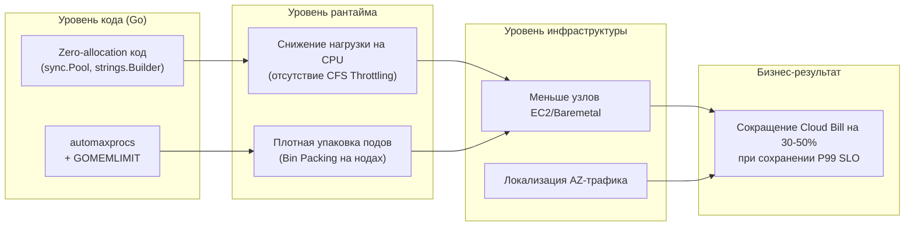
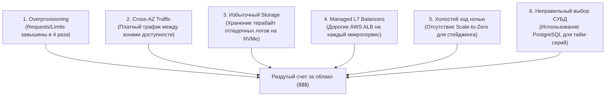

## Архитектура, которая не разоряет

> *«Построить мост, который просто стоит, может каждый. Но нужен настоящий инженер, чтобы построить мост, который едва-едва выдерживает расчетную нагрузку, не тратя ни одного лишнего цента».*    
> — Старая инженерная пословица

В академических статьях и учебниках архитектуру распределенных систем часто рассматривают в отрыве от реальности: как идеальное абстрактное царство неограниченных вычислительных ресурсов, бесконечной пропускной способности сети и нулевых задержек.

Но в реальном инженерном мире у каждого компонента есть ценник. Лишний микросервис на диаграмме — это не просто элегантный прямоугольник со стрелочками. Это минимум 3 пода в Kubernetes для отказоустойчивости, постоянный оверхед на sidecar-прокси (Envoy), периодический опрос метрик Prometheus, межзональный сетевой трафик и ежемесячный счет от облачного провайдера (AWS, Google Cloud или Yandex Cloud) с пятью или шестью нулями.

**Cost Optimization (Оптимизация стоимости владения / FinOps)** — это системная инженерная практика проектирования архитектуры, при которой требования к надежности (SLA/SLO) и производительности удовлетворяются с минимальными финансовыми затратами на инфраструктуру.

Для Go-разработчика оптимизация стоимости — это не бухгалтерская рутина, а высшее проявление **Mechanical Sympathy**:
$$\text{Меньше аллокаций} \longrightarrow \text{Меньше работы GC} \longrightarrow \text{Меньше CPU} \longrightarrow \text{Меньше подов} \longrightarrow \text{Минимальный TCO}.$$



---

### Почему Go эффективен по стоимости

Язык Go создавался инженерами Bell Labs и Google (Роб Пайк, Кен Томпсон) именно как рабочий инструмент для гигантских серверных кластеров, где неэффективность компилятора или рантайма мгновенно превращалась в миллионы долларов переплаты за серверные стойки и электричество.

Фундаментальные свойства Go напрямую конвертируются в финансовую экономию:

1. **Статическая компиляция в единый бинарник:**  
   Минимальный Docker-образ Go на базе базового слоя `scratch` весит от 10 до 25 МБ (в отличие от 300–800 МБ для образов на базе Python, Node.js или JVM). В облачной инфраструктуре с тысячами рабочих узлов передача тяжелых образов генерирует гигабайты платного внутрисетевого трафика и замедляет холодный старт.
2. **Легковесность горутин:**  
   Стек горутины стартует всего с 2–4 КБ памяти, динамически расширяясь по мере надобности. Поток операционной системы в Linux требует от 2 до 8 МБ виртуальной памяти. Сервер на Go способен удерживать 100 000 активных соединений (WebSockets, SSE, gRPC) на одной скромной виртуальной машине с 4 ГБ оперативной памяти.
3. **Мгновенный старт (Warm-up time):**  
   Go-сервис инициализируется и начинает отвечать на трафик за десятки миллисекунд (у JVM этот процесс может занимать 30–60 секунд из-за JIT-компиляции). Быстрый старт позволяет агрессивно масштабировать инфраструктуру в облаке: не держать резервные дорогие машины в холостом режиме, а поднимать поды по требованию за секунды.
4. **Предсказуемый и низколатентный GC:**  
   Сборщик мусора Go ориентирован на ультранизкие паузы (Stop-The-World < 1 мс). Это дает возможность утилизировать CPU сервера до 70–80%, не опасаясь внезапных многосекундных «замерзаний» системы.

---

### Архитектурные решения, влияющие на стоимость

Каждый архитектурный паттерн из нашего курса имеет конкретную финансовую цену. Проектируя систему, старший инженер обязан взвешивать не только latency, но и бюджет.

#### Монолит vs Микросервисы

Разделение системы на микросервисы ([[9. Микросервисы. Преимущества, недостатки и мифы]]) резко увеличивает базовую стоимость инфраструктуры:
- Для каждого сервиса требуется минимум 3 пода в Kubernetes (для соблюдения кворума и переживания перезагрузок нод).
- Каждый микросервис требует собственного пула подключений к БД, логов, трейсов и sidecar-прокси.
- Если у вас 20 микросервисов, только на базовый холостой ход уйдет 60 подов. При нагрузке в 200–500 RPS это чистая трата бюджета.

**Решение:** Начинайте с модульного монолита ([[10. Модульный монолит как компромисс]]). Модульный монолит деплоится в один компактный под с минимальным потреблением ресурсов, экономя тысячи долларов на ранних этапах жизни продукта.

#### Синхронное vs Асинхронное взаимодействие

В синхронной архитектуре (HTTP/gRPC) пиковый наплыв пользователей требует мгновенного масштабирования всех зависимых сервисов цепочки. Если сервис платежей получает 5000 RPS, сервис чеков, сервис уведомлений и сервис аудита также обязаны держать этот удар в реальном времени.

Переход на асинхронное взаимодействие через брокер очередей ([[19. Синхронное vs асинхронное взаимодействие сервисов]]) позволяет **сглаживать пиковые нагрузки (Load Leveling)**:
- Очередь накапливает пиковый трафик в буфере.
- Сервисы-консьюмеры работают на постоянном, оптимальном числе подов (например, 2 пода вместо 20), переваривая данные с комфортной скоростью. Экономия на пиковых мощностях достигает 60–70%.

#### Кэширование и данные

Обращение к реляционной СУБД (PostgreSQL / MySQL) — самая дорогая операция: она требует мощных CPU, быстрых дисков с высоким IOPS (Provisioned IOPS в AWS стоят колоссальных денег) и сотен гигабайт RAM.

Внедрение кэширования ([[28. Кэширование. Cache Aside, Write Through, Write Back]]) защищает базу:
- **Распределенный кэш (Redis):** берет на себя 90% чтений, позволяя использовать в разы меньший инстанс PostgreSQL.
- **Локальный in-memory кэш в Go:** библиотеки вроде `ristretto` или потокобезопасная хэш-таблица на `sync.Map` экономят не только запросы к БД, но и сетевой трафик до самого Redis, обслуживая горячие ключи за наносекунды прямо из оперативной памяти процесса.

#### Репликация и шардирование

Репликация базы данных ([[32. Репликация. Leader Follower и Multi Leader]]) умножает расходы на хранение и трафик синхронизации. Каждая дополнительная реплика для чтения — это отдельный платный сервер.  
Шардирование ([[31. Partitioning и Sharding]]) порождает сложность координации, транзакций и распределенных запросов.

Часто экономически выгоднее масштабировать базу вертикально (перейти с 8 ядер на 32 ядра), оптимизировать медленные SQL-запросы с помощью индексов и EXPLAIN ANALYZE, чем преждевременно нанимать армию инженеров для поддержки шардированного кластера.

#### Observability и хранение логов

Сбор логов, метрик и трейсов ([[39. Observability в архитектуре. Metrics, Logs, Traces]]) — один из главных скрытых пожирателей бюджета:
- Несэмплированный распределенный трейсинг (100% трейсов) при 10 000 RPS генерирует сотни гигабайт спанов в сутки.
- Plaintext-логи без структурирования перегружают диск и индексы Elasticsearch/Loki.

**Тактика экономии:**
- Настройте вероятностное сэмплирование трейсов (1–5% для успешных запросов и 100% для ошибок с кодами 5xx).
- Используйте стандартный пакет `slog` для структурированного JSON-логирования: компактный двоичный или JSON-вывод с короткими ключами.
- Устанавливайте жесткие политики устаревания (retention): горячие логи хранятся 7 дней в SSD-хранилище, затем архивируются в холодный дешёвый объектный сторадж (AWS S3 Glacier).

---

### Mechanical Sympathy: профилирование как инструмент экономии

Оптимизация кода на Go приносит прямую экономическую выгоду. Если в результате оптимизации одного горячего цикла сервис начинает требовать 1 CPU вместо 2, на масштабе 100 подов это мгновенно высвобождает 100 процессорных ядер.

Стандартная библиотека Go предоставляет эталонный инструмент анализа — профайлер **`pprof`**:

```go
package main

import (
	"log"
	"net/http"
	_ "net/http/pprof" // Регистрирует обработчики /debug/pprof
)

func startProfilingServer() {
	// Запуск диагностического pprof-эндпоинта на изолированном внутреннем интерфейсе
	go func() {
		log.Println(http.ListenAndServe("127.0.0.1:6060", nil))
	}()
}
```

1. **CPU Profile:** Показывает, на какие функции тратятся такты процессора. Оптимизация регулярных выражений или замена интерфейсной рефлексии на прямые вызовы высвобождает процессорную квоту.
2. **Heap Profile (Allocations):** Показывает точки аллокаций памяти в куче (`heap`). Каждая аллокация заставляет сборщик мусора чаще прогонять фазу разметки. Устранение аллокаций снижает нагрузку на GC, срезая «хвосты» задержек (P99 latency).
3. **Goroutine Profile:** Показывает зависшие горутины. Утечка 10 000 горутин — это физическая утечка памяти, ведущая к неоправданному автоскейлингу подов.

> [!warning] Ловушка / Gotcha: Безопасность эндпоинта pprof
> Никогда не публикуйте `/debug/pprof` на публичных сетевых интерфейсах без жесткой аутентификации!  
> Злоумышленник может вызвать профилирование кучи или процессора (`/debug/pprof/profile?seconds=30`), вызвав деградацию производительности сервера (DoS), или сдампить стек вызовов, получив чувствительные токены и структуру памяти приложения ([[44. Безопасность архитектуры. Threat modeling]]). Всегда вешайте профайлер на `127.0.0.1` или защищайте внутренним VPN/Service Mesh.

---

### Где обычно переплачивают

В реальных аудитах облачных инфраструктур инженеры выявляют шесть типичных финансовых «черных дыр»:



1. **Overprovisioning (Резервирование вслепую):**  
   Разработчик выделяет контейнеру `requests: cpu: 2, memory: 4Gi`, хотя сервис в пике потребляет 0.2 CPU и 300 МБ RAM. Kubernetes резервирует эти ресурсы на ноде, не позволяя разместить другие поды. Используйте Vertical Pod Autoscaler (VPA) для анализа реального профиля потребления.
2. **Трафик между зонами доступности (Cross-AZ Traffic):**  
   В AWS передача 1 ТБ данных между зонами `us-east-1a` и `us-east-1b` стоит $10. Если микросервисы беспорядочно пересылают JSON между зонами, счет за трафик может превысить стоимость самих серверов. Используйте топологическую маршрутизацию Kubernetes (`topologyAwareHints: true`), направляя трафик на локальные поды в той же зоне.
3. **Хранение неиспользуемых данных:**  
   Миллиарды записей в логах за 2 года, которые никто ни разу не читал. Внедрите четкую политику жизненного цикла данных (Data Lifecycle Management).
4. **Внешние L7 балансировщики на каждый чих:**  
   Подъем AWS Application Load Balancer ($20/мес + трафик) для каждого внутреннего сервиса. Внутри кластера должен работать бесплатный gRPC с клиентской балансировкой ([[33. Load Balancing на уровне архитектуры]]) или Envoy/Istio.
5. **Круглосуточный стейджинг:**  
   Тестовые стенды, работающие в субботу и воскресенье, когда в компании никто не пишет код. Автоматическое выключение dev-окружений на ночь и выходные экономит до 65% бюджета непроизводственных сред.
6. **Неправильный выбор СУБД:**  
   Попытка хранить аналитику и временные ряды в реляционной базе данных PostgreSQL вместо специализированного колоночного хранилища ClickHouse или TimescaleDB. ClickHouse сжимает данные в 5–10 раз лучше, экономя терабайты диска.

---

### Практические тактики для Go

Как сделать код на Go максимально дешевым в эксплуатации?

#### 1. Минимизация аллокаций и нулевое копирование

Каждая аллокация в куче увеличивает работу сборщика мусора. В высоконагруженных обработчиках используйте пул объектов `sync.Pool` для переиспользования буферов:

```go
var bufferPool = sync.Pool{
	New: func() any {
		// Выделяем слайс фиксированной емкости 4 КБ
		b := make([]byte, 0, 4096)
		return &b
	},
}

func processPayload(data []byte) {
	bufPtr := bufferPool.Get().(*[]byte)
	buf := (*bufPtr)[:0] // Сброс длины без перевыделения памяти
	defer func() {
		*bufPtr = buf
		bufferPool.Put(bufPtr)
	}()

	// Работаем с памятью без единой новой аллокации в куче
	buf = append(buf, data...)
}
```

- Избегайте конкатенации строк через оператор `+` в циклах; всегда используйте `strings.Builder`.
- Избегайте лишних преобразований `[]byte` в `string`, приводящих к копированию байтов в памяти.

#### 2. Тонкая настройка GOMEMLIMIT и GOGC

Начиная с Go 1.19, рантайм поддерживает мягкий лимит памяти **`GOMEMLIMIT`**:

```bash
# Ограничиваем память рантайма 450 МБ внутри 512 МБ cgroups контейнера
GOMEMLIMIT=450MiB GOGC=100 ./my-service
```

Это революционное нововведение устраняет риск аварийного завершения контейнера операционной системой (`OOM Killer`) и позволяет упаковывать поды в Kubernetes в 2–3 раза плотнее на одном физическом сервере.

#### 3. Высокопроизводительная сериализация

Стандартный пакет `encoding/json` интенсивно использует рефлексию и совершает множество промежуточных аллокаций интерфейсов `any`.  
- Для внутренних вызовов используйте бинарный протокол **gRPC / Protocol Buffers** — он требует в 3–5 раз меньше CPU и сетевого трафика.
- Для внешних REST API используйте оптимизированные кодогенераторы или библиотеки вроде `goccy/go-json`, которые парсят JSON с использованием SIMD-инструкций процессора.

#### 4. Контроль потоков ОС и квот CPU (automaxprocs)

В Linux-контейнерах Kubernetes переменная `runtime.NumCPU()` по умолчанию возвращает количество физических ядер всего хостового узла (например, 64 или 128 ядер), даже если поду выделена квота всего в 1 ядро (`cpu: "1000m"`).  
Рантайм Go инициализирует `GOMAXPROCS=128`, создавая десятки потоков ОС. Это порождает чудовищные накладные расходы на переключение контекста и троттлинг планировщиком ядра Linux CFS (`cpu.cfs_quota_us`).

Подключение библиотеки `automaxprocs` автоматически согласовывает `GOMAXPROCS` с реальными квотами cgroups:

```go
import _ "go.uber.org/automaxprocs"
```

---

### Анализ стоимости в System Design

На архитектурном интервью по System Design ([[51. System Design интервью. Как подходить к задаче]]) кандидат уровня Staff/Principal обязан продемонстрировать понимание экономики системы (Back-of-the-envelope Cost Estimation).

Пример экспресс-расчета инфраструктурного бюджета для сервиса на 50 000 RPS:
- **CPU & RAM:** Go-сервис утилизирует ~1 ядро CPU на 5 000 RPS при хорошем коде. Для 50 000 RPS потребуется $50\,000 / 5\,000 = 10$ ядер CPU (+ резерв $\times 2$ для надежности) $\rightarrow 20$ vCPU. Это 5 инстансов по 4 vCPU / 8 GB RAM (примерно $5 \times \$120 = \$600$/мес).
- **Сетевой исходящий трафик (Egress):** Средний размер JSON-ответа — 2 КБ.  
  $$50\,000 \text{ req/s} \times 2 \text{ KB} = 100 \text{ MB/s} = 800 \text{ Mbps}.$$  
  В месяц: $100 \text{ MB/s} \times 86\,400 \times 30 \approx 260 \text{ TB}$ трафика.  
  При цене $0.05$ за ГБ в облаке: $260\,000 \times 0.05 = \$13\,000$/мес.  
  *Инженерный вывод:* Трафик стоит в 20 раз дороже серверов! Архитектурное решение: включить сжатие Brotli/Gzip, внедрить агрессивный CDN (Cloudflare) для кэширования ответов на границе сети, что снизит счет с $13 000 до $2 000.

---

> [!tip] Собеседование: Сокращение расходов на инфраструктуру
> **Вопрос:** Компания тратит $50 000 в месяц на инфраструктуру 50 Go-микросервисов в AWS EKS. Руководство поставило задачу снизить расходы на 40% за 2 месяца без ухудшения SLO. Каков ваш пошаговый план действий?  
> **Ответ:**  
> 1. **Анализ затрат (FinOps-аудит):** С помощью AWS Cost Explorer и Kubecost раскладываем траты по статьям: Compute (EC2), Data Transfer (межзональный трафик), Storage и Managed Services (RDS, ElastiCache).
> 2. **Compute (Right-sizing и automaxprocs):** Подключаем `automaxprocs` во все сервисы для устранения CFS Throttling. Анализируем разницу между `requests` и реальным P95 потреблением ресурсов, срезая раздутые лимиты. Внедряем Karpenter для эффективной упаковки подов и переводим некритичные сервисы (воркеры очередей, стейджинг) на Spot-инстансы (экономия 60–70%).
> 3. **Сетевой трафик (Cross-AZ):** Включаем `topologyAwareHints` в Kubernetes, чтобы сервисы общались внутри одной зоны доступности, сокращая межзональные платежи.
> 4. **Observability:** Урезаем retention логов в CloudWatch/Elasticsearch до 14 дней, настраиваем сэмплирование трейсов в OpenTelemetry на уровне 2% для успешных запросов.
> 5. **Код:** Профилируем топ-3 самых ресурсоемких сервиса через `pprof`, оптимизируем аллокации с помощью `sync.Pool` и настраиваем `GOMEMLIMIT`.  
> *Результат:* Суммарная экономия составит от 35% до 50% от исходного счета.

---

### Итог

Архитектурная зрелость измеряется не количеством используемых модных технологий, а умением создавать надежные, элегантные и финансово эффективные системы.  
- Go предоставляет выдающуюся механическую базу: минимальный след в памяти, быстрый запуск и высочайшую утилизацию процессорных ядер.  
- Задача инженера — не разрушить эти преимущества неряшливым кодом с избыточными аллокациями, раздутыми микросервисами и слепым перерасходом облачных ресурсов.

Овладев всеми гранями архитектуры, паттернами отказоустойчивости и принципами экономической оптимизации, мы подошли к кульминации инженерной подготовки: методике решения масштабных системных задач на собеседованиях. В следующей лекции мы детально разберем методологию: [[51. System Design интервью. Как подходить к задаче]].
