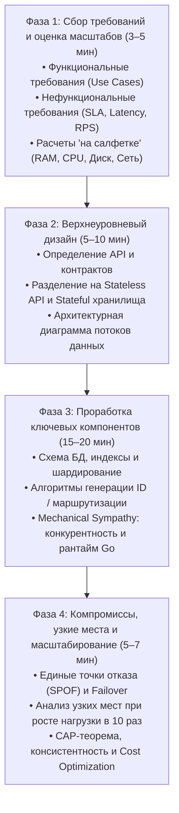
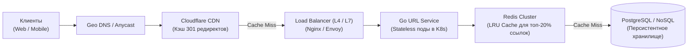
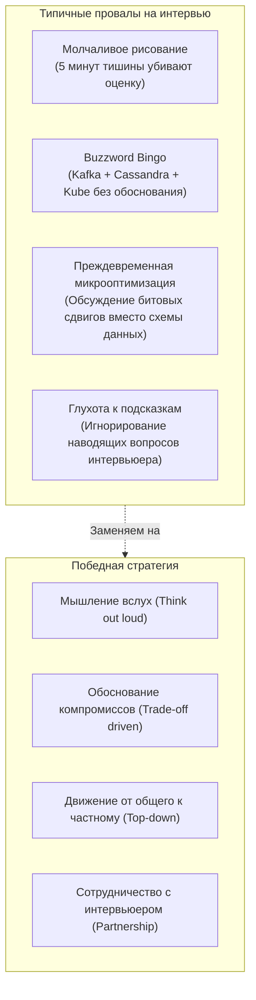

## Фреймворк для System Design интервью

> *«Лучший способ решить сложную проблему — разбить ее на части, досконально понять каждую деталь и аккуратно собрать решение воедино».*    
> — Брайан Керниган

В предыдущих пятидесяти лекциях мы изучили фундаментальный арсенал архитектора распределенных систем: от внутреннего устройства кремниевых процессоров и сетевых протоколов до шардирования баз данных, паттернов отказоустойчивости, кэширования и оптимизации стоимости облачной инфраструктуры.

Однако на собеседовании на позицию Senior, Lead или Staff Go-инженера багаж теоретических знаний сам по себе не гарантирует успеха. Когда интервьюер с улыбкой произносит: *«Спроектируйте распределенный сервис сокращения ссылок вроде bit.ly»* или *«Спроектируйте архитектуру мессенджера вроде Telegram на 500 миллионов пользователей»*, он проверяет вовсе не вашу способность быстро перечислить модные названия технологий вроде Kafka, Cassandra или Kubernetes.

Интервьюер оценивает **инженерную зрелость мышления**:
1. Умеете ли вы структурировать хаос и прояснять туманные требования?
2. Способны ли вы оценить физические порядки величин (RPS, память, дисковый I/O, трафик) на салфетке за 2 минуты?
3. Владеете ли вы искусством архитектурных компромиссов (trade-offs), понимая, что в распределенных системах идеальных решений не существует?
4. Проявляете ли вы **Mechanical Sympathy** к языку и платформе (Go и Linux), понимая, как код поведет себя на реальном железе?

В этой лекции мы разберем проверенный временем, строгий 4-фазный фреймворк прохождения System Design секции, адаптированный под специфику Go-бэкенда.

---

### Четыре фазы успешного интервью

Стандартное архитектурное интервью длится 45–50 минут. Если кандидат сразу бросается рисовать базы данных и брокеры, интервью гарантированно провалено: к 30-й минуте выяснится, что вы проектировали аналитическую систему вместо транзакционной.

Дисциплинированное следование четырем фазам позволяет держать инициативу в своих руках и демонстрирует системный подход к проектированию.

---

#### Фаза 1: Сбор требований (3–5 минут)

Никогда не начинайте проектировать, пока не очертили границы задачи. Намеренная неполнота условия — часть экзамена.

1. **Функциональные требования (Scope):**  
   Что система **должна** делать, а что мы сознательно исключаем ([[3. Функциональные и нефункциональные требования]])?  
   *Пример (URL Shortener):*
   - Пользователь отправляет длинный URL $\rightarrow$ получает короткий 7-символьный ключ.
   - Пользователь переходит по короткой ссылке $\rightarrow$ мгновенный HTTP-редирект (301/302).
   - Ссылки могут иметь срок жизни (TTL) или быть вечными.
   - *Вне скоупа (Out of scope):* Аналитика кликов в реальном времени, платные кастомные алиасы, биллинг.
2. **Нефункциональные требования (NFRs):**  
   Каковы требования к надежности и задержкам ([[5. Latency, Throughput, Availability и Trade-offs]])?
   - Высокая доступность: 99.99% (High Availability важнее строгой консистентности).
   - Низкая задержка: чтение ссылки < 20 мс (P99), запись < 100 мс.
   - Профиль нагрузки: соотношение чтения к записи (Read-Heavy система, 100:1).
3. **Расчеты «на салфетке» (Back-of-the-envelope estimation):**  
   Показывает умение оперировать физическими масштабами:
   - *RPS:* 10 млн новых ссылок в месяц $\approx 4$ записи в секунду.  
     При соотношении чтений 100:1: $4 \times 100 = 400$ чтений/сек (в пике — до 1 000 RPS).
   - *Хранилище:* 10 млн $\times 12$ мес $\times 5$ лет = 600 млн записей.  
     Размер одной записи: 500 байт (ID + short_url + original_url + created_at).  
     Суммарно: $600\,000\,000 \times 500 \text{ B} = 300 \text{ GB}$ за 5 лет.  
   - *Вывод:* 300 ГБ легко помещаются на один SSD современного сервера! Никакого сложного шардирования на 50 серверов на старте не требуется.

---

#### Фаза 2: Верхнеуровневый дизайн (5–10 минут)

Сформируйте общую схему взаимодействия компонентов. Разделите систему на stateless-сервисы и stateful-хранилища ([[7. Stateless vs Stateful сервисы]]).

- **API Контракты ([[20. RPC vs REST vs Messaging]]):**  
  Декларируйте эндпоинты:
  - `POST /api/v1/urls` — тело `{ "url": "https://..." }`, возврат `201 Created` `{ "short_url": "https://sho.rt/a8F1z" }`.
  - `GET /{short_code}` — возврат `302 Found` с заголовком `Location: https://...`.
- **Stateless API:** Сервисы на Go не хранят сессий в памяти, легко масштабируются горизонтально ([[6. Вертикальное и горизонтальное масштабирование]]).
- **Сетевой уровень:** Вход через CDN (для кэширования статики и популярных редиректов), L4/L7 балансировщик ([[33. Load Balancing на уровне архитектуры]]) и Service Discovery ([[34. Service Discovery. Client side и Server side]]).

---

#### Фаза 3: Проработка ключевых компонентов (15–20 минут)

Это главная часть интервью, где вы демонстрируете инженерную глубину и знание деталей реализации. Выберите 2–3 самых критических узла:

1. **Модель данных и алгоритм генерации ключа:**
   - Как получить 7-символьный ключ? Base62 (`[a-zA-Z0-9]`) дает $62^7 \approx 3.5$ триллиона уникальных комбинаций.
   - *Вариант А (MD5/SHA-256):* Хэширование URL + обрезка первых 7 символов. Минус: коллизии, необходимость проверки на дубликат в базе.
   - *Вариант Б (Распределенный генератор ID):* Snowflake ID или централизованный генератор счетчиков (Range Allocator: каждый Go-сервис берет пачку в 10 000 ID из базы или Redis в память и генерирует ключи атомарным `atomic.AddUint64` без сетевых вызовов!).
2. **Стратегия кэширования ([[28. Кэширование. Cache Aside, Write Through, Write Back]]):**
   - Правило Парето: 20% ссылок генерируют 80% трафика.
   - Кэш-память: 80 млн запросов в день $\times 20\% \times 500 \text{ B} \approx 8 \text{ GB}$ RAM. Кэш Redis легко помещается в оперативную память одного сервера.
   - Политика вытеснения: `allkeys-lru`.
3. **Устойчивость и защита ([[36. Circuit Breaker, Retry, Timeout и Backoff]]):**
   - Контекстные таймауты при обращениях к Redis и Postgres.
   - Circuit Breaker для предотвращения лавины запросов при деградации базы данных.

---

#### Фаза 4: Компромиссы, узкие места и масштабирование (5 минут)

Зрелый архитектор всегда видит уязвимости собственного дизайна и готов открыто их обсуждать:

- **Единая точка отказа (SPOF):**  
  База данных — узкое место. Решение: Leader-Follower репликация ([[32. Репликация. Leader Follower и Multi Leader]]) с автоматическим Failover через Patroni.
- **Масштабирование в 100 раз (до 100 000 RPS):**  
  Если размер данных вырастет до 30 ТБ, один сервер перестанет справляться. Внедряем шардирование базы данных ([[31. Partitioning и Sharding]]) по хэшу от `short_code` (Consistent Hashing).
- **Компромисс консистентности (CAP-теорема [[30. CAP теорема и реальные компромиссы]]):**  
  Мы выбираем AP-систему (Availability / Partition Tolerance). Если новая ссылка станет доступна на реплике чтения с задержкой в 500 мс (Eventual Consistency), это абсолютно приемлемо для бизнеса.
- **Статус редиректа (301 Moved Permanently vs 302 Found):**  
  `301` кэшируется браузером навсегда — это экономит трафик и серверные мощности, но лишает нас возможности собирать аналитику кликов. `302` направляет каждый запрос на наш сервер, позволяя вести точный учет переходов, но повышает нагрузку на Go-бэкенд.

---

### Как применять Go-специфику

Знание внутренних механизмов Go превращает абстрактный System Design в осязаемый рабочий проект, выделяя вас из 95% кандидатов:

1. **Горутины и сетевой поллер (netpoller):**  
   Объясните, почему Go-сервер легко держит 50 000 одновременных входящих соединений. Стандартный пакет `net/http` запускает легкую горутину на каждое соединение. Сетевой поллер рантайма переводит дескриптор в `epoll` ядра Linux, не блокируя поток операционной системы (M). В отличие от Java или Python с пулами потоков, Go не требует раздувания памяти на сотни мегабайт.
2. **Эффективное локальное кэширование:**  
   Если интервьюер просит снизить задержку до субмиллисекунд, предложите двухуровневый кэш (L1 In-Memory в Go + L2 Redis). Подчеркните знание GC: стандартный `map[string][]byte` при миллионах ключей создаст огромную нагрузку на сборщик мусора при фазе Mark. Поэтому в Go применяются библиотеки `bigcache` или `ristretto`, хранящие данные в обход указателей кучи (off-heap или монолитные байтовые буферы с кольцевой индексацией).
3. **Стандартная библиотека:**  
   Покажите умение использовать встроенные средства: `net/http/httputil.ReverseProxy` для легковесного API Gateway, `database/sql` для пула соединений, `crypto/tls` для настройки mTLS.
4. **Контексты (`context.Context`):**  
   Подчеркните, что сквозная отмена запросов при отключении клиента или сработке таймаута спасает базу данных от бессмысленной работы.
5. **Внутренний RPC (gRPC / HTTP/2):**  
   Для межсервисного общения используем `grpc-go`: мультиплексирование сотен вызовов в единое TCP-соединение экономит дескрипторы и устраняет оверхед на рукопожатия TLS.
6. **Контроль потоков и квот CPU (`automaxprocs`):**  
   Упомяните, что для предотвращения троттлинга CFS в Kubernetes вы подключаете `automaxprocs`, настраивая `GOMAXPROCS` под реальные лимиты контейнера.

> [!info] Под капотом: Матрица оценки кандидата интервьюером
> Опытный интервьюер (Senior Staff / Principal) заполняет оценочный лист (Rubric), оценивая сигналы по пяти осям:
> 1. **Прояснение проблемы (Disambiguation):** Задал ли кандидат правильные вопросы о граничных условиях и объемах данных?
> 2. **Декомпозиция системы:** Насколько логично разделены зоны ответственности между сервисами и БД?
> 3. **Глубина проработки (Deep Dive):** Смог ли кандидат опуститься на уровень схемы данных, структур индексов, алгоритмов и физики ввода-вывода?
> 4. **Аргументация компромиссов (Trade-offs):** Объясняет ли он, ПОЧЕМУ выбрал PostgreSQL вместо MongoDB, или просто сыплет названиями?
> 5. **Коммуникация:** Ведет ли кандидат диалог как партнер по архитектурному ревью, или молча чертит схему в углу доски?

---

### Коммуникация и типичные ошибки

1. **Мыслите вслух (Think Out Loud):**  
   Интервьюеру важен ход вашей мысли, а не готовая идеальная схема. Если вы колеблетесь между Redis и Memcached, проговорите это: *«Я выбираю Redis, потому что нам понадобятся структуры данных Hashes и персистентность RDB для быстрого прогрева при рестарте»*.
2. **Слышите подсказки интервьюера:**  
   Если интервьюер спрашивает: *«А что произойдет, если база данных начнет отвечать с задержкой в 5 секунд?»* — это не праздный вопрос. Это прямой намек на необходимость обсудить таймауты, Circuit Breaker и Bulkhead. Не спорьте, а подхватывайте тему.
3. **Не занимайтесь Buzzword Bingo:**  
   Использование сложнейших распределенных очередей там, где достаточно одного SQL-запроса, вызывает у опытного архитектора лишь скепсис. Простота — высшая добродетель инженера.
4. **Не бойтесь честно признать пробел:**  
   Если вы не помните точную конфигурацию репликации в ScyllaDB, скажите: *«Я концептуально настрою кворум записи W=2, R=2 при факторе репликации 3 для обеспечения strong consistency, а детали синтаксиса конфигурации уточню по документации»*. Это ответ зрелого профессионала.

---

> [!tip] Собеседование: Оценка инфраструктуры на 100 000 RPS
> **Вопрос:** Интервьюер просит оценить вычислительные ресурсы для сервиса авторизации (Go), принимающего 100 000 RPS (P99 latency ≤ 100 мс). Как вы обоснуете расчет?  
> **Ответ:**  
> 1. **Базовая производительность пода:** Оптимизированный Go-сервис (валидация JWT или чтение кэша сессии из памяти) на 4 vCPU / 8 GB RAM уверенно держит от 5 000 до 10 000 RPS при задержках P99 < 10 мс.
> 2. **Расчет подов:** Берем консервативную планку в 5 000 RPS на под:  
>    $$100\,000 / 5\,000 = 20 \text{ подов}.$$
> 3. **Резерв на отказоустойчивость и пики (+50%):**  
>    Для возможности безопасного проведения rolling update в пиковые часы и защиты от падения одной зоны доступности (N+2 redundancy) закладываем 30 подов.
> 4. **Сетевой ввод-вывод:**  
>    При размере полезной нагрузки запроса/ответа 1 КБ:  
>    $$100\,000 \text{ req/s} \times 1 \text{ KB} = 100 \text{ MB/s} = 800 \text{ Mbps}.$$  
>    Следовательно, физические серверы кластера обязаны иметь сетевые интерфейсы минимум 10 Gbps.

---

### Связь с другими темами раздела

В следующей лекции мы применим данный фреймворк на практике и детально разберем архитектуру четырех эталонных систем, которые чаще всего встречаются на собеседованиях мирового уровня: [[52. Разбор типичных System Design задач]].

---

### Итог

System Design интервью — это увлекательный инженерный диалог двух равных коллег.  
- Четкое следование четырем фазам защищает вас от паники и структурирует мысли.  
- Оценки на салфетке приземляют архитектуру на физическую реальность железа.  
- Глубокое понимание рантайма Go, планировщика и работы с памятью демонстрирует ту самую инженерную фундаментальность, ради которой создавалась эта книга.
