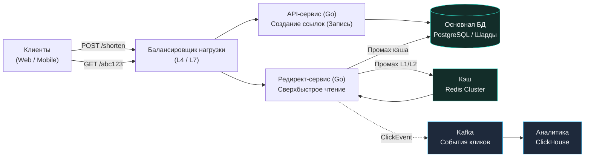
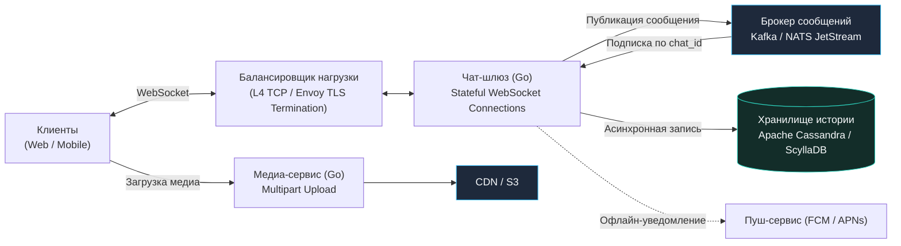
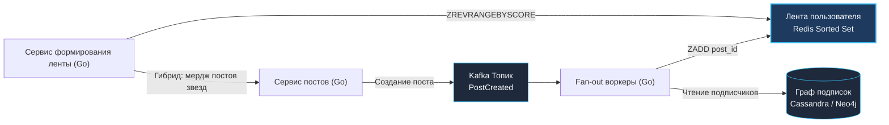
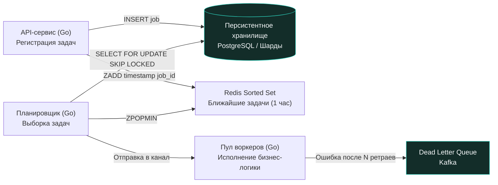
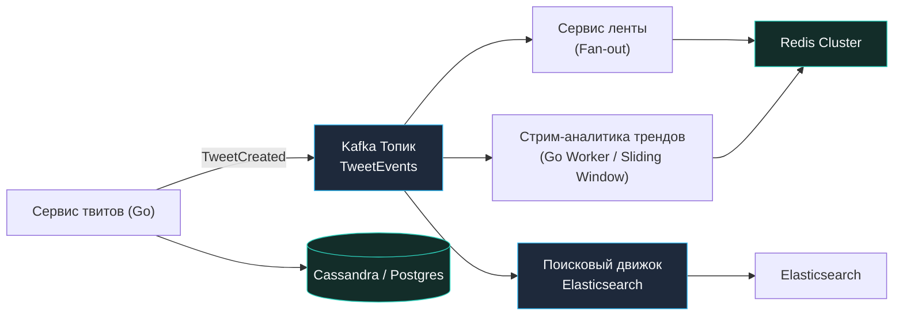
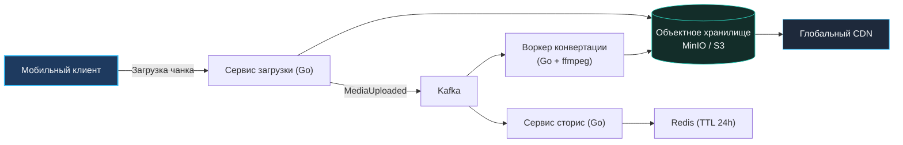
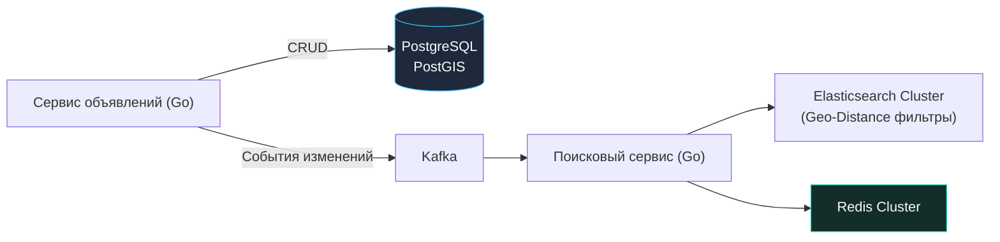
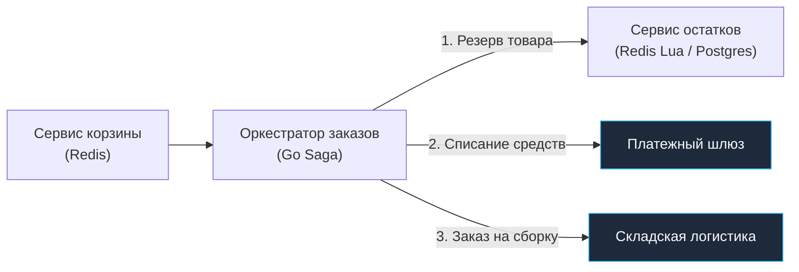
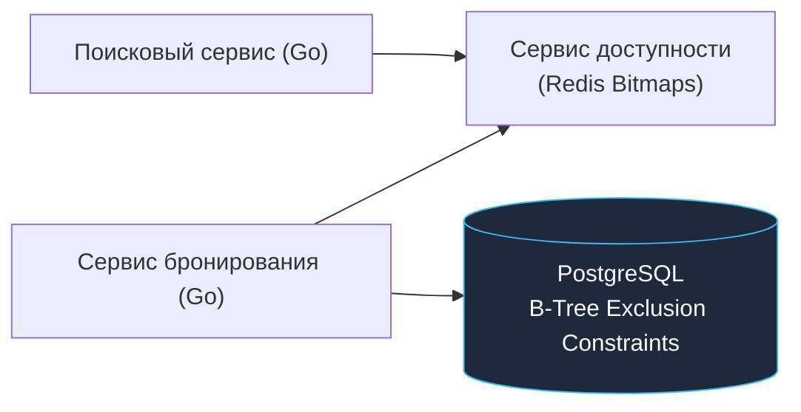

## Практический практикум: 10 эталонных систем

> *«Практика — лучший наставник во всем».*    
> — Публилий Сир (девиз Bell Labs)

Теоретический фреймворк из предыдущей лекции ([[51. System Design интервью. Как подходить к задаче]]) закладывает дисциплину инженерного мышления. Однако подлинное мастерство архитектора познается в горниле решения конкретных, противоречивых задач под жестким давлением ограничений реального мира.

В этой лекции мы детально разберем десять классических систем, ставших индустриальными эталонами System Design интервью мирового уровня: от сервиса сокращения ссылок до глобального мессенджера, маркетплейса уровня Черной пятницы и геолокационной аренды. Для каждой задачи мы последовательно пройдем все фазы проектирования, детально обоснуем компромиссы, опустимся на уровень моделей данных и проявим глубокую **Mechanical Sympathy** к рантайму языка Go и ядру Linux.

---

### 1. Сервис сокращения ссылок (URL Shortener)

Классическая «простая» задача, на которой интервьюеры мгновенно отсеивают теоретиков от практиков.

**Функциональные требования:**
- Пользователь отправляет длинный URL $\rightarrow$ получает короткий 7-символьный ключ.
- При переходе по короткой ссылке $\rightarrow$ мгновенный HTTP-редирект (301/302).
- Сбор аналитики переходов в реальном времени (гео-локация, User-Agent, Referrer).

**Нефункциональные требования:**
- 100 млн новых ссылок в месяц ($~40$ RPS на запись).
- 1 млрд переходов в день ($~12\,000$ RPS на чтение, в пике до $35\,000$ RPS).
- Соотношение чтение/запись: $300:1$ (экстремально Read-Heavy система).
- Задержка редиректа: $P99 < 20$ мс.
- Доступность: $99.95\%$.

#### Верхнеуровневый дизайн

Архитектура строится по принципу строгого разделения путей записи и чтения в духе CQRS ([[23. CQRS. Разделение чтения и записи]]):



Сервис редиректов полностью `stateless`, не имеет транзакций и масштабируется горизонтально.

#### Ключевые решения

**Генерация короткого ключа:**
- Алфавит Base62 (`[a-zA-Z0-9]`). Длина 7 символов дает $62^7 \approx 3.52$ триллиона уникальных комбинаций.
- Чтобы не вызывать коллизий хэшей, используем распределенный генератор счетчиков (Snowflake-подобный ID на 64 бита) с атомарным инкрементом через `sync/atomic`. Каждый Go-инстанс забирает пачку из 10 000 ID в память и конвертирует число в Base62.
- В БД на поле `short_key` вешается индекс `UNIQUE`.

**Хранение данных:**
- Схема: `urls(id BIGINT PRIMARY KEY, short_key VARCHAR(10) UNIQUE, original_url TEXT, created_at TIMESTAMPTZ, expires_at TIMESTAMPTZ, user_id UUID)`.
- При объеме 100 млн записей в месяц таблица растет на 50 ГБ в год. На старте достаточно одного мощного инстанса PostgreSQL с репликацией Leader-Follower ([[32. Репликация. Leader Follower и Multi Leader]]).
- При росте до миллиардов строк шардируем по хэшу от поля `short_key` с использованием консистентного хэширования ([[31. Partitioning и Sharding]]).

**Двухуровневое кэширование:**
- Паттерн Cache-Aside ([[28. Кэширование. Cache Aside, Write Through, Write Back]]): Redis Cluster с политикой LRU для топ-20% горячих ссылок.
- Локальный in-memory кэш на базе библиотеки `ristretto` прямо внутри Go-процесса редирект-сервиса. Это срезает сетевой round-trip до Redis, отдавая супергорячие ссылки (топ-1%) за 200 наносекунд.

**Асинхронная аналитика:**
- Редирект-сервис сбрасывает событие `ClickEvent` в Kafka без ожидания подтверждения (Fire-and-Forget). Воркеры считывают батчи и складывают их в колоночную СУБД ClickHouse ([[41. Data Pipeline и потоковая обработка]]).

**Устойчивость и защита:**
- Ограничение создания ссылок через Token Bucket (`golang.org/x/time/rate`).
- Circuit Breaker на обращение к Redis: если кэш перегружен, переключаемся на базу данных, снижая нагрузку на сеть ([[36. Circuit Breaker, Retry, Timeout и Backoff]]).


> [!info] Под капотом: Почему Snowflake ID предпочтительнее UUIDv4 для B-Tree индексов
> Случайный UUIDv4 (128 бит) при интенсивной вставке в PostgreSQL разносит B-Tree индекс в клочья: случайное распределение ключей заставляет СУБД постоянно дробить страницы индекса (B-Tree Page Splits), фрагментируя память и вызывая массовый случайный ввод-вывод (Random I/O). В отличие от него, 64-битный Snowflake ID является **K-сортируемым (k-ordered)** по времени: новые записи всегда добавляются в правый край B-Tree дерева, гарантируя последовательную запись на диск и минимальную фрагментацию страниц памяти.

**Mechanical Sympathy:**
- Рантайм Go: редирект на Go — это чистый парсинг HTTP-заголовка, чтение слайса байт из кэша и отправка HTTP-статуса 301/302. Сервис утилизирует сетевой стек ядра Linux без единой аллокации в куче на критическом пути.
- Настройка `GOMEMLIMIT` предотвращает выбивание процесса OOM Killer'ом при всплеске in-memory кэша.

---

### 2. Чат-сервер (Messaging)

**Требования:**
- Обмен личными (1-to-1) и групповыми сообщениями (до 1 000 участников) в реальном времени.
- Доставка офлайн-сообщений, подтверждение прочтения (Read Receipts).
- Передача медиа-файлов (изображения, голосовые сообщения).
- 100 млн активных пользователей в сутки (DAU), 10 млн одновременных онлайн-соединений (CCU), 1 млрд сообщений в день.

#### Архитектура



Чат-сервер **stateful** по сетевым TCP/WebSocket-сессиям, но **stateless** по отношению к долговременному состоянию данных.

#### Ключевые решения

**Сетевой протокол и масштаб соединений:**
- Полнодуплексный WebSocket поверх TLS. Для Go-сервиса используем легковесные библиотеки `nhooyr.io/websocket` или `gorilla/websocket`.
- Каждое соединение обслуживается двумя горутинами: одна читает сокет, вторая пишет из буферизованного канала. При 10 млн соединений требуется 20 млн горутин.
- *Расчет памяти:* Стек горутины в 4 КБ $\times 20$ млн горутин = 80 ГБ RAM. Распределяем нагрузку на 100 подов в Kubernetes, каждый держит по 100 000 сокетов (что требует тюнинга Linux `sysctl`: `fs.file-max` и `net.ipv4.ip_local_port_range`).

**Маршрутизация сообщений (Session Registry):**
- Как доставить сообщение от пользователя А пользователю Б, если они подключены к разным подам чат-сервиса?
- Redis Cluster хранит маппинг: `user_id -> pod_ip`. Либо топики Kafka партиционируются по полю `chat_id`. Все сообщения одного диалога приходят строго в одну партицию Kafka, сохраняя абсолютную хронологию событий.

**Хранилище сообщений:**
- Реляционные СУБД неприменимы из-за гигантской скорости вставок (10 000 INSERT/сек).
- Выбираем **ScyllaDB / Cassandra**:
  ```sql
  CREATE TABLE messages (
      chat_id UUID,
      message_id TIMEUUID,
      sender_id UUID,
      content TEXT,
      media_urls LIST<TEXT>,
      PRIMARY KEY (chat_id, message_id)
  ) WITH CLUSTERING ORDER BY (message_id DESC);
  ```
  Это обеспечивает мгновенное чтение последних 50 сообщений чата за один дисковый seek на LSM-дереве.

**Обработка медиа:**
- Файлы никогда не передаются внутри WebSocket. Клиент получает от API предподписанный URL (Pre-signed URL) и загружает файл напрямую в S3, после чего сервис на Go с библиотекой `imaging` генерирует превью.


> [!tip] Собеседование: Cassandra против PostgreSQL для хранения сообщений
> **Вопрос:** Почему в архитектуре чата для сообщений выбирают Cassandra/ScyllaDB, а не привычный PostgreSQL с индексами?  
> **Ответ:** Чат генерирует огромный поток вставок (10 000+ INSERT/сек) при относительно малом объеме обновлений. Cassandra построена на базе **LSM-деревьев (Log-Structured Merge-tree)**: любая запись попадает в оперативную память (Memtable) и последовательно сбрасывается в файл (CommitLog), превращая случайные дисковые операции в линейную последовательную запись. Кроме того, кластеризация `(chat_id, message_id DESC)` гарантирует, что сообщения одного диалога хранятся физически рядом на диске в пределах одного раздела (SSTable), позволяя считывать историю за доли миллисекунды.

**Mechanical Sympathy:**
- Контроль памяти рантайма: мониторинг метрики `go_goroutines` и жесткий тюнинг `GOMEMLIMIT`.
- Защита от медленных клиентов (Slow Consumers): если клиент не вычитывает сокет, буферизованный канал заполняется. Механизм Backpressure ([[43. Backpressure и контроль нагрузки]]) принудительно обрывает зависшее соединение, предотвращая утечку памяти.

---

### 3. Новостная лента (News Feed) — аналог ленты Твиттера/Фейсбука

**Требования:**
- Пользователь видит агрегированную ленту публикаций людей, на которых подписан.
- Поддержка публикаций с текстом и изображениями.
- 200 млн активных пользователей (DAU), среднее число подписок — 200.
- Задержка между публикацией поста и его появлением в лентах подписчиков — менее 2 секунд.

#### Архитектура: Fan-out on Write с гибридом для знаменитостей



#### Ключевые решения

**Модель Fan-out (Раздувание лент):**
1. **Fan-out on Write (Push-модель):**  
   Когда обычный пользователь (до 10 000 подписчиков) публикует пост, фоновый воркер берет список его фолловеров и добавляет идентификатор поста в персональный список каждого подписчика в Redis:
   ```redis
   ZADD timeline:userID timestamp postID
   ```
   Чтение ленты невероятно быстрое: `ZREVRANGEBYSCORE timeline:userID +inf -inf LIMIT 0 20`.
2. **Проблема знаменитостей (Celebrity Problem):**  
   Если у Илона Маска 150 млн подписчиков, Push-модель парализует систему: один твит потребует 150 млн записей в Redis.  
   *Гибридное решение:* Знаменитости помечаются флагом `is_celebrity`. Их посты **не проталкиваются** в ленты подписчиков при записи. Когда подписчик запрашивает свою ленту, сервис `FeedSvc` на лету запрашивает последние посты знаменитостей, на которых он подписан, и мерджит их со своей кэшированной лентой за 5 мс.

**Ограничение длины ленты:**
- Человек редко скроллит глубже 800 постов. Команда `ZREMRANGEBYRANK timeline:userID 0 -1001` держит размер кэша строго в пределах 1 000 записей.

**Консистентность:**
- Модель Eventual Consistency ([[29. Consistency модели. Strong, Eventual, Causal]]): появление поста в ленте друга через 1–2 секунды абсолютно приемлемо.

**Mechanical Sympathy:**
- Воркеры Fan-out на Go объединяют запись в Redis через `go-redis pipeline`. Вместо 10 000 отдельных сетевых RTT отправляется один TCP-пакет с батчем команд, что снижает загрузку ЦПУ в десятки раз.

---

### 4. Система отложенных задач (Job Queue / Scheduler)

**Требования:**
- Отложенный запуск произвольных задач: «отправить push-уведомление через 3 часа», «сгенерировать выписку 1-го числа месяца».
- Гарантия выполнения At-least-once.
- Десятки миллионов задач в сутки, пиковая пропускная способность до 50 000 задач в секунду.

#### Архитектура



**Модель данных и алгоритм выборки:**
- В PostgreSQL создается таблица:
  ```sql
  CREATE TABLE jobs (
      id UUID PRIMARY KEY,
      payload JSONB,
      scheduled_at TIMESTAMPTZ NOT NULL,
      status VARCHAR(20) NOT NULL,
      retry_count INT DEFAULT 0,
      idempotency_key VARCHAR(64) UNIQUE
  );
  CREATE INDEX idx_jobs_pending ON jobs (status, scheduled_at);
  ```
- Для предотвращения гонок между несколькими инстансами планировщика используется неблокирующий опрос с синтаксисом **`SKIP LOCKED`**:
  ```sql
  UPDATE jobs 
  SET status = 'processing' 
  WHERE id IN (
      SELECT id FROM jobs 
      WHERE status = 'pending' AND scheduled_at <= NOW() 
      ORDER BY scheduled_at 
      FOR UPDATE SKIP LOCKED 
      LIMIT 500
  ) RETURNING *;
  ```
- Задачи с близким дедлайном (ближайшие минуты) дублируются в Redis Sorted Set, откуда вычитываются атомарной командой **`ZPOPMIN`**.

**Отказоустойчивость и идемпотентность:**
- Каждая задача имеет уникальный `idempotency_key`, предотвращающий дублирование ([[27. Idempotency и exactly once семантика]]).
- Исполнение задач оборачивается в контекст с дедлайном (`context.WithTimeout`). При сбое счетчик `retry_count` увеличивается, задача возвращается в очередь с экспоненциальным backoff. При исчерпании лимита задача уходит в DLQ.

---

### 5. Аналог Твиттера

**Требования:**
- Публикация коротких заметок, лайки, ретвиты, глобальный поиск и тренды хэштегов.
- 300 млн DAU, 500 млн твитов в день (6 000 твитов/сек средняя, 50 000 твитов/сек пиковая).

#### Архитектура



#### Ключевые решения

**Шардирование:**
- Твиты шардируются по первичному ключу `tweet_id` (Snowflake ID с меткой времени).
- Ленты пользователей шардируются строго по `user_id`.

**Полнотекстовый поиск и тренды:**
- Поисковый индекс Elasticsearch наполняется асинхронно из Kafka батчами по 1 000 документов.
- Подсчет трендов: стриминговый воркер на Go агрегирует хэштеги в скользящих временных окнах (Sliding Window: 5 минут, 1 час) с использованием вероятностного алгоритма Count-Min Sketch.

---

### 6. Аналог Инстаграма

**Требования:**
- Загрузка высококачественных фото и видео, сторис с 24-часовым TTL, медиа-лента.
- 1 млрд пользователей, 100 млн загрузок медиа в сутки.

#### Архитектура



**Потоковая обработка медиа:**
- Прием файлов через Multipart Streaming: байты сбрасываются напрямую в хранилище через SDK `minio-go`, не накапливаясь целиком в оперативной памяти процесса.
- Для видео запускается утилита `ffmpeg` через пакет `os/exec`. Временные чанки обрабатываются в каталоге `/tmp`, смонтированном в оперативную память через `tmpfs`.

---

### 7. Аналог Авито (Доска объявлений)

**Требования:**
- Публикация объявлений с гео-привязкой, фильтрация по категориям, ценам и радиусу (например, «в радиусе 15 км от меня»).
- 10 млн активных объявлений, 100 млн поисковых запросов в день.

#### Архитектура



**Гео-поиск:**
- Реляционные базы не выдерживают сложных полигональных поисков при 10 000 RPS. Поисковый индекс выносится в Elasticsearch:
  ```json
  {
    "query": {
      "bool": {
        "filter": [
          { "term": { "category_id": 42 } },
          { "range": { "price": { "gte": 1000, "lte": 5000 } } },
          { "geo_distance": { "distance": "15km", "location": { "lat": 55.75, "lon": 37.61 } } }
        ]
      }
    }
  }
  ```

---

### 8. Аналог Озона (Маркетплейс)

**Требования:**
- Каталог с миллионами SKU, корзина, мгновенное резервирование остатков и проведение заказов.
- Выдерживать наплыв покупателей в Черную пятницу (рост трафика в 10–20 раз).

#### Архитектура



**Управление заказами и распределенные транзакции:**
- Применение паттерна Saga с оркестрацией ([[26. Saga Pattern. Оркестрация и хореография]]). Оркестратор на Go последовательно координирует шаги с компенсационными действиями при отказе любого узла.
- **Резервирование остатков:** Использование атомарных Lua-скриптов в Redis исключает возможность продажи одного и того же последнего товара двум пользователям одновременно (Race Condition).

---

### 9. Аренда квартир/машин (Booking-like)

**Требования:**
- Поиск доступных объектов по календарю дат, предотвращение двойных бронирований (Double Booking).

#### Архитектура



**Календарь дат и исключающие блокировки:**
- Для каждого объекта в Redis заводится битовая карта (Bitmap) на 365 дней вперед. Установка флага занятости выполняется атомарной операцией `SETBIT`.
- На уровне PostgreSQL надежность гарантируется оператором диапазонов дат:
  ```sql
  ALTER TABLE bookings ADD CONSTRAINT no_overlap 
  EXCLUDE USING gist (room_id WITH =, booking_dates WITH &&);
  ```
  Это математически исключает наложение бронирований даже при сбое Redis.

---

### 10. Интернет-магазин (High-Load E-commerce)

**Требования:**
- Каталог, поиск, оформление заказов, защита от краха в Черную пятницу.

#### Архитектура




```mermaid
flowchart LR
    classDef process  fill:#1e293b,stroke:#38bdf8,stroke-width:1px,color:#f8fafc
    classDef success  fill:#064e3b,stroke:#34d399,stroke-width:1px,color:#f8fafc
    classDef error    fill:#7f1d1d,stroke:#f87171,stroke-width:1px,color:#f8fafc
    classDef warning  fill:#78350f,stroke:#fbbf24,stroke-width:1px,color:#f8fafc
    classDef entry    fill:#1e3a5f,stroke:#38bdf8,stroke-width:2px,color:#f8fafc
    classDef aux      fill:#334155,stroke:#64748b,stroke-width:1px,color:#f8fafc
    classDef system   fill:#312e81,stroke:#a78bfa,stroke-width:1px,color:#f8fafc
    classDef data     fill:#132d29,stroke:#2dd4bf,stroke-width:1px,color:#f8fafc
    classDef network  fill:#881337,stroke:#fb7185,stroke-width:1px,color:#f8fafc
    classDef accent   fill:#1e1b4b,stroke:#818cf8,stroke-width:1px,color:#f8fafc
    CDN["Cloudflare CDN"]:::process
    Gateway["API Gateway (Go)"]
    Catalog["Сервис каталога (Go)"]
    SingleFlight["singleflight cache"]:::data
    DB[("Кластер БД")]:::data

    CDN --> Gateway --> Catalog --> SingleFlight --> DB
```

> [!warning] Ловушка / Gotcha: Состояние гонки при списании последнего товара
> Попытка выполнить наивный SQL-запрос `UPDATE inventory SET count = count - 1 WHERE item_id = 42 AND count > 0;` на реляционной базе при наплыве в 50 000 RPS во время распродажи приведет к катастрофической деградации: сотни транзакций выстроятся в очередь за эксклюзивной блокировкой строки таблицы (`RowExclusiveLock`). База данных мгновенно исчерпает пул соединений.  
> **Инженерное решение:** Вынос счетчиков остатков в Redis с атомарным Lua-скриптом:
> ```lua
> local stock = redis.call('GET', KEYS[1])
> if tonumber(stock) > 0 then
>     redis.call('DECR', KEYS[1])
>     return 1
> else
>     return 0
> end
> ```
> Выполнение происходит строго в один поток в памяти Redis за десятки микросекунд, гарантируя отсутствие оверселла без блокировок СУБД.

**Защита от кэш-лавины (Cache Stampede):**
- Когда истекает TTL горячего товара в кэше, тысячи параллельных запросов могут одномоментно ударить в базу данных, положив её.
- В Go-сервисе каталога применяется утилита **`singleflight`** (`golang.org/x/sync/singleflight`). Она гарантирует, что при одновременном промахе кэша только одна горутина пойдет в базу данных за товаром, а остальные сотни горутин будут ждать этого ответа в памяти, защищая СУБД.

---

### Общие выводы

Разбор десяти фундаментальных систем демонстрирует незыблемые инженерные законы:
1. **Асимметрия нагрузок:** Подавляющее большинство систем в реальном мире — экстремально Read-Heavy. Разделяйте пути чтения и записи (CQRS).
2. **Асинхронность — ключ к выживанию:** Никогда не выполняйте тяжелые, аналитические или ненадежные операции в синхронном цикле HTTP-запроса. Сбрасывайте события в очереди сообщений.
3. **Многоуровневый кэш:** Комбинируйте CDN, распределенный Redis и локальный in-memory кэш процесса.
4. **Mechanical Sympathy с Go:** Рантайм Go великолепен для высоконагруженного бэкенда, но требует бережного отношения к памяти (`sync/atomic`, `singleflight`, `GOMEMLIMIT`, пулы буферов и неблокирующий I/O).

Теперь, когда мы изучили правильные паттерны, пора взглянуть на обратную сторону медали: роковые архитектурные ошибки, разрушающие даже самые амбициозные проекты: [[53. Антипаттерны архитектуры]].
