## Архитектурные катастрофы и уроки выживания

> *«Опыт — это просто имя, которое мы даем своим ошибкам».*    
> — Оскар Уайльд

Архитектурные паттерны и инженерные принципы, изученные на протяжении этого раздела, не были спущены с небес в виде академических догм. За каждым строгим правилом — от изоляции схем баз данных до обязательных таймаутов на сетевых сокетах — скрываются миллионные финансовые убытки, бессонные ночи дежурных инженеров и сорванные запуски продуктов.

Кладбище ИТ-проектов переполнено системами, погибшими вовсе не из-за синтаксических ошибок или медлительности компилятора Go. Они рухнули под неподъемным грузом роковых архитектурных ошибок. Знание типичных **антипаттернов** — это самый короткий путь к формированию зрелого инженерного кругозора. Оно позволяет распознать надвигающуюся катастрофу за месяцы до того, как система погребет под собой всю инженерную команду.

Ниже собраны тринадцать наиболее разрушительных архитектурных антипаттернов, регулярно встречающихся в продакшене и на собеседованиях Senior/Lead уровней.

```mermaid
flowchart TD
    subgraph Nightmare["Архитектурный кошмар (Антипаттерны)"]
        ClientN["Клиенты"]
        GWSlow["Раздутый Gateway<br>(Бизнес-логика, BFF)"]
        S1["Сервис А<br>(нет таймаутов)"]
        S2["Сервис Б<br>(синхронный вызов)"]
        S3["Сервис В<br>(ретраи без backoff)"]
        SharedDB[("Общая База Данных<br>(Shared DB & Deadlocks)")]

        ClientN --> GWSlow --> S1 --> S2 --> S3
        S1 --> SharedDB
        S2 --> SharedDB
        S3 --> SharedDB
    end

    subgraph Resilient["Зрелая архитектура (Kernighan Standard)"]
        ClientOK["Клиенты"]
        GWThin["Тонкий Gateway<br>(Маршрутизация, Auth)"]
        SvcA["Сервис А<br>(context.WithTimeout)"]
        SvcB["Сервис Б<br>(Event Consumer)"]
        EventBus["Шина событий (Kafka)"]
        DBA[("БД Сервиса А")]
        DBB[("БД Сервиса Б")]

        ClientOK --> GWThin --> SvcA
        SvcA --> DBA
        SvcA -.->|"Outbox Event"| EventBus --> SvcB
        SvcB --> DBB
    end
```



---

### Распределённый монолит

**Симптомы:**  
Формально в компании разработаны и задеплоены 30 микросервисов. Однако малейшее изменение структуры данных в сервисе пользователей требует синхронного обновления и одновременного релиза еще пяти зависимых сервисов. Если сервис «Биллинг» падает, сервис «Каталог» перестает отвечать, а мобильное приложение показывает белый экран. Деплой одного сервиса превращается в согласование графиков релизов между шестью командами.

**Корневая причина:**  
Разделение системы по техническим слоям вместо бизнес-границ (Bounded Contexts) и наличие жестких синхронных связей с разделяемым кодом библиотек. В Go это проявляется в создании общего репозитория `common-models.git`, откуда все микросервисы импортируют монолитные структуры данных.

**Как избежать:**  
1. Формируйте микросервисы вокруг четких контекстов предметной области DDD ([[12. Domain Driven Design. Bounded Context и Aggregate]]).
2. Переходите на асинхронную хореографию событий ([[19. Синхронное vs асинхронное взаимодействие сервисов]]).
3. Внедряйте контрактное тестирование ([[48. Тестирование архитектуры. Contract и Integration testing]]), защищающее сервисы от поломок при независимых релизах.
4. Если границы предметной области не устоялись — вернитесь к модульному монолиту ([[10. Модульный монолит как компромисс]]). Это сэкономит миллионы рублей на инфраструктуре.

---

### Общая база данных

**Симптомы:**  
Несколько независимых сервисов напрямую подключаются к одним и тем же таблицам одной базы данных (например, таблице `orders` в общем PostgreSQL).

**Почему это катастрофа:**
1. **Нарушение инкапсуляции:** Любая DDL-миграция (переименование колонки, смена типа) ломает запросы чужих сервисов.
2. **Блокировки и истощение ресурсов:** Тяжелый аналитический отчет, запущенный сервисом маркетинга, захватывает эксклюзивные блокировки строк и исчерпывает пул соединений СУБД. В результате критический сервис оформления заказов начинает падать с ошибками `connection refused`.
3. В Go стандартный пул соединений `database/sql` настраивается для каждого процесса отдельно. Если 10 сервисов поднимут по 50 соединений, PostgreSQL упадет от исчерпания серверного лимита `max_connections`.

**Как избежать:**  
Незыблемое правило: **один сервис — одна база данных**. Сервис единолично владеет своими данными. Любой внешний доступ осуществляется строго через контракт API или реплицированные проекции CQRS ([[23. CQRS. Разделение чтения и записи]]).

---

### Микросервисная лапша

**Симптомы:**  
Дробление функционала на гротескные «наносервисы», содержащие по 50 строк кода: «сервис валидации email», «сервис форматирования даты», «сервис генерации случайных чисел».

**Физическая цена наносервисов:**
- Внутренний вызов Go-функции занимает **1–3 наносекунды** и исполняется в L1-кэше процессора.
- Сетевой вызов микросервиса по HTTP/gRPC требует: создание сокета, переключение контекста ОС, сериализацию JSON/Protobuf, сетевой стек Linux, маршрутизацию через Envoy sidecar и обратную десериализацию. Это занимает **5–15 миллисекунд** — в 5 000 000 раз медленнее!
- Огромный оверхед по памяти на горутины, аллокации буферов и постоянный стресс для сборщика мусора Go.

**Как избежать:**  
Объединяйте сервисы по принципу бизнес-автономии. Сервис должен отвечать за законченную бизнес-функцию (например, «Управление доставкой»), а не за отдельное математическое преобразование.

---

### Синхронная цепочка вызовов

**Симптомы:**  
Для оформления заказа Сервис A синхронно вызывает Сервис B, тот вызывает Сервис C, который запрашивает Сервис D, а тот стучится в Сервис E:  
$$A \longrightarrow B \longrightarrow C \longrightarrow D \longrightarrow E$$

**Математика надежности:**  
Если доступность каждого сервиса равна 99% ($0.99$), то доступность всей цепочки составит:  
$$0.99^5 \approx 0.951 \quad (95.1\%).$$  
Это означает более 35 часов простоя в месяц! При этом задержки (latency) суммируются: клиент видит спиннер загрузки в течение нескольких секунд.

**Как избежать:**  
Разрывайте синхронные цепочки. Замените вызовы на событийно-ориентированную архитектуру (EDA) с брокером сообщений ([[21. Event Driven Architecture]]): Сервис A публикует событие `OrderCreated` в Kafka и немедленно отвечает клиенту статусом «Принято в обработку», а сервисы B, C, D и E асинхронно вычитывают событие каждый в своем темпе.

---

### Игнорирование таймаутов

**Симптомы:**  
Периодические зависания Go-сервиса под нагрузкой. Метрика `go_goroutines` взлетает до 50 000, память исчерпывается, процесс прибивается OOM Killer'ом.

**Корневая причина:**  
Использование стандартного клиента `http.DefaultClient` или создание клиента без указания поля `Timeout`. В Go стандартный HTTP-клиент по умолчанию не имеет таймаута (`Timeout: 0`)!

```go
// ❌ АНТИПАТТЕРН: Запрос зависнет навсегда, если downstream перестал отвечать
resp, err := http.DefaultClient.Do(req)

// ✅ ПРАВИЛЬНО: Жесткий таймаут на уровне клиента И контекста
client := &http.Client{
	Timeout: 5 * time.Second,
}

ctx, cancel := context.WithTimeout(context.Background(), 2*time.Second)
defer cancel()

req, err := http.NewRequestWithContext(ctx, http.MethodGet, "https://api.internal/data", nil)
resp, err := client.Do(req)
```

Каждый сетевой вызов обязан оборачиваться в `context.WithTimeout` с привязкой к общему `context.Context` родительского HTTP-запроса ([[36. Circuit Breaker, Retry, Timeout и Backoff]]).

---

### Ретраи без Backoff и идемпотентности

**Симптомы:**  
Кратковременный сбой базы данных на 2 секунды превращается в часовой даунтайм всей платформы из-за лавины повторных запросов (**Retry Storm**). Покупатели получают двойные списания денег с банковских карт.

**Как избежать:**  
1. Никогда не делайте наивные ретраи `for i := 0; i < 3; i++`. Используйте библиотеку `cenkalti/backoff` с обязательным включением случайного разброса задержек (**Full Jitter**), чтобы тысячи клиентов не повторяли запросы синхронно.
2. Любая операция с ретраями обязана быть строго идемпотентной с передачей уникального заголовка `Idempotency-Key` ([[27. Idempotency и exactly once семантика]]).

---

### Отсутствие версионирования API

**Симптомы:**  
Разработчик бэкенда переименовал поле `name` в `first_name` в структуре JSON-ответа. Старые версии мобильных приложений у сотен тысяч пользователей начинают аварийно завершаться при запуске.

**Как избежать:**  
1. Строгое следование принципам обратной совместимости SemVer ([[46. Версионирование сервисов и API]]).
2. Использование схем `protobuf` с резервированием номеров тегов (`reserved`) при удалении полей.
3. Добавление версий в URL (`/v1/users`, `/v2/users`) или передача через заголовки согласования контента.

---

### Глобальное состояние и отсутствие DI

**Симптомы:**  
Объявление соединений к базе данных в глобальных переменных уровня пакета и их инициализация внутри скрытых функций `init()`:

```go
// ❌ АНТИПАТТЕРН: Глобальный ресурс и сайд-эффект в init()
var db *sql.DB

func init() {
	var err error
	db, err = sql.Open("postgres", os.Getenv("DATABASE_URL"))
	if err != nil {
		panic(err)
	}
}

func GetUser(id string) (*User, error) {
	return db.QueryRow(...)
}
```

Такой код невозможно протестировать параллельно, невозможно подменить базу на мок, а порядок вызова `init()` между разными файлами пакета не гарантирован спецификацией языка.

**Как избежать:**  
Явное внедрение зависимостей (Dependency Injection) через конструкторы ([[17. Dependency Injection в Go на уровне архитектуры]]). Структуры принимают интерфейсы в качестве полей, а жизненным циклом ресурсов управляет функция `main()`.

---

### Игнорирование backpressure

**Симптомы:**  
Продюсер генерирует сообщения со скоростью 50 000 в секунду, а консьюмер способен обрабатывать только 5 000. Входящая очередь или канал в Go разрастаются до сотен миллионов элементов, исчерпывая всю память хоста.

**Как избежать:**  
Никогда не используйте неконтролируемые буферы. Настройте ограничение емкости каналов, применяйте семафоры и пулы горутин фиксированного размера. Если система перегружена, она должна замедлять продюсера или отвечать кодом `HTTP 429 Too Many Requests` ([[43. Backpressure и контроль нагрузки]]).

---

### Отсутствие наблюдаемости

**Симптомы:**  
Пользователи жалуются в техподдержку на то, что сайт лежит уже два часа, а на графиках мониторинга все показатели зеленые. Поиск причин аварии превращается в гадание по неструктурированным текстовым файлам логов.

**Как избежать:**  
Внедрение трех столпов наблюдаемости на уровне базового шаблона сервиса:
1. Метрики Prometheus (RPS, Latency, ошибки, счетчик горутин).
2. Структурированные логи с помощью стандартного пакета `slog` с обязательной привязкой к `trace_id`.
3. Сквозная распределенная трассировка OpenTelemetry ([[39. Observability в архитектуре. Metrics, Logs, Traces]]).

---

### Перегрузка API Gateway

**Симптомы:**  
В единый сервис API Gateway разработчики начинают переносить валидацию корзины, расчет скидок, объединение данных и преобразование форматов. Gateway превращается в гигантский «комбайн», который падает от малейшей ошибки в бизнес-логике и релизит код дольше, чем монолит.

**Как избежать:**  
API Gateway должен оставаться максимально тонким слоем инфраструктуры: TLS termination, rate limiting, маршрутизация и базовая аутентификация. Если фронтенду требуется специализированная агрегация данных, выносите ее в паттерн **Backend For Frontend (BFF)** ([[35. API Gateway и BFF]]).

---

### Неправильное использование очередей и брокеров

**Симптомы:**  
Использование брокеров очередей для синхронных RPC-вызовов (Request-Reply через временные очереди RabbitMQ), приводящее к чудовищным задержкам и утечкам очередей. Либо игнорирование Dead Letter Queue (DLQ): ядовитое сообщение (Poison Pill), на котором падает парсер, возвращается в начало очереди и блокирует обработку всех остальных сообщений бесконечным циклом паники.

**Как избежать:**  
Четко выбирайте транспорт: RPC (gRPC) для синхронных запросов, брокеры (Kafka/RabbitMQ) для событий ([[22. Pub Sub, Queue, Stream модели]]). Каждая очередь сообщений обязана иметь настроенную очередь недоставленных сообщений (**DLQ**) с алертом при накоплении ошибок.

---

### Преждевременная оптимизация и переусложнение

**Симптомы:**  
Стартап из трех инженеров на стадии подтверждения бизнес-гипотезы (MVP) начинает с проектирования глобально распределенного мультикластера Kubernetes в трех облаках, разворачивает Kafka, Istio Service Mesh, распределенный кэш и 25 микросервисов для обслуживания 100 активных пользователей. В результате 90% времени уходит на борьбу с инфраструктурой вместо создания полезного продукта.

**Как избежать:**  
Начинайте с простого. Модульный монолит на одном сервере, развернутый через Docker Compose, способен обслуживать до 50 000 пользователей без малейших проблем. Усложняйте архитектуру строго по мере возникновения реальных физических ограничений железа, опираясь на метрики и профилирование.

---

> [!tip] Собеседование: Самые опасные антипаттерны
> **Вопрос:** Назовите три наиболее критических антипаттерна в распределенных Go-системах и объясните, как язык и рантайм Go помогают защититься от них.  
> **Ответ:**  
> 1. **Распределенный монолит:** Go поощряет неявное удовлетворение интерфейсов (duck typing) и строгие бинарные контракты через `protobuf` и `gRPC`. Это позволяет легко инкапсулировать зависимости внутри Bounded Context и заменять локальные вызовы сетевыми клиентами без изменения доменной логики.
> 2. **Игнорирование таймаутов и зависание ресурсов:** Встроенный интерфейс `context.Context` пронизывает всю стандартную библиотеку Go (`net/http`, `database/sql`, `os/exec`). Он обеспечивает идиоматичную сквозную передачу дедлайнов и мгновенную отмену операций по всему дереву горутин.
> 3. **Игнорирование Backpressure и неконтролируемые очереди:** Каналы в Go (`chan`) по своей природе поддерживают противодавление. Отправка в небуферизованный или заполненный буферизованный канал естественным образом блокирует вызывающую горутину, предотвращая неконтролируемое накопление задач в памяти и защищая процесс от OOM.

---

### Итог

Антипаттерны архитектуры — это бесценные дорожные знаки, предупреждающие об обрыве впереди.  
- Зрелый архитектор не ищет идеальных решений, а взвешивает компромиссы и предвидит последствия.  
- Простота дизайна — это не признак лени, а высшая форма инженерной доблести.  
- Настоящая надежность строится не на количестве микросервисов, а на строгой изоляции данных, повсеместных таймаутах, идемпотентности и глубоком сочувствии к физике исполняемой машины.

Мы изучили архитектурные стили, паттерны, метрики, инфраструктуру и типичные ошибки. В заключительной лекции Модуля 11 мы подведем фундаментальные итоги и сформулируем целостное мировоззрение старшего инженера: [[54. Итоги раздела. Мышление архитектора для Go разработчика]].
