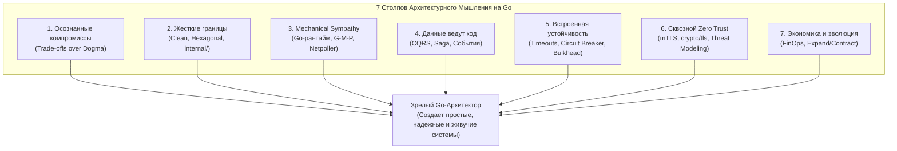
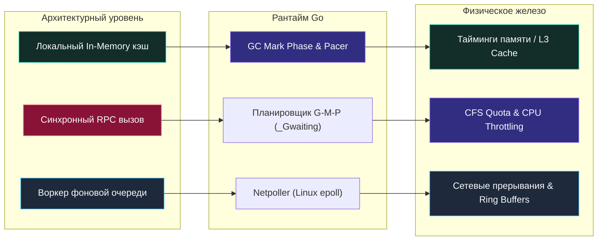

## Итоги раздела. Мышление архитектора для Go разработчика

> *«Простота — необходимое предварительное условие надежности».*    
> — Эдсгер Дейкстра  
> 
> *«Управление сложностью — вот суть программирования».*    
> — Брайан Керниган

Мы подошли к вершине нашего фундаментального путешествия по миру распределенных систем, проектирования надежного бэкенда и System Design. 

Пятьдесят три лекции назад мы начали с базовых определений: что такое архитектура, чем функциональные требования отличаются от нефункциональных, и почему простота — это самое труднодостижимое качество в инженерии. Мы спускались к кремниевым кристаллам процессоров, исследовали сетевой стек Linux, погружались в компромиссы CAP-теоремы, строили событийно-ориентированные пайплайны, настраивали инженерию хаоса и препарировали экономику облачных серверов.

Этот раздел — не просто справочник готовых рецептов. Это целостный фундамент профессионального мировоззрения. Цель этой финальной лекции — собрать все концептуальные оси в единый **Манифест архитектора на Go** и зафиксировать образ мышления, который отличает Senior и Lead инженера от рядового исполнителя.

---

### Не просто «знать паттерны», а выбирать компромиссы

Главный закон распределенных систем гласит: **в архитектуре не существует идеальных решений и серебряных пуль**. Любой выбор — это обмен одних проблем на другие.

- Выбирая между монолитом и микросервисами ([[8. Монолит. Когда он хорош и когда становится проблемой]], [[9. Микросервисы. Преимущества, недостатки и мифы]]), вы меняете простоту локальных транзакций и дешевизну деплоя на организационную независимость команд, расплачиваясь сложностью сети и распределенных сбоев.
- Выбирая между синхронным HTTP/gRPC и асинхронной очередью сообщений ([[19. Синхронное vs асинхронное взаимодействие сервисов]]), вы меняете мгновенную обратную связь на устойчивость к пиковым нагрузкам и сглаживание очередей.
- Выбирая между строгой согласованностью (Strong Consistency) и согласованностью в конечном счете (Eventual Consistency) ([[29. Consistency модели. Strong, Eventual, Causal]]), вы балансируете между риском прочитать устаревшие данные и готовностью всей системы отвечать в моменты сетевых сбоев ([[30. CAP теорема и реальные компромиссы]]).

Архитектор — это не фанатик модных технологий. Это беспристрастный инженер, который оценивает контекст задачи, опирается на строгие требования к бизнесу ([[3. Функциональные и нефункциональные требования]]) и рассчитывает бюджет ошибок SLA/SLO ([[4. SLA, SLO, SLI и как они влияют на дизайн]]).

Язык Go обостряет эту ответственность своей прямотой и прозрачностью. В Go нет тяжелых энтерпрайз-фреймворков, которые скрывают неэффективные архитектурные решения за многослойной магией рефлексии. Архитектура сервиса видна как на ладони: вы точно знаете, где выделяется память, где создаются потоки и как передаются байты по сети.

---

### Границы как фундамент

Красная нить, проходящая сквозь Clean Architecture ([[14. Clean Architecture и Dependency Rule]]), гексагональную архитектуру портов и адаптеров ([[13. Hexagonal Architecture. Ports and Adapters]]), предметно-ориентированное проектирование DDD ([[12. Domain Driven Design. Bounded Context и Aggregate]]) и модульный монолит ([[10. Модульный монолит как компромисс]]) — это понятие **архитектурной границы**.

Правильно проведенная граница предотвращает деградацию кодовой базы в «большой ком грязи» ([[53. Антипаттерны архитектуры]]) и обеспечивает эволюционную независимость компонентов.

В экосистеме Go границы выражаются кристально чисто:
1. **Интерфейсы объявляются потребителем:** В отличие от Java или C#, в Go интерфейс создается там, где он используется (driving/driven ports), а не там, где реализуется. Это гарантирует слабое зацепление (Loose Coupling).
2. **Директория `internal/` на уровне компилятора:** Компилятор Go на физическом уровне запрещает импорт внутренних пакетов за пределами родительского модуля, защищая доменные сущности от несанкционированного доступа.
3. **Контексты (`context.Context`):** Сквозная передача дедлайнов и сигналов отмены через все архитектурные слои без жесткого связывания логики с сетевым транспортом.

Мышление архитектора на Go — это привычка смотреть на код и видеть не просто набор функций, а изолированные острова бизнес-логики, защищенные четкими контрактами портов.

---

### Mechanical Sympathy: от кода к рантайму

Уникальное преимущество старшего Go-инженера — способность видеть, как абстрактные диаграммы превращаются в физические процессы в кремнии процессора и ядре Linux.

- **Планировщик G-M-P и горутины:** Синхронный вызов удерживает горутину в состоянии `_Gwaiting`. Netpoller переводит сокет в `epoll`, освобождая поток ОС (M). Но 50 000 зависших горутин удерживают 200 МБ памяти только на стеках.
- **Сборщик мусора (Garbage Collector):** Локальный кэш на миллион объектов ускоряет чтение, но перегружает фазу разметки GC, отнимая процессорное время у бизнес-логики ([[28. Кэширование. Cache Aside, Write Through, Write Back]]). Использование `bigcache`, `sync.Pool` и настройка `GOMEMLIMIT` превращают теорию в стабильный P99 latency.
- **Системные вызовы и сетевой стек:** Каждый сетевой I/O — это переключение контекста между user space и kernel space. Батчинг сообщений и пайплайны экономят миллионы инструкций CPU.
- **Противодавление (Backpressure):** Неконтролируемый прием данных без буферизации приводит к падению процесса от рук Linux `OOM Killer` ([[43. Backpressure и контроль нагрузки]]).

---

### Эволюционность и готовность к изменениям

Хорошая архитектура максимизирует количество решений, которые можно безопасно отложить на потом, и минимизирует стоимость будущих изменений.

- **Strangler Fig Pattern:** Постепенное выдавливание монолита микросервисами по одной функции за раз.
- **Параллельная эволюция данных (Expand and Contract):** Миграция схем баз данных без простоя ([[47. Миграции архитектуры без downtime]]) — золотой стандарт современной разработки.
- **Версионирование API:** Строгое соблюдение обратной совместимости SemVer и контрактов Protobuf ([[46. Версионирование сервисов и API]]), исключающее поломку мобильных клиентов.

Вы начинаете с простого модульного монолита, упакованного в один бинарник. По мере роста команды и нагрузки вы выносите отдельные модули в микросервисы через замену локального интерфейса на gRPC-клиент — без единого изменения в чистой доменной логике.

---

### Устойчивость — не опция, а базовая комплектация

В распределенной системе падение серверов, сбои оптических магистралей и деградация внешних API — это не форс-мажор, а повседневная реальность.

Архитектура обязана быть отказоустойчивой по умолчанию:
- Ни один сетевой вызов не должен выполняться без жесткого таймаута (`context.WithTimeout`).
- Ретраи обязаны сопровождаться экспоненциальной задержкой и случайным джиттером (Full Jitter), чтобы предотвратить самострел в виде Retry Storm ([[36. Circuit Breaker, Retry, Timeout и Backoff]]).
- Переборки отсеков (**Bulkhead**) изолируют сбои второстепенных модулей от ядра системы ([[37. Bulkhead и изоляция отказов]]).
- Ограничители нагрузки (**Rate Limiting**) защищают сервисы от перегрузок ([[38. Rate Limiting и защита системы]]).
- Наблюдаемость (**Observability**) — метрики Prometheus, структурированные логи `slog` и распределенные трейсы OpenTelemetry ([[39. Observability в архитектуре. Metrics, Logs, Traces]]) — закладываются на этапе проектирования, а не прикручиваются после первой аварии.

---

### Безопасность — сквозная ответственность

Безопасность невозможно добавить в проект «на последней неделе перед релизом». Это сквозной архитектурный каркас:
- **Моделирование угроз (Threat Modeling):** Анализ векторов атак STRIDE на этапе проектирования диаграммы компонентов ([[44. Безопасность архитектуры. Threat modeling]]).
- **Архитектура Zero Trust:** Сеть считается враждебной по умолчанию. Никакого слепого доверия внутреннему периметру кластера. Каждый межсервисный запрос защищен взаимной аутентификацией mTLS с криптографической проверкой сертификатов ([[45. Zero Trust и сетевые границы]]).
- Стандартные пакеты Go `crypto/tls` и `crypto/rand` обеспечивают соответствие строгим стандартам криптографической стойкости без необходимости тащить в проект сторонние зависимости сомнительного качества.

---

### Данные владеют сервисами

Интеграция систем через общую базу данных — смертный грех микросервисной архитектуры. Сервисы не должны разделять таблицы или внутренние модели хранения данных.

- **Собственная БД для каждого сервиса:** Сервис является единственным полноправным хозяином своего хранилища.
- **CQRS и Event Sourcing:** Разделение моделей чтения и записи ([[23. CQRS. Разделение чтения и записи]]) и сохранение полной истории изменений в виде неизменяемого журнала событий ([[24. Event Sourcing. Хранение событий вместо состояния]]).
- **Событийная хореография и Saga:** Асинхронная координация распределенных транзакций ([[21. Event Driven Architecture]], [[26. Saga Pattern. Оркестрация и хореография]]) с механизмом компенсирующих транзакций.

---

### Мышление архитектора: чек-лист

Приступая к проектированию новой системы или ревью существующего решения, старший Go-инженер задает себе семь контрольных вопросов:

1. **Границы (Boundaries):** Очерчены ли Bounded Contexts? Направлены ли зависимости внутрь к домену? Защищены ли внутренности пакетами `internal/`?
2. **Компромиссы (Trade-offs):** Какой профиль нагрузки (Read vs Write)? Какими свойствами CAP-теоремы мы жертвуем осознанно? Что сломается первым при росте трафика в 10 раз?
3. **Mechanical Sympathy:** Сколько горутин будет порождено на пике? Не создаст ли кэш чрезмерного давления на GC? Ограничены ли размеры буферов и пулов соединений?
4. **Устойчивость (Resilience):** Заданы ли контекстные таймауты на каждом вызове? Защищены ли клиенты Circuit Breaker'ом? Что увидят пользователи, если упадет главный мастер базы данных?
5. **Эволюционность (Evolution):** Как изменится схема данных через год? Поддерживают ли наши миграции паттерн Expand and Contract без простоя? Версионирован ли API?
6. **Стоимость (FinOps):** Сколько ядер и памяти реально утилизируют поды? Не переплачиваем ли мы за лишний межзональный трафик? Настроены ли политики устаревания логов и трейсов?
7. **Безопасность (Security):** Аутентифицирован ли каждый межсервисный запрос? Защищен ли внутренний интерфейс `pprof`? Где и как хранятся секреты и ключи шифрования?

---

> [!tip] Собеседование: Что отличает Архитектора от Сеньора?
> **Вопрос:** В чем фундаментальная разница между Senior разработчиком и Архитектором / Staff инженером?  
> **Ответ:**  
> - **Senior разработчик** мастерски отвечает на вопрос *«КАК построить компонент?»*: пишет чистый, идиоматичный, покрытый тестами и высокопроизводительный код на Go, отлично знает библиотеки и алгоритмы.
> - **Архитектор (Staff/Lead)** отвечает на вопросы *«ЧТО именно нужно строить?»*, *«ЗАЧЕМ это нужно бизнесу?»* и *«КАКОВА цена этого решения в долгосрочной перспективе?»*. Архитектор видит систему целиком — от потребностей пользователей и бизнес-модели до ограничений кремния, сетевой топологии и затрат на облачную инфраструктуру. Архитектор умеет сознательно отказаться от модного решения в пользу простого и надежного, защищая компанию от ненужной сложности.

---

### Заключение

Пятьдесят четыре лекции позади. Модуль 11 («Архитектура и System Design») завершен в полном соответствии со строгим Кернигановским стандартом качества.

Мы сформировали целостную, глубокую инженерную базу, в которой нет места магии, слепому копированию чужих рецептов и абстрактным догмам. Go — великолепный, лаконичный и мощный инструмент в руках инженера, обладающего широким архитектурным кругозором и механическим сочувствием к машине.

Но распределенные системы живут не в вакууме. Их надежность, масштабируемость и устойчивость неразрывно связаны с тем, как устроены и как функционируют хранилища информации. Впереди нас ждет масштабный, монументальный раздел, посвященный сердцу любого бэкенда: **Модуль 12 («Базы данных»)**!
