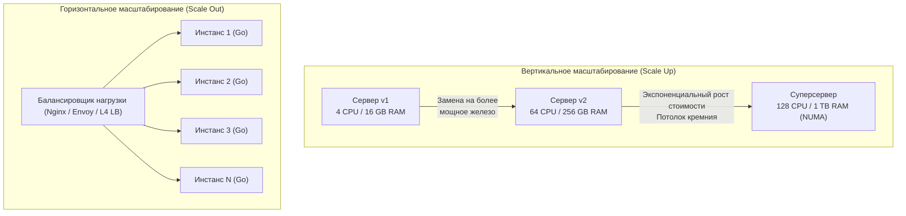

# Стратегии масштабирования: Масштабирование вверх и масштабирование вширь

> *"There are two ways of constructing a software design: One way is to make it so simple that there are obviously no deficiencies, and the other way is to make it so complicated that there are no obvious deficiencies. Scalability tests that choice mercilessly."*  
> — Свободная интерпретация классического афоризма Ч.Э.Р. Хоара

Рано или поздно любой успешный сетевой сервис на Go сталкивается с неизбежным кризисом роста. Входящий поток запросов нарастает лавиной, процессорные ядра разогреваются до предельных температур, задержка ответа (Latency) P99 пробивает допустимый потолок SLO, а планировщик рантайма начинает тратить непозволительно много времени на переключение очередей горутин.

В этот момент в инженерных дискуссиях звучит сакраментальное слово: **«Масштабирование»**. Однако за этим абстрактным термином скрываются два принципиально разных инженерных пути, каждый из которых обладает собственными законами физики, экономической стоимостью и глубоким влиянием на архитектуру кода.

В этой главе мы разберем механику вертикального и горизонтального масштабирования, изучим их аппаратные пределы (NUMA, шина памяти, насыщение сокетов) и выясним, как внутренняя модель Go взаимодействует с обоими подходами.

---

### Два пути роста



**Вертикальное масштабирование (Vertical Scaling, Scale Up)** — наращивание аппаратной мощи единственного физического или виртуального сервера: установка процессора с большим числом ядер, расширение объема оперативной памяти (RAM), переход на сверхбыстрые NVMe-накопители шины PCIe 5.0 и установка 100-гигабитных сетевых карт. Сервис на Go продолжает работать как монолитный процесс в едином адресном пространстве, но вычислительные возможности узла возрастают.

**Горизонтальное масштабирование (Horizontal Scaling, Scale Out)** — распределение нагрузки между множеством независимых физических машин или контейнеров в кластере. Вместо одной колоссальной машины запускается парк из десятков легковесных экземпляров приложения, скрытых за балансировщиком нагрузки.

---

### Вертикальное масштабирование: простота и ограничения

#### Преимущества

- **Нулевая переделка кодовой базы:** Ваш Go-сервис не обязан быть строго stateless. Локальный кэш в оперативной памяти (`sync.Map`), in-memory агрегаты и атомарные счетчики продолжают работать молниеносно.
- **Отсутствие сетевых задержек межсервисного взаимодействия:** Все горутины обмениваются данными через каналы или разделяемую память по указателям. Скорость вызова метода измеряется наносекундами, а не сетевыми миллисекундами.
- **Предельная простота эксплуатации:** Один исполняемый бинарник, один конфигурационный файл, один поток логов. Развертывание заключается в бесшовной замене бинарного файла и перезапуске процесса.

#### Недостатки и физические пределы

- **Неумолимый потолок кремния:** Нельзя бесконечно наращивать число ядер на одном сокете. Аппаратный предел для двухсокетных материнских плат сегодня составляет 128–256 ядер, а стоимость топовых серверов растет не линейно, а по крутой экспоненте.
- **Единая точка отказа (Single Point of Failure):** Выход из строя блока питания, материнской платы или паника ядра Linux приводит к тотальному простою всего сервиса.
- **Ограничения операционной системы и рантайма:**

> [!info] Под капотом: Архитектура NUMA и планировщик Go
> На серверах с большим числом ядер (64+) физическая память процессора разделена на независимые узлы (**Non-Uniform Memory Access, NUMA**). Каждое процессорное гнездо или чиплет имеет прямой скоростной доступ к «своим» планкам памяти и существенно более медленный доступ к памяти соседей через межсокетную шину (Intel UPI или AMD Infinity Fabric).  
> Планировщик Go (G-M-P) исходно проектировался без глубокого учета топологии NUMA: горутина может мигрировать между ядрами разных узлов, сбрасывая кэши L1/L2 и постоянно провоцируя межчиплетный трафик по шине памяти. Начиная с Go 1.21+ рантайм получил улучшения локальности планировщика, но полноценной изоляции потоков по NUMA-нодам в рантайме нет.

- **Сборщик мусора (Garbage Collector):** В Go на весь процесс выделен единый сборщик мусора. При разрастании кучи до сотен гигабайт фазы разметки памяти (Concurrent Mark) требуют сканирования гигантского графа указателей. Переменные `GOGC` и `GOMEMLIMIT` сглаживают пики, но не устраняют фундаментальную зависимость времени разметки от числа живых указателей.

---

### Горизонтальное масштабирование: эластичность и сложность

#### Преимущества

- **Теоретически неограниченный потолок роста:** Не хватает мощности? Добавьте еще 10, 50 или 200 инстансов в кластер Kubernetes.
- **Высокая отказоустойчивость:** Авария одного физического сервера выводит из строя лишь малую долю вычислительных мощностей; балансировщик нагрузки мгновенно исключает неисправный узел из пула маршрутизации.
- **Эластичность (Autoscaling):** Возможность динамически выделять поды в часы пиковых распродаж и гасить их ночью, оплачивая в облаке только фактически израсходованные ресурсы.
- **Географическое распределение:** Размещение узлов в разных дата-центрах (Multi-Region) снижает физический пинг для пользователей по всему миру.

#### Недостатки и вызовы

- **Экспоненциальный рост системной сложности:** Требуется развертывание балансировщиков, распределенного трейсинга, централизованного сбора логов и Service Discovery.
- **Исключение состояния из памяти:** Сервис обязан быть строго **stateless** ([[7. Stateless vs Stateful сервисы]]). Сессии пользователей, токены авторизации и кэши выносятся во внешние распределенные хранилища — Redis или PostgreSQL.
- **Сетевые накладные расходы:** Любой межсервисный обмен требует сериализации, прохождения сетевых карт и задержек в миллисекунды.
- **Конкурентность данных:** Параллельная запись нескольких инстансов в одну реляционную таблицу порождает проблему гонок и требует оптимистичных блокировок или распределенных транзакций.

---

### Mechanical Sympathy: как масштабирование влияет на Go-приложение

#### Горутины и GOMAXPROCS

При вертикальном масштабировании вы наращиваете процессорные ядра. Рантайм Go автоматически распределяет потоки планировщика, если переменная `GOMAXPROCS` установлена в значение `runtime.NumCPU()`. Для чисто вычислительных (CPU-bound) задач это дает почти линейный прирост производительности, пока горутины не упрутся в разделяемые мьютексы.

При горизонтальном масштабировании каждый экземпляр приложения работает с изолированным локальным `GOMAXPROCS` (например, 2 или 4 ядра на контейнер). Это полностью устраняет внутреннюю конкуренцию за структуры рантайма, но переносит борьбу за блокировки на уровень центральной базы данных.

#### Память и GC

```go
package monitor

import (
	"log"
	"runtime"
)

// Пример: мониторинг физических параметров кучи и рантайма
func PrintGCStats() {
	var m runtime.MemStats
	runtime.ReadMemStats(&m)
	log.Printf("HeapAlloc: %d MB", m.HeapAlloc/1024/1024)
	log.Printf("NumGC: %d", m.NumGC)
	log.Printf("GOMAXPROCS: %d", runtime.GOMAXPROCS(0))
}
```

Вертикальный рост кучи до сотен гигабайт требует филигранного тюнинга:
- Горизонтальное масштабирование делит суммарный объем памяти между множеством независимых изолированных куч.
- Десять инстансов по 2 ГБ оперативной памяти утилизируют сборщик мусора гораздо эффективнее и с меньшими хвостовыми задержками, чем один исполинский процесс на 20 ГБ кучи.

#### Системные вызовы и файловые дескрипторы

При горизонтальном масштабировании на 50 инстансов каждый под открывает собственный пул TCP-соединений к PostgreSQL и Redis. 

Если каждый под откроет по 50 соединений, суммарная нагрузка на базу данных мгновенно составит:
$$50 \text{ инстансов} \times 50 \text{ сокетов} = \mathbf{2500 \text{ открытых соединений}}$$

Это мгновенно парализует PostgreSQL из-за исчерпания памяти на процессы `postgres`. Необходимо жестко лимитировать размеры клиентских пулов в каждом экземпляре сервиса:

```go
db.SetMaxOpenConns(20) // Строгое ограничение соединений на один инстанс
db.SetMaxIdleConns(10)
```

---

### Практические паттерны масштабирования в Go

#### Worker Pool для CPU-bound задач

Для полной и равномерной утилизации всех ядер при вертикальном росте применяется пул горутин-воркеров, чье число строго откалибровано под `GOMAXPROCS`:

```go
package workerpool

type Job struct {
	ID string
}

func Process(j Job) {
	// Выполнение вычислительной задачи
}

func WorkerPool(numWorkers int) {
	jobs := make(chan Job, numWorkers*2)
	for i := 0; i < numWorkers; i++ {
		go func() {
			for job := range jobs {
				Process(job)
			}
		}()
	}
}
```

#### Семафор для ограничения конкурентности I/O-bound задач

При обработке ввода-вывода (I/O) число горутин может исчисляться тысячами. Однако для предотвращения лавинообразного исчерпания сетевых буферов ядра используется семафор:

```go
package limiter

import (
	"net/http"
)

const maxConcurrent = 1000
var sem = make(chan struct{}, maxConcurrent)

func HandleRequest(w http.ResponseWriter, r *http.Request) {
	select {
	case sem <- struct{}{}:
		defer func() { <-sem }()
		// Безопасная обработка сетевого запроса
		w.WriteHeader(http.StatusOK)
	case <-r.Context().Done():
		http.Error(w, "timeout", http.StatusServiceUnavailable)
	}
}
```

#### Graceful Shutdown при горизонтальном масштабировании

В динамическом облачном кластере поды непрерывно гасятся и перезапускаются (Scale In / Rolling Update). Сервис обязан перехватывать системные сигналы ядра `SIGTERM` и `SIGINT`, давая активным горутинам возможность дописать данные:

```go
package main

import (
	"context"
	"log"
	"net/http"
	"os"
	"os/signal"
	"syscall"
	"time"
)

func main() {
	srv := &http.Server{Addr: ":8080"}

	go func() {
		if err := srv.ListenAndServe(); err != http.ErrServerClosed {
			log.Fatal(err)
		}
	}()

	stop := make(chan os.Signal, 1)
	signal.Notify(stop, syscall.SIGTERM, syscall.SIGINT)
	<-stop

	// Выделяем 30 секунд на завершение текущих сетевых транзакций
	ctx, cancel := context.WithTimeout(context.Background(), 30*time.Second)
	defer cancel()
	if err := srv.Shutdown(ctx); err != nil {
		log.Printf("shutdown error: %v", err)
	}
}
```

> [!warning] Ловушка / Gotcha: Идемпотентность распределенного масштабирования
> При горизонтальном масштабировании за балансировщиком неизбежно возникают ситуации, когда запрос прерывается по сетевому таймауту и балансировщик автоматически повторяет его на соседний инстанс.  
> Если ваш сервис не является строго идемпотентным, платежная операция или создание заказа выполнятся повторно. Гарантии exactly-once и ключи идемпотентности мы подробно разберем в главе [[27. Idempotency и exactly once семантика]].

---

### Когда выбирать вертикальное, а когда горизонтальное масштабирование

| Критерий оценки | Вертикальное масштабирование (Scale Up) | Горизонтальное масштабирование (Scale Out) |
|---|---|---|
| **Состояние (State)** | Сервис stateful или использует огромный локальный кэш | Сервис полностью stateless, состояние вынесено в БД/Redis |
| **Характер нагрузки** | Предсказуемый, монотонный рост | Резкие всплески трафика, сезонные пики (Black Friday) |
| **Бюджет и простота** | Минимальные затраты на старте, нет сложного DevOps | Готовность содержать кластерную инфраструктуру (K8s) |
| **Отказоустойчивость** | Допустим кратковременный простой ноды | Критичен непрерывный SLA (99.99%) без единой точки отказа |
| **Инженерия команды** | Небольшая команда разработчиков | Наличие специализированной платформенной SRE-команды |
| **Аппаратный потолок** | Уперлись в NUMA-архитектуру и лимиты сокетов | Легко масштабируется простым добавлением типовых нод |

> [!tip] Собеседование: CPU-bound дилемма
> **Вопрос:** Ваш Go-сервис обрабатывает 5000 RPS. Метрика P99 latency составляет 120 мс при жестком SLO 100 мс. Профилирование показывает, что 80% времени горутины тратят внутри CPU-инструкций (парсинг JSON и сложная валидация). Что вы предпочтете: наращивать ядра (Scale Up) или добавлять поды (Scale Out)?  
> 
> **Ответ:** Это хрестоматийный CPU-bound сценарий. Добавление новых подов через горизонтальное масштабирование не решит проблему задержки отдельного запроса: каждый входящий запрос все равно будет выполнять тяжелые инструкции и укладываться в те же 120 мс (плюс накладные расходы сетевого балансировщика).  
> 
> Правильная инженерная стратегия:
> 1. Сначала оптимизировать алгоритмический горячий путь в коде: заменить медленный рефлексивный пакет `encoding/json` на кодогенерацию `easyjson` или JIT/SIMD (`sonic`), что сэкономит 30–50% тактов CPU и немедленно вернет P99 в рамки 60–70 мс.
> 2. Если оптимизация исчерпана — произвести локальный Scale Up (выделить поду больше гарантированных ядер `CPU limits`), исключив throttling планировщика cgroups в Linux.

---

### Эволюция масштабирования: от монолита к эластичности

В реальной жизни большинство успешных продуктов проходят три закономерных этапа:

1. **Фаза зарождения (MVP):** Монолит на одном сервере. Go-бинарник занимает 15 МБ, потребляет минимум оперативной памяти и утилизирует все доступные ядра. Этого с избытком хватает на первые сотни тысяч пользователей.
2. **Фаза роста:** Система упирается в потолок мощности одного сервера или бизнес начинает требовать высокой доступности (HA). Внедряется внешний балансировщик, сервис переводится в stateless-режим и запускается в 3–5 экземплярах за Nginx/Envoy. Сессионные данные переносятся в Redis.
3. **Фаза гиперроста:** Монолит разделяется на независимые сервисы, каждый из которых масштабируется горизонтально и независимо в Kubernetes по метрикам утилизации CPU и длины очереди.

Go с его статической компиляцией в единый бинарник без внешних runtime-зависимостей, моментальным стартом за миллисекунды и скромным потреблением памяти стал отраслевым стандартом построения эластичных облачных микросервисов.

---

### Итог

1. **Вертикальное масштабирование** привлекательно простотой кодовой базы и отсутствием сетевых задержек, но упирается в экспоненциальную стоимость «железа», аномалии NUMA-архитектуры и единую точку отказа.
2. **Горизонтальное масштабирование** дает эластичность и высокую доступность, но требует дисциплины проектирования Stateless-сервисов и контроля за пулами внешних соединений к базам данных.
3. Платформа Go одинаково великолепна в обоих мирах: рантайм выжимает максимум из многоядерных архитектур через `GOMAXPROCS` и моментально разворачивается в сотнях контейнеров благодаря компактным Docker-образам (на базе `scratch` или `alpine`).

Теперь, когда мы изучили механику масштабирования систем, возникает ключевой архитектурный вопрос: как именно спроектировать сервис, чтобы он мог беспрепятственно масштабироваться горизонтально? Ответ лежит в фундаментальном разделении между Stateless и Stateful компонентами, которое мы детально разберем в следующей лекции: [[7. Stateless vs Stateful сервисы]].
