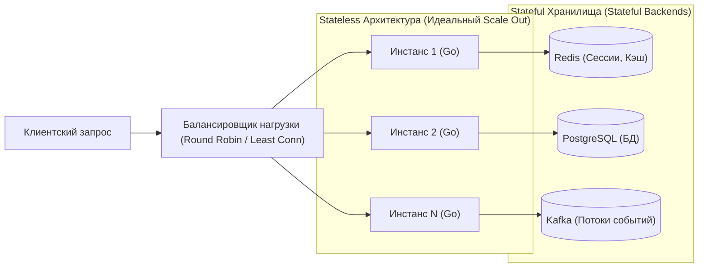
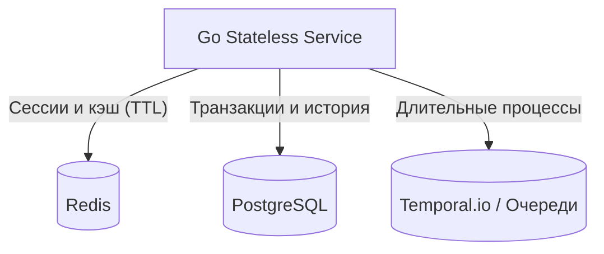

# Stateless vs Stateful сервисы: Архитектура без состояния и управление данными

> *«Система с состоянием подобна человеку, который помнит каждое обещание, данное в беседе. Система без состояния — словно математик, требующий, чтобы каждое уравнение было абсолютно самодостаточным. Математика несравнимо легче рассадить за тысячу рабочих столов».*    
> — Свободная интерпретация классического принципа Bell Labs

В предыдущей главе мы выяснили, что горизонтальное масштабирование (Scale Out) основано на способности распределять входящий трафик между десятками или сотнями независимых серверов. Однако за этим принципом стоит фундаментальное инженерное требование: любой входящий запрос должен успешно обрабатываться совершенно любым экземпляром сервиса в кластере.

Это свойство напрямую зависит от того, где именно живет **состояние системы (State)**. Разделение архитектуры на **Stateless (Без сохранения состояния)** и **Stateful (С сохранением состояния)** — это один из ключевых водоразделов в System Design, определяющий отказоустойчивость, простоту обновлений и физическую нагрузку на рантайм Go.

В этой главе мы разберем анатомию обоих подходов, выясним, почему Go идеально предрасположен к созданию stateless-сервисов, и рассмотрим проверенные шаблоны выноса состояния во внешние надежные хранилища.

---

### Определения



**Stateless-сервис** не сохраняет никакой информации о клиенте или сессии между последовательными вызовами. Каждый входящий запрос самодостаточен: он несет в себе все необходимые метаданные (токены аутентификации, идентификаторы ресурсов) для выполнения бизнес-логики. Такой сервис можно мгновенно остановить, перезапустить, обновить или размножить на сотню экземпляров — ни один клиент не заметит потери контекста.  
*Примеры:* публичные REST/gRPC API, обработчики вебхуков, конвертеры медиафайлов.

**Stateful-сервис** удерживает изменяемую информацию между запросами. Это состояние критически важно для корректности бизнес-процесса: сессии пользователей, активные сокеты чатов, данные незавершенных финансовых транзакций или локальные индексы поиска. Аварийный перезапуск такого сервиса ведет к обрыву сессий и потере промежуточных данных.  
*Примеры:* реляционные базы данных, брокеры сообщений, распределенные кэши, серверы сетевых игр реального времени.

---

### Почему Stateless — основа горизонтального масштабирования

При горизонтальном масштабировании балансировщик (L4/L7) отправляет сетевые пакеты по алгоритмам `Round Robin` или `Least Connections`. Запрос №1 от пользователя может прийти на Инстанс 1, а запрос №2 через секунду — на Инстанс 5. В Stateless-архитектуре это тривиально: оба инстанса одинаково готовы к работе.

Если же сервис спроектирован как Stateful (хранит сессии в локальной памяти), архитектура вынуждена внедрять костыли в виде **привязки сессий (Session Affinity / Sticky Sessions)**. Балансировщик обязан вычислять хэш от IP-клиента или проверять специальную cookie, направляя трафик строго на один и тот же сервер.

**Почему Sticky Sessions — это архитектурный тупик:**
1. **Каскадные отказы:** При падении инстанса все привязанные к нему пользователи выбрасываются из системы.
2. **Неравномерное распределение (Load Imbalance):** Десять «тяжелых» пользователей могут перегрузить один инстанс, пока остальные девять простаивают.
3. **Блокировка Rolling Updates:** Нельзя плавно обновить кластер в Kubernetes без принудительного разрыва сессий пользователей.

> [!info] Под капотом: Иллюзия надежности локального состояния
> Даже при использовании sticky sessions через cookie или хэш IP-адреса вы не застрахованы от потери состояния. Инстанс может упасть, Kubernetes может его перезапустить с новым IP, балансировщик может пересчитать хэш-таблицу при добавлении/удалении нод. В распределённой системе **единственный надёжный способ сохранить состояние — вынести его во внешнее хранилище**, спроектированное быть stateful: Redis, PostgreSQL, Kafka.

---

### Go и Stateless: естественная пара

Философия языка Go — явность, простота и механическая строгость — идеально согласуется со Stateless-парадигмой.

#### Request-scoped контекст

Пакет `context` — фундаментальная основа stateless-обработки в Go. Контекст зарождается в момент принятия HTTP-сокета, пронизывает все слои бизнес-логики и базы данных, неся таймауты, сигналы отмены и сквозные ID трассировки, специфичные для *конкретного* запроса. Как только обработчик завершает работу, контекст и все связанные с ним объекты утилизируются сборщиком мусора.

```go
package handler

import (
	"context"
	"net/http"
)

type contextKey string
const requestIDKey contextKey = "request_id"

func generateRequestID() string {
	return "req-12345"
}

func HandleOrder(w http.ResponseWriter, r *http.Request) {
	ctx := r.Context()
	
	// Добавляем строго request-scoped метаданные в контекст
	ctx = context.WithValue(ctx, requestIDKey, generateRequestID())
	
	// Передаем контекст дальше в use case слой
	_ = ctx
	w.WriteHeader(http.StatusOK)
}
```

> [!warning] Ловушка / Gotcha: context.WithValue не для глобального состояния
> Не используйте `context.WithValue` для передачи данных, которые должны пережить запрос. Контекст — это не замена глобального состояния или кэша. Попытка использовать его для хранения состояния между запросами — антипаттерн, приводящий к размыванию типизации и утечкам памяти.

#### Отсутствие глобальных переменных по умолчанию

В идиоматичном Go-коде глобальное изменяемое состояние считается дурным тоном. Вместо опасных глобальных карт `var globalCache map[string]User` зависимости передаются явно в структуры через параметры конструктора:

```go
package service

import (
	"database/sql"
	"github.com/redis/go-redis/v9"
)

type Service struct {
	cache *redis.Client
	db    *sql.DB
}

func NewService(cache *redis.Client, db *sql.DB) *Service {
	return &Service{cache: cache, db: db}
}
```

Каждый экземпляр микросервиса получает собственные независимые пулы сокетов к внешним базам данных, не сохраняя локального состояния в памяти.

#### Горутины и локальное состояние

Горутины внутри одного процесса делят общее адресное пространство. Соблазн использовать `sync.Map` или глобальные срезы для кэширования между вызовами часто подталкивает разработчиков к созданию неявных stateful-ловушек:

```go
package badpractice

import (
	"encoding/json"
	"net/http"
	"sync"
)

// ОПАСНО для горизонтально масштабируемого сервиса:
var localCache sync.Map

func Handler(w http.ResponseWriter, r *http.Request) {
	key := r.URL.Query().Get("key")
	if val, ok := localCache.Load(key); ok {
		json.NewEncoder(w).Encode(val)
		return
	}
	// ...
}
```

Такой сервис невозможно надежно масштабировать за балансировщиком: кэш инстанса А невидим инстансу Б. Пользователи будут наблюдать непредсказуемое мерцание данных в зависимости от того, на какой под смаршрутизируется очередной запрос.

---

### Управление состоянием в Go: выносим наружу

Если бизнес-логике требуется хранить состояние, системный архитектор обязан вынести его в специализированные отказоустойчивые сервисы.



#### 1. Сессии пользователей → Redis

Вместо локальных карт `map[sessionID]User` сессия сохраняется в распределенном Redis с автоматическим временем жизни (TTL):

```go
package session

import (
	"context"
	"encoding/json"
	"errors"

	"github.com/redis/go-redis/v9"
)

var ErrSessionNotFound = errors.New("сессия не найдена")

type User struct {
	ID    string `json:"id"`
	Email string `json:"email"`
}

type SessionManager struct {
	redis *redis.Client
}

func (s *SessionManager) GetUserFromSession(ctx context.Context, sessionID string) (*User, error) {
	data, err := s.redis.Get(ctx, "session:"+sessionID).Bytes()
	if err == redis.Nil {
		return nil, ErrSessionNotFound
	}
	if err != nil {
		return nil, err
	}
	var user User
	if err := json.Unmarshal(data, &user); err != nil {
		return nil, err
	}
	return &user, nil
}
```

#### 2. Кэш → Redis или Memcached

Внешний кэш решает проблему согласованности между репликами приложения и сохраняет накопленные данные при плановом перезапуске подов в Kubernetes.

#### 3. Длительные операции и workflow → Temporal или очереди

Если бизнес-процесс длится минуты, часы или дни (например, оплата заказа, ожидание подтверждения банком, доставка), ни в коем случае нельзя держать состояние в памяти Go-приложения:
- **База данных:** запись статуса процесса в таблицу `OrderProcess`.
- **Оркестратор Temporal.io:** движок распределенных workflow, гарантирующий детерминированное сохранение и восстановление состояния.
- **Очереди сообщений (RabbitMQ, Kafka):** асинхронные цепочки событий с отсроченной доставкой.

```go
package process

import (
	"context"
	"database/sql"
	"time"
)

// Хорошо: состояние процесса зафиксировано в СУБД
type OrderProcess struct {
	ID        string
	Status    string
	CreatedAt time.Time
}

type Service struct {
	db *sql.DB
}

func (s *Service) UpdateOrderStatus(ctx context.Context, orderID, status string) error {
	_, err := s.db.ExecContext(ctx, 
		"UPDATE orders SET status = $1 WHERE id = $2", status, orderID)
	return err
}
```

---

### Mechanical Sympathy: физическая цена состояния

Хранение состояния в памяти процесса влечет прямые аппаратные последствия:

#### Память и Garbage Collector
Локальный кэш на миллионы записей раздувает кучу (Heap). При каждом цикле сборки мусора GC вынужден тратить такты процессора на обход миллионов долгоживущих указателей. При горизонтальном масштабировании память мультиплицируется: 10 подов по 2 ГБ кэша съедят 20 ГБ физической памяти нод. Вынос кэша в Redis оставляет кучу Go компактной, сводя паузы GC к микросекундам.

#### Cache Locality и процессорные кэши
Локальная память обеспечивает попадание в кэши L1/L2 процессора (задержка ~1–4 нс). Однако попытка синхронизировать этот локальный кэш между репликами через сетевые протоколы сжигает весь выигрыш. Сетевой раундтрип до Redis по локальной сети дата-центра занимает **~0.5–1 мс**, что на три порядка быстрее дисковой базы данных и обеспечивает идеальную масштабируемость.

#### Системные вызовы и сеть
Если сервис сохраняет файлы (аватары пользователей, PDF-отчеты) на локальный диск сервера, горизонтальное масштабирование невозможно без использования распределенных файловых систем (NFS, EFS) или масштабируемого объектного хранилища (**S3**).

---

### Когда Stateful оправдан

Не все компоненты обязаны быть stateless. Существуют фундаментальные классы систем, чье предназначение — надежно хранить состояние:

1. **Реляционные и распределенные базы данных** (PostgreSQL, Cassandra) — реализуют алгоритмы консенсуса (Raft, Paxos), репликацию и дисковые WAL-журналы.
2. **Брокеры очередей** (Kafka, RabbitMQ) — буферизуют терабайты сообщений на NVMe-дисках.
3. **Распределенные кэши** (Redis Cluster) — управляют шардированием и партициями данных.
4. **Сетевые игровые серверы реального времени** — где задержка в 5 мс недопустима, и физическое состояние матча рассчитывается в памяти сервера (а при отказе сбрасывается или восстанавливается из реплики).

Для таких сценариев в распределенных системах применяются строгие механизмы шардирования и репликации ([[31. Partitioning и Sharding]], [[32. Репликация. Leader Follower и Multi Leader]]).

> [!tip] Собеседование: Архитектура чата реального времени
> **Вопрос:** Вы проектируете сервис чатов. Сообщения должны доставляться мгновенно, а история сохраняться навсегда. Как разделить состояние?  
> 
> **Ответ:** Применяется гибридная архитектура с четким разделением состояния по жизненному циклу:
> - **Краткосрочное состояние (Stateful WebSockets):** активные сетевые TCP/WebSocket соединения и перечень комнат хранятся в оперативной памяти конкретных серверов. При разрыве связи клиент мгновенно переподключается к соседнему поду, а маршрутизация сообщений между подами обеспечивается через **Redis Pub/Sub** или Kafka.
> - **Долгосрочное состояние (Stateless Workers + Storage):** история переписки асинхронно сбрасывается stateless-воркерами в персистентную базу данных (Cassandra/PostgreSQL).

---

### Паттерны проектирования Stateless сервисов в Go

#### 1. Dependency Injection через конструкторы
Все внешние ресурсы (клиенты баз данных, Redis, сетевые интерфейсы) внедряются явно при создании сервиса. Глобальное состояние исключено:

```go
package app

import "github.com/redis/go-redis/v9"

type OrderRepository interface{}
type PaymentClient interface{}

type OrderService struct {
	repo    OrderRepository
	payment PaymentClient
	cache   *redis.Client
}

func NewOrderService(repo OrderRepository, payment PaymentClient, cache *redis.Client) *OrderService {
	return &OrderService{repo: repo, payment: payment, cache: cache}
}
```

#### 2. Middleware для извлечения контекста запроса
Сессионные токены, роли и метаданные пользователя расшифровываются в Middleware и передаются строго внутри `context.Context`:

```go
package auth

import (
	"context"
	"net/http"
)

type userContextKey string
const userKey userContextKey = "authenticated_user"

type User struct {
	ID string
}

func extractUserFromToken(r *http.Request) (*User, error) {
	return &User{ID: "usr-42"}, nil
}

func AuthMiddleware(next http.Handler) http.Handler {
	return http.HandlerFunc(func(w http.ResponseWriter, r *http.Request) {
		user, err := extractUserFromToken(r)
		if err != nil {
			http.Error(w, "unauthorized", http.StatusUnauthorized)
			return
		}
		ctx := context.WithValue(r.Context(), userKey, user)
		next.ServeHTTP(w, r.WithContext(ctx))
	})
}
```

#### 3. Бесшовный Graceful Shutdown
Использование `http.Server.Shutdown()` с контекстом таймаута гарантирует, что при выводе пода из кластера активные HTTP-транзакции завершатся корректно без обрыва клиентских соединений (как мы разбирали в [[6. Вертикальное и горизонтальное масштабирование]]).

---

### Связь с CAP-теоремой и распределенными системами

Выбор между stateless и stateful архитектурой напрямую соотносится с компромиссами CAP-теоремы ([[30. CAP теорема и реальные компромиссы]]):
- **Stateless-сервисы** тяготеют к высокой доступности (**AP**), так как любая нода взаимозаменяема.
- **Stateful-хранилища** (например, реляционные базы с синхронной репликацией) обязаны строго блюсти согласованность (**CP**), жертвуя доступностью при сетевых разделениях кластера.

---

### Итог

1. **Stateless-сервисы** не сохраняют данные о клиенте в локальной памяти. Они идеально подходят для горизонтального масштабирования, отказоустойчивы и не требуют сложных механизмов Sticky Sessions.
2. Язык Go органически поощряет stateless-подход благодаря сквозному `context.Context`, явному Dependency Injection и отсутствию глобальных мутаций.
3. Локальное состояние (in-memory maps) кажется заманчиво быстрым, но парализует горизонтальное масштабирование и перегружает Garbage Collector.
4. Выносите долгоживущее состояние в специализированные хранилища (Redis, PostgreSQL, Temporal, S3), сохраняя вычислительный слой Go легким и эластичным.

Теперь, когда мы освоили фундамент системного масштабирования, пора обратиться к классической форме архитектуры, с которой начинается практически каждый стартап: **Монолиту**. В следующей лекции мы разберем, когда монолитная архитектура является оптимальным выбором, а когда превращается в непреодолимую проблему: [[8. Монолит. Когда он хорош и когда становится проблемой]].
