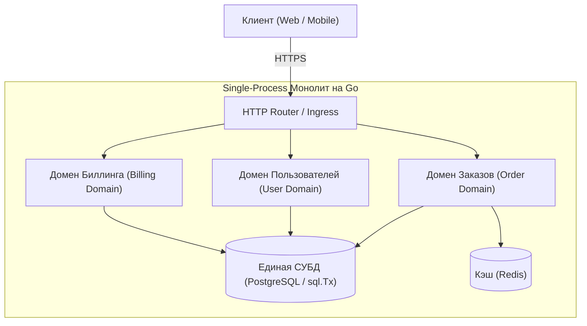
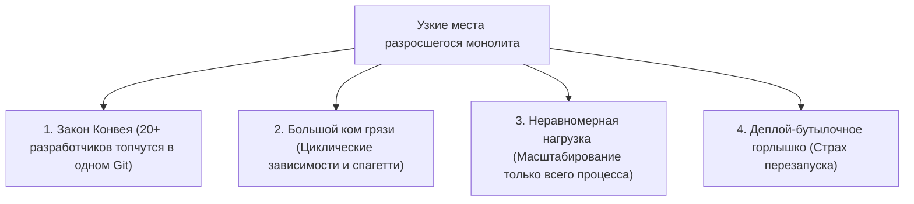
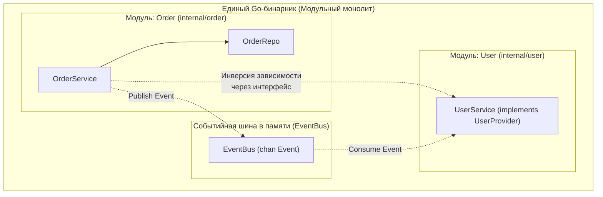

# Монолитная архитектура: Когда она идеальна и когда становится проблемой

> *«Каждому известно, что отладка вдвое сложнее, чем написание программы с нуля. Поэтому, если вы вложили в код всю свою изобретательность, как вы собираетесь его отлаживать? Простой монолит бесконечно проще понять и отладить, чем полсотни распределенных сервисов».*    
> — Брайан Керниган

В индустрии программного обеспечения периодически вспыхивают волны технологической моды. В последние годы под флагом «современного бэкенда» микросервисы нередко провозглашались единственно верным путем для любого проекта. В этой шумихе легко забыть фундаментальную истину: подавляющее большинство крупнейших и финансово успешных цифровых платформ мира (от Google и Shopify до Basecamp и GitHub) либо начинали как монолиты, либо до сих пор продолжают оставаться ими в своей основе, обслуживая миллионы запросов в секунду.

Монолит — это исторически первая, наиболее естественная и производительная архитектурная форма программной системы.

Цель этой главы — дать трезвый, инженерный анализ монолита без догматизма и предубеждений. Мы разберем анатомию монолитных систем, покажем, почему рантайм Go делает монолит невероятно быстрым, определим четкие границы, за которыми он превращается в неуправляемый «большой ком грязи» (Big Ball of Mud), и раскроем паттерн **Модульного монолита** как прагматичную золотую середину.

---

### Что такое монолит

**Монолит** — это архитектурный стиль, при котором вся функциональность системы компилируется в единый исполняемый бинарный артефакт и развертывается как единый операционный процесс операционной системы. Все функциональные домены — управление учетными записями, биллинг, обработка заказов, отправка уведомлений — сосуществуют в одном виртуальном адресном пространстве процесса и взаимодействуют друг с другом через мгновенные вызовы функций в стеке памяти, а не через сетевые протоколы.



В Go-мире монолит часто ассоциируется с одним `func main()` и набором пакетов, слинкованных в один бинарник.

В инженерной практике выделяют три разновидности монолитов:
1. **Single-process монолит:** Классическая архитектура — один репозиторий, единый бинарник на Go, один запущенный процесс, общая память.
2. **Модульный монолит (Modular Monolith):** Тот же единый исполняемый файл и процесс, но кодовая база строго разграничена на независимые доменные модули с жесткими границами через интерфейсы Go. Это осознанный инженерный выбор, обеспечивающий порядок и легкий переход к микросервисам в будущем.
3. **Распределённый монолит (Distributed Monolith):** Опаснейший антипаттерн — система формально распилена на десятки микросервисов, но между ними сохраняются жесткие циклические зависимости в базах данных и общие схемы. В результате система вобрала в себя все сетевые задержки и нестабильность микросервисов, сохранив адскую связность худшего монолита.

---

### Преимущества монолита

#### 1. Простота разработки и отладки

Единая кодовая база, один репозиторий (Monorepo). Любой разработчик в команде способен развернуть и запустить всю инфраструктуру локально буквально в одну команду:

```bash
go run ./cmd/app
```

Отладка в монолите тривиальна: трассировка вызовов не обрывается сетевыми границами. Поиск по коду (`grep`, `go-to-definition`) мгновенно находит любые символы по всей системе. Локальный профилировщик `pprof` снимает слепок всего процесса целиком, а переход к определению функции (`go-to-definition`) в IDE мгновенно открывает реализацию в соседнем пакете.

#### 2. Низкая задержка (Latency)

Межмодульное взаимодействие внутри Go-монолита — это прямой вызов функции процессором. Он занимает **~2–5 наносекунд**, передавая аргументы через быстрые регистры CPU в соответствии с ABIInternal.

Для сравнения: даже самый оптимизированный gRPC-вызов между микросервисами внутри одной локальной сети требует сериализации в Protobuf, прохождения сетевых буферов ядра Linux, рукопожатия TCP, работы маршрутизатора и десериализации — это минимум **0.5–2 миллисекунды** (в сотни тысяч раз дольше!).

#### 3. Транзакционная целостность «из коробки»

В монолитной архитектуре мощь реляционной базы данных доступна на 100%. Вы можете обернуть комплексную бизнес-операцию — проверку баланса, списание средств, резервирование товара на складе и создание заказа — в единую ACID-транзакцию `sql.Tx`. База данных гарантирует атомарность на уровне физического диска.

В микросервисах эта задача превращается в кошмар распределенных транзакций: вам придется внедрять протокол 2PC ([[25. Distributed Transactions. 2PC и проблемы]]) или саги с компенсационными действиями ([[26. Saga Pattern. Оркестрация и хореография]]).

```go
package service

import (
	"context"
	"database/sql"
	"errors"
)

type OrderService struct {
	db          *sql.DB
	paymentRepo PaymentRepo
	orderRepo   OrderRepo
}

type CreateOrderReq struct {
	UserID string
	Amount int64
}

type PaymentRepo interface {
	Debit(ctx context.Context, tx *sql.Tx, userID string, amount int64) error
}

type OrderRepo interface {
	Create(ctx context.Context, tx *sql.Tx, req *CreateOrderReq) error
}

func (s *OrderService) CreateOrder(ctx context.Context, req *CreateOrderReq) error {
	tx, err := s.db.BeginTx(ctx, nil)
	if err != nil {
		return err
	}
	defer tx.Rollback()

	// Списание денег и создание заказа — строгая атомарная ACID транзакция!
	if err := s.paymentRepo.Debit(ctx, tx, req.UserID, req.Amount); err != nil {
		return err
	}
	if err := s.orderRepo.Create(ctx, tx, req); err != nil {
		return err
	}

	return tx.Commit()
}
```

#### 4. Простой деплой и эксплуатация

Один скомпилированный бинарный файл Go без внешних библиотек развертывается за доли секунды. Вам не требуется на старте оркестратор Kubernetes, сложный Service Mesh (Istio), Consul для discovery и распределенная телеметрия Jaeger. Простой запуск через Systemd или запуск одного контейнера в Docker экономит колоссальные ресурсы команды.

#### 5. Эффективное использование ресурсов

Монолит разделяет общие пулы горутин, соединения с базой данных и оперативную память. Сборщик мусора (GC) работает с единым пространством кучи, а планировщик G-M-P гармонично распределяет всю нагрузку по ядрам процессора.

> [!info] Под капотом: Mechanical Sympathy в монолите
> В Go монолит позволяет максимально использовать преимущества рантайма. Планировщик горутин (G-M-P) эффективно мультиплексирует всю нагрузку на потоки ОС. Кэши CPU утилизируются лучше, так как код и данные разных «модулей» находятся в одном адресном пространстве и могут попадать в одни и те же кэш-линии. Системные вызовы совершаются централизованно через `netpoller`.

---

### Когда монолит становится проблемой

Однако при масштабировании организации монолит начинает проявлять свои темные стороны.



#### 1. Масштабирование разработки (Закон Конвея)

**Закон Конвея** гласит: *организации проектируют системы, копирующие структуру их внутренних коммуникаций*.  
Когда над единым репозиторием начинает работать более 20–30 инженеров, монолит превращается в поле боя. Слияния веток (Merge Conflicts) становятся ежедневным испытанием, релизные очереди блокируют доставку фич, а границы ответственности между командами стираются.

#### 2. Связанность кода и «большой ком грязи»

При отсутствии железной архитектурной дисциплины монолит деградирует в клубок взаимосвязанного кода. Разработчику требуется быстро получить данные о заказах пользователя — и он просто импортирует чужой пакет:

```go
// АНТИПАТТЕРН: Нежелательная жесткая связанность модулей
package user

import "myapp/order" // Пакет user теперь напрямую привязан к order

func (u *User) LastOrders() []order.Order {
    return order.FindByUserID(u.ID) // Прямой вызов инфраструктурной логики
}
```

Компилятор Go запрещает циклические импорты (`import cycle not allowed`), что предотвращает худшие сценарии, но не защищает от смысловой хаотической связанности.

#### 3. Масштабирование производительности

Монолит масштабируется исключительно как единое целое ([[6. Вертикальное и горизонтальное масштабирование]]). Если модуль формирования тяжелых PDF-отчетов потребляет 95% CPU, вы вынуждены масштабировать весь монолит, раздувая количество экземпляров легких модулей авторизации и каталога. Это приводит к расточительному расходу серверов.

#### 4. Технологический lock-in и замедление инноваций

В монолите сложно точечно экспериментировать. Если для модуля векторного поиска требуется специфическая СУБД или оптимизированные библиотеки на C++/Rust, внедрение этого функционала затрагивает всю кодовую базу.

#### 5. Деплой как бутылочное горлышко

Любая микроскопическая правка в тексте ошибки требует полной пересборки и перезапуска всего гигантского сервиса.

> [!warning] Ловушка / Gotcha: Go-монолит и деплой без даунтайма
> **Go-монолит и деплой без даунтайма.** Перезапуск монолита Go неизбежно разрывает все WebSocket-соединения, долгие HTTP-запросы и фоновые горутины. Graceful shutdown помогает завершить текущие запросы, но не сохраняет состояние длительных процессов.  
> Если ваш сервис держит постоянные соединения с клиентами (чат, стриминг), плавный перезапуск монолита становится сложной задачей, решаемой через проксирование соединений (например, с помощью сокетной опции `SO_REUSEPORT` или внешнего балансировщика с плавным draining).

---

### Mechanical Sympathy: Go-монолит под нагрузкой

В условиях высоких нагрузок в монолитном процессе Go проявляются важные физические эффекты:

1. **Горутины и общая куча:**  
   Все модули делят единое пространство памяти. Если разработчик в модуле аналитики допустил утечку горутины (например, забытый `for { ... }` или утечка горутины на заблокированном канале), число горутин вырастет до сотен тысяч, что вызовет сбой всего сервиса по OOM Killer. Требуется непрерывный мониторинг функции `runtime.NumGoroutine()`.
2. **Давление на сборщик мусора (GC Pressure):**  
   Если один второстепенный модуль непрерывно парсит гигабайтные XML-файлы, выделяя миллионы временных структур, сборщик мусора Go будет регулярно переводить приложение в фазы Mark Assist, снижая пропускную способность критически важных платежных эндпоинтов.
3. **Блокировки разделяемых ресурсов (Contention):**  
   Использование одного и того же глобального мьютекса `sync.Mutex` или канала несколькими модулями способно вызвать заторы планировщика и деградацию хвостовых задержек.

---

### Модульный монолит: золотая середина

Чтобы сохранить непревзойденную скорость разработки монолита и защитить систему от превращения в хаос, зрелые инженеры применяют концепцию **Модульного монолита (Modular Monolith)**.



#### 1. Организация кода по бизнес-доменам

Вместо технического разделения «все контроллеры в одной папке, все модели в другой» структура выстраивается вокруг предметных областей:

```
cmd/
  app/
    main.go
internal/
  order/
    handler.go
    service.go
    repository.go
  user/
    handler.go
    service.go
    repository.go
  shared/
    db.go
    redis.go
pkg/
  events/
    bus.go
```

Каталог `internal` компилятором Go защищает модули от несанкционированного импорта извне.

#### 2. Инверсия зависимостей через интерфейсы (Clean Architecture)

Модули никогда не ссылаются на структуры данных соседних доменов напрямую. Зависимости формулируются через интерфейсы на стороне вызывающего (принцип Clean Architecture, [[14. Clean Architecture и Dependency Rule]]):

```go
// internal/order/service.go
package order

import "context"

type User struct {
	ID   string
	Name string
}

// Order сам определяет контракт на то, что ему нужно от пользователя
type UserService interface {
	GetUser(ctx context.Context, userID string) (*User, error)
}

type Repository interface{}

type OrderService struct {
	userService UserService
	repo        Repository
}

func NewOrderService(userService UserService, repo Repository) *OrderService {
	return &OrderService{userService: userService, repo: repo}
}
```

Пакет `user` реализует сигнатуру `GetUser`, но модуль `order` ничего не знает о внутренней кухне пользователя. Если в будущем `user` потребуется вынести в отдельный gRPC-микросервис, в коде `order` не изменится ни единой строки — достаточно будет подставить gRPC-клиент, реализующий интерфейс `UserService`.

#### 3. Внутрипроцессная событийная шина (In-Process Event Bus)

Для асинхронного уведомления модулей используется событийная шина на каналах Go:

```go
package events

import "sync"

type Event struct {
	Name    string
	Payload any
}

type EventBus struct {
	mu   sync.RWMutex
	subs map[string][]chan Event
}

func NewEventBus() *EventBus {
	return &EventBus{
		subs: make(map[string][]chan Event),
	}
}

func (b *EventBus) Publish(event Event) {
	b.mu.RLock()
	defer b.mu.RUnlock()
	for _, ch := range b.subs[event.Name] {
		select {
		case ch <- event:
		default: // Non-blocking: не блокируем отправителя
		}
	}
}
```

При необходимости эта шина за один день заменяется на внешние брокеры Kafka/NATS.

---

### Когда выбирать монолит

- **Ранняя стадия продукта (MVP / Стартап):** Вы еще не знаете, примет ли рынок ваш продукт. Скорость итераций и легкость рефакторинга стократ важнее теоретической масштабируемости.
- **Небольшая команда:** До 10–15 разработчиков монолит обеспечивает максимальную эффективность.
- **Жёсткие требования к задержке и консистентности:** Локальные вызовы в наносекунды и строгие ACID-транзакции в одной базе данных.
- **Сложная предметная область:** Границы контекстов (Bounded Contexts, [[12. Domain Driven Design. Bounded Context и Aggregate]]) еще не устоялись. Передвинуть границу пакета в монолите занимает секунды; разделить микросервисы по живой базе данных — месяцы боли.

---

### Когда пора переходить на микросервисы

- **Разрастание команды (> 20–30 инженеров):** Закон Конвея требует предоставить командам автономию в релизах и архитектуре.
- **Асимметричная нагрузка:** Модуль обработки видео требует 50 серверов с GPU, а модуль аутентификации работает на одном ядре.
- **Гетерогенный стек:** Необходимость запуска специализированных сервисов на Python (Machine Learning), Rust или C++.
- **Изоляция сбоев (Bulkhead):** Сбой вспомогательного функционала рекомендаций не должен прерывать оформление заказов ([[37. Bulkhead и изоляция отказов]]).

> [!tip] Собеседование: Архитектурный выбор для нового проекта
> **Вопрос:** Вам поручено спроектировать новую систему для развивающегося стартапа. Бизнес-требования меняются еженедельно. С какой архитектуры вы начнете?  
> 
> **Ожидаемый ответ:** Начну с **Модульного монолита на Go**. Это обеспечит максимальную скорость разработки, избавит команду от накладных расходов на оркестрацию микросервисов и позволит использовать строгие ACID-транзакции. При этом я сразу заложу строгие доменные границы через Go-интерфейсы и структуру `internal/`, чтобы любой зрелый модуль можно было за несколько спринтов вычленить в микросервис при росте команды или нагрузки.

---

### Итог

1. Монолит — это проверенная, зрелая и чрезвычайно производительная архитектурная форма.
2. Язык Go идеально приспособлен для создания монолитов: статическая линковка, быстрый старт, минимальное потребление памяти и мощный планировщик G-M-P выжимают максимум из каждого сервера.
3. Модульный монолит с разделением доменов через интерфейсы — лучший способ контролировать сложность без преждевременных накладных расходов распределенных систем.
4. Переход к микросервисам должен диктоваться не модой, а организационными законами (Закон Конвея) и непреодолимыми требованиями к независимой масштабируемости.

В следующей лекции мы детально разберем мир независимых распределенных сервисов: [[9. Микросервисы. Преимущества, недостатки и мифы]].
