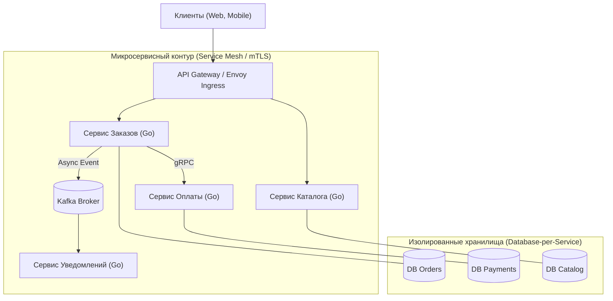
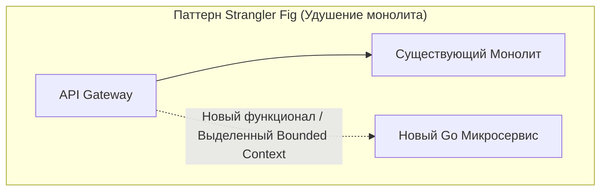

# Микросервисы: Преимущества, суровая реальность и мифы

> *"Microservices solve people problems, not software problems. If you break a system into fifty remote pieces without an overwhelming organizational necessity, you are trading in-memory function calls for network partitions and latency."*  
> — Свободная интерпретация классического принципа Bell Labs

После подробного разбора монолитной архитектуры настало время исследовать подход, безраздельно доминирующий в профессиональном дискурсе последнего десятилетия — **Микросервисы (Microservices)**.

Вокруг микросервисов сложилось колоссальное количество околоинженерных мифов. Одни преподносят их как универсальную «серебряную пулю», якобы автоматически решающую любые проблемы производительности и масштабирования. Другие, обжегшись на неудачных миграциях, называют микросервисы абсолютным злом и источником бесконечных ночных аварий.

Истина, как всегда в серьезной инженерии, лежит в плоскости трезвого расчета, понимания цены компромиссов и физики вычислительных сетей.

В этой главе мы разберем микросервисную парадигму без рекламного хайпа: выделим ее фундаментальные преимущества, исследуем неизбежную «цену билета», развенчаем главные мифы и рассмотрим, почему язык Go стал фактическим стандартом для построения облачных микросервисов.

---

### Определение микросервиса

**Микросервис** — это небольшой, автономный программный сервис, который функционирует в собственном изолированном процессе операционной системы, развертывается независимо от остальной части системы и взаимодействует с другими сервисами исключительно по сети через стандартизированные легковесные протоколы (HTTP/REST, gRPC или асинхронные очереди сообщений).

Каждый микросервис строго отвечает за единый ограниченный бизнес-контекст (**Bounded Context**, подробно рассмотренный в [[12. Domain Driven Design. Bounded Context и Aggregate]]) и владеет собственной базой данных (**Database-per-Service**).



Ключевое слово в этом определении — **независимость**. Если вы не можете изменить, протестировать и развернуть сервис А без одновременного согласования и выкатки сервиса Б, то у вас нет микросервисов. У вас распределенный монолит.

---

### Реальные преимущества микросервисов

#### 1. Независимое развёртывание (Deployability)

Главная причина, ради которой корпорации решаются на микросервисную революцию. В монолите изменение валидации одного поля в форме регистрации требует пересборки и полного перезапуска многогигабайтного процесса.

В микросервисной архитектуре вы деплоите исключительно измененный сервис. Это:
- Снижает радиус взрыва (Blast Radius) возможной ошибки.
- Ускоряет цикл обратной связи от пользователей до десятков релизов в день.
- Позволяет командам двигаться с индивидуальной скоростью, не оглядываясь на релизные поезда коллег.

В Go это преимущество проявляется особенно ярко благодаря статической линковке: компилятор собирает самодостаточный бинарник без внешних библиотек (libc), который запаковывается в микроскопический Docker-образ на базе **scratch** или **distroless** размером всего **5–20 МБ**. Такой контейнер скачивается и стартует в кластере за считанные миллисекунды.

#### 2. Независимое масштабирование (Scalability)

В реальных продуктах нагрузка распределяется неравномерно. Сервис каталога товаров испытывает колоссальную нагрузку на чтение (50 000 RPS), в то время как сервис оформления заказов принимает лишь 200 RPS, но требует повышенной надежности. 

В микросервисной архитектуре вы масштабируете только те компоненты, которые уперлись в аппаратные лимиты: поднимаете 50 подов каталога и оставляете 3 пода для заказов. Это оптимизирует использование серверных ресурсов и облачный бюджет.

#### 3. Изоляция отказов (Fault Isolation)

Если в монолите фоновая горутина запаникует без конструкции `recover`, ядро рантайма Go завершит работу всего процесса. В микросервисах падение сервиса рекомендаций не мешает пользователю оплатить товар: интерфейс отобразит пустой блок рекомендаций, но ключевой бизнес-процесс останется в строю (частичная деградация через **Circuit Breaker** и fallback).

#### 4. Технологическая свобода (Polyglot Persistence)

Хотя в Go-экосистеме язык Go закрывает до 95% бэкенд-задач, микросервисы дают право прагматичного выбора: сервис аналитики и обучения нейросетей можно написать на Python, микросервис обработки криптографии или медиапотоков — на Rust/C++, а основное API оставить на быстром и надежном Go. Также каждый сервис выбирает оптимальную СУБД: от PostgreSQL до Redis и ClickHouse.

#### 5. Соответствие структуре команд (Закон Конвея)

**Закон Конвея** неумолим: для эффективной работы большой компании границы микросервисов должны повторять границы продуктовых команд. Команда платежей полностью владеет платежным сервисом, его репозиторием, пайплайном CI/CD и дежурствами, не требуя бесконечных согласований с командой каталога.

---

### Недостатки и вызовы микросервисов

Переход на микросервисы — это классическая инженерная сделка: вы покупаете организационную независимость ценой резкого усложнения программной и сетевой модели.

#### 1. Сложность распределённых систем

Микросервисы мгновенно погружают инженера в жестокий мир распределенных систем. Сеть по определению ненадежна: пакеты теряются, сокеты зависают, роутеры перезагружаются, а задержки (Latency) подчиняются законам теории вероятностей.

Код, который в монолите представлял собой вызов функции на стеке:

```go
// Монолит: наносекундный вызов в памяти
user, err := userService.GetUser(ctx, userID)
```

в микросервисах превращается в многослойную сетевую эпопею:

```go
// Микросервисы: сетевой вызов со всей распределенной обвязкой
ctx, cancel := context.WithTimeout(ctx, 200*time.Millisecond)
defer cancel()

user, err := userClient.GetUser(ctx, &pb.GetUserRequest{Id: userID})
if err != nil {
    // Что произошло? Сетевой таймаут? Downstream упал?
    // Нужен ли retry? Не перегрузим ли мы упавший сервис?
    // Есть ли fallback-ответ из кэша?
}
```

#### 2. Сетевые задержки и накладные расходы

Каждый межсервисный запрос добавляет физический сетевой раундтрип (RTT), прохождение коммутаторов и затраты процессора на сериализацию. 

Стандартный `encoding/json` в Go работает через рефлексию и создает множество аллокаций. Использование быстрых библиотек (`easyjson`, `goccy/go-json`) или бинарного **Protobuf** в gRPC снижает издержки, но сетевой вызов все равно остается в тысячи раз медленнее вызова функции внутри одного адресного пространства.

#### 3. Распределённые транзакции и консистентность

В микросервисах больше нет единого `sql.Tx`. Транзакция, затрагивающая несколько сервисов (списать деньги, зарезервировать товар, начислить бонусы), требует сложных распределенных координаторов:
- Паттерн **Saga** с компенсационными транзакциями ([[26. Saga Pattern. Оркестрация и хореография]]).
- Двухфазный коммит **2PC** ([[25. Distributed Transactions. 2PC и проблемы]]).
- Модели согласованности в конечном счете (**Eventual Consistency**).

Разработчикам приходится учиться жить в мире, где данные согласованы не мгновенно, а с задержкой в сотни миллисекунд.

#### 4. Операционная сложность

Вместо мониторинга одного бинарника SRE-команда вынуждена эксплуатировать распределенный кластер:
- Оркестратор контейнеров (**Kubernetes**).
- Сетевой шлюз и Service Mesh (Envoy, Istio).
- Централизованный сбор логов (**Loki**, **ELK**).
- Распределенную трассировку вызовов (**Jaeger**, OpenTelemetry).
- Мониторинг метрик (**Prometheus**).

#### 5. Сложность тестирования

Интеграционное тестирование микросервисов требует развертывания тестовых контуров или запуска локальных зависимостей через Testcontainers. Необходимым стандартом становится контрактное тестирование (**Pact**), чтобы предотвратить поломку внешних API ([[46. Версионирование сервисов и API]]).

---

### Mechanical Sympathy: микросервисы на Go

Язык Go стал «лингва франка» микросервисного мира вовсе не случайно. Его внутреннее устройство идеально отвечает вызовам распределенных систем:

1. **Модель Goroutine-per-Request и Hand-off:**  
   В Go каждый входящий сетевой запрос обслуживается собственной горутиной. Когда горутина инициирует исходящий RPC-вызов к соседнему микросервису, она засыпает в ожидании ответа в сетевом сокете. Планировщик рантайма моментально отцепляет ее от потока ОС (**Hand-off**), переключая системный поток ядра на обработку других задач. Это позволяет сервису держать открытыми десятки тысяч одновременных сетевых соединений без исчерпания системных потоков Linux.
2. **Асинхронный Netpoller ядра:**  
   Сетевой поллер Go (`netpoller`) напрямую взаимодействует с механизмами ядра Linux (`epoll`) или macOS (`kqueue`), переводя сетевой I/O в неблокирующий режим без накладных расходов.
3. **Эффективные пулы сетевых сокетов:**  
   Микросервисы непрерывно общаются друг с другом. Открытие нового TCP-соединения на каждый чих вызовет исчерпание сокетов операционной системы (`TIME_WAIT`). В протоколе gRPC мультиплексирование HTTP/2 включено из коробки, а для REST-клиентов стандартный `net/http` предоставляет переиспользование соединений через `http.DefaultTransport` (HTTP Keep-Alive).
4. **Минимизация аллокаций с Protobuf:**  
   Бинарный формат Protobuf генерирует эффективные структуры данных с фиксированными типами, сводя нагрузку на Garbage Collector к минимуму.

---

### Мифы о микросервисах

#### Миф 1: «Микросервисы всегда ускоряют разработку»
**Реальность:** На старте проекта микросервисы катастрофически замедляют команду. Настройка CI/CD, пайплайнов деплоя, контрактов и трассировки съедает львиную долю времени. Ускорение наступает лишь тогда, когда в компании работает более 20–30 инженеров, которые в монолите начинали бы мешать друг другу.

#### Миф 2: «Микросервисы проще для понимания»
**Реальность:** Исходный код отдельного микросервиса на 500 строк действительно тривиален. Но понимание **поведения всей системы в целом** становится несоизмеримо сложнее: потоки данных скрыты в сетевых пакетах и топиках Kafka, а отладка распределенного дедлока требует изучения распределенных спанов в Jaeger.

#### Миф 3: «Микросервисы автоматически повышают надежность»
**Реальность:** Микросервисы обеспечивают **изоляцию отказов**, но суммарная надежность системы математически падает (произведение вероятностей безотказной работы 20 сетевых узлов ниже, чем надежность одного локального процесса). Без таймаутов и Circuit Breakers сбой одного сервиса способен вызвать каскадную перегрузку всего кластера (Cascading Failure).

#### Миф 4: «Микросервисы обязаны быть крошечными»
**Реальность:** Приставка «микро» порождает заблуждение, будто сервис должен состоять из одной функции. Размер сервиса определяется естественными границами бизнес-домена (**Bounded Context**), а не количеством строк кода. Чрезмерное измельчение ведет к катастрофе наносервисов.

---

### Антипаттерны при переходе на микросервисы

1. **Распределённый монолит:**  
   Сервисы вынесены в отдельные репозитории и процессы, но обращаются в **единую общую базу данных**. Изменение схемы таблицы в PostgreSQL требует одновременной синхронной пересборки и деплоя всех сервисов. Это худшее из возможных архитектурных состояний.
2. **Наносервисы:**  
   Дробление системы на сервисы из 2–3 функций (например, отдельный микросервис валидации email). Сетевые накладные расходы и операционный ад полностью перечеркивают любой смысл такого разделения.

---

### Когда микросервисы оправданы

- **Крупная инженерная организация:** 20–30+ разработчиков, разделенных на автономные кросс-функциональные команды.
- **Гетерогенные требования к масштабированию:** Отдельные модули требуют независимого автомасштабирования под непредсказуемый трафик.
- **Необходимость частых независимых релизов:** Команда платежей деплоит 10 раз в сутки, не согласовывая релизы с остальной компанией.
- **Критичность частичной деградации:** Отказ каталога или системы отзывов не должен прерывать оформление заказов.



> [!tip] Собеседование: Стратегия перехода на микросервисы
> **Вопрос:** Вы пришли в компанию Lead-архитектором. В проекте 50 разработчиков и огромный монолит, который блокирует релизы. Как подойти к переходу на микросервисы?  
> 
> **Ожидаемый ответ:** Никакого подхода «Big Bang» (переписать все с нуля в новый кластер) — это гарантированное самоубийство бизнеса.  
> 
> Правильная стратегия:
> 1. Применить паттерн **Strangler Fig (Душитель)**: монолит остается работать, а перед ним устанавливается API Gateway.
> 2. Идентифицировать доменные границы (**Bounded Contexts**) в коде монолита (например, «Уведомления» или «Каталог»).
> 3. Выбрать наименее связанный и одновременно критичный к масштабированию контекст.
> 4. Реализовать его как независимый Go-микросервис, настроив перенаправление трафика на шлюзе и асинхронную синхронизацию данных через события.
> 5. Шаг за шагом, модуль за модулем «выщипывать» домены из монолита, пока от него не останется компактное ядро.

---

### Итог

1. Микросервисы — это архитектурный инструмент для решения проблем **масштабирования разработки в крупных командах**, а не серебряная пуля для написания быстрого кода.
2. Независимое развертывание и масштабирование покупаются дорогой ценой: распределенными транзакциями (Saga), сетевыми задержками и операционным усложнением инфраструктуры.
3. Язык Go — непревзойденная среда для микросервисов: легковесные горутины, netpoller, компактные контейнеры (scratch) и нативная поддержка gRPC/Protobuf позволяют минимизировать накладные расходы распределенного стека.
4. Выбор между монолитом и микросервисами — это не бинарная дилемма черного и белого. Существует мощный промежуточный класс систем, объединяющий простоту монолита с модульностью микросервисов.

В следующей лекции мы детально разберем этот прагматичный компромисс: [[10. Модульный монолит как компромисс]].
