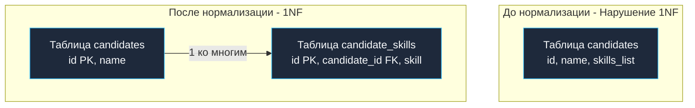

## Фундамент реляционной строгости

В предыдущей статье [[9. Нормализация. Введение]] мы наглядно убедились, к каким разрушительным аномалиям и деградации оборудования приводит хранение неструктурированных, хаотичных данных. Чтобы навести в схеме идеальный инженерный порядок, мы должны пропустить ее через последовательную систему математических сит — **Нормальные формы (Normal Forms)**.

**Первая нормальная форма (1NF)** — это краеугольный камень всей реляционной архитектуры. Если таблица не удовлетворяет требованиям 1NF, она в принципе не может считаться реляционной. С точки зрения математики Эдгара Кодда, 1NF определяет фундаментальную демаркационную линию: границу между сырым неструктурированным потоком байт и строгим математическим отношением (**Relation**).

---

## Четыре правила 1NF

Чтобы СУБД признала таблицу находящейся в Первой нормальной форме, схема обязана безоговорочно отвечать четырем классическим правилам:

1. **Атомарность атрибутов (Скалярность):** В каждой ячейке (на пересечении конкретной строки и конкретного столбца) должно храниться строго *одно* логически неделимое, атомарное значение. Никаких списков через запятую, битовых упаковок разнородных полей или вложенных массивов.
2. **Однородность домена:** Все значения в пределах одного столбца обязаны строго принадлежать к единому домену (типу данных). Недопустимо хранить число `42` вперемешку со строками «нет данных» или «неизвестно» в колонке типа `INTEGER`.
3. **Уникальность кортежей:** В отношении не может существовать двух абсолютно неразличимых строк-дубликатов. Это требование выполняется автоматически при назначении корректного Первичного ключа (см. [[6. Первичные и внешние ключи]]).
4. **Независимость от порядка:** Ни физический порядок кортежей на страницах Heap-файла, ни порядок объявления столбцов в DDL не должны влиять на результат выборки и корректность логики прикладного сервиса.

Наиболее часто разработчики спотыкаются о самое первое правило: требование **Атомарности**.

---

## Антипаттерн: Мультизначные атрибуты

Представим систему подбора IT-персонала. Начинающий разработчик проектирует таблицу кандидатов. Привыкнув оперировать структурами языка Go (где слайс `[]string` является совершенно естественной конструкцией), он не задумываясь переносит этот список в базу данных в виде строки с разделителями-запятыми:

| id | name | skills (Нарушение 1NF!) |
| :--- | :--- | :--- |
| 1 | Alice | Go, PostgreSQL, Docker |
| 2 | Bob | PHP, MySQL, Redis, Go |

С точки зрения кода на Go, этот прием кажется простым: вычитал строку из базы, вызвал стандартную функцию `strings.Split(skills, ",")` и получил готовый слайс. Однако с точки зрения архитектуры базы данных и дисковой подсистемы — это инженерная катастрофа.

### Mechanical Sympathy: Почему списки убивают БД

Представьте, что перед нашим сервисом встала элементарная бизнес-задача: найти всех кандидатов, владеющих языком `Go`.  
Поскольку навыки упакованы в сырой текст через запятую, единственный доступный SQL-запрос выглядит так:
```sql
SELECT * FROM candidates WHERE skills LIKE '%Go%';
```

> [!info] Под капотом
> Классический B-Tree индекс (см. [[2. B Tree индекс под капотом]]) работает по принципу отсортированного словаря. Он мгновенно находит записи, начинающиеся с заданного префикса (например, предикат `LIKE 'Go%'`).  
> 
> Но когда в начале поискового шаблона стоит символ подстановки `%` (`LIKE '%Go%'`), **B-Tree индекс становится абсолютно бесполезен**. Оптимизатор СУБД не может опереться на бинарный поиск по дереву.  
> 
> База данных вынуждена переключиться в режим тотального последовательного сканирования — **Sequential Scan (Full Table Scan)**:
> 1. СУБД через системные вызовы ядра вычитывает с накопителя в **Buffer Pool** абсолютно все страницы таблицы от первого до последнего байта.
> 2. Если поле `skills` разрослось и было вытеснено в служебную область **TOAST**, движок на лету распаковывает сжатые страницы каждого кортежа.
> 3. Ядра CPU в цикле посимвольно прогоняют алгоритмы поиска подстроки по миллионам текстовых записей.  
> 
> На таблице в несколько миллионов кандидатов такой безобидный запрос сожжет все доступные ядра процессора, парализует Buffer Pool и обрушит пропускную способность всей базы данных.

---

## Приведение к 1NF: Разделяй и властвуй

Чтобы привести структуру к строгой Первой нормальной форме, мы обязаны ликвидировать повторяющиеся группы значений внутри одной ячейки. Для этого мультизначный атрибут выносится в отдельную, дочернюю таблицу со связью «один-ко-многим», поддержанной внешним ключом:



Теперь поиск кандидатов со знанием `Go` трансформируется в изящную операцию:
```sql
SELECT candidate_id FROM candidate_skills WHERE skill = 'Go';
```

Повесив обычный B-Tree индекс на колонку `skill`, СУБД выполнит этот запрос за считанные микросекунды (**Index Scan**), считав с диска ровно 1–2 страницы памяти.

---

## Impedance Mismatch: Маппинг 1NF в Go

Здесь мы снова встречаемся с классическим конфликтом моделей: в реляционной базе данных навыки кандидата нормализованы и распределены по отдельным строкам дочерней таблицы, тогда как в Go-сервисе доменная модель требует единую структуру со слайсом `[]string`.

Идиоматичный подход в Go при работе с пакетом `database/sql` заключается в выполнении объединяющего запроса `JOIN` и аккуратной потоковой агрегации строк с помощью вспомогательной хэш-таблицы (map):

```go
package main

import (
	"context"
	"database/sql"
)

// Candidate представляет собой агрегат из двух нормализованных таблиц
type Candidate struct {
	ID     int64
	Name   string
	Skills []string
}

func fetchCandidates(ctx context.Context, db *sql.DB) ([]Candidate, error) {
	// JOIN нормализованных данных (1 ко многим)
	query := `
		SELECT c.id, c.name, s.skill 
		FROM candidates c
		LEFT JOIN candidate_skills s ON c.id = s.candidate_id
		ORDER BY c.id
	`
	
	rows, err := db.QueryContext(ctx, query)
	if err != nil {
		return nil, err
	}
	defer rows.Close()

	// Используем мапу для агрегации слайса навыков (устранение дубликатов строк кандидата)
	lookup := make(map[int64]*Candidate)
	var result []Candidate

	for rows.Next() {
		var id int64
		var name string
		var skill sql.NullString // Учитываем LEFT JOIN (навыков может не быть)

		if err := rows.Scan(&id, &name, &skill); err != nil {
			return nil, err
		}

		cand, exists := lookup[id]
		if !exists {
			// Создаем нового кандидата
			lookup[id] = &Candidate{ID: id, Name: name, Skills: make([]string, 0)}
			cand = lookup[id]
		}

		if skill.Valid {
			cand.Skills = append(cand.Skills, skill.String)
		}
	}

	if err := rows.Err(); err != nil {
		return nil, err
	}

	// Переливаем из мапы в итоговый слайс (теряя порядок мапы, но сохраняя логику)
	for _, c := range lookup {
		result = append(result, *c)
	}

	return result, nil
}
```

> [!tip] Собеседование
> **Вопрос:** Если каноническая 1NF категорически запрещает нескалярные типы, означает ли это, что использование типов `JSONB` или нативных массивов (`TEXT[]`) в современных СУБД (PostgreSQL) нарушает Первую нормальную форму?  
> **Ответ:** Строго с точки зрения академической теории Кодда — безусловно, это прямое и грубое нарушение 1NF, так как атрибут перестает быть неделимым скаляром.  
> Однако в промышленной инженерии это осознанный и прагматичный компромисс. PostgreSQL предоставляет специализированные **GIN индексы** (Generalized Inverted Index), которые умеют индексировать внутренние элементы массивов и ключи JSONB. Это позволяет выполнять быстрый точечный поиск без сканирования всей таблицы (Sequential Scan). Использование `JSONB` оправдано в тех случаях, когда схема вложенных данных динамична, слабо структурирована и не участвует в жестких внешних связях (Foreign Keys) с другими таблицами.

## Итог

1. **Первая нормальная форма (1NF)** — фундамент реляционной дисциплины, требующий скалярности (атомарности) значений в ячейках и уникальности строк.
2. Хранение списков через запятую в текстовых полях — тяжелейший антипаттерн, делающий B-Tree индексы бессильными и обрекающий СУБД на изнурительный Sequential Scan.
3. Приведение к 1NF осуществляется вынесением повторяющихся списков в отдельную таблицу со связью «один-ко-многим» и построением B-Tree индекса по значению.
4. В Go-коде мы компенсируем Impedance Mismatch потоковой агрегацией строк из `JOIN` в слайсы сущностей через хэш-таблицы.
5. Использование типов `JSONB` и массивов в PostgreSQL — это осознанная денормализация, допустимая только при наличии специализированных GIN-индексов.

Мы очистили ячейки от списков и гарантировали атомарность каждого поля. Однако внутри наших таблиц все еще может скрываться неочевидное дублирование, возникающее при использовании составных первичных ключей. В следующей главе мы избавимся от частичных функциональных зависимостей: переходим к [[11. Вторая нормальная форма 2NF]].