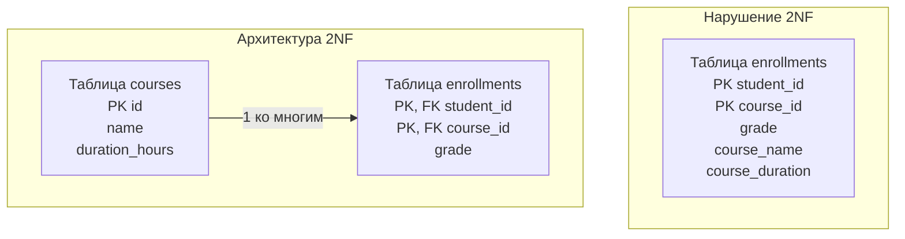

## Анатомия составных ключей и частичных зависимостей

В предыдущей главе [[10. Первая нормальная форма 1NF]] мы навели в схеме данных элементарный порядок: ликвидировали списки через запятую в ячейках, гарантировали атомарность атрибутов и уникальность кортежей. Однако 1NF наводит чистоту исключительно *внутри* отдельных столбцов. Она никоим образом не защищает систему от масштабного дублирования данных на уровне всей таблицы.

Следующий качественный шаг в архитектурном проектировании схем — **Вторая нормальная форма (2NF)**.

В академических учебниках определение 2NF звучит безупречно строго: *Отношение находится во второй нормальной форме, если оно удовлетворяет требованиям 1NF, и каждый неключевой атрибут функционально полно (неприводимо) зависит от всего первичного ключа.*

В практическом инженерном преломлении это правило формулируется предельно наглядно:  
**Если у вас составной Первичный ключ (Primary Key, PK), состоящий из двух или более колонок, то все остальные атрибуты строки обязаны описывать связь этих колонок целиком, а не зависеть лишь от одного фрагмента ключа.**

> [!NOTE] Важное инженерное правило
> Если Первичный ключ таблицы является простым и состоит всего из одного столбца (например, автоинкрементный `id BIGINT`), то любая таблица, находящаяся в 1NF, **автоматически удовлетворяет требованиям 2NF**. Вся глубина и подводные камни 2NF раскрываются именно в архитектуре связей «Многие-ко-многим» (Many-to-Many).

---

## Проблема: Частичная зависимость

Рассмотрим хрестоматийный сценарий образовательной платформы: студенты записываются на учебные курсы. Начинающий разработчик создает таблицу (уже соблюдая 1NF, без вложенных массивов), чтобы фиксировать факт зачисления и успеваемость:

| student_id (PK) | course_id (PK) | grade | course_name | course_duration_hours |
| :--- | :--- | :--- | :--- | :--- | :--- |
| 1 | 101 | A | Go Backend | 40 |
| 1 | 102 | B | System Design | 20 |
| 2 | 101 | C | Go Backend | 40 |

В этой таблице первичный ключ является составным: кортеж `(student_id, course_id)`. Только комбинация студента и курса уникально адресует конкретную оценку (`grade`).

**В чем же заключается грубое нарушение 2NF?**
* Атрибут `grade` (оценка) зависит от *всего* составного ключа целиком: оценка выставляется конкретному студенту по конкретному курсу. Здесь всё корректно.
* Однако атрибуты `course_name` (название курса) и `course_duration_hours` (продолжительность) функционально зависят **только** от `course_id`. Как называется курс и сколько часов он длится, абсолютно никак не зависит от того, какой именно студент на него записался!

Такая ситуация в реляционной алгебре называется **Частичной зависимостью (Partial Dependency)**: неключевой столбец зависит лишь от части составного первичного ключа.

### Mechanical Sympathy: Почему это убивает базу?

Неискушенному инженеру может показаться: ну дублируется строка "Go Backend" и число 40 в тысячах записей разных студентов, современные диски дешевы. В чем реальная опасность для высоконагруженной СУБД?

1.  **Write Penalty (Тяжелый штраф на запись):** Если методисты решат изменить длительность курса "Go Backend" с 40 до 50 часов, СУБД придется выполнить массивный запрос:  
    `UPDATE enrollments SET course_duration_hours = 50 WHERE course_id = 101`.  
    Если на курс записано 50 000 человек, база будет вынуждена переписать 50 000 строк! Это сгенерирует мегабайты дельт в журнале предзаписи [[8. WAL. Write Ahead Log]], перегрузит сеть репликации и наложит эксклюзивные блокировки на строки (**Row-level Lock**), заблокировав параллельные транзакции студентов.
2.  **I/O Вампиризм и деградация кэша:** Дублирующиеся текстовые поля раздувают физический размер каждого кортежа. В результате на одну 8-килобайтную страницу ОЗУ помещается в 3–4 раза меньше полезных записей. Чтобы рассчитать средний балл студентов, СУБД придется вычитывать с диска в разы больше страниц, провоцируя Cache Miss и вымывая из Buffer Pool «горячие» данные.

---

## Приведение к 2NF: Выделение сущностей

Чтобы привести схему к строгой Второй нормальной форме, мы обязаны хирургически отсечь атрибуты с частичной зависимостью и вынести их в отдельную родительскую таблицу.

В нашем сценарии мы выделяем независимую таблицу `courses`, а исходная таблица `enrollments` очищается от дублирования и превращается в чистую таблицу связей (**Junction Table / Join Table**):



Теперь таблица `enrollments` хранит исключительно атрибуты самой связи (оценку `grade`). Названия и характеристики курсов хранятся в таблице `courses` строго в одном экземпляре. Любое изменение метаданных курса превращается в молниеносный `UPDATE` ровно одной строки.

---

> [!info] Под капотом: Составные ключи и B-Tree индексы
> Когда вы объявляете составной первичный ключ `PRIMARY KEY (student_id, course_id)`, СУБД не строит два отдельных индекса. Она возводит **один** составной B-Tree индекс, внутри которого ключи физически склеены в бинарный кортеж.  
> 
> Физический порядок колонок в определении составного ключа имеет решающее значение! B-Tree деревья подчиняются правилу **Самого левого префикса (Leftmost Prefix Rule)**:  
> * Если ключ объявлен как `(student_id, course_id)`, движок упорядочивает дерево сначала по `student_id`, а затем внутри каждого студента — по `course_id`.  
> * Запрос с условием `WHERE student_id = 1` выполнит молниеносный спуск по B-Tree индексу.  
> * Однако запрос с условием `WHERE course_id = 101` **вообще не сможет использовать данный индекс**! СУБД придется сканировать всё дерево целиком, так как значения `course_id` размазаны по разным ветвям.  
> 
> *Вывод системного архитектора:* Если ваша бизнес-логика требует двустороннего поиска (и по студентам, и по курсам), вы обязаны создать второй, инвертированный индекс:  
> `CREATE INDEX idx_course_student ON enrollments (course_id, student_id)`.  
> Подробнее об этом мы поговорим в главе [[5. Composite индексы]].

---

## Архитектура Many-to-Many в Go

Взаимодействуя с нормализованной связью «Многие-ко-многим» в Go, мы формируем SQL-запрос с операцией `JOIN`, чтобы получить необходимые агрегированные данные за одно сетевое обращение к пулу СУБД:

```go
package main

import (
	"context"
	"database/sql"
	"fmt"
)

// CourseRecord - структура, отражающая данные из связи Многие-ко-многим
type CourseRecord struct {
	CourseID   int64
	CourseName string
	Grade      sql.NullString // Оценки может еще не быть
}

func GetStudentCourses(ctx context.Context, db *sql.DB, studentID int64) ([]CourseRecord, error) {
	// Декларативный SQL-запрос, собирающий нормализованные данные
	// Оптимизатор использует индекс (student_id, course_id) в таблице enrollments
	query := `
		SELECT c.id, c.name, e.grade
		FROM enrollments e
		JOIN courses c ON e.course_id = c.id
		WHERE e.student_id = $1
	`
	
	rows, err := db.QueryContext(ctx, query, studentID)
	if err != nil {
		return nil, fmt.Errorf("ошибка запроса курсов: %w", err)
	}
	defer rows.Close()

	var records []CourseRecord
	for rows.Next() {
		var rec CourseRecord
		// Маппим данные прямо в структуру
		if err := rows.Scan(&rec.CourseID, &rec.CourseName, &rec.Grade); err != nil {
			return nil, fmt.Errorf("ошибка сканирования: %w", err)
		}
		records = append(records, rec)
	}

	if err := rows.Err(); err != nil {
		return nil, fmt.Errorf("ошибка итерации: %w", err)
	}

	return records, nil
}
```

---

> [!warning] Ловушка / Gotcha: Иллюзия Суррогатного ключа
> Нередко начинающие разработчики пытаются обойти требования 2NF хитрым трюком: *«Правило 2NF относится только к составным ключам. Значит, я просто добавлю суррогатный `id BIGINT PRIMARY KEY` в таблицу `enrollments`, ключ станет простым, и таблица автоматически попадет во 2NF!»*.
> 
> ```sql
> -- ПСЕВДО-РЕШЕНИЕ:
> CREATE TABLE enrollments (
>     id BIGINT PRIMARY KEY, -- Искусственный ключ
>     student_id BIGINT,
>     course_id BIGINT,
>     grade VARCHAR,
>     course_name VARCHAR -- Оставили дублирование
> );
> ```
> Чисто формально (буквоедски) — да, таблица удовлетворяет академическому определению 2NF, поскольку атрибут `course_name` функционально зависит от суррогатного `id`.  
> **Но с инженерной точки зрения это самообман.** Вы обманули математическую формулу, но ни на гран не решили физическую проблему дублирования данных на диске. Название курса по-прежнему повторяется тысячи раз, раздувая страницы памяти и создавая угрозу аномалий обновления.  
> 
> *Инженерное правило:* Добавление искусственного первичного ключа в таблицу связей не отменяет необходимости выносить функционально зависимые сущности в отдельные таблицы.

## Итог

1.  **Вторая нормальная форма (2NF)** ликвидирует частичные функциональные зависимости: неключевые атрибуты обязаны зависеть от составного первичного ключа целиком.
2.  Для таблиц с простым первичным ключом из одной колонки выполнение 1NF автоматически гарантирует соблюдение 2NF.
3.  Нарушение 2NF влечет серьезный Write Penalty, блокировки строк (Row-level Lock), взрывной рост WAL и деградацию дискового ввода-вывода.
4.  Лекарство от нарушения 2NF — декомпозиция схемы с выделением классической таблицы связей (Junction Table) со связью «Многие-ко-многим».
5.  Помните о Leftmost Prefix Rule для составных B-Tree индексов: порядок колонок в составном ключе диктует доступность индекса для поисковых предикатов.

Мы устранили частичные зависимости от фрагментов ключа. Но что произойдет, если неключевой атрибут зависит от первичного ключа не напрямую, а через другой неключевой атрибут? В следующей главе мы разберем главный финальный рубеж нормализации для большинства Highload-систем: переходим к [[12. Третья нормальная форма 3NF]].