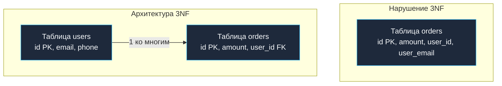

## Клятва Кодда и транзитивные зависимости

В предыдущих главах мы последовательно наводили порядок в схеме данных: сначала избавились от массивов и списков в ячейках ([[10. Первая нормальная форма 1NF]]), затем устранили частичные зависимости от фрагментов составного ключа ([[11. Вторая нормальная форма 2NF]]). Казалось бы, данные уже структурированы. Однако внутри таблицы все еще может притаиться опасное дублирование, способное под нагрузкой разрушить консистентность системы.

**Третья нормальная форма (3NF)** — это признанный золотой стандарт промышленного проектирования реляционных баз данных. В 95% архитектурных решений для транзакционных OLTP-систем процесс нормализации останавливают именно по достижении 3NF.

В 1983 году американский исследователь баз данных Билл Кент (Bill Kent) обессмертил суть нормализации, сформулировав изящный мнемонический парафраз классической судебной клятвы:
> *«Каждый неключевой атрибут должен зависеть от ключа, от всего ключа и **ни от чего, кроме ключа**. Да поможет мне Кодд».*

(Эдгар Кодд — создатель математической реляционной модели данных).

Фундаментальный смысл Третьей нормальной формы заключается в полном устранении **Транзитивных зависимостей (Transitive Dependencies)**.

---

## Что такое транзитивная зависимость?

Транзитивная зависимость возникает в том случае, когда неключевой атрибут `C` функционально зависит от неключевого атрибута `B`, который, в свою очередь, зависит от первичного ключа `A` (`A -> B -> C`). То есть `C` зависит от `A` через посредника.

Рассмотрим хрестоматийную таблицу заказов `orders`, где первичным ключом (`PK`) служит `order_id`:

| order_id (PK) | amount | user_id | user_email | user_phone |
| :--- | :--- | :--- | :--- | :--- | :--- |
| 1 | 1500 | 42 | bob@go.dev | 555-01 |
| 2 | 300 | 42 | bob@go.dev | 555-01 |
| 3 | 900 | 88 | alice@go.dev | 555-02 |

Проанализируем функциональные зависимости этой структуры:
1.  Атрибут `amount` (сумма чека) строго и напрямую зависит от `order_id`. Сумма относится к конкретному чеку.
2.  Атрибут `user_id` строго зависит от `order_id`. Заказ совершен конкретным покупателем.
3.  А вот атрибуты `user_email` и `user_phone` функционально зависят **исключительно от `user_id`**! Они никак не определяются номером заказа. Почта Боба остается почтой Боба независимо от того, купил он книгу или отменил заказ.

Перед нами классическая транзитивная цепочка: `order_id` $\to$ `user_id` $\to$ `user_email`. Это прямое и грубое нарушение Третьей нормальной формы.

### Mechanical Sympathy: Почему транзитивность опасна?

Казалось бы, хранить email покупателя прямо в строке заказа очень удобно для аналитиков — не нужно писать JOIN. Однако с точки зрения физического движка СУБД и надежности данных это порождает тяжелые проблемы:

1.  **Write Amplification (Усиление записи):** Если пользователь Боб решит изменить свой email, бэкенду придется обновить тысячи его исторических заказов за все прошлые годы. В высоконагруженных системах старые заказы часто выносятся на медленные накопители или в архивные партиции. Обновление сотен тысяч холодных страниц спровоцирует чудовищный дисковый I/O и переполнит журнал транзакций.
2.  **Потеря консистентности (Рассинхронизация истины):** Если из-за падения ноды или дедлока транзакция обновления прервется на середине, в базе данных окажутся заказы одного и того же `user_id`, но с разными `user_email`. Какой из них актуален? База данных навсегда теряет статус единого источника правды (**Single Source of Truth**).
3.  **Data Bloat и вымывание кэша:** Дублирующиеся строки `user_email` и `user_phone` раздувают физический размер кортежей, вытесняя из оперативной памяти (**Buffer Pool**) полезные страницы данных и снижая производительность всей СУБД.

---

## Приведение к 3NF: Разрубание узла

Чтобы привести схему к строгой 3NF, мы обязаны разрубить транзитивную цепочку: вынести атрибуты-посредники в отдельную родительскую таблицу `users`, а в исходной таблице `orders` оставить только внешний ключ `user_id` (**Foreign Key**):



Теперь `user_email` привязан строго к первичному ключу таблицы `users`. В схеме ликвидировано дублирование, а смена email превращается в атомарную модификацию ровно одной строки, занимающую считанные микросекунды.

---

## 3NF в архитектуре микросервисов на Go

В классическом монолите переход к 3NF тривиален: мы просто пишем `JOIN` между таблицами `orders` и `users`. Однако в современной распределенной архитектуре с паттерном **Database-per-Service** ситуация кардинально меняется.

Таблица `orders` размещается в базе данных сервиса заказов (`OrderService`), а таблица `users` — в изолированной базе сервиса пользователей (`UserService`).

> [!warning] Ловушка / Gotcha
> Вы физически не можете выполнить реляционный `JOIN` между базами данных двух независимых микросервисов. Транзитивная зависимость (`user_id`) превращается в распределенную ссылку по сети.

Как в таком случае сформировать для клиента (например, мобильного приложения или дашборда) обогащенный список заказов с контактными данными пользователей?

Для этого применяется архитектурный паттерн **API Composition (Композиция на уровне API)**. В Go эта задача элегантно решается параллельными сетевыми запросами с использованием пакета `golang.org/x/sync/errgroup` на уровне API Gateway или BFF (Backend for Frontend):

```go
package main

import (
	"context"
	"fmt"

	"golang.org/x/sync/errgroup"
)

// DTO для ответа клиенту
type OrderView struct {
	OrderID   int64
	Amount    int
	UserID    int64
	UserEmail string // Данные из другого микросервиса
}

type Order struct {
	ID     int64
	Amount int
	UserID int64
}

type User struct {
	ID    int64
	Email string
}

// Псевдо-клиенты микросервисов
type OrderClient interface { GetOrders(ctx context.Context) ([]Order, error) }
type UserClient interface { GetUsersByIDs(ctx context.Context, ids []int64) (map[int64]User, error) }

func GetEnrichedOrders(ctx context.Context, ordersClient OrderClient, usersClient UserClient) ([]OrderView, error) {
	// 1. Получаем заказы
	orders, err := ordersClient.GetOrders(ctx)
	if err != nil { return nil, err }

	if len(orders) == 0 { return []OrderView{}, nil }

	// 2. Собираем уникальные user_id (устраняем дублирование запросов)
	userIDsMap := make(map[int64]struct{})
	for _, o := range orders {
		userIDsMap[o.UserID] = struct{}{}
	}
	var userIDs []int64
	for id := range userIDsMap {
		userIDs = append(userIDs, id)
	}

	// 3. Асинхронно идем в сервис пользователей (в реальном коде можно делать параллельно с другими задачами)
	var users map[int64]User
	g, gCtx := errgroup.WithContext(ctx)
	g.Go(func() error {
		var uErr error
		users, uErr = usersClient.GetUsersByIDs(gCtx, userIDs)
		return uErr
	})

	if err := g.Wait(); err != nil {
		return nil, fmt.Errorf("ошибка обогащения данных: %w", err)
	}

	// 4. In-memory JOIN (Склейка данных в памяти Go)
	var result []OrderView
	for _, o := range orders {
		email := "unknown" // Fallback если юзер удален
		if u, exists := users[o.UserID]; exists {
			email = u.Email
		}
		
		result = append(result, OrderView{
			OrderID:   o.ID,
			Amount:    o.Amount,
			UserID:    o.UserID,
			UserEmail: email,
		})
	}

	return result, nil
}
```

Этот пример наглядно демонстрирует, как соблюдение 3NF переносит вычислительную сложность объединения данных из базы данных на масштабируемые stateless-ноды бэкенда на Go.

> [!tip] Собеседование
> **Вопрос:** В чем принципиальная разница между 2NF и 3NF?  
> **Ответ:**  
> * **2NF** устраняет **частичные функциональные зависимости**: ни один неключевой столбец не должен зависеть от *части* составного первичного ключа.  
> * **3NF** устраняет **транзитивные функциональные зависимости**: ни один неключевой столбец не должен зависеть от *другого неключевого* столбца (зависимость только напрямую от первичного ключа).  
> Обе формы нацелены на исключение избыточности данных и защиту от аномалий обновления, удаления и вставки.

## Итог

1.  **Третья нормальная форма (3NF)** категорически запрещает транзитивные зависимости: каждый неключевой атрибут обязан зависеть исключительно от первичного ключа напрямую.
2.  3NF — признанный индустриальный стандарт для транзакционных баз данных (OLTP), гарантирующий, что любая бизнес-характеристика сущности хранится строго в одном месте.
3.  Оборотная сторона медали: необходимость соединения данных. В монолитах это классический SQL `JOIN`, в микросервисах — распределенный сбор данных через In-memory API Composition с использованием `errgroup`.

Для подавляющего большинства информационных систем нормализации до уровня 3NF более чем достаточно. Однако в математической теории существуют редкие краевые ситуации, когда даже в таблице 3NF возможны аномалии из-за перекрывающихся составных ключей. В следующей главе мы познакомимся с более строгими теоретическими формами: переходим к [[13. BCNF и более высокие нормальные формы]].