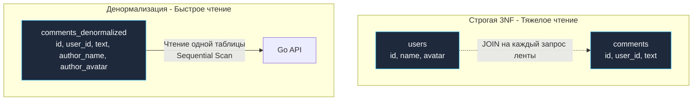

## Осознанное разрушение идеальной схемы

На протяжении предыдущих глав, начиная с [[9. Нормализация. Введение]] и вплоть до строгой [[13. BCNF и более высокие нормальные формы]], мы возводили математически безупречный собор реляционной чистоты. Мы дробили сущности, боролись с избыточностью, ликвидировали малейшие намеки на аномалии модификации и выстраивали строгие ссылочные связи.

Но в суровом мире высоконагруженных систем (Highload) академическая чистота неизбежно сталкивается с физическими ограничениями аппаратного обеспечения: задержками шины памяти, пропускной способностью дисковых контроллеров и законами сетевого распространения пакетов.

**Денормализация** — это процесс *осознанного, контролируемого нарушения нормальных форм* с целью кардинального ускорения операций чтения (Read Performance) за счет усложнения логики записи (Write Penalty) и контролируемой избыточности дискового хранения.

> [!IMPORTANT] Принцип зрелого инженера
> Денормализация — это скальпель хирурга, а не топор дровосека. Ее категорически запрещено применять «на глаз» или на старте проектирования. Зрелый инженер всегда начинает со строгой Третьей нормальной формы (3NF), и лишь затем, опираясь на метрики APM, профилирование планов запросов (`EXPLAIN ANALYZE`) и реальные узкие места дискового ввода-вывода, точечно денормализует самые раскаленные участки системы.

---

## Mechanical Sympathy: Почему JOIN становится врагом

Реляционные СУБД великолепно оптимизированы для выполнения соединений (`JOIN`). Планировщик строит высокоэффективные деревья выполнения, выбирая между алгоритмами Hash Join, Merge Join и Nested Loop. Однако когда размер вашей базы переваливает за сотни миллионов строк, а трафик бэкенда достигает десятков тысяч RPS, каноническая 3NF начинает неумолимо деградировать по трем физическим причинам:

1. **CPU и RAM Overhead:** Чтобы отрендерить экран профиля пользователя (имя, аватарка, 10 последних постов, число лайков, названия тегов и статус подписки), СУБД вынуждена поднять и сопоставить строки из 5–6 независимых таблиц. Это требует загрузки сотен разнородных страниц памяти в Buffer Pool, построения массивных хэш-таблиц в оперативной памяти и постоянного переключения контекста ядер CPU.
2. **Проблема Random I/O:** В нормализованной схеме данные каждой таблицы физически изолированы в собственных Heap-файлах. Сборка одной комплексной бизнес-сущности провоцирует десятки случайных дисковых чтений (Random Read), что даже на современных накопителях NVMe SSD в десятки раз уступает последовательному чтению блоков (Sequential Read).
3. **Горизонтальное шардирование (Sharding):** Если таблица `users` размещена на кластере в одном дата-центре, а таблица `posts` шардирована по десяткам серверов в других стойках (см. [[4. Sharding]]), СУБД физически не способна выполнить мгновенный распределенный SQL `JOIN`. Единственный путь сохранить миллисекундные SLA — осознанная денормализация.

---

## Паттерны денормализации

Рассмотрим ключевые инженерные приемы денормализации, применяемые в высоконагруженных бэкенд-системах на Go.

### 1. Кэширование агрегаций (Счетчики)

**Проблема (3NF):** Чтобы отобразить количество комментариев под постом, сервис вынужден выполнять агрегационный запрос:  
```sql
SELECT COUNT(*) FROM comments WHERE post_id = 42
```
На популярном вирусном посте с 50 000 комментариев этот запрос (даже опираясь на B-Tree индекс) будет интенсивно нагружать CPU и страницы памяти при каждом обновлении страницы тысячами параллельных пользователей.

**Решение:** Мы осознанно нарушаем требования 2NF/3NF и внедряем материализованное поле `comments_count BIGINT` непосредственно в таблицу `posts`. Мы вводим избыточность (ведь количество комментариев вычислимо), но превращаем операцию чтения поста и его счетчика в молниеносное чтение ровно одной строки с диска за сложность $O(1)$.

> [!warning] Ловушка / Gotcha
> Расплатой за денормализацию счетчика становится резкое усложнение записи (Write Penalty). Теперь при каждой вставке или удалении комментария прикладной код обязан поддерживать инвариант счетчика. Любая забытая строчка кода приведет к рассинхронизации данных.

### 2. Дублирование атрибутов для избежания JOIN

**Проблема (3NF):** При формировании ленты комментариев клиенту необходимо отобразить текст комментария, а также имя автора и ссылку на его аватар. В нормализованной базе это влечет за собой соединение:  
`JOIN users ON comments.user_id = users.id`.

**Решение:** Продублировать неизменяемые (или редко изменяемые) поля `author_name` и `author_avatar_url` прямо в кортеж таблицы `comments`.  
Теперь лента комментариев вычитывается тривиальным плоским запросом:  
```sql
SELECT * FROM comments WHERE post_id = 42 ORDER BY created_at DESC
```
без единого обращения к таблице пользователей.



### 3. Материализованные поля (Снапшоты)

Иногда денормализация диктуется самим бизнесом.
В таблице `orders` (заказы) мы должны хранить цену товара на *момент покупки*. Если мы оставим нормализованную связь `orders.product_id -> products.id` и будем всегда делать JOIN для получения цены, то сезонное изменение цен в товарном каталоге `products` задним числом изменит стоимость всех исторических заказов! 
Поэтому мы обязаны скопировать (денормализовать) поле `price` в таблицу связи `order_items`.

### 4. Использование JSONB для связей "Один-ко-многим"

Вместо проектирования отдельной дочерней таблицы для слабоструктурированных параметров товара (размеры, технические спецификации, цвет), которые читаются всегда вместе с товаром, мы упаковываем их в единую колонку `attributes JSONB`. Это намеренное нарушение [[10. Первая нормальная форма 1NF]], которое радикально снижает фрагментацию страниц и нагрузку на Buffer Pool базы данных.

---

## Денормализация в Go: Управление консистентностью

Главный архитектурный вызов при денормализации — борьба с рассинхронизацией данных (**Data Inconsistency**).  
Если пользователь обновляет свой аватар, как актуализировать миллионы его исторических комментариев, куда этот аватар был продублирован?

В промышленной разработке на Go применяются два проверенных паттерна:

### Подход 1: Синхронное обновление (Транзакции)

Применяется для критичных локальных операций (например, поддержание счетчика комментариев). Мы опираемся на строгие ACID-транзакции пакета `database/sql`:

```go
package main

import (
	"context"
	"database/sql"
	"fmt"
)

// AddComment добавляет комментарий и атомарно обновляет денормализованный счетчик
func AddComment(ctx context.Context, db *sql.DB, postID int64, text string) error {
	tx, err := db.BeginTx(ctx, nil)
	if err != nil {
		return err
	}
	// Важно: defer Rollback безопасен, если tx.Commit() уже прошел успешно, 
	// Rollback просто вернет ошибку sql.ErrTxDone, которую мы игнорируем.
	defer tx.Rollback()

	// 1. Вставляем комментарий
	_, err = tx.ExecContext(ctx, "INSERT INTO comments (post_id, text) VALUES ($1, $2)", postID, text)
	if err != nil {
		return fmt.Errorf("ошибка вставки комментария: %w", err)
	}

	// 2. Обновляем денормализованный счетчик.
	// Используем атомарный инкремент на уровне БД (post_id = post_id + 1), 
	// избегая Race Condition и необходимости делать SELECT FOR UPDATE в Go.
	res, err := tx.ExecContext(ctx, "UPDATE posts SET comments_count = comments_count + 1 WHERE id = $1", postID)
	if err != nil {
		return fmt.Errorf("ошибка обновления счетчика: %w", err)
	}
	
	rowsAffected, _ := res.RowsAffected()
	if rowsAffected == 0 {
		return fmt.Errorf("пост с id %d не найден", postID)
	}

	return tx.Commit()
}
```

Обратите внимание: мы используем атомарный инкремент непосредственно в SQL (`comments_count = comments_count + 1`), избегая вычитки счетчика в память Go и полностью исключая состояние гонки без блокировок `SELECT ... FOR UPDATE`.

### Подход 2: Асинхронное обновление (Eventual Consistency)

Если необходимо обновить аватар пользователя в 5 миллионах его комментариев, попытка выполнить это синхронно в одной транзакции заблокирует сотни тысяч страниц памяти и неминуемо завершится таймаутом.

В Highload-системах мы переходим к парадигме **Eventual Consistency (Согласованность в конечном счете)**:
1. В основной транзакции сервис обновляет запись в таблице `users`.
2. Событие `UserAvatarUpdated` сохраняется в локальную транзакционную очередь через паттерн Transactional Outbox (см. [[11. Outbox pattern]]) и отправляется в брокер сообщений (Kafka / RabbitMQ).
3. Фоновые воркеры на Go (Background Workers) вычитывают события и неспешно, небольшими пачками (батчами по 500–1000 строк) обновляют денормализованные поля `author_avatar_url` в таблице `comments`. Некоторое время старые комментарии будут содержать прежний аватар, но инфраструктура избежит пиковых блокировок и деградации пропускной способности.

> [!tip] Собеседование
> **Вопрос:** Если JOIN-ы создают узкие места под высокой нагрузкой, почему бы сразу не перенести систему на NoSQL-базу (MongoDB, Cassandra), изначально спроектированную денормализованной?  
> **Ответ:** Документные и колоночные NoSQL-системы действительно оптимизированы под плоские структуры, но за это приходится платить утратой полноценных межтабличных ACID-транзакций, строгости ограничений целостности (см. [[7. Ограничения целостности данных]]) и гибкости произвольных ad-hoc запросов.  
> В высоконагруженных архитектурах стандартом стал гибридный подход: мастер-данные сохраняются в строгой 3NF в транзакционном PostgreSQL, а материализованные денормализованные представления (Read Models) асинхронно реплицируются в специализированные хранилища (Redis, Elasticsearch, ClickHouse) по паттерну **CQRS** (Command Query Responsibility Segregation).

## Итог

1.  **Денормализация** — осознанное инженерное решение по внедрению контролируемой избыточности ради многократного ускорения операций чтения ценой штрафа на запись (Write Penalty).
2.  Ключевые приемы: материализация счетчиков, дублирование редко мутирующих атрибутов для исключения JOIN, фиксация снапшотов цен в `order_items` и упаковка динамических свойств в `attributes JSONB`.
3.  Главная плата за денормализацию — угроза рассинхронизации данных (Data Inconsistency). Ее компенсация переносится на прикладной код Go через синхронные транзакции либо асинхронные воркеры (Eventual Consistency).
4.  Сначала — строгая 3NF; денормализация — строго точечно по результатам профилирования реальной нагрузки.

Мы завершили фундаментальный цикл, посвященный архитектурной схемотехнике реляционных баз данных. Мы умеем проектировать как математически безупречные (3NF/BCNF), так и предельно быстрые (денормализованные) схемы. Но как передать эти инженерные решения коллегам по команде? Схему из сотен таблиц невозможно удержать в голове без наглядного чертежа. В следующей главе мы научимся профессионально моделировать и визуализировать архитектуру данных: переходим к [[15. ER диаграммы и моделирование данных]].